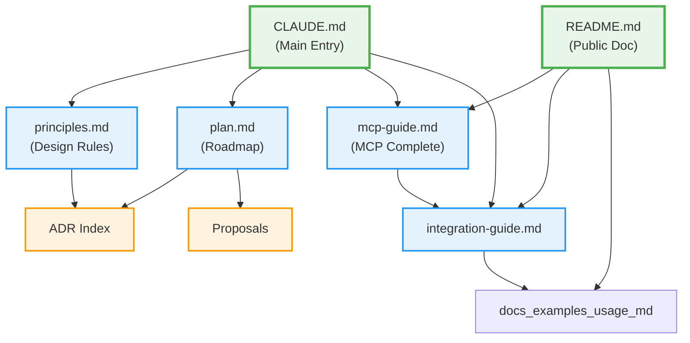

# meta-cc Documentation Map

This document provides a visual overview of documentation dependencies and navigation guide.

## Documentation Dependency Graph

## Quick Navigation Guide

### For New Users

1. **Start**: [README.md](../README.md) - Installation and overview
2. **Setup MCP**: [docs/mcp-guide.md](mcp-guide.md) - Complete MCP setup and usage
3. **Examples**: [docs/examples-usage.md](examples-usage.md) - Step-by-step tutorials

### For Claude Code Development

1. **Entry Point**: [CLAUDE.md](../CLAUDE.md) - Development workflow
2. **Design Rules**: [docs/principles.md](principles.md) - Core constraints
3. **Roadmap**: [docs/plan.md](plan.md) - Phase-by-phase plan
4. **Architecture**: [docs/adr/README.md](adr/README.md) - ADR index

### For Integration Work

1. **Integration Guide**: [docs/integration-guide.md](integration-guide.md) - Choosing MCP/Slash/Subagent
2. **MCP Complete Guide**: [docs/mcp-guide.md](mcp-guide.md) - All MCP topics in one place
3. **Troubleshooting**: [docs/troubleshooting.md](troubleshooting.md) - Common issues

## Document Roles

| Document | Role | Target Audience | Update Frequency |
|----------|------|----------------|------------------|
| **CLAUDE.md** | Development entry point | Claude Code | Every phase |
| **README.md** | Public documentation | End users | Major releases |
| **docs/plan.md** | Roadmap and status | Developers | Continuous |
| **docs/principles.md** | Design constraints | Developers | Rarely (stable) |
| **docs/mcp-guide.md** | MCP complete reference | Users & Developers | As MCP evolves |
| **docs/integration-guide.md** | Integration decisions | Advanced users | Stable |
| **docs/examples-usage.md** | Step-by-step tutorials | New users | When features added |
| **docs/adr/** | Architecture decisions | Architects | Per decision |

## Most Accessed Documents (from meta-cc analysis)

| Rank | Document | Access Count | Primary Use Case |
|------|----------|--------------|------------------|
| 1 | docs/plan.md | 411 | Phase tracking, implementation planning |
| 2 | README.md | 159 | Project overview, quick start |
| 3 | docs/principles.md | 88 | Design constraints, architecture rules |
| 4 | CLAUDE.md | 62 | Development workflow entry point |
| 5 | docs/examples-usage.md | 62 | Setup tutorials, usage examples |

## Documentation Optimization (Phase 23)

This documentation structure was optimized to:

1. **Reduce redundancy**: Consolidated 4 MCP documents → 1 comprehensive guide
2. **Improve navigation**: Created CLAUDE.md quick links and FAQ section
3. **Simplify completed phases**: Moved detailed phase docs to plans/ directory
4. **Enhance discoverability**: Added this navigation map

See the optimization plan in the commit message for details.
