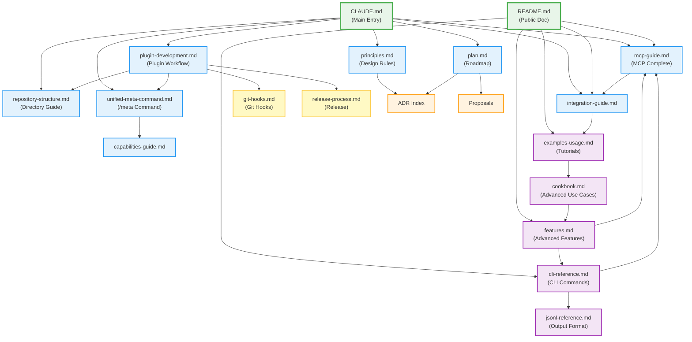

# meta-cc Documentation Map

This document provides a visual overview of documentation dependencies and navigation guide.

## Documentation Dependency Graph

## Quick Navigation Guide

### For New Users

1. **Start**: [README.md](../README.md) - Quick install and overview
2. **Setup MCP**: [docs/mcp-guide.md](mcp-guide.md) - Complete MCP setup and usage
3. **Examples**: [docs/examples-usage.md](examples-usage.md) - Step-by-step tutorials
4. **Troubleshooting**: [docs/troubleshooting.md](troubleshooting.md) - Common issues

### For Advanced Users

1. **CLI Reference**: [docs/cli-reference.md](cli-reference.md) - Complete command reference
2. **JSONL Reference**: [docs/jsonl-reference.md](jsonl-reference.md) - Output format and jq patterns
3. **Features**: [docs/features.md](features.md) - Advanced capabilities
4. **CLI Composability**: [docs/cli-composability.md](cli-composability.md) - Unix pipeline patterns

### For Claude Code Development

1. **Entry Point**: [CLAUDE.md](../CLAUDE.md) - Development workflow
2. **Design Rules**: [docs/principles.md](principles.md) - Core constraints
3. **Roadmap**: [docs/plan.md](plan.md) - Phase-by-phase plan
4. **Plugin Development**: [docs/plugin-development.md](plugin-development.md) - Complete workflow
5. **Repository Structure**: [docs/repository-structure.md](repository-structure.md) - Directory guide
6. **Architecture**: [docs/adr/README.md](adr/README.md) - ADR index

### For Plugin & Integration Development

1. **Plugin Workflow**: [docs/plugin-development.md](plugin-development.md) - Complete development guide
2. **Unified /meta Command**: [docs/unified-meta-command.md](unified-meta-command.md) - /meta command guide
3. **Git Hooks**: [docs/git-hooks.md](git-hooks.md) - Automatic version bumping
4. **Release Process**: [docs/release-process.md](release-process.md) - Release workflow
5. **Repository Structure**: [docs/repository-structure.md](repository-structure.md) - Directory organization

### For Integration Work

1. **Integration Guide**: [docs/integration-guide.md](integration-guide.md) - Choosing MCP/Slash/Subagent
2. **MCP Complete Guide**: [docs/mcp-guide.md](mcp-guide.md) - All MCP topics in one place
3. **Capabilities Guide**: [docs/capabilities-guide.md](capabilities-guide.md) - Create custom capabilities

## Document Roles

| Document | Role | Target Audience | Update Frequency |
|----------|------|----------------|------------------|
| **CLAUDE.md** | Development entry point (simplified) | Claude Code | Every phase |
| **README.md** | Public documentation (simplified) | End users | Major releases |
| **docs/plan.md** | Roadmap and status | Developers | Continuous |
| **docs/principles.md** | Design constraints | Developers | Rarely (stable) |
| **docs/plugin-development.md** | Plugin development workflow | Plugin developers | When workflow changes |
| **docs/repository-structure.md** | Directory organization guide | Developers | Rarely (stable) |
| **docs/unified-meta-command.md** | /meta command complete guide | Users & Developers | When /meta evolves |
| **docs/mcp-guide.md** | MCP complete reference | Users & Developers | As MCP evolves |
| **docs/integration-guide.md** | Integration decisions | Advanced users | Stable |
| **docs/release-process.md** | Release workflow | Maintainers | Rarely (stable) |
| **docs/git-hooks.md** | Git hooks usage | Developers | Rarely (stable) |
| **docs/examples-usage.md** | Step-by-step tutorials | New users | When features added |
| **docs/cli-reference.md** | Complete CLI command reference | Advanced users | When commands added |
| **docs/jsonl-reference.md** | Output format and jq patterns | Advanced users | Rarely (stable) |
| **docs/features.md** | Advanced features overview | Advanced users | When features added |
| **docs/adr/** | Architecture decisions | Architects | Per decision |

## Most Accessed Documents (from meta-cc analysis)

| Rank | Document | Access Count | Primary Use Case |
|------|----------|--------------|------------------|
| 1 | docs/plan.md | 411 | Phase tracking, implementation planning |
| 2 | README.md | 159 | Project overview, quick start |
| 3 | docs/principles.md | 88 | Design constraints, architecture rules |
| 4 | CLAUDE.md | 62 | Development workflow entry point |
| 5 | docs/examples-usage.md | 62 | Setup tutorials, usage examples |

---

## Universal Methodology

For universal, project-independent software development methodologies, see:

**[docs/methodology/](methodology/)** - Software Development Methodology

- **[Documentation Management](methodology/documentation-management.md)**: Comprehensive guide to documentation management in Claude Code projects
- **Future guides**: TDD, error handling, cross-platform development, version management, and more

---

**Last Updated**: 2025-10-12
