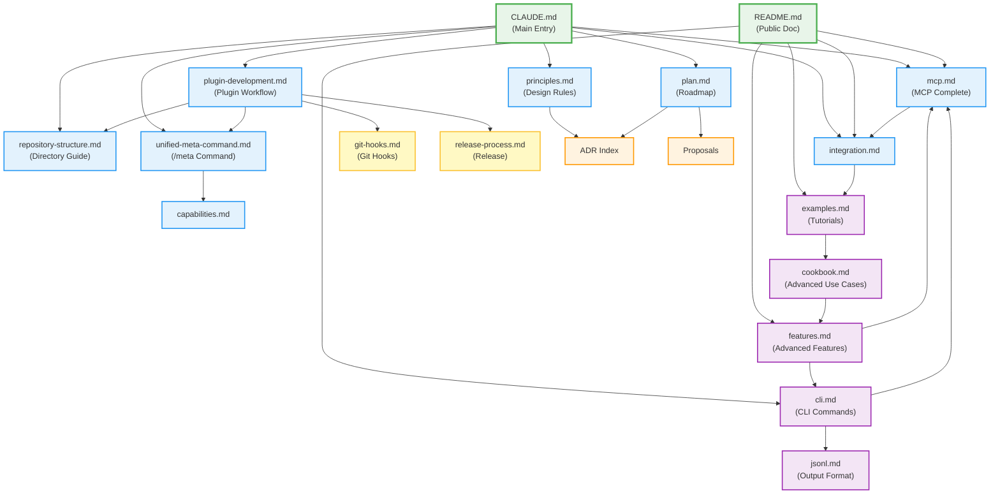

# meta-cc Documentation Map

This document provides a visual overview of documentation dependencies and navigation guide.

## New Directory Structure (Phase 1+2 Completed)

The documentation has been reorganized into a clearer, more intuitive structure:

```
docs/
├── core/                    # Core documents (most accessed)
│   ├── plan.md             # Project roadmap
│   └── principles.md       # Design constraints
│
├── guides/                  # Task-oriented guides
│   ├── capabilities.md     # Capability development (renamed from capabilities-guide.md)
│   ├── git-hooks.md        # Git hooks usage
│   ├── integration.md      # Integration patterns (renamed from integration-guide.md)
│   ├── mcp.md              # MCP complete reference (renamed from mcp-guide.md)
│   ├── plugin-development.md
│   ├── release-process.md
│   └── troubleshooting.md
│
├── reference/               # Complete specifications
│   ├── cli.md              # CLI commands (renamed from cli-reference.md)
│   ├── features.md         # Advanced features
│   ├── jsonl.md            # Output format (renamed from jsonl-reference.md)
│   ├── repository-structure.md
│   └── unified-meta-command.md
│
├── tutorials/               # Step-by-step learning
│   ├── cli-composability.md
│   ├── cookbook.md
│   ├── examples.md         # Basic examples (renamed from examples-usage.md)
│   ├── github-setup.md
│   └── installation.md
│
├── architecture/            # Architecture & design
│   ├── adr/                # Architecture Decision Records
│   └── proposals/          # Technical proposals
│
├── methodology/             # Universal methodologies
│   └── documentation-management.md
│
└── archive/                 # Archived documents
```

**Naming Conventions Applied**:
- ✅ Lowercase with hyphens
- ✅ Removed redundant `-guide` and `-reference` suffixes
- ✅ Simplified names (e.g., `examples-usage.md` → `examples.md`)
- ✅ Clear categorization by document type

## Documentation Dependency Graph



## Quick Navigation Guide

### For New Users

1. **Start**: [README.md](../README.md) - Quick install and overview
2. **Setup MCP**: [docs/guides/mcp.md](guides/mcp.md) - Complete MCP setup and usage
3. **Examples**: [docs/tutorials/examples.md](tutorials/examples.md) - Step-by-step tutorials
4. **Troubleshooting**: [docs/guides/troubleshooting.md](guides/troubleshooting.md) - Common issues

### For Advanced Users

1. **CLI Reference**: [docs/reference/cli.md](reference/cli.md) - Complete command reference
2. **JSONL Reference**: [docs/reference/jsonl.md](reference/jsonl.md) - Output format and jq patterns
3. **Features**: [docs/reference/features.md](reference/features.md) - Advanced capabilities
4. **CLI Composability**: [docs/tutorials/cli-composability.md](tutorials/cli-composability.md) - Unix pipeline patterns

### For Claude Code Development

1. **Entry Point**: [CLAUDE.md](../CLAUDE.md) - Development workflow
2. **Design Rules**: [docs/core/principles.md](core/principles.md) - Core constraints
3. **Roadmap**: [docs/core/plan.md](core/plan.md) - Phase-by-phase plan
4. **Plugin Development**: [docs/guides/plugin-development.md](guides/plugin-development.md) - Complete workflow
5. **Repository Structure**: [docs/reference/repository-structure.md](reference/repository-structure.md) - Directory guide
6. **Architecture**: [docs/architecture/adr/README.md](architecture/adr/README.md) - ADR index

### For Plugin & Integration Development

1. **Plugin Workflow**: [docs/guides/plugin-development.md](guides/plugin-development.md) - Complete development guide
2. **Unified /meta Command**: [docs/reference/unified-meta-command.md](reference/unified-meta-command.md) - /meta command guide
3. **Git Hooks**: [docs/guides/git-hooks.md](guides/git-hooks.md) - Automatic version bumping
4. **Release Process**: [docs/guides/release-process.md](guides/release-process.md) - Release workflow
5. **Repository Structure**: [docs/reference/repository-structure.md](reference/repository-structure.md) - Directory organization

### For Integration Work

1. **Integration Guide**: [docs/guides/integration.md](guides/integration.md) - Choosing MCP/Slash/Subagent
2. **MCP Complete Guide**: [docs/guides/mcp.md](guides/mcp.md) - All MCP topics in one place
3. **Capabilities Guide**: [docs/guides/capabilities.md](guides/capabilities.md) - Create custom capabilities

## Document Roles

| Document | Role | Target Audience | Update Frequency |
|----------|------|----------------|------------------|
| **CLAUDE.md** | Development entry point (simplified) | Claude Code | Every phase |
| **README.md** | Public documentation (simplified) | End users | Major releases |
| **docs/core/plan.md** | Roadmap and status | Developers | Continuous |
| **docs/core/principles.md** | Design constraints | Developers | Rarely (stable) |
| **docs/guides/plugin-development.md** | Plugin development workflow | Plugin developers | When workflow changes |
| **docs/reference/repository-structure.md** | Directory organization guide | Developers | Rarely (stable) |
| **docs/reference/unified-meta-command.md** | /meta command complete guide | Users & Developers | When /meta evolves |
| **docs/guides/mcp.md** | MCP complete reference | Users & Developers | As MCP evolves |
| **docs/guides/integration.md** | Integration decisions | Advanced users | Stable |
| **docs/guides/release-process.md** | Release workflow | Maintainers | Rarely (stable) |
| **docs/guides/git-hooks.md** | Git hooks usage | Developers | Rarely (stable) |
| **docs/tutorials/examples.md** | Step-by-step tutorials | New users | When features added |
| **docs/reference/cli.md** | Complete CLI command reference | Advanced users | When commands added |
| **docs/reference/jsonl.md** | Output format and jq patterns | Advanced users | Rarely (stable) |
| **docs/reference/features.md** | Advanced features overview | Advanced users | When features added |
| **docs/architecture/adr/** | Architecture decisions | Architects | Per decision |

## Most Accessed Documents (from meta-cc analysis)

| Rank | Document | Access Count | Primary Use Case |
|------|----------|--------------|------------------|
| 1 | docs/core/plan.md | 411 | Phase tracking, implementation planning |
| 2 | README.md | 159 | Project overview, quick start |
| 3 | docs/core/principles.md | 88 | Design constraints, architecture rules |
| 4 | CLAUDE.md | 62 | Development workflow entry point |
| 5 | docs/tutorials/examples.md | 62 | Setup tutorials, usage examples |

---

## Plans Directory Structure

Implementation plans for each development phase are organized in `plans/` with descriptive naming:

```
plans/
├── 00-bootstrap/                  # Project initialization
├── 01-session-locator/            # Session file location
├── 02-jsonl-parser/               # JSONL parsing
├── 08-mcp-integration/            # MCP server integration
├── 13-output-simplification/      # Output format standardization
├── 22-unified-meta-command/       # Unified /meta command
└── ...                            # 21 phases total
```

Each phase directory contains:
- **plan.md** - Detailed implementation plan with TDD stages
- **README.md** - Quick reference and navigation (12 phases)
- **Additional files** - Stage summaries, execution reports (as needed)

See [Documentation Management Methodology](methodology/documentation-management.md) for plans directory workflow.

---

## Universal Methodology

For universal, project-independent software development methodologies, see:

**[docs/methodology/](methodology/)** - Software Development Methodology

- **[Documentation Management](methodology/documentation-management.md)**: Comprehensive guide to documentation management in Claude Code projects
- **Future guides**: TDD, error handling, cross-platform development, version management, and more

---

## Restructuring Summary

**Phase 1+2: Directory Structure & File Renaming** (2025-10-12):
- ✅ Created categorized subdirectories (core/, guides/, reference/, tutorials/)
- ✅ Moved 19 documents to appropriate categories
- ✅ Renamed files to remove redundant suffixes (-guide, -reference)
- ✅ Simplified file names (e.g., examples-usage.md → examples.md)
- ✅ Moved architecture directories (adr/, proposals/ → architecture/)
- ✅ Updated all entry point links (CLAUDE.md, README.md, DOCUMENTATION_MAP.md)

**Phase 3: Plans Directory Restructuring** (2025-10-12):
- ✅ Renamed all 21 phase directories with descriptive names
- ✅ Format: NN-descriptive-name/ (e.g., 08-mcp-integration/)
- ✅ Created README.md quick references for 12 phase directories
- ✅ Improved discoverability and self-documentation

**Phase 4: Internal Link Fixes** (2025-10-12):
- ✅ Fixed 70+ broken internal links across 18 files
- ✅ Updated cross-directory references
- ✅ Fixed architecture path references
- ✅ All documentation links now working correctly

**Verification Results** (2025-10-12):
- ✅ Main entry points: 100% links working (CLAUDE.md, README.md, DOCUMENTATION_MAP.md)
- ✅ Internal cross-references: 100% links working (0 broken links detected)
- ✅ Plans directory: All phases renamed with descriptive names
- ✅ Naming conventions: Fully standardized (lowercase + hyphens)

---

**Last Updated**: 2025-10-12
