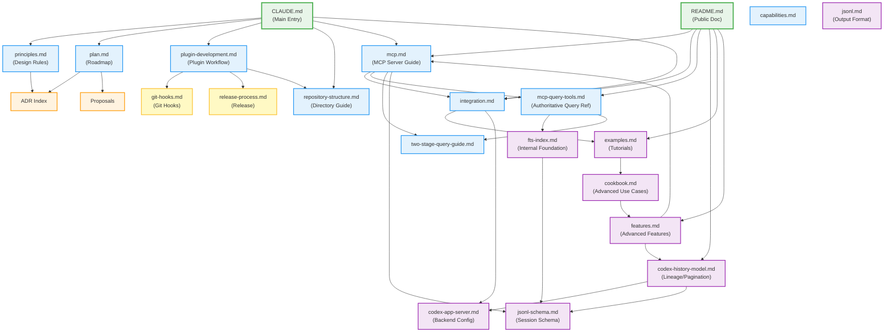

# meta-cc Documentation Map

This document provides a visual overview of documentation dependencies and navigation guide.

## Documentation Status Legend

Every page in the current navigation falls into one of these lifecycle classes:

| Status | Meaning |
|--------|---------|
| **Implemented — public** | Shipped behavior reachable through the MCP server or host plugins today |
| **Internal foundation** | Shipped code that supports public behavior but is not a standalone MCP feature (no dedicated tool or flag) |
| **Historical design record** | Superseded or retired material kept for context; labeled in-page and pointing at the authoritative replacement |
| **Pending** | Planned but not delivered; described in roadmap/proposal pages, not in user guides |

## Directory Structure

```
docs/
├── QUICK_ACCESS.md          # Fast lookup navigation
├── DOCUMENTATION_MAP.md     # This map
│
├── core/                    # Core documents (most accessed)
│   ├── plan.md             # Project roadmap (living)
│   ├── principles.md       # Design constraints
│   └── phase-26-cli-removal-plan.md  # Historical: CLI removal plan
│
├── guides/                  # Task-oriented guides
│   ├── integration.md      # Choosing Claude Code vs Codex integration
│   ├── mcp.md              # MCP server guide (both hosts)
│   ├── mcp-query-tools.md  # Consolidated MCP query tools reference (authoritative)
│   ├── two-stage-query-guide.md     # Two-stage jq workflow
│   ├── mcp-jq-quick-reference.md    # jq expression quick reference
│   ├── prompt-learning-system.md    # Prompt library workflow
│   ├── troubleshooting.md
│   ├── plugin-development.md
│   ├── capabilities.md     # Capability development
│   ├── git-hooks.md
│   ├── release-process.md
│   ├── pre-release-automation.md
│   ├── build-quality-gates.md
│   ├── api-consistency-hooks.md
│   ├── markdown-linting.md
│   ├── gcl-annotation.md   # Gate Criterion Ledger annotation format
│   ├── mcp-e2e-testing.md
│   ├── mcp-testing-quickstart.md
│   ├── mcp-v2-migration.md          # SUPERSEDED (banner inside)
│   ├── migration-to-unified-query.md # SUPERSEDED (banner inside)
│   └── unified-query-api.md         # SUPERSEDED (banner inside)
│
├── reference/               # Complete specifications
│   ├── features.md         # Feature overview (current tool surface)
│   ├── jsonl.md            # Output format and jq patterns
│   ├── jsonl-schema.md     # Canonical Claude Code and Codex session schema
│   ├── codex-app-server.md # Codex app-server backend (DIR-029)
│   ├── codex-history-model.md # Codex completeness/lineage/pagination (DIR-032)
│   ├── fts-index.md        # Local FTS index — internal foundation (DIR-031)
│   ├── unified-meta-command.md # SUPERSEDED: historical /meta command
│   └── repository-structure.md
│
├── tutorials/               # Step-by-step learning
│   ├── installation.md     # Install: Claude Code + Codex
│   ├── examples.md         # Quick start examples
│   ├── cookbook.md
│   ├── github-setup.md
│   └── baime-usage.md      # BAIME methodology usage
│
├── examples/                # Query examples and patterns
│   ├── two-stage-query-examples.md  # Two-stage architecture examples
│   ├── frequent-jsonl-queries.md
│   ├── jq-query-examples.md
│   ├── multi-file-jsonl-queries.md
│   ├── query-cookbook.md
│   └── mcp-query-cookbook.md        # SUPERSEDED (banner inside)
│
├── architecture/            # Architecture & design
│   ├── adr/                # Architecture Decision Records (ADR-001..007)
│   ├── proposals/          # Technical proposals
│   └── metadata-driven-query-architecture.md
│
├── contributing/            # Contributor conventions
│   └── commit-conventions.md
│
├── methodology/             # Universal methodologies (project-independent)
│
├── historical records and fixtures (not part of current navigation):
│   analysis/  phases/  plans/  proposals/  experiments/  tasks/  testing/
│
└── archive/                 # Archived documents
```

**Naming Conventions Applied**:

- ✅ Lowercase with hyphens
- ✅ Removed redundant `-guide` and `-reference` suffixes
- ✅ Simplified names (e.g., `examples-usage.md` → `examples.md`)
- ✅ Clear categorization by document type

## Documentation Dependency Graph


```mermaid
graph TD

  %% Core Entry Points
  CLAUDE_md["CLAUDE.md<br/>(Main Entry)"]:::entry
  README_md["README.md<br/>(Public Doc)"]:::entry

  %% Key Guides
  docs_plan_md["plan.md<br/>(Roadmap)"]:::guide
  docs_principles_md["principles.md<br/>(Design Rules)"]:::guide
  docs_plugin_development_md["plugin-development.md<br/>(Plugin Workflow)"]:::guide
  docs_repository_structure_md["repository-structure.md<br/>(Directory Guide)"]:::guide
  docs_integration_guide_md["integration.md"]:::guide
  docs_mcp_guide_md["mcp.md<br/>(MCP Server Guide)"]:::guide
  docs_mcp_query_tools_md["mcp-query-tools.md<br/>(Authoritative Query Ref)"]:::guide
  docs_two_stage_guide_md["two-stage-query-guide.md"]:::guide
  docs_capabilities_guide_md["capabilities.md"]:::guide

  %% Codex + Provider References
  docs_codex_appserver_md["codex-app-server.md<br/>(Backend Config)"]:::reference
  docs_codex_history_md["codex-history-model.md<br/>(Lineage/Pagination)"]:::reference
  docs_fts_index_md["fts-index.md<br/>(Internal Foundation)"]:::reference

  %% Maintenance Guides
  docs_git_hooks_md["git-hooks.md<br/>(Git Hooks)"]:::maintenance
  docs_release_process_md["release-process.md<br/>(Release)"]:::maintenance

  %% Reference Docs
  docs_jsonl_reference_md["jsonl.md<br/>(Output Format)"]:::reference
  docs_jsonl_schema_md["jsonl-schema.md<br/>(Session Schema)"]:::reference
  docs_features_md["features.md<br/>(Advanced Features)"]:::reference
  docs_examples_usage_md["examples.md<br/>(Tutorials)"]:::reference
  docs_cookbook_md["cookbook.md<br/>(Advanced Use Cases)"]:::reference

  %% Architecture
  docs_adr_README_md["ADR Index"]:::adr
  docs_proposals_md["Proposals"]:::adr

  %% Dependencies - Core Entry Points
  CLAUDE_md --> docs_principles_md
  CLAUDE_md --> docs_plan_md
  CLAUDE_md --> docs_plugin_development_md
  CLAUDE_md --> docs_repository_structure_md
  CLAUDE_md --> docs_mcp_guide_md
  CLAUDE_md --> docs_integration_guide_md

  README_md --> docs_mcp_guide_md
  README_md --> docs_integration_guide_md
  README_md --> docs_mcp_query_tools_md
  README_md --> docs_codex_history_md
  README_md --> docs_examples_usage_md
  README_md --> docs_features_md

  %% Dependencies - Guides
  docs_principles_md --> docs_adr_README_md
  docs_plan_md --> docs_adr_README_md
  docs_plan_md --> docs_proposals_md
  docs_plugin_development_md --> docs_git_hooks_md
  docs_plugin_development_md --> docs_release_process_md
  docs_plugin_development_md --> docs_repository_structure_md
  docs_integration_guide_md --> docs_examples_usage_md
  docs_integration_guide_md --> docs_codex_appserver_md
  docs_mcp_guide_md --> docs_integration_guide_md
  docs_mcp_guide_md --> docs_mcp_query_tools_md
  docs_mcp_guide_md --> docs_two_stage_guide_md
  docs_mcp_guide_md --> docs_jsonl_schema_md
  docs_examples_usage_md --> docs_cookbook_md

  %% Dependencies - Reference
  docs_features_md --> docs_mcp_guide_md
  docs_features_md --> docs_codex_history_md
  docs_cookbook_md --> docs_features_md
  docs_mcp_query_tools_md --> docs_fts_index_md
  docs_mcp_query_tools_md --> docs_two_stage_guide_md
  docs_codex_history_md --> docs_codex_appserver_md
  docs_codex_history_md --> docs_jsonl_schema_md
  docs_fts_index_md --> docs_jsonl_schema_md

  %% Styles
  classDef entry fill:#e8f5e9,stroke:#4caf50,stroke-width:3px
  classDef guide fill:#e3f2fd,stroke:#2196f3,stroke-width:2px
  classDef maintenance fill:#fff9c4,stroke:#fbc02d,stroke-width:2px
  classDef reference fill:#f3e5f5,stroke:#9c27b0,stroke-width:2px
  classDef adr fill:#fff3e0,stroke:#ff9800,stroke-width:2px
```

## Quick Navigation Guide

### Using meta-cc from Claude Code (install → query)

1. **Overview**: [README.md](../README.md) - Quick start and tool surface
2. **Install**: [docs/tutorials/installation.md](tutorials/installation.md#method-1-claude-code-plugin-marketplace) - Claude Code plugin marketplace
3. **Configure + query**: [docs/guides/mcp.md](guides/mcp.md) - MCP server guide (provider defaults to `claude` under Claude Code)
4. **Query reference**: [docs/guides/mcp-query-tools.md](guides/mcp-query-tools.md) - Consolidated query tools (authoritative)
5. **Examples**: [docs/tutorials/examples.md](tutorials/examples.md) - Quick checks and recipes
6. **Troubleshooting**: [docs/guides/troubleshooting.md](guides/troubleshooting.md) - Common issues

### Using meta-cc from Codex (install → query)

1. **Overview**: [README.md](../README.md) - Quick start (Codex supported)
2. **Install**: [docs/tutorials/installation.md](tutorials/installation.md#method-1b-codex-plugin-marketplace-preferred-for-codex-cli-0145) - Codex plugin marketplace (CLI 0.145+)
3. **Integration choices**: [docs/guides/integration.md](guides/integration.md) - MCP server plus `prompt-find`/`prompt-list`/`prompt-show` skills
4. **Configure + query**: [docs/guides/mcp.md](guides/mcp.md) - Provider support, `META_CC_HOST`, `META_CC_CODEX_ROOT`
5. **Query reference**: [docs/guides/mcp-query-tools.md](guides/mcp-query-tools.md#provider-support) - `provider: "codex"` / `"all"` semantics
6. **Provider examples**: [docs/tutorials/examples.md](tutorials/examples.md#provider-examples) - Codex and cross-provider recipes
7. **Codex references**: [docs/reference/codex-history-model.md](reference/codex-history-model.md) - Lineage, archives, pagination; [docs/reference/codex-app-server.md](reference/codex-app-server.md) - `app_server`/`files` backend modes
8. **Troubleshooting**: [docs/guides/troubleshooting.md](guides/troubleshooting.md)

### Advanced Querying (both hosts)

1. **Query reference**: [docs/guides/mcp-query-tools.md](guides/mcp-query-tools.md) - Consolidated tools, `jq_filter`, hybrid output
2. **Two-stage jq**: [docs/guides/two-stage-query-guide.md](guides/two-stage-query-guide.md) + [docs/guides/mcp-jq-quick-reference.md](guides/mcp-jq-quick-reference.md)
3. **Query examples**:
   - [docs/examples/two-stage-query-examples.md](examples/two-stage-query-examples.md) - Two-stage walkthroughs
   - [docs/examples/jq-query-examples.md](examples/jq-query-examples.md) - Single-file query patterns
   - [docs/examples/multi-file-jsonl-queries.md](examples/multi-file-jsonl-queries.md) - Multi-file queries with results
   - [docs/examples/frequent-jsonl-queries.md](examples/frequent-jsonl-queries.md) - Most frequently used queries
4. **Schema + format**: [docs/reference/jsonl-schema.md](reference/jsonl-schema.md) (canonical model) and [docs/reference/jsonl.md](reference/jsonl.md) (output format)
5. **Features**: [docs/reference/features.md](reference/features.md) - Current tool surface overview

### Contributing: Architecture and Provider Internals

1. **Entry point**: [CLAUDE.md](../CLAUDE.md) - Development workflow, TDD, line ceilings
2. **Design rules**: [docs/core/principles.md](core/principles.md) - Core constraints
3. **Roadmap + status**: [docs/core/plan.md](core/plan.md) - Phases; pending work stays marked 🟡 there
4. **Architecture**: [docs/architecture/adr/README.md](architecture/adr/README.md) - ADR index (ADR-001..007)
5. **Provider internals** (internal foundations and backend references):
   - [docs/reference/jsonl-schema.md](reference/jsonl-schema.md) - Canonical `Session` → `Turn` → `Item` model
   - [docs/reference/codex-app-server.md](reference/codex-app-server.md) - Codex app-server backend (DIR-029)
   - [docs/reference/codex-history-model.md](reference/codex-history-model.md) - Completeness, compaction, lineage, pagination (DIR-032)
   - [docs/reference/fts-index.md](reference/fts-index.md) - Local FTS index (DIR-031; accelerates `query_session_content`, no standalone tool)
6. **Plugin + release**: [docs/guides/plugin-development.md](guides/plugin-development.md), [docs/guides/release-process.md](guides/release-process.md), [docs/guides/git-hooks.md](guides/git-hooks.md)
7. **Conventions**: [docs/contributing/commit-conventions.md](contributing/commit-conventions.md) and [docs/reference/repository-structure.md](reference/repository-structure.md)

### Implementation Status Index

| Capability | Status | Where documented |
|------------|--------|------------------|
| 16 MCP tools (discovery, consolidated query, two-stage, analysis, cleanup) | Implemented — public | [mcp.md](guides/mcp.md), [mcp-query-tools.md](guides/mcp-query-tools.md), [features.md](reference/features.md) |
| Claude Code and Codex host plugins, prompt library commands/skills | Implemented — public | [integration.md](guides/integration.md), [installation.md](tutorials/installation.md), [prompt-learning-system.md](guides/prompt-learning-system.md) |
| Codex `app_server`/`files` backends with auto fallback | Implemented — public (backend config) | [codex-app-server.md](reference/codex-app-server.md) |
| FTS5 index accelerating project-scoped `query_session_content` | Implemented — internal foundation (no standalone `query_search` tool or rebuild CLI yet) | [fts-index.md](reference/fts-index.md) |
| Unified `query` tool (v2.0 API) | Historical design record — removed, superseded by consolidated tools | [unified-query-api.md](guides/unified-query-api.md), [mcp-v2-migration.md](guides/mcp-v2-migration.md), [migration-to-unified-query.md](guides/migration-to-unified-query.md) |
| `/meta` unified slash command | Historical design record — removed (Phase 26 CLI removal) | [unified-meta-command.md](reference/unified-meta-command.md) |
| v2.0 query cookbook examples | Historical design record — superseded | [examples/mcp-query-cookbook.md](examples/mcp-query-cookbook.md) |
| Remaining architecture cleanup (Phase 85-86) | Pending | [core/plan.md](core/plan.md) |

### For Documentation Maintenance

Use these checks before release or documentation-only PRs:

| Check | Command | Purpose |
|-------|---------|---------|
| Markdown formatting | `markdownlint docs/**/*.md` | Catch formatting issues when markdownlint is available |
| Repository references | `rg "Codex|Claude Code|provider" README.md docs` | Verify host-support claims stay in sync |
| User entry points | Review `README.md`, `docs/tutorials/installation.md`, `docs/tutorials/examples.md`, `docs/guides/integration.md` | Keep install and usage docs aligned |
| E2E docs | `make test-e2e-codex` | Validate Codex install/session behavior when code changes affect provider support |

**Typical Maintenance Workflow**:

1. Search user-facing docs for outdated tool counts, retired command names, and old subagent references.
2. Search user-facing docs for `provider`, `Codex`, and `Claude Code` to verify host-support claims stay consistent.
3. Run `make test-e2e-codex` when implementation or packaging changes affect Codex behavior.

See [Role-Based Documentation Architecture](methodology/role-based-documentation.md) for complete methodology.

## Document Roles

| Document | Role | Target Audience | Update Frequency |
|----------|------|----------------|------------------|
| **CLAUDE.md** | Development entry point (simplified) | Claude Code | Every phase |
| **README.md** | Public documentation (simplified) | End users | Major releases |
| **docs/core/plan.md** | Roadmap and status | Developers | Continuous |
| **docs/core/principles.md** | Design constraints | Developers | Rarely (stable) |
| **docs/guides/plugin-development.md** | Plugin development workflow | Plugin developers | When workflow changes |
| **docs/reference/repository-structure.md** | Directory organization guide | Developers | Rarely (stable) |
| **docs/guides/mcp.md** | MCP server guide (both hosts) | Users & Developers | As MCP evolves |
| **docs/guides/mcp-query-tools.md** | Authoritative consolidated query tool reference | All users | When tools/params change |
| **docs/guides/two-stage-query-guide.md** | Two-stage jq workflow | Advanced users | When stage2 tools change |
| **docs/guides/mcp-jq-quick-reference.md** | jq expression quick reference | Advanced users | Rarely (stable) |
| **docs/guides/integration.md** | Integration decisions | Advanced users | Stable |
| **docs/guides/release-process.md** | Release workflow | Maintainers | Rarely (stable) |
| **docs/guides/git-hooks.md** | Git hooks usage | Developers | Rarely (stable) |
| **docs/tutorials/examples.md** | Step-by-step tutorials | New users | When features added |
| **docs/reference/jsonl.md** | Output format and jq patterns | Advanced users | Rarely (stable) |
| **docs/reference/jsonl-schema.md** | JSONL session file schema specification | Developers & Analysts | When schema changes |
| **docs/reference/features.md** | Advanced features overview | Advanced users | When features added |
| **docs/reference/codex-app-server.md** | Codex app-server backend reference (implemented — public) | Codex users & Developers | When backend changes |
| **docs/reference/codex-history-model.md** | Codex completeness/lineage/pagination reference (implemented — public) | Codex users & Developers | When provider model changes |
| **docs/reference/fts-index.md** | Local FTS index (internal foundation — accelerates content queries, no standalone tool) | Developers | When indexing changes |
| **docs/reference/unified-meta-command.md** | Historical design record — retired `/meta` command | Developers | Never (historical) |
| **docs/examples/jq-query-examples.md** | Single-file JSONL query patterns | Advanced users & Analysts | Rarely (stable patterns) |
| **docs/examples/multi-file-jsonl-queries.md** | Multi-file JSONL query results | Advanced users & Analysts | Rarely (reference examples) |
| **docs/examples/frequent-jsonl-queries.md** | Most frequently used JSONL queries | Advanced users & Analysts | Rarely (usage patterns) |
| **docs/architecture/adr/** | Architecture decisions | Architects | Per decision |

## Most Accessed Documents (historical snapshot from meta-cc analysis)

| Rank | Document | Access Count | Primary Use Case |
|------|----------|--------------|------------------|
| 1 | docs/core/plan.md | 411 | Phase tracking, implementation planning |
| 2 | README.md | 159 | Project overview, quick start |
| 3 | docs/core/principles.md | 88 | Design constraints, architecture rules |
| 4 | CLAUDE.md | 62 | Development workflow entry point |
| 5 | docs/tutorials/examples.md | 62 | Setup tutorials, usage examples |

---

## Plans Directory Structure

Historical implementation plans for earlier development phases are organized in `plans/` with descriptive naming:

```
plans/
├── 00-bootstrap/                  # Project initialization
├── 01-session-locator/            # Session file location
├── 02-jsonl-parser/               # JSONL parsing
├── 08-mcp-integration/            # MCP server integration
├── 13-output-simplification/      # Output format standardization
├── 22-unified-meta-command/       # Historical /meta command work
└── ...                            # Historical phase plans
```

Each phase directory contains:

- **plan.md** - Detailed implementation plan with TDD stages
- **README.md** - Quick reference and navigation (12 phases)
- **Additional files** - Stage summaries, execution reports (as needed)

More recent phase plans (24 onward) live in `docs/plans/` with matching proposals in `docs/proposals/`.

See [Documentation Management Methodology](methodology/documentation-management.md) for plans directory workflow.

---

## Universal Methodology

For universal, project-independent software development methodologies, see:

**[docs/methodology/](methodology/)** - Software Development Methodology

- **[Documentation Management](methodology/documentation-management.md)**: Comprehensive guide to documentation management in Claude Code projects
- **[Role-Based Documentation Architecture](methodology/role-based-documentation.md)**: Data-driven methodology for organizing and maintaining documentation based on actual usage patterns, with automated health checks and continuous optimization (Methodology v1.0, 2025-10-13)
- **[Empirical Methodology Development](methodology/empirical-methodology-development.md)**: Meta-methodology for developing software engineering practices through observation, analysis, and automation. Includes OCA Framework (Observe-Codify-Automate) and implementation roadmap (Framework v1.0, 2025-10-13)
- **[Bootstrapped Software Engineering](methodology/bootstrapped-software-engineering.md)**: Meta-methodology framework for self-evolving software development processes with Meta-Agent bootstrapping (Framework v1.0, 2025-10-13)
- **[Value Space Optimization](methodology/value-space-optimization.md)**: Mathematical framework for training Agents and Meta-Agents from project history, treating development as optimization in high-dimensional value space with Agent as gradient (∇V) and Meta-Agent as Hessian (∇²V) (Framework v1.0, 2025-10-14)
- **Future guides**: TDD, error handling, cross-platform development, version management, and more (using OCA Framework)

---

## Restructuring Summary

**Phase 1+2: Directory Structure & File Renaming** (2025-10-12):

- ✅ Created categorized subdirectories (core/, guides/, reference/, tutorials/)
- ✅ Moved 19 documents to appropriate categories
- ✅ Renamed files to remove redundant suffixes (-guide, -reference)
- ✅ Simplified file names (e.g., examples-usage.md → examples.md)
- ✅ Moved architecture directories (adr/, proposals/ → architecture/)
- ✅ Updated all entry point links (CLAUDE.md, README.md, DOCUMENTATION_MAP.md)

**Phase 3: Plans Directory Restructuring** (2025-10-12):

- ✅ Renamed all 21 phase directories with descriptive names
- ✅ Format: NN-descriptive-name/ (e.g., 08-mcp-integration/)
- ✅ Created README.md quick references for 12 phase directories
- ✅ Improved discoverability and self-documentation

**Phase 4: Internal Link Fixes** (2025-10-12):

- ✅ Fixed 70+ broken internal links across 18 files
- ✅ Updated cross-directory references
- ✅ Fixed architecture path references
- ✅ All documentation links now working correctly
- ✅ **Documentation Link Checker Tool**: Created `/meta doc-links` capability for ongoing validation

**Phase 5: Documentation Management Capabilities** (2025-10-12):

- ✅ **Documentation Sync Checker**: Created `/meta doc-sync` capability for cross-reference validation
- ✅ **Project Bootstrap**: Created `/meta project-bootstrap` capability implementing Documentation Management Methodology v5.0
- ✅ **Link Validation**: Automated tool for checking internal markdown links with severity classification

**Verification Results** (2025-10-12):

- ✅ Main entry points: 100% links working (CLAUDE.md, README.md, DOCUMENTATION_MAP.md)
- ✅ Internal cross-references: 100% links working (0 broken links detected)
- ✅ Plans directory: All phases renamed with descriptive names
- ✅ Naming conventions: Fully standardized (lowercase + hyphens)
- ✅ Documentation management toolchain: Complete with link checking, sync validation, and project bootstrap

**Phase 6: Role-Based Documentation Methodology** (2025-10-13):

- ✅ **Role-Based Documentation Architecture**: Created comprehensive methodology document (v1.0)
- ✅ **6 Document Roles Defined**: Context Base, Living, Specification, Reference, Episodic, Archive
- ✅ **Key Metrics Framework**: R/E ratio, access density, lifecycle stages
- ✅ **4 Maintenance Capabilities Refined**: doc-health, doc-evolution, doc-gaps, doc-usage (concise style, 219-302 lines each)
- ✅ **Empirical Case Study**: Complete analysis of meta-cc project documentation with actual data
- ✅ **Implementation Guide**: Step-by-step setup, automation hooks, troubleshooting
- ✅ **Updated DOCUMENTATION_MAP.md**: Added methodology reference in Universal Methodology section

**Phase 7: Documentation Simplification** (2025-10-25):

- ✅ **Phase Consolidation**: Merged Phase 12-13 (MCP Integration), Phase 18-22 (Open Source Ecosystem)
- ✅ **Archive Management**: Moved Phase 23-25 (Query Interface Refactoring v2.0) to archive with comprehensive documentation
- ✅ **Structure Optimization**: Simplified project roadmap while preserving technical history
- ✅ **Reference Cleanup**: Updated all cross-references to point to consolidated or archived content

**Updated Verification Results** (2025-10-25):

- ✅ Main entry points: 100% links working (CLAUDE.md, README.md, DOCUMENTATION_MAP.md)
- ✅ Internal cross-references: 100% links working (0 broken links detected)
- ✅ Plans directory: All phases renamed with descriptive names
- ✅ Naming conventions: Fully standardized (lowercase + hyphens)
- ✅ Documentation management toolchain: Complete with link checking, sync validation, and project bootstrap
- ✅ Archive organization: Historical Phase 23-25 documentation properly archived with cross-references

---

**Last Updated**: 2026-07-29
