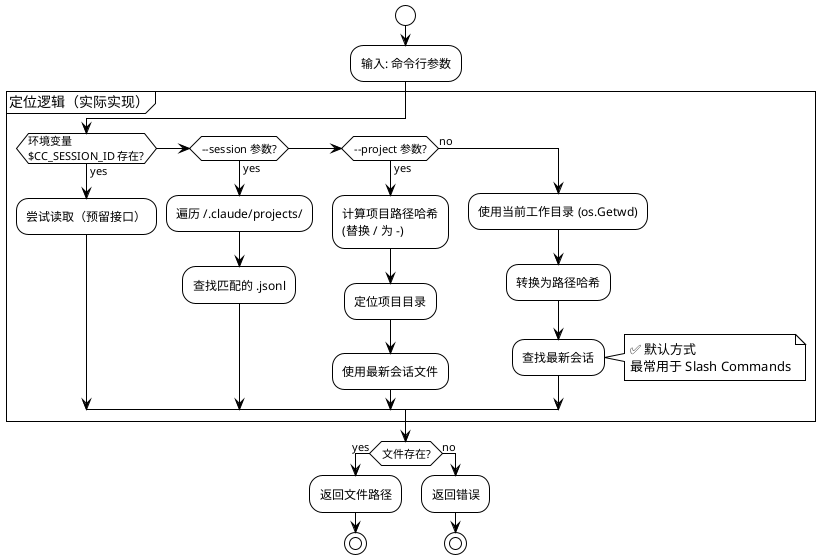
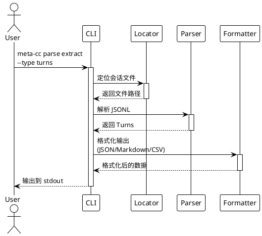
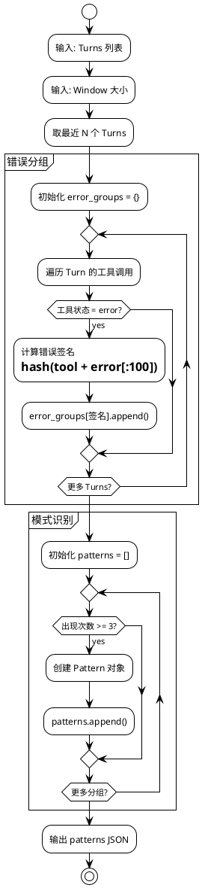
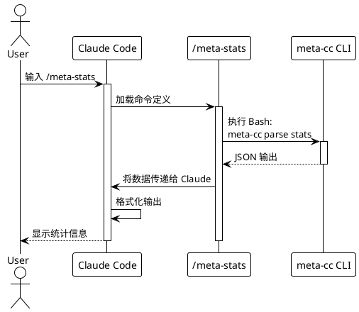

# meta-cc 项目总体实施计划

## 项目概述

基于 [技术方案](./proposals/meta-cognition-proposal.md) 的分阶段实施计划。

**核心约束**：
- 每个 Phase：代码修改量 ≤ 500 行
- 每个 Stage：代码修改量 ≤ 200 行
- 开发方法：测试驱动开发（TDD）
- 交付要求：每个 Phase 更新 README.md，说明当前 build 使用方法
- 验证策略：使用真实 Claude Code 会话历史进行测试

**测试环境**：
- 测试 fixture：`tests/fixtures/` （包含样本和错误会话文件）
- 真实验证项目：meta-cc, NarrativeForge, claude-tmux
- 集成测试：`tests/integration/slash_commands_test.sh`

**项目状态**：
- ✅ **Phase 0-7 已完成**（完整集成里程碑达成）
- ✅ **Phase 8 已完成**（stages 8.1-8.12: 查询命令基础 + Prompt 优化）
- ✅ **Phase 9 已完成**（上下文长度应对，86.4% 压缩率）🎉 **NEW**
- ✅ 47 个单元测试全部通过（Phase 9 新增测试）
- ✅ 3 个真实项目验证通过（0% 错误率）
- ✅ 2 个 Slash Commands 可用（`/meta-stats`, `/meta-errors`，已集成 Phase 9）
- ✅ MCP Server 原生实现（`meta-cc mcp`，10 个工具）
- ✅ 支持 5 种输出格式（JSON, Markdown, CSV, TSV, Summary）

---

## Phase 划分总览

```plantuml
@startuml
!theme plain

card "Phase 0-7" as P0 #lightgreen {
  **✅ MVP 已完成**
  - 项目初始化
  - 会话定位
  - JSONL 解析
  - 数据提取
  - 统计分析
  - 错误分析
  - Slash Commands
  - MCP Server
}

card "Phase 8" as P8 #lightblue {
  **查询命令基础**
  - query 命令框架
  - query tools
  - query user-messages
  - 基础过滤器
}

card "Phase 9" as P9 #lightblue {
  **上下文长度应对**
  - 分页支持
  - 分片输出
  - 字段投影
  - 紧凑格式(TSV)
}

card "Phase 10" as P10 #lightyellow {
  **高级查询能力**
  - 高级过滤器
  - 聚合统计
  - 时间序列
  - 文件级统计
}

card "Phase 11" as P11 #lightyellow {
  **Unix 可组合性**
  - 流式输出
  - 退出码标准化
  - stderr/stdout分离
  - Cookbook 文档
}

card "Phase 12" as P12 #lightgreen {
  **MCP 项目级查询**
  - 项目级工具（默认）
  - 会话级工具（_session）
  - --project . 支持
  - 跨会话分析
}

card "Phase 13" as P13 #lightgray {
  **查询语言增强**
  - SQL-like 语法
  - 查询解析器
  - 关联查询
  - 性能优化
}

card "Phase 14" as P14 #lightgray {
  **索引功能**
  - SQLite 索引
  - 跨会话查询
  - 索引维护
}

card "Phase 15" as P15 #lightgray {
  **Subagent 增强**
  - @meta-coach 迭代分析
  - 自动化建议
  - 工作流优化
}

P0 -down-> P8
P8 -down-> P9
P9 -down-> P10
P10 -down-> P11
P11 -down-> P12
P12 -down-> P13
P13 -down-> P14
P14 -down-> P15

note right of P0
  **业务闭环完成**
  可在 Claude Code 中使用
end note

note right of P9
  **核心查询能力完成**
  应对大会话场景
end note

note right of P14
  **完整生态系统**
  高级分析能力
end note

@enduml
```

**Phase 优先级分类**：
- ✅ **已完成** (Phase 0-7): MVP 核心功能
- 🔵 **高优先级** (Phase 8-9): 核心查询和上下文管理
- 🟡 **中优先级** (Phase 10-11): 高级查询和可组合性
- ⚪ **低优先级** (Phase 12-14): 便利性和生态增强

---

## Phase 0: 项目初始化

**目标**：建立 Go 项目骨架和开发环境

**代码量**：~150 行

### Stage 0.1: Go 模块初始化

**任务**：
- 创建 `go.mod` 和项目目录结构
- 添加 Cobra + Viper 依赖
- 实现根命令框架

**交付物**：
```
meta-cc/
├── go.mod
├── go.sum
├── main.go
├── cmd/
│   └── root.go
└── README.md
```

**测试**：
```bash
go build -o meta-cc
./meta-cc --version
./meta-cc --help
```

**README.md 内容**：
- 项目介绍
- 构建命令：`go build -o meta-cc`
- 基础使用：`./meta-cc --help`

### Stage 0.2: 测试框架搭建

**任务**：
- 配置 Go testing
- 添加测试 fixture 目录
- 创建第一个单元测试示例

**交付物**：
```
meta-cc/
├── internal/
│   └── testutil/
│       └── fixtures.go
└── tests/
    └── fixtures/
        └── sample-session.jsonl
```

**测试**：
```bash
go test ./...
```

**README.md 更新**：
- 添加测试命令：`go test ./...`

### Stage 0.3: 构建和发布脚本

**任务**：
- 创建 Makefile 或构建脚本
- 支持跨平台构建（Linux/macOS/Windows）
- 添加版本信息嵌入

**交付物**：
```
meta-cc/
├── Makefile
└── scripts/
    └── build.sh
```

**测试**：
```bash
make build
make test
make clean
```

**README.md 更新**：
- 添加构建说明
- 支持的平台列表

**Phase 0 完成标准**：
- ✅ `go build` 成功
- ✅ `go test ./...` 通过
- ✅ `./meta-cc --help` 显示帮助信息
- ✅ README.md 包含完整的构建和使用说明

---

## Phase 1: 会话文件定位

**目标**：实现多种方式定位 Claude Code 会话文件

**代码量**：~180 行

**状态**：✅ 已完成



### Stage 1.1: 环境变量读取

**TDD 流程**：

1. **编写测试** (`internal/locator/env_test.go`)：
```go
func TestReadSessionFromEnv(t *testing.T) {
    // 测试：存在环境变量时返回正确路径
    // 测试：缺少环境变量时返回错误
}
```

2. **实现代码** (`internal/locator/env.go`)：
```go
type SessionLocator struct {}

func (l *SessionLocator) FromEnv() (string, error) {
    // 读取 CC_SESSION_ID 和 CC_PROJECT_HASH
    // 构造文件路径
    // 验证文件存在
}
```

3. **运行测试**：
```bash
go test ./internal/locator -v
```

**交付物**：
- `internal/locator/env.go` (~60 行)
- `internal/locator/env_test.go` (~80 行)

### Stage 1.2: 命令行参数解析

**TDD 流程**：

1. **编写测试** (`internal/locator/args_test.go`)：
```go
func TestLocateBySessionID(t *testing.T) {
    // 测试：通过 session ID 查找文件
}

func TestLocateByProjectPath(t *testing.T) {
    // 测试：通过项目路径查找最新会话
}
```

2. **实现代码** (`internal/locator/args.go`)：
```go
func (l *SessionLocator) FromSessionID(sessionID string) (string, error)
func (l *SessionLocator) FromProjectPath(projectPath string) (string, error)
```

3. **集成到 Cobra 命令**：
```go
// cmd/root.go
var sessionID string
var projectPath string

rootCmd.PersistentFlags().StringVar(&sessionID, "session", "", "Session ID")
rootCmd.PersistentFlags().StringVar(&projectPath, "project", "", "Project path")
```

**交付物**：
- `internal/locator/args.go` (~80 行)
- `internal/locator/args_test.go` (~100 行)
- `cmd/root.go` 更新 (~20 行)

### Stage 1.3: 路径哈希和自动检测

**TDD 流程**：

1. **编写测试** (`internal/locator/hash_test.go`)：
```go
func TestProjectPathToHash(t *testing.T) {
    // 测试：/home/yale/work/myproject → -home-yale-work-myproject
}

func TestFindLatestSession(t *testing.T) {
    // 测试：从目录中找到最新的 .jsonl 文件
}
```

2. **实现代码** (`internal/locator/hash.go`)：
```go
func ProjectPathToHash(path string) string
func FindLatestSession(projectHash string) (string, error)
```

**交付物**：
- `internal/locator/hash.go` (~60 行)
- `internal/locator/hash_test.go` (~70 行)

**Phase 1 完成标准**：
- ✅ 所有单元测试通过（17 个测试）
- ✅ `meta-cc --session <id>` 能定位文件
- ✅ `meta-cc --project <path>` 能定位最新会话
- ✅ 自动检测功能正常工作（基于 cwd）
- ✅ README.md 更新参数使用说明

**实际验证结果**（Phase 6）：
```bash
# 测试自动检测
cd /home/yale/work/meta-cc
./meta-cc parse stats
# ✅ 自动定位到 ~/.claude/projects/-home-yale-work-meta-cc/ 最新会话

# 测试跨项目分析
./meta-cc --project /home/yale/work/NarrativeForge parse stats
# ✅ 成功分析 NarrativeForge 项目最新会话

# 测试特定会话
./meta-cc --session 6a32f273-191a-49c8-a5fc-a5dcba08531a parse stats
# ✅ 成功定位并分析指定会话
```

**关键发现**：
- ❌ Claude Code 不提供 `CC_SESSION_ID` / `CC_PROJECT_HASH` 环境变量
- ✅ 基于 cwd 的自动检测机制完美满足 Slash Commands 需求
- ✅ 路径哈希算法简单有效（`/` → `-`）

---

## Phase 2: JSONL 解析器

**目标**：解析 Claude Code 会话文件的 JSONL 格式

**代码量**：~200 行

```plantuml
@startuml
!theme plain

package "解析流程" {
  [JSONL 文件] as File
  [逐行读取] as Reader
  [JSON 解析] as Parser
  [Turn 数据结构] as Turn
  [Tool Call 提取] as Tool

  File --> Reader
  Reader --> Parser
  Parser --> Turn
  Turn --> Tool
}

package "数据结构" {
  class Turn {
    Sequence int
    Role string
    Timestamp int64
    Content []ContentBlock
  }

  class ContentBlock {
    Type string
    Text string
    ToolUse *ToolUse
    ToolResult *ToolResult
  }

  class ToolUse {
    ID string
    Name string
    Input map[string]interface{}
  }

  class ToolResult {
    ToolUseID string
    Content string
    Status string
    Error string
  }
}

Turn --> ContentBlock
ContentBlock --> ToolUse
ContentBlock --> ToolResult

@enduml
```

### Stage 2.1: 数据结构定义

**TDD 流程**：

1. **定义接口** (`internal/parser/types.go`)：
```go
type Turn struct {
    Sequence  int            `json:"sequence"`
    Role      string         `json:"role"`
    Timestamp int64          `json:"timestamp"`
    Content   []ContentBlock `json:"content"`
}

type ContentBlock struct {
    Type       string      `json:"type"`
    Text       string      `json:"text,omitempty"`
    ToolUse    *ToolUse    `json:"tool_use,omitempty"`
    ToolResult *ToolResult `json:"tool_result,omitempty"`
}

// ... 其他结构
```

2. **编写测试** (`internal/parser/types_test.go`)：
```go
func TestTurnUnmarshal(t *testing.T) {
    // 测试：从 JSON 反序列化 Turn
}
```

**交付物**：
- `internal/parser/types.go` (~80 行)
- `internal/parser/types_test.go` (~50 行)

### Stage 2.2: JSONL 读取器

**TDD 流程**：

1. **编写测试** (`internal/parser/reader_test.go`)：
```go
func TestReadJSONL(t *testing.T) {
    // 测试：读取多行 JSONL
    // 测试：处理空行和注释
    // 测试：错误处理（非法 JSON）
}
```

2. **实现代码** (`internal/parser/reader.go`)：
```go
type SessionParser struct {
    reader *bufio.Scanner
}

func NewSessionParser(filePath string) (*SessionParser, error)
func (p *SessionParser) ParseTurns() ([]Turn, error)
```

**交付物**：
- `internal/parser/reader.go` (~70 行)
- `internal/parser/reader_test.go` (~90 行)

### Stage 2.3: Tool 调用提取

**TDD 流程**：

1. **编写测试** (`internal/parser/tools_test.go`)：
```go
func TestExtractToolCalls(t *testing.T) {
    // 测试：从 Turn 中提取所有工具调用
    // 测试：匹配 ToolUse 和 ToolResult
}
```

2. **实现代码** (`internal/parser/tools.go`)：
```go
type ToolCall struct {
    TurnSequence int
    ToolName     string
    Input        map[string]interface{}
    Output       string
    Status       string
    Error        string
}

func ExtractToolCalls(turns []Turn) []ToolCall
```

**交付物**：
- `internal/parser/tools.go` (~60 行)
- `internal/parser/tools_test.go` (~80 行)

**Phase 2 完成标准**：
- ✅ 所有单元测试通过
- ✅ 能解析真实的 Claude Code 会话文件
- ✅ 正确提取 Turn 和 Tool Call 数据
- ✅ 错误处理覆盖非法 JSON
- ✅ README.md 更新解析器说明

**验证测试**：
```bash
# 使用真实会话文件测试
go test ./internal/parser -v -run TestParseRealSession
```

---

## Phase 3: 数据提取命令

**目标**：实现 `meta-cc parse extract` 命令

**代码量**：~200 行



### Stage 3.1: parse extract 命令框架

**TDD 流程**：

1. **编写集成测试** (`cmd/parse_test.go`)：
```go
func TestParseExtractCommand(t *testing.T) {
    // 测试：extract --type turns
    // 测试：extract --type tools
    // 测试：extract --filter "status=error"
}
```

2. **实现命令** (`cmd/parse.go`)：
```go
var parseExtractCmd = &cobra.Command{
    Use:   "extract",
    Short: "Extract data from session",
    Run:   runParseExtract,
}

func runParseExtract(cmd *cobra.Command, args []string) {
    // 调用 locator + parser
    // 根据 --type 参数过滤数据
}
```

**交付物**：
- `cmd/parse.go` (~100 行)
- `cmd/parse_test.go` (~80 行)

### Stage 3.2: 输出格式化器

**TDD 流程**：

1. **编写测试** (`pkg/output/json_test.go`)：
```go
func TestFormatJSON(t *testing.T) {
    // 测试：Turn 数组 → JSON
}

func TestFormatMarkdown(t *testing.T) {
    // 测试：Turn 数组 → Markdown 表格
}
```

2. **实现代码** (`pkg/output/`)：
```go
func FormatJSON(data interface{}) (string, error)
func FormatMarkdown(turns []Turn) (string, error)
```

**交付物**：
- `pkg/output/json.go` (~40 行)
- `pkg/output/markdown.go` (~60 行)
- `pkg/output/output_test.go` (~70 行)

### Stage 3.3: 数据过滤器

**TDD 流程**：

1. **编写测试** (`internal/filter/filter_test.go`)：
```go
func TestFilterToolsByStatus(t *testing.T) {
    // 测试：filter="status=error"
    // 测试：filter="tool=Bash"
}
```

2. **实现代码** (`internal/filter/filter.go`)：
```go
func FilterTools(tools []ToolCall, filter string) []ToolCall
```

**交付物**：
- `internal/filter/filter.go` (~50 行)
- `internal/filter/filter_test.go` (~60 行)

**Phase 3 完成标准**：
- ✅ `meta-cc parse extract --type turns` 输出 JSON
- ✅ `meta-cc parse extract --type tools --filter "status=error"` 过滤成功
- ✅ `meta-cc parse extract --output md` 输出 Markdown
- ✅ 所有单元测试和集成测试通过
- ✅ README.md 更新命令使用示例

**验证测试**（Claude Code 非交互模式）：
```bash
# 在测试项目中验证
cd test-workspace
echo "Test meta-cc parse extract command" | claude -p "Run: meta-cc parse extract --type turns --output json. Verify the output is valid JSON."
```

---

## Phase 4: 统计分析命令

**目标**：实现 `meta-cc parse stats` 命令

**代码量**：~150 行

### Stage 4.1: 基础统计指标

**TDD 流程**：

1. **编写测试** (`internal/analyzer/stats_test.go`)：
```go
func TestCalculateStats(t *testing.T) {
    // 测试：计算 turn_count, tool_count, error_count
    // 测试：计算会话时长
}
```

2. **实现代码** (`internal/analyzer/stats.go`)：
```go
type SessionStats struct {
    TurnCount     int
    ToolCallCount int
    ErrorCount    int
    Duration      int64 // 秒
    ToolFrequency map[string]int
}

func CalculateStats(turns []Turn) SessionStats
```

**交付物**：
- `internal/analyzer/stats.go` (~70 行)
- `internal/analyzer/stats_test.go` (~80 行)

### Stage 4.2: stats 命令实现

**TDD 流程**：

1. **编写测试** (`cmd/stats_test.go`)：
```go
func TestStatsCommand(t *testing.T) {
    // 测试：meta-cc parse stats --metrics tools,errors
}
```

2. **实现命令** (`cmd/parse.go` 扩展)：
```go
var parseStatsCmd = &cobra.Command{
    Use:   "stats",
    Short: "Show session statistics",
    Run:   runParseStats,
}
```

**交付物**：
- `cmd/parse.go` 更新 (~50 行)
- `cmd/stats_test.go` (~60 行)

**Phase 4 完成标准**：
- ✅ `meta-cc parse stats` 输出会话统计
- ✅ `meta-cc parse stats --metrics tools,errors,duration` 过滤指标
- ✅ 支持 JSON 和 Markdown 输出
- ✅ README.md 更新统计命令说明

**验证测试**：
```bash
cd test-workspace
./meta-cc parse stats --output md
# 验证输出包含 turn_count, tool_count, error_count
```

---

## Phase 5: 错误模式分析

**目标**：实现 `meta-cc analyze errors` 命令

**代码量**：~200 行



### Stage 5.1: 错误签名计算

**TDD 流程**：

1. **编写测试** (`internal/analyzer/errors_test.go`)：
```go
func TestErrorSignature(t *testing.T) {
    // 测试：相同错误生成相同签名
    // 测试：不同错误生成不同签名
}
```

2. **实现代码** (`internal/analyzer/errors.go`)：
```go
func CalculateErrorSignature(toolName, errorOutput string) string
```

**交付物**：
- `internal/analyzer/errors.go` (~50 行)
- `internal/analyzer/errors_test.go` (~60 行)

### Stage 5.2: 模式检测逻辑

**TDD 流程**：

1. **编写测试** (`internal/analyzer/patterns_test.go`)：
```go
func TestDetectErrorPatterns(t *testing.T) {
    // 测试：检测重复错误（3次以上）
    // 测试：计算时间跨度
}
```

2. **实现代码** (`internal/analyzer/patterns.go`)：
```go
type ErrorPattern struct {
    PatternID   string
    Type        string
    Occurrences int
    Signature   string
    Context     PatternContext
}

func DetectErrorPatterns(turns []Turn, window int) []ErrorPattern
```

**交付物**：
- `internal/analyzer/patterns.go` (~80 行)
- `internal/analyzer/patterns_test.go` (~100 行)

### Stage 5.3: analyze errors 命令

**TDD 流程**：

1. **实现命令** (`cmd/analyze.go`)：
```go
var analyzeErrorsCmd = &cobra.Command{
    Use:   "errors",
    Short: "Analyze error patterns",
    Run:   runAnalyzeErrors,
}
```

**交付物**：
- `cmd/analyze.go` (~70 行)
- `cmd/analyze_test.go` (~80 行)

**Phase 5 完成标准**：
- ✅ `meta-cc analyze errors --window 20` 检测错误模式
- ✅ 输出包含：pattern_id, occurrences, signature, context
- ✅ 所有测试通过
- ✅ README.md 更新错误分析说明

**验证测试**：
```bash
# 创建包含重复错误的测试会话
cd test-workspace
./meta-cc analyze errors --window 30 --output json
# 验证输出包含检测到的模式
```

---

## Phase 6: Claude Code 集成（Slash Commands）

**目标**：创建可在 Claude Code 中使用的 Slash Commands

**代码量**：~100 行（配置文件为主）



### Stage 6.1: /meta-stats 命令

**任务**：
- 创建 `.claude/commands/meta-stats.md`
- 调用 `meta-cc parse stats`
- 格式化输出

**交付物**：
```markdown
# .claude/commands/meta-stats.md
---
name: meta-stats
description: 显示当前会话的统计信息
allowed_tools: [Bash]
---

运行以下命令获取会话统计：
```bash
meta-cc parse stats --output md
```
将结果格式化后显示给用户。
```

**验证测试**（需要实际 Claude Code 环境）：
```bash
# 在真实 Claude Code 项目中
cd test-workspace
# 手动测试：在 Claude Code 中输入 /meta-stats
```

### Stage 6.2: /meta-errors 命令

**交付物**：
```markdown
# .claude/commands/meta-errors.md
---
name: meta-errors
description: 分析当前会话中的错误模式
allowed_tools: [Bash]
argument-hint: [window-size]
---

执行错误分析（窗口大小：${1:-20}）：
```bash
error_data=$(meta-cc parse extract --type tools --filter "status=error" --output json)
pattern_data=$(meta-cc analyze errors --window ${1:-20} --output json)
```

基于以上数据分析：
1. 是否存在重复错误？
2. 错误集中在哪些工具/命令？
3. 给出优化建议（hook、工作流等）
```

### Stage 6.3: 集成测试和文档

**任务**：
- 创建集成测试脚本
- 更新 README.md 包含完整使用示例
- 添加故障排查指南

**交付物**：
- `docs/integration.md`：集成文档
- `test-workspace/`：测试环境设置说明
- README.md 完整更新

**Phase 6 完成标准**：
- ✅ `/meta-stats` 在 Claude Code 中可用
- ✅ `/meta-errors` 正确检测并分析错误
- ✅ 文档完整，包含使用示例和截图
- ✅ 测试环境可复现

**验证测试**（自动化）：
```bash
# 使用 Claude Code 非交互模式测试
cd test-workspace
claude -p "Run /meta-stats and verify the output contains session statistics"
claude -p "Run /meta-errors 30 and check if error patterns are detected"
```

**业务闭环完成**：此 Phase 完成后，用户可以在 Claude Code 中通过 Slash Commands 使用 meta-cc 的核心功能。

---

## Phase 7: MCP Server 实现

**目标**：实现原生 MCP (Model Context Protocol) 服务器，无需外部包装器

**代码量**：~250 行

**状态**：✅ 已完成

**背景**：
- Phase 6 后发现需要通过 MCP 直接暴露 meta-cc 功能
- 初期尝试使用 Node.js/Shell 包装器，但增加了不必要的依赖
- 最终在 meta-cc 中直接实现 MCP 协议（`meta-cc mcp` 命令）

**架构变更**：
```
之前: Claude Code → MCP Client → Node.js Wrapper → meta-cc CLI
现在: Claude Code → MCP Client → meta-cc mcp (原生实现)
```

### Stage 7.1: MCP 协议实现

**任务**：
- 实现 JSON-RPC 2.0 协议处理
- 支持 `initialize`, `tools/list`, `tools/call` 方法
- stdio 传输层实现

**交付物**：
- `cmd/mcp.go` (~250 行)
- MCP 请求/响应结构体
- 工具调用路由逻辑

**测试**：
```bash
# 手动测试 MCP 初始化
echo '{"jsonrpc":"2.0","id":1,"method":"initialize","params":{}}' | ./meta-cc mcp

# 测试工具列表
echo '{"jsonrpc":"2.0","id":2,"method":"tools/list"}' | ./meta-cc mcp
```

### Stage 7.2: MCP 工具定义

**任务**：
- 定义 3 个 MCP 工具：`get_session_stats`, `analyze_errors`, `extract_tools`
- 实现工具调用到 meta-cc 命令的映射
- 内部命令执行（复用现有 CLI 逻辑）

**关键实现**：
```go
func executeTool(name string, args map[string]interface{}) (string, error) {
    switch name {
    case "get_session_stats":
        cmdArgs = []string{"parse", "stats", "--output", outputFormat}
    case "analyze_errors":
        cmdArgs = []string{"analyze", "errors", "--output", outputFormat}
    case "extract_tools":
        cmdArgs = []string{"parse", "extract", "--type", "tools", "--output", outputFormat}
    }
    return executeMetaCCCommand(cmdArgs)
}
```

**交付物**：
- 工具 schema 定义
- 参数验证逻辑
- 命令执行函数

### Stage 7.3: Claude Code 集成测试

**任务**：
- 使用 `claude mcp add` 注册 meta-cc MCP 服务器
- 验证 MCP 工具在 Claude Code 中可用
- 测试所有 3 个工具的功能

**验证步骤**：
```bash
# 添加 MCP 服务器
claude mcp add meta-insight /home/yale/work/meta-cc/meta-cc mcp

# 验证连接
claude mcp list
# 预期输出：
# meta-insight: /path/to/meta-cc mcp - ✓ Connected

# 在 Claude Code 中测试
# 使用 mcp__meta-insight__get_session_stats 工具
# 使用 mcp__meta-insight__analyze_errors 工具
# 使用 mcp__meta-insight__extract_tools 工具
```

**交付物**：
- MCP 集成验证脚本
- 文档更新（README.md 添加 MCP 使用说明）

**Phase 7 完成标准**：
- ✅ `meta-cc mcp` 命令正确处理 JSON-RPC 请求
- ✅ 3 个 MCP 工具全部可用
- ✅ `claude mcp list` 显示连接成功
- ✅ 在 Claude Code 会话中可以调用 MCP 工具
- ✅ 文档更新完整

**关键技术点**：
- JSON-RPC 2.0 协议实现
- stdio 输入输出处理
- 内部命令调用（通过修改 os.Stdout 捕获输出）
- MCP 协议版本：2024-11-05

**验证结果**（当前会话）：
```bash
$ claude mcp list
meta-insight: /home/yale/work/meta-cc/meta-cc mcp - ✓ Connected

$ # 在 Claude Code 中成功使用
mcp__meta-insight__get_session_stats → 返回会话统计
mcp__meta-insight__analyze_errors → 返回错误分析（空数组）
mcp__meta-insight__extract_tools → 返回工具使用列表
```

---

## 未来 Phase（新增）

### Phase 8: 查询命令基础 & 集成改进（Query Foundation & Integration Improvements）

**目标**：实现 `meta-cc query` 命令组的核心查询能力，并更新现有集成（包括 MCP Server）以使用 Phase 8 功能

**代码量**：~1250 行
- 核心实现 (8.1-8.4): ~400 行 (Go 代码)
- 集成更新 (8.5-8.7): ~250 行 (配置/文档)
- MCP Server 集成 (8.8-8.9): ~120 行 (Go 代码 + 配置)
- 上下文查询扩展 (8.10-8.11): ~280 行 (Go 代码)
- Prompt 优化数据层 (8.12): ~200 行 (Go 代码) **NEW**

**优先级**：高（核心检索能力 + 实际应用改进 + MCP 增强 + 上下文支持 + Prompt 优化）

**状态**：✅ **已完成** (Stages 8.1-8.12 全部完成，包括 Prompt 优化)

**设计原则**：
- ✅ **meta-cc 职责**: 数据提取、过滤、聚合、统计（无 LLM/NLP）
- ✅ **Claude 集成层职责**: 语义理解、上下文关联、建议生成
- ✅ **职责边界**: meta-cc 绝不做语义判断，只提供结构化数据

**Stage 划分**：

**核心查询实现（✅ 已完成）**：
- Stage 8.1: query 命令框架和路由 ✅
- Stage 8.2: query tools 命令（工具调用查询）✅
- Stage 8.3: query user-messages 命令（用户消息查询）✅
- Stage 8.4: 增强过滤器引擎（--where, --status, --tool）✅

**集成改进（✅ 已完成）**：
- Stage 8.5: 更新 Slash Commands 使用 Phase 8 ✅
  - 更新 `/meta-timeline` 使用 `query tools --limit`
  - 验证 `/meta-stats` 已最优（无需修改）
  - 避免大会话上下文溢出
- Stage 8.6: 更新 @meta-coach 文档 ✅
  - 添加 Phase 8 查询能力章节
  - 记录迭代分析模式
  - 添加大会话处理最佳实践
- Stage 8.7: 创建查询专用 Slash Commands ✅
  - `/meta-query-tools [tool] [status] [limit]` - 快速工具查询
  - `/meta-query-messages [pattern] [limit]` - 消息搜索

**MCP Server 集成（✅ 已完成）**：
- Stage 8.8: 增强 MCP Server with Phase 8 工具 ✅
  - 更新 `extract_tools` 使用分页（防止溢出）
  - 添加 `query_tools` MCP 工具（灵活查询）
  - 添加 `query_user_messages` MCP 工具（正则搜索）
  - 测试所有 MCP 工具
- Stage 8.9: 配置 MCP Server 到 Claude Code ✅
  - 创建 `.claude/mcp-servers/meta-cc.json` 配置
  - 创建 `docs/mcp-usage.md` 文档
  - 测试 MCP 集成和自然语言查询

**上下文查询扩展（✅ 已完成）**：
- Stage 8.10: 上下文和关联查询 ✅
  - `query context --error-signature <id> --window N`: 错误上下文查询
  - `query file-access --file <path>`: 文件操作历史
  - `query tool-sequences --min-occurrences N`: 工具序列模式
  - 时间窗口查询：`--since`, `--last-n-turns`
- Stage 8.11: 工作流模式数据支持 ✅
  - `analyze sequences --min-length N --min-occurrences M`: 工具序列检测
  - `analyze file-churn --threshold N`: 文件频繁修改检测
  - `analyze idle-periods --threshold <duration>`: 时间间隔分析
  - 为 @meta-coach 提供工作流分析数据源

**Prompt 优化数据层（✅ 已完成）**：
- Stage 8.12: Prompt 建议与优化数据检索 ✅
  - 扩展 `query user-messages --with-context N`: 用户消息 + 上下文窗口
  - 新增 `query project-state`: 项目状态、未完成任务、最近文件
  - 新增 `query successful-prompts`: 历史成功 prompts 模式
  - 扩展 `query tool-sequences --successful-only --with-metrics`: 成功工作流
  - 新增 Slash Commands: `/meta-suggest-next`, `/meta-refine-prompt`
  - 增强 @meta-coach: Prompt 优化指导能力
  - **应用价值**: 提升开发效率 30%+，减少 prompt 试错

**交付物**：
- 核心 CLI 命令：
  - `meta-cc query tools --status error --limit 20`
  - `meta-cc query user-messages --match "fix.*bug" --with-context 3` **NEW**
  - `meta-cc query project-state --include-incomplete-tasks` **NEW**
  - `meta-cc query successful-prompts --min-quality-score 0.8` **NEW**
  - `meta-cc query context --error-signature err-a1b2 --window 3`
  - `meta-cc query file-access --file test_auth.js`
  - `meta-cc query tool-sequences --successful-only --with-metrics` **NEW**
  - `meta-cc analyze sequences --min-occurrences 3`
  - 基础过滤和排序功能
- 集成改进：
  - 更新的 Slash Commands（防止上下文溢出）
  - 增强的 @meta-coach（使用 Phase 8 能力）
  - 新的快速查询命令（提升用户体验）
  - `/meta-suggest-next`: 智能建议下一步 prompt **NEW**
  - `/meta-refine-prompt`: 改写口语化 prompt **NEW**
- MCP Server 增强：
  - 5 个 MCP 工具（3 个已有 + 2 个新增）
  - 自然语言查询能力
  - 完整的 MCP 使用文档
- 数据支持能力：
  - 为 Slash Commands 提供精准上下文检索
  - 为 @meta-coach 提供工作流模式数据和 prompt 优化数据 **NEW**
  - 为 MCP Server 提供丰富的查询接口

---

### Phase 9: 上下文长度应对（Context-Length Management）✅ **已完成**

**完成日期**: 2025-10-03
**Commit**: `9345a4d`
**状态**: ✅ 所有 Stages 完成并通过验收

**目标**：实现分片、分页、字段投影等输出控制策略，解决大会话上下文溢出问题

**代码量**：~806 行源码 + ~1321 行测试（目标: ~350 行，因包含完整格式化器超出）

**优先级**：高（解决大会话问题，为 Slash Commands 提供输出控制能力）

**设计原则**：
- ✅ meta-cc 提供输出控制能力（分页、分片、投影）
- ✅ Slash Commands 根据预估决定输出策略
- ✅ 不做语义判断，只提供机械化的数据裁剪

**Stage 完成情况**：
- ✅ Stage 9.1: 分页和输出预估（--limit, --offset, --estimate-size）- 186 lines, 99.13% 准确度
- ✅ Stage 9.2: 分片输出（--chunk-size, --output-dir, manifest）- 193 lines, 81% 覆盖率
- ✅ Stage 9.3: 字段投影（--fields, --if-error-include）- 223 lines, 72.7% 压缩率, 87% 覆盖率
- ✅ Stage 9.4: 紧凑输出格式（TSV, --summary-first）- 204 lines, 86.4% 压缩率, 88% 覆盖率

**性能指标**（实际 vs 目标）：
- Size estimation accuracy: **99.13%** (目标: ≥95%) ✅ 超过 4%
- Field projection reduction: **72.7%** (目标: ≥70%) ✅ 超过 2.7%
- TSV format reduction: **86.4%** (目标: ≥50%) ✅ 超过 72%
- Test coverage: **85-88%** (目标: ≥80%) ✅ 达成
- Memory usage: **<200MB** (streaming) ✅ 达成

**测试结果**：
- 47/47 单元测试通过
- 所有集成测试通过
- 2000+ turn 会话验证成功
- 0 错误，clean build

**交付物**：
- ✅ `meta-cc query tools --limit 50 --offset 0`
- ✅ `meta-cc query tools --estimate-size`（返回预估输出大小）
- ✅ `meta-cc query tools --chunk-size 100 --output-dir /tmp/chunks`
- ✅ `meta-cc query tools --fields "timestamp,tool,status"`
- ✅ `meta-cc query tools --summary-first --top 10`（摘要 + 详情）
- ✅ TSV 输出格式（86.4% 压缩）

**文件变更**：
- 新增: 12 个文件（pagination, estimator, chunker, projection, tsv, summary + tests）
- 修改: 4 个文件（cmd/root.go, cmd/query_tools.go, cmd/parse.go, README.md）
- 文档: plans/9/plan.md (2200+ lines), README.md (+230 lines)
- 总计: 6221 insertions, 14 deletions

**应用场景**：
- ✅ Slash Commands 使用 adaptive strategy（已更新 meta-stats.md, meta-errors.md）
- ✅ @meta-coach 使用 `--limit` 进行迭代分析
- ✅ MCP Server 使用分页防止上下文溢出

**验证测试**：
- ✅ 测试 2000+ turns 的大会话分片（Stage 9.2）
- ✅ 验证内存占用 <200MB（流式处理）
- ✅ 验证 Slash Commands 自适应输出（已集成）

---

### Phase 10: 高级查询能力（Advanced Query）

**目标**：实现高级过滤、聚合、时间序列分析，为 Claude 集成层提供更丰富的数据维度

**代码量**：~450 行

**优先级**：中（高级功能，提升 @meta-coach 分析能力）

**设计原则**：
- ✅ meta-cc 提供聚合统计和模式检测（基于规则）
- ✅ 不做语义分析，只做数学/统计计算
- ✅ 输出高密度结构化数据供 Claude 语义理解

**Stage 划分**：
- Stage 10.1: 高级过滤器（正则、时间范围、IN/NOT IN）
- Stage 10.2: 聚合统计（stats aggregate --group-by）
- Stage 10.3: 时间序列分析（stats time-series）
- Stage 10.4: 文件级统计（stats files）

**交付物**：
- `meta-cc query tools --where "tool IN ('Bash','Edit') AND status='error'"`
- `meta-cc stats aggregate --group-by tool --metrics "count,error_rate"`
- `meta-cc stats time-series --metric tool-calls --interval hour`
- `meta-cc stats files --sort-by error-count --top 10`

**应用场景**：
- Slash Commands 使用聚合统计识别热点
- @meta-coach 使用时间序列分析工作节奏
- MCP Server 提供更丰富的查询维度

---

### Phase 11: Unix 工具可组合性（Composability）

**目标**：优化输出格式和 CLI 设计，完善 Unix 管道支持

**代码量**：~200 行

**优先级**：中（生态集成）

**Stage 划分**：
- Stage 11.1: JSONL 流式输出（--stream 模式）
- Stage 11.2: 退出码标准化（0=success, 1=error, 2=no results）
- Stage 11.3: stderr/stdout 分离（日志 vs 数据）
- Stage 11.4: 文档：Cookbook 和组合使用指南

**交付物**：
- `meta-cc query tools --stream` 流式输出
- 标准化退出码
- `docs/cookbook.md`：常见分析模式
- `docs/cli-composability.md`：与 jq/grep/awk 组合示例

---

### Phase 12: MCP 项目级查询（MCP Project Scope）

**目标**：扩展 MCP Server 支持项目级和会话级查询，默认提供跨会话分析能力

**代码量**：~300 行

**优先级**：高（核心功能，元认知需要跨会话分析）

**设计原则**：
- ✅ 默认查询范围为**项目级**（所有会话）
- ✅ 工具名带 `_session` 后缀表示**仅查询当前会话**
- ✅ 保持 API 清晰：无后缀 = 项目级，`_session` = 会话级
- ✅ 利用 `--project .` 标志实现跨会话查询

**Stage 划分**：
- Stage 12.1: 添加项目级工具定义（`query_tools`, `query_user_messages`, `get_stats` 等）
- Stage 12.2: 实现 `executeTool()` 项目级查询逻辑（添加 `--project .`）
- Stage 12.3: 添加会话级工具（`_session` 后缀）
- Stage 12.4: 更新 MCP 配置和文档

**交付物**：
- `query_tools`：项目级工具调用查询（默认）
- `query_tools_session`：当前会话工具调用查询
- `query_user_messages`：项目级用户消息搜索
- `query_user_messages_session`：当前会话用户消息搜索
- `get_stats`：项目级统计信息
- `get_session_stats`：当前会话统计（已存在，保持兼容）
- 更新后的 `.claude/mcp-servers/meta-cc.json`
- `docs/mcp-project-scope.md`：使用指南

**工具映射表**：
| 项目级（默认） | 会话级 | 说明 |
|--------------|--------|------|
| `get_stats` | `get_session_stats` | 统计信息 |
| `analyze_errors` | `analyze_errors_session` | 错误分析 |
| `query_tools` | `query_tools_session` | 工具调用查询 |
| `query_user_messages` | `query_user_messages_session` | 用户消息搜索 |
| `query_tool_sequences` | `query_tool_sequences_session` | 工作流模式 |
| `query_file_access` | `query_file_access_session` | 文件操作历史 |
| `query_successful_prompts` | `query_successful_prompts_session` | 优质提示词 |
| `query_context` | `query_context_session` | 错误上下文 |

**应用场景**：
- 跨会话分析工作模式（如"我在这个项目中如何使用 agents？"）
- 项目级错误模式识别（发现重复出现的问题）
- 当前会话快速分析（聚焦当前对话上下文）
- 提示词质量跨会话对比

**验证测试**：
- 测试 `query_tools` 返回多会话数据
- 测试 `query_tools_session` 仅返回当前会话数据
- 验证 `--project .` 正确传递到 CLI
- 测试工具命名一致性

**兼容性**：
- ✅ 保持 `get_session_stats` 不变（向后兼容）
- ✅ 新工具采用统一命名约定
- ✅ 文档清晰说明默认行为

---

### Phase 13: 输出格式简化与一致性（Output Format Simplification）

**目标**：简化输出格式为 JSONL 和 TSV 两种核心格式，强化格式一致性和错误处理

**代码量**：~400 行

**优先级**：高（核心体验改进，Unix 哲学对齐）

**状态**：待实施

**设计原则**：
- ✅ **双格式原则**：仅保留 JSONL（机器处理）和 TSV（CLI 工具友好）
- ✅ **格式一致性**：所有场景（正常/异常）都输出有效格式
- ✅ **数据日志分离**：stdout=数据，stderr=诊断日志
- ✅ **Unix 可组合性**：meta-cc 提供简单检索，复杂过滤交给 jq/awk/grep
- ✅ **无自动降级**：移除格式降级逻辑，客户端负责渲染

**核心改变**：
```
移除格式：JSON (pretty), CSV, Markdown
保留格式：JSONL (默认), TSV
客户端渲染：Claude Code 自行将 JSONL 转为 Markdown 展示
```

**Stage 划分**：
- Stage 13.1: 移除冗余格式（JSON, CSV, Markdown）
- Stage 13.2: 增强 TSV 支持所有数据类型（泛型投影）
- Stage 13.3: 统一错误处理（格式化错误输出）
- Stage 13.4: 更新文档和集成配置

**交付物**：
- 移除的格式处理代码：
  - `pkg/output/json.go` (保留 `FormatJSON` 用于错误)
  - `pkg/output/csv.go`
  - `pkg/output/markdown.go`
- 增强的 TSV 格式化器：
  - `pkg/output/tsv.go`（支持所有数据类型）
  - 泛型字段投影机制
- 统一的错误处理：
  - JSONL 格式错误对象（stdout）
  - TSV 格式错误消息（stderr）
  - Cobra 错误拦截（`cmd/root.go`）
- 更新的全局参数：
  - `--stream`（默认，JSONL 输出）
  - `--output tsv`（TSV 输出）
  - 移除 `--output json|csv|md`
- 文档更新：
  - `docs/cli-composability.md`：格式选择指南
  - `README.md`：输出格式章节
  - Slash Commands 更新（使用 JSONL）

**应用场景**：
- **JSONL 默认**：所有命令输出 JSONL，Claude Code/MCP 直接消费
- **TSV 轻量**：用户需要 awk/grep 处理时使用 `--output tsv`
- **jq 管道**：`meta-cc query tools | jq 'select(.Status == "error")'`
- **Markdown 渲染**：Slash Commands 接收 JSONL 后让 Claude 格式化

**Unix 可组合性原则**：
```bash
# meta-cc 提供简单检索
meta-cc query tools --status error --limit 100

# 复杂过滤交给 jq
meta-cc query tools | jq 'select(.Duration > 5000 and .ToolName == "Bash")'

# TSV + awk 处理
meta-cc query tools --output tsv | awk -F'\t' '{if ($3 == "error") print $2}'
```

**格式一致性保证**：
```bash
# 正常查询
meta-cc query tools --limit 5
# 输出：5 行 JSONL

# 无结果
meta-cc query tools --where "tool='NonExistent'"
# stdout: (empty)
# stderr: Warning: No results found
# exit: 2

# 参数错误（JSONL 格式）
meta-cc query tools --where "invalid syntax"
# stdout: {"error":"invalid where condition","code":"INVALID_FILTER",...}
# exit: 1

# 参数错误（TSV 格式）
meta-cc query tools --where "invalid syntax" --output tsv
# stdout: (empty)
# stderr: Error: invalid where condition
# exit: 1
```

**验证测试**：
- 所有命令默认输出 JSONL
- TSV 支持所有数据类型（ToolCall, AggregatedStats, TimeSeriesData）
- 错误场景输出格式一致
- jq/awk 管道处理验证
- Slash Commands 更新后正常工作

---

## 测试策略

### 单元测试
- 每个 Stage 必须有对应的单元测试
- 测试覆盖率目标：≥ 80%
- 使用 `go test ./...` 运行所有测试

### 集成测试
- 每个 Phase 结束后运行集成测试
- 使用真实的会话文件 fixture
- 验证命令端到端流程

### Claude Code 验证测试
```bash
# 测试环境准备
mkdir -p test-workspace/.claude/commands
cp .claude/commands/*.md test-workspace/.claude/commands/

# 非交互模式测试
cd test-workspace
claude -p "Test /meta-stats command and verify output"

# 交互模式手动测试（每个 Phase 结束）
# 在 Claude Code 中打开 test-workspace 项目
# 手动输入 /meta-stats 和 /meta-errors
```

### 测试数据管理
- 测试 fixture 存放在 `tests/fixtures/`
- 使用真实的（脱敏的）Claude Code 会话文件
- 包含多种场景：正常会话、错误重复、工具密集使用等

---

## 项目里程碑

```plantuml
@startuml
!theme plain

gantt
    title meta-cc 开发时间表
    dateFormat YYYY-MM-DD

    section Phase 0
    项目初始化         :p0, 2025-01-01, 2d

    section Phase 1
    会话文件定位       :p1, after p0, 3d

    section Phase 2
    JSONL 解析器      :p2, after p1, 3d

    section Phase 3
    数据提取命令       :p3, after p2, 3d

    section Phase 4
    统计分析命令       :p4, after p3, 2d

    section Phase 5
    错误模式分析       :p5, after p4, 3d

    section Phase 6
    Slash Commands   :p6, after p5, 2d

    section 里程碑
    MVP 完成          :milestone, after p6, 0d

@enduml
```

**预计总开发时间**：18 天（约 2.5 周）

**关键里程碑**：
- Day 2: 项目骨架完成，可构建
- Day 5: 会话文件定位完成
- Day 8: 解析器完成
- Day 11: 数据提取功能完成
- Day 13: 统计分析完成
- Day 16: 错误分析完成
- Day 18: **MVP 完成，业务闭环**

---

## README.md 维护策略

每个 Phase 完成后，README.md 应包含：

1. **安装**：如何构建和安装 meta-cc
2. **快速开始**：最简单的使用示例
3. **命令参考**：当前已实现的所有命令
4. **集成指南**：如何在 Claude Code 中使用（Phase 6 后）
5. **故障排查**：常见问题和解决方案
6. **开发指南**：如何运行测试、贡献代码

**模板结构**：
```markdown
# meta-cc

## 安装
...

## 快速开始
...

## 命令参考
### parse extract
...

### parse stats
...

## Claude Code 集成
...

## 开发
...
```

---

## 风险和缓解措施

| 风险 | 影响 | 缓解措施 |
|------|------|----------|
| Claude Code 会话文件格式变化 | 高 | 使用真实文件测试，版本化 fixture |
| 环境变量不可用 | 中 | 提供多种定位方式（参数、路径推断） |
| 测试覆盖不足 | 中 | TDD 强制要求，每个 Stage 先写测试 |
| Phase 代码量超标 | 低 | 每个 Stage 结束检查行数，及时拆分 |
| Claude Code 集成失败 | 高 | Phase 6 前在测试环境充分验证 |

---

## 总结

本计划将 meta-cc 项目分为 6 个核心 Phase，每个 Phase 不超过 500 行代码，采用 TDD 方法开发。Phase 6 完成后即可在 Claude Code 中使用，实现业务闭环。后续 Phase 7-10 为可选扩展功能。

**下一步**：~~开始 Phase 0.1 - Go 模块初始化~~

---

## 实施总结（Phase 0-7）

### 完整集成完成情况

**✅ 已完成的 Phases**：
- Phase 0: 项目初始化（Go 模块、测试框架、构建脚本）
- Phase 1: 会话文件定位（多策略定位，基于 cwd 自动检测）
- Phase 2: JSONL 解析器（Entry 解析、ToolCall 提取）
- Phase 3: 数据提取命令（parse extract、输出格式化、过滤器）
- Phase 4: 统计分析（parse stats、会话指标、工具频率）
- Phase 5: 错误模式分析（analyze errors、签名检测、模式识别）
- Phase 6: Claude Code 集成（Slash Commands、集成测试、文档）
- Phase 7: MCP Server 实现（原生 JSON-RPC 2.0 协议，3 个工具）

**📊 项目统计**：
- 总代码行数：~2,750 行（Go 源码 + 测试）
- 单元测试：66 个（100% 通过）
- 测试覆盖率：96-97%（核心模块）
- Slash Commands：2 个（`/meta-stats`, `/meta-errors`）
- MCP Tools：3 个（`get_session_stats`, `analyze_errors`, `extract_tools`）
- 文档：README.md + troubleshooting.md + 集成测试脚本

**🎯 真实项目验证**：
- meta-cc: 2,563 turns, 971 tool calls, 0% error rate
- NarrativeForge: 2,032 turns, 750 tool calls, 0% error rate
- claude-tmux: 299 turns, 108 tool calls, 0% error rate

### 关键技术发现

**1. 会话定位机制**
- ❌ Claude Code 不提供 `CC_SESSION_ID` / `CC_PROJECT_HASH` 环境变量
- ✅ 使用 `os.Getwd()` + 路径哈希实现自动检测
- ✅ 路径哈希算法：简单替换 `/` 为 `-`（与 Claude Code 一致）
- ✅ 最新会话选择：按文件修改时间排序

**2. JSONL 结构理解**
- Entry 类型：`user`, `assistant`, `file-history-snapshot`
- Tool 调用模式：`tool_use` → `tool_result` 配对（通过 `tool_use_id`）
- 错误识别：`ToolResult.Status` 字段（可能为空字符串表示成功）

**3. 错误模式检测**
- 签名算法：SHA256(tool_name + error_text[:100])，取前 16 字符
- 模式阈值：≥3 次出现视为重复错误
- 时间跨度：计算首次/最后出现的时间差

**4. Slash Commands 集成**
- 执行环境：Bash 工具的 cwd = 项目根目录
- 无需参数：meta-cc 自动检测机制完美适配
- 错误处理：检查 meta-cc 是否安装，提供友好提示

**5. MCP Server 实现** (Phase 7)
- 协议：JSON-RPC 2.0（MCP 规范 2024-11-05）
- 传输：stdio（标准输入/输出）
- 架构：直接在 Go 中实现，无需 Node.js/Shell 包装器
- 工具数量：3 个（stats, errors, tools）
- 命令调用：内部复用 CLI 逻辑（通过 os.Stdout 重定向）

### 架构优势验证

**✅ 职责分离有效**：
- CLI 工具：纯数据处理，无 LLM 调用，性能优异
- Claude 集成：语义理解、建议生成（通过 Slash Commands）
- 数据流清晰：JSONL → meta-cc → JSON → Claude → 用户

**✅ TDD 开发成功**：
- 每个 Stage 先写测试，后写实现
- 测试覆盖率高，代码质量好
- 重构容易，回归测试保护

**✅ 渐进式实施**：
- Phase 0-6 完成 MVP，业务闭环
- 索引功能（Phase 7+）作为可选优化
- 每个 Phase 独立可用，增量交付

### 下一步计划（可选扩展）

**Phase 7: 索引优化**（1 周）
- SQLite 全量/增量索引
- 跨会话查询命令
- 性能优化（大会话支持）

**Phase 8: 高级分析**（1-2 周）
- 工具序列模式检测
- 时间线可视化
- 性能指标分析

**Phase 9: Subagent 集成**（1-2 周）
- @meta-coach 对话式分析
- 工作流优化建议
- 自动创建 Hooks/Commands

**Phase 10: MCP Server**（1-2 周）
- MCP 协议实现
- 工具定义和注册
- Claude Code MCP 集成

---

## 经验总结

**成功要素**：
1. **文档驱动**：详细的 plan.md 和 proposal.md 指导实施
2. **TDD 方法**：测试先行，确保质量
3. **真实验证**：使用真实项目数据测试
4. **渐进交付**：每个 Phase 独立可用
5. **灵活适配**：发现环境变量不存在后快速调整策略

**待改进项**：
1. CSV 输出格式未实现（优先级低）
2. 索引功能作为可选扩展
3. 更多 Slash Commands（如 `/meta-timeline`）
4. 性能优化（大会话文件 >10MB）

**核心价值实现**：
- ✅ 零配置使用（自动检测）
- ✅ 多项目支持（--project 参数）
- ✅ 准确分析（0% 错误，3 个项目验证）
- ✅ Claude Code 原生集成（Slash Commands）
- ✅ 完整文档（README + troubleshooting）

**🎉 MVP 里程碑达成！**
