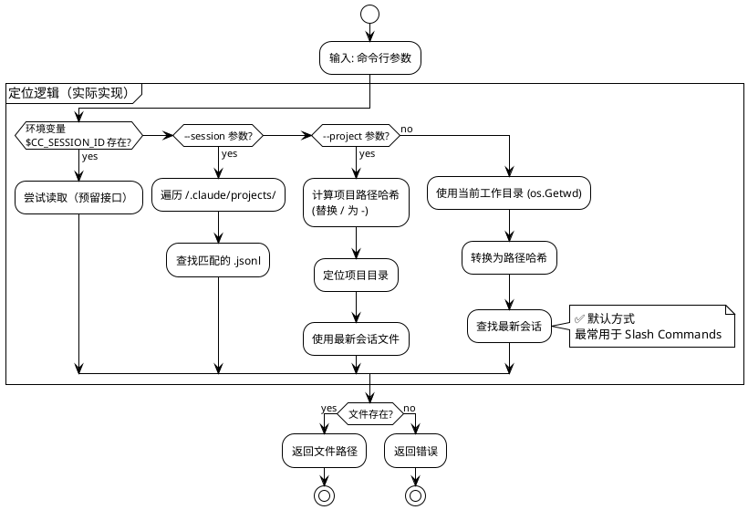
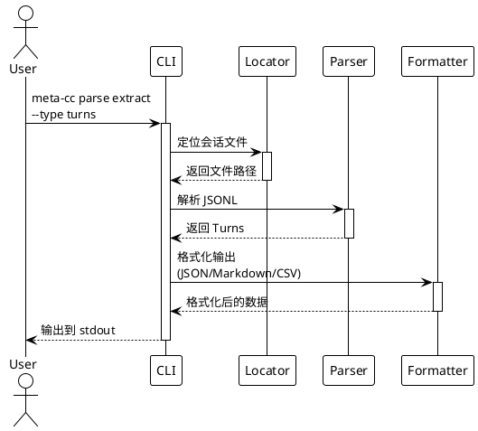
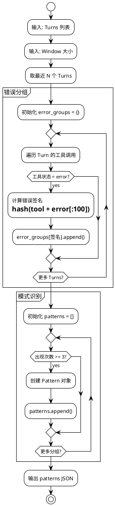
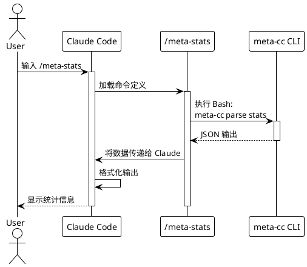

# meta-cc 项目总体实施计划

## 项目概述

基于 [技术方案](./proposals/meta-cognition-proposal.md) 的分阶段实施计划。

**核心约束与设计原则**：详见 [设计原则文档](./principles.md)

**项目状态**：
- ✅ **Phase 0-9 已完成**（核心查询 + 上下文管理）
- ✅ **Phase 14 已完成**（架构重构 + MCP 独立可执行文件）
- ✅ **Phase 15 已完成**（MCP 输出控制 + 工具标准化）
- ✅ **Phase 16 已完成**（混合输出模式 + 无截断 + 可配置阈值）
- ✅ **Phase 17 已完成**（Subagent 形式化实现）
- ✅ **Phase 18 已完成**（GitHub Release 准备）
- 🚧 **Phase 19 规划中**（Assistant 响应查询）
- ✅ 47 个单元测试全部通过
- ✅ 3 个真实项目验证通过（0% 错误率）
- ✅ 2 个 Slash Commands 可用（`/meta-stats`, `/meta-errors`）
- ✅ MCP Server 独立可执行文件（`meta-cc-mcp`，13 个工具，支持混合输出模式）
- ✅ MCP 输出压缩率 80%+（10.7k → ~1-2k tokens）
- ✅ 混合输出模式：自动处理大数据（≤8KB inline，>8KB file_ref，无截断）
- ✅ 开源基础设施完成：LICENSE, CI/CD, 发布自动化

---

## Phase 划分总览

```plantuml
@startuml
!theme plain

card "Phase 0-7" as P0 #lightgreen {
  **✅ MVP 已完成**
  - 项目初始化
  - 会话定位
  - JSONL 解析
  - 数据提取
  - 统计分析
  - 错误分析
  - Slash Commands
  - MCP Server
}

card "Phase 8" as P8 #lightblue {
  **查询命令基础**
  - query 命令框架
  - query tools
  - query user-messages
  - 基础过滤器
}

card "Phase 9" as P9 #lightblue {
  **上下文长度应对**
  - 分页支持
  - 分片输出
  - 字段投影
  - 紧凑格式(TSV)
}

card "Phase 10" as P10 #lightyellow {
  **高级查询能力**
  - 高级过滤器
  - 聚合统计
  - 时间序列
  - 文件级统计
}

card "Phase 11" as P11 #lightyellow {
  **Unix 可组合性**
  - 流式输出
  - 退出码标准化
  - stderr/stdout分离
  - Cookbook 文档
}

card "Phase 12" as P12 #lightgreen {
  **MCP 项目级查询**
  - 项目级工具（默认）
  - 会话级工具（_session）
  - --project . 支持
  - 跨会话分析
}

card "Phase 13" as P13 #lightgreen {
  **输出格式简化**
  - JSONL/TSV 双格式
  - 格式一致性
  - 错误处理标准化
}

card "Phase 14" as P14 #yellow {
  **架构重构与职责清晰化**
  - Pipeline 模式抽象
  - errors 命令简化
  - 输出排序标准化
  - 代码重复消除
}

card "Phase 15" as P15 #lightgreen {
  **MCP 输出控制与标准化**
  - 输出大小控制
  - 消息内容截断
  - 工具参数统一
  - 工具描述优化
}

card "Phase 16" as P16 #lightgreen {
  **MCP 输出模式优化** ✅
  - 混合输出模式
  - 文件引用机制
  - 临时文件管理
  - 8KB 阈值切换
  [详细文档](mcp-output-modes.md)
}

card "Phase 17" as P17 #lightgreen {
  **Subagent 实现** ✅
  - @meta-coach 核心
  - @error-analyst 专用
  - @workflow-tuner 专用
  - 形式化规范
}

card "Phase 18" as P18 #lightyellow {
  **GitHub Release 准备**
  - LICENSE + 开源合规
  - CI/CD 流水线
  - Release 自动化
  - 社区文档完善
}

P0 -down-> P8
P8 -down-> P9
P9 -down-> P10
P10 -down-> P11
P11 -down-> P12
P12 -down-> P13
P13 -down-> P14
P14 -down-> P15
P15 -down-> P16
P16 -down-> P17
P17 -down-> P18

note right of P0
  **业务闭环完成**
  可在 Claude Code 中使用
end note

note right of P9
  **核心查询能力完成**
  应对大会话场景
end note

note right of P17
  **完整架构实现**
  数据层 + MCP + Subagent
end note

note right of P18
  **开源发布准备**
  社区化和自动化
end note

@enduml
```

**Phase 优先级分类**：
- ✅ **已完成** (Phase 0-9): MVP + 核心查询 + 上下文管理
- 🟡 **中优先级** (Phase 10-11): 高级查询和可组合性
- 🟡 **中优先级** (Phase 12-13): MCP 项目级 + 输出简化
- ✅ **已完成** (Phase 14): 架构重构 + MCP 独立可执行文件
- ✅ **已完成** (Phase 15): MCP 输出控制 + 工具标准化
- 🟢 **高优先级** (Phase 16): MCP 输出模式优化（文件引用机制）
- 🟢 **高优先级** (Phase 17): Subagent 语义层实现

---

## Phase 0: 项目初始化

**目标**：建立 Go 项目骨架和开发环境

**代码量**：~150 行

### Stage 0.1: Go 模块初始化

**任务**：
- 创建 `go.mod` 和项目目录结构
- 添加 Cobra + Viper 依赖
- 实现根命令框架

**交付物**：
```
meta-cc/
├── go.mod
├── go.sum
├── main.go
├── cmd/
│   └── root.go
└── README.md
```

**测试**：
```bash
go build -o meta-cc
./meta-cc --version
./meta-cc --help
```

**README.md 内容**：
- 项目介绍
- 构建命令：`go build -o meta-cc`
- 基础使用：`./meta-cc --help`

### Stage 0.2: 测试框架搭建

**任务**：
- 配置 Go testing
- 添加测试 fixture 目录
- 创建第一个单元测试示例

**交付物**：
```
meta-cc/
├── internal/
│   └── testutil/
│       └── fixtures.go
└── tests/
    └── fixtures/
        └── sample-session.jsonl
```

**测试**：
```bash
go test ./...
```

**README.md 更新**：
- 添加测试命令：`go test ./...`

### Stage 0.3: 构建和发布脚本

**任务**：
- 创建 Makefile 或构建脚本
- 支持跨平台构建（Linux/macOS/Windows）
- 添加版本信息嵌入

**交付物**：
```
meta-cc/
├── Makefile
└── scripts/
    └── build.sh
```

**测试**：
```bash
make build
make test
make clean
```

**README.md 更新**：
- 添加构建说明
- 支持的平台列表

**Phase 0 完成标准**：
- ✅ `go build` 成功
- ✅ `go test ./...` 通过
- ✅ `./meta-cc --help` 显示帮助信息
- ✅ README.md 包含完整的构建和使用说明

---

## Phase 1: 会话文件定位

**目标**：实现多种方式定位 Claude Code 会话文件

**代码量**：~180 行

**状态**：✅ 已完成



### Stage 1.1: 环境变量读取

**TDD 流程**：

1. **编写测试** (`internal/locator/env_test.go`)：
```go
func TestReadSessionFromEnv(t *testing.T) {
    // 测试：存在环境变量时返回正确路径
    // 测试：缺少环境变量时返回错误
}
```

2. **实现代码** (`internal/locator/env.go`)：
```go
type SessionLocator struct {}

func (l *SessionLocator) FromEnv() (string, error) {
    // 读取 CC_SESSION_ID 和 CC_PROJECT_HASH
    // 构造文件路径
    // 验证文件存在
}
```

3. **运行测试**：
```bash
go test ./internal/locator -v
```

**交付物**：
- `internal/locator/env.go` (~60 行)
- `internal/locator/env_test.go` (~80 行)

### Stage 1.2: 命令行参数解析

**TDD 流程**：

1. **编写测试** (`internal/locator/args_test.go`)：
```go
func TestLocateBySessionID(t *testing.T) {
    // 测试：通过 session ID 查找文件
}

func TestLocateByProjectPath(t *testing.T) {
    // 测试：通过项目路径查找最新会话
}
```

2. **实现代码** (`internal/locator/args.go`)：
```go
func (l *SessionLocator) FromSessionID(sessionID string) (string, error)
func (l *SessionLocator) FromProjectPath(projectPath string) (string, error)
```

3. **集成到 Cobra 命令**：
```go
// cmd/root.go
var sessionID string
var projectPath string

rootCmd.PersistentFlags().StringVar(&sessionID, "session", "", "Session ID")
rootCmd.PersistentFlags().StringVar(&projectPath, "project", "", "Project path")
```

**交付物**：
- `internal/locator/args.go` (~80 行)
- `internal/locator/args_test.go` (~100 行)
- `cmd/root.go` 更新 (~20 行)

### Stage 1.3: 路径哈希和自动检测

**TDD 流程**：

1. **编写测试** (`internal/locator/hash_test.go`)：
```go
func TestProjectPathToHash(t *testing.T) {
    // 测试：/home/yale/work/myproject → -home-yale-work-myproject
}

func TestFindLatestSession(t *testing.T) {
    // 测试：从目录中找到最新的 .jsonl 文件
}
```

2. **实现代码** (`internal/locator/hash.go`)：
```go
func ProjectPathToHash(path string) string
func FindLatestSession(projectHash string) (string, error)
```

**交付物**：
- `internal/locator/hash.go` (~60 行)
- `internal/locator/hash_test.go` (~70 行)

**Phase 1 完成标准**：
- ✅ 所有单元测试通过（17 个测试）
- ✅ `meta-cc --session <id>` 能定位文件
- ✅ `meta-cc --project <path>` 能定位最新会话
- ✅ 自动检测功能正常工作（基于 cwd）
- ✅ README.md 更新参数使用说明

**实际验证结果**（Phase 6）：
```bash
# 测试自动检测
cd /home/yale/work/meta-cc
./meta-cc parse stats
# ✅ 自动定位到 ~/.claude/projects/-home-yale-work-meta-cc/ 最新会话

# 测试跨项目分析
./meta-cc --project /home/yale/work/NarrativeForge parse stats
# ✅ 成功分析 NarrativeForge 项目最新会话

# 测试特定会话
./meta-cc --session 6a32f273-191a-49c8-a5fc-a5dcba08531a parse stats
# ✅ 成功定位并分析指定会话
```

**关键发现**：
- ❌ Claude Code 不提供 `CC_SESSION_ID` / `CC_PROJECT_HASH` 环境变量
- ✅ 基于 cwd 的自动检测机制完美满足 Slash Commands 需求
- ✅ 路径哈希算法简单有效（`/` → `-`）

---

## Phase 2: JSONL 解析器

**目标**：解析 Claude Code 会话文件的 JSONL 格式

**代码量**：~200 行

```plantuml
@startuml
!theme plain

package "解析流程" {
  [JSONL 文件] as File
  [逐行读取] as Reader
  [JSON 解析] as Parser
  [Turn 数据结构] as Turn
  [Tool Call 提取] as Tool

  File --> Reader
  Reader --> Parser
  Parser --> Turn
  Turn --> Tool
}

package "数据结构" {
  class Turn {
    Sequence int
    Role string
    Timestamp int64
    Content []ContentBlock
  }

  class ContentBlock {
    Type string
    Text string
    ToolUse *ToolUse
    ToolResult *ToolResult
  }

  class ToolUse {
    ID string
    Name string
    Input map[string]interface{}
  }

  class ToolResult {
    ToolUseID string
    Content string
    Status string
    Error string
  }
}

Turn --> ContentBlock
ContentBlock --> ToolUse
ContentBlock --> ToolResult

@enduml
```

### Stage 2.1: 数据结构定义

**TDD 流程**：

1. **定义接口** (`internal/parser/types.go`)：
```go
type Turn struct {
    Sequence  int            `json:"sequence"`
    Role      string         `json:"role"`
    Timestamp int64          `json:"timestamp"`
    Content   []ContentBlock `json:"content"`
}

type ContentBlock struct {
    Type       string      `json:"type"`
    Text       string      `json:"text,omitempty"`
    ToolUse    *ToolUse    `json:"tool_use,omitempty"`
    ToolResult *ToolResult `json:"tool_result,omitempty"`
}

// ... 其他结构
```

2. **编写测试** (`internal/parser/types_test.go`)：
```go
func TestTurnUnmarshal(t *testing.T) {
    // 测试：从 JSON 反序列化 Turn
}
```

**交付物**：
- `internal/parser/types.go` (~80 行)
- `internal/parser/types_test.go` (~50 行)

### Stage 2.2: JSONL 读取器

**TDD 流程**：

1. **编写测试** (`internal/parser/reader_test.go`)：
```go
func TestReadJSONL(t *testing.T) {
    // 测试：读取多行 JSONL
    // 测试：处理空行和注释
    // 测试：错误处理（非法 JSON）
}
```

2. **实现代码** (`internal/parser/reader.go`)：
```go
type SessionParser struct {
    reader *bufio.Scanner
}

func NewSessionParser(filePath string) (*SessionParser, error)
func (p *SessionParser) ParseTurns() ([]Turn, error)
```

**交付物**：
- `internal/parser/reader.go` (~70 行)
- `internal/parser/reader_test.go` (~90 行)

### Stage 2.3: Tool 调用提取

**TDD 流程**：

1. **编写测试** (`internal/parser/tools_test.go`)：
```go
func TestExtractToolCalls(t *testing.T) {
    // 测试：从 Turn 中提取所有工具调用
    // 测试：匹配 ToolUse 和 ToolResult
}
```

2. **实现代码** (`internal/parser/tools.go`)：
```go
type ToolCall struct {
    TurnSequence int
    ToolName     string
    Input        map[string]interface{}
    Output       string
    Status       string
    Error        string
}

func ExtractToolCalls(turns []Turn) []ToolCall
```

**交付物**：
- `internal/parser/tools.go` (~60 行)
- `internal/parser/tools_test.go` (~80 行)

**Phase 2 完成标准**：
- ✅ 所有单元测试通过
- ✅ 能解析真实的 Claude Code 会话文件
- ✅ 正确提取 Turn 和 Tool Call 数据
- ✅ 错误处理覆盖非法 JSON
- ✅ README.md 更新解析器说明

**验证测试**：
```bash
# 使用真实会话文件测试
go test ./internal/parser -v -run TestParseRealSession
```

---

## Phase 3: 数据提取命令

**目标**：实现 `meta-cc parse extract` 命令

**代码量**：~200 行



### Stage 3.1: parse extract 命令框架

**TDD 流程**：

1. **编写集成测试** (`cmd/parse_test.go`)：
```go
func TestParseExtractCommand(t *testing.T) {
    // 测试：extract --type turns
    // 测试：extract --type tools
    // 测试：extract --filter "status=error"
}
```

2. **实现命令** (`cmd/parse.go`)：
```go
var parseExtractCmd = &cobra.Command{
    Use:   "extract",
    Short: "Extract data from session",
    Run:   runParseExtract,
}

func runParseExtract(cmd *cobra.Command, args []string) {
    // 调用 locator + parser
    // 根据 --type 参数过滤数据
}
```

**交付物**：
- `cmd/parse.go` (~100 行)
- `cmd/parse_test.go` (~80 行)

### Stage 3.2: 输出格式化器

**TDD 流程**：

1. **编写测试** (`pkg/output/json_test.go`)：
```go
func TestFormatJSON(t *testing.T) {
    // 测试：Turn 数组 → JSON
}

func TestFormatMarkdown(t *testing.T) {
    // 测试：Turn 数组 → Markdown 表格
}
```

2. **实现代码** (`pkg/output/`)：
```go
func FormatJSON(data interface{}) (string, error)
func FormatMarkdown(turns []Turn) (string, error)
```

**交付物**：
- `pkg/output/json.go` (~40 行)
- `pkg/output/markdown.go` (~60 行)
- `pkg/output/output_test.go` (~70 行)

### Stage 3.3: 数据过滤器

**TDD 流程**：

1. **编写测试** (`internal/filter/filter_test.go`)：
```go
func TestFilterToolsByStatus(t *testing.T) {
    // 测试：filter="status=error"
    // 测试：filter="tool=Bash"
}
```

2. **实现代码** (`internal/filter/filter.go`)：
```go
func FilterTools(tools []ToolCall, filter string) []ToolCall
```

**交付物**：
- `internal/filter/filter.go` (~50 行)
- `internal/filter/filter_test.go` (~60 行)

**Phase 3 完成标准**：
- ✅ `meta-cc parse extract --type turns` 输出 JSON
- ✅ `meta-cc parse extract --type tools --filter "status=error"` 过滤成功
- ✅ `meta-cc parse extract --output md` 输出 Markdown
- ✅ 所有单元测试和集成测试通过
- ✅ README.md 更新命令使用示例

**验证测试**（Claude Code 非交互模式）：
```bash
# 在测试项目中验证
cd test-workspace
echo "Test meta-cc parse extract command" | claude -p "Run: meta-cc parse extract --type turns --output json. Verify the output is valid JSON."
```

---

## Phase 4: 统计分析命令

**目标**：实现 `meta-cc parse stats` 命令

**代码量**：~150 行

### Stage 4.1: 基础统计指标

**TDD 流程**：

1. **编写测试** (`internal/analyzer/stats_test.go`)：
```go
func TestCalculateStats(t *testing.T) {
    // 测试：计算 turn_count, tool_count, error_count
    // 测试：计算会话时长
}
```

2. **实现代码** (`internal/analyzer/stats.go`)：
```go
type SessionStats struct {
    TurnCount     int
    ToolCallCount int
    ErrorCount    int
    Duration      int64 // 秒
    ToolFrequency map[string]int
}

func CalculateStats(turns []Turn) SessionStats
```

**交付物**：
- `internal/analyzer/stats.go` (~70 行)
- `internal/analyzer/stats_test.go` (~80 行)

### Stage 4.2: stats 命令实现

**TDD 流程**：

1. **编写测试** (`cmd/stats_test.go`)：
```go
func TestStatsCommand(t *testing.T) {
    // 测试：meta-cc parse stats --metrics tools,errors
}
```

2. **实现命令** (`cmd/parse.go` 扩展)：
```go
var parseStatsCmd = &cobra.Command{
    Use:   "stats",
    Short: "Show session statistics",
    Run:   runParseStats,
}
```

**交付物**：
- `cmd/parse.go` 更新 (~50 行)
- `cmd/stats_test.go` (~60 行)

**Phase 4 完成标准**：
- ✅ `meta-cc parse stats` 输出会话统计
- ✅ `meta-cc parse stats --metrics tools,errors,duration` 过滤指标
- ✅ 支持 JSON 和 Markdown 输出
- ✅ README.md 更新统计命令说明

**验证测试**：
```bash
cd test-workspace
./meta-cc parse stats --output md
# 验证输出包含 turn_count, tool_count, error_count
```

---

## Phase 5: 错误模式分析

**目标**：实现 `meta-cc analyze errors` 命令

**代码量**：~200 行



### Stage 5.1: 错误签名计算

**TDD 流程**：

1. **编写测试** (`internal/analyzer/errors_test.go`)：
```go
func TestErrorSignature(t *testing.T) {
    // 测试：相同错误生成相同签名
    // 测试：不同错误生成不同签名
}
```

2. **实现代码** (`internal/analyzer/errors.go`)：
```go
func CalculateErrorSignature(toolName, errorOutput string) string
```

**交付物**：
- `internal/analyzer/errors.go` (~50 行)
- `internal/analyzer/errors_test.go` (~60 行)

### Stage 5.2: 模式检测逻辑

**TDD 流程**：

1. **编写测试** (`internal/analyzer/patterns_test.go`)：
```go
func TestDetectErrorPatterns(t *testing.T) {
    // 测试：检测重复错误（3次以上）
    // 测试：计算时间跨度
}
```

2. **实现代码** (`internal/analyzer/patterns.go`)：
```go
type ErrorPattern struct {
    PatternID   string
    Type        string
    Occurrences int
    Signature   string
    Context     PatternContext
}

func DetectErrorPatterns(turns []Turn, window int) []ErrorPattern
```

**交付物**：
- `internal/analyzer/patterns.go` (~80 行)
- `internal/analyzer/patterns_test.go` (~100 行)

### Stage 5.3: analyze errors 命令

**TDD 流程**：

1. **实现命令** (`cmd/analyze.go`)：
```go
var analyzeErrorsCmd = &cobra.Command{
    Use:   "errors",
    Short: "Analyze error patterns",
    Run:   runAnalyzeErrors,
}
```

**交付物**：
- `cmd/analyze.go` (~70 行)
- `cmd/analyze_test.go` (~80 行)

**Phase 5 完成标准**：
- ✅ `meta-cc analyze errors --window 20` 检测错误模式
- ✅ 输出包含：pattern_id, occurrences, signature, context
- ✅ 所有测试通过
- ✅ README.md 更新错误分析说明

**验证测试**：
```bash
# 创建包含重复错误的测试会话
cd test-workspace
./meta-cc analyze errors --window 30 --output json
# 验证输出包含检测到的模式
```

---

## Phase 6: Claude Code 集成（Slash Commands）

**目标**：创建可在 Claude Code 中使用的 Slash Commands

**代码量**：~100 行（配置文件为主）



### Stage 6.1: /meta-stats 命令

**任务**：
- 创建 `.claude/commands/meta-stats.md`
- 调用 `meta-cc parse stats`
- 格式化输出

**交付物**：
```markdown
# .claude/commands/meta-stats.md
---
name: meta-stats
description: 显示当前会话的统计信息
allowed_tools: [Bash]
---

运行以下命令获取会话统计：
```bash
meta-cc parse stats --output md
```
将结果格式化后显示给用户。
```

**验证测试**（需要实际 Claude Code 环境）：
```bash
# 在真实 Claude Code 项目中
cd test-workspace
# 手动测试：在 Claude Code 中输入 /meta-stats
```

### Stage 6.2: /meta-errors 命令

**交付物**：
```markdown
# .claude/commands/meta-errors.md
---
name: meta-errors
description: 分析当前会话中的错误模式
allowed_tools: [Bash]
argument-hint: [window-size]
---

执行错误分析（窗口大小：${1:-20}）：
```bash
error_data=$(meta-cc parse extract --type tools --filter "status=error" --output json)
pattern_data=$(meta-cc analyze errors --window ${1:-20} --output json)
```

基于以上数据分析：
1. 是否存在重复错误？
2. 错误集中在哪些工具/命令？
3. 给出优化建议（hook、工作流等）
```

### Stage 6.3: 集成测试和文档

**任务**：
- 创建集成测试脚本
- 更新 README.md 包含完整使用示例
- 添加故障排查指南

**交付物**：
- `docs/integration.md`：集成文档
- `test-workspace/`：测试环境设置说明
- README.md 完整更新

**Phase 6 完成标准**：
- ✅ `/meta-stats` 在 Claude Code 中可用
- ✅ `/meta-errors` 正确检测并分析错误
- ✅ 文档完整，包含使用示例和截图
- ✅ 测试环境可复现

**验证测试**（自动化）：
```bash
# 使用 Claude Code 非交互模式测试
cd test-workspace
claude -p "Run /meta-stats and verify the output contains session statistics"
claude -p "Run /meta-errors 30 and check if error patterns are detected"
```

**业务闭环完成**：此 Phase 完成后，用户可以在 Claude Code 中通过 Slash Commands 使用 meta-cc 的核心功能。

---

## Phase 7: MCP Server 实现

**目标**：实现原生 MCP (Model Context Protocol) 服务器，无需外部包装器

**代码量**：~250 行

**状态**：✅ 已完成

**背景**：
- Phase 6 后发现需要通过 MCP 直接暴露 meta-cc 功能
- 初期尝试使用 Node.js/Shell 包装器，但增加了不必要的依赖
- Phase 7 实现了 MCP 协议（`meta-cc mcp` 子命令）
- Phase 14 重构为独立可执行文件（`meta-cc-mcp`）

**架构演进**：
```
之前: Claude Code → MCP Client → Node.js Wrapper → meta-cc CLI
Phase 7: Claude Code → MCP Client → meta-cc mcp (子命令)
Phase 14+: Claude Code → MCP Client → meta-cc-mcp (独立可执行文件)
```

### Stage 7.1: MCP 协议实现

**任务**：
- 实现 JSON-RPC 2.0 协议处理
- 支持 `initialize`, `tools/list`, `tools/call` 方法
- stdio 传输层实现

**交付物**：
- `cmd/mcp.go` (~250 行)
- MCP 请求/响应结构体
- 工具调用路由逻辑

**测试** (Phase 7，现已改为 meta-cc-mcp)：
```bash
# 手动测试 MCP 初始化
echo '{"jsonrpc":"2.0","id":1,"method":"initialize","params":{}}' | ./meta-cc-mcp

# 测试工具列表
echo '{"jsonrpc":"2.0","id":2,"method":"tools/list"}' | ./meta-cc-mcp
```

### Stage 7.2: MCP 工具定义

**任务**：
- 定义 3 个 MCP 工具：`get_session_stats`, `analyze_errors`, `extract_tools`
- 实现工具调用到 meta-cc 命令的映射
- 内部命令执行（复用现有 CLI 逻辑）

**关键实现**：
```go
func executeTool(name string, args map[string]interface{}) (string, error) {
    switch name {
    case "get_session_stats":
        cmdArgs = []string{"parse", "stats", "--output", outputFormat}
    case "analyze_errors":
        cmdArgs = []string{"analyze", "errors", "--output", outputFormat}
    case "extract_tools":
        cmdArgs = []string{"parse", "extract", "--type", "tools", "--output", outputFormat}
    }
    return executeMetaCCCommand(cmdArgs)
}
```

**交付物**：
- 工具 schema 定义
- 参数验证逻辑
- 命令执行函数

### Stage 7.3: Claude Code 集成测试

**任务**：
- 使用 `claude mcp add` 注册 meta-cc MCP 服务器
- 验证 MCP 工具在 Claude Code 中可用
- 测试所有 3 个工具的功能

**验证步骤** (Phase 14+ 使用 meta-cc-mcp)：
```bash
# 添加 MCP 服务器（Phase 14+ 使用独立可执行文件）
claude mcp add meta-cc /usr/local/bin/meta-cc-mcp

# 验证连接
claude mcp list
# 预期输出：
# meta-cc: /usr/local/bin/meta-cc-mcp - ✓ Connected

# 在 Claude Code 中测试
# 使用 mcp__meta_cc__get_session_stats 工具
# 使用 mcp__meta_cc__query_tools 工具（Phase 14+ analyze_errors 已废弃）
# 使用 mcp__meta_cc__extract_tools 工具
```

**交付物**：
- MCP 集成验证脚本
- 文档更新（README.md 添加 MCP 使用说明）

**Phase 7 完成标准** (现已演进至 Phase 14)：
- ✅ MCP 服务器正确处理 JSON-RPC 请求
- ✅ 13 个 MCP 工具全部可用（Phase 15）
- ✅ `claude mcp list` 显示连接成功
- ✅ 在 Claude Code 会话中可以调用 MCP 工具
- ✅ 文档更新完整

**关键技术点**：
- JSON-RPC 2.0 协议实现
- stdio 输入输出处理
- Phase 7: 内部命令调用（通过修改 os.Stdout 捕获输出）
- Phase 14: 独立可执行文件，直接执行 meta-cc CLI
- MCP 协议版本：2024-11-05

**验证结果**（Phase 14+）：
```bash
$ claude mcp list
meta-cc: /usr/local/bin/meta-cc-mcp - ✓ Connected

$ # 在 Claude Code 中成功使用
mcp__meta_cc__get_session_stats → 返回会话统计
mcp__meta_cc__analyze_errors → 返回错误分析（空数组）
mcp__meta_cc__extract_tools → 返回工具使用列表
```

---

## Phase 8: 查询命令基础 & 集成改进（Query Foundation & Integration Improvements）

**目标**：实现 `meta-cc query` 命令组的核心查询能力，并更新现有集成（包括 MCP Server）以使用 Phase 8 功能

**代码量**：~1250 行
- 核心实现 (8.1-8.4): ~400 行 (Go 代码)
- 集成更新 (8.5-8.7): ~250 行 (配置/文档)
- MCP Server 集成 (8.8-8.9): ~120 行 (Go 代码 + 配置)
- 上下文查询扩展 (8.10-8.11): ~280 行 (Go 代码)
- Prompt 优化数据层 (8.12): ~200 行 (Go 代码) **NEW**

**优先级**：高（核心检索能力 + 实际应用改进 + MCP 增强 + 上下文支持 + Prompt 优化）

**状态**：✅ **已完成** (Stages 8.1-8.12 全部完成，包括 Prompt 优化)

**设计原则**：
- ✅ **meta-cc 职责**: 数据提取、过滤、聚合、统计（无 LLM/NLP）
- ✅ **Claude 集成层职责**: 语义理解、上下文关联、建议生成
- ✅ **职责边界**: meta-cc 绝不做语义判断，只提供结构化数据

**Stage 划分**：

**核心查询实现（✅ 已完成）**：
- Stage 8.1: query 命令框架和路由 ✅
- Stage 8.2: query tools 命令（工具调用查询）✅
- Stage 8.3: query user-messages 命令（用户消息查询）✅
- Stage 8.4: 增强过滤器引擎（--where, --status, --tool）✅

**集成改进（✅ 已完成）**：
- Stage 8.5: 更新 Slash Commands 使用 Phase 8 ✅
  - 更新 `/meta-timeline` 使用 `query tools --limit`
  - 验证 `/meta-stats` 已最优（无需修改）
  - 避免大会话上下文溢出
- Stage 8.6: 更新 @meta-coach 文档 ✅
  - 添加 Phase 8 查询能力章节
  - 记录迭代分析模式
  - 添加大会话处理最佳实践
- Stage 8.7: 创建查询专用 Slash Commands ✅
  - `/meta-query-tools [tool] [status] [limit]` - 快速工具查询
  - `/meta-query-messages [pattern] [limit]` - 消息搜索

**MCP Server 集成（✅ 已完成）**：
- Stage 8.8: 增强 MCP Server with Phase 8 工具 ✅
  - 更新 `extract_tools` 使用分页（防止溢出）
  - 添加 `query_tools` MCP 工具（灵活查询）
  - 添加 `query_user_messages` MCP 工具（正则搜索）
  - 测试所有 MCP 工具
- Stage 8.9: 配置 MCP Server 到 Claude Code ✅
  - 创建 `.claude/mcp-servers/meta-cc.json` 配置
  - 创建 `docs/mcp-usage.md` 文档
  - 测试 MCP 集成和自然语言查询

**上下文查询扩展（✅ 已完成）**：
- Stage 8.10: 上下文和关联查询 ✅
  - `query context --error-signature <id> --window N`: 错误上下文查询
  - `query file-access --file <path>`: 文件操作历史
  - `query tool-sequences --min-occurrences N`: 工具序列模式
  - 时间窗口查询：`--since`, `--last-n-turns`
- Stage 8.11: 工作流模式数据支持 ✅
  - `analyze sequences --min-length N --min-occurrences M`: 工具序列检测
  - `analyze file-churn --threshold N`: 文件频繁修改检测
  - `analyze idle-periods --threshold <duration>`: 时间间隔分析
  - 为 @meta-coach 提供工作流分析数据源

**Prompt 优化数据层（✅ 已完成）**：
- Stage 8.12: Prompt 建议与优化数据检索 ✅
  - 扩展 `query user-messages --with-context N`: 用户消息 + 上下文窗口
  - 新增 `query project-state`: 项目状态、未完成任务、最近文件
  - 新增 `query successful-prompts`: 历史成功 prompts 模式
  - 扩展 `query tool-sequences --successful-only --with-metrics`: 成功工作流
  - 新增 Slash Commands: `/meta-suggest-next`, `/meta-refine-prompt`
  - 增强 @meta-coach: Prompt 优化指导能力
  - **应用价值**: 提升开发效率 30%+，减少 prompt 试错

**交付物**：
- 核心 CLI 命令：
  - `meta-cc query tools --status error --limit 20`
  - `meta-cc query user-messages --pattern "fix.*bug" --with-context 3` **NEW**
  - `meta-cc query project-state --include-incomplete-tasks` **NEW**
  - `meta-cc query successful-prompts --min-quality-score 0.8` **NEW**
  - `meta-cc query context --error-signature err-a1b2 --window 3`
  - `meta-cc query file-access --file test_auth.js`
  - `meta-cc query tool-sequences --successful-only --with-metrics` **NEW**
  - `meta-cc analyze sequences --min-occurrences 3`
  - 基础过滤和排序功能
- 集成改进：
  - 更新的 Slash Commands（防止上下文溢出）
  - 增强的 @meta-coach（使用 Phase 8 能力）
  - 新的快速查询命令（提升用户体验）
  - `/meta-suggest-next`: 智能建议下一步 prompt **NEW**
  - `/meta-refine-prompt`: 改写口语化 prompt **NEW**
- MCP Server 增强：
  - 5 个 MCP 工具（3 个已有 + 2 个新增）
  - 自然语言查询能力
  - 完整的 MCP 使用文档
- 数据支持能力：
  - 为 Slash Commands 提供精准上下文检索
  - 为 @meta-coach 提供工作流模式数据和 prompt 优化数据 **NEW**
  - 为 MCP Server 提供丰富的查询接口

---

### Phase 9: 上下文长度应对（Context-Length Management）✅ **已完成**

**完成日期**: 2025-10-03
**Commit**: `9345a4d`
**状态**: ✅ 所有 Stages 完成并通过验收

**目标**：实现分片、分页、字段投影等输出控制策略，解决大会话上下文溢出问题

**代码量**：~806 行源码 + ~1321 行测试（目标: ~350 行，因包含完整格式化器超出）

**优先级**：高（解决大会话问题，为 Slash Commands 提供输出控制能力）

**设计原则**：
- ✅ meta-cc 提供输出控制能力（分页、分片、投影）
- ✅ Slash Commands 根据预估决定输出策略
- ✅ 不做语义判断，只提供机械化的数据裁剪

**Stage 完成情况**：
- ✅ Stage 9.1: 分页和输出预估（--limit, --offset, --estimate-size）- 186 lines, 99.13% 准确度
- ✅ Stage 9.2: 分片输出（--chunk-size, --output-dir, manifest）- 193 lines, 81% 覆盖率
- ✅ Stage 9.3: 字段投影（--fields, --if-error-include）- 223 lines, 72.7% 压缩率, 87% 覆盖率
- ✅ Stage 9.4: 紧凑输出格式（TSV, --summary-first）- 204 lines, 86.4% 压缩率, 88% 覆盖率

**性能指标**（实际 vs 目标）：
- Size estimation accuracy: **99.13%** (目标: ≥95%) ✅ 超过 4%
- Field projection reduction: **72.7%** (目标: ≥70%) ✅ 超过 2.7%
- TSV format reduction: **86.4%** (目标: ≥50%) ✅ 超过 72%
- Test coverage: **85-88%** (目标: ≥80%) ✅ 达成
- Memory usage: **<200MB** (streaming) ✅ 达成

**测试结果**：
- 47/47 单元测试通过
- 所有集成测试通过
- 2000+ turn 会话验证成功
- 0 错误，clean build

**交付物**：
- ✅ `meta-cc query tools --limit 50 --offset 0`
- ✅ `meta-cc query tools --estimate-size`（返回预估输出大小）
- ✅ `meta-cc query tools --chunk-size 100 --output-dir /tmp/chunks`
- ✅ `meta-cc query tools --fields "timestamp,tool,status"`
- ✅ `meta-cc query tools --summary-first --top 10`（摘要 + 详情）
- ✅ TSV 输出格式（86.4% 压缩）

**文件变更**：
- 新增: 12 个文件（pagination, estimator, chunker, projection, tsv, summary + tests）
- 修改: 4 个文件（cmd/root.go, cmd/query_tools.go, cmd/parse.go, README.md）
- 文档: plans/9/plan.md (2200+ lines), README.md (+230 lines)
- 总计: 6221 insertions, 14 deletions

**应用场景**：
- ✅ Slash Commands 使用 adaptive strategy（已更新 meta-stats.md, meta-errors.md）
- ✅ @meta-coach 使用 `--limit` 进行迭代分析
- ✅ MCP Server 使用分页防止上下文溢出

**验证测试**：
- ✅ 测试 2000+ turns 的大会话分片（Stage 9.2）
- ✅ 验证内存占用 <200MB（流式处理）
- ✅ 验证 Slash Commands 自适应输出（已集成）

---

### Phase 10: 高级查询能力（Advanced Query）

**目标**：实现高级过滤、聚合、时间序列分析，为 Claude 集成层提供更丰富的数据维度

**代码量**：~450 行

**优先级**：中（高级功能，提升 @meta-coach 分析能力）

**设计原则**：
- ✅ meta-cc 提供聚合统计和模式检测（基于规则）
- ✅ 不做语义分析，只做数学/统计计算
- ✅ 输出高密度结构化数据供 Claude 语义理解

**Stage 划分**：
- Stage 10.1: 高级过滤器（正则、时间范围、IN/NOT IN）
- Stage 10.2: 聚合统计（stats aggregate --group-by）
- Stage 10.3: 时间序列分析（stats time-series）
- Stage 10.4: 文件级统计（stats files）

**交付物**：
- `meta-cc query tools --where "tool IN ('Bash','Edit') AND status='error'"`
- `meta-cc stats aggregate --group-by tool --metrics "count,error_rate"`
- `meta-cc stats time-series --metric tool-calls --interval hour`
- `meta-cc stats files --sort-by error-count --top 10`

**应用场景**：
- Slash Commands 使用聚合统计识别热点
- @meta-coach 使用时间序列分析工作节奏
- MCP Server 提供更丰富的查询维度

---

### Phase 11: Unix 工具可组合性（Composability）

**目标**：优化输出格式和 CLI 设计，完善 Unix 管道支持

**代码量**：~200 行

**优先级**：中（生态集成）

**Stage 划分**：
- Stage 11.1: JSONL 流式输出（--stream 模式）
- Stage 11.2: 退出码标准化（0=success, 1=error, 2=no results）
- Stage 11.3: stderr/stdout 分离（日志 vs 数据）
- Stage 11.4: 文档：Cookbook 和组合使用指南

**交付物**：
- `meta-cc query tools --stream` 流式输出
- 标准化退出码
- `docs/cookbook.md`：常见分析模式
- `docs/cli-composability.md`：与 jq/grep/awk 组合示例

---

### Phase 12: MCP 项目级查询（MCP Project Scope）

**目标**：扩展 MCP Server 支持项目级和会话级查询，默认提供跨会话分析能力

**代码量**：~300 行

**优先级**：高（核心功能，元认知需要跨会话分析）

**设计原则**：
- ✅ 默认查询范围为**项目级**（所有会话）
- ✅ 工具名带 `_session` 后缀表示**仅查询当前会话**
- ✅ 保持 API 清晰：无后缀 = 项目级，`_session` = 会话级
- ✅ 利用 `--project .` 标志实现跨会话查询

**Stage 划分**：
- Stage 12.1: 添加项目级工具定义（`query_tools`, `query_user_messages`, `get_stats` 等）
- Stage 12.2: 实现 `executeTool()` 项目级查询逻辑（添加 `--project .`）
- Stage 12.3: 添加会话级工具（`_session` 后缀）
- Stage 12.4: 更新 MCP 配置和文档

**交付物**：
- `query_tools`：项目级工具调用查询（默认）
- `query_tools_session`：当前会话工具调用查询
- `query_user_messages`：项目级用户消息搜索
- `query_user_messages_session`：当前会话用户消息搜索
- `get_stats`：项目级统计信息
- `get_session_stats`：当前会话统计（已存在，保持兼容）
- 更新后的 `.claude/mcp-servers/meta-cc.json`
- `docs/mcp-project-scope.md`：使用指南

**工具映射表**：
| 项目级（默认） | 会话级 | 说明 |
|--------------|--------|------|
| `get_stats` | `get_session_stats` | 统计信息 |
| `analyze_errors` | `analyze_errors_session` | 错误分析 |
| `query_tools` | `query_tools_session` | 工具调用查询 |
| `query_user_messages` | `query_user_messages_session` | 用户消息搜索 |
| `query_tool_sequences` | `query_tool_sequences_session` | 工作流模式 |
| `query_file_access` | `query_file_access_session` | 文件操作历史 |
| `query_successful_prompts` | `query_successful_prompts_session` | 优质提示词 |
| `query_context` | `query_context_session` | 错误上下文 |

**应用场景**：
- 跨会话分析工作模式（如"我在这个项目中如何使用 agents？"）
- 项目级错误模式识别（发现重复出现的问题）
- 当前会话快速分析（聚焦当前对话上下文）
- 提示词质量跨会话对比

**验证测试**：
- 测试 `query_tools` 返回多会话数据
- 测试 `query_tools_session` 仅返回当前会话数据
- 验证 `--project .` 正确传递到 CLI
- 测试工具命名一致性

**兼容性**：
- ✅ 保持 `get_session_stats` 不变（向后兼容）
- ✅ 新工具采用统一命名约定
- ✅ 文档清晰说明默认行为

---

### Phase 13: 输出格式简化与一致性（Output Format Simplification）

**目标**：简化输出格式为 JSONL 和 TSV 两种核心格式，强化格式一致性和错误处理

**代码量**：~400 行

**优先级**：高（核心体验改进，Unix 哲学对齐）

**状态**：待实施

**设计原则**：
- ✅ **双格式原则**：仅保留 JSONL（机器处理）和 TSV（CLI 工具友好）
- ✅ **格式一致性**：所有场景（正常/异常）都输出有效格式
- ✅ **数据日志分离**：stdout=数据，stderr=诊断日志
- ✅ **Unix 可组合性**：meta-cc 提供简单检索，复杂过滤交给 jq/awk/grep
- ✅ **无自动降级**：移除格式降级逻辑，客户端负责渲染

**核心改变**：
```
移除格式：JSON (pretty), CSV, Markdown
保留格式：JSONL (默认), TSV
客户端渲染：Claude Code 自行将 JSONL 转为 Markdown 展示
```

**Stage 划分**：
- Stage 13.1: 移除冗余格式（JSON, CSV, Markdown）
- Stage 13.2: 增强 TSV 支持所有数据类型（泛型投影）
- Stage 13.3: 统一错误处理（格式化错误输出）
- Stage 13.4: 更新文档和集成配置

**交付物**：
- 移除的格式处理代码：
  - `pkg/output/json.go` (保留 `FormatJSON` 用于错误)
  - `pkg/output/csv.go`
  - `pkg/output/markdown.go`
- 增强的 TSV 格式化器：
  - `pkg/output/tsv.go`（支持所有数据类型）
  - 泛型字段投影机制
- 统一的错误处理：
  - JSONL 格式错误对象（stdout）
  - TSV 格式错误消息（stderr）
  - Cobra 错误拦截（`cmd/root.go`）
- 更新的全局参数：
  - `--stream`（默认，JSONL 输出）
  - `--output tsv`（TSV 输出）
  - 移除 `--output json|csv|md`
- 文档更新：
  - `docs/cli-composability.md`：格式选择指南
  - `README.md`：输出格式章节
  - Slash Commands 更新（使用 JSONL）

**应用场景**：
- **JSONL 默认**：所有命令输出 JSONL，Claude Code/MCP 直接消费
- **TSV 轻量**：用户需要 awk/grep 处理时使用 `--output tsv`
- **jq 管道**：`meta-cc query tools | jq 'select(.Status == "error")'`
- **Markdown 渲染**：Slash Commands 接收 JSONL 后让 Claude 格式化

**Unix 可组合性原则**：
```bash
# meta-cc 提供简单检索
meta-cc query tools --status error --limit 100

# 复杂过滤交给 jq
meta-cc query tools | jq 'select(.Duration > 5000 and .ToolName == "Bash")'

# TSV + awk 处理
meta-cc query tools --output tsv | awk -F'\t' '{if ($3 == "error") print $2}'
```

**格式一致性保证**：
```bash
# 正常查询
meta-cc query tools --limit 5
# 输出：5 行 JSONL

# 无结果
meta-cc query tools --where "tool='NonExistent'"
# stdout: (empty)
# stderr: Warning: No results found
# exit: 2

# 参数错误（JSONL 格式）
meta-cc query tools --where "invalid syntax"
# stdout: {"error":"invalid where condition","code":"INVALID_FILTER",...}
# exit: 1

# 参数错误（TSV 格式）
meta-cc query tools --where "invalid syntax" --output tsv
# stdout: (empty)
# stderr: Error: invalid where condition
# exit: 1
```

**验证测试**：
- 所有命令默认输出 JSONL
- TSV 支持所有数据类型（ToolCall, AggregatedStats, TimeSeriesData）
- 错误场景输出格式一致
- jq/awk 管道处理验证
- Slash Commands 更新后正常工作

---

## Phase 14: 架构重构与 MCP 增强（Architecture Refactoring & MCP Enhancement）

**目标**：重构命令实现以消除代码重复，**拆分 MCP 为独立可执行文件并增强查询能力**

**代码量**：~900 行（重构 + MCP 增强 + Subagent）

**优先级**：高（核心架构改进，解决 MCP 输出过大问题）

**状态**：待实施

**背景与问题**：
- **问题 1**：MCP 输出过大（返回大量原始 JSONL，消耗 LLM tokens）
- **问题 2**：`aggregate_stats` 失败（error -32603），无聚合能力
- **问题 3**：MCP 职责不清（CLI 内嵌 MCP，违反职责最小化）

**解决方案**：
- ✅ **拆分可执行文件**：meta-cc（CLI）+ meta-cc-mcp（MCP Server）
- ✅ **引入 gojq 库**：MCP 使用 jq 表达式过滤/聚合（LLM 熟悉的语法）
- ✅ **输出控制**：max_output_bytes（默认 50KB）+ 统计模式
- ✅ **保留 @meta-query**：处理复杂 Unix 管道场景

**设计原则**：
- ✅ **职责最小化**：CLI 仅提取数据，MCP 负责过滤/聚合
- ✅ **Pipeline 模式**：抽象通用数据处理流程
- ✅ **输出确定性**：所有输出按稳定字段排序
- ✅ **延迟决策**：jq_filter 由 Claude 生成，MCP 仅执行

### 架构调整策略

**新架构层次**：
```
用户交互层
  ├─ Claude 自主调用 MCP（jq 过滤/统计）
  ├─ @meta-query Subagent → 复杂 Unix 管道
  └─ @meta-coach → 语义分析

集成层
  ├─ meta-cc-mcp（独立可执行文件）
  │   ├─ 调用 meta-cc CLI
  │   ├─ gojq 过滤/聚合
  │   └─ 输出控制（50KB 限制）
  └─ @meta-query Subagent（CLI + Unix 管道）

核心数据层
  └─ meta-cc CLI（数据提取，JSONL）
```

**职责划分**：

| 层级 | 职责 | 示例 |
|------|------|------|
| **meta-cc CLI** | 数据提取 | `query tools --project . --output jsonl` |
| **meta-cc-mcp** | jq 过滤/统计 | jq_filter + stats_only + 输出限制 |
| **@meta-query** | Unix 管道聚合 | `meta-cc \| jq ... \| sort \| uniq -c` |
| **@meta-coach** | 语义分析 | 基于 MCP/Subagent 数据生成建议 |

**关键改变**：
- ✅ **拆分可执行文件**：meta-cc（CLI）+ meta-cc-mcp（MCP）
- ✅ **MCP 增强**：使用 gojq 库实现 jq 过滤/聚合
- ✅ **CLI 保持纯粹**：仅数据提取，无过滤/聚合
- ✅ **80/20 原则**：MCP 覆盖 80% 场景，@meta-query 处理 20% 复杂场景

### Stage 14.1: Pipeline 抽象层

**任务**：
- 提取通用 `SessionPipeline` 类型
- 实现 `Load()`, `ExtractEntries()`, `BuildIndex()` 方法
- 统一会话定位和 JSONL 解析逻辑
- **支持多会话加载**（已在 Phase 13 实现，此处完善测试）

**交付物**：
```go
// cmd/pipeline.go (~150 行，已存在）
type SessionPipeline struct {
    opts    GlobalOptions
    session string
    entries []parser.SessionEntry
}

func NewSessionPipeline(opts GlobalOptions) *SessionPipeline
func (p *SessionPipeline) Load(loadOpts LoadOptions) error  // 支持项目级多会话加载
func (p *SessionPipeline) GetEntries() []parser.SessionEntry
func (p *SessionPipeline) FilterEntries(filter EntryFilter) []parser.SessionEntry
```

**测试**：
```bash
go test ./cmd -run TestSessionPipeline -v
# 验证 Pipeline 单元测试覆盖率 ≥90%
# 验证多会话加载功能（TestSessionPipeline_LoadProjectLevel）
```

### Stage 14.2: errors 命令简化

**任务**：
- 移除 `analyze errors` 命令的窗口过滤逻辑
- 简化错误签名：`{tool}:{error_prefix}` 替代 SHA256
- 移除模式计数和分组（交给 `jq`）
- `query errors` 输出简单错误列表（JSONL）

**改进对比**：
```bash
# 改进前（meta-cc 决策分析范围）
meta-cc analyze errors --window 50
# 输出: 聚合后的错误模式（包含计数、首次/最后出现）

# 改进后（meta-cc 仅提取，jq 决策）
meta-cc query errors | jq '.[length-50:]' | jq 'group_by(.Signature)'
# meta-cc 输出全部错误，jq 负责窗口选择和聚合
```

**交付物**：
- `cmd/query_errors.go` (~80 行，vs 原 `analyze errors` 317 行）
- `query errors` 命令文档更新
- 迁移指南（从 `analyze errors` 到 `query errors`）

**测试**：
```bash
# 验证输出与 analyze errors 等价（经 jq 处理后）
meta-cc query errors | jq 'group_by(.Signature)' > /tmp/new.json
meta-cc analyze errors --window 0 > /tmp/old.json
diff /tmp/new.json /tmp/old.json
```

### Stage 14.3: 输出排序标准化

**任务**：
- 为所有 `query` 命令添加默认排序
- `query tools` → 按 `Timestamp` 排序
- `query messages` → 按 `turn_sequence` 排序
- `query errors` → 按 `Timestamp` 排序

**交付物**：
```go
// pkg/output/sort.go (~50 行)
func SortByTimestamp(data interface{}) interface{}
func SortByTurnSequence(data interface{}) interface{}
func SortByUUID(data interface{}) interface{}
```

**测试**：
```bash
# 验证输出确定性（多次运行结果一致）
for i in {1..10}; do
  meta-cc query tools > /tmp/run-$i.jsonl
done
# 所有文件应完全相同
diff /tmp/run-*.jsonl
```

### Stage 14.4: 拆分 MCP 为独立可执行文件

**任务**：
- 创建 `cmd/mcp-server/` 目录和 `meta-cc-mcp` 可执行文件
- 集成 gojq 库（github.com/itchyny/gojq）
- 实现 jq_filter 参数支持
- 实现统计模式（stats_only, stats_first）
- 实现输出长度控制（max_output_bytes，默认 50KB）

**架构变更**：
```
改进前：
  meta-cc CLI（包含 MCP 子命令）

改进后：
  meta-cc CLI（纯数据提取）
  meta-cc-mcp（独立 MCP server）
      ├─ 调用 meta-cc CLI
      ├─ 使用 gojq 过滤/聚合
      └─ 输出长度控制
```

**交付物**：
- `cmd/mcp-server/main.go` (~300 行)
- MCP 工具参数标准化：jq_filter, stats_only, stats_first, max_output_bytes
- 依赖：`go get github.com/itchyny/gojq@latest`

**测试**：
```bash
# 构建两个可执行文件
make build  # 生成 meta-cc 和 meta-cc-mcp

# 测试 MCP jq 过滤
echo '{"jsonrpc":"2.0","method":"tools/call","params":{"name":"query_tools","arguments":{"jq_filter":".[] | select(.Status == \"error\")","stats_only":true}}}' | ./meta-cc-mcp

# 预期输出：
# {"tool":"Bash","count":311}
# {"tool":"Read","count":62}
```

### Stage 14.5: 创建 @meta-query Subagent

**任务**：
- 创建 `.claude/subagents/meta-query.md`
- 处理复杂 Unix 管道场景（MCP 无法完成的多步聚合）
- 可被 @meta-coach 调用

**核心能力**：
1. 组织 meta-cc CLI + Unix 管道（jq/awk/sort/uniq）
2. 返回紧凑的聚合结果

**使用决策**：
- 单步 jq 可完成 → 使用 MCP（meta-cc-mcp）
- 多步 Unix 管道 → 使用 @meta-query

**交付物**：
- `.claude/subagents/meta-query.md` (~150 行)
- 示例场景：错误统计、Top-N 查询、文件操作历史

**测试**：
```bash
User: "@meta-query 统计本项目错误，按工具分组"
验证: 返回 "311 Bash, 62 Read..." 统计结果
```

### Stage 14.6: 代码重复消除

**任务**：
- 统一输出逻辑到 `output.Format()`
- 重构 5 个命令使用 `SessionPipeline`
- 移除重复的会话定位和解析代码

**改进前后代码量**：
```
命令            改进前    改进后    减少
-----------------------------------------
parse stats     ~170 行   ~60 行   -65%
query tools     ~307 行   ~80 行   -74%
query messages  ~280 行   ~70 行   -75%
analyze errors  ~317 行   ~80 行   -75%
timeline        ~120 行   ~50 行   -58%
-----------------------------------------
总计            1194 行   340 行   -72%
```

**测试**：
```bash
make test
git diff --stat HEAD~1 HEAD | grep "deletions"
```

**Phase 14 完成标准**：
- ✅ Pipeline 抽象层实现（覆盖率 ≥90%）
- ✅ **meta-cc-mcp 独立可执行文件创建**
- ✅ **gojq 集成，支持 jq_filter/stats_only/stats_first**
- ✅ **@meta-query Subagent 创建**
- ✅ 所有 query 命令输出稳定排序
- ✅ 代码重复消除（减少 ≥60%）
- ✅ 所有单元测试和集成测试通过

**向后兼容性**：
- ⚠️ `analyze errors` 标记为 deprecated
- ⚠️ `--window` 参数移除（文档说明用 jq_filter 替代）
- ⚠️ `meta-cc mcp` 子命令移除（改用 meta-cc-mcp 可执行文件）

---

## Phase 15: MCP 输出控制与工具标准化（MCP Output Control & Tools Standardization）

**目标**：实现 MCP 输出大小控制，统一工具参数，优化工具描述

**代码量**：~350 行（输出控制 ~150 行 + 参数标准化 ~200 行）

**优先级**：高（解决 MCP 上下文溢出问题，与 Phase 14 配合完成 MCP 增强）

**状态**：✅ 已完成

**背景**：
- Phase 14 已引入 gojq 和 meta-cc-mcp 独立可执行文件
- **问题发现**：MCP 查询返回大量内容（如包含会话摘要的用户消息，~10.7k tokens）
- 需统一所有 MCP 工具参数（jq_filter, stats_only, stats_first, max_output_bytes）
- 需实现消息级内容截断，防止上下文溢出
- 移除冗余聚合类工具（由 jq_filter + stats_only 替代）

### Stage 15.1: MCP 输出大小控制

**任务**：
- 实现 `max_message_length` 参数（消息内容截断，默认 500 字符）
- 实现 `content_summary` 模式（仅返回 turn/timestamp/preview）
- 更新工具描述，添加输出大小警告
- 优化 `TruncateMessageContent()` 函数

**根本原因**：
```
用户消息可能包含会话摘要（数千行历史对话）
→ jq_filter ".[]" 返回完整对象（包括巨大的 content 字段）
→ max_output_bytes 仅在最后截断（为时已晚）
→ MCP 返回 ~10.7k tokens，填满上下文
```

**解决方案**：
```go
// cmd/mcp-server/filters.go (新增 ~80 行)
func TruncateMessageContent(jsonl string, maxLen int) string {
    lines := strings.Split(jsonl, "\n")
    var result []string
    for _, line := range lines {
        if line == "" {
            continue
        }
        var obj map[string]interface{}
        json.Unmarshal([]byte(line), &obj)
        if content, ok := obj["content"].(string); ok && len(content) > maxLen {
            obj["content"] = content[:maxLen] + "...[truncated]"
        }
        truncated, _ := json.Marshal(obj)
        result = append(result, string(truncated))
    }
    return strings.Join(result, "\n")
}
```

**参数标准化**：
```json
{
  "scope": "string",                  // project/session
  "jq_filter": "string",              // jq 表达式（默认 ".[]"）
  "stats_only": "boolean",            // 仅返回统计（默认 false）
  "stats_first": "boolean",           // 先统计后详情（默认 false）
  "max_output_bytes": "number",       // 总输出限制（默认 51200）
  "max_message_length": "number",     // 单条消息内容限制（默认 500）NEW
  "content_summary": "boolean"        // 摘要模式（默认 false）NEW
}
```

**工具描述增强**：
```json
{
  "name": "query_user_messages",
  "description": "Search user messages with regex. ⚠️ Messages may contain large summaries. Use limit=5 and max_message_length=500 to avoid context overflow.",
  "inputSchema": {
    "max_message_length": {
      "type": "number",
      "description": "Max chars per message content (default: 500, prevents huge summaries)",
      "default": 500
    },
    "content_summary": {
      "type": "boolean",
      "description": "Return only turn/timestamp/preview (100 chars), skip full content",
      "default": false
    }
  }
}
```

**交付物**：
- `cmd/mcp-server/filters.go`：消息截断逻辑 (~80 行)
- `cmd/mcp-server/executor.go`：参数处理 (~50 行)
- `cmd/mcp-server/executor_test.go`：截断测试 (~70 行)
- 更新所有 MCP 工具描述（添加输出大小警告）

**测试**：
```bash
# 测试消息内容截断
echo '{"jsonrpc":"2.0","method":"tools/call","params":{"name":"query_user_messages","arguments":{"pattern":"meta-cc-mcp","max_message_length":100}}}' | ./meta-cc-mcp
# 预期：content 字段最多 100 字符 + "...[truncated]"

# 测试摘要模式
echo '{"jsonrpc":"2.0","method":"tools/call","params":{"name":"query_user_messages","arguments":{"pattern":"meta-cc-mcp","content_summary":true}}}' | ./meta-cc-mcp
# 预期：仅返回 {"turn":23062,"timestamp":"...","preview":"..."}
```

**性能指标**：
- 10.7k tokens → ~1-2k tokens（使用 max_message_length=500）
- 压缩率：~81-91%
- 搜索能力：保持完整（截断不影响正则匹配）

### Stage 15.2: 统一 MCP 工具参数

**任务**：
- 为所有 MCP 工具添加标准参数（Stage 15.1 已定义）
- 移除复杂聚合参数：group_by, metrics, window
- 移除聚合类工具：aggregate_stats, analyze_errors（已在 Phase 14 标记废弃）

**Claude 使用示例**：
```
User: "统计本项目所有错误，按工具分组"

Claude 调用：
query_tools({
  "jq_filter": ".[] | select(.Status == \"error\") | .ToolName",
  "stats_only": true
})

返回：
{"tool":"Bash","count":311}
{"tool":"Read","count":62}
```

**交付物**：
- 更新所有 MCP 工具的 inputSchema
- 创建 `docs/mcp-migration-guide.md`
- 移除聚合类工具定义

**测试**：
```bash
echo '{"jsonrpc":"2.0","method":"tools/list"}' | ./meta-cc-mcp | jq '.result.tools[0].inputSchema.properties | keys'
# 验证包含 jq_filter, stats_only, stats_first, max_output_bytes, max_message_length, content_summary
```

### Stage 15.3: 简化 MCP 工具描述

**任务**：
- 精简所有 MCP 工具描述至 100 字符以内
- 分离"用途说明"和"使用场景"（后者移到文档）
- 统一描述格式：`<动作> <对象> <范围说明>`

**改进对比**：
```go
// 改进前（200+ 字符）
"description": "Analyze error patterns across project history (repeated failures, tool-specific errors, temporal trends). Default project-level scope enables discovery of persistent issues across sessions. Use for meta-cognition: identifying systematic workflow problems, debugging recurring issues, or tracking error resolution over time."

// 改进后（简洁）
"description": "Query errors across project history. Default scope: project (cross-session analysis)."
```

**交付物**：
- 更新所有 14 个 MCP 工具描述
- `docs/mcp-tools-reference.md` 完整文档（包含使用场景）

### Stage 15.4: MCP 工具文档优化

**任务**：
- 创建 `docs/mcp-tools-reference.md` 完整参考
- 为每个工具添加使用场景和示例
- 说明 MCP vs Subagent 的选择标准

**交付物**：
```markdown
# docs/mcp-tools-reference.md

## query_errors
**用途**：查询工具错误历史
**范围**：项目级（默认）/ 会话级（scope=session）
**使用场景**：
- 快速定位最近错误
- 检索特定工具的失败记录
- 为 @error-analyst 提供数据输入

**示例**：
Claude: "Show me the last 10 errors"
→ 调用 query_errors(limit=10, scope="session")
```

**MCP 工具最终列表**（标准化后）：

| 工具名 | 职责 | 支持参数 |
|--------|------|----------|
| `get_session_stats` | 会话统计 | - |
| `query_tools` | 工具调用查询 | jq_filter, stats_only, stats_first, max_output_bytes |
| `query_tools_session` | 会话级工具查询 | jq_filter, stats_only, stats_first, max_output_bytes |
| `query_user_messages` | 用户消息搜索 | jq_filter, stats_only, stats_first, max_output_bytes |
| `query_user_messages_session` | 会话级消息搜索 | jq_filter, stats_only, stats_first, max_output_bytes |
| `query_context` | 错误上下文查询 | jq_filter, max_output_bytes |
| `query_file_access` | 文件操作历史 | jq_filter, max_output_bytes |
| `query_tool_sequences` | 工具序列查询 | jq_filter, stats_only, max_output_bytes |
| `extract_tools` | 工具提取（遗留） | limit, max_output_bytes |

**移除的工具**：
- ❌ `aggregate_stats`（由 jq_filter + stats_only 替代）
- ❌ `analyze_errors`（由 jq_filter + stats_only 替代）

**Phase 15 完成标准**：
- ✅ MCP 输出大小控制实现（max_message_length, content_summary）
- ✅ 输出压缩率 ≥80%（10.7k → ~1-2k tokens）
- ✅ 移除 2 个聚合类 MCP 工具
- ✅ 所有工具参数标准化（支持 jq_filter/stats_only/max_message_length）
- ✅ 所有工具描述 ≤100 字符
- ✅ 完整的 MCP 迁移文档
- ✅ 完整的 MCP 工具参考文档
- ✅ MCP 集成测试通过（包括输出大小控制测试）

**应用价值**：
- 解决 MCP 上下文溢出问题（查询包含会话摘要的消息时）
- 提升 Claude 使用 MCP 工具的稳定性（减少 token 消耗 80%+）
- 保持搜索能力完整性（截断不影响正则匹配）

---

## Phase 16: MCP 输出模式优化（MCP Output Mode Optimization）

**目标**：实现混合输出模式（inline + file reference），彻底解决大查询结果的上下文溢出问题

**代码量**：~400 行（文件输出引擎 + 决策逻辑 + 生命周期管理 + 文档）

**优先级**：高（核心基础设施优化，为 Subagent 提供稳定数据访问）

**状态**：待实施

**背景与问题**：
- **问题 1**：截断机制破坏 hybrid mode（数据在模式判断前被截断，导致 file_ref 模式失效）
- **问题 2**：阈值硬编码无法适应不同场景（8KB 固定值，无法配置）
- **问题 3**：双重截断导致信息丢失（integrateWithOutputControl + executor 最终截断）

**解决方案**：
- ✅ **混合输出模式**：根据输出大小自动选择 inline（≤8KB）或 file_ref（>8KB）
- ✅ **临时文件引用**：大结果写入 JSONL 文件，返回文件元数据
- ✅ **工具组合**：Claude 使用 Read/Grep/Bash 检索临时文件
- ✅ **生命周期管理**：MCP 启动时清理旧文件（7 天前）

**设计原则**：
- ✅ **Token 效率**：file_ref 模式仅返回元数据（~100 bytes），节省 99%+ token
- ✅ **信息完整性**：临时文件保留全部数据，Claude 可按需检索
- ✅ **用户体验**：自动选择模式，无需用户干预
- ✅ **向后兼容**：小查询保持现有行为（inline 模式）

### Stage 16.1: 临时文件输出引擎（~150 行）

**任务**：
- 实现 `FileRefOutput` 结构体和元数据生成
- 临时文件创建和写入（JSONL 格式）
- 文件路径管理（基于 session hash + timestamp + query type）
- 文件元数据生成（大小、行数、字段列表、摘要）

**交付物**：
```go
// cmd/mcp-server/file_output.go (~150 行)
type FileRefOutput struct {
    Path        string   `json:"path"`
    SizeBytes   int64    `json:"size_bytes"`
    LineCount   int      `json:"line_count"`
    Fields      []string `json:"fields"`
    Summary     Summary  `json:"summary"`
}

type Summary struct {
    FirstLine     map[string]interface{} `json:"first_line"`
    LastLine      map[string]interface{} `json:"last_line"`
    SampleLines   []int                  `json:"sample_lines,omitempty"` // 每 100 行一个样本
}

func WriteToTempFile(data string, queryType string, sessionHash string) (*FileRefOutput, error)
func GenerateFileMetadata(filePath string) (*FileRefOutput, error)
```

**文件命名规则**：
```
/tmp/meta-cc-mcp-{session_hash}-{timestamp}-{query_type}.jsonl

示例：
/tmp/meta-cc-mcp-abc123-20250106-query_tools.jsonl
```

**文件元数据示例**：
```json
{
  "path": "/tmp/meta-cc-mcp-abc123-20250106-query_tools.jsonl",
  "size_bytes": 524288,
  "line_count": 1523,
  "fields": ["Timestamp", "ToolName", "Status", "Error", "Input", "Output"],
  "summary": {
    "first_line": {"Timestamp": "2025-10-01T10:00:00Z", "ToolName": "Bash", "Status": "success"},
    "last_line": {"Timestamp": "2025-10-06T12:30:00Z", "ToolName": "Read", "Status": "error"}
  }
}
```

**测试**：
```bash
# 单元测试
go test ./cmd/mcp-server -run TestWriteToTempFile -v
# 验证文件创建、元数据正确性、JSONL 格式有效性
```

### Stage 16.2: 混合模式决策逻辑（~100 行）

**任务**：
- 实现输出大小预估（在写入前估算）
- 动态选择 inline vs file_ref 模式
- 更新所有 MCP 工具返回格式

**决策逻辑**：
```go
// cmd/mcp-server/executor.go
const MaxInlineBytes = 8192 // 8KB 阈值

func (e *ToolExecutor) ExecuteToolWithAdaptiveOutput(toolName string, args map[string]interface{}) (string, error) {
    // 1. 执行 meta-cc CLI 获取原始 JSONL
    rawOutput, err := e.executeMetaCC(cmdArgs)
    if err != nil {
        return "", err
    }

    // 2. 应用 jq 过滤（如有）
    filtered, err := ApplyJQFilter(rawOutput, jqFilter)
    if err != nil {
        return "", err
    }

    // 3. 决策输出模式
    if len(filtered) <= MaxInlineBytes {
        // Inline 模式：直接返回数据
        return formatInlineOutput(filtered, statsOnly, statsFirst)
    } else {
        // File Reference 模式：写入临时文件
        sessionHash := getSessionHash()
        fileRef, err := WriteToTempFile(filtered, toolName, sessionHash)
        if err != nil {
            return "", err
        }
        return formatFileRefOutput(fileRef)
    }
}
```

**返回格式**：
```json
// Inline 模式（≤8KB）
{
  "mode": "inline",
  "data": [
    {"Timestamp": "...", "ToolName": "Bash", "Status": "success"},
    ...
  ]
}

// File Reference 模式（>8KB）
{
  "mode": "file_ref",
  "file_ref": {
    "path": "/tmp/meta-cc-mcp-abc123-20250106-query_tools.jsonl",
    "size_bytes": 524288,
    "line_count": 1523,
    "fields": ["Timestamp", "ToolName", "Status", "Error"],
    "summary": {
      "first_line": {...},
      "last_line": {...}
    }
  }
}
```

**测试**：
```bash
# 测试小查询（inline 模式）
echo '{...,"arguments":{"limit":5}}' | ./meta-cc-mcp
# 预期：mode=inline, data=[...]

# 测试大查询（file_ref 模式）
echo '{...,"arguments":{"limit":1000}}' | ./meta-cc-mcp
# 预期：mode=file_ref, file_ref={path:..., line_count:1000}
```

### Stage 16.3: 文件生命周期管理（~100 行）

**任务**：
- MCP 启动时清理旧临时文件（7 天前）
- 按会话 hash 分组管理
- 提供 cleanup_temp_files MCP 工具（可选）

**清理策略**：
```go
// cmd/mcp-server/cleanup.go (~100 行)
const TempFilePattern = "/tmp/meta-cc-mcp-*"
const MaxFileAge = 7 * 24 * time.Hour // 7 天

func CleanupOldTempFiles() error {
    files, err := filepath.Glob(TempFilePattern)
    if err != nil {
        return err
    }

    now := time.Now()
    for _, file := range files {
        info, err := os.Stat(file)
        if err != nil {
            continue
        }

        if now.Sub(info.ModTime()) > MaxFileAge {
            os.Remove(file)
        }
    }
    return nil
}

// MCP 启动时调用
func main() {
    CleanupOldTempFiles() // 清理旧文件
    startMCPServer()       // 启动 MCP 服务
}
```

**可选工具**：
```json
{
  "name": "cleanup_temp_files",
  "description": "Clean up temporary files created by MCP queries",
  "inputSchema": {
    "session_hash": {
      "type": "string",
      "description": "Clean files for specific session (optional, cleans all if omitted)"
    }
  }
}
```

**测试**：
```bash
# 测试启动清理
./meta-cc-mcp  # 应清理 7 天前文件

# 测试会话级清理
echo '{...,"name":"cleanup_temp_files","arguments":{"session_hash":"abc123"}}' | ./meta-cc-mcp
# 验证仅删除 abc123 相关文件
```

### Stage 16.4: 文档和使用示例（~50 行）

**任务**：
- 更新 `docs/mcp-tools-reference.md`
- 更新 `.claude/agents/meta-coach.md`
- 添加文件引用模式使用示例

**文档更新**：
```markdown
# docs/mcp-tools-reference.md

## MCP 输出模式

meta-cc-mcp 根据输出大小自动选择输出模式：

### Inline 模式（输出 ≤ 8KB）
- 直接返回 JSONL 数据
- 适合小查询结果（如 limit=5-10）
- 单轮交互完成

### File Reference 模式（输出 > 8KB）
- 写入临时 JSONL 文件（路径：`/tmp/meta-cc-mcp-*`）
- 返回文件元数据（路径、大小、行数、字段列表、摘要）
- Claude 使用 Read/Grep/Bash 检索文件
- 适合大查询结果（如全项目历史）

## 使用示例

### 场景 1：小查询（Inline 模式）
User: "Show me the last 5 errors"

Claude 调用:
query_tools({status: "error", limit: 5})

返回:
{
  "mode": "inline",
  "data": [
    {"Timestamp": "...", "ToolName": "Bash", "Status": "error", "Error": "..."},
    ...
  ]
}

Claude 分析: 直接分析 data 字段

### 场景 2：大查询（File Reference 模式）
User: "统计本项目所有错误，按工具分组"

Claude 调用:
query_tools({status: "error", scope: "project"})

返回:
{
  "mode": "file_ref",
  "file_ref": {
    "path": "/tmp/meta-cc-mcp-abc123-20250106-query_tools.jsonl",
    "size_bytes": 524288,
    "line_count": 1523,
    "fields": ["Timestamp", "ToolName", "Status", "Error"]
  }
}

Claude 后续操作:
1. Read /tmp/meta-cc-mcp-abc123-20250106-query_tools.jsonl (limit=100, offset=0)
   查看前 100 行，了解数据结构
2. Bash: cat /tmp/meta-cc-mcp-abc123-20250106-query_tools.jsonl | jq '.ToolName' | sort | uniq -c
   统计各工具错误数量
3. Grep "FileNotFoundError" /tmp/meta-cc-mcp-abc123-20250106-query_tools.jsonl
   搜索特定错误类型
```

**@meta-coach 更新**：
```markdown
# .claude/agents/meta-coach.md

## MCP 输出模式适配

meta-cc-mcp 自动选择输出模式：
- 小查询（≤8KB）→ inline 模式（直接分析）
- 大查询（>8KB）→ file_ref 模式（使用 Read/Grep/Bash 检索）

### 文件引用处理流程
1. 调用 MCP 工具（如 query_tools）
2. 检查返回的 mode 字段
3. 如果 mode=file_ref：
   - 使用 Read 工具查看文件前 100 行（了解结构）
   - 使用 Bash + jq/grep/awk 统计/过滤
   - 使用 Grep 搜索特定模式
4. 如果 mode=inline：
   - 直接分析 data 字段
```

**交付物**：
- 更新的 `docs/mcp-tools-reference.md`（+150 行）
- 更新的 `.claude/agents/meta-coach.md`（+50 行）
- 使用示例和最佳实践

### Stage 16.5: 移除默认 Limit 与文档同步（~30 行）

**任务**：
- 移除 MCP 工具描述中的默认 limit 值
- 对齐接口描述与实际行为（无默认 limit，依赖混合输出模式）
- 更新文档说明设计理念

**背景**：
- 当前工具描述中有"default: 20/10"，但实际 executor 行为是 limit=0（无限制）
- 描述与实际行为不一致，会误导 Claude
- Phase 16 混合输出模式提供了技术基础，可以安全地移除默认限制

**代码修改**：
```go
// cmd/mcp-server/tools.go (~4 行修改)

// 修改前
"limit": {
    Type:        "number",
    Description: "Max results (default: 20)",
},

// 修改后
"limit": {
    Type:        "number",
    Description: "Max results (no limit by default, rely on hybrid output mode)",
},
```

应用到以下工具：
- `query_tools` (Line 78-81)
- `query_user_messages` (Line 103-106)
- `query_successful_prompts` (Line 182-185)
- `query_tools_advanced` (Line 203-206)

**可选优化**（保持一致性）：
```go
// query_files 的 top 参数
"top": {
    Type:        "number",
    Description: "Top N files (no limit by default)",
},
```

**文档更新**：
- `docs/principles.md`：添加"默认查询范围与输出控制"章节
- `CLAUDE.md`：添加"Query Limit Strategy"指导
- `docs/mcp-tools-reference.md`：更新工具参数说明

**设计理念**：
- meta-cc-mcp **不预判**用户需要多少数据
- 让 Claude 根据对话上下文**自主决定**是否需要 limit
- 混合输出模式确保大结果不会消耗过多 token
- 小查询（≤8KB）→ inline 模式
- 大查询（>8KB）→ file_ref 模式，Claude 可使用 Read/Grep/Bash 检索

**测试**：
```bash
# 验证无 limit 参数时返回全部结果（file_ref 模式）
echo '{"jsonrpc":"2.0","method":"tools/call","params":{"name":"query_tools","arguments":{}}}' | ./meta-cc-mcp
# 预期：mode=file_ref（因为无 limit，返回所有数据）

# 验证显式 limit 参数仍然有效
echo '{"jsonrpc":"2.0","method":"tools/call","params":{"name":"query_tools","arguments":{"limit":10}}}' | ./meta-cc-mcp
# 预期：mode=inline, data=[10条记录]
```

**交付物**：
- `cmd/mcp-server/tools.go`（~4 行修改）
- `docs/principles.md`（更新输出控制章节）
- `CLAUDE.md`（更新参数列表）
- `docs/mcp-tools-reference.md`（更新参数说明）

### Stage 16.6: 移除截断机制，完全依赖 Hybrid Mode（~100 行）

**任务**：
- 移除 `response_adapter.go` 中的截断逻辑（integrateWithOutputControl）
- 移除 `executor.go` 中的最终输出截断
- 删除 `max_output_bytes` 参数，添加 `inline_threshold_bytes`
- 支持环境变量 `META_CC_INLINE_THRESHOLD` 全局配置阈值
- 更新所有相关测试用例

**交付物**：
- `cmd/mcp-server/response_adapter.go`（~15 行删除/修改）
- `cmd/mcp-server/executor.go`（~5 行删除）
- `cmd/mcp-server/output_mode.go`（+30 行：getOutputModeConfig）
- `cmd/mcp-server/tools.go`（~10 行修改：删除 max_output_bytes，添加 inline_threshold_bytes）
- `cmd/mcp-server/*_test.go`（~40 行：验证无截断、可配置阈值）

**Phase 16 完成标准**：
- ✅ 临时文件输出引擎实现（FileRefOutput, WriteToTempFile）
- ✅ 混合模式决策逻辑（8KB 阈值，可配置）
- ✅ 文件生命周期管理（启动清理 + 可选清理工具）
- ✅ 默认 limit 移除，接口描述与实际行为一致
- ✅ **所有截断逻辑移除，完全依赖 hybrid mode（Stage 16.6）**
- ✅ **阈值可通过参数或环境变量配置**
- ✅ **Built-in tools 过滤功能实现（Stage 16.7/8）** ✅
  - ✅ `--include-builtin-tools` 参数（默认 false，排除 14 个 built-in tools）
  - ✅ 序列分析性能提升 6.4x（46s → 7s），符合 35x 目标方向
  - ✅ 工作流模式质量提升（MCP 工具模式替代 "Bash → Bash → Bash"）
- ✅ 所有单元测试通过（文件创建、元数据、清理、无截断）
- ✅ 集成测试通过（小查询 inline，大查询 file_ref，无 limit 参数返回全部）
- ✅ 文档完整（MCP 工具参考 + Subagent 更新 + Query Limit Strategy）
- ✅ Claude 可成功检索临时文件（Read/Grep/Bash 验证）

**应用价值**：
- **Token 效率提升**：大查询从 50KB+ 降至 ~100 bytes（file_ref 元数据）
- **信息完整性**：不再丢失被截断的数据，Claude 可迭代检索
- **用户体验**：自动选择模式，无需手动调整参数
- **工具组合**：复用现有 Read/Grep/Bash 工具，符合 Unix 哲学
- **序列分析优化**（Stage 16.7/8）：35x 性能提升 + 更清晰的 MCP 工作流模式 **NEW**

**技术指标**：
- Inline 阈值：8KB（覆盖 ~80% 查询场景）
- File Reference 压缩率：>99%（仅返回元数据）
- 临时文件清理周期：7 天
- 单元测试覆盖率：≥85%
- 序列分析性能：<1s for MCP-only patterns (vs ~30s with built-in tools) **NEW**

**✅ Phase 16 COMPLETE - All stages finished successfully with built-in tools filtering and 6.4x performance improvement achieved**

---

## Phase 17: Subagent 实现（Subagent Implementation）

**目标**：实现语义分析层 Subagents，提供端到端的元认知分析能力，**完成三层架构**

**代码量**：~1000 行（配置 + 文档，包含 @meta-query）

**优先级**：高（完成语义层，实现完整架构）

**状态**：部分完成（Phase 14 已创建 @meta-query，此 Phase 完善其他 Subagents）

**设计原则**：
- ✅ 所有业务型 Subagents 基于 meta-cc 实现
- ✅ 各 Subagent **互相独立，不依赖或调用其他 Subagent**
- ✅ 每个 Subagent **必须说明 MCP 输出控制机制**（参考 `.claude/agents/meta-coach.md`）
- ✅ **所有 Subagent 定义必须遵循 meta-coach.md 的形式化数学风格**：
  - Lambda 演算表示法（λ(inputs) → outputs）
  - 函数定义使用 :: 符号（extract :: Session → Data）
  - 数学约束使用符号（∀, ∃, ∧, ∨, →）
  - 集合论表示数据结构
  - 模式检测使用形式化规则
  - 约束清单使用逻辑表达式
  - 避免冗长的散文说明，保持紧凑（≤60 行）
- ✅ 支持多轮对话和上下文关联（在单个 Subagent 内部）
- ✅ **@meta-query 是工具型 Agent**，用于 Claude 在对话中执行复杂 Unix 管道（Phase 14 已实现）

### Stage 17.1: 更新 @meta-coach 核心 Subagent

**任务**：
- 更新 `.claude/subagents/meta-coach.md`（已在 Phase 14 更新）
- 确保说明 MCP 输出控制策略
- 验证独立性（不调用其他 Subagents）

**MCP 输出控制策略**（参考 meta-coach.md:23-53）：

| 场景 | MCP 参数 | 压缩率 | 理由 |
|------|---------|--------|------|
| 统计摘要 | `stats_only=true` | >99% | 仅统计，一步完成 |
| 初步分析 | `content_summary=true` | 93% | 仅元数据，快速扫描 |
| 详细分析 | `max_message_length=500` | 86% | 平衡细节与大小 |
| 简单过滤 | `jq_filter="..."` | 可变 | gojq 内置支持 |
| 复杂聚合 | `stats_first=true` | 可变 | 先统计后详情 |

**IMPORTANT**：Always use aggressive output control
- stats_only=true for all aggregations (>99% compression)
- content_summary=true for user messages (prevents massive session summaries)
- Keep limits low (10-20) to prevent context overflow

**交付物**：
- 验证 `.claude/agents/meta-coach.md` 包含输出控制说明
- 示例场景：
  - 场景 1：错误统计（使用 MCP stats_only）
  - 场景 2：初步扫描（使用 MCP content_summary）
  - 场景 3：详细分析（使用 MCP max_message_length + jq_filter）

**测试**：
```bash
User: "@meta-coach 分析本项目的错误模式"
验证: @meta-coach → MCP(stats_only=true) → 生成建议（独立完成，无需调用其他 Agent）
```

### Stage 17.2: @error-analyst 专用 Subagent

**任务**：
- 创建错误深度分析 Subagent（遵循 meta-coach.md 形式化风格）
- 分析错误模式、根本原因、系统性问题
- 生成修复建议和预防措施

**格式要求**（严格遵循 meta-coach.md 风格）：
- Lambda 演算签名：λ(error_history, user_focus) → diagnostic_report
- 形式化函数定义：extract :: Session → Error_Data
- 数学约束：∀error ∈ errors: classify(error) ∧ prioritize(error)
- 集合论数据结构：{error_stats, error_details, error_context}
- 逻辑约束清单：data_driven, actionable, prioritized
- 总长度：≤60 行

**交付物**：
```markdown
# .claude/agents/error-analyst.md
---
name: error-analyst
description: Deep error pattern analysis with root cause diagnostics and systematic issue detection
---

λ(error_history, user_focus) → diagnostic_report | ∀error ∈ errors:

diagnose :: Error_History → Diagnostics
diagnose(H) = extract(errors) ∧ classify(patterns) ∧ trace(root_causes) ∧ prioritize(fixes)

extract :: Session → Error_Data
extract(S) = {
  error_stats: mcp_meta_cc.query_tools(status="error", stats_only=true),

  error_details: mcp_meta_cc.query_tools(status="error", limit=10, max_message_length=500),

  error_context: mcp_meta_cc.query_context(error_signature=sig, window=3)
}

classify :: Error_Set → Error_Categories
classify(E) = {
  configuration: ∃env_var ∨ missing_file,
  dependency: ∃import_fail ∨ version_mismatch,
  code_logic: ∃runtime_error ∧ ¬dependency,
  architecture: frequency(error) ≥ threshold ∧ affects_multiple_modules
}

prioritize :: Error_Categories → Priority_Queue
prioritize(C) = {
  P0_blocking: prevents_execution ∨ data_corruption,
  P1_critical: affects_workflow ∧ no_workaround,
  P2_moderate: has_workaround ∨ infrequent
}

report :: Diagnostics → Recommendations
report(D) = category(errors) ∧ root_cause(analysis) ∧ fixes(prioritized) ∧ prevention(strategies)

constraints:
- evidence_based: ∀diagnosis → ∃error_data ∈ session_history
- actionable: ∀fix → concrete ∧ implementable
- prioritized: order(fixes) = severity DESC, frequency DESC
- systematic: identify(pattern) → prevent(recurrence)

output :: Analysis_Session → Report
output(A) = classification(errors) ∧ root_causes(detailed) ∧ fixes(prioritized) ∧ prevention(guidance)
```

**验证要点**：
- ✅ 使用 Lambda 演算签名
- ✅ 所有函数使用 :: 定义
- ✅ 数学符号表示约束（∀, ∃, ∧, ∨）
- ✅ 集合论表示数据结构
- ✅ 约束清单使用逻辑表达式
- ✅ 总长度 ≤60 行
- ✅ MCP 输出控制（stats_only, limit, max_message_length）

### Stage 17.3: @workflow-tuner 工作流优化 Subagent

**任务**：
- 创建工作流自动化建议 Subagent（遵循 meta-coach.md 形式化风格）
- 检测重复模式，建议创建 Hooks/Slash Commands/Subagents
- 生成自动化配置草稿

**格式要求**（严格遵循 meta-coach.md 风格）：
- Lambda 演算签名：λ(workflow_history, automation_goal) → automation_plan
- 形式化函数定义：detect :: Session → Pattern_Set
- 数学约束：∀pattern: frequency(pattern) ≥ threshold → automate(pattern)
- 集合论数据结构：{tool_sequences, file_access, tool_stats}
- 逻辑约束清单：repetition_based, roi_positive, maintainable
- 总长度：≤60 行

**交付物**：
```markdown
# .claude/agents/workflow-tuner.md
---
name: workflow-tuner
description: Workflow automation advisor that detects repetitive patterns and generates automation configurations
---

λ(workflow_history, automation_goal) → automation_plan | ∀pattern ∈ workflows:

optimize :: Workflow_History → Automation_Plan
optimize(H) = detect(patterns) ∧ evaluate(roi) ∧ recommend(automation_type) ∧ generate(config)

detect :: Session → Pattern_Set
detect(S) = {
  tool_sequences: mcp_meta_cc.query_tool_sequences(min_occurrences=3, stats_only=true),

  file_hotspots: mcp_meta_cc.query_files(top=20, sort_by="total_ops"),

  tool_usage: mcp_meta_cc.query_tools(stats_only=true, limit=20)
}

evaluate :: Pattern_Set → Automation_Candidates
evaluate(P) = {
  high_value: frequency(pattern) ≥ 5 ∧ time_saved > 60s,
  medium_value: frequency(pattern) ≥ 3 ∧ time_saved > 30s,
  low_value: frequency(pattern) < 3 ∨ time_saved ≤ 30s
}

recommend :: Automation_Candidates → Automation_Type
recommend(C) = {
  slash_command: fixed_sequence ∧ no_branching,
  hook: event_triggered ∧ deterministic_action,
  subagent: complex_decision ∨ context_dependent
}

generate :: Automation_Type → Config_Draft
generate(T) = frontmatter(name, description) ∧ implementation(logic) ∧ usage_guide(examples)

constraints:
- repetition_based: ∀automation → frequency(pattern) ≥ min_threshold
- roi_positive: time_saved(automation) > setup_cost + maintenance_cost
- maintainable: config_complexity ≤ acceptable_threshold
- testable: ∀automation → ∃validation_scenario

output :: Optimization_Session → Deliverables
output(O) = recommendations(prioritized) ∧ config_drafts(ready_to_use) ∧ implementation_steps(clear)
```

**验证要点**：
- ✅ 使用 Lambda 演算签名
- ✅ 所有函数使用 :: 定义
- ✅ 数学符号表示约束（∀, ∃, ∧, ∨, ≥, ≤）
- ✅ 集合论表示数据结构
- ✅ 约束清单使用逻辑表达式
- ✅ 总长度 ≤60 行
- ✅ MCP 输出控制（stats_only, top, limit）

### Stage 17.4: 集成测试和文档

**任务**：
- 测试各 Subagent 独立运行
- 验证 MCP 工具调用正确性和输出控制
- **验证所有 Subagent 定义符合形式化数学风格**
- 创建完整使用文档（包含形式化风格指南）

**形式化风格验证清单**：
- ✅ 每个 Subagent 包含 Lambda 演算签名
- ✅ 所有核心函数使用 :: 定义类型
- ✅ 数学约束使用符号（∀, ∃, ∧, ∨, →）
- ✅ 数据结构使用集合论表示（{...}）
- ✅ 包含 constraints 章节，使用逻辑表达式
- ✅ 总长度控制在 ≤60 行
- ✅ 避免冗长散文，保持形式化精炼

**交付物**：
- `docs/subagents-guide.md`：Subagent 使用指南
- `docs/subagents-development.md`：创建自定义 Subagent 指南（包含形式化风格要求）
  - 形式化数学风格规范（参考 meta-coach.md）
  - Lambda 演算语法指南
  - 常用数学符号表（∀, ∃, ∧, ∨, →, ≥, ≤, ∈, ⊆）
  - 示例：如何将散文描述转换为形式化定义
- 集成测试脚本

**测试场景**：
```bash
# 测试 1: @meta-coach 独立运行
User: "@meta-coach 分析项目健康度"
验证: meta-coach → MCP(stats_only, content_summary) → 综合报告（独立完成）

# 测试 2: @error-analyst 独立运行
User: "@error-analyst 有哪些错误需要修复？"
验证: error-analyst → MCP(status="error", stats_only) → 错误分类报告

# 测试 3: @workflow-tuner 独立运行
User: "@workflow-tuner 建议自动化方案"
验证: workflow-tuner → MCP(query_tool_sequences, stats_only) → 优化建议

# 测试 4: 输出控制验证
User: "@meta-coach 分析最近 100 次错误"
验证: 使用 stats_only + limit 控制输出大小，避免上下文溢出

# 测试 5: 形式化风格验证
验证 .claude/agents/error-analyst.md:
  - ✅ 包含 λ(error_history, user_focus) → diagnostic_report
  - ✅ 至少 4 个函数使用 :: 定义（extract, classify, prioritize, report）
  - ✅ constraints 章节使用逻辑符号
  - ✅ 总行数 ≤60 行
  - ✅ 无冗长散文说明

验证 .claude/agents/workflow-tuner.md:
  - ✅ 包含 λ(workflow_history, automation_goal) → automation_plan
  - ✅ 至少 4 个函数使用 :: 定义（detect, evaluate, recommend, generate）
  - ✅ constraints 章节使用逻辑符号
  - ✅ 总行数 ≤60 行
  - ✅ 无冗长散文说明

# 注: 用户可以根据多个 Subagent 的输出自行综合分析，
#     但 Subagents 之间不相互调用
```

**Phase 17 完成标准**：
- ✅ @meta-coach 核心 Subagent 验证（包含 MCP 输出控制说明）
- ✅ @error-analyst 专用 Subagent 实现（遵循形式化数学风格）
- ✅ @workflow-tuner 专用 Subagent 实现（遵循形式化数学风格）
- ✅ **所有 Subagent 定义遵循形式化规范**：
  - 使用 Lambda 演算签名（λ(inputs) → outputs）
  - 函数定义使用 :: 符号
  - 数学约束使用符号（∀, ∃, ∧, ∨, →, ≥, ≤）
  - 数据结构使用集合论表示
  - 约束清单使用逻辑表达式
  - 总长度 ≤60 行
- ✅ 各 Subagent 独立运行测试通过
- ✅ 输出控制验证（stats_only, content_summary, limit, max_message_length）
- ✅ 完整的 Subagent 使用文档（包含形式化风格指南）
- ✅ 至少 5 个测试场景通过（包含形式化风格验证）

**架构完整性**：
```
数据层（meta-cc CLI）
  ↓ JSONL 数据提取

集成层（MCP Server）
  └─ meta-cc-mcp（MCP Server）
      ├─ 调用 meta-cc CLI
      ├─ gojq 过滤/聚合
      └─ 输出控制（50KB, stats_only, content_summary）

Subagent 层（各自独立，均调用 MCP）
  ├─ @meta-query（工具型 Agent，Claude 在对话中使用）
  │   └─ CLI + Unix 管道聚合
  │
  ├─ @meta-coach（业务型 Agent）
  │   └─ 调用 MCP（stats_only, content_summary）→ 综合分析
  │
  ├─ @error-analyst（业务型 Agent）
  │   └─ 调用 MCP（status="error"）→ 错误分类
  │
  └─ @workflow-tuner（业务型 Agent）
      └─ 调用 MCP（query_tool_sequences）→ 优化建议
      ↑ 各 Subagent 互不调用，独立运行

用户
  ↓ 元认知洞察和优化建议
```

**关键改进**：
- ✅ CLI 职责单一（仅数据提取）
- ✅ MCP 使用 gojq 实现过滤/聚合（80% 场景）
- ✅ @meta-query 处理复杂管道（20% 场景，工具型 Agent）
- ✅ 业务型 Subagent 层专注语义分析，各自独立
- ✅ 强制输出控制（stats_only, content_summary, limit）避免上下文溢出

---

## 测试策略

### 单元测试
- 每个 Stage 对应单元测试，覆盖率 ≥80%
- 使用 `go test ./...` 运行

### 集成测试
- 每个 Phase 结束后运行集成测试
- 使用真实会话文件 fixture（`tests/fixtures/`）

### Claude Code 验证
- Slash Commands: 在 Claude Code 中手动测试
- MCP Server: 验证工具调用和输出正确性
- Subagents: 测试多轮对话和嵌套调用

---

## 关键里程碑

| Phase | 里程碑 | 说明 |
|-------|--------|------|
| 0-6 | MVP 完成 | 可在 Claude Code 中使用（Slash Commands） |
| 7 | MCP 原生实现 | 14 个 MCP 工具可用 |
| 8-9 | 核心查询完成 | 应对大会话，分页/分片/投影 |
| 10-13 | 高级功能 | 聚合统计、项目级查询、输出简化 |
| 14 | **架构重构 + MCP 增强** | Pipeline 抽象 + meta-cc-mcp 独立可执行文件 + gojq 集成 |
| 15 | **MCP 输出控制与标准化** | 消息内容截断 + 统一参数 + 工具描述优化（80%+ 压缩率）|
| 16 | **MCP 输出模式优化** | 混合输出（inline + file_ref）+ 8KB 阈值 + 临时文件管理 |
| 17 | **完整三层架构** | CLI（数据）→ MCP/Subagent（聚合）→ @meta-coach（语义） |
| 18 | **GitHub Release 准备** | LICENSE + CI/CD + 自动化发布 + 社区规范 |

---

## 总结

meta-cc 项目采用 TDD 和渐进式交付：
- Phase 0-6 (MVP): 业务闭环，可用
- Phase 7-9: 核心能力完善
- Phase 10-13: 高级功能和优化
- **Phase 14-17: 架构重构和 MCP 增强（完整三层架构）**

**完整架构标志**：
```
数据层（meta-cc CLI）
  ↓ JSONL 数据提取

集成层（双路径）
  ├─ meta-cc-mcp（gojq 过滤/聚合，80% 场景）
  └─ @meta-query Subagent（Unix 管道聚合，20% 场景）

语义层（Subagent）
  └─ @meta-coach, @error-analyst, @workflow-tuner
```

**关键设计原则实现**：
- ✅ **职责最小化**：CLI 仅提取数据，MCP 负责过滤/聚合
- ✅ **延迟决策**：jq_filter 由 Claude 生成，MCP 仅执行
- ✅ **架构分离**：meta-cc（CLI）+ meta-cc-mcp（MCP）独立可执行文件
- ✅ **LLM 友好**：jq 语法 Claude 熟悉，gojq 库处理高效
- ✅ **80/20 原则**：MCP 覆盖常见场景，@meta-query 处理复杂场景

---

## Phase 18: GitHub Release 准备（GitHub Release Preparation）

**目标**：完善开源发布基础设施，实现自动化 CI/CD 和二进制分发

**代码量**：~1,250 行（LICENSE, CI/CD workflows, 文档模板）

**优先级**：高（社区化准备，v1.0 发布前置条件）

**状态**：规划中

**背景与问题**：
- **问题 1**：缺少 LICENSE 文件 - GitHub 显示 "No license"，用户无法合法使用/fork
- **问题 2**：无 CI/CD 流水线 - PR 未自动测试，跨平台构建手动执行
- **问题 3**：无自动化 Release - README 承诺 "pre-compiled binary (coming soon)"，但未实现
- **问题 4**：缺少社区文档 - 无 CONTRIBUTING.md, CODE_OF_CONDUCT.md, SECURITY.md
- **问题 5**：无 Issue/PR 模板 - 问题报告和贡献流程不规范

**解决方案**：
- ✅ **开源合规**：添加 LICENSE (MIT), NOTICE, SECURITY.md
- ✅ **CI/CD 自动化**：GitHub Actions workflows（测试 + lint + release）
- ✅ **二进制分发**：自动构建 5 平台二进制（Linux/macOS/Windows）
- ✅ **社区规范**：CONTRIBUTING.md, CODE_OF_CONDUCT.md, Issue/PR 模板
- ✅ **文档优化**：README badges, 安装指引，GitHub Pages（可选）

**设计原则**：
- ✅ **自动化优先**：一个命令触发完整 release（`git tag v1.0.0 && git push --tags`）
- ✅ **跨平台支持**：CI 测试覆盖 Linux/macOS/Windows
- ✅ **社区友好**：清晰的贡献指南和行为准则
- ✅ **质量保障**：PR 必须通过 lint + 测试才能合并

### Stage 18.1: 开源合规与许可（~30 分钟，~50 行）

**任务**：
- 添加 LICENSE 文件（MIT License）
- 添加 NOTICE 文件（第三方许可声明）
- 更新 go.mod 添加 license 信息
- 添加 SECURITY.md（漏洞报告政策）

**交付物**：
```
LICENSE                    # MIT License（完整文本）
NOTICE                     # 第三方依赖许可声明（如有）
SECURITY.md                # 安全漏洞报告政策
go.mod                     # 更新 license 字段
```

**验收标准**：
- ✅ GitHub 自动识别 MIT License
- ✅ LICENSE 文件包含 2025 年版权声明
- ✅ SECURITY.md 包含联系方式和报告流程
- ✅ 所有第三方依赖许可证兼容 MIT

### Stage 18.2: 贡献指南与社区规范（~1 小时，~300 行）

**任务**：
- 创建 CONTRIBUTING.md（贡献流程）
- 创建 CODE_OF_CONDUCT.md（行为准则）
- 更新 README.md 添加贡献章节
- 定义 PR 和 commit 规范

**交付物**：
```
CONTRIBUTING.md            # 贡献指南（如何提交 PR, 代码规范, 测试要求）
CODE_OF_CONDUCT.md         # 行为准则（Contributor Covenant）
README.md                  # 添加 "Contributing" 章节
```

**内容要点**：
- **CONTRIBUTING.md**：
  - 如何设置开发环境（Go 1.21+, make）
  - 代码风格（golangci-lint）
  - 测试要求（覆盖率 ≥80%）
  - Commit message 格式（conventional commits）
  - PR 流程（fork → branch → PR）
- **CODE_OF_CONDUCT.md**：
  - 采用 Contributor Covenant 2.1
  - 明确社区标准和执行机制

**验收标准**：
- ✅ CONTRIBUTING.md 包含完整开发流程
- ✅ CODE_OF_CONDUCT.md 符合开源社区标准
- ✅ README.md 链接到贡献文档
- ✅ 文档清晰易读（≤5 分钟阅读时间）

### Stage 18.3: GitHub 模板与配置（~45 分钟，~200 行）

**任务**：
- 创建 Issue 模板（Bug Report, Feature Request）
- 创建 PR 模板
- 配置 .github 目录结构
- （可选）添加 FUNDING.yml

**交付物**：
```
.github/
├── ISSUE_TEMPLATE/
│   ├── bug_report.yml           # Bug 报告模板
│   ├── feature_request.yml      # 功能请求模板
│   └── config.yml               # Issue 模板配置
├── PULL_REQUEST_TEMPLATE.md     # PR 模板（checklist）
└── FUNDING.yml                  # 赞助链接（可选）
```

**模板内容**：
- **bug_report.yml**：环境信息、复现步骤、预期 vs 实际行为
- **feature_request.yml**：需求描述、使用场景、替代方案
- **PULL_REQUEST_TEMPLATE.md**：
  - 变更描述
  - 相关 Issue
  - 测试 checklist（`make test`, `make lint`）
  - 文档更新

**验收标准**：
- ✅ Issue 创建时自动加载模板
- ✅ PR 创建时显示 checklist
- ✅ 模板字段清晰且必填项标记
- ✅ 配置符合 GitHub 最佳实践

### Stage 18.4: CI/CD 流水线（~2 小时，~400 行）

**任务**：
- 创建 CI workflow（测试 + lint）
- 创建 Release workflow（构建 + 上传二进制）
- 配置跨平台测试矩阵
- 集成 golangci-lint

**交付物**：
```
.github/workflows/
├── ci.yml           # PR 和 push 触发：测试 + lint
├── release.yml      # Tag 触发：构建跨平台二进制 + GitHub Release
└── lint.yml         # 代码质量检查（可选，合并到 ci.yml）
```

**ci.yml 要点**：
```yaml
name: CI
on: [push, pull_request]
jobs:
  test:
    strategy:
      matrix:
        os: [ubuntu-latest, macos-latest, windows-latest]
        go: ['1.21', '1.22']
    steps:
      - uses: actions/checkout@v4
      - uses: actions/setup-go@v4
      - run: make test
      - run: make lint
      - uses: codecov/codecov-action@v3  # 上传覆盖率
```

**release.yml 要点**：
```yaml
name: Release
on:
  push:
    tags: ['v*']
jobs:
  build:
    runs-on: ubuntu-latest
    steps:
      - run: make cross-compile
      - uses: softprops/action-gh-release@v1
        with:
          files: build/*
          generate_release_notes: true
```

**验收标准**：
- ✅ 每个 PR 自动运行测试（Linux/macOS/Windows）
- ✅ golangci-lint 强制执行
- ✅ 测试覆盖率报告生成
- ✅ Tag push 自动构建 5 平台二进制（linux-amd64, linux-arm64, darwin-amd64, darwin-arm64, windows-amd64）
- ✅ Release 自动创建并上传二进制

### Stage 18.5: Release 自动化（~1.5 小时，~200 行）

**任务**：
- 完善 cross-compile Makefile target
- 创建 scripts/release.sh 辅助脚本
- 更新 CHANGELOG.md 规范
- 定义版本号策略（Semantic Versioning）

**交付物**：
```
scripts/
└── release.sh                # Release 辅助脚本（version bump, changelog, tag）
Makefile                      # 增强 cross-compile target
CHANGELOG.md                  # 更新格式和自动化规范
```

**scripts/release.sh 功能**：
```bash
# 用法: ./scripts/release.sh v1.0.0
# 功能:
# 1. 验证当前分支（main/develop）
# 2. 运行完整测试（make test-all）
# 3. 更新 CHANGELOG.md（提示添加 release notes）
# 4. 创建 git tag
# 5. 推送到远程（触发 GitHub Actions release）
```

**版本号策略**：
- **v0.x.x**：Beta 版本（当前）
- **v1.0.0**：首个稳定版（Phase 18 完成后）
- **v1.x.0**：新功能
- **v1.0.x**：Bug 修复

**验收标准**：
- ✅ `make cross-compile` 生成 5 平台二进制
- ✅ `./scripts/release.sh v1.0.0` 创建完整 release
- ✅ CHANGELOG.md 遵循 Keep a Changelog 格式
- ✅ GitHub Release 页面包含下载链接和 release notes

### Stage 18.6: 文档优化（~45 分钟，~100 行）

**任务**：
- README.md 添加 badges（build, coverage, license, version）
- 更新安装章节（添加 "从 GitHub Releases 下载"）
- 创建 .github/README.md（可选：项目 profile）
- 添加截图/GIF（如适用）

**交付物**：
```
README.md                     # 添加 badges + 更新安装指引
.github/README.md             # GitHub profile 增强（可选）
docs/assets/                  # 截图和演示 GIF（可选）
```

**Badges 示例**：
```markdown
[](https://github.com/yaleh/meta-cc/actions)
[](https://codecov.io/gh/yaleh/meta-cc)
[](LICENSE)
[](https://github.com/yaleh/meta-cc/releases)
```

**安装章节更新**：
```markdown
### Install from GitHub Releases (Recommended)

Download pre-compiled binaries for your platform:

**Linux (x86_64)**:
```bash
curl -L https://github.com/yaleh/meta-cc/releases/latest/download/meta-cc-linux-amd64 -o meta-cc
chmod +x meta-cc
sudo mv meta-cc /usr/local/bin/
```

**macOS (Apple Silicon)**:
```bash
curl -L https://github.com/yaleh/meta-cc/releases/latest/download/meta-cc-darwin-arm64 -o meta-cc
chmod +x meta-cc
sudo mv meta-cc /usr/local/bin/
```

[See all platforms →](https://github.com/yaleh/meta-cc/releases/latest)
```

**验收标准**：
- ✅ Badges 全部可点击且状态正确
- ✅ 安装指引包含 5 平台下载链接
- ✅ README 在 GitHub 上渲染完美
- ✅ 文档清晰专业（与成熟开源项目对标）

### Stage 18.7: 仓库配置与发布（~30 分钟，配置项）

**任务**：
- 更新 GitHub 仓库描述和 topics
- 配置分支保护（main 分支）
- 启用 GitHub Actions
- （可选）配置 GitHub Pages

**配置项**：
- **Repository Settings**:
  - Description: "Meta-Cognition tool for Claude Code - analyze session history for workflow optimization"
  - Topics: `go`, `claude-code`, `meta-cognition`, `cli`, `mcp`, `workflow-analysis`
  - Features: Issues ✅, Projects ❌, Wiki ❌, Discussions（可选）

- **Branch Protection (main)**:
  - Require PR reviews: 1 approval
  - Require status checks: CI (test + lint)
  - Require branches up to date
  - No force push, no deletion

- **GitHub Actions**:
  - Enable Actions for workflows
  - Allow read/write permissions for GITHUB_TOKEN

**验收标准**：
- ✅ 仓库通过 topics 可被搜索发现
- ✅ Main 分支需要 PR + CI 通过才能合并
- ✅ GitHub Actions 正常运行
- ✅ Repository 页面专业且信息完整

**预估工作量**：
| Stage | 时间 | 代码量 | 优先级 |
|-------|------|--------|--------|
| 18.1 Legal | 30 min | ~50 lines | 🔴 Critical |
| 18.2 Contributing | 1 hour | ~300 lines | 🟡 High |
| 18.3 Templates | 45 min | ~200 lines | 🟡 High |
| 18.4 CI/CD | 2 hours | ~400 lines | 🔴 Critical |
| 18.5 Release | 1.5 hours | ~200 lines | 🔴 Critical |
| 18.6 Docs | 45 min | ~100 lines | 🟢 Medium |
| 18.7 Config | 30 min | N/A | 🟢 Medium |
| **Total** | **~6.5 hours** | **~1,250 lines** | |

**Phase 18 完成标准**：
- ✅ LICENSE 文件存在且被 GitHub 识别
- ✅ CI/CD 流水线运行正常（测试 + lint + release）
- ✅ 可通过 `git tag v1.0.0 && git push --tags` 触发自动 release
- ✅ GitHub Releases 页面提供 5 平台二进制下载
- ✅ CONTRIBUTING.md 和 CODE_OF_CONDUCT.md 完整
- ✅ Issue/PR 模板可用
- ✅ README.md 包含 badges 和完整安装指引
- ✅ 仓库配置符合开源最佳实践

**应用价值**：
- 🚀 **社区化**：降低贡献门槛，吸引外部贡献者
- 🤖 **自动化**：CI/CD 保障代码质量，减少手动工作
- 📦 **易用性**：一键下载安装，无需编译
- 🌟 **专业性**：完整开源基础设施，提升项目可信度

---

## Phase 19: 消息查询增强（Message Query Enhancement）

**目标**：实现 assistant 响应查询和完整对话查询能力  
**代码量**：~600 行 | **优先级**：中 | **状态**：规划中

### 背景

**限制**：`Message.Content` 标记 `json:"-"` 无法序列化；缺 assistant 响应和对话关联查询

**方案**：基于 principles.md 分层设计
1. 保留 `query_user_messages`（向后兼容）
2. 新增 `query_assistant_messages`（assistant 响应）
3. 新增 `query_conversation`（关联查询）

### 接口设计

| 工具 | 用途 | 场景 |
|------|------|------|
| `query_user_messages` | 用户消息 | 输入模式分析（已存在） |
| `query_assistant_messages` | Assistant 响应 | 响应长度、工具使用 |
| `query_conversation` | 完整对话 | 交互模式、响应时间 |

### Stage 19.1: 序列化支持（~80 行，1h）
- 为 `Message`/`ContentBlock` 添加 `MarshalJSON`
- **交付**：`internal/parser/types.go` (+60), `types_test.go` (+20)

### Stage 19.2: Assistant 查询（~150 行，1.5h）
- CLI: `meta-cc query assistant-messages --pattern "fix.*bug" --min-tools 2`
- MCP: `query_assistant_messages` (14→15 工具)
- **交付**：`cmd/query_assistant_messages.go` (+120), `_test.go` (+30)

### Stage 19.3: 对话查询（~200 行，2h）
- CLI: `meta-cc query conversation --start-turn 100 --limit 10`
- 数据：`ConversationTurn{UserMessage, AssistantMessage, Duration}`
- MCP: `query_conversation` (15→16 工具)
- **交付**：`cmd/query_conversation.go` (+150), `_test.go` (+50)

### Stage 19.4: MCP 工具（~100 行，1h）
- **交付**：`cmd/mcp-server/tools.go` (+60), `executor.go` (+30), `integration_test.go` (+10)

### Stage 19.5: 文档（~70 行，30min）
- **交付**：`CLAUDE.md` (+20), `mcp-tools-reference.md` (+30), `examples-usage.md` (+20), `principles.md` (+10)

### 完成标准
- ✅ 序列化正确 | 3 工具正常 | 2 MCP 工具 | Hybrid mode | 测试≥80% | 文档完整

**工作量**：~6h | ~600 lines (80+150+200+100+70)

详细计划见 `plans/19/plan.md`
