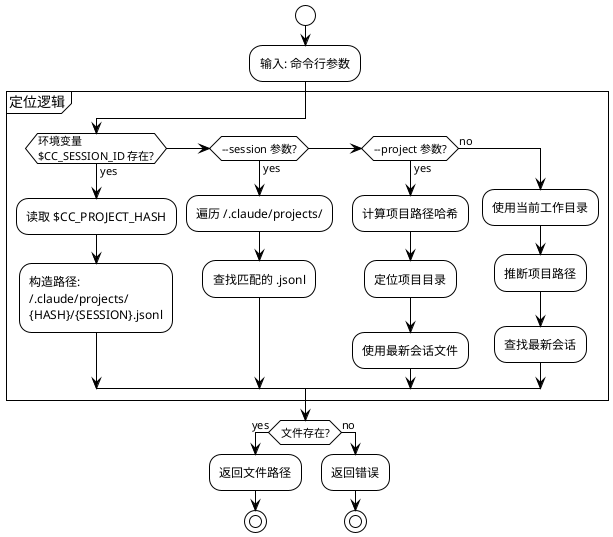
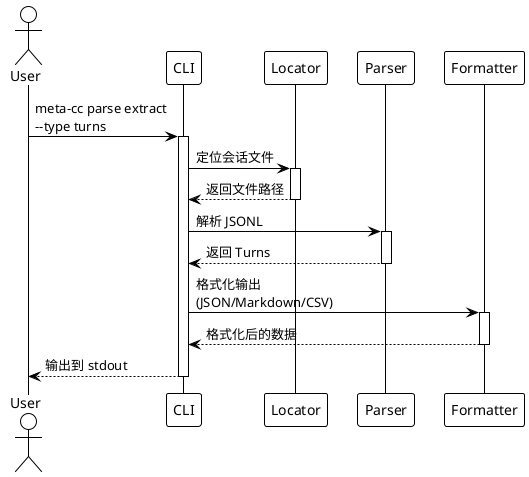
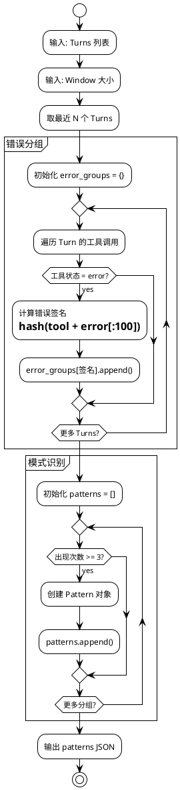
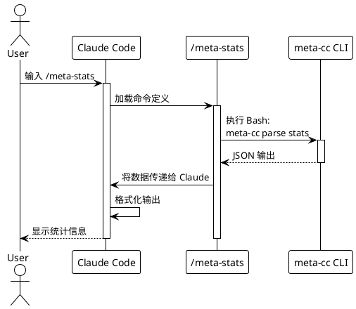

# meta-cc 项目总体实施计划

## 项目概述

基于 [技术方案](./proposals/meta-cognition-proposal.md) 的分阶段实施计划。

**核心约束**：
- 每个 Phase：代码修改量 ≤ 500 行
- 每个 Stage：代码修改量 ≤ 200 行
- 开发方法：测试驱动开发（TDD）
- 交付要求：每个 Phase 更新 README.md，说明当前 build 使用方法
- 验证策略：使用 Claude Code 非交互模式（`claude -p "..."`）进行自动化测试

**测试环境**：
- 验证项目目录：`test-workspace/` （用于模拟实际 Claude Code 项目环境）
- 测试会话文件：存放在 `test-workspace/.claude-test-sessions/` 作为测试 fixture

---

## Phase 划分总览

```plantuml
@startuml
!theme plain

card "Phase 0" as P0 {
  **项目初始化**
  - Go 项目骨架
  - 基础测试框架
  - 构建脚本
}

card "Phase 1" as P1 {
  **会话文件定位**
  - 环境变量读取
  - 参数解析
  - 文件路径解析
}

card "Phase 2" as P2 {
  **JSONL 解析器**
  - Turn 数据解析
  - Tool 调用提取
  - 错误处理
}

card "Phase 3" as P3 {
  **数据提取命令**
  - parse extract
  - 输出格式化
  - 集成测试
}

card "Phase 4" as P4 {
  **统计分析**
  - parse stats
  - 基础指标
}

card "Phase 5" as P5 {
  **错误模式分析**
  - analyze errors
  - 模式检测
}

card "Phase 6" as P6 {
  **Slash Commands**
  - /meta-stats
  - /meta-errors
  - Claude Code 集成
}

P0 -down-> P1
P1 -down-> P2
P2 -down-> P3
P3 -down-> P4
P4 -down-> P5
P5 -down-> P6

note right of P6
  **业务闭环完成**
  可在 Claude Code 中使用
end note

@enduml
```

---

## Phase 0: 项目初始化

**目标**：建立 Go 项目骨架和开发环境

**代码量**：~150 行

### Stage 0.1: Go 模块初始化

**任务**：
- 创建 `go.mod` 和项目目录结构
- 添加 Cobra + Viper 依赖
- 实现根命令框架

**交付物**：
```
meta-cc/
├── go.mod
├── go.sum
├── main.go
├── cmd/
│   └── root.go
└── README.md
```

**测试**：
```bash
go build -o meta-cc
./meta-cc --version
./meta-cc --help
```

**README.md 内容**：
- 项目介绍
- 构建命令：`go build -o meta-cc`
- 基础使用：`./meta-cc --help`

### Stage 0.2: 测试框架搭建

**任务**：
- 配置 Go testing
- 添加测试 fixture 目录
- 创建第一个单元测试示例

**交付物**：
```
meta-cc/
├── internal/
│   └── testutil/
│       └── fixtures.go
└── tests/
    └── fixtures/
        └── sample-session.jsonl
```

**测试**：
```bash
go test ./...
```

**README.md 更新**：
- 添加测试命令：`go test ./...`

### Stage 0.3: 构建和发布脚本

**任务**：
- 创建 Makefile 或构建脚本
- 支持跨平台构建（Linux/macOS/Windows）
- 添加版本信息嵌入

**交付物**：
```
meta-cc/
├── Makefile
└── scripts/
    └── build.sh
```

**测试**：
```bash
make build
make test
make clean
```

**README.md 更新**：
- 添加构建说明
- 支持的平台列表

**Phase 0 完成标准**：
- ✅ `go build` 成功
- ✅ `go test ./...` 通过
- ✅ `./meta-cc --help` 显示帮助信息
- ✅ README.md 包含完整的构建和使用说明

---

## Phase 1: 会话文件定位

**目标**：实现多种方式定位 Claude Code 会话文件

**代码量**：~180 行



### Stage 1.1: 环境变量读取

**TDD 流程**：

1. **编写测试** (`internal/locator/env_test.go`)：
```go
func TestReadSessionFromEnv(t *testing.T) {
    // 测试：存在环境变量时返回正确路径
    // 测试：缺少环境变量时返回错误
}
```

2. **实现代码** (`internal/locator/env.go`)：
```go
type SessionLocator struct {}

func (l *SessionLocator) FromEnv() (string, error) {
    // 读取 CC_SESSION_ID 和 CC_PROJECT_HASH
    // 构造文件路径
    // 验证文件存在
}
```

3. **运行测试**：
```bash
go test ./internal/locator -v
```

**交付物**：
- `internal/locator/env.go` (~60 行)
- `internal/locator/env_test.go` (~80 行)

### Stage 1.2: 命令行参数解析

**TDD 流程**：

1. **编写测试** (`internal/locator/args_test.go`)：
```go
func TestLocateBySessionID(t *testing.T) {
    // 测试：通过 session ID 查找文件
}

func TestLocateByProjectPath(t *testing.T) {
    // 测试：通过项目路径查找最新会话
}
```

2. **实现代码** (`internal/locator/args.go`)：
```go
func (l *SessionLocator) FromSessionID(sessionID string) (string, error)
func (l *SessionLocator) FromProjectPath(projectPath string) (string, error)
```

3. **集成到 Cobra 命令**：
```go
// cmd/root.go
var sessionID string
var projectPath string

rootCmd.PersistentFlags().StringVar(&sessionID, "session", "", "Session ID")
rootCmd.PersistentFlags().StringVar(&projectPath, "project", "", "Project path")
```

**交付物**：
- `internal/locator/args.go` (~80 行)
- `internal/locator/args_test.go` (~100 行)
- `cmd/root.go` 更新 (~20 行)

### Stage 1.3: 路径哈希和自动检测

**TDD 流程**：

1. **编写测试** (`internal/locator/hash_test.go`)：
```go
func TestProjectPathToHash(t *testing.T) {
    // 测试：/home/yale/work/myproject → -home-yale-work-myproject
}

func TestFindLatestSession(t *testing.T) {
    // 测试：从目录中找到最新的 .jsonl 文件
}
```

2. **实现代码** (`internal/locator/hash.go`)：
```go
func ProjectPathToHash(path string) string
func FindLatestSession(projectHash string) (string, error)
```

**交付物**：
- `internal/locator/hash.go` (~60 行)
- `internal/locator/hash_test.go` (~70 行)

**Phase 1 完成标准**：
- ✅ 所有单元测试通过
- ✅ `meta-cc --session <id>` 能定位文件
- ✅ `meta-cc --project <path>` 能定位最新会话
- ✅ 环境变量优先级测试通过
- ✅ README.md 更新参数使用说明

**验证测试**（非交互模式）：
```bash
# 准备测试环境
mkdir -p test-workspace/.claude-test-sessions
cp tests/fixtures/sample-session.jsonl test-workspace/.claude-test-sessions/test-id.jsonl

# 测试定位功能
./meta-cc locate --session test-id
# 预期输出：test-workspace/.claude-test-sessions/test-id.jsonl
```

---

## Phase 2: JSONL 解析器

**目标**：解析 Claude Code 会话文件的 JSONL 格式

**代码量**：~200 行

```plantuml
@startuml
!theme plain

package "解析流程" {
  [JSONL 文件] as File
  [逐行读取] as Reader
  [JSON 解析] as Parser
  [Turn 数据结构] as Turn
  [Tool Call 提取] as Tool

  File --> Reader
  Reader --> Parser
  Parser --> Turn
  Turn --> Tool
}

package "数据结构" {
  class Turn {
    Sequence int
    Role string
    Timestamp int64
    Content []ContentBlock
  }

  class ContentBlock {
    Type string
    Text string
    ToolUse *ToolUse
    ToolResult *ToolResult
  }

  class ToolUse {
    ID string
    Name string
    Input map[string]interface{}
  }

  class ToolResult {
    ToolUseID string
    Content string
    Status string
    Error string
  }
}

Turn --> ContentBlock
ContentBlock --> ToolUse
ContentBlock --> ToolResult

@enduml
```

### Stage 2.1: 数据结构定义

**TDD 流程**：

1. **定义接口** (`internal/parser/types.go`)：
```go
type Turn struct {
    Sequence  int            `json:"sequence"`
    Role      string         `json:"role"`
    Timestamp int64          `json:"timestamp"`
    Content   []ContentBlock `json:"content"`
}

type ContentBlock struct {
    Type       string      `json:"type"`
    Text       string      `json:"text,omitempty"`
    ToolUse    *ToolUse    `json:"tool_use,omitempty"`
    ToolResult *ToolResult `json:"tool_result,omitempty"`
}

// ... 其他结构
```

2. **编写测试** (`internal/parser/types_test.go`)：
```go
func TestTurnUnmarshal(t *testing.T) {
    // 测试：从 JSON 反序列化 Turn
}
```

**交付物**：
- `internal/parser/types.go` (~80 行)
- `internal/parser/types_test.go` (~50 行)

### Stage 2.2: JSONL 读取器

**TDD 流程**：

1. **编写测试** (`internal/parser/reader_test.go`)：
```go
func TestReadJSONL(t *testing.T) {
    // 测试：读取多行 JSONL
    // 测试：处理空行和注释
    // 测试：错误处理（非法 JSON）
}
```

2. **实现代码** (`internal/parser/reader.go`)：
```go
type SessionParser struct {
    reader *bufio.Scanner
}

func NewSessionParser(filePath string) (*SessionParser, error)
func (p *SessionParser) ParseTurns() ([]Turn, error)
```

**交付物**：
- `internal/parser/reader.go` (~70 行)
- `internal/parser/reader_test.go` (~90 行)

### Stage 2.3: Tool 调用提取

**TDD 流程**：

1. **编写测试** (`internal/parser/tools_test.go`)：
```go
func TestExtractToolCalls(t *testing.T) {
    // 测试：从 Turn 中提取所有工具调用
    // 测试：匹配 ToolUse 和 ToolResult
}
```

2. **实现代码** (`internal/parser/tools.go`)：
```go
type ToolCall struct {
    TurnSequence int
    ToolName     string
    Input        map[string]interface{}
    Output       string
    Status       string
    Error        string
}

func ExtractToolCalls(turns []Turn) []ToolCall
```

**交付物**：
- `internal/parser/tools.go` (~60 行)
- `internal/parser/tools_test.go` (~80 行)

**Phase 2 完成标准**：
- ✅ 所有单元测试通过
- ✅ 能解析真实的 Claude Code 会话文件
- ✅ 正确提取 Turn 和 Tool Call 数据
- ✅ 错误处理覆盖非法 JSON
- ✅ README.md 更新解析器说明

**验证测试**：
```bash
# 使用真实会话文件测试
go test ./internal/parser -v -run TestParseRealSession
```

---

## Phase 3: 数据提取命令

**目标**：实现 `meta-cc parse extract` 命令

**代码量**：~200 行



### Stage 3.1: parse extract 命令框架

**TDD 流程**：

1. **编写集成测试** (`cmd/parse_test.go`)：
```go
func TestParseExtractCommand(t *testing.T) {
    // 测试：extract --type turns
    // 测试：extract --type tools
    // 测试：extract --filter "status=error"
}
```

2. **实现命令** (`cmd/parse.go`)：
```go
var parseExtractCmd = &cobra.Command{
    Use:   "extract",
    Short: "Extract data from session",
    Run:   runParseExtract,
}

func runParseExtract(cmd *cobra.Command, args []string) {
    // 调用 locator + parser
    // 根据 --type 参数过滤数据
}
```

**交付物**：
- `cmd/parse.go` (~100 行)
- `cmd/parse_test.go` (~80 行)

### Stage 3.2: 输出格式化器

**TDD 流程**：

1. **编写测试** (`pkg/output/json_test.go`)：
```go
func TestFormatJSON(t *testing.T) {
    // 测试：Turn 数组 → JSON
}

func TestFormatMarkdown(t *testing.T) {
    // 测试：Turn 数组 → Markdown 表格
}
```

2. **实现代码** (`pkg/output/`)：
```go
func FormatJSON(data interface{}) (string, error)
func FormatMarkdown(turns []Turn) (string, error)
```

**交付物**：
- `pkg/output/json.go` (~40 行)
- `pkg/output/markdown.go` (~60 行)
- `pkg/output/output_test.go` (~70 行)

### Stage 3.3: 数据过滤器

**TDD 流程**：

1. **编写测试** (`internal/filter/filter_test.go`)：
```go
func TestFilterToolsByStatus(t *testing.T) {
    // 测试：filter="status=error"
    // 测试：filter="tool=Bash"
}
```

2. **实现代码** (`internal/filter/filter.go`)：
```go
func FilterTools(tools []ToolCall, filter string) []ToolCall
```

**交付物**：
- `internal/filter/filter.go` (~50 行)
- `internal/filter/filter_test.go` (~60 行)

**Phase 3 完成标准**：
- ✅ `meta-cc parse extract --type turns` 输出 JSON
- ✅ `meta-cc parse extract --type tools --filter "status=error"` 过滤成功
- ✅ `meta-cc parse extract --output md` 输出 Markdown
- ✅ 所有单元测试和集成测试通过
- ✅ README.md 更新命令使用示例

**验证测试**（Claude Code 非交互模式）：
```bash
# 在测试项目中验证
cd test-workspace
echo "Test meta-cc parse extract command" | claude -p "Run: meta-cc parse extract --type turns --output json. Verify the output is valid JSON."
```

---

## Phase 4: 统计分析命令

**目标**：实现 `meta-cc parse stats` 命令

**代码量**：~150 行

### Stage 4.1: 基础统计指标

**TDD 流程**：

1. **编写测试** (`internal/analyzer/stats_test.go`)：
```go
func TestCalculateStats(t *testing.T) {
    // 测试：计算 turn_count, tool_count, error_count
    // 测试：计算会话时长
}
```

2. **实现代码** (`internal/analyzer/stats.go`)：
```go
type SessionStats struct {
    TurnCount     int
    ToolCallCount int
    ErrorCount    int
    Duration      int64 // 秒
    ToolFrequency map[string]int
}

func CalculateStats(turns []Turn) SessionStats
```

**交付物**：
- `internal/analyzer/stats.go` (~70 行)
- `internal/analyzer/stats_test.go` (~80 行)

### Stage 4.2: stats 命令实现

**TDD 流程**：

1. **编写测试** (`cmd/stats_test.go`)：
```go
func TestStatsCommand(t *testing.T) {
    // 测试：meta-cc parse stats --metrics tools,errors
}
```

2. **实现命令** (`cmd/parse.go` 扩展)：
```go
var parseStatsCmd = &cobra.Command{
    Use:   "stats",
    Short: "Show session statistics",
    Run:   runParseStats,
}
```

**交付物**：
- `cmd/parse.go` 更新 (~50 行)
- `cmd/stats_test.go` (~60 行)

**Phase 4 完成标准**：
- ✅ `meta-cc parse stats` 输出会话统计
- ✅ `meta-cc parse stats --metrics tools,errors,duration` 过滤指标
- ✅ 支持 JSON 和 Markdown 输出
- ✅ README.md 更新统计命令说明

**验证测试**：
```bash
cd test-workspace
./meta-cc parse stats --output md
# 验证输出包含 turn_count, tool_count, error_count
```

---

## Phase 5: 错误模式分析

**目标**：实现 `meta-cc analyze errors` 命令

**代码量**：~200 行



### Stage 5.1: 错误签名计算

**TDD 流程**：

1. **编写测试** (`internal/analyzer/errors_test.go`)：
```go
func TestErrorSignature(t *testing.T) {
    // 测试：相同错误生成相同签名
    // 测试：不同错误生成不同签名
}
```

2. **实现代码** (`internal/analyzer/errors.go`)：
```go
func CalculateErrorSignature(toolName, errorOutput string) string
```

**交付物**：
- `internal/analyzer/errors.go` (~50 行)
- `internal/analyzer/errors_test.go` (~60 行)

### Stage 5.2: 模式检测逻辑

**TDD 流程**：

1. **编写测试** (`internal/analyzer/patterns_test.go`)：
```go
func TestDetectErrorPatterns(t *testing.T) {
    // 测试：检测重复错误（3次以上）
    // 测试：计算时间跨度
}
```

2. **实现代码** (`internal/analyzer/patterns.go`)：
```go
type ErrorPattern struct {
    PatternID   string
    Type        string
    Occurrences int
    Signature   string
    Context     PatternContext
}

func DetectErrorPatterns(turns []Turn, window int) []ErrorPattern
```

**交付物**：
- `internal/analyzer/patterns.go` (~80 行)
- `internal/analyzer/patterns_test.go` (~100 行)

### Stage 5.3: analyze errors 命令

**TDD 流程**：

1. **实现命令** (`cmd/analyze.go`)：
```go
var analyzeErrorsCmd = &cobra.Command{
    Use:   "errors",
    Short: "Analyze error patterns",
    Run:   runAnalyzeErrors,
}
```

**交付物**：
- `cmd/analyze.go` (~70 行)
- `cmd/analyze_test.go` (~80 行)

**Phase 5 完成标准**：
- ✅ `meta-cc analyze errors --window 20` 检测错误模式
- ✅ 输出包含：pattern_id, occurrences, signature, context
- ✅ 所有测试通过
- ✅ README.md 更新错误分析说明

**验证测试**：
```bash
# 创建包含重复错误的测试会话
cd test-workspace
./meta-cc analyze errors --window 30 --output json
# 验证输出包含检测到的模式
```

---

## Phase 6: Claude Code 集成（Slash Commands）

**目标**：创建可在 Claude Code 中使用的 Slash Commands

**代码量**：~100 行（配置文件为主）



### Stage 6.1: /meta-stats 命令

**任务**：
- 创建 `.claude/commands/meta-stats.md`
- 调用 `meta-cc parse stats`
- 格式化输出

**交付物**：
```markdown
# .claude/commands/meta-stats.md
---
name: meta-stats
description: 显示当前会话的统计信息
allowed_tools: [Bash]
---

运行以下命令获取会话统计：
```bash
meta-cc parse stats --output md
```
将结果格式化后显示给用户。
```

**验证测试**（需要实际 Claude Code 环境）：
```bash
# 在真实 Claude Code 项目中
cd test-workspace
# 手动测试：在 Claude Code 中输入 /meta-stats
```

### Stage 6.2: /meta-errors 命令

**交付物**：
```markdown
# .claude/commands/meta-errors.md
---
name: meta-errors
description: 分析当前会话中的错误模式
allowed_tools: [Bash]
argument-hint: [window-size]
---

执行错误分析（窗口大小：${1:-20}）：
```bash
error_data=$(meta-cc parse extract --type tools --filter "status=error" --output json)
pattern_data=$(meta-cc analyze errors --window ${1:-20} --output json)
```

基于以上数据分析：
1. 是否存在重复错误？
2. 错误集中在哪些工具/命令？
3. 给出优化建议（hook、工作流等）
```

### Stage 6.3: 集成测试和文档

**任务**：
- 创建集成测试脚本
- 更新 README.md 包含完整使用示例
- 添加故障排查指南

**交付物**：
- `docs/integration.md`：集成文档
- `test-workspace/`：测试环境设置说明
- README.md 完整更新

**Phase 6 完成标准**：
- ✅ `/meta-stats` 在 Claude Code 中可用
- ✅ `/meta-errors` 正确检测并分析错误
- ✅ 文档完整，包含使用示例和截图
- ✅ 测试环境可复现

**验证测试**（自动化）：
```bash
# 使用 Claude Code 非交互模式测试
cd test-workspace
claude -p "Run /meta-stats and verify the output contains session statistics"
claude -p "Run /meta-errors 30 and check if error patterns are detected"
```

**业务闭环完成**：此 Phase 完成后，用户可以在 Claude Code 中通过 Slash Commands 使用 meta-cc 的核心功能。

---

## 未来 Phase（可选扩展）

### Phase 7: 索引功能（可选）
- SQLite 索引构建
- 跨会话查询
- `meta-cc query` 命令组

### Phase 8: 工具使用分析（可选）
- `meta-cc analyze tools`
- 工具序列检测
- 频率统计

### Phase 9: Subagent 集成（可选）
- `@meta-coach` subagent
- 对话式分析
- 工作流优化建议

### Phase 10: MCP Server（可选）
- MCP 协议实现
- 工具定义
- Claude Code MCP 集成

---

## 测试策略

### 单元测试
- 每个 Stage 必须有对应的单元测试
- 测试覆盖率目标：≥ 80%
- 使用 `go test ./...` 运行所有测试

### 集成测试
- 每个 Phase 结束后运行集成测试
- 使用真实的会话文件 fixture
- 验证命令端到端流程

### Claude Code 验证测试
```bash
# 测试环境准备
mkdir -p test-workspace/.claude/commands
cp .claude/commands/*.md test-workspace/.claude/commands/

# 非交互模式测试
cd test-workspace
claude -p "Test /meta-stats command and verify output"

# 交互模式手动测试（每个 Phase 结束）
# 在 Claude Code 中打开 test-workspace 项目
# 手动输入 /meta-stats 和 /meta-errors
```

### 测试数据管理
- 测试 fixture 存放在 `tests/fixtures/`
- 使用真实的（脱敏的）Claude Code 会话文件
- 包含多种场景：正常会话、错误重复、工具密集使用等

---

## 项目里程碑

```plantuml
@startuml
!theme plain

gantt
    title meta-cc 开发时间表
    dateFormat YYYY-MM-DD

    section Phase 0
    项目初始化         :p0, 2025-01-01, 2d

    section Phase 1
    会话文件定位       :p1, after p0, 3d

    section Phase 2
    JSONL 解析器      :p2, after p1, 3d

    section Phase 3
    数据提取命令       :p3, after p2, 3d

    section Phase 4
    统计分析命令       :p4, after p3, 2d

    section Phase 5
    错误模式分析       :p5, after p4, 3d

    section Phase 6
    Slash Commands   :p6, after p5, 2d

    section 里程碑
    MVP 完成          :milestone, after p6, 0d

@enduml
```

**预计总开发时间**：18 天（约 2.5 周）

**关键里程碑**：
- Day 2: 项目骨架完成，可构建
- Day 5: 会话文件定位完成
- Day 8: 解析器完成
- Day 11: 数据提取功能完成
- Day 13: 统计分析完成
- Day 16: 错误分析完成
- Day 18: **MVP 完成，业务闭环**

---

## README.md 维护策略

每个 Phase 完成后，README.md 应包含：

1. **安装**：如何构建和安装 meta-cc
2. **快速开始**：最简单的使用示例
3. **命令参考**：当前已实现的所有命令
4. **集成指南**：如何在 Claude Code 中使用（Phase 6 后）
5. **故障排查**：常见问题和解决方案
6. **开发指南**：如何运行测试、贡献代码

**模板结构**：
```markdown
# meta-cc

## 安装
...

## 快速开始
...

## 命令参考
### parse extract
...

### parse stats
...

## Claude Code 集成
...

## 开发
...
```

---

## 风险和缓解措施

| 风险 | 影响 | 缓解措施 |
|------|------|----------|
| Claude Code 会话文件格式变化 | 高 | 使用真实文件测试，版本化 fixture |
| 环境变量不可用 | 中 | 提供多种定位方式（参数、路径推断） |
| 测试覆盖不足 | 中 | TDD 强制要求，每个 Stage 先写测试 |
| Phase 代码量超标 | 低 | 每个 Stage 结束检查行数，及时拆分 |
| Claude Code 集成失败 | 高 | Phase 6 前在测试环境充分验证 |

---

## 总结

本计划将 meta-cc 项目分为 6 个核心 Phase，每个 Phase 不超过 500 行代码，采用 TDD 方法开发。Phase 6 完成后即可在 Claude Code 中使用，实现业务闭环。后续 Phase 7-10 为可选扩展功能。

**下一步**：开始 Phase 0.1 - Go 模块初始化
