# meta-cc 项目总体实施计划

## 项目概述

基于 [技术方案](./proposals/meta-cognition-proposal.md) 的分阶段实施计划。

**核心约束与设计原则**：详见 [设计原则文档](./principles.md)

**项目状态**：
- ✅ **Phase 0-7 已完成**（完整集成里程碑达成）
- ✅ **Phase 8 已完成**（stages 8.1-8.12: 查询命令基础 + Prompt 优化）
- ✅ **Phase 9 已完成**（上下文长度应对，86.4% 压缩率）🎉 **NEW**
- ✅ 47 个单元测试全部通过（Phase 9 新增测试）
- ✅ 3 个真实项目验证通过（0% 错误率）
- ✅ 2 个 Slash Commands 可用（`/meta-stats`, `/meta-errors`，已集成 Phase 9）
- ✅ MCP Server 原生实现（`meta-cc mcp`，10 个工具）
- ✅ 支持 5 种输出格式（JSON, Markdown, CSV, TSV, Summary）

---

## Phase 划分总览

```plantuml
@startuml
!theme plain

card "Phase 0-7" as P0 #lightgreen {
  **✅ MVP 已完成**
  - 项目初始化
  - 会话定位
  - JSONL 解析
  - 数据提取
  - 统计分析
  - 错误分析
  - Slash Commands
  - MCP Server
}

card "Phase 8" as P8 #lightblue {
  **查询命令基础**
  - query 命令框架
  - query tools
  - query user-messages
  - 基础过滤器
}

card "Phase 9" as P9 #lightblue {
  **上下文长度应对**
  - 分页支持
  - 分片输出
  - 字段投影
  - 紧凑格式(TSV)
}

card "Phase 10" as P10 #lightyellow {
  **高级查询能力**
  - 高级过滤器
  - 聚合统计
  - 时间序列
  - 文件级统计
}

card "Phase 11" as P11 #lightyellow {
  **Unix 可组合性**
  - 流式输出
  - 退出码标准化
  - stderr/stdout分离
  - Cookbook 文档
}

card "Phase 12" as P12 #lightgreen {
  **MCP 项目级查询**
  - 项目级工具（默认）
  - 会话级工具（_session）
  - --project . 支持
  - 跨会话分析
}

card "Phase 13" as P13 #lightgreen {
  **输出格式简化**
  - JSONL/TSV 双格式
  - 格式一致性
  - 错误处理标准化
}

card "Phase 14" as P14 #yellow {
  **架构重构与职责清晰化**
  - Pipeline 模式抽象
  - errors 命令简化
  - 输出排序标准化
  - 代码重复消除
}

card "Phase 15" as P15 #lightyellow {
  **MCP 工具完善**
  - 补全缺失工具
  - 简化工具描述
  - 移除语义分析工具
  - MCP 文档优化
}

card "Phase 16" as P16 #lightgreen {
  **Subagent 实现**
  - @meta-coach 核心
  - @error-analyst 专用
  - @workflow-tuner 专用
  - 嵌套调用测试
}

P0 -down-> P8
P8 -down-> P9
P9 -down-> P10
P10 -down-> P11
P11 -down-> P12
P12 -down-> P13
P13 -down-> P14
P14 -down-> P15
P15 -down-> P16

note right of P0
  **业务闭环完成**
  可在 Claude Code 中使用
end note

note right of P9
  **核心查询能力完成**
  应对大会话场景
end note

note right of P16
  **完整架构实现**
  数据层 + MCP + Subagent
end note

@enduml
```

**Phase 优先级分类**：
- ✅ **已完成** (Phase 0-9): MVP + 核心查询 + 上下文管理
- 🟡 **中优先级** (Phase 10-11): 高级查询和可组合性
- 🟢 **高优先级** (Phase 12-14): 输出简化 + 架构重构 + MCP 项目级
- 🟡 **中优先级** (Phase 15): MCP 工具完善
- 🟢 **高优先级** (Phase 16): Subagent 语义层实现

---

## Phase 0: 项目初始化

**目标**：建立 Go 项目骨架和开发环境

**代码量**：~150 行

### Stage 0.1: Go 模块初始化

**任务**：
- 创建 `go.mod` 和项目目录结构
- 添加 Cobra + Viper 依赖
- 实现根命令框架

**交付物**：
```
meta-cc/
├── go.mod
├── go.sum
├── main.go
├── cmd/
│   └── root.go
└── README.md
```

**测试**：
```bash
go build -o meta-cc
./meta-cc --version
./meta-cc --help
```

**README.md 内容**：
- 项目介绍
- 构建命令：`go build -o meta-cc`
- 基础使用：`./meta-cc --help`

### Stage 0.2: 测试框架搭建

**任务**：
- 配置 Go testing
- 添加测试 fixture 目录
- 创建第一个单元测试示例

**交付物**：
```
meta-cc/
├── internal/
│   └── testutil/
│       └── fixtures.go
└── tests/
    └── fixtures/
        └── sample-session.jsonl
```

**测试**：
```bash
go test ./...
```

**README.md 更新**：
- 添加测试命令：`go test ./...`

### Stage 0.3: 构建和发布脚本

**任务**：
- 创建 Makefile 或构建脚本
- 支持跨平台构建（Linux/macOS/Windows）
- 添加版本信息嵌入

**交付物**：
```
meta-cc/
├── Makefile
└── scripts/
    └── build.sh
```

**测试**：
```bash
make build
make test
make clean
```

**README.md 更新**：
- 添加构建说明
- 支持的平台列表

**Phase 0 完成标准**：
- ✅ `go build` 成功
- ✅ `go test ./...` 通过
- ✅ `./meta-cc --help` 显示帮助信息
- ✅ README.md 包含完整的构建和使用说明

---

## Phase 1: 会话文件定位

**目标**：实现多种方式定位 Claude Code 会话文件

**代码量**：~180 行

**状态**：✅ 已完成



```plantuml
@startuml
!theme plain

start

:输入: 命令行参数;

partition "定位逻辑（实际实现）" {
  if (环境变量\n$CC_SESSION_ID 存在?) then (yes)
    note right: ❌ Claude Code 不提供此变量
    :尝试读取（预留接口）;
  elseif (--session 参数?) then (yes)
    :遍历 ~/.claude/projects/;
    :查找匹配的 .jsonl;
  elseif (--project 参数?) then (yes)
    :计算项目路径哈希\n(替换 / 为 -);
    :定位项目目录;
    :使用最新会话文件;
  else (no)
    :使用当前工作目录 (os.Getwd);
    :转换为路径哈希;
    :查找最新会话;
    note right: ✅ 默认方式\n最常用于 Slash Commands
  endif
}

if (文件存在?) then (yes)
  :返回文件路径;
  stop
else (no)
  :返回错误;
  stop
endif

@enduml
```

### Stage 1.1: 环境变量读取

**TDD 流程**：

1. **编写测试** (`internal/locator/env_test.go`)：
```go
func TestReadSessionFromEnv(t *testing.T) {
    // 测试：存在环境变量时返回正确路径
    // 测试：缺少环境变量时返回错误
}
```

2. **实现代码** (`internal/locator/env.go`)：
```go
type SessionLocator struct {}

func (l *SessionLocator) FromEnv() (string, error) {
    // 读取 CC_SESSION_ID 和 CC_PROJECT_HASH
    // 构造文件路径
    // 验证文件存在
}
```

3. **运行测试**：
```bash
go test ./internal/locator -v
```

**交付物**：
- `internal/locator/env.go` (~60 行)
- `internal/locator/env_test.go` (~80 行)

### Stage 1.2: 命令行参数解析

**TDD 流程**：

1. **编写测试** (`internal/locator/args_test.go`)：
```go
func TestLocateBySessionID(t *testing.T) {
    // 测试：通过 session ID 查找文件
}

func TestLocateByProjectPath(t *testing.T) {
    // 测试：通过项目路径查找最新会话
}
```

2. **实现代码** (`internal/locator/args.go`)：
```go
func (l *SessionLocator) FromSessionID(sessionID string) (string, error)
func (l *SessionLocator) FromProjectPath(projectPath string) (string, error)
```

3. **集成到 Cobra 命令**：
```go
// cmd/root.go
var sessionID string
var projectPath string

rootCmd.PersistentFlags().StringVar(&sessionID, "session", "", "Session ID")
rootCmd.PersistentFlags().StringVar(&projectPath, "project", "", "Project path")
```

**交付物**：
- `internal/locator/args.go` (~80 行)
- `internal/locator/args_test.go` (~100 行)
- `cmd/root.go` 更新 (~20 行)

### Stage 1.3: 路径哈希和自动检测

**TDD 流程**：

1. **编写测试** (`internal/locator/hash_test.go`)：
```go
func TestProjectPathToHash(t *testing.T) {
    // 测试：/home/yale/work/myproject → -home-yale-work-myproject
}

func TestFindLatestSession(t *testing.T) {
    // 测试：从目录中找到最新的 .jsonl 文件
}
```

2. **实现代码** (`internal/locator/hash.go`)：
```go
func ProjectPathToHash(path string) string
func FindLatestSession(projectHash string) (string, error)
```

**交付物**：
- `internal/locator/hash.go` (~60 行)
- `internal/locator/hash_test.go` (~70 行)

**Phase 1 完成标准**：
- ✅ 所有单元测试通过（17 个测试）
- ✅ `meta-cc --session <id>` 能定位文件
- ✅ `meta-cc --project <path>` 能定位最新会话
- ✅ 自动检测功能正常工作（基于 cwd）
- ✅ README.md 更新参数使用说明

**实际验证结果**（Phase 6）：
```bash
# 测试自动检测
cd /home/yale/work/meta-cc
./meta-cc parse stats
# ✅ 自动定位到 ~/.claude/projects/-home-yale-work-meta-cc/ 最新会话

# 测试跨项目分析
./meta-cc --project /home/yale/work/NarrativeForge parse stats
# ✅ 成功分析 NarrativeForge 项目最新会话

# 测试特定会话
./meta-cc --session 6a32f273-191a-49c8-a5fc-a5dcba08531a parse stats
# ✅ 成功定位并分析指定会话
```

**关键发现**：
- ❌ Claude Code 不提供 `CC_SESSION_ID` / `CC_PROJECT_HASH` 环境变量
- ✅ 基于 cwd 的自动检测机制完美满足 Slash Commands 需求
- ✅ 路径哈希算法简单有效（`/` → `-`）

---

## Phase 2: JSONL 解析器

**目标**：解析 Claude Code 会话文件的 JSONL 格式

**代码量**：~200 行

```plantuml
@startuml
!theme plain

package "解析流程" {
  [JSONL 文件] as File
  [逐行读取] as Reader
  [JSON 解析] as Parser
  [Turn 数据结构] as Turn
  [Tool Call 提取] as Tool

  File --> Reader
  Reader --> Parser
  Parser --> Turn
  Turn --> Tool
}

package "数据结构" {
  class Turn {
    Sequence int
    Role string
    Timestamp int64
    Content []ContentBlock
  }

  class ContentBlock {
    Type string
    Text string
    ToolUse *ToolUse
    ToolResult *ToolResult
  }

  class ToolUse {
    ID string
    Name string
    Input map[string]interface{}
  }

  class ToolResult {
    ToolUseID string
    Content string
    Status string
    Error string
  }
}

Turn --> ContentBlock
ContentBlock --> ToolUse
ContentBlock --> ToolResult

@enduml
```

### Stage 2.1: 数据结构定义

**TDD 流程**：

1. **定义接口** (`internal/parser/types.go`)：
```go
type Turn struct {
    Sequence  int            `json:"sequence"`
    Role      string         `json:"role"`
    Timestamp int64          `json:"timestamp"`
    Content   []ContentBlock `json:"content"`
}

type ContentBlock struct {
    Type       string      `json:"type"`
    Text       string      `json:"text,omitempty"`
    ToolUse    *ToolUse    `json:"tool_use,omitempty"`
    ToolResult *ToolResult `json:"tool_result,omitempty"`
}

// ... 其他结构
```

2. **编写测试** (`internal/parser/types_test.go`)：
```go
func TestTurnUnmarshal(t *testing.T) {
    // 测试：从 JSON 反序列化 Turn
}
```

**交付物**：
- `internal/parser/types.go` (~80 行)
- `internal/parser/types_test.go` (~50 行)

### Stage 2.2: JSONL 读取器

**TDD 流程**：

1. **编写测试** (`internal/parser/reader_test.go`)：
```go
func TestReadJSONL(t *testing.T) {
    // 测试：读取多行 JSONL
    // 测试：处理空行和注释
    // 测试：错误处理（非法 JSON）
}
```

2. **实现代码** (`internal/parser/reader.go`)：
```go
type SessionParser struct {
    reader *bufio.Scanner
}

func NewSessionParser(filePath string) (*SessionParser, error)
func (p *SessionParser) ParseTurns() ([]Turn, error)
```

**交付物**：
- `internal/parser/reader.go` (~70 行)
- `internal/parser/reader_test.go` (~90 行)

### Stage 2.3: Tool 调用提取

**TDD 流程**：

1. **编写测试** (`internal/parser/tools_test.go`)：
```go
func TestExtractToolCalls(t *testing.T) {
    // 测试：从 Turn 中提取所有工具调用
    // 测试：匹配 ToolUse 和 ToolResult
}
```

2. **实现代码** (`internal/parser/tools.go`)：
```go
type ToolCall struct {
    TurnSequence int
    ToolName     string
    Input        map[string]interface{}
    Output       string
    Status       string
    Error        string
}

func ExtractToolCalls(turns []Turn) []ToolCall
```

**交付物**：
- `internal/parser/tools.go` (~60 行)
- `internal/parser/tools_test.go` (~80 行)

**Phase 2 完成标准**：
- ✅ 所有单元测试通过
- ✅ 能解析真实的 Claude Code 会话文件
- ✅ 正确提取 Turn 和 Tool Call 数据
- ✅ 错误处理覆盖非法 JSON
- ✅ README.md 更新解析器说明

**验证测试**：
```bash
# 使用真实会话文件测试
go test ./internal/parser -v -run TestParseRealSession
```

---

## Phase 3: 数据提取命令

**目标**：实现 `meta-cc parse extract` 命令

**代码量**：~200 行



```plantuml
@startuml
!theme plain

actor User
participant "CLI" as CLI
participant "Locator" as Loc
participant "Parser" as Parse
participant "Formatter" as Fmt

User -> CLI: meta-cc parse extract\n--type turns
activate CLI

CLI -> Loc: 定位会话文件
activate Loc
Loc --> CLI: 返回文件路径
deactivate Loc

CLI -> Parse: 解析 JSONL
activate Parse
Parse --> CLI: 返回 Turns
deactivate Parse

CLI -> Fmt: 格式化输出\n(JSON/Markdown/CSV)
activate Fmt
Fmt --> CLI: 格式化后的数据
deactivate Fmt

CLI --> User: 输出到 stdout
deactivate CLI

@enduml
```

### Stage 3.1: parse extract 命令框架

**TDD 流程**：

1. **编写集成测试** (`cmd/parse_test.go`)：
```go
func TestParseExtractCommand(t *testing.T) {
    // 测试：extract --type turns
    // 测试：extract --type tools
    // 测试：extract --filter "status=error"
}
```

2. **实现命令** (`cmd/parse.go`)：
```go
var parseExtractCmd = &cobra.Command{
    Use:   "extract",
    Short: "Extract data from session",
    Run:   runParseExtract,
}

func runParseExtract(cmd *cobra.Command, args []string) {
    // 调用 locator + parser
    // 根据 --type 参数过滤数据
}
```

**交付物**：
- `cmd/parse.go` (~100 行)
- `cmd/parse_test.go` (~80 行)

### Stage 3.2: 输出格式化器

**TDD 流程**：

1. **编写测试** (`pkg/output/json_test.go`)：
```go
func TestFormatJSON(t *testing.T) {
    // 测试：Turn 数组 → JSON
}

func TestFormatMarkdown(t *testing.T) {
    // 测试：Turn 数组 → Markdown 表格
}
```

2. **实现代码** (`pkg/output/`)：
```go
func FormatJSON(data interface{}) (string, error)
func FormatMarkdown(turns []Turn) (string, error)
```

**交付物**：
- `pkg/output/json.go` (~40 行)
- `pkg/output/markdown.go` (~60 行)
- `pkg/output/output_test.go` (~70 行)

### Stage 3.3: 数据过滤器

**TDD 流程**：

1. **编写测试** (`internal/filter/filter_test.go`)：
```go
func TestFilterToolsByStatus(t *testing.T) {
    // 测试：filter="status=error"
    // 测试：filter="tool=Bash"
}
```

2. **实现代码** (`internal/filter/filter.go`)：
```go
func FilterTools(tools []ToolCall, filter string) []ToolCall
```

**交付物**：
- `internal/filter/filter.go` (~50 行)
- `internal/filter/filter_test.go` (~60 行)

**Phase 3 完成标准**：
- ✅ `meta-cc parse extract --type turns` 输出 JSON
- ✅ `meta-cc parse extract --type tools --filter "status=error"` 过滤成功
- ✅ `meta-cc parse extract --output md` 输出 Markdown
- ✅ 所有单元测试和集成测试通过
- ✅ README.md 更新命令使用示例

**验证测试**（Claude Code 非交互模式）：
```bash
# 在测试项目中验证
cd test-workspace
echo "Test meta-cc parse extract command" | claude -p "Run: meta-cc parse extract --type turns --output json. Verify the output is valid JSON."
```

---

## Phase 4: 统计分析命令

**目标**：实现 `meta-cc parse stats` 命令

**代码量**：~150 行

### Stage 4.1: 基础统计指标

**TDD 流程**：

1. **编写测试** (`internal/analyzer/stats_test.go`)：
```go
func TestCalculateStats(t *testing.T) {
    // 测试：计算 turn_count, tool_count, error_count
    // 测试：计算会话时长
}
```

2. **实现代码** (`internal/analyzer/stats.go`)：
```go
type SessionStats struct {
    TurnCount     int
    ToolCallCount int
    ErrorCount    int
    Duration      int64 // 秒
    ToolFrequency map[string]int
}

func CalculateStats(turns []Turn) SessionStats
```

**交付物**：
- `internal/analyzer/stats.go` (~70 行)
- `internal/analyzer/stats_test.go` (~80 行)

### Stage 4.2: stats 命令实现

**TDD 流程**：

1. **编写测试** (`cmd/stats_test.go`)：
```go
func TestStatsCommand(t *testing.T) {
    // 测试：meta-cc parse stats --metrics tools,errors
}
```

2. **实现命令** (`cmd/parse.go` 扩展)：
```go
var parseStatsCmd = &cobra.Command{
    Use:   "stats",
    Short: "Show session statistics",
    Run:   runParseStats,
}
```

**交付物**：
- `cmd/parse.go` 更新 (~50 行)
- `cmd/stats_test.go` (~60 行)

**Phase 4 完成标准**：
- ✅ `meta-cc parse stats` 输出会话统计
- ✅ `meta-cc parse stats --metrics tools,errors,duration` 过滤指标
- ✅ 支持 JSON 和 Markdown 输出
- ✅ README.md 更新统计命令说明

**验证测试**：
```bash
cd test-workspace
./meta-cc parse stats --output md
# 验证输出包含 turn_count, tool_count, error_count
```

---

## Phase 5: 错误模式分析

**目标**：实现 `meta-cc analyze errors` 命令

**代码量**：~200 行



```plantuml
@startuml
!theme plain

start

:输入: Turns 列表;
:输入: Window 大小;

:取最近 N 个 Turns;

partition "错误分组" {
  :初始化 error_groups = {};

  repeat
    :遍历 Turn 的工具调用;

    if (工具状态 = error?) then (yes)
      :计算错误签名\n= hash(tool + error[:100]);
      :error_groups[签名].append();
    endif
  repeat while (更多 Turns?)
}

partition "模式识别" {
  :初始化 patterns = [];

  repeat
    if (出现次数 >= 3?) then (yes)
      :创建 Pattern 对象;
      :patterns.append();
    endif
  repeat while (更多分组?)
}

:输出 patterns JSON;

stop

@enduml
```

### Stage 5.1: 错误签名计算

**TDD 流程**：

1. **编写测试** (`internal/analyzer/errors_test.go`)：
```go
func TestErrorSignature(t *testing.T) {
    // 测试：相同错误生成相同签名
    // 测试：不同错误生成不同签名
}
```

2. **实现代码** (`internal/analyzer/errors.go`)：
```go
func CalculateErrorSignature(toolName, errorOutput string) string
```

**交付物**：
- `internal/analyzer/errors.go` (~50 行)
- `internal/analyzer/errors_test.go` (~60 行)

### Stage 5.2: 模式检测逻辑

**TDD 流程**：

1. **编写测试** (`internal/analyzer/patterns_test.go`)：
```go
func TestDetectErrorPatterns(t *testing.T) {
    // 测试：检测重复错误（3次以上）
    // 测试：计算时间跨度
}
```

2. **实现代码** (`internal/analyzer/patterns.go`)：
```go
type ErrorPattern struct {
    PatternID   string
    Type        string
    Occurrences int
    Signature   string
    Context     PatternContext
}

func DetectErrorPatterns(turns []Turn, window int) []ErrorPattern
```

**交付物**：
- `internal/analyzer/patterns.go` (~80 行)
- `internal/analyzer/patterns_test.go` (~100 行)

### Stage 5.3: analyze errors 命令

**TDD 流程**：

1. **实现命令** (`cmd/analyze.go`)：
```go
var analyzeErrorsCmd = &cobra.Command{
    Use:   "errors",
    Short: "Analyze error patterns",
    Run:   runAnalyzeErrors,
}
```

**交付物**：
- `cmd/analyze.go` (~70 行)
- `cmd/analyze_test.go` (~80 行)

**Phase 5 完成标准**：
- ✅ `meta-cc analyze errors --window 20` 检测错误模式
- ✅ 输出包含：pattern_id, occurrences, signature, context
- ✅ 所有测试通过
- ✅ README.md 更新错误分析说明

**验证测试**：
```bash
# 创建包含重复错误的测试会话
cd test-workspace
./meta-cc analyze errors --window 30 --output json
# 验证输出包含检测到的模式
```

---

## Phase 6: Claude Code 集成（Slash Commands）

**目标**：创建可在 Claude Code 中使用的 Slash Commands

**代码量**：~100 行（配置文件为主）

```plantuml
@startuml
!theme plain

actor User
participant "Claude Code" as CC
participant "/meta-stats" as Cmd1
participant "meta-cc CLI" as CLI

User -> CC: 输入 /meta-stats
activate CC

CC -> Cmd1: 加载命令定义
activate Cmd1

Cmd1 -> CLI: 执行 Bash:\nmeta-cc parse stats
activate CLI
CLI --> Cmd1: JSON 输出
deactivate CLI

Cmd1 -> CC: 将数据传递给 Claude
CC -> CC: 格式化输出

CC --> User: 显示统计信息
deactivate Cmd1
deactivate CC

@enduml
```



### Stage 6.1: /meta-stats 命令

**任务**：
- 创建 `.claude/commands/meta-stats.md`
- 调用 `meta-cc parse stats`
- 格式化输出

**交付物**：
```markdown
# .claude/commands/meta-stats.md
---
name: meta-stats
description: 显示当前会话的统计信息
allowed_tools: [Bash]
---

运行以下命令获取会话统计：
```bash
meta-cc parse stats --output md
```
将结果格式化后显示给用户。
```

**验证测试**（需要实际 Claude Code 环境）：
```bash
# 在真实 Claude Code 项目中
cd test-workspace
# 手动测试：在 Claude Code 中输入 /meta-stats
```

### Stage 6.2: /meta-errors 命令

**交付物**：
```markdown
# .claude/commands/meta-errors.md
---
name: meta-errors
description: 分析当前会话中的错误模式
allowed_tools: [Bash]
argument-hint: [window-size]
---

执行错误分析（窗口大小：${1:-20}）：
```bash
error_data=$(meta-cc parse extract --type tools --filter "status=error" --output json)
pattern_data=$(meta-cc analyze errors --window ${1:-20} --output json)
```

基于以上数据分析：
1. 是否存在重复错误？
2. 错误集中在哪些工具/命令？
3. 给出优化建议（hook、工作流等）
```

### Stage 6.3: 集成测试和文档

**任务**：
- 创建集成测试脚本
- 更新 README.md 包含完整使用示例
- 添加故障排查指南

**交付物**：
- `docs/integration.md`：集成文档
- `test-workspace/`：测试环境设置说明
- README.md 完整更新

**Phase 6 完成标准**：
- ✅ `/meta-stats` 在 Claude Code 中可用
- ✅ `/meta-errors` 正确检测并分析错误
- ✅ 文档完整，包含使用示例和截图
- ✅ 测试环境可复现

**验证测试**（自动化）：
```bash
# 使用 Claude Code 非交互模式测试
cd test-workspace
claude -p "Run /meta-stats and verify the output contains session statistics"
claude -p "Run /meta-errors 30 and check if error patterns are detected"
```

**业务闭环完成**：此 Phase 完成后，用户可以在 Claude Code 中通过 Slash Commands 使用 meta-cc 的核心功能。

---

## Phase 7: MCP Server 实现

**目标**：实现原生 MCP (Model Context Protocol) 服务器，无需外部包装器

**代码量**：~250 行

**状态**：✅ 已完成

**背景**：
- Phase 6 后发现需要通过 MCP 直接暴露 meta-cc 功能
- 初期尝试使用 Node.js/Shell 包装器，但增加了不必要的依赖
- 最终在 meta-cc 中直接实现 MCP 协议（`meta-cc mcp` 命令）

**架构变更**：
```
之前: Claude Code → MCP Client → Node.js Wrapper → meta-cc CLI
现在: Claude Code → MCP Client → meta-cc mcp (原生实现)
```

### Stage 7.1: MCP 协议实现

**任务**：
- 实现 JSON-RPC 2.0 协议处理
- 支持 `initialize`, `tools/list`, `tools/call` 方法
- stdio 传输层实现

**交付物**：
- `cmd/mcp.go` (~250 行)
- MCP 请求/响应结构体
- 工具调用路由逻辑

**测试**：
```bash
# 手动测试 MCP 初始化
echo '{"jsonrpc":"2.0","id":1,"method":"initialize","params":{}}' | ./meta-cc mcp

# 测试工具列表
echo '{"jsonrpc":"2.0","id":2,"method":"tools/list"}' | ./meta-cc mcp
```

### Stage 7.2: MCP 工具定义

**任务**：
- 定义 3 个 MCP 工具：`get_session_stats`, `analyze_errors`, `extract_tools`
- 实现工具调用到 meta-cc 命令的映射
- 内部命令执行（复用现有 CLI 逻辑）

**关键实现**：
```go
func executeTool(name string, args map[string]interface{}) (string, error) {
    switch name {
    case "get_session_stats":
        cmdArgs = []string{"parse", "stats", "--output", outputFormat}
    case "analyze_errors":
        cmdArgs = []string{"analyze", "errors", "--output", outputFormat}
    case "extract_tools":
        cmdArgs = []string{"parse", "extract", "--type", "tools", "--output", outputFormat}
    }
    return executeMetaCCCommand(cmdArgs)
}
```

**交付物**：
- 工具 schema 定义
- 参数验证逻辑
- 命令执行函数

### Stage 7.3: Claude Code 集成测试

**任务**：
- 使用 `claude mcp add` 注册 meta-cc MCP 服务器
- 验证 MCP 工具在 Claude Code 中可用
- 测试所有 3 个工具的功能

**验证步骤**：
```bash
# 添加 MCP 服务器
claude mcp add meta-insight /home/yale/work/meta-cc/meta-cc mcp

# 验证连接
claude mcp list
# 预期输出：
# meta-insight: /path/to/meta-cc mcp - ✓ Connected

# 在 Claude Code 中测试
# 使用 mcp__meta-insight__get_session_stats 工具
# 使用 mcp__meta-insight__analyze_errors 工具
# 使用 mcp__meta-insight__extract_tools 工具
```

**交付物**：
- MCP 集成验证脚本
- 文档更新（README.md 添加 MCP 使用说明）

**Phase 7 完成标准**：
- ✅ `meta-cc mcp` 命令正确处理 JSON-RPC 请求
- ✅ 3 个 MCP 工具全部可用
- ✅ `claude mcp list` 显示连接成功
- ✅ 在 Claude Code 会话中可以调用 MCP 工具
- ✅ 文档更新完整

**关键技术点**：
- JSON-RPC 2.0 协议实现
- stdio 输入输出处理
- 内部命令调用（通过修改 os.Stdout 捕获输出）
- MCP 协议版本：2024-11-05

**验证结果**（当前会话）：
```bash
$ claude mcp list
meta-insight: /home/yale/work/meta-cc/meta-cc mcp - ✓ Connected

$ # 在 Claude Code 中成功使用
mcp__meta-insight__get_session_stats → 返回会话统计
mcp__meta-insight__analyze_errors → 返回错误分析（空数组）
mcp__meta-insight__extract_tools → 返回工具使用列表
```

---

## Phase 8: 查询命令基础 & 集成改进（Query Foundation & Integration Improvements）

**目标**：实现 `meta-cc query` 命令组的核心查询能力，并更新现有集成（包括 MCP Server）以使用 Phase 8 功能

**代码量**：~1250 行
- 核心实现 (8.1-8.4): ~400 行 (Go 代码)
- 集成更新 (8.5-8.7): ~250 行 (配置/文档)
- MCP Server 集成 (8.8-8.9): ~120 行 (Go 代码 + 配置)
- 上下文查询扩展 (8.10-8.11): ~280 行 (Go 代码)
- Prompt 优化数据层 (8.12): ~200 行 (Go 代码) **NEW**

**优先级**：高（核心检索能力 + 实际应用改进 + MCP 增强 + 上下文支持 + Prompt 优化）

**状态**：✅ **已完成** (Stages 8.1-8.12 全部完成，包括 Prompt 优化)

**设计原则**：
- ✅ **meta-cc 职责**: 数据提取、过滤、聚合、统计（无 LLM/NLP）
- ✅ **Claude 集成层职责**: 语义理解、上下文关联、建议生成
- ✅ **职责边界**: meta-cc 绝不做语义判断，只提供结构化数据

**Stage 划分**：

**核心查询实现（✅ 已完成）**：
- Stage 8.1: query 命令框架和路由 ✅
- Stage 8.2: query tools 命令（工具调用查询）✅
- Stage 8.3: query user-messages 命令（用户消息查询）✅
- Stage 8.4: 增强过滤器引擎（--where, --status, --tool）✅

**集成改进（✅ 已完成）**：
- Stage 8.5: 更新 Slash Commands 使用 Phase 8 ✅
  - 更新 `/meta-timeline` 使用 `query tools --limit`
  - 验证 `/meta-stats` 已最优（无需修改）
  - 避免大会话上下文溢出
- Stage 8.6: 更新 @meta-coach 文档 ✅
  - 添加 Phase 8 查询能力章节
  - 记录迭代分析模式
  - 添加大会话处理最佳实践
- Stage 8.7: 创建查询专用 Slash Commands ✅
  - `/meta-query-tools [tool] [status] [limit]` - 快速工具查询
  - `/meta-query-messages [pattern] [limit]` - 消息搜索

**MCP Server 集成（✅ 已完成）**：
- Stage 8.8: 增强 MCP Server with Phase 8 工具 ✅
  - 更新 `extract_tools` 使用分页（防止溢出）
  - 添加 `query_tools` MCP 工具（灵活查询）
  - 添加 `query_user_messages` MCP 工具（正则搜索）
  - 测试所有 MCP 工具
- Stage 8.9: 配置 MCP Server 到 Claude Code ✅
  - 创建 `.claude/mcp-servers/meta-cc.json` 配置
  - 创建 `docs/mcp-usage.md` 文档
  - 测试 MCP 集成和自然语言查询

**上下文查询扩展（✅ 已完成）**：
- Stage 8.10: 上下文和关联查询 ✅
  - `query context --error-signature <id> --window N`: 错误上下文查询
  - `query file-access --file <path>`: 文件操作历史
  - `query tool-sequences --min-occurrences N`: 工具序列模式
  - 时间窗口查询：`--since`, `--last-n-turns`
- Stage 8.11: 工作流模式数据支持 ✅
  - `analyze sequences --min-length N --min-occurrences M`: 工具序列检测
  - `analyze file-churn --threshold N`: 文件频繁修改检测
  - `analyze idle-periods --threshold <duration>`: 时间间隔分析
  - 为 @meta-coach 提供工作流分析数据源

**Prompt 优化数据层（✅ 已完成）**：
- Stage 8.12: Prompt 建议与优化数据检索 ✅
  - 扩展 `query user-messages --with-context N`: 用户消息 + 上下文窗口
  - 新增 `query project-state`: 项目状态、未完成任务、最近文件
  - 新增 `query successful-prompts`: 历史成功 prompts 模式
  - 扩展 `query tool-sequences --successful-only --with-metrics`: 成功工作流
  - 新增 Slash Commands: `/meta-suggest-next`, `/meta-refine-prompt`
  - 增强 @meta-coach: Prompt 优化指导能力
  - **应用价值**: 提升开发效率 30%+，减少 prompt 试错

**交付物**：
- 核心 CLI 命令：
  - `meta-cc query tools --status error --limit 20`
  - `meta-cc query user-messages --match "fix.*bug" --with-context 3` **NEW**
  - `meta-cc query project-state --include-incomplete-tasks` **NEW**
  - `meta-cc query successful-prompts --min-quality-score 0.8` **NEW**
  - `meta-cc query context --error-signature err-a1b2 --window 3`
  - `meta-cc query file-access --file test_auth.js`
  - `meta-cc query tool-sequences --successful-only --with-metrics` **NEW**
  - `meta-cc analyze sequences --min-occurrences 3`
  - 基础过滤和排序功能
- 集成改进：
  - 更新的 Slash Commands（防止上下文溢出）
  - 增强的 @meta-coach（使用 Phase 8 能力）
  - 新的快速查询命令（提升用户体验）
  - `/meta-suggest-next`: 智能建议下一步 prompt **NEW**
  - `/meta-refine-prompt`: 改写口语化 prompt **NEW**
- MCP Server 增强：
  - 5 个 MCP 工具（3 个已有 + 2 个新增）
  - 自然语言查询能力
  - 完整的 MCP 使用文档
- 数据支持能力：
  - 为 Slash Commands 提供精准上下文检索
  - 为 @meta-coach 提供工作流模式数据和 prompt 优化数据 **NEW**
  - 为 MCP Server 提供丰富的查询接口

---

### Phase 9: 上下文长度应对（Context-Length Management）✅ **已完成**

**完成日期**: 2025-10-03
**Commit**: `9345a4d`
**状态**: ✅ 所有 Stages 完成并通过验收

**目标**：实现分片、分页、字段投影等输出控制策略，解决大会话上下文溢出问题

**代码量**：~806 行源码 + ~1321 行测试（目标: ~350 行，因包含完整格式化器超出）

**优先级**：高（解决大会话问题，为 Slash Commands 提供输出控制能力）

**设计原则**：
- ✅ meta-cc 提供输出控制能力（分页、分片、投影）
- ✅ Slash Commands 根据预估决定输出策略
- ✅ 不做语义判断，只提供机械化的数据裁剪

**Stage 完成情况**：
- ✅ Stage 9.1: 分页和输出预估（--limit, --offset, --estimate-size）- 186 lines, 99.13% 准确度
- ✅ Stage 9.2: 分片输出（--chunk-size, --output-dir, manifest）- 193 lines, 81% 覆盖率
- ✅ Stage 9.3: 字段投影（--fields, --if-error-include）- 223 lines, 72.7% 压缩率, 87% 覆盖率
- ✅ Stage 9.4: 紧凑输出格式（TSV, --summary-first）- 204 lines, 86.4% 压缩率, 88% 覆盖率

**性能指标**（实际 vs 目标）：
- Size estimation accuracy: **99.13%** (目标: ≥95%) ✅ 超过 4%
- Field projection reduction: **72.7%** (目标: ≥70%) ✅ 超过 2.7%
- TSV format reduction: **86.4%** (目标: ≥50%) ✅ 超过 72%
- Test coverage: **85-88%** (目标: ≥80%) ✅ 达成
- Memory usage: **<200MB** (streaming) ✅ 达成

**测试结果**：
- 47/47 单元测试通过
- 所有集成测试通过
- 2000+ turn 会话验证成功
- 0 错误，clean build

**交付物**：
- ✅ `meta-cc query tools --limit 50 --offset 0`
- ✅ `meta-cc query tools --estimate-size`（返回预估输出大小）
- ✅ `meta-cc query tools --chunk-size 100 --output-dir /tmp/chunks`
- ✅ `meta-cc query tools --fields "timestamp,tool,status"`
- ✅ `meta-cc query tools --summary-first --top 10`（摘要 + 详情）
- ✅ TSV 输出格式（86.4% 压缩）

**文件变更**：
- 新增: 12 个文件（pagination, estimator, chunker, projection, tsv, summary + tests）
- 修改: 4 个文件（cmd/root.go, cmd/query_tools.go, cmd/parse.go, README.md）
- 文档: plans/9/plan.md (2200+ lines), README.md (+230 lines)
- 总计: 6221 insertions, 14 deletions

**应用场景**：
- ✅ Slash Commands 使用 adaptive strategy（已更新 meta-stats.md, meta-errors.md）
- ✅ @meta-coach 使用 `--limit` 进行迭代分析
- ✅ MCP Server 使用分页防止上下文溢出

**验证测试**：
- ✅ 测试 2000+ turns 的大会话分片（Stage 9.2）
- ✅ 验证内存占用 <200MB（流式处理）
- ✅ 验证 Slash Commands 自适应输出（已集成）

---

### Phase 10: 高级查询能力（Advanced Query）

**目标**：实现高级过滤、聚合、时间序列分析，为 Claude 集成层提供更丰富的数据维度

**代码量**：~450 行

**优先级**：中（高级功能，提升 @meta-coach 分析能力）

**设计原则**：
- ✅ meta-cc 提供聚合统计和模式检测（基于规则）
- ✅ 不做语义分析，只做数学/统计计算
- ✅ 输出高密度结构化数据供 Claude 语义理解

**Stage 划分**：
- Stage 10.1: 高级过滤器（正则、时间范围、IN/NOT IN）
- Stage 10.2: 聚合统计（stats aggregate --group-by）
- Stage 10.3: 时间序列分析（stats time-series）
- Stage 10.4: 文件级统计（stats files）

**交付物**：
- `meta-cc query tools --where "tool IN ('Bash','Edit') AND status='error'"`
- `meta-cc stats aggregate --group-by tool --metrics "count,error_rate"`
- `meta-cc stats time-series --metric tool-calls --interval hour`
- `meta-cc stats files --sort-by error-count --top 10`

**应用场景**：
- Slash Commands 使用聚合统计识别热点
- @meta-coach 使用时间序列分析工作节奏
- MCP Server 提供更丰富的查询维度

---

### Phase 11: Unix 工具可组合性（Composability）

**目标**：优化输出格式和 CLI 设计，完善 Unix 管道支持

**代码量**：~200 行

**优先级**：中（生态集成）

**Stage 划分**：
- Stage 11.1: JSONL 流式输出（--stream 模式）
- Stage 11.2: 退出码标准化（0=success, 1=error, 2=no results）
- Stage 11.3: stderr/stdout 分离（日志 vs 数据）
- Stage 11.4: 文档：Cookbook 和组合使用指南

**交付物**：
- `meta-cc query tools --stream` 流式输出
- 标准化退出码
- `docs/cookbook.md`：常见分析模式
- `docs/cli-composability.md`：与 jq/grep/awk 组合示例

---

### Phase 12: MCP 项目级查询（MCP Project Scope）

**目标**：扩展 MCP Server 支持项目级和会话级查询，默认提供跨会话分析能力

**代码量**：~300 行

**优先级**：高（核心功能，元认知需要跨会话分析）

**设计原则**：
- ✅ 默认查询范围为**项目级**（所有会话）
- ✅ 工具名带 `_session` 后缀表示**仅查询当前会话**
- ✅ 保持 API 清晰：无后缀 = 项目级，`_session` = 会话级
- ✅ 利用 `--project .` 标志实现跨会话查询

**Stage 划分**：
- Stage 12.1: 添加项目级工具定义（`query_tools`, `query_user_messages`, `get_stats` 等）
- Stage 12.2: 实现 `executeTool()` 项目级查询逻辑（添加 `--project .`）
- Stage 12.3: 添加会话级工具（`_session` 后缀）
- Stage 12.4: 更新 MCP 配置和文档

**交付物**：
- `query_tools`：项目级工具调用查询（默认）
- `query_tools_session`：当前会话工具调用查询
- `query_user_messages`：项目级用户消息搜索
- `query_user_messages_session`：当前会话用户消息搜索
- `get_stats`：项目级统计信息
- `get_session_stats`：当前会话统计（已存在，保持兼容）
- 更新后的 `.claude/mcp-servers/meta-cc.json`
- `docs/mcp-project-scope.md`：使用指南

**工具映射表**：
| 项目级（默认） | 会话级 | 说明 |
|--------------|--------|------|
| `get_stats` | `get_session_stats` | 统计信息 |
| `analyze_errors` | `analyze_errors_session` | 错误分析 |
| `query_tools` | `query_tools_session` | 工具调用查询 |
| `query_user_messages` | `query_user_messages_session` | 用户消息搜索 |
| `query_tool_sequences` | `query_tool_sequences_session` | 工作流模式 |
| `query_file_access` | `query_file_access_session` | 文件操作历史 |
| `query_successful_prompts` | `query_successful_prompts_session` | 优质提示词 |
| `query_context` | `query_context_session` | 错误上下文 |

**应用场景**：
- 跨会话分析工作模式（如"我在这个项目中如何使用 agents？"）
- 项目级错误模式识别（发现重复出现的问题）
- 当前会话快速分析（聚焦当前对话上下文）
- 提示词质量跨会话对比

**验证测试**：
- 测试 `query_tools` 返回多会话数据
- 测试 `query_tools_session` 仅返回当前会话数据
- 验证 `--project .` 正确传递到 CLI
- 测试工具命名一致性

**兼容性**：
- ✅ 保持 `get_session_stats` 不变（向后兼容）
- ✅ 新工具采用统一命名约定
- ✅ 文档清晰说明默认行为

---

### Phase 13: 输出格式简化与一致性（Output Format Simplification）

**目标**：简化输出格式为 JSONL 和 TSV 两种核心格式，强化格式一致性和错误处理

**代码量**：~400 行

**优先级**：高（核心体验改进，Unix 哲学对齐）

**状态**：待实施

**设计原则**：
- ✅ **双格式原则**：仅保留 JSONL（机器处理）和 TSV（CLI 工具友好）
- ✅ **格式一致性**：所有场景（正常/异常）都输出有效格式
- ✅ **数据日志分离**：stdout=数据，stderr=诊断日志
- ✅ **Unix 可组合性**：meta-cc 提供简单检索，复杂过滤交给 jq/awk/grep
- ✅ **无自动降级**：移除格式降级逻辑，客户端负责渲染

**核心改变**：
```
移除格式：JSON (pretty), CSV, Markdown
保留格式：JSONL (默认), TSV
客户端渲染：Claude Code 自行将 JSONL 转为 Markdown 展示
```

**Stage 划分**：
- Stage 13.1: 移除冗余格式（JSON, CSV, Markdown）
- Stage 13.2: 增强 TSV 支持所有数据类型（泛型投影）
- Stage 13.3: 统一错误处理（格式化错误输出）
- Stage 13.4: 更新文档和集成配置

**交付物**：
- 移除的格式处理代码：
  - `pkg/output/json.go` (保留 `FormatJSON` 用于错误)
  - `pkg/output/csv.go`
  - `pkg/output/markdown.go`
- 增强的 TSV 格式化器：
  - `pkg/output/tsv.go`（支持所有数据类型）
  - 泛型字段投影机制
- 统一的错误处理：
  - JSONL 格式错误对象（stdout）
  - TSV 格式错误消息（stderr）
  - Cobra 错误拦截（`cmd/root.go`）
- 更新的全局参数：
  - `--stream`（默认，JSONL 输出）
  - `--output tsv`（TSV 输出）
  - 移除 `--output json|csv|md`
- 文档更新：
  - `docs/cli-composability.md`：格式选择指南
  - `README.md`：输出格式章节
  - Slash Commands 更新（使用 JSONL）

**应用场景**：
- **JSONL 默认**：所有命令输出 JSONL，Claude Code/MCP 直接消费
- **TSV 轻量**：用户需要 awk/grep 处理时使用 `--output tsv`
- **jq 管道**：`meta-cc query tools | jq 'select(.Status == "error")'`
- **Markdown 渲染**：Slash Commands 接收 JSONL 后让 Claude 格式化

**Unix 可组合性原则**：
```bash
# meta-cc 提供简单检索
meta-cc query tools --status error --limit 100

# 复杂过滤交给 jq
meta-cc query tools | jq 'select(.Duration > 5000 and .ToolName == "Bash")'

# TSV + awk 处理
meta-cc query tools --output tsv | awk -F'\t' '{if ($3 == "error") print $2}'
```

**格式一致性保证**：
```bash
# 正常查询
meta-cc query tools --limit 5
# 输出：5 行 JSONL

# 无结果
meta-cc query tools --where "tool='NonExistent'"
# stdout: (empty)
# stderr: Warning: No results found
# exit: 2

# 参数错误（JSONL 格式）
meta-cc query tools --where "invalid syntax"
# stdout: {"error":"invalid where condition","code":"INVALID_FILTER",...}
# exit: 1

# 参数错误（TSV 格式）
meta-cc query tools --where "invalid syntax" --output tsv
# stdout: (empty)
# stderr: Error: invalid where condition
# exit: 1
```

**验证测试**：
- 所有命令默认输出 JSONL
- TSV 支持所有数据类型（ToolCall, AggregatedStats, TimeSeriesData）
- 错误场景输出格式一致
- jq/awk 管道处理验证
- Slash Commands 更新后正常工作

---

## Phase 14: 架构重构与集成层调整（Architecture Refactoring & Integration Realignment）

**目标**：重构命令实现以消除代码重复，明确 meta-cc 职责边界，**调整集成层次架构（引入 @meta-query Subagent）**

**代码量**：~800 行（重构 + 新 Subagent）

**优先级**：高（核心架构改进，解决 MCP 输出过大问题）

**状态**：待实施

**背景与问题**：
- **现状**：MCP 作为核心集成层，但存在两个问题：
  1. **输出过大**：MCP `query_tools` 返回大量原始 JSONL，消耗大量 LLM tokens
  2. **聚合能力缺失**：`aggregate_stats` 失败（error -32603），无法提供统计摘要
- **矛盾**：MCP 需要"适合 LLM 消费"的输出（聚合后），但这违反 principles.md 的"职责最小化"原则
- **根因**：MCP 试图"既简单又强大"，职责不清

**设计原则**：
- ✅ **职责最小化原则**：meta-cc CLI 仅负责数据提取，不做聚合决策
- ✅ **Pipeline 模式**：抽象通用数据处理流程（定位 → 加载 → 提取 → 输出）
- ✅ **输出确定性**：所有输出按稳定字段排序（UUID/Timestamp）
- ✅ **代码重用优先**：消除跨命令的重复逻辑（~345 行重复代码）
- ✅ **延迟决策**：将聚合、过滤等决策推给 Subagent 层（通过 Unix 管道）
- ✅ **混合方案 C**：MCP 保留轻量级查询，引入 @meta-query Subagent 处理复杂聚合

### 架构调整策略（混合方案 C）

**新架构层次**：
```
用户交互层
  ├─ 自然对话 → Claude 自主调用 MCP（简单查询，无聚合）
  ├─ @meta-query Subagent → 复杂聚合（CLI + Unix 管道）
  └─ @meta-coach → 语义分析（调用 @meta-query 获取聚合数据）

数据访问层
  ├─ MCP meta-insight（轻量级查询，JSONL 原始输出）
  └─ @meta-query Subagent（聚合层，组织 meta-cc + jq/awk 管道）

核心数据层
  └─ meta-cc CLI（数据提取，JSONL/TSV）
```

**职责划分**：

| 层级 | 职责 | 示例 |
|------|------|------|
| **meta-cc CLI** | 数据提取 | `query tools --status error --output jsonl` |
| **MCP meta-insight** | 简单查询映射 | Claude: "最近的错误" → `query_tools status=error limit=10` |
| **@meta-query** | 复杂聚合（管道组织） | `meta-cc query tools \| jq ... \| sort \| uniq -c` |
| **@meta-coach** | 语义分析 | 基于聚合数据生成优化建议 |

**关键改变**：
- ✅ **MCP 简化**：仅用于简单查询，不做聚合（保持轻量）
- ✅ **引入 @meta-query**：专门处理需要聚合的场景（CLI + 管道）
- ✅ **CLI 保持纯粹**：仅数据提取，不增加聚合逻辑
- ✅ **符合 Unix 哲学**：复杂处理由管道组合实现

### Stage 14.1: Pipeline 抽象层

**任务**：
- 提取通用 `SessionPipeline` 类型
- 实现 `Load()`, `ExtractEntries()`, `BuildIndex()` 方法
- 统一会话定位和 JSONL 解析逻辑
- **支持多会话加载**（已在 Phase 13 实现，此处完善测试）

**交付物**：
```go
// cmd/pipeline.go (~150 行，已存在）
type SessionPipeline struct {
    opts    GlobalOptions
    session string
    entries []parser.SessionEntry
}

func NewSessionPipeline(opts GlobalOptions) *SessionPipeline
func (p *SessionPipeline) Load(loadOpts LoadOptions) error  // 支持项目级多会话加载
func (p *SessionPipeline) GetEntries() []parser.SessionEntry
func (p *SessionPipeline) FilterEntries(filter EntryFilter) []parser.SessionEntry
```

**测试**：
```bash
go test ./cmd -run TestSessionPipeline -v
# 验证 Pipeline 单元测试覆盖率 ≥90%
# 验证多会话加载功能（TestSessionPipeline_LoadProjectLevel）
```

### Stage 14.2: errors 命令简化

**任务**：
- 移除 `analyze errors` 命令的窗口过滤逻辑
- 简化错误签名：`{tool}:{error_prefix}` 替代 SHA256
- 移除模式计数和分组（交给 `jq`）
- `query errors` 输出简单错误列表（JSONL）

**改进对比**：
```bash
# 改进前（meta-cc 决策分析范围）
meta-cc analyze errors --window 50
# 输出: 聚合后的错误模式（包含计数、首次/最后出现）

# 改进后（meta-cc 仅提取，jq 决策）
meta-cc query errors | jq '.[length-50:]' | jq 'group_by(.Signature)'
# meta-cc 输出全部错误，jq 负责窗口选择和聚合
```

**交付物**：
- `cmd/query_errors.go` (~80 行，vs 原 `analyze errors` 317 行）
- `query errors` 命令文档更新
- 迁移指南（从 `analyze errors` 到 `query errors`）

**测试**：
```bash
# 验证输出与 analyze errors 等价（经 jq 处理后）
meta-cc query errors | jq 'group_by(.Signature)' > /tmp/new.json
meta-cc analyze errors --window 0 > /tmp/old.json
diff /tmp/new.json /tmp/old.json
```

### Stage 14.3: 输出排序标准化

**任务**：
- 为所有 `query` 命令添加默认排序
- `query tools` → 按 `Timestamp` 排序
- `query messages` → 按 `turn_sequence` 排序
- `query errors` → 按 `Timestamp` 排序

**交付物**：
```go
// pkg/output/sort.go (~50 行)
func SortByTimestamp(data interface{}) interface{}
func SortByTurnSequence(data interface{}) interface{}
func SortByUUID(data interface{}) interface{}
```

**测试**：
```bash
# 验证输出确定性（多次运行结果一致）
for i in {1..10}; do
  meta-cc query tools > /tmp/run-$i.jsonl
done
# 所有文件应完全相同
diff /tmp/run-*.jsonl
```

### Stage 14.4: 创建 @meta-query Subagent（新增）

**任务**：
- 创建 `.claude/subagents/meta-query.md`
- 实现 CLI + Unix 管道组织能力
- 提供常见聚合场景（错误统计、工具频率、Top-N 查询）
- 可被其他 Subagents 调用（如 @meta-coach）

**交付物**：
```markdown
# .claude/subagents/meta-query.md
---
name: meta-query
description: CLI 数据查询和聚合专家（组织 meta-cc + Unix 管道）
allowed_tools: [Bash, Read]
---

你是 meta-query，负责组织 meta-cc CLI 命令和 Unix 管道来完成复杂的数据聚合查询。

## 核心能力
1. 调用 meta-cc CLI 命令获取原始数据（JSONL）
2. 使用 jq/awk/sort/uniq 等 Unix 工具进行聚合和统计
3. 返回处理后的结果（适合 LLM 消费的紧凑格式）

## 工作流程
1. 理解用户查询意图（统计/聚合/排序/过滤）
2. 构建 meta-cc 命令（如 `query tools --status error --project .`）
3. 设计 Unix 管道处理（如 `jq -r '.ToolName' | sort | uniq -c | sort -rn`）
4. 执行并返回结果

## 示例场景

### 场景 1：错误工具统计
User: "统计本项目所有错误，按工具分组"

@meta-query:
```bash
meta-cc query tools --status error --project . --output jsonl \
  | jq -r '.ToolName' \
  | sort \
  | uniq -c \
  | sort -rn
```

输出：
```
311 Bash
 62 Read
 38 Edit
...
```

### 场景 2：最近 50 条错误的签名分析
User: "分析最近 50 条错误，找出重复最多的"

@meta-query:
```bash
meta-cc query tools --status error --project . --limit 50 --output jsonl \
  | jq -r '.Error' \
  | grep -v '^$' \
  | sort \
  | uniq -c \
  | sort -rn \
  | head -10
```

### 场景 3：文件操作历史
User: "查看 cmd/mcp.go 的所有修改历史"

@meta-query:
```bash
meta-cc query tools --project . --output jsonl \
  | jq 'select(.Input.file_path? == "cmd/mcp.go")' \
  | jq -r '[.Timestamp, .ToolName, .Status] | @tsv'
```

## 与其他 Subagents 集成

@meta-coach 可以调用 @meta-query 获取聚合数据：
- User → @meta-coach（"分析错误模式"）
- @meta-coach → @meta-query（"获取错误统计"）
- @meta-query → 返回聚合结果
- @meta-coach → 语义分析并生成建议

## 设计原则
- ✅ 不做语义分析，只做数据聚合
- ✅ 优先使用 jq（处理 JSON）和 awk（处理 TSV）
- ✅ 返回紧凑的统计结果（而非原始大数据）
- ✅ 管道失败时提供调试信息
```

**测试场景**：
```bash
# 测试 1：错误统计
User: "@meta-query 统计本项目错误，按工具分组"
验证: 返回 "311 Bash, 62 Read..." 统计结果

# 测试 2：Top-N 查询
User: "@meta-query 最频繁的 10 个错误消息是什么？"
验证: 返回 Top 10 错误签名和计数

# 测试 3：被 @meta-coach 调用
User: "@meta-coach 分析本项目的错误模式"
验证: @meta-coach → @meta-query → 返回聚合数据 → @meta-coach 生成建议
```

### Stage 14.5: 代码重复消除

**任务**：
- 统一输出逻辑到 `output.Format()`
- 重构 5 个命令使用 `SessionPipeline`
- 移除重复的会话定位和解析代码

**改进前后代码量**：
```
命令            改进前    改进后    减少
-----------------------------------------
parse stats     ~170 行   ~60 行   -65%
query tools     ~307 行   ~80 行   -74%
query messages  ~280 行   ~70 行   -75%
analyze errors  ~317 行   ~80 行   -75%
timeline        ~120 行   ~50 行   -58%
-----------------------------------------
总计            1194 行   340 行   -72%
```

**测试**：
```bash
# 验证重构后功能一致性
make test
# 验证代码减少 ≥60%
git diff --stat HEAD~1 HEAD | grep "deletions"
```

### Stage 14.6: MCP aggregate_stats 修复（可选）

**任务**：
- 诊断 MCP `aggregate_stats` error -32603 根因
- 如果是简单 bug，修复并添加测试
- 如果实现复杂，标记为 deprecated（推荐使用 @meta-query）

**决策依据**：
- 如果修复成本 <50 行代码 → 修复
- 如果需要复杂聚合逻辑 → deprecated，推荐 @meta-query

**Phase 14 完成标准**：
- ✅ Pipeline 抽象层实现并通过测试（覆盖率 ≥90%）
- ✅ `query errors` 替代 `analyze errors`（提供迁移文档）
- ✅ 所有 query 命令输出稳定排序
- ✅ **@meta-query Subagent 创建并通过测试**（新增）
- ✅ **@meta-query 与 @meta-coach 集成测试通过**（新增）
- ✅ 代码行数减少 ≥60%
- ✅ 所有单元测试和集成测试通过

**向后兼容性**：
- ⚠️ `analyze errors` 命令标记为 deprecated（保留 1-2 个版本）
- ⚠️ `--window` 参数移除（文档说明用 `jq` 替代）
- ⚠️ MCP `aggregate_stats` 可能标记为 deprecated（如果修复成本高）
- ✅ 其他命令输出内容不变（仅排序顺序固定）

---

## Phase 15: MCP 工具简化与定位调整（MCP Tools Simplification）

**目标**：简化 MCP 工具职责（仅轻量级查询），优化工具描述，移除聚合类工具

**代码量**：~200 行（简化为主，减少代码）

**优先级**：高（与 Phase 14 配合，明确 MCP vs Subagent 边界）

**状态**：待实施

**背景**：
- Phase 14 引入 @meta-query Subagent 承担聚合职责
- MCP 重新定位为**轻量级查询层**（无聚合，仅返回原始 JSONL）
- 符合 principles.md 的"职责最小化"和"延迟决策"原则

### Stage 15.1: 移除聚合类 MCP 工具

**任务**：
- 移除或标记 deprecated：`aggregate_stats`（已失败，且违反职责边界）
- 移除或标记 deprecated：`analyze_errors`（聚合错误，应由 @meta-query 处理）
- 保留简单查询工具：`query_tools`, `query_user_messages`, `query_errors`（无聚合）

**迁移指南**：
```markdown
# 迁移 aggregate_stats
改用 @meta-query subagent：
User: "@meta-query 统计错误，按工具分组"

# 迁移 analyze_errors
改用 @meta-query + query errors：
User: "@meta-query 分析最近 50 条错误的重复模式"
```

**交付物**：
- 更新 `cmd/mcp.go`：移除聚合类工具定义
- 创建 `docs/mcp-migration-guide.md`：从 MCP 聚合工具迁移到 @meta-query
- 更新 MCP 工具总数：从 14+ 个简化到 ~10 个核心工具

**测试**：
```bash
# 验证 MCP 工具列表
echo '{"jsonrpc":"2.0","method":"tools/list"}' | meta-cc mcp | jq '.result.tools[] | .name'
# 应不包含 aggregate_stats, analyze_errors
```

### Stage 15.2: 简化 MCP 工具描述

**任务**：
- 精简所有 MCP 工具描述至 100 字符以内
- 分离"用途说明"和"使用场景"（后者移到文档）
- 统一描述格式：`<动作> <对象> <范围说明>`

**改进对比**：
```go
// 改进前（200+ 字符）
"description": "Analyze error patterns across project history (repeated failures, tool-specific errors, temporal trends). Default project-level scope enables discovery of persistent issues across sessions. Use for meta-cognition: identifying systematic workflow problems, debugging recurring issues, or tracking error resolution over time."

// 改进后（简洁）
"description": "Query errors across project history. Default scope: project (cross-session analysis)."
```

**交付物**：
- 更新所有 14 个 MCP 工具描述
- `docs/mcp-tools-reference.md` 完整文档（包含使用场景）

### Stage 15.3: 简化 MCP 工具参数

**任务**：
- 移除复杂的聚合参数（如 `group_by`, `metrics`, `window`）
- 保留基础过滤参数（`status`, `tool`, `limit`, `scope`）
- 所有 MCP 工具统一返回 JSONL 格式（无 summary, 无 aggregation）

**参数简化对比**：
```go
// 改进前：query_tools 参数过多
{
    "tool": "string",
    "status": "string",
    "limit": "number",
    "scope": "string",
    "output_format": "string",
    "group_by": "string",        // ❌ 移除（聚合决策）
    "metrics": "array",          // ❌ 移除（聚合决策）
    "window": "number",          // ❌ 移除（过滤决策）
}

// 改进后：仅保留基础查询参数
{
    "tool": "string",            // 过滤：工具名
    "status": "string",          // 过滤：状态
    "limit": "number",           // 限制：返回数量
    "scope": "string",           // 范围：project/session
    "output_format": "string",   // 格式：jsonl（默认）
}
```

**交付物**：
- 更新所有 MCP 工具的 `inputSchema`
- 移除聚合相关参数验证代码
- 更新 `docs/mcp-tools-reference.md`

### Stage 15.4: MCP 工具文档优化

**任务**：
- 创建 `docs/mcp-tools-reference.md` 完整参考
- 为每个工具添加使用场景和示例
- 说明 MCP vs Subagent 的选择标准

**交付物**：
```markdown
# docs/mcp-tools-reference.md

## query_errors
**用途**：查询工具错误历史
**范围**：项目级（默认）/ 会话级（scope=session）
**使用场景**：
- 快速定位最近错误
- 检索特定工具的失败记录
- 为 @error-analyst 提供数据输入

**示例**：
Claude: "Show me the last 10 errors"
→ 调用 query_errors(limit=10, scope="session")
```

**MCP 工具最终列表**（简化后）：

| 工具名 | 职责 | 返回类型 |
|--------|------|----------|
| `get_session_stats` | 会话统计 | JSON 对象 |
| `query_tools` | 工具调用查询 | JSONL 列表（无聚合） |
| `query_tools_session` | 会话级工具查询 | JSONL 列表 |
| `query_user_messages` | 用户消息搜索 | JSONL 列表 |
| `query_user_messages_session` | 会话级消息搜索 | JSONL 列表 |
| `query_errors` | 错误查询（新增） | JSONL 列表（无聚合） |
| `query_context` | 错误上下文查询 | JSONL 列表 |
| `query_file_access` | 文件操作历史 | JSONL 列表 |
| `query_tool_sequences` | 工具序列查询 | JSONL 列表（无聚合） |
| `extract_tools` | 工具提取（遗留） | JSONL 列表 |

**移除的工具**：
- ❌ `aggregate_stats`（失败 + 违反职责）→ 改用 @meta-query
- ❌ `analyze_errors`（聚合错误）→ 改用 @meta-query
- ❌ `query_successful_prompts`（语义分析）→ 改用 @meta-coach
- ❌ `query_project_state`（复杂分析）→ 改用 @meta-coach

**Phase 15 完成标准**：
- ✅ 移除 4 个聚合/分析类 MCP 工具
- ✅ 保留 10 个核心查询工具（仅返回原始 JSONL）
- ✅ 所有工具描述 ≤100 字符
- ✅ 完整的 MCP 迁移文档（`docs/mcp-migration-guide.md`）
- ✅ 完整的 MCP 工具参考文档（`docs/mcp-tools-reference.md`）
- ✅ MCP 集成测试通过（验证无聚合输出）

---

## Phase 16: Subagent 实现（Subagent Implementation）

**目标**：实现语义分析层 Subagents，提供端到端的元认知分析能力，**完成三层架构**

**代码量**：~1000 行（配置 + 文档，包含 @meta-query）

**优先级**：高（完成语义层，实现完整架构）

**状态**：部分完成（Phase 14 已创建 @meta-query，此 Phase 完善其他 Subagents）

**设计原则**：
- ✅ Subagents 负责语义理解、推理、建议生成
- ✅ **@meta-query 调用 CLI + 管道进行聚合**（Phase 14 已实现）
- ✅ **其他 Subagents 调用 MCP 工具获取原始数据**
- ✅ **@meta-coach 等高级 Subagents 调用 @meta-query 获取聚合数据**
- ✅ 支持多轮对话和上下文关联
- ✅ 可嵌套调用其他 Subagents

### Stage 16.1: 更新 @meta-coach 核心 Subagent（基于 Phase 14 @meta-query）

**任务**：
- 更新现有 `.claude/subagents/meta-coach.md`（已存在）
- **集成 @meta-query**：调用 @meta-query 获取聚合数据（而非直接调用 MCP）
- 保持语义分析和建议生成能力
- 支持调用专用 Subagents（@error-analyst, @workflow-tuner）

**交付物**：
```markdown
# .claude/subagents/meta-coach.md（更新版）
---
name: meta-coach
description: 元认知分析和工作流优化顾问
allowed_tools: [MCP meta-insight tools, @meta-query, @error-analyst, @workflow-tuner]
---

你是 meta-coach，负责分析用户在 Claude Code 中的工作模式并提供优化建议。

## 核心能力
1. **调用 @meta-query 获取聚合数据**（优先方式，避免处理大量原始 JSONL）
2. 调用 MCP 工具获取原始数据（当需要完整上下文时）
3. 分析工作模式和效率瓶颈
4. 提供分层建议（立即/可选/长期）
5. 协助实施优化（创建 Hooks/Commands/Subagents）

## 工作流程
1. 询问用户分析目标（工作流/错误/效率）
2. **优先调用 @meta-query 获取统计摘要**（避免 token 浪费）
3. 必要时调用 MCP 工具获取详细数据
4. 分析并生成建议（必要时调用专用 Subagents）
5. 与用户确认并协助实施

## 示例对话

### 场景 1：错误模式分析（使用 @meta-query）
User: "帮我分析本项目的错误模式"

@meta-coach:
1. 调用 @meta-query："统计本项目所有错误，按工具分组"
   → 返回："311 Bash, 62 Read, 38 Edit..."
2. 调用 @meta-query："Bash 错误中重复最多的是什么？"
   → 返回："139 FAIL, 19 jq parse error..."
3. 分析：测试失败最严重（139次），jq 数据格式问题（19次）
4. 建议：
   - P0：改进测试稳定性（隔离环境、清理进程）
   - P1：改进 jq 错误处理（检查空输出）

### 场景 2：详细上下文分析（使用 MCP）
User: "为什么 Read 工具失败了 58 次？"

@meta-coach:
1. 调用 MCP query_errors(tool="Read", limit=10)
   → 返回前 10 条 Read 错误详情（JSONL）
2. 分析错误签名："File does not exist" 占 93.5%
3. 调用 @meta-query："哪些文件路径最常失败？"
4. 建议：改进文件路径推断逻辑

## 数据获取策略

| 场景 | 优先方式 | 备选方式 |
|------|----------|----------|
| 统计摘要 | @meta-query | - |
| Top-N 查询 | @meta-query | - |
| 详细记录 | MCP tools | - |
| 上下文分析 | MCP tools | @meta-query 提供概览 |
```

**测试**：
```bash
# 在 Claude Code 中测试
User: "@meta-coach 分析本项目的错误模式"
# 验证：@meta-coach → @meta-query（获取统计）→ 生成建议
```

### Stage 16.2: @error-analyst 专用 Subagent

**任务**：
- 创建错误深度分析 Subagent
- 分析错误模式、根本原因、系统性问题
- 生成修复建议和预防措施

**交付物**：
```markdown
# .claude/subagents/error-analyst.md
---
name: error-analyst
description: 错误模式深度分析专家
allowed_tools: [query_errors, query_context, query_file_access]
---

你是 error-analyst，专注于分析错误模式和根本原因。

## 分析流程
1. 调用 query_errors 获取错误列表
2. 使用 query_context 获取错误上下文
3. 分析错误类型：配置问题/依赖缺失/代码错误/架构问题
4. 生成分类报告和修复优先级

## 输出格式
- 错误分类（配置/依赖/代码/架构）
- 根本原因分析
- 修复优先级（P0/P1/P2）
- 预防建议
```

### Stage 16.3: @workflow-tuner 工作流优化 Subagent

**任务**：
- 创建工作流自动化建议 Subagent
- 检测重复模式，建议创建 Hooks/Slash Commands
- 生成自动化配置草稿

**交付物**：
```markdown
# .claude/subagents/workflow-tuner.md
---
name: workflow-tuner
description: 工作流自动化顾问
allowed_tools: [query_workflow_patterns, query_file_hotspots, query_tool_sequences]
---

你是 workflow-tuner，帮助用户自动化重复工作流。

## 检测模式
1. 调用 query_tool_sequences 检测重复序列（如 Read→Edit→Bash）
2. 调用 query_file_hotspots 识别频繁修改文件
3. 分析是否值得自动化（出现次数 ≥5）

## 建议类型
- Slash Command：固定流程（如代码审查）
- Hook：自动触发（如提交前测试）
- Subagent：复杂决策（如智能重构）

## 输出
- 自动化建议（类型、触发条件、优先级）
- 配置草稿（.md 文件内容）
- 实施步骤
```

### Stage 16.4: 集成测试和文档

**任务**：
- 测试 Subagent 嵌套调用（@meta-coach → @error-analyst）
- 验证 MCP 工具调用正确性
- 创建完整使用文档

**交付物**：
- `docs/subagents-guide.md`：Subagent 使用指南
- `docs/subagents-development.md`：创建自定义 Subagent 指南
- 集成测试脚本

**测试场景**：
```bash
# 测试 1: 端到端错误分析
User: "@meta-coach 分析最近的错误"
验证: meta-coach → query_errors → @error-analyst → 分类报告

# 测试 2: 工作流优化建议
User: "@workflow-tuner 有什么可以自动化的？"
验证: workflow-tuner → query_tool_sequences → 建议列表

# 测试 3: 嵌套调用
User: "@meta-coach 全面分析项目健康度"
验证: meta-coach → @error-analyst + @workflow-tuner → 综合报告
```

**Phase 16 完成标准**：
- ✅ @meta-coach 核心 Subagent 更新（集成 @meta-query）
- ✅ @error-analyst 专用 Subagent 实现
- ✅ @workflow-tuner 专用 Subagent 实现
- ✅ **@meta-query 被其他 Subagents 成功调用**（新增验证）
- ✅ 嵌套调用测试通过（@meta-coach → @meta-query → CLI）
- ✅ 完整的 Subagent 使用文档
- ✅ 至少 4 个端到端测试场景通过（包括 @meta-query 场景）

**架构完整性（混合方案 C）**：
```
数据层（meta-cc CLI）
  ↓ 提供结构化数据（JSONL/TSV）

集成层（双路径）
  ├─ MCP 层（10 个轻量级查询工具）
  │   ↓ 返回原始 JSONL
  │   ↓ 供 Claude 自主调用 / Subagents 调用
  │
  └─ @meta-query Subagent（聚合层）
      ↓ 组织 CLI + Unix 管道
      ↓ 返回统计摘要
      ↓ 供其他 Subagents 调用

Subagent 层（语义分析）
  ├─ @meta-coach（调用 @meta-query + MCP）
  ├─ @error-analyst（调用 MCP + @meta-query）
  └─ @workflow-tuner（调用 @meta-query）
  ↓ 语义理解 + 建议生成

用户
  ↓ 获得元认知洞察和优化建议
```

**关键改进**：
- ✅ MCP 仅负责轻量级查询（无聚合，符合职责最小化）
- ✅ @meta-query 承担聚合职责（CLI + 管道，符合延迟决策）
- ✅ @meta-coach 等高级 Subagents 优先调用 @meta-query（避免 token 浪费）
- ✅ 三层架构清晰：数据层（CLI）→ 聚合层（@meta-query）→ 语义层（@meta-coach）

---

## 测试策略

### 单元测试
- 每个 Stage 对应单元测试，覆盖率 ≥80%
- 使用 `go test ./...` 运行

### 集成测试
- 每个 Phase 结束后运行集成测试
- 使用真实会话文件 fixture（`tests/fixtures/`）

### Claude Code 验证
- Slash Commands: 在 Claude Code 中手动测试
- MCP Server: 验证工具调用和输出正确性
- Subagents: 测试多轮对话和嵌套调用

---

## 关键里程碑

| Phase | 里程碑 | 说明 |
|-------|--------|------|
| 0-6 | MVP 完成 | 可在 Claude Code 中使用（Slash Commands） |
| 7 | MCP 原生实现 | 14 个 MCP 工具可用 |
| 8-9 | 核心查询完成 | 应对大会话，分页/分片/投影 |
| 10-13 | 高级功能 | 聚合统计、项目级查询、输出简化 |
| 14 | **架构重构 + 集成层调整** | Pipeline 抽象 + **@meta-query Subagent**（混合方案 C） |
| 15 | **MCP 简化** | 移除聚合工具，简化到 10 个核心查询工具 |
| 16 | **完整三层架构** | CLI（数据）→ @meta-query（聚合）→ @meta-coach（语义） |

---

## 总结

meta-cc 项目采用 TDD 和渐进式交付：
- Phase 0-6 (MVP): 业务闭环，可用
- Phase 7-9: 核心能力完善
- Phase 10-13: 高级功能和优化
- **Phase 14-16: 架构重构和集成层调整（混合方案 C 完整架构）**

**混合方案 C 架构完成标志**：
```
数据层（meta-cc CLI）
  ↓ JSONL/TSV 数据提取

集成层（双路径）
  ├─ MCP 层（10 个轻量级查询工具，无聚合）
  └─ @meta-query Subagent（CLI + Unix 管道聚合）

语义层（Subagent）
  └─ @meta-coach, @error-analyst, @workflow-tuner
```

**关键设计原则实现**：
- ✅ **职责最小化**：CLI 仅提取数据，不做聚合决策
- ✅ **延迟决策**：聚合逻辑推迟到 @meta-query（通过管道实现）
- ✅ **Unix 可组合性**：充分利用 jq/awk/sort/uniq 等工具
- ✅ **MCP 简化**：仅负责轻量级查询，避免职责膨胀
- ✅ **Subagent 分层**：@meta-query（聚合）+ @meta-coach（语义）
