# **Claude Code 元认知分析系统 - 简化原型架构设计**

---

## **第一部分：整体系统架构**

### **1.1 系统架构总览**

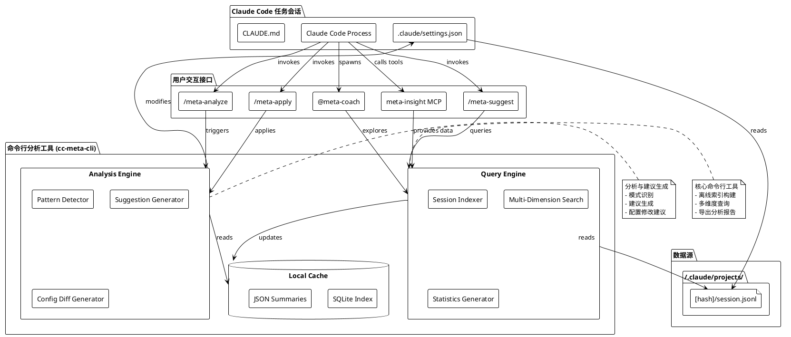

---

### **1.2 数据流与交互序列**

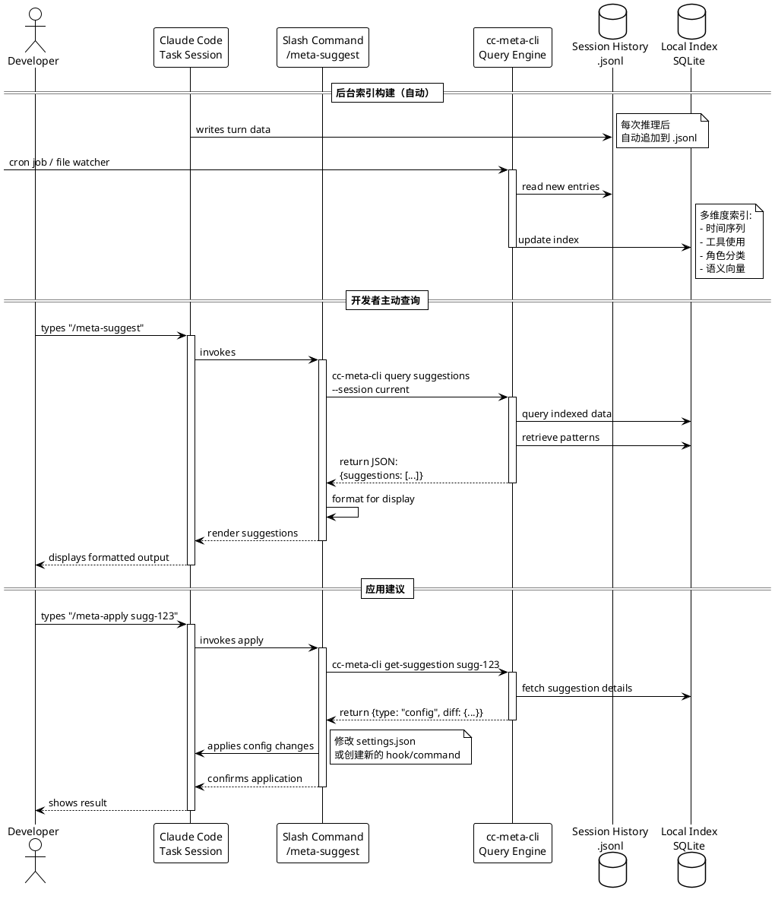

---

## **第二部分：命令行工具架构 (cc-meta-cli)**

### **2.1 命令行工具组件设计**

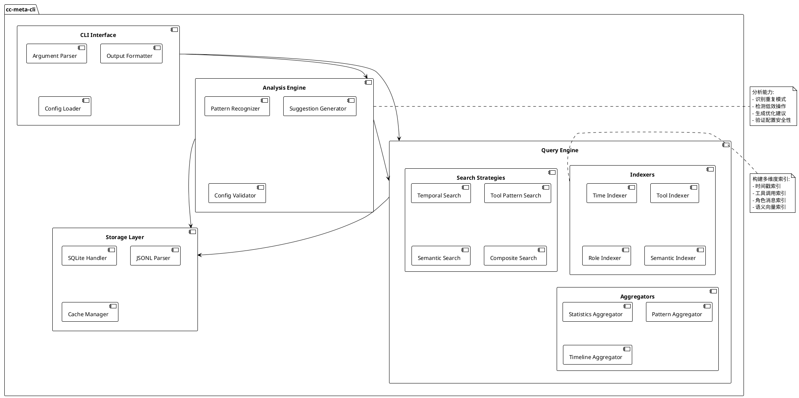

---

### **2.2 命令行工具命令结构**

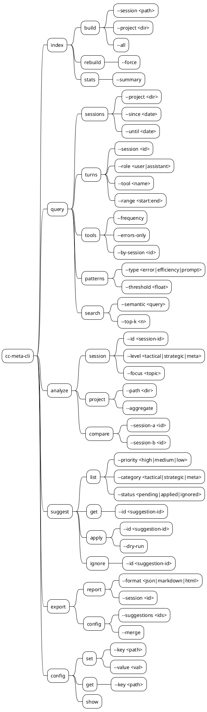

---

### **2.3 核心数据结构**

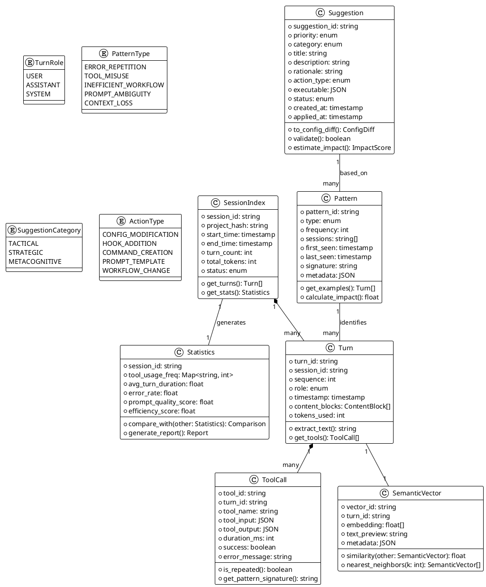

---

## **第三部分：用户交互接口设计**

### **3.1 Slash Commands 接口规范**

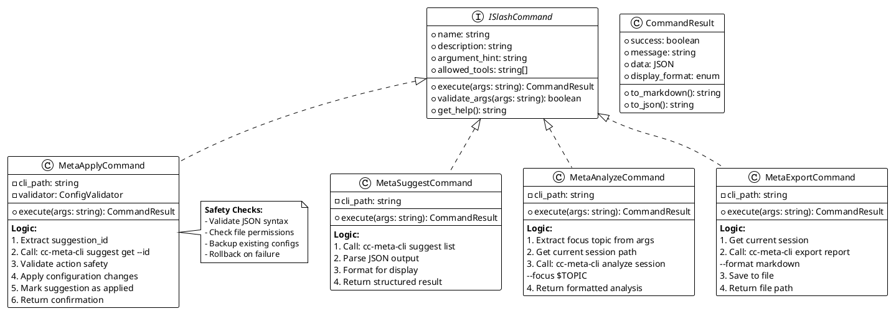

---

### **3.2 Subagent 架构设计**

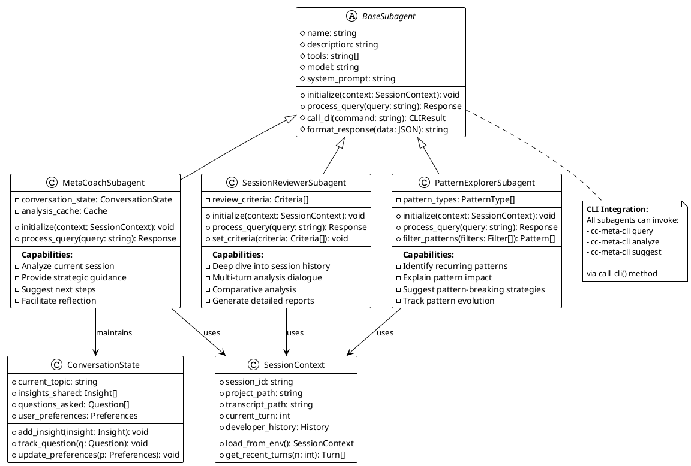

---

### **3.3 MCP Server 接口设计**

```plantuml
@startuml
!theme plain

package "meta-insight MCP Server" {
  
  interface MCPServer {
    + name: string
    + version: string
    + tools: Tool[]
    + resources: Resource[]
    --
    + handle_tool_call(tool: string, args: JSON): ToolResult
    + list_resources(): Resource[]
    + read_resource(uri: string): ResourceContent
  }
  
  class MetaInsightMCP implements MCPServer {
    - cli_wrapper: CLIWrapper
    - cache: QueryCache
    --
    + handle_tool_call(tool: string, args: JSON): ToolResult
    + list_resources(): Resource[]
    + read_resource(uri: string): ResourceContent
  }
  
  class CLIWrapper {
    - cli_path: string
    - timeout: int
    --
    + execute(command: string[], input: JSON): CLIResult
    + parse_output(output: string): JSON
    + handle_error(error: Error): ErrorResponse
  }
  
  class QueryCache {
    - ttl: int
    - max_size: int
    - storage: Map<string, CacheEntry>
    --
    + get(key: string): JSON | null
    + set(key: string, value: JSON): void
    + invalidate(pattern: string): void
  }
}

' MCP Tools Definition
class Tool_QuerySessionStats {
  + name: "query_session_stats"
  + description: "..."
  + input_schema: JSONSchema
  --
  **Input:**
  {
    "session_id": string,
    "metric": enum
  }
  --
  **Output:**
  {
    "tool_usage": Map<string, int>,
    "error_rate": float,
    "efficiency_score": float
  }
  --
  **CLI Mapping:**
  cc-meta-cli query tools
    --session $session_id
    --frequency
}

class Tool_SearchSimilarSituations {
  + name: "search_similar_situations"
  + description: "..."
  + input_schema: JSONSchema
  --
  **Input:**
  {
    "query": string,
    "top_k": int
  }
  --
  **Output:**
  {
    "results": SearchResult[],
    "total": int
  }
  --
  **CLI Mapping:**
  cc-meta-cli query search
    --semantic "$query"
    --top-k $top_k
}

class Tool_GetPatternInsights {
  + name: "get_pattern_insights"
  + description: "..."
  + input_schema: JSONSchema
  --
  **Input:**
  {
    "category": enum,
    "session_id": string?
  }
  --
  **Output:**
  {
    "patterns": Pattern[],
    "recommendations": string[]
  }
  --
  **CLI Mapping:**
  cc-meta-cli query patterns
    --type $category
    --session $session_id
}

class Tool_AnalyzeCurrentSession {
  + name: "analyze_current_session"
  + description: "..."
  + input_schema: JSONSchema
  --
  **Input:**
  {
    "level": enum,
    "focus": string?
  }
  --
  **Output:**
  {
    "insights": Insight[],
    "suggestions": Suggestion[]
  }
  --
  **CLI Mapping:**
  cc-meta-cli analyze session
    --id current
    --level $level
    --focus $focus
}

class Tool_GetSuggestions {
  + name: "get_suggestions"
  + description: "..."
  + input_schema: JSONSchema
  --
  **Input:**
  {
    "status": enum,
    "priority": enum?
  }
  --
  **Output:**
  {
    "suggestions": Suggestion[]
  }
  --
  **CLI Mapping:**
  cc-meta-cli suggest list
    --status $status
    --priority $priority
}

' MCP Resources Definition
class Resource_SessionSummary {
  + uri: "session://current/summary"
  + name: "Current Session Summary"
  + mime_type: "application/json"
  --
  **CLI Mapping:**
  cc-meta-cli query sessions
    --current
}

class Resource_ToolUsageReport {
  + uri: "report://tools/usage"
  + name: "Tool Usage Report"
  + mime_type: "text/markdown"
  --
  **CLI Mapping:**
  cc-meta-cli export report
    --format markdown
    --session current
}

class Resource_PatternDatabase {
  + uri: "patterns://all"
  + name: "Pattern Database"
  + mime_type: "application/json"
  --
  **CLI Mapping:**
  cc-meta-cli query patterns
    --all
}

MetaInsightMCP --> CLIWrapper : uses
MetaInsightMCP --> QueryCache : uses
MetaInsightMCP ..> Tool_QuerySessionStats : provides
MetaInsightMCP ..> Tool_SearchSimilarSituations : provides
MetaInsightMCP ..> Tool_GetPatternInsights : provides
MetaInsightMCP ..> Tool_AnalyzeCurrentSession : provides
MetaInsightMCP ..> Tool_GetSuggestions : provides
MetaInsightMCP ..> Resource_SessionSummary : exposes
MetaInsightMCP ..> Resource_ToolUsageReport : exposes
MetaInsightMCP ..> Resource_PatternDatabase : exposes

note right of MetaInsightMCP
  **MCP Server 配置:**
  
  # 添加到 Claude Code
  claude mcp add meta-insight \\
    npx cc-meta-mcp-server
  
  **使用示例:**
  > Use meta-insight MCP to
    search for similar debugging
    situations in my history
end note

@enduml
```

---

## **第四部分：数据处理流程**

### **4.1 索引构建流程**

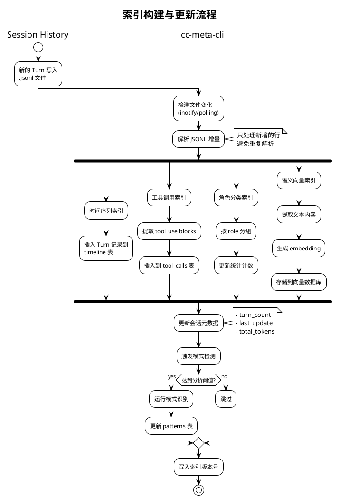

---

### **4.2 查询执行流程**

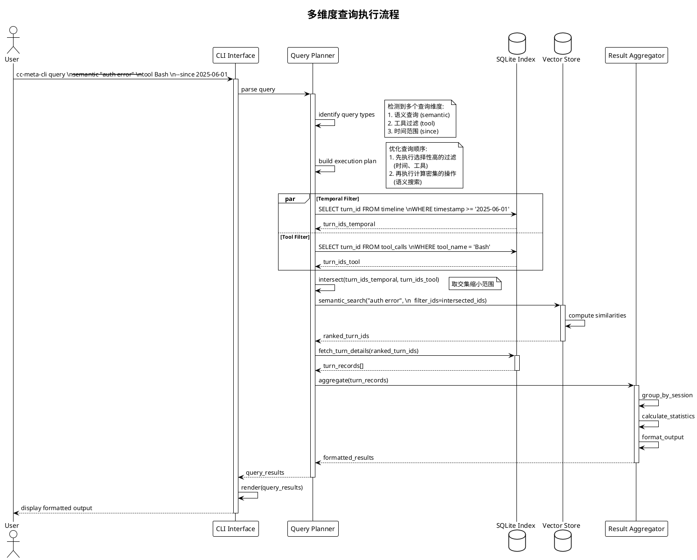

---

### **4.3 建议生成与应用流程**

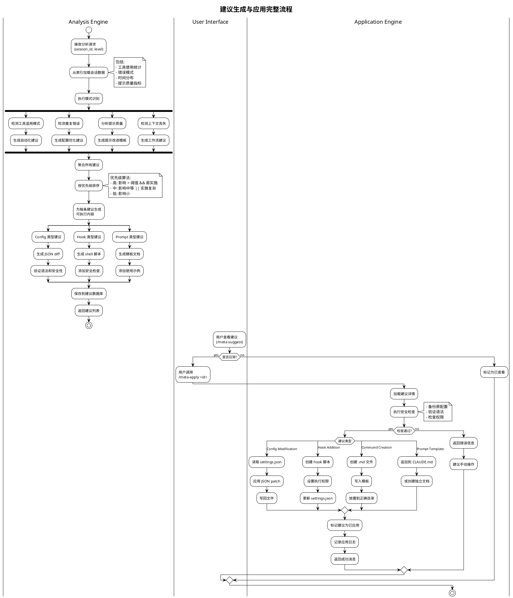

---

## **第五部分：部署与配置**

### **5.1 系统组件部署图**

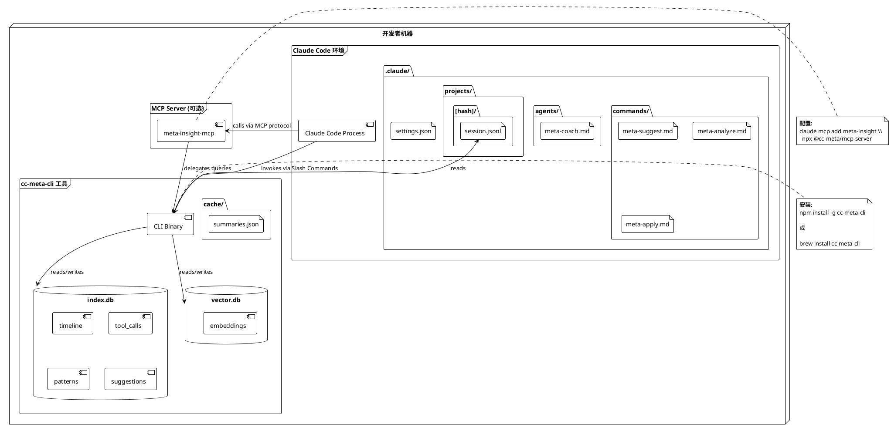

---

### **5.2 配置文件结构**

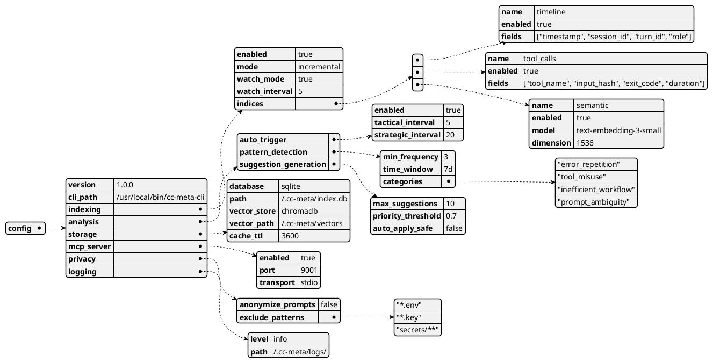

---

### **5.3 接口协议定义**

```plantuml
@startuml
!theme plain

package "CLI Output Formats" {
  
  class JSONOutput {
    + version: string = "1.0"
    + timestamp: string
    + command: string
    + result: JSON
    + metadata: Metadata
    --
    **Example:**
    {
      "version": "1.0",
      "timestamp": "2025-06-02T10:00:00Z",
      "command": "query sessions",
      "result": {
        "sessions": [...]
      },
      "metadata": {
        "execution_time_ms": 45,
        "cache_hit": false
      }
    }
  }
  
  class MarkdownOutput {
    + header: string
    + sections: Section[]
    + footer: string
    --
    **Example:**
    # Session Analysis Report
    
    ## Overview
    - Total turns: 42
    - Duration: 1h 23m
    
    ## Tool Usage
    | Tool | Count |
    |------|-------|
    | Edit | 15    |
    | Bash | 8     |
  }
  
  class TableOutput {
    + headers: string[]
    + rows: string[][]
    + format: "ascii" | "csv"
    --
    **Example:**
    ┌────────┬────────┐
    │ Tool   │ Count  │
    ├────────┼────────┤
    │ Edit   │ 15     │
    │ Bash   │ 8      │
    └────────┴────────┘
  }
}

package "MCP Protocol Messages" {
  
  class ToolCallRequest {
    + jsonrpc: "2.0"
    + id: string
    + method: "tools/call"
    + params: {
        name: string,
        arguments: JSON
      }
  }
  
  class ToolCallResponse {
    + jsonrpc: "2.0"
    + id: string
    + result: {
        content: Content[],
        isError: boolean
      }
  }
  
  class ResourceReadRequest {
    + jsonrpc: "2.0"
    + id: string
    + method: "resources/read"
    + params: {
        uri: string
      }
  }
  
  class ResourceReadResponse {
    + jsonrpc: "2.0"
    + id: string
    + result: {
        contents: ResourceContent[]
      }
  }
}

package "Internal Data Transfer" {
  
  class CLIResult {
    + success: boolean
    + exit_code: int
    + stdout: string
    + stderr: string
    + data: JSON
    --
    + parse_json(): JSON
    + is_error(): boolean
  }
  
  class QueryResult {
    + total: int
    + items: JSON[]
    + pagination: {
        page: int,
        per_page: int,
        has_more: boolean
      }
    + execution_time_ms: int
  }
  
  class SuggestionPayload {
    + id: string
    + priority: "high" | "medium" | "low"
    + category: Category
    + title: string
    + description: string
    + rationale: string
    + action: {
        type: ActionType,
        target: string,
        content: JSON,
        safety_level: int
      }
    --
    + to_config_diff(): ConfigDiff
    + to_markdown(): string
  }
}

note right of JSONOutput
  **CLI 输出格式:**
  
  默认使用 JSON (--output json)
  可通过 --output 参数切换:
  - json
  - markdown
  - table
  - csv
end note

note right of ToolCallRequest
  **MCP 工具调用:**
  
  Claude Code 通过 MCP 协议
  调用 meta-insight 服务器的工具
  
  服务器委托给 cc-meta-cli
end note

@enduml
```

---

## **第六部分：使用场景示例**

### **6.1 场景 1：快速查看建议**

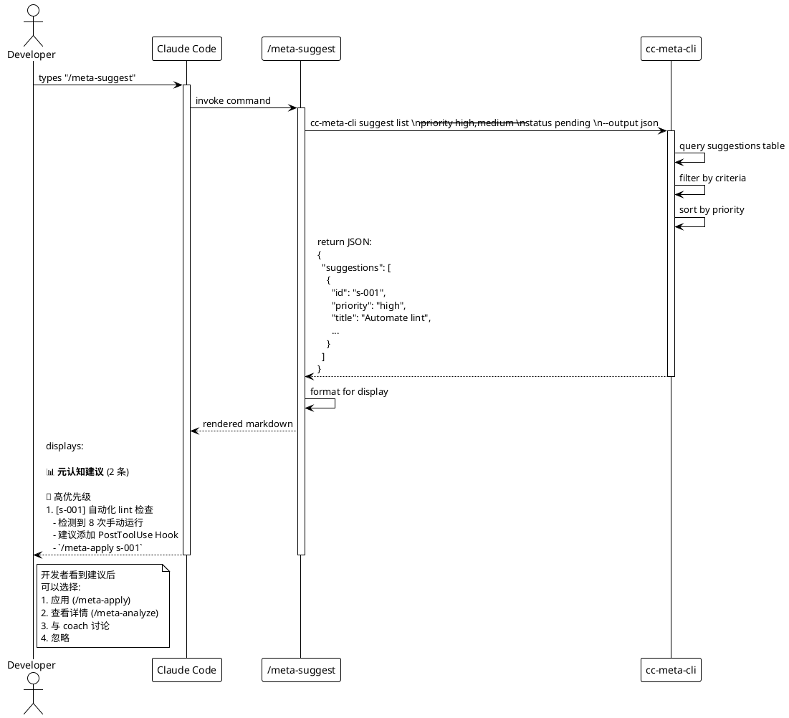

---

### **6.2 场景 2：深度对话式分析**

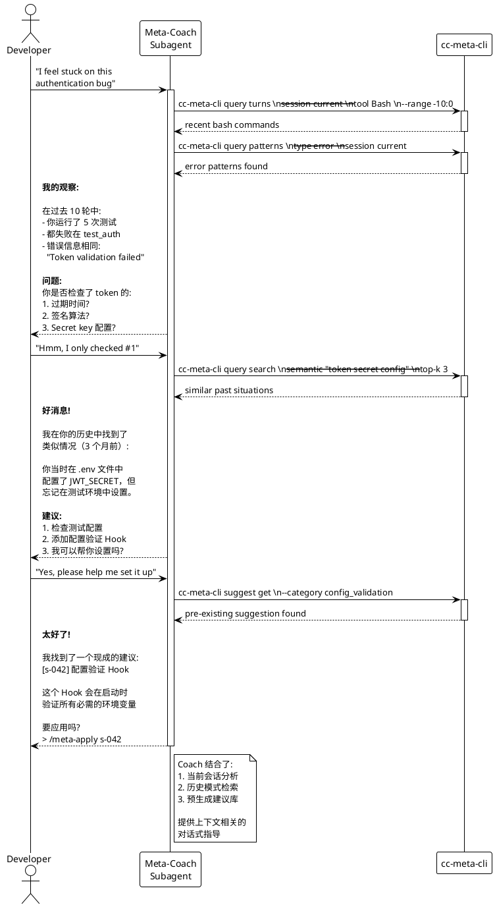

---

### **6.3 场景 3：通过 MCP 进行语义搜索**

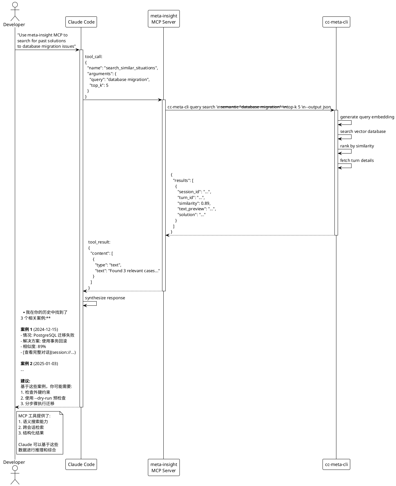

---

## **第七部分：扩展性与演进路径**

### **7.1 功能模块化与扩展点**

```plantuml
@startuml
!theme plain

package "Core System" {
  [CLI Engine] as Core
  [Index Manager] as Index
  [Query Processor] as Query
  [Analysis Engine] as Analysis
}

package "Extension Points" {
  
  interface IIndexer {
    + index_turn(turn: Turn): void
    + build_index(session: Session): void
  }
  
  interface ISearchStrategy {
    + search(query: Query): Result[]
    + supports(query_type: string): boolean
  }
  
  interface IPatternDetector {
    + detect(session: Session): Pattern[]
    + get_pattern_type(): string
  }
  
  interface ISuggestionGenerator {
    + generate(patterns: Pattern[]): Suggestion[]
    + get_category(): string
  }
  
  interface IOutputFormatter {
    + format(data: JSON): string
    + get_format_type(): string
  }
}

package "Built-in Implementations" {
  [TimeIndexer] as TimeIdx
  [ToolIndexer] as ToolIdx
  [SemanticIndexer] as SemIdx
  
  [TemporalSearch] as TempSearch
  [ToolPatternSearch] as ToolSearch
  [SemanticSearch] as SemSearch
  
  [ErrorRepetitionDetector] as ErrDet
  [ToolMisuseDetector] as ToolDet
  
  [ConfigSuggestionGen] as ConfigGen
  [PromptSuggestionGen] as PromptGen
  
  [JSONFormatter] as JSON
  [MarkdownFormatter] as MD
}

package "Custom Extensions" {
  [CustomIndexer] as CustomIdx
  [CustomDetector] as CustomDet
  [CustomGenerator] as CustomGen
  
  note right of CustomIdx
    **用户可以实现:**
    
    例如：索引特定领域数据
    - Git commit 关联
    - Issue tracker 集成
    - Code metrics 索引
  end note
}

Core --> Index
Core --> Query
Core --> Analysis

Index ..> IIndexer : uses
Query ..> ISearchStrategy : uses
Analysis ..> IPatternDetector : uses
Analysis ..> ISuggestionGenerator : uses
Core ..> IOutputFormatter : uses

TimeIdx ..|> IIndexer
ToolIdx ..|> IIndexer
SemIdx ..|> IIndexer
CustomIdx ..|> IIndexer

TempSearch ..|> ISearchStrategy
ToolSearch ..|> ISearchStrategy
SemSearch ..|> ISearchStrategy

ErrDet ..|> IPatternDetector
ToolDet ..|> IPatternDetector
CustomDet ..|> IPatternDetector

ConfigGen ..|> ISuggestionGenerator
PromptGen ..|> ISuggestionGenerator
CustomGen ..|> ISuggestionGenerator

JSON ..|> IOutputFormatter
MD ..|> IOutputFormatter

@enduml
```

---

### **7.2 渐进式实施路线图**

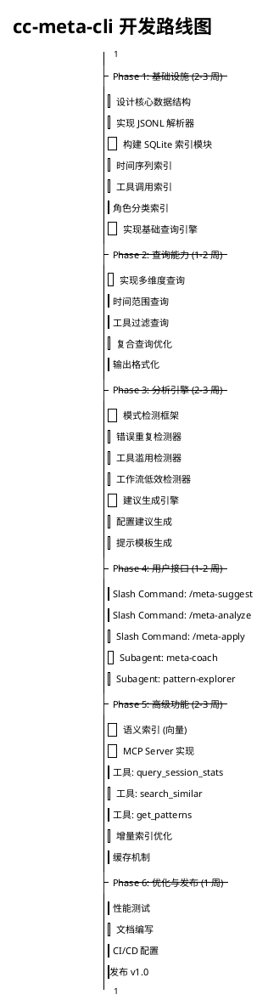

---

## **总结：简化原型的核心设计原则**

### **设计哲学**

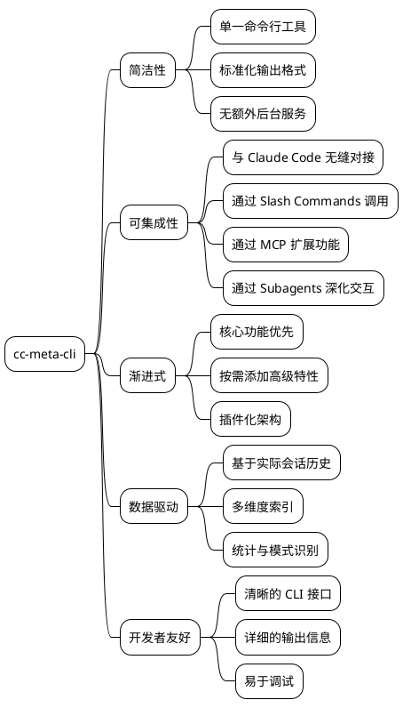

---

### **关键特性矩阵**

| 特性 | 基础版 | 标准版 | 高级版 |
|------|--------|--------|--------|
| **索引能力** |
| 时间序列索引 | ✅ | ✅ | ✅ |
| 工具调用索引 | ✅ | ✅ | ✅ |
| 角色分类索引 | ✅ | ✅ | ✅ |
| 语义向量索引 | ❌ | ✅ | ✅ |
| **查询能力** |
| 基础过滤查询 | ✅ | ✅ | ✅ |
| 复合查询优化 | ❌ | ✅ | ✅ |
| 语义搜索 | ❌ | ✅ | ✅ |
| 跨会话聚合 | ❌ | ❌ | ✅ |
| **分析能力** |
| 统计摘要 | ✅ | ✅ | ✅ |
| 模式检测 | 基础 | ✅ | ✅ |
| 建议生成 | 手动 | 自动 | 自动+智能 |
| **接口** |
| CLI 命令 | ✅ | ✅ | ✅ |
| Slash Commands | 2 个 | 4 个 | 6+ 个 |
| Subagents | ❌ | 1 个 | 2+ 个 |
| MCP Server | ❌ | ❌ | ✅ |
| **性能** |
| 增量索引 | ✅ | ✅ | ✅ |
| 查询缓存 | ❌ | ✅ | ✅ |
| 并行处理 | ❌ | ❌ | ✅ |

这个简化原型通过清晰的模块划分、标准化的接口设计和渐进式的实施路径，为开发者提供了一个轻量但功能完整的元认知分析系统。