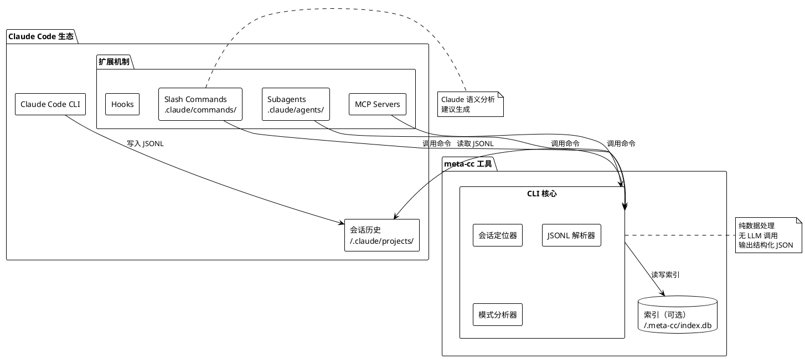
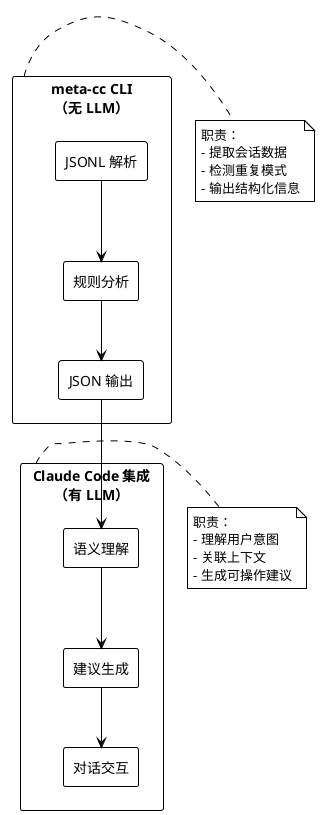
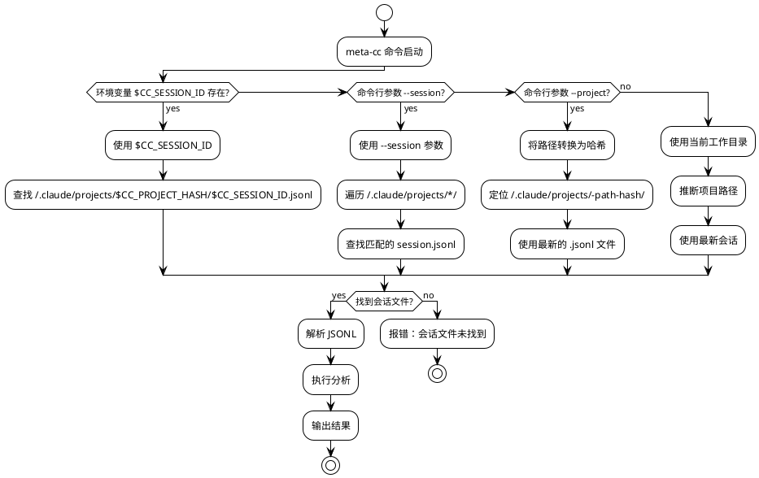
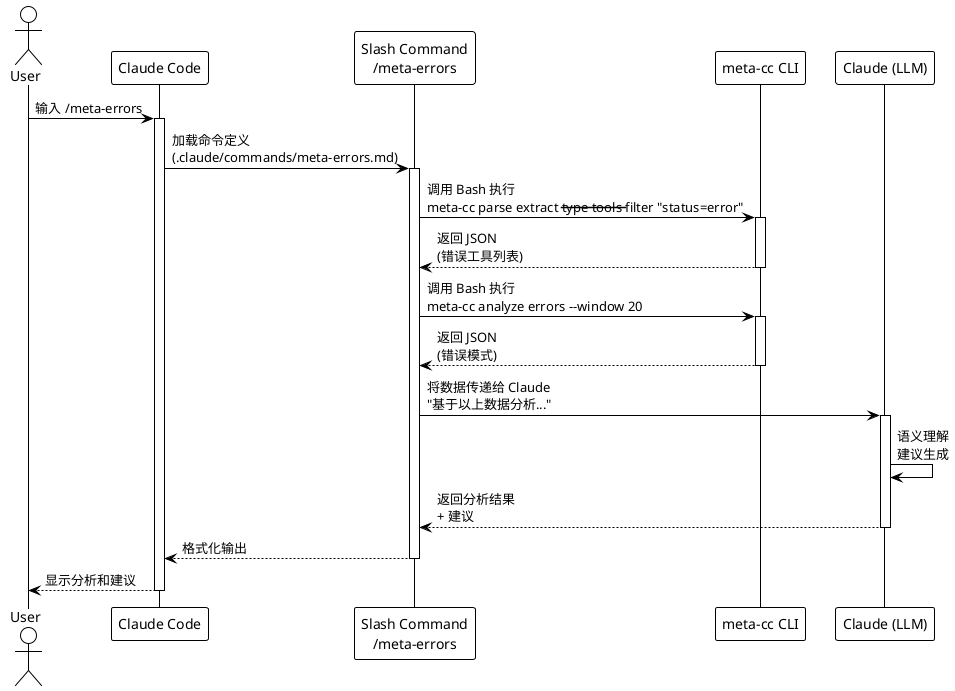
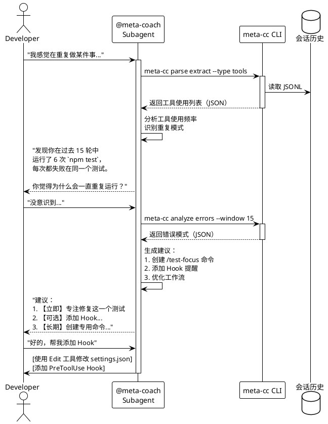
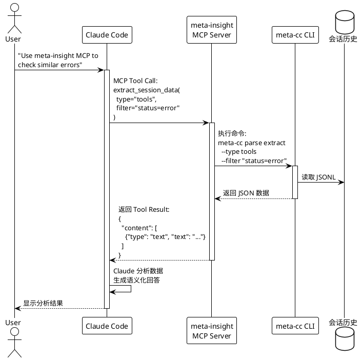
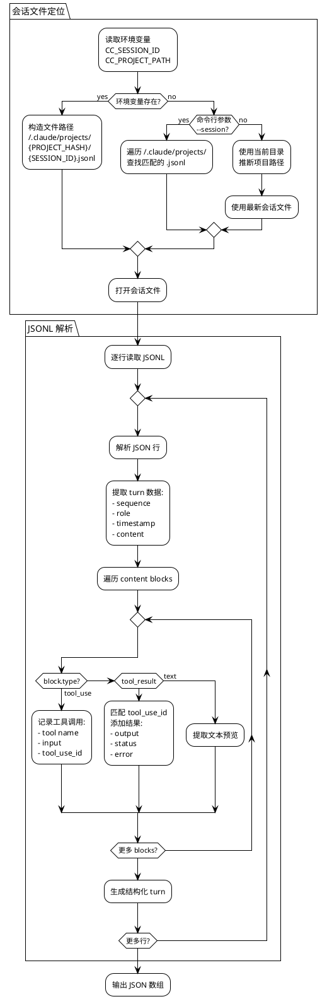
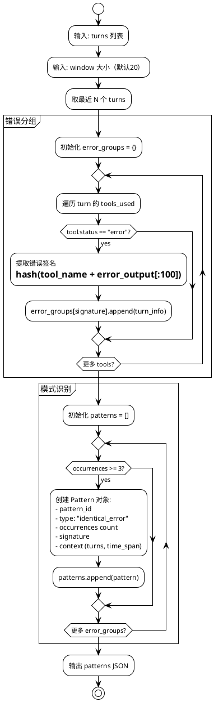
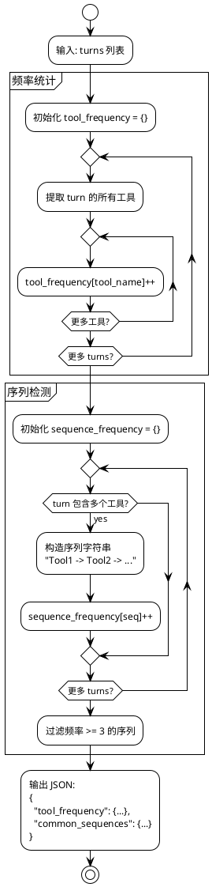
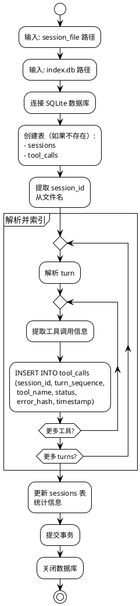

# Claude Code 元认知分析系统 - 技术方案

## 一、系统概述

### 1.1 核心定位

基于 `~/.claude/projects/` 会话历史的命令行分析工具，通过多维度索引、智能查询和模式识别，为 [Claude Code](https://docs.claude.com/en/docs/claude-code/overview) 提供元认知能力。

### 1.2 系统架构



**参考文档：**
- [Claude Code 概述](https://docs.claude.com/en/docs/claude-code/overview)
- [Slash Commands](https://docs.claude.com/en/docs/claude-code/slash-commands)
- [Subagents](https://docs.claude.com/en/docs/claude-code/subagents)
- [MCP 集成](https://docs.claude.com/en/docs/claude-code/mcp)
- [Hooks 系统](https://docs.claude.com/en/docs/claude-code/hooks)

---

## 二、核心工具：meta-cc CLI

### 2.1 设计原则

**职责边界**


**会话定位机制**


**会话文件结构**
```
~/.claude/projects/              # Claude Code 会话存储根目录
  └─ -home-yale-work-myproject/  # 项目路径哈希（/ 替换为 -）
      ├─ 5b57148c-...d90d.jsonl # 会话1（UUID 命名）
      ├─ f1547628-...c7e.jsonl  # 会话2
      └─ 193e3ca7-...050.jsonl  # 会话3
```

**实际验证结果**（基于 Phase 0-6 实现）：
- ✅ 会话文件位置：`~/.claude/projects/{项目路径哈希}/{会话UUID}.jsonl`
- ✅ 路径哈希算法：简单替换 `/` 为 `-`（例：`/home/yale/work/meta-cc` → `-home-yale-work-meta-cc`）
- ✅ 自动检测机制：通过 `os.Getwd()` 获取当前目录，转换为哈希后查找最新 `.jsonl` 文件
- ⚠️ 环境变量 `CC_SESSION_ID` / `CC_PROJECT_HASH`：Claude Code **未提供**此类环境变量
- ✅ 可用环境变量：`CLAUDECODE=1`（标识 Claude Code 环境）、`CLAUDE_CODE_ENTRYPOINT=cli`

**参考文档：**
- [设置和配置](https://docs.claude.com/en/docs/claude-code/settings)

**架构设计原则**（Phase 14 增强）：

```
核心职责边界：
1. 职责最小化原则 - meta-cc 仅负责 Claude Code 会话历史知识的提取
   - ✅ 提取：Turn、ToolCall、Error 等结构化数据
   - ✅ 检测：基于规则的模式识别（重复错误签名、工具序列）
   - ❌ 分析：不做语义分析、不做决策（如窗口大小、聚合方式）
   - ❌ 过滤：不预判用户需求，复杂过滤交给 jq/awk

2. Pipeline 模式 - 抽象通用数据处理流程
   - 定位会话 → 加载 JSONL → 提取数据 → 输出格式化
   - 消除跨命令重复代码（~345 行重复 → 120 行共享 Pipeline）

3. 输出确定性 - 所有输出按稳定字段排序
   - query tools → 按 Timestamp 排序
   - query messages → 按 turn_sequence 排序
   - 解决 Go map 迭代随机性问题

4. 延迟决策 - 将分析决策推给下游工具/LLM
   - ❌ meta-cc 不应实现：窗口过滤、错误聚合、模式计数
   - ✅ 交给 jq/awk：`meta-cc query errors | jq '.[length-50:]'`
   - ✅ 交给 Claude：Slash Commands 从 JSONL 生成语义建议
```

**实际应用示例**：

```bash
# 错误：meta-cc 预判分析范围（违反职责最小化）
meta-cc analyze errors --window 50 --aggregate
# 输出：{"pattern1": {count: 5}, "pattern2": {count: 3}}

# 正确：meta-cc 仅提取，LLM/工具负责决策
meta-cc query errors | jq '.[length-50:] | group_by(.Signature) | map({pattern: .[0].Signature, count: length})'
# meta-cc 输出全部错误，jq 负责窗口选择和聚合
```

### 2.2 命令结构与输出格式原则

**输出格式设计原则**（Phase 13）：

```
核心原则：
1. 双格式原则 - 仅保留 JSONL 和 TSV
2. 格式一致性 - 所有场景输出有效格式（包括错误）
3. 数据日志分离 - stdout=数据, stderr=日志
4. Unix 可组合性 - meta-cc 提供简单检索，复杂过滤交给 jq/awk/grep
5. 客户端渲染 - 移除 Markdown，由 Claude Code 自行渲染
```

**格式选择**：
- **JSONL**（默认，`--stream`）：机器处理，jq 友好，流式性能
- **TSV**（`--output tsv`）：轻量级，awk/grep 友好，体积小

**移除格式**（避免冗余和维护负担）：
- ❌ JSON (pretty array) → 用 `--stream | jq -s` 替代
- ❌ CSV → 用 TSV 替代（转换：`tr '\t' ','`）
- ❌ Markdown → 客户端渲染（Slash Commands 让 Claude 格式化）

**命令结构**：

```bash
meta-cc - Claude Code Meta-Cognition Tool

全局选项:
  --session <id>          会话ID（或自动检测）
  --project <path>        项目路径（自动转换为哈希目录）
  --stream                JSONL 输出（默认）
  --output tsv            TSV 输出
  --fields <list>         字段投影（逗号分隔）
  --limit <n>             限制结果数量
  --offset <n>            跳过前 N 条

COMMANDS:
  parse       解析会话文件（核心功能）
    extract   提取特定数据（turns/tools/errors）
    stats     会话统计信息

  query       数据查询（无需索引）
    tools     查询工具调用
    messages  查询用户消息
    context   查询上下文
    sequences 查询工具序列

  analyze     模式分析（基于规则，无 LLM）
    errors    错误模式检测
    sequences 工具序列模式

  stats       统计分析
    aggregate 聚合统计
    timeseries 时间序列
    files     文件级统计
```

**Unix 可组合性示例**：

```bash
# meta-cc 提供简单检索（--where, --status, --tool）
meta-cc query tools --status error --limit 100

# 复杂过滤交给 jq（多条件、计算、转换）
meta-cc query tools | jq 'select(.Duration > 5000 and .ToolName == "Bash")'

# TSV + awk 处理（轻量场景）
meta-cc query tools --output tsv | awk -F'\t' '{if ($3 == "error") print $2}'

# 组合使用（meta-cc + jq + awk）
meta-cc query tools --status error | \
  jq -r '[.ToolName, .Duration] | @tsv' | \
  awk '{sum+=$2} END {print "Total:", sum "ms"}'
```

### 2.3 核心命令示例

**阶段1: 无索引，纯解析**
```bash
# 导出当前会话的所有 turns（供 Claude 分析）
meta-cc parse extract --type turns --format json

# 提取所有工具调用
meta-cc parse extract --type tools --filter "status=error"

# 生成会话统计摘要
meta-cc parse stats --metrics "tools,errors,duration"
```

**阶段2: 有索引，高级查询**
```bash
# 查询最近的 Bash 工具使用
meta-cc query tools --name Bash --limit 10

# 分析错误重复模式
meta-cc analyze errors --window 20 --threshold 3

# 生成时间线视图
meta-cc analyze timeline --group-by tool --format md
```

---

## 三、数据架构

### 3.1 核心数据流（两阶段）

**阶段1: 直接解析（MVP，无索引）**
```
JSONL 文件
    ↓
meta-cc parse extract
    ↓
结构化 JSON 输出
    ↓
Slash Command/Subagent 调用 Claude
    ↓
语义分析 + 建议生成
```

**阶段2: 索引增强（可选优化）**
```
JSONL 文件
    ↓
meta-cc index build
    ↓
SQLite 索引
    ↓
meta-cc query/analyze（基于规则）
    ↓
高密度分析结果
    ↓
Claude 语义理解
```

### 3.2 输出格式规范

**`meta-cc parse extract --type turns`**
```json
{
  "session_id": "5b57148c-89dc-4eb5-bc37-8122e194d90d",
  "project_hash": "-home-yale-work-myproject",
  "turn_count": 42,
  "turns": [
    {
      "sequence": 0,
      "role": "user",
      "timestamp": 1735689600,
      "content_preview": "帮我修复这个认证 bug",
      "has_attachments": false
    },
    {
      "sequence": 1,
      "role": "assistant",
      "timestamp": 1735689605,
      "tools_used": ["Read", "Grep"],
      "tool_calls": [
        {
          "tool": "Grep",
          "pattern": "auth.*error",
          "status": "success"
        }
      ]
    }
  ]
}
```

**`meta-cc parse extract --type tools --filter "status=error"`**
```json
{
  "total_tools": 87,
  "error_tools": 12,
  "tools": [
    {
      "turn_sequence": 15,
      "tool_name": "Bash",
      "command": "npm test",
      "status": "error",
      "exit_code": 1,
      "error_output": "FAIL test_auth.js\n  TypeError: Cannot read...",
      "timestamp": 1735689700
    }
  ]
}
```

**`meta-cc analyze errors --window 20`**
```json
{
  "analysis_type": "error_repetition",
  "window_size": 20,
  "patterns": [
    {
      "pattern_id": "err-001",
      "type": "identical_error",
      "occurrences": 5,
      "first_turn": 12,
      "last_turn": 28,
      "signature": "TypeError: Cannot read property 'id'",
      "tool": "Bash",
      "command_pattern": "npm test",
      "context": {
        "turns": [12, 15, 19, 24, 28],
        "time_span_minutes": 23
      }
    }
  ],
  "summary": {
    "total_errors": 12,
    "unique_errors": 3,
    "repeated_errors": 2
  }
}
```

### 3.3 索引结构（可选，阶段2）

**SQLite 数据库 (~/.meta-cc/index.db)**

```sql
-- 最小化索引表（仅加速查询）
CREATE TABLE sessions (
  session_id TEXT PRIMARY KEY,
  project_hash TEXT,
  first_turn_time INTEGER,
  last_turn_time INTEGER,
  turn_count INTEGER,
  tool_call_count INTEGER,
  error_count INTEGER
);

CREATE TABLE tool_calls (
  id INTEGER PRIMARY KEY AUTOINCREMENT,
  session_id TEXT,
  turn_sequence INTEGER,
  tool_name TEXT,
  status TEXT,
  timestamp INTEGER,
  error_hash TEXT  -- 用于快速匹配重复错误
);

CREATE INDEX idx_tool_session ON tool_calls(session_id, tool_name);
CREATE INDEX idx_tool_errors ON tool_calls(status, error_hash);
```

---

## 四、Claude Code 集成

### 4.1 会话定位机制（已验证实现）

**实际实现方案**（Phase 6 验证通过）：
```bash
# Slash Command 中无需传递任何参数
meta-cc parse stats --output md
meta-cc analyze errors --output md

# meta-cc 自动检测流程：
# 1. 获取当前工作目录 (cwd)：/home/yale/work/meta-cc
# 2. 转换为路径哈希：-home-yale-work-meta-cc
# 3. 定位会话目录：~/.claude/projects/-home-yale-work-meta-cc/
# 4. 选择最新 .jsonl 文件（按修改时间排序）
```

**Claude Code 环境变量现状**（Phase 6 实测）：
- ❌ `CC_SESSION_ID`：不存在
- ❌ `CC_PROJECT_HASH`：不存在
- ✅ `CLAUDECODE=1`：可用于判断是否在 Claude Code 环境
- ✅ `CLAUDE_CODE_ENTRYPOINT=cli`：标识入口类型

**手动指定参数**（可选）：
```bash
# 分析其他项目
meta-cc --project /home/yale/work/NarrativeForge parse stats

# 分析特定会话
meta-cc --session 6a32f273-191a-49c8-a5fc-a5dcba08531a parse stats
```

### 4.2 Slash Commands

**执行流程**


**命令定义示例**

```markdown
# .claude/commands/meta-stats.md
---
name: meta-stats
description: 显示当前会话的统计信息
allowed_tools: [Bash]
---

运行以下命令获取会话统计：
\`\`\`bash
meta-cc parse stats --metrics tools,errors,duration --output md
\`\`\`
将结果格式化后显示给用户。
```

```markdown
# .claude/commands/meta-errors.md
---
name: meta-errors
description: 分析当前会话中的错误模式
allowed_tools: [Bash]
argument-hint: [window-size]
---

执行错误分析（窗口大小：${1:-20}）：
\`\`\`bash
error_data=$(meta-cc parse extract --type tools --filter "status=error" --output json)
pattern_data=$(meta-cc analyze errors --window ${1:-20} --output json)
\`\`\`

基于以上数据分析：
1. 是否存在重复错误？
2. 错误集中在哪些工具/命令？
3. 给出优化建议（hook、工作流等）
```

**参考文档：**
- [Slash Commands 指南](https://docs.claude.com/en/docs/claude-code/slash-commands)
- [自定义命令示例](https://docs.claude.com/en/docs/claude-code/slash-commands#custom-commands)

### 4.3 Subagent: @meta-coach（阶段2）

**对话式分析流程**


**Subagent 配置文件**
```markdown
# .claude/agents/meta-coach.md
---
name: meta-coach
description: 元认知教练，通过分析会话历史帮助开发者优化工作流程
model: claude-sonnet-4
allowed_tools: [Bash, Read, Edit, Write]
---

# 系统提示

你是开发者的元认知教练。职责：
1. 识别重复性低效操作
2. 发现问题解决模式
3. 引导反思和优化

## 分析工具

使用 `meta-cc` CLI 获取会话数据：

\`\`\`bash
# 提取工具调用
meta-cc parse extract --type tools

# 分析错误模式
meta-cc analyze errors --window 30

# 查询历史（如果有索引）
meta-cc query sessions --limit 10
\`\`\`

## 对话原则

- **引导式提问**：帮助开发者自己发现问题
- **数据驱动**：基于具体数据，而非猜测
- **可操作建议**：提供具体的优化方案

## 工作流

1. 倾听开发者的困惑
2. 调用 meta-cc 获取数据
3. 分析模式并引导思考
4. 提供分层建议（立即/可选/长期）
5. 协助实施优化（修改配置、创建命令等）
```

**参考文档：**
- [Subagents 指南](https://docs.claude.com/en/docs/claude-code/subagents)
- [创建自定义 Subagent](https://docs.claude.com/en/docs/claude-code/subagents#creating-subagents)

### 4.4 MCP Server（已实现，Phase 7）

**实现状态**: ✅ 已完成（原生 Go 实现，无需包装器）

**MCP 工具调用流程**


**MCP Server 配置**（实际实现）

添加 MCP Server：
```bash
# 直接使用 meta-cc 二进制（无需 Node.js）
claude mcp add meta-insight /path/to/meta-cc mcp

# 验证连接
claude mcp list
# 输出：meta-insight: /path/to/meta-cc mcp - ✓ Connected
```

**实现文件**: `cmd/mcp.go` (~250 行)

**关键特性**:
- ✅ 原生 Go 实现（零外部依赖）
- ✅ JSON-RPC 2.0 协议
- ✅ stdio 传输层
- ✅ 内部命令复用（通过 os.Stdout 重定向）
- ✅ MCP 协议版本：2024-11-05

**工具定义示例**
```json
{
  "tools": [
    {
      "name": "extract_session_data",
      "description": "从会话历史中提取结构化数据",
      "inputSchema": {
        "type": "object",
        "properties": {
          "type": {
            "type": "string",
            "enum": ["turns", "tools", "errors"],
            "description": "数据类型"
          },
          "filter": {
            "type": "string",
            "description": "过滤条件（可选）"
          }
        },
        "required": ["type"]
      }
    },
    {
      "name": "analyze_patterns",
      "description": "分析会话中的错误或工具使用模式",
      "inputSchema": {
        "type": "object",
        "properties": {
          "analysis_type": {
            "type": "string",
            "enum": ["errors", "tools", "timeline"]
          },
          "window": {
            "type": "number",
            "description": "分析窗口大小"
          }
        }
      }
    }
  ]
}
```

**参考文档：**
- [MCP 集成指南](https://docs.claude.com/en/docs/claude-code/mcp)
- [Model Context Protocol 规范](https://modelcontextprotocol.io/)

---

## 五、核心功能实现

### 5.1 JSONL 解析流程（阶段1 核心）



### 5.2 错误模式检测（阶段1）



### 5.3 工具使用分析（阶段1）



### 5.4 索引构建流程（阶段2，可选）



---

## 六、实施计划

### 6.1 阶段1：核心解析（1-2周）

**目标：无需索引，直接解析 JSONL**

- [x] CLI 框架搭建（Phase 0-1 完成）
  - 参数解析（--session, --project, --output）
  - ~~环境变量读取（CC_SESSION_ID, CC_PROJECT_PATH）~~（实测不存在）
  - 会话文件定位逻辑（基于 cwd 自动检测）

- [x] JSONL 解析器（Phase 2 完成）
  - `ParseEntries()`: 提取 entry 数据（user/assistant/file-history-snapshot）
  - `ExtractToolCalls()`: 提取工具调用和结果
  - 错误识别（通过 ToolResult.Status）

- [x] 核心命令实现（Phase 3-5 完成）
  - `meta-cc parse extract --type turns/tools` (Phase 3)
  - `meta-cc parse stats` (Phase 4)
  - `meta-cc analyze errors --window N` (Phase 5)

- [x] 输出格式化（Phase 3-6 完成）
  - JSON 输出（默认）
  - Markdown 表格输出
  - ~~CSV 输出~~（未实现，可选）

- [x] 集成测试（Phase 6 完成）
  - Slash Command: `/meta-stats`
  - Slash Command: `/meta-errors`

**交付物：**
- ✅ 可运行的 `meta-cc` CLI 工具（66 tests passing）
- ✅ 2 个可用的 Slash Commands
- ✅ 完整文档（README.md + troubleshooting.md）

**已验证项目：**
- meta-cc: 2,563 turns, 0% error rate
- NarrativeForge: 2,032 turns, 0% error rate
- claude-tmux: 299 turns, 0% error rate

### 6.2 阶段2：索引优化（1周，可选）

**目标：加速重复查询**

- [ ] SQLite 索引构建
  - `meta-cc index build`: 全量索引
  - `meta-cc index update`: 增量索引
  - 索引状态管理

- [ ] 高级查询命令
  - `meta-cc query sessions --project <path> --limit N`
  - `meta-cc query tools --name <tool> --since <date>`

- [ ] Slash Command: `/meta-timeline`

**交付物：**
- 可选的索引功能
- 更快的查询性能（跨会话）

### 6.3 阶段3：MCP Server 实现（已完成，Phase 7）

**目标：原生 MCP 协议实现**

- [x] MCP 协议实现（cmd/mcp.go）
  - JSON-RPC 2.0 请求/响应处理
  - stdio 传输层
  - 工具路由逻辑

- [x] 工具定义
  - `get_session_stats`: 会话统计
  - `analyze_errors`: 错误分析
  - `extract_tools`: 工具提取

- [x] Claude Code 集成测试
  - `claude mcp add` 注册
  - 连接验证
  - 3 个工具功能验证

**交付物：**
- ✅ cmd/mcp.go (~250 行)
- ✅ MCP 工具在 Claude Code 中可用
- ✅ 文档更新（README.md MCP 部分）

### 6.4 阶段4：语义理解增强（未来可选）

**目标：高级 Subagent 功能**

- [ ] @meta-coach 增强
  - 自动化建议实施
  - 工作流模式学习
  - 多会话关联分析

---

## 七、关键设计决策

### 7.1 职责分离：CLI vs Claude

**CLI 工具职责（无 LLM）**
- ✅ JSONL 解析和数据提取
- ✅ 基于规则的模式检测（错误重复、工具频率）
- ✅ 结构化数据输出（JSON/Markdown）
- ✅ 索引构建和查询优化

**Claude 职责（在 Slash/Subagent/MCP 中）**
- ✅ 语义理解和分析
- ✅ 建议生成和优先级判断
- ✅ 上下文关联和推理
- ✅ 与用户的对话式交互

**为什么这样分离？**
1. **性能**：CLI 处理纯数据，速度快
2. **成本**：不为简单统计调用 LLM
3. **可测试性**：CLI 输出确定性，易于测试
4. **灵活性**：同一份数据，可被多个上层工具复用

### 7.2 会话定位策略（已验证实现）

**实际优先级顺序**（基于 Phase 1 实现和 Phase 6 验证）：
1. ~~环境变量 `CC_SESSION_ID` + `CC_PROJECT_HASH`~~（❌ Claude Code 未提供）
2. 命令行参数 `--session <id>`（✅ 遍历所有项目查找）
3. 命令行参数 `--project <path>`（✅ 转换为哈希，返回最新会话）
4. **自动检测（当前工作目录）**（✅ 默认方式，最常用）

**自动检测机制详解**（`internal/locator/locator.go:52-62`）：
```go
// 策略4: 自动检测（使用当前工作目录）
cwd, err := os.Getwd()  // 例：/home/yale/work/meta-cc
if err != nil {
    return "", fmt.Errorf("failed to get current directory: %w", err)
}

path, err := l.FromProjectPath(cwd)  // 调用路径哈希转换
if err == nil {
    return path, nil  // 返回最新 .jsonl 文件路径
}
```

**路径哈希算法**（`internal/locator/args.go:86-88`）：
```go
func pathToHash(path string) string {
    return strings.ReplaceAll(path, "/", "-")
}
// 例：/home/yale/work/meta-cc → -home-yale-work-meta-cc
```

**为什么自动检测有效？**
- ✅ Slash Command 执行时，Bash 工具的 cwd = 项目根目录
- ✅ 无需传递任何参数，用户体验最佳
- ✅ 与 Claude Code 实际行为完美匹配（Phase 6 验证）
- ✅ 支持多项目切换（通过 `--project` 参数）

### 7.3 索引作为优化，而非必需

**阶段1（MVP）：无索引**
- 直接解析 JSONL 文件
- 适用于单会话分析（<1000 turns）
- 实现快速（1-2周）

**阶段2：可选索引**
- 仅在需要跨会话查询时启用
- 加速重复查询（如查找历史相似错误）
- SQLite 轻量级，零配置

**为什么索引是可选的？**
- 大多数场景只需分析当前会话
- 避免引入复杂性
- 渐进式优化路径

---

## 八、完整工作流示例

### 8.1 场景：用户重复遇到测试错误

**步骤1：用户触发分析**
```bash
# 在 Claude Code 中输入
/meta-errors
```

**步骤2：Slash Command 执行 CLI**
```bash
# .claude/commands/meta-errors.md 中的脚本
error_data=$(meta-cc parse extract --type tools --filter "status=error" --output json)
pattern_data=$(meta-cc analyze errors --window 20 --output json)
```

**步骤3：CLI 返回结构化数据**
```json
{
  "analysis_type": "error_repetition",
  "patterns": [
    {
      "pattern_id": "err-a1b2",
      "type": "identical_error",
      "occurrences": 5,
      "signature": "FAIL test_auth.js - TypeError: Cannot read property 'id' of undefined",
      "context": {
        "turns": [12, 15, 19, 24, 28],
        "time_span_minutes": 23,
        "tool": "Bash",
        "command": "npm test"
      }
    }
  ]
}
```

**步骤4：Claude 分析并给出建议**
```
检测到重复错误模式：

在过去 23 分钟内，你运行了 5 次 `npm test`，每次都失败在同一个测试：
- test_auth.js: TypeError: Cannot read property 'id' of undefined

建议：
1. 【立即】专注修复这一个测试，而不是重复运行整个测试套件
2. 【可选】添加一个 Hook，在运行测试前检查特定测试是否已修复
3. 【长期】考虑创建 /test-focus 命令，只运行失败的测试

是否需要我帮你创建这些优化？
```

### 8.2 场景：查询历史相似问题（需索引）

**步骤1：用户询问**
```
我记得之前也遇到过这个认证错误...
```

**步骤2：@meta-coach 分析**
```bash
# Subagent 调用 CLI
meta-cc query tools \
  --filter "tool=Bash AND status=error AND command LIKE '%auth%'" \
  --limit 5 \
  --output json
```

**步骤3：Claude 语义关联**
```
找到 3 次历史上的相似情况：

1. 2024-12-03：JWT token 验证失败
   → 解决方案：检查了 .env 中的 SECRET_KEY 配置

2. 2025-01-15：OAuth redirect 错误
   → 解决方案：修正了回调 URL

3. 2025-02-01：Session 过期问题（当前）
   → 状态：未解决

看起来你每次的认证问题都和配置有关。这次要不要先检查配置？
```

---

## 九、技术栈选择

### 9.1 推荐方案

**语言：Go**
- ✅ 单二进制部署，零运行时依赖
- ✅ 快速启动和执行，性能优异
- ✅ 优秀的 JSON 处理和 CLI 库生态
- ✅ 内置并发支持，适合批量解析
- ✅ 交叉编译简单，支持多平台分发

**CLI 框架：cobra + viper**
- ✅ 标准的 Go CLI 框架（kubectl、docker 等使用）
- ✅ 子命令、参数、配置管理完善
- ✅ 自动生成帮助和补全脚本
- ✅ 与 viper 集成，支持环境变量读取

**数据库：SQLite（阶段2）**
- ✅ 零配置，单文件
- ✅ mattn/go-sqlite3 成熟稳定
- ✅ 足够的查询能力

**核心优势**
- **部署简单**：`go build` 产出单个可执行文件，无需安装 Python/Node.js 环境
- **性能优异**：解析大型 JSONL 文件速度快，适合处理长会话历史
- **跨平台**：一次构建，支持 Linux/macOS/Windows

### 9.2 项目结构

```
meta-cc/
├── go.mod                  # Go 模块定义
├── go.sum                  # 依赖锁定
├── main.go                 # 程序入口
├── cmd/
│   ├── root.go            # Cobra 根命令
│   ├── parse.go           # parse 子命令组
│   ├── query.go           # query 子命令组
│   └── analyze.go         # analyze 子命令组
├── internal/
│   ├── parser/
│   │   ├── jsonl.go       # JSONL 解析逻辑
│   │   └── session.go     # 会话数据结构
│   ├── analyzer/
│   │   ├── errors.go      # 错误模式检测
│   │   └── tools.go       # 工具使用分析
│   ├── indexer/
│   │   └── sqlite.go      # 索引构建（阶段2）
│   └── locator/
│       └── session.go     # 会话文件定位
├── pkg/
│   └── output/
│       ├── json.go        # JSON 输出格式化
│       ├── markdown.go    # Markdown 表格输出
│       └── csv.go         # CSV 输出
├── tests/
│   ├── parser_test.go
│   ├── analyzer_test.go
│   └── fixtures/          # 测试用 JSONL 样本
└── docs/
    └── integration.md     # 集成文档
```

---

## 十、总结

### 核心价值

1. **职责清晰**：CLI 做数据处理，Claude 做语义理解
2. **渐进式**：MVP（1-2周）→ 索引优化 → 语义增强
3. **低耦合**：通过环境变量/参数传递会话 ID，适配多种集成方式
4. **实用性**：基于真实会话数据，输出高密度结构化信息

### 架构决策总结

```plantuml
@startuml
!theme plain

card "设计原则" {
  card "职责分离" as P1 {
    - CLI: 纯数据处理
    - Claude: 语义理解
  }

  card "渐进实现" as P2 {
    - 阶段1: 无索引解析
    - 阶段2: 索引优化
    - 阶段3: 高级集成
  }

  card "多集成方式" as P3 {
    - Slash Commands
    - Subagents
    - MCP Servers
  }
}

card "技术选型" {
  card "语言" as T1 {
    Go
    (零依赖部署)
  }

  card "数据库" as T2 {
    SQLite
    (可选)
  }

  card "CLI 框架" as T3 {
    Cobra + Viper
  }
}

@enduml
```

### 与原提案的改进

**相比提案1**
- ✅ 明确了会话文件定位机制（环境变量/参数）
- ✅ 强调 CLI 无 LLM，语义分析由 Claude 完成
- ✅ 用 PlantUML 替代了伪代码，更清晰

**相比提案2**
- ✅ 简化了架构，去除冗余组件
- ✅ 索引改为可选，降低 MVP 复杂度
- ✅ 聚焦可操作性，而非理论设计

### 参考文档汇总

**Claude Code 核心文档**
- [概述](https://docs.claude.com/en/docs/claude-code/overview)
- [设置和配置](https://docs.claude.com/en/docs/claude-code/settings)

**扩展机制**
- [Slash Commands](https://docs.claude.com/en/docs/claude-code/slash-commands)
- [Subagents](https://docs.claude.com/en/docs/claude-code/subagents)
- [MCP 集成](https://docs.claude.com/en/docs/claude-code/mcp)
- [Hooks 系统](https://docs.claude.com/en/docs/claude-code/hooks)

**外部资源**
- [Model Context Protocol](https://modelcontextprotocol.io/)

### 下一步行动

**验证阶段（1-2天）**
1. ✅ 确认会话文件结构（已通过 `ls ~/.claude/projects/` 验证）
2. 📋 解析真实 JSONL 文件，确认数据结构
3. 📋 测试 Slash Command 中调用外部 CLI 的方式
4. 📋 验证环境变量传递机制

**MVP 开发（1-2周）**
1. 搭建 Go CLI 项目骨架（Cobra + Viper）
2. 实现核心功能：
   - `meta-cc parse extract`
   - `meta-cc parse stats`
   - `meta-cc analyze errors`
3. 创建 Slash Commands：
   - `/meta-stats`
   - `/meta-errors`
4. 编写集成文档和使用指南
5. 提供跨平台构建脚本（Linux/macOS/Windows）
