# Claude Code 元认知分析系统 - 技术方案

## 一、系统概述

### 1.1 核心定位

基于 `~/.claude/projects/` 会话历史的命令行分析工具，通过多维度索引、智能查询和模式识别，为 [Claude Code](https://docs.claude.com/en/docs/claude-code/overview) 提供元认知能力。

### 1.2 系统架构

```plantuml
@startuml
!theme plain
skinparam componentStyle rectangle

package "Claude Code 生态" {
  [Claude Code CLI] as CC
  [会话历史\n~/.claude/projects/] as History

  package "扩展机制" {
    [Slash Commands\n.claude/commands/] as Slash
    [Subagents\n.claude/agents/] as Agent
    [MCP Servers] as MCP
    [Hooks] as Hooks
  }
}

package "cc-meta 工具" {
  component "CLI 核心" as CLI {
    [会话定位器] as Locator
    [JSONL 解析器] as Parser
    [模式分析器] as Analyzer
  }

  database "索引（可选）\n~/.cc-meta/index.db" as Index
}

CC --> History : 写入 JSONL
Slash --> CLI : 调用命令
Agent --> CLI : 调用命令
MCP --> CLI : 调用命令

CLI --> History : 读取 JSONL
CLI --> Index : 读写索引

note right of CLI
  纯数据处理
  无 LLM 调用
  输出结构化 JSON
end note

note right of Slash
  Claude 语义分析
  建议生成
end note

@enduml
```

**参考文档：**
- [Claude Code 概述](https://docs.claude.com/en/docs/claude-code/overview)
- [Slash Commands](https://docs.claude.com/en/docs/claude-code/slash-commands)
- [Subagents](https://docs.claude.com/en/docs/claude-code/subagents)
- [MCP 集成](https://docs.claude.com/en/docs/claude-code/mcp)
- [Hooks 系统](https://docs.claude.com/en/docs/claude-code/hooks)

---

## 二、核心工具：cc-meta CLI

### 2.1 设计原则

**职责边界**

```plantuml
@startuml
!theme plain

rectangle "cc-meta CLI\n（无 LLM）" as CLI {
  rectangle "JSONL 解析" as Parse
  rectangle "规则分析" as Rule
  rectangle "JSON 输出" as Output
}

rectangle "Claude Code 集成\n（有 LLM）" as CC {
  rectangle "语义理解" as Semantic
  rectangle "建议生成" as Suggest
  rectangle "对话交互" as Dialog
}

Parse --> Rule
Rule --> Output
Output --> Semantic
Semantic --> Suggest
Suggest --> Dialog

note right of CLI
  职责：
  - 提取会话数据
  - 检测重复模式
  - 输出结构化信息
end note

note right of CC
  职责：
  - 理解用户意图
  - 关联上下文
  - 生成可操作建议
end note

@enduml
```


**会话定位机制**


**会话文件结构**
```
~/.claude/projects/              # Claude Code 会话存储根目录
  └─ -home-yale-work-myproject/  # 项目路径哈希（/ 替换为 -）
      ├─ 5b57148c-...d90d.jsonl # 会话1（UUID 命名）
      ├─ f1547628-...c7e.jsonl  # 会话2
      └─ 193e3ca7-...050.jsonl  # 会话3
```

**参考文档：**
- [设置和配置](https://docs.claude.com/en/docs/claude-code/settings)

### 2.2 命令结构

```bash
cc-meta - Claude Code Meta-Cognition Tool

全局选项:
  --session <id>          会话ID（或读取 $CC_SESSION_ID）
  --project <path>        项目路径（自动转换为哈希目录）
  --output <json|md|csv>  输出格式（默认：json）

COMMANDS:
  parse       解析会话文件（核心功能）
    dump      导出完整 JSONL 为结构化格式
    extract   提取特定数据（turns/tools/errors）
    stats     会话统计信息

  query       数据查询（需先建索引，可选）
    sessions  列出项目下所有会话
    turns     查询轮次
    tools     工具使用统计

  analyze     模式分析（基于规则，无 LLM）
    errors    错误模式检测
    tools     工具使用模式
    timeline  时间线分析
```

### 2.3 核心命令示例

**阶段1: 无索引，纯解析**
```bash
# 导出当前会话的所有 turns（供 Claude 分析）
cc-meta parse extract --type turns --format json

# 提取所有工具调用
cc-meta parse extract --type tools --filter "status=error"

# 生成会话统计摘要
cc-meta parse stats --metrics "tools,errors,duration"
```

**阶段2: 有索引，高级查询**
```bash
# 查询最近的 Bash 工具使用
cc-meta query tools --name Bash --limit 10

# 分析错误重复模式
cc-meta analyze errors --window 20 --threshold 3

# 生成时间线视图
cc-meta analyze timeline --group-by tool --format md
```

---

## 三、数据架构

### 3.1 核心数据流（两阶段）

**阶段1: 直接解析（MVP，无索引）**
```
JSONL 文件
    ↓
cc-meta parse extract
    ↓
结构化 JSON 输出
    ↓
Slash Command/Subagent 调用 Claude
    ↓
语义分析 + 建议生成
```

**阶段2: 索引增强（可选优化）**
```
JSONL 文件
    ↓
cc-meta index build
    ↓
SQLite 索引
    ↓
cc-meta query/analyze（基于规则）
    ↓
高密度分析结果
    ↓
Claude 语义理解
```

### 3.2 输出格式规范

**`cc-meta parse extract --type turns`**
```json
{
  "session_id": "5b57148c-89dc-4eb5-bc37-8122e194d90d",
  "project_hash": "-home-yale-work-myproject",
  "turn_count": 42,
  "turns": [
    {
      "sequence": 0,
      "role": "user",
      "timestamp": 1735689600,
      "content_preview": "帮我修复这个认证 bug",
      "has_attachments": false
    },
    {
      "sequence": 1,
      "role": "assistant",
      "timestamp": 1735689605,
      "tools_used": ["Read", "Grep"],
      "tool_calls": [
        {
          "tool": "Grep",
          "pattern": "auth.*error",
          "status": "success"
        }
      ]
    }
  ]
}
```

**`cc-meta parse extract --type tools --filter "status=error"`**
```json
{
  "total_tools": 87,
  "error_tools": 12,
  "tools": [
    {
      "turn_sequence": 15,
      "tool_name": "Bash",
      "command": "npm test",
      "status": "error",
      "exit_code": 1,
      "error_output": "FAIL test_auth.js\n  TypeError: Cannot read...",
      "timestamp": 1735689700
    }
  ]
}
```

**`cc-meta analyze errors --window 20`**
```json
{
  "analysis_type": "error_repetition",
  "window_size": 20,
  "patterns": [
    {
      "pattern_id": "err-001",
      "type": "identical_error",
      "occurrences": 5,
      "first_turn": 12,
      "last_turn": 28,
      "signature": "TypeError: Cannot read property 'id'",
      "tool": "Bash",
      "command_pattern": "npm test",
      "context": {
        "turns": [12, 15, 19, 24, 28],
        "time_span_minutes": 23
      }
    }
  ],
  "summary": {
    "total_errors": 12,
    "unique_errors": 3,
    "repeated_errors": 2
  }
}
```

### 3.3 索引结构（可选，阶段2）

**SQLite 数据库 (~/.cc-meta/index.db)**

```sql
-- 最小化索引表（仅加速查询）
CREATE TABLE sessions (
  session_id TEXT PRIMARY KEY,
  project_hash TEXT,
  first_turn_time INTEGER,
  last_turn_time INTEGER,
  turn_count INTEGER,
  tool_call_count INTEGER,
  error_count INTEGER
);

CREATE TABLE tool_calls (
  id INTEGER PRIMARY KEY AUTOINCREMENT,
  session_id TEXT,
  turn_sequence INTEGER,
  tool_name TEXT,
  status TEXT,
  timestamp INTEGER,
  error_hash TEXT  -- 用于快速匹配重复错误
);

CREATE INDEX idx_tool_session ON tool_calls(session_id, tool_name);
CREATE INDEX idx_tool_errors ON tool_calls(status, error_hash);
```

---

## 四、Claude Code 集成

### 4.1 环境变量传递机制

**Slash Command / Subagent 执行时的环境**
```bash
# Claude Code 应设置以下环境变量（需确认实现）
export CC_SESSION_ID="5b57148c-89dc-4eb5-bc37-8122e194d90d"
export CC_PROJECT_PATH="/home/user/work/myproject"
export CC_PROJECT_HASH="-home-user-work-myproject"

# Slash command 脚本中直接使用
cc-meta parse extract --type tools
# → 自动从 $CC_SESSION_ID 和 $CC_PROJECT_HASH 定位文件
```

**备选方案（如果 Claude Code 不提供环境变量）**
```bash
# 在 slash command 中手动传递
cc-meta parse extract \
  --project "$(pwd)" \
  --session-hint "latest"  # 使用最新会话
```

### 4.2 Slash Commands

**执行流程**

```plantuml
@startuml
!theme plain

actor User
participant "Claude Code" as CC
participant "Slash Command\n/meta-errors" as Cmd
participant "cc-meta CLI" as CLI
participant "Claude (LLM)" as LLM

User -> CC : 输入 /meta-errors
activate CC

CC -> Cmd : 加载命令定义\n(.claude/commands/meta-errors.md)
activate Cmd

Cmd -> CLI : 调用 Bash 执行\ncc-meta parse extract --type tools --filter "status=error"
activate CLI
CLI --> Cmd : 返回 JSON\n(错误工具列表)
deactivate CLI

Cmd -> CLI : 调用 Bash 执行\ncc-meta analyze errors --window 20
activate CLI
CLI --> Cmd : 返回 JSON\n(错误模式)
deactivate CLI

Cmd -> LLM : 将数据传递给 Claude\n"基于以上数据分析..."
activate LLM

LLM -> LLM : 语义理解\n建议生成

LLM --> Cmd : 返回分析结果\n+ 建议
deactivate LLM

Cmd --> CC : 格式化输出
deactivate Cmd

CC --> User : 显示分析和建议
deactivate CC

@enduml
```


**命令定义示例**

```markdown
# .claude/commands/meta-stats.md
---
name: meta-stats
description: 显示当前会话的统计信息
allowed_tools: [Bash]
---

运行以下命令获取会话统计：
\`\`\`bash
cc-meta parse stats --metrics tools,errors,duration --output md
\`\`\`
将结果格式化后显示给用户。
```

```markdown
# .claude/commands/meta-errors.md
---
name: meta-errors
description: 分析当前会话中的错误模式
allowed_tools: [Bash]
argument-hint: [window-size]
---

执行错误分析（窗口大小：${1:-20}）：
\`\`\`bash
error_data=$(cc-meta parse extract --type tools --filter "status=error" --output json)
pattern_data=$(cc-meta analyze errors --window ${1:-20} --output json)
\`\`\`

基于以上数据分析：
1. 是否存在重复错误？
2. 错误集中在哪些工具/命令？
3. 给出优化建议（hook、工作流等）
```

**参考文档：**
- [Slash Commands 指南](https://docs.claude.com/en/docs/claude-code/slash-commands)
- [自定义命令示例](https://docs.claude.com/en/docs/claude-code/slash-commands#custom-commands)

### 4.3 Subagent: @meta-coach（阶段2）

**对话式分析流程**


**Subagent 配置文件**
```markdown
# .claude/agents/meta-coach.md
---
name: meta-coach
description: 元认知教练，通过分析会话历史帮助开发者优化工作流程
model: claude-sonnet-4
allowed_tools: [Bash, Read, Edit, Write]
---

# 系统提示

你是开发者的元认知教练。职责：
1. 识别重复性低效操作
2. 发现问题解决模式
3. 引导反思和优化

## 分析工具

使用 `cc-meta` CLI 获取会话数据：

\`\`\`bash
# 提取工具调用
cc-meta parse extract --type tools

# 分析错误模式
cc-meta analyze errors --window 30

# 查询历史（如果有索引）
cc-meta query sessions --limit 10
\`\`\`

## 对话原则

- **引导式提问**：帮助开发者自己发现问题
- **数据驱动**：基于具体数据，而非猜测
- **可操作建议**：提供具体的优化方案

## 工作流

1. 倾听开发者的困惑
2. 调用 cc-meta 获取数据
3. 分析模式并引导思考
4. 提供分层建议（立即/可选/长期）
5. 协助实施优化（修改配置、创建命令等）
```

**参考文档：**
- [Subagents 指南](https://docs.claude.com/en/docs/claude-code/subagents)
- [创建自定义 Subagent](https://docs.claude.com/en/docs/claude-code/subagents#creating-subagents)

### 4.4 MCP Server（阶段3，可选）

**MCP 工具调用流程**

```plantuml
@startuml
!theme plain

actor User
participant "Claude Code" as CC
participant "meta-insight\nMCP Server" as MCP
participant "cc-meta CLI" as CLI
database "会话历史" as History

User -> CC : "Use meta-insight MCP to\ncheck similar errors"
activate CC

CC -> MCP : MCP Tool Call:\nextract_session_data(\n  type="tools",\n  filter="status=error"\n)
activate MCP

MCP -> CLI : 执行命令:\ncc-meta parse extract\n  --type tools\n  --filter "status=error"
activate CLI

CLI -> History : 读取 JSONL
CLI --> MCP : 返回 JSON 数据
deactivate CLI

MCP --> CC : 返回 Tool Result:\n{\n  "content": [\n    {"type": "text", "text": "..."}\n  ]\n}
deactivate MCP

CC -> CC : Claude 分析数据\n生成语义化回答

CC --> User : 显示分析结果
deactivate CC

@enduml
```


**MCP Server 配置**

添加 MCP Server：
```bash
# 使用 npm 包
claude mcp add meta-insight npx -y meta-insight-mcp

# 或配置在 settings.json
```

`.claude/settings.json`:
```json
{
  "mcpServers": {
    "meta-insight": {
      "command": "npx",
      "args": ["-y", "meta-insight-mcp"],
      "transport": "stdio"
    }
  }
}
```

**工具定义示例**
```json
{
  "tools": [
    {
      "name": "extract_session_data",
      "description": "从会话历史中提取结构化数据",
      "inputSchema": {
        "type": "object",
        "properties": {
          "type": {
            "type": "string",
            "enum": ["turns", "tools", "errors"],
            "description": "数据类型"
          },
          "filter": {
            "type": "string",
            "description": "过滤条件（可选）"
          }
        },
        "required": ["type"]
      }
    },
    {
      "name": "analyze_patterns",
      "description": "分析会话中的错误或工具使用模式",
      "inputSchema": {
        "type": "object",
        "properties": {
          "analysis_type": {
            "type": "string",
            "enum": ["errors", "tools", "timeline"]
          },
          "window": {
            "type": "number",
            "description": "分析窗口大小"
          }
        }
      }
    }
  ]
}
```

**参考文档：**
- [MCP 集成指南](https://docs.claude.com/en/docs/claude-code/mcp)
- [Model Context Protocol 规范](https://modelcontextprotocol.io/)

---

## 五、核心功能实现

### 5.1 JSONL 解析流程（阶段1 核心）

```plantuml
@startuml
!theme plain

package "会话文件定位" {
  :读取环境变量\nCC_SESSION_ID\nCC_PROJECT_PATH;

  if (环境变量存在?) then (yes)
    :构造文件路径\n~/.claude/projects/\n{PROJECT_HASH}/\n{SESSION_ID}.jsonl;
  else (no)
    if (命令行参数\n--session?) then (yes)
      :遍历 ~/.claude/projects/\n查找匹配的 .jsonl;
    else (no)
      :使用当前目录\n推断项目路径;
      :使用最新会话文件;
    endif
  endif

  :打开会话文件;
}

package "JSONL 解析" {
  :逐行读取 JSONL;

  repeat
    :解析 JSON 行;
    :提取 turn 数据:\n- sequence\n- role\n- timestamp\n- content;

    :遍历 content blocks;

    repeat
      if (block.type?) then (tool_use)
        :记录工具调用:\n- tool name\n- input\n- tool_use_id;
      elseif (tool_result)
        :匹配 tool_use_id\n添加结果:\n- output\n- status\n- error;
      else (text)
        :提取文本预览;
      endif
    repeat while (更多 blocks?)

    :生成结构化 turn;
  repeat while (更多行?)
}

:输出 JSON 数组;

@enduml
```



### 5.2 错误模式检测（阶段1）

```plantuml
@startuml
!theme plain

start

:输入: turns 列表;
:输入: window 大小（默认20）;

:取最近 N 个 turns;

partition "错误分组" {
  :初始化 error_groups = {};

  repeat
    :遍历 turn 的 tools_used;

    if (tool.status == "error"?) then (yes)
      :提取错误签名\n= hash(tool_name + error_output[:100]);
      :error_groups[signature].append(turn_info);
    endif
  repeat while (更多 tools?)
}

partition "模式识别" {
  :初始化 patterns = [];

  repeat
    if (occurrences >= 3?) then (yes)
      :创建 Pattern 对象:\n- pattern_id\n- type: "identical_error"\n- occurrences count\n- signature\n- context (turns, time_span);
      :patterns.append(pattern);
    endif
  repeat while (更多 error_groups?)
}

:输出 patterns JSON;

stop

@enduml
```



### 5.3 工具使用分析（阶段1）

```plantuml
@startuml
!theme plain

start

:输入: turns 列表;

partition "频率统计" {
  :初始化 tool_frequency = {};

  repeat
    :提取 turn 的所有工具;
    repeat
      :tool_frequency[tool_name]++;
    repeat while (更多工具?)
  repeat while (更多 turns?)
}

partition "序列检测" {
  :初始化 sequence_frequency = {};

  repeat
    if (turn 包含多个工具?) then (yes)
      :构造序列字符串\n"Tool1 -> Tool2 -> ...";
      :sequence_frequency[seq]++;
    endif
  repeat while (更多 turns?)

  :过滤频率 >= 3 的序列;
}

:输出 JSON:\n{\n  "tool_frequency": {...},\n  "common_sequences": {...}\n};

stop

@enduml
```



### 5.4 索引构建流程（阶段2，可选）

```plantuml
@startuml
!theme plain

start

:输入: session_file 路径;
:输入: index.db 路径;

:连接 SQLite 数据库;

:创建表（如果不存在）:\n- sessions\n- tool_calls;

:提取 session_id\n从文件名;

partition "解析并索引" {
  repeat
    :解析 turn;

    repeat
      :提取工具调用信息;
      :INSERT INTO tool_calls\n(session_id, turn_sequence,\n tool_name, status,\n error_hash, timestamp);
    repeat while (更多工具?)

  repeat while (更多 turns?)
}

:更新 sessions 表\n统计信息;

:提交事务;
:关闭数据库;

stop

@enduml
```



---

## 六、实施计划

### 6.1 阶段1：核心解析（1-2周）

**目标：无需索引，直接解析 JSONL**

- [ ] CLI 框架搭建
  - 参数解析（--session, --project, --output）
  - 环境变量读取（CC_SESSION_ID, CC_PROJECT_PATH）
  - 会话文件定位逻辑

- [ ] JSONL 解析器
  - `parse_turns()`: 提取 turn 数据
  - `extract_tools()`: 提取工具调用和结果
  - `extract_errors()`: 识别错误工具调用

- [ ] 核心命令实现
  - `cc-meta parse extract --type turns/tools/errors`
  - `cc-meta parse stats --metrics tools,errors,duration`
  - `cc-meta analyze errors --window N`

- [ ] 输出格式化
  - JSON 输出（默认）
  - Markdown 表格输出
  - CSV 输出（可选）

- [ ] 集成测试
  - Slash Command: `/meta-stats`
  - Slash Command: `/meta-errors`

**交付物：**
- 可运行的 `cc-meta` CLI 工具
- 2 个可用的 Slash Commands
- 基础文档

### 6.2 阶段2：索引优化（1周，可选）

**目标：加速重复查询**

- [ ] SQLite 索引构建
  - `cc-meta index build`: 全量索引
  - `cc-meta index update`: 增量索引
  - 索引状态管理

- [ ] 高级查询命令
  - `cc-meta query sessions --project <path> --limit N`
  - `cc-meta query tools --name <tool> --since <date>`

- [ ] Slash Command: `/meta-timeline`

**交付物：**
- 可选的索引功能
- 更快的查询性能（跨会话）

### 6.3 阶段3：语义理解（1-2周，可选）

**目标：由 Claude 进行语义分析**

- [ ] Subagent: @meta-coach
  - agent 配置文件
  - 系统提示优化
  - 对话式分析逻辑

- [ ] MCP Server（可选）
  - MCP 协议实现
  - 工具定义（extract_session_data, analyze_patterns）
  - Claude Code 集成测试

**交付物：**
- @meta-coach subagent
- （可选）MCP server

---

## 七、关键设计决策

### 7.1 职责分离：CLI vs Claude

**CLI 工具职责（无 LLM）**
- ✅ JSONL 解析和数据提取
- ✅ 基于规则的模式检测（错误重复、工具频率）
- ✅ 结构化数据输出（JSON/Markdown）
- ✅ 索引构建和查询优化

**Claude 职责（在 Slash/Subagent/MCP 中）**
- ✅ 语义理解和分析
- ✅ 建议生成和优先级判断
- ✅ 上下文关联和推理
- ✅ 与用户的对话式交互

**为什么这样分离？**
1. **性能**：CLI 处理纯数据，速度快
2. **成本**：不为简单统计调用 LLM
3. **可测试性**：CLI 输出确定性，易于测试
4. **灵活性**：同一份数据，可被多个上层工具复用

### 7.2 会话定位策略

**优先级顺序**
1. 环境变量 `CC_SESSION_ID` + `CC_PROJECT_HASH`（最优）
2. 命令行参数 `--session <id>`
3. 项目路径推断 `--project <path>` → 转换为哈希目录
4. 自动查找最新会话（fallback）

**为什么需要多种方式？**
- Claude Code 可能不提供环境变量（需要实测确认）
- 不同集成方式（Slash/Subagent/MCP）可能有不同的上下文传递机制
- 终端手动使用时需要便捷方式

### 7.3 索引作为优化，而非必需

**阶段1（MVP）：无索引**
- 直接解析 JSONL 文件
- 适用于单会话分析（<1000 turns）
- 实现快速（1-2周）

**阶段2：可选索引**
- 仅在需要跨会话查询时启用
- 加速重复查询（如查找历史相似错误）
- SQLite 轻量级，零配置

**为什么索引是可选的？**
- 大多数场景只需分析当前会话
- 避免引入复杂性
- 渐进式优化路径

---

## 八、完整工作流示例

### 8.1 场景：用户重复遇到测试错误

**步骤1：用户触发分析**
```bash
# 在 Claude Code 中输入
/meta-errors
```

**步骤2：Slash Command 执行 CLI**
```bash
# .claude/commands/meta-errors.md 中的脚本
error_data=$(cc-meta parse extract --type tools --filter "status=error" --output json)
pattern_data=$(cc-meta analyze errors --window 20 --output json)
```

**步骤3：CLI 返回结构化数据**
```json
{
  "analysis_type": "error_repetition",
  "patterns": [
    {
      "pattern_id": "err-a1b2",
      "type": "identical_error",
      "occurrences": 5,
      "signature": "FAIL test_auth.js - TypeError: Cannot read property 'id' of undefined",
      "context": {
        "turns": [12, 15, 19, 24, 28],
        "time_span_minutes": 23,
        "tool": "Bash",
        "command": "npm test"
      }
    }
  ]
}
```

**步骤4：Claude 分析并给出建议**
```
检测到重复错误模式：

在过去 23 分钟内，你运行了 5 次 `npm test`，每次都失败在同一个测试：
- test_auth.js: TypeError: Cannot read property 'id' of undefined

建议：
1. 【立即】专注修复这一个测试，而不是重复运行整个测试套件
2. 【可选】添加一个 Hook，在运行测试前检查特定测试是否已修复
3. 【长期】考虑创建 /test-focus 命令，只运行失败的测试

是否需要我帮你创建这些优化？
```

### 8.2 场景：查询历史相似问题（需索引）

**步骤1：用户询问**
```
我记得之前也遇到过这个认证错误...
```

**步骤2：@meta-coach 分析**
```bash
# Subagent 调用 CLI
cc-meta query tools \
  --filter "tool=Bash AND status=error AND command LIKE '%auth%'" \
  --limit 5 \
  --output json
```

**步骤3：Claude 语义关联**
```
找到 3 次历史上的相似情况：

1. 2024-12-03：JWT token 验证失败
   → 解决方案：检查了 .env 中的 SECRET_KEY 配置

2. 2025-01-15：OAuth redirect 错误
   → 解决方案：修正了回调 URL

3. 2025-02-01：Session 过期问题（当前）
   → 状态：未解决

看起来你每次的认证问题都和配置有关。这次要不要先检查配置？
```

---

## 九、技术栈选择

### 9.1 推荐方案

**语言：Python**
- ✅ 快速开发，丰富的 JSON/CLI 库
- ✅ 易于集成 SQLite（内置 sqlite3）
- ✅ 未来可扩展嵌入 LLM（如 Anthropic SDK）
- ❌ 性能略低于 Rust（但对本场景足够）

**CLI 框架：Click**
- ✅ 简洁的命令/参数定义
- ✅ 自动生成帮助文档
- ✅ 广泛使用，成熟稳定

**数据库：SQLite（阶段2）**
- ✅ 零配置，单文件
- ✅ Python 内置支持
- ✅ 足够的查询能力

**替代方案：TypeScript + Bun**
- ✅ 与 Claude Code 技术栈一致
- ✅ 性能更好（Bun 的 SQLite 绑定）
- ❌ 生态略小于 Python

### 9.2 项目结构

```
cc-meta/
├── pyproject.toml          # 项目配置
├── src/
│   ├── cc_meta/
│   │   ├── __init__.py
│   │   ├── cli.py          # Click 命令定义
│   │   ├── parser.py       # JSONL 解析
│   │   ├── analyzer.py     # 模式检测
│   │   ├── indexer.py      # 索引构建（可选）
│   │   └── locator.py      # 会话文件定位
├── tests/
│   ├── test_parser.py
│   ├── test_analyzer.py
│   └── fixtures/           # 测试用 JSONL 样本
└── docs/
    └── integration.md      # 集成文档
```

---

## 十、总结

### 核心价值

1. **职责清晰**：CLI 做数据处理，Claude 做语义理解
2. **渐进式**：MVP（1-2周）→ 索引优化 → 语义增强
3. **低耦合**：通过环境变量/参数传递会话 ID，适配多种集成方式
4. **实用性**：基于真实会话数据，输出高密度结构化信息

### 架构决策总结

```plantuml
@startuml
!theme plain

card "设计原则" {
  card "职责分离" as P1 {
    - CLI: 纯数据处理
    - Claude: 语义理解
  }

  card "渐进实现" as P2 {
    - 阶段1: 无索引解析
    - 阶段2: 索引优化
    - 阶段3: 高级集成
  }

  card "多集成方式" as P3 {
    - Slash Commands
    - Subagents
    - MCP Servers
  }
}

card "技术选型" {
  card "语言" as T1 {
    Python
    (快速开发)
  }

  card "数据库" as T2 {
    SQLite
    (可选)
  }

  card "CLI 框架" as T3 {
    Click
  }
}

@enduml
```

### 与原提案的改进

**相比提案1**
- ✅ 明确了会话文件定位机制（环境变量/参数）
- ✅ 强调 CLI 无 LLM，语义分析由 Claude 完成
- ✅ 用 PlantUML 替代了伪代码，更清晰

**相比提案2**
- ✅ 简化了架构，去除冗余组件
- ✅ 索引改为可选，降低 MVP 复杂度
- ✅ 聚焦可操作性，而非理论设计

### 参考文档汇总

**Claude Code 核心文档**
- [概述](https://docs.claude.com/en/docs/claude-code/overview)
- [设置和配置](https://docs.claude.com/en/docs/claude-code/settings)

**扩展机制**
- [Slash Commands](https://docs.claude.com/en/docs/claude-code/slash-commands)
- [Subagents](https://docs.claude.com/en/docs/claude-code/subagents)
- [MCP 集成](https://docs.claude.com/en/docs/claude-code/mcp)
- [Hooks 系统](https://docs.claude.com/en/docs/claude-code/hooks)

**外部资源**
- [Model Context Protocol](https://modelcontextprotocol.io/)

### 下一步行动

**验证阶段（1-2天）**
1. ✅ 确认会话文件结构（已通过 `ls ~/.claude/projects/` 验证）
2. 📋 解析真实 JSONL 文件，确认数据结构
3. 📋 测试 Slash Command 中调用外部 CLI 的方式
4. 📋 验证环境变量传递机制

**MVP 开发（1-2周）**
1. 搭建 Python CLI 项目骨架（Click）
2. 实现核心功能：
   - `cc-meta parse extract`
   - `cc-meta parse stats`
   - `cc-meta analyze errors`
3. 创建 Slash Commands：
   - `/meta-stats`
   - `/meta-errors`
4. 编写集成文档和使用指南
