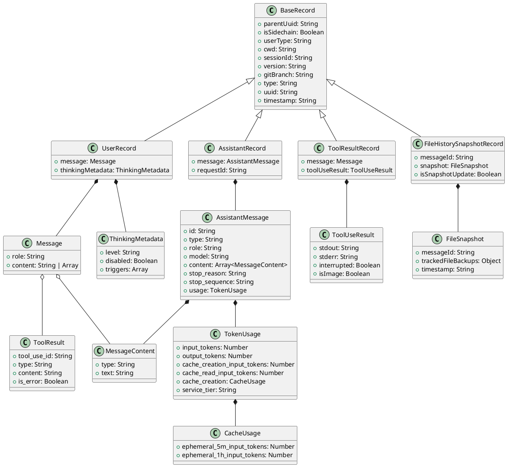

# JSONL Session Schema

This document describes the schema of Claude Code session JSONL files, which record all interactions within a Claude Code session.

## Overview

Claude Code sessions are stored as JSONL (JSON Lines) files where each line represents a complete JSON record. These files capture the complete conversation history, including user messages, assistant responses, tool usage, and file system state changes.

## Base Record Structure

Every record in the JSONL file shares these common fields:

| Field | Type | Description |
|-------|------|-------------|
| `parentUuid` | string | UUID of the parent record (null for first record) |
| `isSidechain` | boolean | Whether this is a sidechain record (usually false) |
| `userType` | string | User type (typically "external") |
| `cwd` | string | Current working directory |
| `sessionId` | string | Unique session identifier |
| `version` | string | Claude Code version |
| `gitBranch` | string | Git branch name |
| `type` | string | Record type: "user", "assistant", "file-history-snapshot" |
| `uuid` | string | Unique record identifier |
| `timestamp` | string | ISO 8601 timestamp |

## Record Types

### 1. User Message Records

**Type**: `"user"`

```json
{
  "parentUuid": null,
  "isSidechain": false,
  "userType": "external",
  "cwd": "/home/yale/work/meta-cc",
  "sessionId": "687796fe-f000-442e-9927-037254b7f28a",
  "version": "2.0.1",
  "gitBranch": "develop",
  "type": "user",
  "message": {
    "role": "user",
    "content": "User message content"
  },
  "uuid": "b8a04fc8-5fb6-460a-98cd-b1bd604aea4a",
  "timestamp": "2025-10-02T05:58:22.167Z",
  "thinkingMetadata": {
    "level": "none",
    "disabled": true,
    "triggers": []
  }
}
```

**Additional Fields**:
- `message.role`: Always "user"
- `message.content`: String content or array of tool results
- `thinkingMetadata`: Thinking mode configuration

### 2. Assistant Message Records

**Type**: `"assistant"`

```json
{
  "parentUuid": "b8a04fc8-5fb6-460a-98cd-b1bd604aea4a",
  "isSidechain": false,
  "userType": "external",
  "cwd": "/home/yale/work/meta-cc",
  "sessionId": "687796fe-f000-442e-9927-037254b7f28a",
  "version": "2.0.1",
  "gitBranch": "develop",
  "message": {
    "id": "msg_013caGGXZBGyhRJJ6Bp3ok6B",
    "type": "message",
    "role": "assistant",
    "model": "claude-sonnet-4-5-20250929",
    "content": [
      {
        "type": "text",
        "text": "Assistant response content"
      }
    ],
    "usage": {
      "input_tokens": 4,
      "output_tokens": 1,
      "cache_creation_input_tokens": 48096,
      "cache_read_input_tokens": 0,
      "cache_creation": {
        "ephemeral_5m_input_tokens": 48096,
        "ephemeral_1h_input_tokens": 0
      },
      "service_tier": "standard"
    }
  },
  "requestId": "req_011CThrmtnnHjWQAGhKr9mQe",
  "type": "assistant",
  "uuid": "45c5c637-4a94-4300-9ad2-3ec49f7aba2c",
  "timestamp": "2025-10-02T05:58:27.447Z"
}
```

**Additional Fields**:
- `message.id`: Message ID from the API
- `message.model`: Model name used
- `message.content`: Array of content blocks (text, tool_use, etc.)
- `message.usage`: Token usage statistics
- `requestId`: API request identifier

### 3. Tool Result Records

**Type**: `"user"` (with tool results)

```json
{
  "parentUuid": "7d71c43c-9ff6-4fb1-9342-295dc13e3bc0",
  "isSidechain": false,
  "userType": "external",
  "cwd": "/home/yale/work/meta-cc",
  "sessionId": "687796fe-f000-442e-9927-037254b7f28a",
  "version": "2.0.1",
  "gitBranch": "develop",
  "type": "user",
  "message": {
    "role": "user",
    "content": [
      {
        "tool_use_id": "toolu_01Km1BvSCFuf4FQdbXf6Wp6i",
        "type": "tool_result",
        "content": "Tool output content",
        "is_error": false
      }
    ]
  },
  "uuid": "8fa82366-1234-43fb-926a-6ce3fb141961",
  "timestamp": "2025-10-02T05:58:30.083Z",
  "toolUseResult": {
    "stdout": "Standard output content",
    "stderr": "Standard error content",
    "interrupted": false,
    "isImage": false
  }
}
```

**Additional Fields**:
- `message.content`: Array containing tool results
- `toolUseResult`: Detailed tool execution results

### 4. File History Snapshot Records

**Type**: `"file-history-snapshot"`

```json
{
  "type": "file-history-snapshot",
  "messageId": "b8a04fc8-5fb6-460a-98cd-b1bd604aea4a",
  "snapshot": {
    "messageId": "b8a04fc8-5fb6-460a-98cd-b1bd604aea4a",
    "trackedFileBackups": {},
    "timestamp": "2025-10-02T05:58:22.189Z"
  },
  "isSnapshotUpdate": false
}
```

**Fields**:
- `messageId`: Associated message ID
- `snapshot`: File system state snapshot
- `isSnapshotUpdate`: Whether this is an update to existing snapshot

## Content Structures

### Message Content Types

**Text Content**:
```json
{
  "type": "text",
  "text": "Text content"
}
```

**Tool Use Content**:
```json
{
  "type": "tool_use",
  "id": "toolu_01QL9uH1fAXCQjkdZRJuD5CE",
  "name": "Bash",
  "input": {
    "command": "find . -type f -name \"*.md\" | head -20",
    "description": "Find markdown files"
  }
}
```

**Tool Result Content**:
```json
{
  "tool_use_id": "toolu_01Km1BvSCFuf4FQdbXf6Wp6i",
  "type": "tool_result",
  "content": "Tool output",
  "is_error": false
}
```

### Token Usage Structure

```json
{
  "input_tokens": 4,
  "output_tokens": 1,
  "cache_creation_input_tokens": 48096,
  "cache_read_input_tokens": 0,
  "cache_creation": {
    "ephemeral_5m_input_tokens": 48096,
    "ephemeral_1h_input_tokens": 0
  },
  "service_tier": "standard"
}
```

## PlantUML Class Diagram



## File Location

Session JSONL files are stored in:
```
/home/yale/.claude/projects/-home-yale-work-meta-cc/
└── {session-id}.jsonl
```

Each session has its own JSONL file named with the session UUID.

## Usage with meta-cc

The meta-cc tool processes these JSONL files to provide insights about Claude Code usage patterns, tool effectiveness, and session analytics. Use the MCP `query` tool to analyze session data:

```javascript
query({
  resource: "messages",
  filter: {role: "user"}
})
```

## Related Documentation

- [JSONL Reference](jsonl.md) - Output format and jq patterns
- [MCP Guide](../guides/mcp.md) - MCP server usage for querying session data
- [CLI Reference](cli.md) - Command-line interface for session analysis
