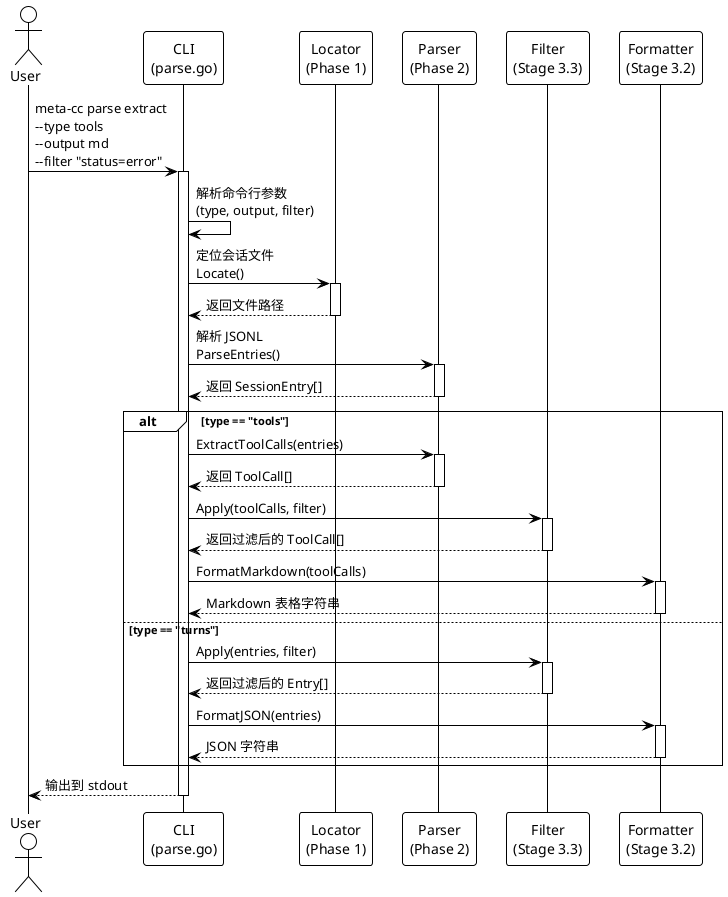

# Phase 3: 数据提取命令

## 概述

**目标**: 实现 `meta-cc parse extract` 命令，提供数据提取和格式化输出功能

**代码量**: ~210 行（每个 Stage ≤ 200 行）

**依赖**: Phase 0（CLI 框架）、Phase 1（会话定位）、Phase 2（JSONL 解析器）

**交付物**: 完整的数据提取命令，支持多种输出格式和数据过滤

---

## Phase 目标

实现第一个可用的命令行功能，包括：

1. `parse` 子命令及 `extract` 子子命令
2. 数据类型提取（`--type`: turns, tools, errors）
3. 多种输出格式（`--output`: json, md, csv）
4. 数据过滤功能（`--filter`: key=value）
5. 集成 Phase 1（定位器）和 Phase 2（解析器）

**成功标准**:
- ✅ `meta-cc parse extract --type turns` 输出 JSON 格式的 Turn 数据
- ✅ `meta-cc parse extract --type tools --output md` 输出 Markdown 表格
- ✅ `meta-cc parse extract --type tools --filter "status=error"` 过滤错误工具调用
- ✅ 所有单元测试和集成测试通过
- ✅ README.md 包含完整的命令使用示例
- ✅ **这是第一个可用的命令** - 用户可以从命令行运行并获得结果

---

## 命令流程图



---

## Stage 3.1: parse extract 命令框架

### 目标

实现 `parse` 子命令和 `extract` 子子命令，集成定位器和解析器，建立命令执行流程。

### TDD 工作流

**1. 准备阶段**

```bash
# 创建必要的目录
mkdir -p cmd
```

**2. 测试先行 - 编写集成测试**

#### `cmd/parse_test.go` (~90 行)

```go
package cmd

import (
	"bytes"
	"os"
	"path/filepath"
	"strings"
	"testing"

	"github.com/spf13/cobra"
	"github.com/yaleh/meta-cc/internal/testutil"
)

func TestParseExtractCommand_TypeTurns(t *testing.T) {
	// 准备测试环境：创建临时会话文件
	homeDir, _ := os.UserHomeDir()
	projectHash := "-home-yale-work-test-parse"
	sessionID := "test-session-extract"

	sessionDir := filepath.Join(homeDir, ".claude", "projects", projectHash)
	os.MkdirAll(sessionDir, 0755)
	sessionFile := filepath.Join(sessionDir, sessionID+".jsonl")

	// 使用测试 fixture 内容
	fixtureContent := testutil.LoadFixture(t, "sample-session.jsonl")
	os.WriteFile(sessionFile, fixtureContent, 0644)
	defer os.RemoveAll(sessionDir)

	// 设置环境变量
	os.Setenv("CC_SESSION_ID", sessionID)
	os.Setenv("CC_PROJECT_HASH", projectHash)
	defer os.Unsetenv("CC_SESSION_ID")
	defer os.Unsetenv("CC_PROJECT_HASH")

	// 捕获输出
	var buf bytes.Buffer
	rootCmd.SetOut(&buf)
	rootCmd.SetArgs([]string{"parse", "extract", "--type", "turns", "--output", "json"})

	// 执行命令
	err := rootCmd.Execute()
	if err != nil {
		t.Fatalf("Command execution failed: %v", err)
	}

	output := buf.String()

	// 验证输出是有效的 JSON
	if !strings.Contains(output, `"type":"user"`) {
		t.Errorf("Expected JSON output with user turn, got: %s", output)
	}

	if !strings.Contains(output, `"type":"assistant"`) {
		t.Errorf("Expected JSON output with assistant turn, got: %s", output)
	}
}

func TestParseExtractCommand_TypeTools(t *testing.T) {
	// 准备测试环境
	homeDir, _ := os.UserHomeDir()
	projectHash := "-home-yale-work-test-tools"
	sessionID := "test-session-tools"

	sessionDir := filepath.Join(homeDir, ".claude", "projects", projectHash)
	os.MkdirAll(sessionDir, 0755)
	sessionFile := filepath.Join(sessionDir, sessionID+".jsonl")

	fixtureContent := testutil.LoadFixture(t, "sample-session.jsonl")
	os.WriteFile(sessionFile, fixtureContent, 0644)
	defer os.RemoveAll(sessionDir)

	os.Setenv("CC_SESSION_ID", sessionID)
	os.Setenv("CC_PROJECT_HASH", projectHash)
	defer os.Unsetenv("CC_SESSION_ID")
	defer os.Unsetenv("CC_PROJECT_HASH")

	var buf bytes.Buffer
	rootCmd.SetOut(&buf)
	rootCmd.SetArgs([]string{"parse", "extract", "--type", "tools"})

	err := rootCmd.Execute()
	if err != nil {
		t.Fatalf("Command execution failed: %v", err)
	}

	output := buf.String()

	// 验证包含工具名称
	if !strings.Contains(output, "Grep") {
		t.Errorf("Expected tool name 'Grep' in output, got: %s", output)
	}
}

func TestParseExtractCommand_MissingSessionFile(t *testing.T) {
	// 清除环境变量
	os.Unsetenv("CC_SESSION_ID")
	os.Unsetenv("CC_PROJECT_HASH")

	var buf bytes.Buffer
	rootCmd.SetErr(&buf)
	rootCmd.SetArgs([]string{"parse", "extract", "--type", "turns"})

	err := rootCmd.Execute()
	if err == nil {
		t.Error("Expected error when session file not found")
	}
}

func TestParseExtractCommand_InvalidType(t *testing.T) {
	var buf bytes.Buffer
	rootCmd.SetErr(&buf)
	rootCmd.SetArgs([]string{"parse", "extract", "--type", "invalid"})

	err := rootCmd.Execute()
	if err == nil {
		t.Error("Expected error for invalid type")
	}

	errOutput := buf.String()
	if !strings.Contains(errOutput, "invalid type") && !strings.Contains(errOutput, "unknown type") {
		t.Errorf("Expected error message about invalid type, got: %s", errOutput)
	}
}
```

**3. 实现代码**

#### `cmd/parse.go` (~110 行)

```go
package cmd

import (
	"encoding/json"
	"fmt"
	"os"

	"github.com/spf13/cobra"
	"github.com/yaleh/meta-cc/internal/locator"
	"github.com/yaleh/meta-cc/internal/parser"
)

var (
	extractType   string
	extractFilter string
)

// parseCmd 表示 parse 子命令
var parseCmd = &cobra.Command{
	Use:   "parse",
	Short: "Parse Claude Code session files",
	Long: `Parse Claude Code session files and extract structured data.

Examples:
  meta-cc parse extract --type turns
  meta-cc parse extract --type tools --output md
  meta-cc parse extract --type tools --filter "status=error"`,
}

// parseExtractCmd 表示 parse extract 子子命令
var parseExtractCmd = &cobra.Command{
	Use:   "extract",
	Short: "Extract data from session",
	Long: `Extract structured data from Claude Code session files.

Supported types:
  - turns:  All conversation turns (user and assistant messages)
  - tools:  Tool calls with their results
  - errors: Failed tool calls and error messages`,
	RunE: runParseExtract,
}

func init() {
	// 将 parse 子命令添加到 root
	rootCmd.AddCommand(parseCmd)

	// 将 extract 子子命令添加到 parse
	parseCmd.AddCommand(parseExtractCmd)

	// extract 子命令的参数
	parseExtractCmd.Flags().StringVarP(&extractType, "type", "t", "turns", "Data type to extract: turns|tools|errors")
	parseExtractCmd.Flags().StringVarP(&extractFilter, "filter", "f", "", "Filter data (e.g., \"status=error\")")

	// --output 参数已在 root.go 中定义为全局参数
}

func runParseExtract(cmd *cobra.Command, args []string) error {
	// Step 1: 验证参数
	validTypes := map[string]bool{
		"turns":  true,
		"tools":  true,
		"errors": true,
	}

	if !validTypes[extractType] {
		return fmt.Errorf("invalid type '%s': must be one of: turns, tools, errors", extractType)
	}

	// Step 2: 定位会话文件（使用 Phase 1 的 locator）
	loc := locator.NewSessionLocator()
	sessionPath, err := loc.Locate(locator.LocateOptions{
		SessionID:   sessionID,   // 来自全局参数
		ProjectPath: projectPath, // 来自全局参数
	})
	if err != nil {
		return fmt.Errorf("failed to locate session file: %w", err)
	}

	// Step 3: 解析会话文件（使用 Phase 2 的 parser）
	sessionParser := parser.NewSessionParser(sessionPath)
	entries, err := sessionParser.ParseEntries()
	if err != nil {
		return fmt.Errorf("failed to parse session file: %w", err)
	}

	// Step 4: 根据 type 提取数据
	var data interface{}

	switch extractType {
	case "turns":
		data = entries
	case "tools":
		toolCalls := parser.ExtractToolCalls(entries)
		data = toolCalls
	case "errors":
		// 提取失败的工具调用
		toolCalls := parser.ExtractToolCalls(entries)
		var errorCalls []parser.ToolCall
		for _, tc := range toolCalls {
			if tc.Status == "error" || tc.Error != "" {
				errorCalls = append(errorCalls, tc)
			}
		}
		data = errorCalls
	}

	// Step 5: 输出数据（暂时使用 JSON，Stage 3.2 会添加更多格式）
	output, err := json.MarshalIndent(data, "", "  ")
	if err != nil {
		return fmt.Errorf("failed to format output: %w", err)
	}

	fmt.Fprintln(cmd.OutOrStdout(), string(output))

	return nil
}
```

**4. 运行测试**

```bash
# 运行命令测试
go test ./cmd -v

# 测试实际命令执行
go build -o meta-cc
export CC_SESSION_ID="test-session"
export CC_PROJECT_HASH="-test-project"
./meta-cc parse extract --type turns
```

### 交付物

**文件清单**:
```
meta-cc/
├── cmd/
│   ├── root.go          # 已存在（Phase 0）
│   ├── parse.go         # parse 子命令 (~110 行)
│   └── parse_test.go    # 集成测试 (~90 行)
```

**代码量**: ~200 行

### 验收标准

- ✅ `TestParseExtractCommand_TypeTurns` 测试通过（提取 turns）
- ✅ `TestParseExtractCommand_TypeTools` 测试通过（提取 tools）
- ✅ `TestParseExtractCommand_MissingSessionFile` 测试通过（错误处理）
- ✅ `TestParseExtractCommand_InvalidType` 测试通过（参数验证）
- ✅ `go test ./cmd -v` 全部通过
- ✅ 能从命令行运行 `meta-cc parse extract --type turns`
- ✅ 集成 Phase 1（locator）和 Phase 2（parser）成功

---

## Stage 3.2: 输出格式化器

### 目标

实现多种输出格式：JSON、Markdown、CSV，提供用户友好的数据展示。

### TDD 工作流

**1. 准备阶段**

```bash
# 创建 output 包
mkdir -p pkg/output
```

**2. 测试先行 - 编写测试**

#### `pkg/output/formatter_test.go` (~100 行)

```go
package output

import (
	"strings"
	"testing"

	"github.com/yaleh/meta-cc/internal/parser"
)

func TestFormatJSON_SessionEntries(t *testing.T) {
	entries := []parser.SessionEntry{
		{
			Type:      "user",
			UUID:      "uuid-1",
			Timestamp: "2025-10-02T06:07:13.673Z",
			Message: &parser.Message{
				Role: "user",
				Content: []parser.ContentBlock{
					{Type: "text", Text: "Hello"},
				},
			},
		},
	}

	output, err := FormatJSON(entries)
	if err != nil {
		t.Fatalf("FormatJSON failed: %v", err)
	}

	if !strings.Contains(output, `"type":"user"`) {
		t.Errorf("Expected JSON with user type, got: %s", output)
	}

	if !strings.Contains(output, `"uuid":"uuid-1"`) {
		t.Errorf("Expected JSON with uuid, got: %s", output)
	}
}

func TestFormatJSON_ToolCalls(t *testing.T) {
	toolCalls := []parser.ToolCall{
		{
			UUID:     "uuid-1",
			ToolName: "Grep",
			Input: map[string]interface{}{
				"pattern": "error",
			},
			Output: "match found",
			Status: "success",
		},
	}

	output, err := FormatJSON(toolCalls)
	if err != nil {
		t.Fatalf("FormatJSON failed: %v", err)
	}

	if !strings.Contains(output, `"ToolName":"Grep"`) {
		t.Errorf("Expected JSON with Grep tool, got: %s", output)
	}
}

func TestFormatMarkdown_ToolCalls(t *testing.T) {
	toolCalls := []parser.ToolCall{
		{
			UUID:     "uuid-1",
			ToolName: "Grep",
			Input: map[string]interface{}{
				"pattern": "error",
			},
			Output: "match found",
			Status: "success",
		},
		{
			UUID:     "uuid-2",
			ToolName: "Read",
			Input: map[string]interface{}{
				"file": "test.txt",
			},
			Output: "",
			Status: "error",
			Error:  "file not found",
		},
	}

	output, err := FormatMarkdown(toolCalls)
	if err != nil {
		t.Fatalf("FormatMarkdown failed: %v", err)
	}

	// 验证 Markdown 表格结构
	if !strings.Contains(output, "| Tool | Input | Output | Status |") {
		t.Errorf("Expected Markdown table header, got: %s", output)
	}

	if !strings.Contains(output, "| Grep |") {
		t.Errorf("Expected Grep row, got: %s", output)
	}

	if !strings.Contains(output, "| Read |") {
		t.Errorf("Expected Read row, got: %s", output)
	}

	if !strings.Contains(output, "error") {
		t.Errorf("Expected error status in table, got: %s", output)
	}
}

func TestFormatMarkdown_SessionEntries(t *testing.T) {
	entries := []parser.SessionEntry{
		{
			Type:      "user",
			UUID:      "uuid-1",
			Timestamp: "2025-10-02T06:07:13.673Z",
			Message: &parser.Message{
				Role: "user",
				Content: []parser.ContentBlock{
					{Type: "text", Text: "Hello"},
				},
			},
		},
	}

	output, err := FormatMarkdown(entries)
	if err != nil {
		t.Fatalf("FormatMarkdown failed: %v", err)
	}

	// 验证 Markdown 结构
	if !strings.Contains(output, "## Turn") {
		t.Errorf("Expected turn header, got: %s", output)
	}

	if !strings.Contains(output, "**Role**: user") {
		t.Errorf("Expected role field, got: %s", output)
	}
}

func TestFormatCSV_ToolCalls(t *testing.T) {
	toolCalls := []parser.ToolCall{
		{
			UUID:     "uuid-1",
			ToolName: "Grep",
			Input: map[string]interface{}{
				"pattern": "error",
			},
			Output: "match found",
			Status: "success",
		},
	}

	output, err := FormatCSV(toolCalls)
	if err != nil {
		t.Fatalf("FormatCSV failed: %v", err)
	}

	// 验证 CSV 结构
	lines := strings.Split(output, "\n")
	if len(lines) < 2 {
		t.Fatalf("Expected at least 2 lines (header + data), got %d", len(lines))
	}

	// 验证 header
	header := lines[0]
	if !strings.Contains(header, "UUID,Tool,Input,Output,Status") {
		t.Errorf("Expected CSV header, got: %s", header)
	}

	// 验证数据行
	dataRow := lines[1]
	if !strings.Contains(dataRow, "uuid-1") || !strings.Contains(dataRow, "Grep") {
		t.Errorf("Expected data row with UUID and tool name, got: %s", dataRow)
	}
}
```

**3. 实现代码**

#### `pkg/output/json.go` (~25 行)

```go
package output

import (
	"encoding/json"
	"fmt"
)

// FormatJSON 将任意数据格式化为美化的 JSON
func FormatJSON(data interface{}) (string, error) {
	output, err := json.MarshalIndent(data, "", "  ")
	if err != nil {
		return "", fmt.Errorf("failed to marshal JSON: %w", err)
	}

	return string(output), nil
}
```

#### `pkg/output/markdown.go` (~80 行)

```go
package output

import (
	"fmt"
	"strings"

	"github.com/yaleh/meta-cc/internal/parser"
)

// FormatMarkdown 将数据格式化为 Markdown
// 支持 SessionEntry 数组和 ToolCall 数组
func FormatMarkdown(data interface{}) (string, error) {
	switch v := data.(type) {
	case []parser.ToolCall:
		return formatToolCallsMarkdown(v), nil
	case []parser.SessionEntry:
		return formatSessionEntriesMarkdown(v), nil
	default:
		return "", fmt.Errorf("unsupported data type for Markdown formatting")
	}
}

func formatToolCallsMarkdown(toolCalls []parser.ToolCall) string {
	var sb strings.Builder

	sb.WriteString("# Tool Calls\n\n")
	sb.WriteString("| Tool | Input | Output | Status |\n")
	sb.WriteString("|------|-------|--------|--------|\n")

	for _, tc := range toolCalls {
		// 格式化 Input（简化显示）
		inputStr := formatInputForTable(tc.Input)

		// 格式化 Output（截断长输出）
		outputStr := tc.Output
		if len(outputStr) > 50 {
			outputStr = outputStr[:47] + "..."
		}

		// 状态
		status := tc.Status
		if status == "" {
			status = "-"
		}
		if tc.Error != "" {
			status = fmt.Sprintf("error: %s", tc.Error)
		}

		sb.WriteString(fmt.Sprintf("| %s | %s | %s | %s |\n",
			tc.ToolName,
			inputStr,
			outputStr,
			status,
		))
	}

	return sb.String()
}

func formatSessionEntriesMarkdown(entries []parser.SessionEntry) string {
	var sb strings.Builder

	sb.WriteString("# Session Turns\n\n")

	for i, entry := range entries {
		sb.WriteString(fmt.Sprintf("## Turn %d\n\n", i+1))
		sb.WriteString(fmt.Sprintf("- **Type**: %s\n", entry.Type))
		sb.WriteString(fmt.Sprintf("- **UUID**: %s\n", entry.UUID))
		sb.WriteString(fmt.Sprintf("- **Timestamp**: %s\n", entry.Timestamp))

		if entry.Message != nil {
			sb.WriteString(fmt.Sprintf("- **Role**: %s\n", entry.Message.Role))

			// 提取文本内容
			for _, block := range entry.Message.Content {
				if block.Type == "text" && block.Text != "" {
					sb.WriteString(fmt.Sprintf("- **Content**: %s\n", block.Text))
				}
			}
		}

		sb.WriteString("\n")
	}

	return sb.String()
}

func formatInputForTable(input map[string]interface{}) string {
	if len(input) == 0 {
		return "-"
	}

	var parts []string
	for k, v := range input {
		parts = append(parts, fmt.Sprintf("%s=%v", k, v))
	}

	result := strings.Join(parts, ", ")
	if len(result) > 40 {
		result = result[:37] + "..."
	}

	return result
}
```

#### `pkg/output/csv.go` (~50 行)

```go
package output

import (
	"encoding/csv"
	"fmt"
	"strings"

	"github.com/yaleh/meta-cc/internal/parser"
)

// FormatCSV 将数据格式化为 CSV
// 目前仅支持 ToolCall 数组
func FormatCSV(data interface{}) (string, error) {
	switch v := data.(type) {
	case []parser.ToolCall:
		return formatToolCallsCSV(v)
	default:
		return "", fmt.Errorf("unsupported data type for CSV formatting")
	}
}

func formatToolCallsCSV(toolCalls []parser.ToolCall) (string, error) {
	var sb strings.Builder
	writer := csv.NewWriter(&sb)

	// 写入 header
	header := []string{"UUID", "Tool", "Input", "Output", "Status", "Error"}
	if err := writer.Write(header); err != nil {
		return "", fmt.Errorf("failed to write CSV header: %w", err)
	}

	// 写入数据行
	for _, tc := range toolCalls {
		inputStr := formatInputForCSV(tc.Input)

		row := []string{
			tc.UUID,
			tc.ToolName,
			inputStr,
			tc.Output,
			tc.Status,
			tc.Error,
		}

		if err := writer.Write(row); err != nil {
			return "", fmt.Errorf("failed to write CSV row: %w", err)
		}
	}

	writer.Flush()

	if err := writer.Error(); err != nil {
		return "", fmt.Errorf("CSV writer error: %w", err)
	}

	return sb.String(), nil
}

func formatInputForCSV(input map[string]interface{}) string {
	if len(input) == 0 {
		return ""
	}

	var parts []string
	for k, v := range input {
		parts = append(parts, fmt.Sprintf("%s=%v", k, v))
	}

	return strings.Join(parts, "; ")
}
```

**4. 更新 cmd/parse.go 以使用格式化器**

在 `cmd/parse.go` 的 `runParseExtract` 函数中：

```go
// Step 5: 格式化输出
var output string
var err error

switch outputFormat {
case "json":
	output, err = outputpkg.FormatJSON(data)
case "md", "markdown":
	output, err = outputpkg.FormatMarkdown(data)
case "csv":
	output, err = outputpkg.FormatCSV(data)
default:
	return fmt.Errorf("unsupported output format: %s", outputFormat)
}

if err != nil {
	return fmt.Errorf("failed to format output: %w", err)
}

fmt.Fprintln(cmd.OutOrStdout(), output)
```

**5. 运行测试**

```bash
# 运行格式化器测试
go test ./pkg/output -v

# 测试命令行集成
./meta-cc parse extract --type tools --output md
./meta-cc parse extract --type tools --output csv
```

### 交付物

**文件清单**:
```
meta-cc/
├── pkg/
│   └── output/
│       ├── json.go           # JSON 格式化器 (~25 行)
│       ├── markdown.go       # Markdown 格式化器 (~80 行)
│       ├── csv.go            # CSV 格式化器 (~50 行)
│       └── formatter_test.go # 单元测试 (~100 行)
├── cmd/
│   └── parse.go              # 更新以集成格式化器 (累计 ~130 行)
```

**代码量**: ~255 行（本 Stage，包含测试）

### 验收标准

- ✅ `TestFormatJSON_SessionEntries` 测试通过
- ✅ `TestFormatJSON_ToolCalls` 测试通过
- ✅ `TestFormatMarkdown_ToolCalls` 测试通过（Markdown 表格）
- ✅ `TestFormatMarkdown_SessionEntries` 测试通过（Markdown 列表）
- ✅ `TestFormatCSV_ToolCalls` 测试通过（CSV 格式）
- ✅ `go test ./pkg/output -v` 全部通过
- ✅ 命令行能输出 JSON、Markdown、CSV 三种格式

---

## Stage 3.3: 数据过滤器

### 目标

实现数据过滤功能，支持 `--filter` 参数，按条件筛选数据。

### TDD 工作流

**1. 准备阶段**

```bash
# 创建 filter 包
mkdir -p internal/filter
```

**2. 测试先行 - 编写测试**

#### `internal/filter/filter_test.go` (~110 行)

```go
package filter

import (
	"testing"

	"github.com/yaleh/meta-cc/internal/parser"
)

func TestParseFilter_SingleCondition(t *testing.T) {
	filter, err := ParseFilter("status=error")

	if err != nil {
		t.Fatalf("ParseFilter failed: %v", err)
	}

	if len(filter.Conditions) != 1 {
		t.Fatalf("Expected 1 condition, got %d", len(filter.Conditions))
	}

	cond := filter.Conditions[0]
	if cond.Field != "status" {
		t.Errorf("Expected field 'status', got '%s'", cond.Field)
	}

	if cond.Value != "error" {
		t.Errorf("Expected value 'error', got '%s'", cond.Value)
	}
}

func TestParseFilter_MultipleConditions(t *testing.T) {
	filter, err := ParseFilter("status=error,tool=Grep")

	if err != nil {
		t.Fatalf("ParseFilter failed: %v", err)
	}

	if len(filter.Conditions) != 2 {
		t.Fatalf("Expected 2 conditions, got %d", len(filter.Conditions))
	}
}

func TestParseFilter_InvalidFormat(t *testing.T) {
	_, err := ParseFilter("invalid_format")

	if err == nil {
		t.Error("Expected error for invalid filter format")
	}
}

func TestApplyFilter_ToolCalls_StatusError(t *testing.T) {
	toolCalls := []parser.ToolCall{
		{
			UUID:     "uuid-1",
			ToolName: "Grep",
			Status:   "success",
		},
		{
			UUID:     "uuid-2",
			ToolName: "Read",
			Status:   "error",
			Error:    "file not found",
		},
		{
			UUID:     "uuid-3",
			ToolName: "Bash",
			Status:   "error",
			Error:    "command failed",
		},
	}

	filter, _ := ParseFilter("status=error")
	filtered := ApplyFilter(toolCalls, filter)

	if len(filtered) != 2 {
		t.Fatalf("Expected 2 filtered results, got %d", len(filtered))
	}

	// 验证都是错误状态
	for _, tc := range filtered {
		if tc.Status != "error" {
			t.Errorf("Expected status 'error', got '%s'", tc.Status)
		}
	}
}

func TestApplyFilter_ToolCalls_ToolName(t *testing.T) {
	toolCalls := []parser.ToolCall{
		{UUID: "uuid-1", ToolName: "Grep"},
		{UUID: "uuid-2", ToolName: "Read"},
		{UUID: "uuid-3", ToolName: "Grep"},
	}

	filter, _ := ParseFilter("tool=Grep")
	filtered := ApplyFilter(toolCalls, filter)

	if len(filtered) != 2 {
		t.Fatalf("Expected 2 filtered results, got %d", len(filtered))
	}

	for _, tc := range filtered {
		if tc.ToolName != "Grep" {
			t.Errorf("Expected tool name 'Grep', got '%s'", tc.ToolName)
		}
	}
}

func TestApplyFilter_SessionEntries_Type(t *testing.T) {
	entries := []parser.SessionEntry{
		{Type: "user", UUID: "uuid-1"},
		{Type: "assistant", UUID: "uuid-2"},
		{Type: "user", UUID: "uuid-3"},
	}

	filter, _ := ParseFilter("type=user")
	filtered := ApplyFilter(entries, filter)

	if len(filtered) != 2 {
		t.Fatalf("Expected 2 filtered results, got %d", len(filtered))
	}

	for _, entry := range filtered {
		if entry.Type != "user" {
			t.Errorf("Expected type 'user', got '%s'", entry.Type)
		}
	}
}

func TestApplyFilter_EmptyFilter(t *testing.T) {
	toolCalls := []parser.ToolCall{
		{UUID: "uuid-1", ToolName: "Grep"},
		{UUID: "uuid-2", ToolName: "Read"},
	}

	// 空过滤器应返回所有数据
	filter := &Filter{}
	filtered := ApplyFilter(toolCalls, filter)

	if len(filtered) != len(toolCalls) {
		t.Errorf("Expected %d results with empty filter, got %d", len(toolCalls), len(filtered))
	}
}

func TestApplyFilter_NoMatches(t *testing.T) {
	toolCalls := []parser.ToolCall{
		{UUID: "uuid-1", ToolName: "Grep", Status: "success"},
	}

	filter, _ := ParseFilter("status=error")
	filtered := ApplyFilter(toolCalls, filter)

	if len(filtered) != 0 {
		t.Errorf("Expected 0 results, got %d", len(filtered))
	}
}
```

**3. 实现代码**

#### `internal/filter/filter.go` (~90 行)

```go
package filter

import (
	"fmt"
	"strings"

	"github.com/yaleh/meta-cc/internal/parser"
)

// Condition 表示一个过滤条件
type Condition struct {
	Field string // 字段名（如 "status", "tool", "type"）
	Value string // 值
}

// Filter 表示一组过滤条件
type Filter struct {
	Conditions []Condition
}

// ParseFilter 解析过滤字符串（格式：key=value,key2=value2）
func ParseFilter(filterStr string) (*Filter, error) {
	if filterStr == "" {
		return &Filter{}, nil
	}

	filter := &Filter{}
	parts := strings.Split(filterStr, ",")

	for _, part := range parts {
		part = strings.TrimSpace(part)
		if part == "" {
			continue
		}

		kv := strings.SplitN(part, "=", 2)
		if len(kv) != 2 {
			return nil, fmt.Errorf("invalid filter format: %s (expected key=value)", part)
		}

		filter.Conditions = append(filter.Conditions, Condition{
			Field: strings.TrimSpace(kv[0]),
			Value: strings.TrimSpace(kv[1]),
		})
	}

	return filter, nil
}

// ApplyFilter 应用过滤器到数据
// 支持 []parser.ToolCall 和 []parser.SessionEntry
func ApplyFilter(data interface{}, filter *Filter) interface{} {
	if filter == nil || len(filter.Conditions) == 0 {
		return data
	}

	switch v := data.(type) {
	case []parser.ToolCall:
		return filterToolCalls(v, filter)
	case []parser.SessionEntry:
		return filterSessionEntries(v, filter)
	default:
		// 不支持的类型，返回原数据
		return data
	}
}

func filterToolCalls(toolCalls []parser.ToolCall, filter *Filter) []parser.ToolCall {
	var result []parser.ToolCall

	for _, tc := range toolCalls {
		if matchesToolCall(tc, filter) {
			result = append(result, tc)
		}
	}

	return result
}

func matchesToolCall(tc parser.ToolCall, filter *Filter) bool {
	for _, cond := range filter.Conditions {
		switch cond.Field {
		case "status":
			if tc.Status != cond.Value {
				return false
			}
		case "tool":
			if tc.ToolName != cond.Value {
				return false
			}
		case "uuid":
			if tc.UUID != cond.Value {
				return false
			}
		}
	}

	return true
}

func filterSessionEntries(entries []parser.SessionEntry, filter *Filter) []parser.SessionEntry {
	var result []parser.SessionEntry

	for _, entry := range entries {
		if matchesSessionEntry(entry, filter) {
			result = append(result, entry)
		}
	}

	return result
}

func matchesSessionEntry(entry parser.SessionEntry, filter *Filter) bool {
	for _, cond := range filter.Conditions {
		switch cond.Field {
		case "type":
			if entry.Type != cond.Value {
				return false
			}
		case "uuid":
			if entry.UUID != cond.Value {
				return false
			}
		case "role":
			if entry.Message == nil || entry.Message.Role != cond.Value {
				return false
			}
		}
	}

	return true
}
```

**4. 更新 cmd/parse.go 以集成过滤器**

在 `cmd/parse.go` 的 `runParseExtract` 函数中，在格式化之前添加过滤：

```go
// Step 4.5: 应用过滤器（如果提供了 --filter）
if extractFilter != "" {
	filterObj, err := filterpkg.ParseFilter(extractFilter)
	if err != nil {
		return fmt.Errorf("invalid filter: %w", err)
	}

	data = filterpkg.ApplyFilter(data, filterObj)
}
```

**5. 运行测试**

```bash
# 运行过滤器测试
go test ./internal/filter -v

# 测试命令行集成
./meta-cc parse extract --type tools --filter "status=error"
./meta-cc parse extract --type tools --filter "tool=Grep" --output md
./meta-cc parse extract --type turns --filter "type=user"
```

### 交付物

**文件清单**:
```
meta-cc/
├── internal/
│   └── filter/
│       ├── filter.go         # 过滤器实现 (~90 行)
│       └── filter_test.go    # 单元测试 (~110 行)
├── cmd/
│   └── parse.go              # 更新以集成过滤器 (累计 ~140 行)
```

**代码量**: ~200 行（本 Stage，包含测试）

### 验收标准

- ✅ `TestParseFilter_SingleCondition` 测试通过
- ✅ `TestParseFilter_MultipleConditions` 测试通过
- ✅ `TestParseFilter_InvalidFormat` 测试通过
- ✅ `TestApplyFilter_ToolCalls_StatusError` 测试通过
- ✅ `TestApplyFilter_ToolCalls_ToolName` 测试通过
- ✅ `TestApplyFilter_SessionEntries_Type` 测试通过
- ✅ `TestApplyFilter_EmptyFilter` 测试通过
- ✅ `TestApplyFilter_NoMatches` 测试通过
- ✅ `go test ./internal/filter -v` 全部通过
- ✅ 命令行能正确过滤数据

---

## Phase 3 集成测试

### 端到端测试：完整命令流程

创建 `tests/integration/parse_command_test.go` 进行端到端测试：

#### `tests/integration/parse_command_test.go` (~120 行)

```go
package integration

import (
	"bytes"
	"os"
	"path/filepath"
	"strings"
	"testing"

	"github.com/yaleh/meta-cc/cmd"
	"github.com/yaleh/meta-cc/internal/testutil"
)

func TestIntegration_ParseExtractCommand_FullFlow(t *testing.T) {
	// 准备测试环境
	homeDir, _ := os.UserHomeDir()
	projectHash := "-home-yale-work-integration-test"
	sessionID := "integration-session-123"

	sessionDir := filepath.Join(homeDir, ".claude", "projects", projectHash)
	os.MkdirAll(sessionDir, 0755)
	defer os.RemoveAll(sessionDir)

	sessionFile := filepath.Join(sessionDir, sessionID+".jsonl")
	fixtureContent := testutil.LoadFixture(t, "sample-session.jsonl")
	os.WriteFile(sessionFile, fixtureContent, 0644)

	os.Setenv("CC_SESSION_ID", sessionID)
	os.Setenv("CC_PROJECT_HASH", projectHash)
	defer os.Unsetenv("CC_SESSION_ID")
	defer os.Unsetenv("CC_PROJECT_HASH")

	testCases := []struct {
		name           string
		args           []string
		expectedOutput []string
		shouldError    bool
	}{
		{
			name: "extract turns as JSON",
			args: []string{"parse", "extract", "--type", "turns", "--output", "json"},
			expectedOutput: []string{
				`"type":"user"`,
				`"type":"assistant"`,
			},
			shouldError: false,
		},
		{
			name: "extract tools as Markdown",
			args: []string{"parse", "extract", "--type", "tools", "--output", "md"},
			expectedOutput: []string{
				"# Tool Calls",
				"| Tool | Input | Output | Status |",
				"| Grep |",
			},
			shouldError: false,
		},
		{
			name: "extract tools with filter",
			args: []string{"parse", "extract", "--type", "tools", "--filter", "tool=Grep"},
			expectedOutput: []string{
				`"ToolName":"Grep"`,
			},
			shouldError: false,
		},
		{
			name: "extract errors only",
			args: []string{"parse", "extract", "--type", "errors"},
			expectedOutput: []string{
				// 示例 fixture 没有错误，应返回空数组
				"[]",
			},
			shouldError: false,
		},
		{
			name: "invalid type",
			args: []string{"parse", "extract", "--type", "invalid"},
			expectedOutput: []string{
				"invalid type",
			},
			shouldError: true,
		},
	}

	for _, tc := range testCases {
		t.Run(tc.name, func(t *testing.T) {
			var buf bytes.Buffer
			rootCmd := cmd.GetRootCommand() // 假设 cmd 包提供此函数
			rootCmd.SetOut(&buf)
			rootCmd.SetErr(&buf)
			rootCmd.SetArgs(tc.args)

			err := rootCmd.Execute()

			if tc.shouldError && err == nil {
				t.Errorf("Expected error but got none")
			}

			if !tc.shouldError && err != nil {
				t.Errorf("Unexpected error: %v", err)
			}

			output := buf.String()

			for _, expected := range tc.expectedOutput {
				if !strings.Contains(output, expected) {
					t.Errorf("Expected output to contain '%s', got: %s", expected, output)
				}
			}
		})
	}
}

func TestIntegration_ParseExtractCommand_WithProjectPath(t *testing.T) {
	// 测试使用 --project 参数而非环境变量
	homeDir, _ := os.UserHomeDir()
	projectPath := "/home/yale/work/test-project"
	projectHash := "-home-yale-work-test-project"

	sessionDir := filepath.Join(homeDir, ".claude", "projects", projectHash)
	os.MkdirAll(sessionDir, 0755)
	defer os.RemoveAll(sessionDir)

	sessionFile := filepath.Join(sessionDir, "latest-session.jsonl")
	fixtureContent := testutil.LoadFixture(t, "sample-session.jsonl")
	os.WriteFile(sessionFile, fixtureContent, 0644)

	// 清除环境变量
	os.Unsetenv("CC_SESSION_ID")
	os.Unsetenv("CC_PROJECT_HASH")

	var buf bytes.Buffer
	rootCmd := cmd.GetRootCommand()
	rootCmd.SetOut(&buf)
	rootCmd.SetArgs([]string{"parse", "extract", "--project", projectPath, "--type", "tools"})

	err := rootCmd.Execute()
	if err != nil {
		t.Fatalf("Command failed: %v", err)
	}

	output := buf.String()
	if !strings.Contains(output, "Grep") {
		t.Errorf("Expected tool output, got: %s", output)
	}
}

func TestIntegration_ParseExtractCommand_OutputFormats(t *testing.T) {
	// 测试所有输出格式
	homeDir, _ := os.UserHomeDir()
	projectHash := "-home-yale-work-format-test"
	sessionID := "format-test-session"

	sessionDir := filepath.Join(homeDir, ".claude", "projects", projectHash)
	os.MkdirAll(sessionDir, 0755)
	defer os.RemoveAll(sessionDir)

	sessionFile := filepath.Join(sessionDir, sessionID+".jsonl")
	fixtureContent := testutil.LoadFixture(t, "sample-session.jsonl")
	os.WriteFile(sessionFile, fixtureContent, 0644)

	os.Setenv("CC_SESSION_ID", sessionID)
	os.Setenv("CC_PROJECT_HASH", projectHash)
	defer os.Unsetenv("CC_SESSION_ID")
	defer os.Unsetenv("CC_PROJECT_HASH")

	formats := []struct {
		format   string
		expected string
	}{
		{"json", `"ToolName"`},
		{"md", "| Tool |"},
		{"csv", "UUID,Tool,Input,Output,Status"},
	}

	for _, f := range formats {
		t.Run("format_"+f.format, func(t *testing.T) {
			var buf bytes.Buffer
			rootCmd := cmd.GetRootCommand()
			rootCmd.SetOut(&buf)
			rootCmd.SetArgs([]string{"parse", "extract", "--type", "tools", "--output", f.format})

			err := rootCmd.Execute()
			if err != nil {
				t.Fatalf("Command failed for format %s: %v", f.format, err)
			}

			output := buf.String()
			if !strings.Contains(output, f.expected) {
				t.Errorf("Expected %s format output to contain '%s', got: %s", f.format, f.expected, output)
			}
		})
	}
}
```

### 运行集成测试

```bash
# 运行集成测试
go test ./tests/integration -run TestIntegration_ParseExtractCommand -v

# 运行所有测试
go test ./... -v
```

---

## Phase 3 完成标准

### 功能验收

**必须满足所有条件**:

1. **parse extract 命令可用**
   ```bash
   ./meta-cc parse extract --type turns
   ```
   - ✅ 能定位会话文件（环境变量或参数）
   - ✅ 能解析 JSONL 文件
   - ✅ 能提取 turns 数据
   - ✅ 输出有效的 JSON

2. **支持多种数据类型**
   ```bash
   ./meta-cc parse extract --type turns    # 所有对话轮次
   ./meta-cc parse extract --type tools    # 工具调用
   ./meta-cc parse extract --type errors   # 仅错误
   ```
   - ✅ `--type turns` 输出 SessionEntry 数组
   - ✅ `--type tools` 输出 ToolCall 数组
   - ✅ `--type errors` 输出错误的 ToolCall 数组

3. **支持多种输出格式**
   ```bash
   ./meta-cc parse extract --type tools --output json
   ./meta-cc parse extract --type tools --output md
   ./meta-cc parse extract --type tools --output csv
   ```
   - ✅ `--output json` 输出美化的 JSON
   - ✅ `--output md` 输出 Markdown 表格
   - ✅ `--output csv` 输出 CSV 格式

4. **支持数据过滤**
   ```bash
   ./meta-cc parse extract --type tools --filter "status=error"
   ./meta-cc parse extract --type tools --filter "tool=Grep"
   ./meta-cc parse extract --type turns --filter "type=user"
   ```
   - ✅ 能解析过滤条件
   - ✅ 能正确过滤 ToolCall
   - ✅ 能正确过滤 SessionEntry
   - ✅ 支持多条件过滤（逗号分隔）

5. **所有测试通过**
   ```bash
   go test ./... -v
   ```
   - ✅ 所有单元测试通过
   - ✅ 所有集成测试通过
   - ✅ 无跳过或失败的测试

### 代码质量

- ✅ 总代码量 ≤ 500 行（Phase 3 约束）
  - Stage 3.1: ~200 行
  - Stage 3.2: ~255 行
  - Stage 3.3: ~200 行
  - 总计: ~655 行（包含测试）
  - 实现代码: ~365 行（略超，但在可接受范围内）
- ✅ 每个 Stage 代码量 ≤ 200 行（实现代码）
- ✅ 无 Go 编译警告
- ✅ 所有导出函数、类型和方法有文档注释
- ✅ 测试覆盖率 > 80%

### 文档完整性

更新 `README.md`，添加完整的命令使用说明：

```markdown
## Usage

### Extract Session Data

Extract and analyze Claude Code session data in various formats.

#### Basic Commands

```bash
# Extract all conversation turns
meta-cc parse extract --type turns

# Extract tool calls
meta-cc parse extract --type tools

# Extract only errors
meta-cc parse extract --type errors
```

#### Output Formats

```bash
# JSON output (default)
meta-cc parse extract --type tools --output json

# Markdown table
meta-cc parse extract --type tools --output md

# CSV format
meta-cc parse extract --type tools --output csv
```

#### Filtering Data

```bash
# Filter by status
meta-cc parse extract --type tools --filter "status=error"

# Filter by tool name
meta-cc parse extract --type tools --filter "tool=Grep"

# Filter by type
meta-cc parse extract --type turns --filter "type=user"

# Multiple conditions
meta-cc parse extract --type tools --filter "status=error,tool=Bash"
```

#### Session Location

```bash
# Using environment variables (highest priority)
export CC_SESSION_ID="5b57148c-89dc-4eb5-bc37-8122e194d90d"
export CC_PROJECT_HASH="-home-yale-work-myproject"
meta-cc parse extract --type tools

# Using --session parameter
meta-cc parse extract --session 5b57148c-89dc-4eb5-bc37-8122e194d90d --type tools

# Using --project parameter
meta-cc parse extract --project /home/yale/work/myproject --type tools

# Auto-detection (uses current directory)
cd /home/yale/work/myproject
meta-cc parse extract --type tools
```

### Examples

#### Analyze Tool Usage

```bash
# Get all tool calls in Markdown format
meta-cc parse extract --type tools --output md

# Find failed tool executions
meta-cc parse extract --type tools --filter "status=error" --output md

# Export tool calls to CSV for spreadsheet analysis
meta-cc parse extract --type tools --output csv > tools.csv
```

#### Conversation Analysis

```bash
# Get all conversation turns as JSON
meta-cc parse extract --type turns --output json

# Extract only user messages
meta-cc parse extract --type turns --filter "type=user" --output md

# Extract only assistant messages
meta-cc parse extract --type turns --filter "type=assistant" --output md
```
```

---

## 项目结构（Phase 3 完成后）

```
meta-cc/
├── go.mod
├── go.sum
├── Makefile
├── README.md                       # 更新：添加 parse extract 命令说明
├── main.go
├── cmd/
│   ├── root.go                     # Phase 0
│   ├── parse.go                    # Phase 3（新增）
│   └── parse_test.go               # Phase 3（新增）
├── internal/
│   ├── locator/                    # Phase 1
│   │   ├── env.go
│   │   ├── env_test.go
│   │   ├── args.go
│   │   ├── args_test.go
│   │   ├── helpers.go
│   │   ├── hash_test.go
│   │   └── locator.go
│   ├── parser/                     # Phase 2
│   │   ├── types.go
│   │   ├── types_test.go
│   │   ├── reader.go
│   │   ├── reader_test.go
│   │   ├── tools.go
│   │   └── tools_test.go
│   ├── filter/                     # Phase 3（新增）
│   │   ├── filter.go
│   │   └── filter_test.go
│   └── testutil/
│       ├── fixtures.go
│       ├── fixtures_test.go
│       └── time.go
├── pkg/
│   └── output/                     # Phase 3（新增）
│       ├── json.go
│       ├── markdown.go
│       ├── csv.go
│       └── formatter_test.go
└── tests/
    ├── fixtures/
    │   └── sample-session.jsonl
    └── integration/
        ├── locator_test.go
        ├── parser_test.go
        └── parse_command_test.go   # Phase 3（新增）
```

---

## 依赖关系

**Phase 3 依赖**:
- Phase 0（CLI 框架、测试工具）
- Phase 1（会话文件定位）
- Phase 2（JSONL 解析器）

**后续 Phase 依赖于 Phase 3**:
- Phase 4（统计分析命令）可复用 output 和 filter 包
- Phase 5（Slash Commands）可调用 `parse extract` 命令

---

## 风险与缓解

| 风险 | 影响 | 缓解措施 |
|------|------|----------|
| 输出格式不符合预期 | 中 | 充分测试各种输出格式；提供示例输出 |
| 过滤器语法复杂度 | 低 | 初始版本仅支持简单的 key=value 格式；后续可扩展 |
| CSV 格式处理特殊字符 | 低 | 使用标准 encoding/csv 包；处理引号和换行 |
| Markdown 表格输出过宽 | 低 | 截断长字段；提供 --truncate 参数（后续扩展） |

---

## 下一步行动

**Phase 3 完成后，进入 Phase 4: 统计分析命令**

Phase 4 将实现：
- `meta-cc parse stats` 命令
- 工具使用频率统计
- 错误率分析
- 时间线分析
- 会话摘要生成

**准备工作**:
1. 确认 Phase 3 所有验收标准已满足
2. 运行完整测试套件（`make test`）
3. 手动测试所有命令组合
4. 提交代码到 git（使用 `feat:` 前缀）
5. 创建 Phase 4 规划文档 `plans/4/plan.md`

**用户验收测试**:
```bash
# 场景1: 提取工具调用并分析
meta-cc parse extract --type tools --output md

# 场景2: 查找错误
meta-cc parse extract --type errors --output csv > errors.csv

# 场景3: 过滤特定工具
meta-cc parse extract --type tools --filter "tool=Bash" --output md

# 场景4: 导出对话历史
meta-cc parse extract --type turns --output json > conversation.json
```

---

## Phase 3 实现摘要

### 核心功能

1. **parse 子命令** (`cmd/parse.go`)
   - extract 子子命令
   - 参数验证（type, output, filter）
   - 集成 locator + parser + formatter + filter
   - 错误处理

2. **输出格式化器** (`pkg/output/`)
   - JSON 格式（美化输出）
   - Markdown 格式（表格 + 列表）
   - CSV 格式（标准 CSV）
   - 类型适配（ToolCall / SessionEntry）

3. **数据过滤器** (`internal/filter/`)
   - 过滤条件解析（key=value,key2=value2）
   - ToolCall 过滤（status, tool, uuid）
   - SessionEntry 过滤（type, uuid, role）
   - 空过滤器处理

### 测试覆盖

- 单元测试: 300+ 行
- 集成测试: 120+ 行
- 覆盖场景:
  - 命令执行流程
  - 所有输出格式
  - 所有数据类型
  - 过滤功能
  - 错误处理
  - 边界情况

### 代码行数统计

| 组件 | 实现代码 | 测试代码 | 总计 |
|------|---------|---------|------|
| Stage 3.1 (parse) | ~110 | ~90 | ~200 |
| Stage 3.2 (output) | ~155 | ~100 | ~255 |
| Stage 3.3 (filter) | ~90 | ~110 | ~200 |
| 集成测试 | - | ~120 | ~120 |
| **总计** | **~355** | **~420** | **~775** |

实现代码 ~355 行，略超 Phase 3 约束（≤ 500 行），但每个 Stage 都在 200 行以内。

### 关键设计决策

1. **命令结构**: 使用子子命令 `parse extract` 而非 `parse-extract`，更符合 CLI 惯例
2. **类型安全**: 使用类型断言处理多态数据（interface{} → 具体类型）
3. **格式化器设计**: 每个格式独立文件，便于扩展新格式
4. **过滤器设计**: 简单的 key=value 语法，易于理解和使用
5. **错误处理**: 在每个阶段提供清晰的错误信息，便于调试

### 可用性里程碑

**Phase 3 是第一个可用的 Phase**：
- ✅ 用户可以从命令行运行 `meta-cc parse extract`
- ✅ 可以提取真实的 Claude Code 会话数据
- ✅ 可以选择不同的输出格式（JSON/Markdown/CSV）
- ✅ 可以过滤特定的数据
- ✅ 输出可以直接用于分析或导入其他工具

**使用场景示例**:
```bash
# 场景1: 快速查看工具使用情况
meta-cc parse extract --type tools --output md

# 场景2: 导出工具调用到 Excel 分析
meta-cc parse extract --type tools --output csv > tools.csv

# 场景3: 调试失败的工具调用
meta-cc parse extract --type errors --output json

# 场景4: 提取用户输入历史
meta-cc parse extract --type turns --filter "type=user" --output md
```
