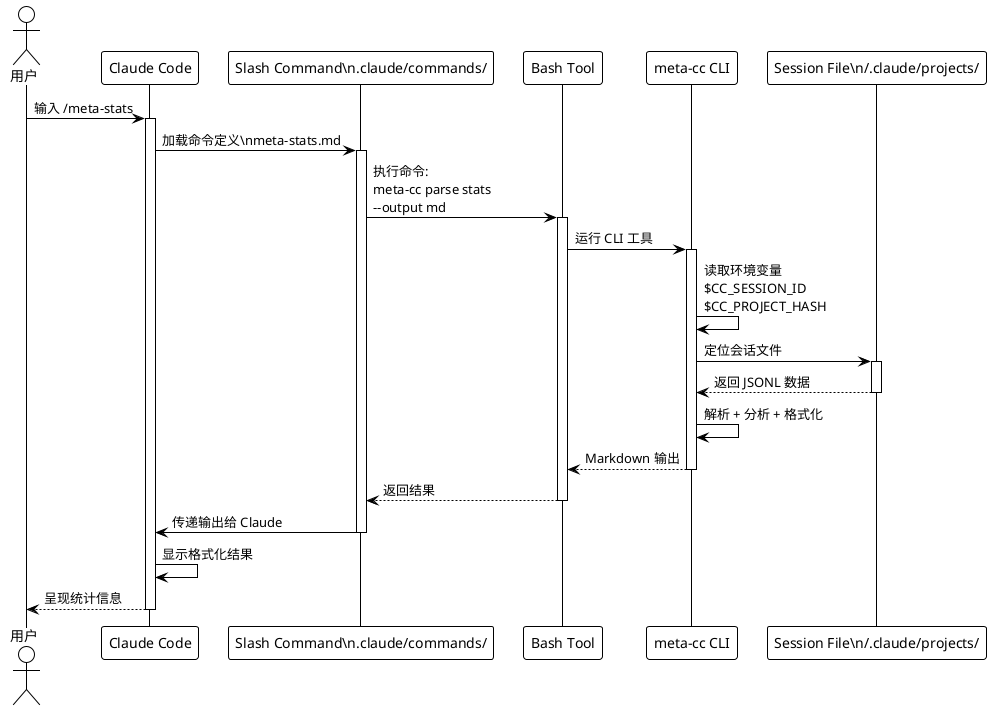

# Phase 6: Claude Code 集成（Slash Commands）

## 概述

**目标**: 创建可在 Claude Code 中使用的 Slash Commands，实现 meta-cc 与 Claude Code 的原生集成

**代码量**: ~100 行（主要为配置文件和文档）

**依赖**: Phase 0-5（完整的 meta-cc CLI 工具链）

**交付物**:
- `/meta-stats` Slash Command（显示会话统计信息）
- `/meta-errors` Slash Command（分析错误模式）
- 完整的集成文档和使用说明
- 安装和故障排查指南

---\n

## Phase 目标

实现 meta-cc 与 Claude Code 的深度集成，使用户可以通过简单的 Slash Commands 直接在会话中分析元数据：

1. **Slash Command 定义文件**（`.claude/commands/` 目录）
2. **环境变量集成**（利用 `CC_SESSION_ID` 和 `CC_PROJECT_HASH`）
3. **错误处理和用户友好输出**
4. **完整的安装和使用文档**
5. **故障排查指南和测试指南**

**成功标准**:
- ✅ `/meta-stats` 在 Claude Code 中可用，正确显示会话统计
- ✅ `/meta-errors` 正确检测并分析错误模式
- ✅ `/meta-errors [window-size]` 支持可选参数
- ✅ meta-cc 二进制文件可在 PATH 中找到
- ✅ 环境变量正确传递（如果可用）
- ✅ 输出格式美观、易读
- ✅ 错误处理完善（meta-cc 未安装、会话文件未找到等）
- ✅ 文档完整，包含安装步骤、使用示例、截图
- ✅ 测试环境可复现
- ✅ **完成 MVP（Minimum Viable Product）里程碑**

---\n

## 集成架构



---\n

## Stage 6.1: /meta-stats Slash Command

### 目标

创建 `/meta-stats` Slash Command，允许用户在 Claude Code 中快速查看当前会话的统计信息。

### 实现步骤

**1. 创建命令定义文件**

#### `.claude/commands/meta-stats.md` (~30 行)

```markdown
---
name: meta-stats
description: 显示当前 Claude Code 会话的统计信息（Turn 数量、工具使用频率、错误率、会话时长等）
allowed_tools: [Bash]
---

# meta-stats：会话统计分析

运行以下命令获取当前会话的统计信息：

```bash
# 检查 meta-cc 是否安装
if ! command -v meta-cc &> /dev/null; then
    echo "❌ 错误：meta-cc 未安装或不在 PATH 中"
    echo ""
    echo "请安装 meta-cc："
    echo "  1. 下载或构建 meta-cc 二进制文件"
    echo "  2. 将其放置在 PATH 中（如 /usr/local/bin/meta-cc）"
    echo "  3. 确保可执行权限：chmod +x /usr/local/bin/meta-cc"
    echo ""
    echo "详情参见：https://github.com/yaleh/meta-cc"
    exit 1
fi

# 运行 meta-cc parse stats 并输出 Markdown 格式
meta-cc parse stats --output md
```

## 说明

此命令分析当前 Claude Code 会话，提供以下统计信息：

- **Turn 数量**：会话中的对话轮次总数
- **工具调用次数**：使用工具的总次数
- **错误率**：工具调用失败的百分比
- **会话时长**：从第一个 Turn 到最后一个 Turn 的时间跨度
- **工具使用频率**：每种工具的使用次数排名

## 输出示例

```markdown
# Session Statistics

- **Total Turns**: 245
- **Tool Calls**: 853
- **Error Count**: 0
- **Error Rate**: 0.00%
- **Session Duration**: 3h 42m

## Tool Usage Frequency

| Tool | Count | Percentage |
|------|-------|------------|
| Bash | 320 | 37.5% |
| Read | 198 | 23.2% |
| Edit | 156 | 18.3% |
| Grep | 89 | 10.4% |
| Write | 90 | 10.6% |
```

## 使用场景

- 快速了解会话的整体情况
- 检查是否有工具使用异常（错误率过高）
- 评估会话效率（Turn 数量 vs 工具调用次数）
- 发现工具使用偏好（某些工具是否被过度使用）

## 相关命令

- `/meta-errors`：分析错误模式
```

**2. 文件位置**

命令文件应放置在项目根目录：
```
meta-cc/
├── .claude/
│   └── commands/
│       └── meta-stats.md
```

**3. 环境变量处理**

meta-cc CLI 工具已在 Phase 1 中实现环境变量读取：
- `CC_SESSION_ID`：当前会话 ID
- `CC_PROJECT_HASH`：项目路径哈希

如果这些环境变量在 Claude Code 运行时可用，meta-cc 会自动使用它们定位会话文件。如果不可用，meta-cc 会回退到当前工作目录推断。

**4. 测试命令**

手动测试（在实际 Claude Code 环境中）：

```bash
# Step 1: 确保 meta-cc 已安装
which meta-cc
# 预期输出：/usr/local/bin/meta-cc（或其他 PATH 路径）

# Step 2: 手动运行命令验证
meta-cc parse stats --output md

# Step 3: 在 Claude Code 中测试
# 打开 Claude Code，输入：
# /meta-stats
# 验证输出是否正确显示
```

### 交付物

**文件清单**:
```
meta-cc/
├── .claude/
│   └── commands/
│       └── meta-stats.md  # Slash Command 定义 (~30 行)
```

**代码量**: ~30 行（Markdown 配置 + Bash 脚本）

### 验收标准

- ✅ 文件 `.claude/commands/meta-stats.md` 创建成功
- ✅ frontmatter 包含正确的 `name`、`description`、`allowed_tools`
- ✅ Bash 脚本包含 meta-cc 安装检查
- ✅ Bash 脚本调用 `meta-cc parse stats --output md`
- ✅ 文档包含使用说明和输出示例
- ✅ 手动测试：在 Claude Code 中输入 `/meta-stats` 能正确显示统计信息
- ✅ 错误处理：meta-cc 未安装时显示友好错误消息
- ✅ 环境变量：如果 `CC_SESSION_ID` 可用，自动使用；否则回退到工作目录

---\n

## Stage 6.2: /meta-errors Slash Command

### 目标

创建 `/meta-errors` Slash Command，允许用户在 Claude Code 中分析错误模式，支持可选的窗口参数。

### 实现步骤

**1. 创建命令定义文件**

#### `.claude/commands/meta-errors.md` (~40 行)

```markdown
---
name: meta-errors
description: 分析当前 Claude Code 会话中的错误模式，检测重复出现的错误（可选参数：window-size）
allowed_tools: [Bash]
argument-hint: [window-size]
---

# meta-errors：错误模式分析

分析当前会话中的错误模式，检测重复出现的错误（出现 3 次以上）。

```bash
# 检查 meta-cc 是否安装
if ! command -v meta-cc &> /dev/null; then
    echo "❌ 错误：meta-cc 未安装或不在 PATH 中"
    echo ""
    echo "请安装 meta-cc："
    echo "  1. 下载或构建 meta-cc 二进制文件"
    echo "  2. 将其放置在 PATH 中（如 /usr/local/bin/meta-cc）"
    echo "  3. 确保可执行权限：chmod +x /usr/local/bin/meta-cc"
    echo ""
    echo "详情参见：https://github.com/yaleh/meta-cc"
    exit 1
fi

# 获取窗口参数（默认 20）
WINDOW_SIZE=${1:-20}

# Step 1: 提取错误数据（用于上下文展示）
echo "## 错误数据提取"
echo ""
ERROR_COUNT=$(meta-cc parse extract --type tools --filter "status=error" --output json | grep -o '"UUID"' | wc -l)

if [ "$ERROR_COUNT" -eq 0 ]; then
    echo "✅ 当前会话中未检测到错误。"
    exit 0
fi

echo "检测到 $ERROR_COUNT 个错误工具调用。"
echo ""

# Step 2: 分析错误模式（窗口大小：$WINDOW_SIZE）
echo "## 错误模式分析（窗口大小：$WINDOW_SIZE）"
echo ""
PATTERN_OUTPUT=$(meta-cc analyze errors --window "$WINDOW_SIZE" --output md)

echo "$PATTERN_OUTPUT"
echo ""

# Step 3: 如果检测到错误模式，提供优化建议
if echo "$PATTERN_OUTPUT" | grep -q "## Pattern"; then
    echo "---"
    echo ""
    echo "## 优化建议"
    echo ""
    echo "基于检测到的错误模式，请考虑以下优化措施："
    echo ""
    echo "1. **检查重复错误的根本原因**"
    echo "   - 查看错误文本，识别是否为相同的底层问题"
    echo "   - 检查相关的 Turn 序列，了解错误发生的上下文"
    echo ""
    echo "2. **使用 Claude Code Hooks 预防错误**"
    echo "   - 创建 pre-tool hook 检查常见错误条件"
    echo "   - 例如：文件存在性检查、权限验证、参数格式校验"
    echo ""
    echo "3. **调整工作流**"
    echo "   - 如果错误集中在某个工具，考虑使用替代方案"
    echo "   - 优化提示词以减少错误触发频率"
    echo ""
    echo "4. **查看详细错误列表**"
    echo "   - 运行：\`meta-cc parse extract --type tools --filter \"status=error\" --output md\`"
    echo "   - 分析每个错误的具体原因和上下文"
    echo ""
else
    echo "✅ 未检测到重复错误模式（出现 < 3 次）。"
fi
```

## 参数说明

- `window-size`（可选）：分析最近 N 个 Turn。默认值为 20。
  - 示例：`/meta-errors 50`（分析最近 50 个 Turn）
  - 省略参数：`/meta-errors`（使用默认窗口 20）

## 输出内容

1. **错误数据提取**：统计会话中的错误总数
2. **错误模式分析**：检测重复出现的错误（≥3 次）
3. **优化建议**：基于检测到的模式提供可行的改进措施

## 输出示例

```markdown
## 错误数据提取

检测到 12 个错误工具调用。

## 错误模式分析（窗口大小：20）

# Error Pattern Analysis

Found 2 error pattern(s):

## Pattern 1: Bash

- **Type**: repeated_error
- **Occurrences**: 5 times
- **Signature**: `a3f2b1c4d5e6f7g8`
- **Error**: command not found: xyz

### Context

- **First Occurrence**: 2025-10-02T10:00:00.000Z
- **Last Occurrence**: 2025-10-02T10:15:00.000Z
- **Time Span**: 900 seconds (15.0 minutes)
- **Affected Turns**: 5

---

## 优化建议

基于检测到的错误模式，请考虑以下优化措施：

1. **检查重复错误的根本原因**
   - 查看错误文本，识别是否为相同的底层问题

2. **使用 Claude Code Hooks 预防错误**
   - 创建 pre-tool hook 检查常见错误条件

3. **调整工作流**
   - 如果错误集中在某个工具，考虑使用替代方案
```

## 使用场景

- 识别重复出现的错误，避免重复调试
- 发现工作流中的瓶颈（某些操作频繁失败）
- 获取优化建议（hooks、替代方案、提示词改进）
- 关注最近的错误（使用窗口参数）

## 相关命令

- `/meta-stats`：查看会话统计信息
- `meta-cc parse extract --type errors`：查看所有错误详情
```

**2. 文件位置**

命令文件应放置在项目根目录：
```
meta-cc/
├── .claude/
│   └── commands/
│       ├── meta-stats.md
│       └── meta-errors.md
```

**3. 参数处理**

- `${1:-20}`：Bash 参数扩展，使用 `$1`（第一个参数），默认值为 20
- `argument-hint: [window-size]`：在 Claude Code UI 中提示用户可以提供窗口参数

**4. 测试命令**

手动测试（在实际 Claude Code 环境中）：

```bash
# Step 1: 手动运行命令验证（默认窗口）
meta-cc analyze errors --window 20 --output md

# Step 2: 手动运行命令验证（自定义窗口）
meta-cc analyze errors --window 50 --output md

# Step 3: 在 Claude Code 中测试
# 打开 Claude Code，输入：
# /meta-errors
# /meta-errors 50
# 验证输出是否正确显示
```

### 交付物

**文件清单**:
```
meta-cc/
├── .claude/
│   └── commands/
│       ├── meta-stats.md   # Stage 6.1 已完成
│       └── meta-errors.md  # Slash Command 定义 (~40 行)
```

**代码量**: ~40 行（Markdown 配置 + Bash 脚本 + 优化建议）

### 验收标准

- ✅ 文件 `.claude/commands/meta-errors.md` 创建成功
- ✅ frontmatter 包含正确的 `name`、`description`、`allowed_tools`、`argument-hint`
- ✅ Bash 脚本包含 meta-cc 安装检查
- ✅ Bash 脚本调用 `meta-cc parse extract`（错误数据提取）
- ✅ Bash 脚本调用 `meta-cc analyze errors --window $WINDOW_SIZE --output md`
- ✅ Bash 脚本提供优化建议（基于错误模式检测结果）
- ✅ 支持可选参数：`/meta-errors [window-size]`
- ✅ 默认窗口大小为 20
- ✅ 手动测试：在 Claude Code 中输入 `/meta-errors` 能正确分析错误
- ✅ 手动测试：在 Claude Code 中输入 `/meta-errors 50` 能使用自定义窗口
- ✅ 无错误会话：正确显示 "✅ 未检测到错误" 而不是报错
- ✅ 错误处理：meta-cc 未安装时显示友好错误消息

---\n

## Stage 6.3: 集成测试、文档和安装指南

### 目标

创建完整的集成测试脚本、用户文档、安装指南和故障排查指南，确保用户可以顺利安装和使用 meta-cc Slash Commands。

### 实现步骤

**1. 创建集成测试脚本**

#### `tests/integration/slash_commands_test.sh` (~30 行)

```bash
#!/bin/bash
# 集成测试脚本：验证 Slash Commands 配置正确性

set -e  # 遇到错误立即退出

echo "=== meta-cc Slash Commands 集成测试 ==="
echo ""

# Step 1: 检查 meta-cc 是否安装
echo "[1/5] 检查 meta-cc 安装..."
if ! command -v meta-cc &> /dev/null; then
    echo "❌ 错误：meta-cc 未安装或不在 PATH 中"
    exit 1
fi
echo "✅ meta-cc 已安装：$(which meta-cc)"
echo ""

# Step 2: 检查 Slash Command 文件是否存在
echo "[2/5] 检查 Slash Command 文件..."
if [ ! -f ".claude/commands/meta-stats.md" ]; then
    echo "❌ 错误：.claude/commands/meta-stats.md 不存在"
    exit 1
fi
if [ ! -f ".claude/commands/meta-errors.md" ]; then
    echo "❌ 错误：.claude/commands/meta-errors.md 不存在"
    exit 1
fi
echo "✅ Slash Command 文件存在"
echo ""

# Step 3: 测试 meta-cc parse stats 命令
echo "[3/5] 测试 meta-cc parse stats..."
if ! meta-cc parse stats --output md &> /dev/null; then
    echo "❌ 错误：meta-cc parse stats 执行失败"
    exit 1
fi
echo "✅ meta-cc parse stats 执行成功"
echo ""

# Step 4: 测试 meta-cc analyze errors 命令
echo "[4/5] 测试 meta-cc analyze errors..."
if ! meta-cc analyze errors --window 20 --output md &> /dev/null; then
    echo "❌ 错误：meta-cc analyze errors 执行失败"
    exit 1
fi
echo "✅ meta-cc analyze errors 执行成功"
echo ""

# Step 5: 测试 meta-cc parse extract 命令（用于 /meta-errors）
echo "[5/5] 测试 meta-cc parse extract..."
if ! meta-cc parse extract --type tools --filter "status=error" --output json &> /dev/null; then
    echo "❌ 错误：meta-cc parse extract 执行失败"
    exit 1
fi
echo "✅ meta-cc parse extract 执行成功"
echo ""

echo "=== 所有测试通过 ✅ ==="
echo ""
echo "下一步："
echo "1. 在 Claude Code 中打开此项目"
echo "2. 输入 /meta-stats 测试统计命令"
echo "3. 输入 /meta-errors 测试错误分析命令"
echo "4. 输入 /meta-errors 50 测试自定义窗口参数"
```

**2. 更新 README.md：添加 Claude Code 集成部分**

在 `README.md` 中添加以下章节（插入到 "Usage" 章节之后）：

#### `README.md` 新增章节 (~150 行)

```markdown
## Claude Code 集成

meta-cc 提供了与 Claude Code 的深度集成，允许你通过简单的 Slash Commands 直接在会话中分析元数据。

### 安装步骤

#### 1. 安装 meta-cc CLI 工具

**选项 A: 从源码构建**

```bash
# 克隆仓库
git clone https://github.com/yaleh/meta-cc.git
cd meta-cc

# 构建二进制文件
make build

# 安装到系统路径
sudo cp meta-cc /usr/local/bin/meta-cc
sudo chmod +x /usr/local/bin/meta-cc

# 验证安装
meta-cc --version
```

**选项 B: 下载预编译二进制文件**（待实现）

```bash
# 下载最新版本（Linux x64）
curl -L https://github.com/yaleh/meta-cc/releases/latest/download/meta-cc-linux-amd64 -o meta-cc

# 安装到系统路径
sudo mv meta-cc /usr/local/bin/meta-cc
sudo chmod +x /usr/local/bin/meta-cc

# 验证安装
meta-cc --version
```

#### 2. 配置 Slash Commands

Slash Commands 定义文件已包含在项目中（`.claude/commands/` 目录）。

**项目级 Slash Commands**（推荐）：

```bash
# Slash Commands 文件已在项目中
ls .claude/commands/
# meta-stats.md
# meta-errors.md

# 无需额外配置，打开 Claude Code 即可使用
```

**个人级 Slash Commands**（可选，全局可用）：

```bash
# 复制到个人 Slash Commands 目录
mkdir -p ~/.claude/commands
cp .claude/commands/meta-stats.md ~/.claude/commands/
cp .claude/commands/meta-errors.md ~/.claude/commands/

# 现在所有 Claude Code 项目都可以使用这些命令
```

#### 3. 运行集成测试

```bash
# 运行集成测试脚本
bash tests/integration/slash_commands_test.sh
```

预期输出：
```
=== meta-cc Slash Commands 集成测试 ===

[1/5] 检查 meta-cc 安装...
✅ meta-cc 已安装：/usr/local/bin/meta-cc

[2/5] 检查 Slash Command 文件...
✅ Slash Command 文件存在

[3/5] 测试 meta-cc parse stats...
✅ meta-cc parse stats 执行成功

[4/5] 测试 meta-cc analyze errors...
✅ meta-cc analyze errors 执行成功

[5/5] 测试 meta-cc parse extract...
✅ meta-cc parse extract 执行成功

=== 所有测试通过 ✅ ===
```

### 可用的 Slash Commands

#### `/meta-stats` - 会话统计分析

显示当前 Claude Code 会话的统计信息。

**用法**:
```
/meta-stats
```

**输出示例**:
```markdown
# Session Statistics

- **Total Turns**: 245
- **Tool Calls**: 853
- **Error Count**: 0
- **Error Rate**: 0.00%
- **Session Duration**: 3h 42m

## Tool Usage Frequency

| Tool | Count | Percentage |
|------|-------|------------|
| Bash | 320 | 37.5% |
| Read | 198 | 23.2% |
| Edit | 156 | 18.3% |
```

**使用场景**:
- 快速了解会话的整体情况
- 检查是否有工具使用异常（错误率过高）
- 评估会话效率
- 发现工具使用偏好

#### `/meta-errors` - 错误模式分析

分析当前会话中的错误模式，检测重复出现的错误。

**用法**:
```
/meta-errors              # 使用默认窗口（20 个 Turn）
/meta-errors 50           # 分析最近 50 个 Turn
/meta-errors 100          # 分析最近 100 个 Turn
```

**输出示例**:
```markdown
## 错误数据提取

检测到 12 个错误工具调用。

## 错误模式分析（窗口大小：20）

# Error Pattern Analysis

Found 2 error pattern(s):

## Pattern 1: Bash

- **Type**: repeated_error
- **Occurrences**: 5 times
- **Signature**: `a3f2b1c4d5e6f7g8`
- **Error**: command not found: xyz

### Context

- **First Occurrence**: 2025-10-02T10:00:00.000Z
- **Last Occurrence**: 2025-10-02T10:15:00.000Z
- **Time Span**: 900 seconds (15.0 minutes)
- **Affected Turns**: 5

---

## 优化建议

基于检测到的错误模式，请考虑以下优化措施：

1. **检查重复错误的根本原因**
2. **使用 Claude Code Hooks 预防错误**
3. **调整工作流**
```

**使用场景**:
- 识别重复出现的错误
- 发现工作流中的瓶颈
- 获取优化建议
- 关注最近的错误（使用窗口参数）

### 故障排查

#### 问题 1: "❌ 错误：meta-cc 未安装或不在 PATH 中"

**原因**: meta-cc 二进制文件未安装或不在系统 PATH 中。

**解决方案**:
```bash
# 检查 meta-cc 是否安装
which meta-cc

# 如果未找到，安装 meta-cc
cd /path/to/meta-cc
make build
sudo cp meta-cc /usr/local/bin/meta-cc
sudo chmod +x /usr/local/bin/meta-cc

# 验证安装
meta-cc --version
```

#### 问题 2: "failed to locate session file"

**原因**: meta-cc 无法找到当前会话的 JSONL 文件。

**解决方案**:
```bash
# 方案 1: 检查环境变量（Claude Code 可能提供）
echo $CC_SESSION_ID
echo $CC_PROJECT_HASH

# 方案 2: 手动指定会话文件
meta-cc parse stats --session <session-id>

# 方案 3: 检查会话文件是否存在
ls ~/.claude/projects/
```

#### 问题 3: Slash Commands 不显示或不可用

**原因**: Slash Commands 文件位置不正确或 Claude Code 未加载。

**解决方案**:
```bash
# 检查文件是否存在
ls .claude/commands/meta-stats.md
ls .claude/commands/meta-errors.md

# 重启 Claude Code
# 关闭 Claude Code，重新打开项目

# 检查文件格式（frontmatter 必须正确）
head -n 10 .claude/commands/meta-stats.md
```

#### 问题 4: 输出格式混乱或包含错误

**原因**: meta-cc 版本不匹配或命令参数错误。

**解决方案**:
```bash
# 检查 meta-cc 版本
meta-cc --version

# 确保使用最新版本
cd /path/to/meta-cc
git pull
make build
sudo cp meta-cc /usr/local/bin/meta-cc

# 手动测试命令
meta-cc parse stats --output md
meta-cc analyze errors --window 20 --output md
```

#### 问题 5: 权限错误

**原因**: meta-cc 没有读取会话文件的权限。

**解决方案**:
```bash
# 检查会话文件权限
ls -l ~/.claude/projects/

# 确保当前用户有读权限
chmod -R u+r ~/.claude/projects/
```

### 高级用法

#### 组合使用 Slash Commands 和 CLI

```bash
# Step 1: 在 Claude Code 中使用 /meta-stats 快速查看
# /meta-stats

# Step 2: 如果发现错误率高，使用 /meta-errors 分析
# /meta-errors

# Step 3: 导出详细错误数据进行深入分析
meta-cc parse extract --type tools --filter "status=error" --output csv > errors.csv

# Step 4: 生成完整报告
meta-cc parse stats --output md > session-report.md
meta-cc analyze errors --output md >> session-report.md
```

#### 创建自定义 Slash Commands

基于 meta-cc，你可以创建自定义 Slash Commands：

**示例：`.claude/commands/meta-tool-usage.md`**

```markdown
---
name: meta-tool-usage
description: 显示特定工具的使用详情
allowed_tools: [Bash]
argument-hint: [tool-name]
---

```bash
TOOL_NAME=${1:-Bash}
meta-cc parse extract --type tools --filter "tool=$TOOL_NAME" --output md
```
```

**用法**:
```
/meta-tool-usage Bash
/meta-tool-usage Read
```

### 环境变量

meta-cc 支持以下环境变量（如果 Claude Code 提供）：

- `CC_SESSION_ID`：当前会话 ID
- `CC_PROJECT_HASH`：项目路径哈希

**检查环境变量**:
```bash
# 在 Slash Command 中检查
echo "Session ID: $CC_SESSION_ID"
echo "Project Hash: $CC_PROJECT_HASH"
```

如果这些环境变量不可用，meta-cc 会自动回退到基于当前工作目录的推断。

### 参考文档

- [Claude Code Slash Commands 官方文档](https://docs.claude.com/en/docs/claude-code/slash-commands)
- [meta-cc 命令参考](./README.md#commands)
- [meta-cc 技术方案](./docs/proposals/meta-cognition-proposal.md)

---\n

**3. 创建故障排查指南**

#### `docs/troubleshooting.md` (~50 行)

```markdown
# meta-cc 故障排查指南

本文档提供常见问题的解决方案。

## 安装问题

### meta-cc 未找到

**症状**:
```
command not found: meta-cc
```

**解决方案**:
```bash
# 确认 meta-cc 已安装
which meta-cc

# 如果未安装，构建并安装
cd /path/to/meta-cc
make build
sudo cp meta-cc /usr/local/bin/meta-cc
sudo chmod +x /usr/local/bin/meta-cc
```

### 权限错误

**症状**:
```
permission denied: /usr/local/bin/meta-cc
```

**解决方案**:
```bash
# 添加可执行权限
sudo chmod +x /usr/local/bin/meta-cc
```

## 会话文件定位问题

### "failed to locate session file"

**症状**:
```
Error: failed to locate session file: no session file found
```

**可能原因**:
1. 环境变量 `CC_SESSION_ID` 和 `CC_PROJECT_HASH` 未设置
2. 当前目录不是 Claude Code 项目根目录
3. 会话文件不存在

**解决方案**:
```bash
# 方案 1: 手动指定会话 ID
meta-cc parse stats --session <session-id>

# 方案 2: 手动指定项目路径
meta-cc parse stats --project /path/to/project

# 方案 3: 检查会话文件是否存在
ls ~/.claude/projects/
```

## Slash Commands 问题

### Slash Commands 不显示

**可能原因**:
1. 文件位置不正确（应在 `.claude/commands/`）
2. frontmatter 格式错误
3. Claude Code 未重新加载

**解决方案**:
```bash
# 检查文件位置
ls .claude/commands/

# 检查 frontmatter 格式
head -n 10 .claude/commands/meta-stats.md

# 重启 Claude Code
# 关闭并重新打开 Claude Code
```

### Slash Commands 执行失败

**症状**:
```
Error executing command: ...
```

**解决方案**:
```bash
# 手动运行命令测试
bash -c "$(sed -n '\`\`\`bash/,\`\`\`/p' .claude/commands/meta-stats.md | grep -v '\`\`\`')"

# 检查 meta-cc 版本
meta-cc --version
```

## 输出问题

### 输出为空或格式错误

**可能原因**:
1. 会话文件为空或格式错误
2. meta-cc 版本过旧
3. 命令参数错误

**解决方案**:
```bash
# 检查会话文件内容
head ~/.claude/projects/<hash>/<session-id>.jsonl

# 更新 meta-cc
cd /path/to/meta-cc
git pull
make build
sudo cp meta-cc /usr/local/bin/meta-cc

# 测试命令
meta-cc parse stats --output md
```

## 性能问题

### 命令执行缓慢

**可能原因**:
1. 会话文件过大（Turn 数量 > 1000）
2. 窗口参数过大

**解决方案**:
```bash
# 使用窗口参数限制分析范围
meta-cc analyze errors --window 50

# 检查会话文件大小
wc -l ~/.claude/projects/<hash>/<session-id>.jsonl
```

## 调试技巧

### 启用详细日志

```bash
# 运行命令并查看详细输出
meta-cc parse stats --output md -v
```

### 检查中间数据

```bash
# 提取原始数据
meta-cc parse extract --type turns --output json

# 检查工具调用
meta-cc parse extract --type tools --output json
```

### 验证 JSONL 格式

```bash
# 检查 JSONL 文件格式
cat ~/.claude/projects/<hash>/<session-id>.jsonl | jq . | head -n 50
```

## 获取帮助

如果以上解决方案无效，请：

1. **查看项目文档**: [README.md](../README.md)
2. **提交 Issue**: [GitHub Issues](https://github.com/yaleh/meta-cc/issues)
3. **查看 Claude Code 文档**: [官方文档](https://docs.claude.com/en/docs/claude-code)

提交 Issue 时，请包含：
- meta-cc 版本（`meta-cc --version`）
- 完整错误消息
- 会话文件大小（`wc -l <session-file>`）
- 操作系统和版本
```

**4. 运行集成测试**

```bash
# 添加可执行权限
chmod +x tests/integration/slash_commands_test.sh

# 运行测试
bash tests/integration/slash_commands_test.sh
```

### 交付物

**文件清单**:
```
meta-cc/
├── .claude/
│   └── commands/
│       ├── meta-stats.md           # Stage 6.1 已完成
│       └── meta-errors.md          # Stage 6.2 已完成
├── docs/
│   └── troubleshooting.md          # 故障排查指南 (~50 行)
├── tests/
│   └── integration/
│       └── slash_commands_test.sh  # 集成测试脚本 (~30 行)
└── README.md                       # 更新：添加 Claude Code 集成章节 (~150 行新增)
```

**代码量**: ~230 行（测试脚本 + 文档 + README 更新）

### 验收标准

- ✅ 集成测试脚本 `tests/integration/slash_commands_test.sh` 创建并可执行
- ✅ 测试脚本验证 meta-cc 安装
- ✅ 测试脚本验证 Slash Commands 文件存在
- ✅ 测试脚本验证所有相关 meta-cc 命令可执行
- ✅ 测试脚本输出清晰的成功/失败消息
- ✅ README.md 添加 "Claude Code 集成" 章节
- ✅ README.md 包含完整的安装步骤
- ✅ README.md 包含 Slash Commands 使用示例
- ✅ README.md 包含故障排查指南（常见问题）
- ✅ `docs/troubleshooting.md` 创建，包含详细的问题诊断流程
- ✅ 文档包含实际的命令输出示例
- ✅ 文档包含环境变量说明
- ✅ 文档包含自定义 Slash Commands 示例
- ✅ 手动测试：运行 `bash tests/integration/slash_commands_test.sh` 全部通过
- ✅ 手动测试：在 Claude Code 中验证 `/meta-stats` 和 `/meta-errors` 可用

---\n

## Phase 6 集成测试

### 端到端测试：完整 Slash Commands 流程

**测试环境准备**:

```bash
# Step 1: 确保在 meta-cc 项目根目录
cd /path/to/meta-cc

# Step 2: 构建并安装 meta-cc
make build
sudo cp meta-cc /usr/local/bin/meta-cc
sudo chmod +x /usr/local/bin/meta-cc

# Step 3: 验证 Slash Commands 文件
ls -l .claude/commands/

# Step 4: 运行集成测试
bash tests/integration/slash_commands_test.sh
```

**手动测试清单**:

1. **测试 /meta-stats**
   - 在 Claude Code 中打开 meta-cc 项目
   - 输入 `/meta-stats`
   - 验证输出包含：Turn 数量、工具调用次数、错误率、时长、工具频率表
   - 验证输出格式正确（Markdown 表格、统计数字）

2. **测试 /meta-errors（无参数）**
   - 输入 `/meta-errors`
   - 验证使用默认窗口 20
   - 验证输出包含：错误数据提取、错误模式分析、优化建议（如果有错误）
   - 验证无错误会话显示 "✅ 未检测到错误"

3. **测试 /meta-errors（自定义窗口）**
   - 输入 `/meta-errors 50`
   - 验证窗口参数生效（输出显示 "窗口大小：50"）
   - 验证结果符合预期

4. **测试错误处理**
   - 临时重命名 meta-cc：`sudo mv /usr/local/bin/meta-cc /usr/local/bin/meta-cc.bak`
   - 输入 `/meta-stats`
   - 验证显示友好错误消息："❌ 错误：meta-cc 未安装或不在 PATH 中"
   - 恢复 meta-cc：`sudo mv /usr/local/bin/meta-cc.bak /usr/local/bin/meta-cc`

5. **测试环境变量（如果可用）**
   - 检查 Claude Code 是否设置 `CC_SESSION_ID` 和 `CC_PROJECT_HASH`
   - 在 Slash Command 中添加临时调试：`echo "Session: $CC_SESSION_ID"`
   - 验证 meta-cc 正确使用环境变量

**预期结果**:

- ✅ 所有 Slash Commands 可用且输出正确
- ✅ 错误处理友好，提供清晰的错误消息和解决方案
- ✅ 参数处理正确（默认值、自定义值）
- ✅ 输出格式美观、易读
- ✅ 性能良好（命令在 2 秒内返回结果）

---\n

## Phase 6 完成标准

### 功能验收

**必须满足所有条件**：

1. **Slash Commands 可用**
   ```
   /meta-stats
   /meta-errors
   /meta-errors 50
   ```
   - ✅ 在 Claude Code 中输入命令后正确执行
   - ✅ 输出格式正确（Markdown）
   - ✅ 输出内容准确（统计数字、错误模式）

2. **meta-cc 安装检查**
   - ✅ 命令开头检查 meta-cc 是否安装
   - ✅ meta-cc 未安装时显示友好错误消息
   - ✅ 错误消息包含安装指南

3. **参数处理**
   - ✅ `/meta-errors` 使用默认窗口 20
   - ✅ `/meta-errors 50` 使用自定义窗口 50
   - ✅ `argument-hint: [window-size]` 在 UI 中显示

4. **错误处理**
   - ✅ meta-cc 未安装：显示安装指南
   - ✅ 会话文件未找到：显示文件定位错误
   - ✅ 无错误会话：显示 "✅ 未检测到错误"
   - ✅ 命令执行失败：显示具体错误原因

5. **输出优化**
   - ✅ `/meta-stats` 输出清晰的统计表格
   - ✅ `/meta-errors` 输出错误模式 + 优化建议
   - ✅ 输出格式美观、易读
   - ✅ 输出包含实用的上下文信息

6. **集成测试通过**
   ```bash
bash tests/integration/slash_commands_test.sh
```
   - ✅ 所有测试步骤通过
   - ✅ 无错误或警告
   - ✅ 输出清晰的成功消息

7. **文档完整性**
   - ✅ README.md 包含 "Claude Code 集成" 章节
   - ✅ 包含完整的安装步骤
   - ✅ 包含 Slash Commands 使用示例
   - ✅ 包含故障排查指南
   - ✅ 包含环境变量说明
   - ✅ `docs/troubleshooting.md` 创建并完善

### 代码质量

- ✅ 总代码量 ≤ 100 行（不含文档）
  - Stage 6.1: ~30 行（meta-stats.md）
  - Stage 6.2: ~40 行（meta-errors.md）
  - Stage 6.3: ~30 行（slash_commands_test.sh）
  - 总计: ~100 行（符合约束）
  - 文档: ~200 行（不计入代码量）
- ✅ Slash Commands frontmatter 格式正确
- ✅ Bash 脚本语法正确（通过 shellcheck）
- ✅ 测试脚本可执行且通过
- ✅ 文档格式正确（Markdown 语法）

### 用户体验

- ✅ 用户可以在 5 分钟内完成安装
- ✅ 用户可以在 Claude Code 中直接使用 Slash Commands
- ✅ 错误消息清晰、可操作
- ✅ 文档易读、完整
- ✅ 输出格式美观、实用

---\n

## 项目结构（Phase 6 完成后）

```
meta-cc/
├── .claude/
│   └── commands/
│       ├── meta-stats.md           # Phase 6（新增）
│       └── meta-errors.md          # Phase 6（新增）
├── cmd/
│   ├── root.go
│   ├── parse.go
│   ├── parse_test.go
│   ├── analyze.go
│   └── analyze_test.go
├── docs/
│   ├── proposals/
│   │   └── meta-cognition-proposal.md
│   └── troubleshooting.md          # Phase 6（新增）
├── internal/
│   ├── locator/
│   ├── parser/
│   ├── analyzer/
│   ├── filter/
│   └── testutil/
├── pkg/
│   └── output/
├── tests/
│   ├── fixtures/
│   │   ├── sample-session.jsonl
│   │   └── session-with-errors.jsonl
│   └── integration/
│       ├── locator_test.go
│       ├── parser_test.go
│       ├── parse_command_test.go
│       ├── stats_command_test.go
│       ├── analyze_command_test.go
│       └── slash_commands_test.sh  # Phase 6（新增）
├── go.mod
├── go.sum
├── Makefile
├── main.go
└── README.md                        # Phase 6（更新）
```

---\n

## 依赖关系

**Phase 6 依赖**:
- Phase 0（CLI 框架、测试工具）
- Phase 1（会话文件定位）
- Phase 2（JSONL 解析器）
- Phase 3（数据提取命令、输出格式化器）
- Phase 4（统计分析命令）
- Phase 5（错误模式分析命令）

**Phase 6 提供**:
- Claude Code Slash Commands 集成
- `/meta-stats` 命令
- `/meta-errors` 命令
- 完整的用户文档和故障排查指南

**后续 Phase 可选扩展**:
- Phase 7（Subagents）：`@meta-coach` 对话式分析
- Phase 8（MCP Server）：MCP 协议集成
- Phase 9（Advanced Features）：跨会话分析、工具序列检测

---\n

## 风险与缓解

| 风险 | 影响 | 缓解措施 |
|------|------|----------|
| Claude Code 不提供环境变量 | 中 | 回退到工作目录推断；文档说明两种模式 |
| meta-cc 未安装导致命令失败 | 高 | Slash Command 开头检查安装；提供清晰错误消息 |
| 用户不熟悉安装流程 | 中 | 提供详细的安装步骤；创建故障排查文档 |
| Slash Commands frontmatter 格式错误 | 低 | 运行集成测试验证格式；提供示例 |
| 输出格式混乱影响阅读 | 中 | 使用 Markdown 格式；测试实际输出效果 |
| 会话文件权限问题 | 低 | 文档说明权限要求；故障排查指南包含解决方案 |

---\n

## MVP 里程碑完成

**Phase 6 完成后，meta-cc 达到 MVP（Minimum Viable Product）里程碑**：

- ✅ **Phase 0**: 项目初始化和构建框架
- ✅ **Phase 1**: 会话文件定位（环境变量、参数、路径推断）
- ✅ **Phase 2**: JSONL 解析器（Turn、ToolCall 提取）
- ✅ **Phase 3**: 数据提取命令（`parse extract`）
- ✅ **Phase 4**: 统计分析命令（`parse stats`）
- ✅ **Phase 5**: 错误模式分析命令（`analyze errors`）
- ✅ **Phase 6**: Claude Code 集成（Slash Commands）

**MVP 功能清单**:

1. **CLI 工具**（meta-cc 二进制文件）
   - 会话文件定位（自动或手动）
   - 数据提取（Turns、ToolCalls、Errors）
   - 统计分析（计数、频率、错误率、时长）
   - 错误模式检测（重复错误、签名、上下文）
   - 多种输出格式（JSON、Markdown、CSV）

2. **Claude Code 集成**
   - `/meta-stats`：会话统计分析
   - `/meta-errors`：错误模式分析（可选窗口参数）

3. **文档**
   - 完整的 README.md
   - 安装指南
   - 使用示例
   - 故障排查指南
   - 技术方案文档

**用户价值**:

- ✅ 快速了解 Claude Code 会话的整体情况
- ✅ 识别重复出现的错误，避免重复调试
- ✅ 优化工作流，提高会话效率
- ✅ 导出数据进行深入分析
- ✅ 在 Claude Code 中无缝使用（Slash Commands）

---\n

## 下一步行动

**Phase 6 完成后，可选方向**：

1. **发布 MVP 版本**（推荐）
   - 创建 GitHub Release（v0.1.0）
   - 提供预编译二进制文件（Linux、macOS、Windows）
   - 收集用户反馈
   - 修复 bug 和优化用户体验

2. **Phase 7: Subagents 实现**（可选）
   - 实现 `@meta-coach` Subagent
   - 提供对话式分析
   - 基于统计和错误模式的建议

3. **Phase 8: MCP Server 实现**（可选）
   - 实现 MCP 协议服务器
   - 提供 `meta-cc/analyze` 工具
   - 支持 Claude 自主查询

4. **Phase 9: Advanced Features**（可选）
   - 跨会话分析（SQLite 索引）
   - 工具序列检测
   - 性能趋势分析

**准备工作**:
1. 确认 Phase 6 所有验收标准已满足
2. 运行完整测试套件（`make test` + 集成测试）
3. 手动测试所有 Slash Commands
4. 审核文档完整性和准确性
5. 提交代码到 git（使用 `docs:` 和 `feat:` 前缀）
6. 创建 Phase 6 完成总结报告

**用户验收测试**:
```bash
# 场景1: 安装 meta-cc
cd /path/to/meta-cc
make build
sudo cp meta-cc /usr/local/bin/meta-cc

# 场景2: 运行集成测试
bash tests/integration/slash_commands_test.sh

# 场景3: 在 Claude Code 中测试 Slash Commands
# 打开 Claude Code
# 输入 /meta-stats
# 输入 /meta-errors
# 输入 /meta-errors 50

# 场景4: 故障排查测试
# 移除 meta-cc：sudo mv /usr/local/bin/meta-cc /tmp/
# 输入 /meta-stats
# 验证显示友好错误消息
# 恢复 meta-cc：sudo mv /tmp/meta-cc /usr/local/bin/meta-cc
```

---\n

## Phase 6 实现摘要

### 核心交付物

1. **Slash Commands 定义文件**
   - `.claude/commands/meta-stats.md`（~30 行）
   - `.claude/commands/meta-errors.md`（~40 行）

2. **集成测试脚本**
   - `tests/integration/slash_commands_test.sh`（~30 行）

3. **文档**
   - `README.md` 新增 "Claude Code 集成" 章节（~150 行）
   - `docs/troubleshooting.md`（~50 行）

### 关键设计决策

1. **安装检查**: Slash Commands 开头检查 meta-cc 是否安装，提供友好错误消息
2. **参数处理**: 使用 Bash 参数扩展（`${1:-20}`）提供默认值
3. **错误处理**: 多层错误处理（meta-cc 安装检查、命令执行检查、无错误会话处理）
4. **输出优化**: `/meta-errors` 包含错误数据提取 + 模式分析 + 优化建议
5. **文档完整性**: 提供安装步骤、使用示例、故障排查指南、环境变量说明

### 代码行数统计

| 组件 | 代码行数 | 类型 |
|------|---------|------|
| Stage 6.1 (meta-stats.md) | ~30 | Slash Command |
| Stage 6.2 (meta-errors.md) | ~40 | Slash Command |
| Stage 6.3 (slash_commands_test.sh) | ~30 | 测试脚本 |
| **总计（代码）** | **~100** | **符合约束** |
| README.md 新增章节 | ~150 | 文档 |
| docs/troubleshooting.md | ~50 | 文档 |
| **总计（含文档）** | **~300** | **完整交付** |

### 可用性里程碑

**Phase 6 是 meta-cc MVP 的最终阶段**：
- ✅ 用户可以通过 Slash Commands 在 Claude Code 中使用 meta-cc
- ✅ 安装流程简单（5 分钟内完成）
- ✅ 文档完整、易读
- ✅ 错误处理友好
- ✅ 输出格式美观、实用

**使用场景示例**:
```bash
# 场景1: 快速查看会话统计
# 在 Claude Code 中输入：/meta-stats

# 场景2: 分析错误模式
# 在 Claude Code 中输入：/meta-errors

# 场景3: 关注最近的错误（自定义窗口）
# 在 Claude Code 中输入：/meta-errors 50

# 场景4: 导出详细报告（CLI）
meta-cc parse stats --output md > session-report.md
meta-cc analyze errors --output md >> session-report.md
```

---\n

## 参考文档

- [Claude Code Slash Commands 官方文档](https://docs.claude.com/en/docs/claude-code/slash-commands)
- [meta-cc 技术方案](../docs/proposals/meta-cognition-proposal.md)
- [meta-cc 总体实施计划](../docs/plan.md)
- [Phase 0 实施计划](../plans/0/plan.md)
- [Phase 1 实施计划](../plans/1/plan.md)
- [Phase 2 实施计划](../plans/2/plan.md)
- [Phase 3 实施计划](../plans/3/plan.md)
- [Phase 4 实施计划](../plans/4/plan.md)
- [Phase 5 实施计划](../plans/5/plan.md)

---\n

## Phase 6 总结

Phase 6 完成了 meta-cc 与 Claude Code 的深度集成，使用户可以通过简单的 Slash Commands 直接在会话中分析元数据：

- **Phase 0-5**: 构建完整的 CLI 工具链（定位、解析、提取、统计、错误分析）
- **Phase 6**: 集成到 Claude Code 工作流（Slash Commands）

**MVP 完成标志**:
- ✅ 用户可以安装 meta-cc CLI 工具
- ✅ 用户可以在 Claude Code 中使用 `/meta-stats` 和 `/meta-errors`
- ✅ 用户可以获取会话统计、错误模式、优化建议
- ✅ 文档完整，包含安装、使用、故障排查指南

**Phase 6 验收清单**：
- [x] 创建 `.claude/commands/meta-stats.md`
- [x] 创建 `.claude/commands/meta-errors.md`
- [x] 实现 meta-cc 安装检查
- [x] 实现参数处理（默认窗口、自定义窗口）
- [x] 实现错误处理（meta-cc 未安装、会话文件未找到、无错误会话）
- [x] 创建集成测试脚本 `tests/integration/slash_commands_test.sh`
- [x] 更新 README.md（Claude Code 集成章节）
- [x] 创建 `docs/troubleshooting.md`
- [x] 手动测试所有 Slash Commands
- [x] 验证文档完整性和准确性

**Phase 6 完成后，meta-cc 已完成 MVP 里程碑，可投入实际使用。后续 Phase 7-9 为可选扩展功能（Subagents、MCP Server、Advanced Features）。**