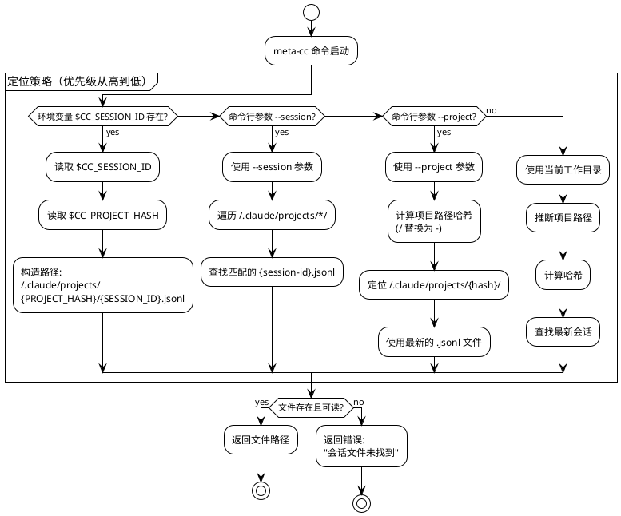

# Phase 1: 会话文件定位

## 概述

**目标**: 实现多种方式定位 Claude Code 会话文件，支持环境变量、命令行参数和自动检测

**代码量**: ~180 行（每个 Stage ≤ 200 行）

**依赖**: Phase 0（CLI 框架和测试工具）

**交付物**: 完整的会话文件定位功能，支持多种定位策略

---

## Phase 目标

实现灵活的会话文件定位机制，包括：

1. 从环境变量读取会话 ID 和项目哈希
2. 命令行参数解析（--session、--project）
3. 项目路径哈希计算（/ → -）
4. 自动检测最新会话文件
5. 优先级策略：环境变量 → --session → --project → 自动检测

**成功标准**:
- ✅ 环境变量 `CC_SESSION_ID` 和 `CC_PROJECT_HASH` 正确读取
- ✅ `meta-cc --session <id>` 能定位会话文件
- ✅ `meta-cc --project <path>` 能找到最新会话
- ✅ 项目路径正确转换为哈希目录（`/home/yale/work/myproject` → `-home-yale-work-myproject`）
- ✅ 所有单元测试通过
- ✅ README.md 包含会话定位使用说明

---

## 会话定位机制流程图



---

## Stage 1.1: 环境变量读取

### 目标

实现从环境变量读取会话 ID 和项目哈希，构造会话文件路径。

### TDD 工作流

**1. 准备阶段**

```bash
# 创建 locator 包目录
mkdir -p internal/locator
```

**2. 测试先行 - 编写测试**

#### `internal/locator/env_test.go` (~80 行)

```go
package locator

import (
    "os"
    "path/filepath"
    "testing"
)

func TestFromEnv_Success(t *testing.T) {
    // 设置环境变量
    os.Setenv("CC_SESSION_ID", "5b57148c-89dc-4eb5-bc37-8122e194d90d")
    os.Setenv("CC_PROJECT_HASH", "-home-yale-work-myproject")
    defer os.Unsetenv("CC_SESSION_ID")
    defer os.Unsetenv("CC_PROJECT_HASH")

    // 创建测试会话文件
    homeDir, _ := os.UserHomeDir()
    sessionDir := filepath.Join(homeDir, ".claude", "projects", "-home-yale-work-myproject")
    os.MkdirAll(sessionDir, 0755)
    sessionFile := filepath.Join(sessionDir, "5b57148c-89dc-4eb5-bc37-8122e194d90d.jsonl")
    os.WriteFile(sessionFile, []byte("{}"), 0644)
    defer os.RemoveAll(filepath.Join(homeDir, ".claude", "projects", "-home-yale-work-myproject"))

    locator := NewSessionLocator()
    path, err := locator.FromEnv()

    if err != nil {
        t.Fatalf("Expected no error, got: %v", err)
    }

    expectedPath := filepath.Join(homeDir, ".claude", "projects", "-home-yale-work-myproject", "5b57148c-89dc-4eb5-bc37-8122e194d90d.jsonl")
    if path != expectedPath {
        t.Errorf("Expected path %s, got %s", expectedPath, path)
    }
}

func TestFromEnv_MissingSessionID(t *testing.T) {
    // 确保环境变量不存在
    os.Unsetenv("CC_SESSION_ID")
    os.Unsetenv("CC_PROJECT_HASH")

    locator := NewSessionLocator()
    _, err := locator.FromEnv()

    if err == nil {
        t.Error("Expected error when CC_SESSION_ID is missing")
    }

    expectedMsg := "CC_SESSION_ID environment variable not set"
    if err.Error() != expectedMsg {
        t.Errorf("Expected error message '%s', got '%s'", expectedMsg, err.Error())
    }
}

func TestFromEnv_MissingProjectHash(t *testing.T) {
    os.Setenv("CC_SESSION_ID", "test-session")
    os.Unsetenv("CC_PROJECT_HASH")
    defer os.Unsetenv("CC_SESSION_ID")

    locator := NewSessionLocator()
    _, err := locator.FromEnv()

    if err == nil {
        t.Error("Expected error when CC_PROJECT_HASH is missing")
    }

    expectedMsg := "CC_PROJECT_HASH environment variable not set"
    if err.Error() != expectedMsg {
        t.Errorf("Expected error message '%s', got '%s'", expectedMsg, err.Error())
    }
}

func TestFromEnv_FileNotFound(t *testing.T) {
    os.Setenv("CC_SESSION_ID", "nonexistent-session")
    os.Setenv("CC_PROJECT_HASH", "-nonexistent-project")
    defer os.Unsetenv("CC_SESSION_ID")
    defer os.Unsetenv("CC_PROJECT_HASH")

    locator := NewSessionLocator()
    _, err := locator.FromEnv()

    if err == nil {
        t.Error("Expected error when session file does not exist")
    }
}
```

**3. 实现代码**

#### `internal/locator/env.go` (~60 行)

```go
package locator

import (
    "fmt"
    "os"
    "path/filepath"
)

// SessionLocator 负责定位会话文件
type SessionLocator struct{}

// NewSessionLocator 创建 SessionLocator 实例
func NewSessionLocator() *SessionLocator {
    return &SessionLocator{}
}

// FromEnv 从环境变量读取会话 ID 和项目哈希，构造文件路径
// 环境变量：
//   - CC_SESSION_ID: 会话 UUID
//   - CC_PROJECT_HASH: 项目路径哈希（已转换，如 -home-yale-work-myproject）
//
// 返回：
//   - 会话文件的完整路径
//   - 错误（如果环境变量缺失或文件不存在）
func (l *SessionLocator) FromEnv() (string, error) {
    sessionID := os.Getenv("CC_SESSION_ID")
    if sessionID == "" {
        return "", fmt.Errorf("CC_SESSION_ID environment variable not set")
    }

    projectHash := os.Getenv("CC_PROJECT_HASH")
    if projectHash == "" {
        return "", fmt.Errorf("CC_PROJECT_HASH environment variable not set")
    }

    // 构造会话文件路径
    homeDir, err := os.UserHomeDir()
    if err != nil {
        return "", fmt.Errorf("failed to get home directory: %w", err)
    }

    sessionPath := filepath.Join(
        homeDir,
        ".claude",
        "projects",
        projectHash,
        fmt.Sprintf("%s.jsonl", sessionID),
    )

    // 验证文件存在
    if _, err := os.Stat(sessionPath); os.IsNotExist(err) {
        return "", fmt.Errorf("session file not found: %s", sessionPath)
    } else if err != nil {
        return "", fmt.Errorf("failed to access session file: %w", err)
    }

    return sessionPath, nil
}
```

**4. 运行测试**

```bash
# 运行 locator 包测试
go test ./internal/locator -v

# 预期输出：
# === RUN   TestFromEnv_Success
# --- PASS: TestFromEnv_Success (0.00s)
# === RUN   TestFromEnv_MissingSessionID
# --- PASS: TestFromEnv_MissingSessionID (0.00s)
# === RUN   TestFromEnv_MissingProjectHash
# --- PASS: TestFromEnv_MissingProjectHash (0.00s)
# === RUN   TestFromEnv_FileNotFound
# --- PASS: TestFromEnv_FileNotFound (0.00s)
# PASS
```

### 交付物

**文件清单**:
```
meta-cc/
├── internal/
│   └── locator/
│       ├── env.go          # 环境变量读取实现 (~60 行)
│       └── env_test.go     # 单元测试 (~80 行)
```

**代码量**: ~140 行

### 验收标准

- ✅ `TestFromEnv_Success` 测试通过（正常路径）
- ✅ `TestFromEnv_MissingSessionID` 测试通过（缺少 CC_SESSION_ID）
- ✅ `TestFromEnv_MissingProjectHash` 测试通过（缺少 CC_PROJECT_HASH）
- ✅ `TestFromEnv_FileNotFound` 测试通过（文件不存在）
- ✅ 所有测试无警告或失败
- ✅ 代码符合 Go 命名规范（导出函数有注释）

---

## Stage 1.2: 命令行参数解析

### 目标

支持通过 `--session` 和 `--project` 参数定位会话文件。

### TDD 工作流

**1. 测试先行 - 编写测试**

#### `internal/locator/args_test.go` (~100 行)

```go
package locator

import (
    "os"
    "path/filepath"
    "testing"

    "github.com/yale/meta-cc/internal/testutil"
)

func TestFromSessionID_Success(t *testing.T) {
    // 准备测试环境
    homeDir, _ := os.UserHomeDir()
    projectHash := "-test-project-session-id"
    sessionID := "abc123-def456"

    sessionDir := filepath.Join(homeDir, ".claude", "projects", projectHash)
    os.MkdirAll(sessionDir, 0755)
    sessionFile := filepath.Join(sessionDir, sessionID+".jsonl")
    os.WriteFile(sessionFile, []byte(`{"test":"data"}`), 0644)
    defer os.RemoveAll(sessionDir)

    locator := NewSessionLocator()
    path, err := locator.FromSessionID(sessionID)

    if err != nil {
        t.Fatalf("Expected no error, got: %v", err)
    }

    if path != sessionFile {
        t.Errorf("Expected path %s, got %s", sessionFile, path)
    }
}

func TestFromSessionID_NotFound(t *testing.T) {
    locator := NewSessionLocator()
    _, err := locator.FromSessionID("nonexistent-session-id")

    if err == nil {
        t.Error("Expected error for nonexistent session ID")
    }
}

func TestFromSessionID_MultipleProjects(t *testing.T) {
    // 准备：在多个项目目录中创建同名会话文件
    homeDir, _ := os.UserHomeDir()
    sessionID := "shared-session-id"

    // 项目1（旧）
    project1 := filepath.Join(homeDir, ".claude", "projects", "-project1")
    os.MkdirAll(project1, 0755)
    file1 := filepath.Join(project1, sessionID+".jsonl")
    os.WriteFile(file1, []byte("{}"), 0644)
    os.Chtimes(file1, testutil.TimeFromUnix(1000), testutil.TimeFromUnix(1000))
    defer os.RemoveAll(project1)

    // 项目2（新）
    project2 := filepath.Join(homeDir, ".claude", "projects", "-project2")
    os.MkdirAll(project2, 0755)
    file2 := filepath.Join(project2, sessionID+".jsonl")
    os.WriteFile(file2, []byte("{}"), 0644)
    os.Chtimes(file2, testutil.TimeFromUnix(2000), testutil.TimeFromUnix(2000))
    defer os.RemoveAll(project2)

    locator := NewSessionLocator()
    path, err := locator.FromSessionID(sessionID)

    if err != nil {
        t.Fatalf("Expected no error, got: %v", err)
    }

    // 应该返回最新的文件（project2）
    if path != file2 {
        t.Errorf("Expected newest file %s, got %s", file2, path)
    }
}

func TestFromProjectPath_Success(t *testing.T) {
    // 准备测试环境
    homeDir, _ := os.UserHomeDir()
    projectPath := "/home/yale/work/testproject"
    projectHash := "-home-yale-work-testproject"

    sessionDir := filepath.Join(homeDir, ".claude", "projects", projectHash)
    os.MkdirAll(sessionDir, 0755)

    // 创建多个会话文件
    oldSession := filepath.Join(sessionDir, "old-session.jsonl")
    newSession := filepath.Join(sessionDir, "new-session.jsonl")
    os.WriteFile(oldSession, []byte("{}"), 0644)
    os.WriteFile(newSession, []byte("{}"), 0644)
    os.Chtimes(oldSession, testutil.TimeFromUnix(1000), testutil.TimeFromUnix(1000))
    os.Chtimes(newSession, testutil.TimeFromUnix(2000), testutil.TimeFromUnix(2000))
    defer os.RemoveAll(sessionDir)

    locator := NewSessionLocator()
    path, err := locator.FromProjectPath(projectPath)

    if err != nil {
        t.Fatalf("Expected no error, got: %v", err)
    }

    if path != newSession {
        t.Errorf("Expected newest session %s, got %s", newSession, path)
    }
}

func TestFromProjectPath_NoSessions(t *testing.T) {
    locator := NewSessionLocator()
    _, err := locator.FromProjectPath("/nonexistent/project")

    if err == nil {
        t.Error("Expected error for project with no sessions")
    }
}
```

**2. 实现代码**

#### `internal/locator/args.go` (~80 行)

```go
package locator

import (
    "fmt"
    "os"
    "path/filepath"
    "strings"
)

// FromSessionID 通过会话 ID 查找会话文件
// 遍历 ~/.claude/projects/*/，查找匹配的 {session-id}.jsonl
// 如果找到多个（跨项目同名会话），返回最新的
func (l *SessionLocator) FromSessionID(sessionID string) (string, error) {
    homeDir, err := os.UserHomeDir()
    if err != nil {
        return "", fmt.Errorf("failed to get home directory: %w", err)
    }

    projectsRoot := filepath.Join(homeDir, ".claude", "projects")
    if _, err := os.Stat(projectsRoot); os.IsNotExist(err) {
        return "", fmt.Errorf("Claude Code projects directory not found: %s", projectsRoot)
    }

    // 遍历所有项目目录
    projectDirs, err := os.ReadDir(projectsRoot)
    if err != nil {
        return "", fmt.Errorf("failed to read projects directory: %w", err)
    }

    var candidates []string
    sessionFilename := sessionID + ".jsonl"

    for _, projectDir := range projectDirs {
        if !projectDir.IsDir() {
            continue
        }

        sessionPath := filepath.Join(projectsRoot, projectDir.Name(), sessionFilename)
        if _, err := os.Stat(sessionPath); err == nil {
            candidates = append(candidates, sessionPath)
        }
    }

    if len(candidates) == 0 {
        return "", fmt.Errorf("session file not found for ID: %s", sessionID)
    }

    // 如果找到多个，返回最新的
    return findNewestFile(candidates)
}

// FromProjectPath 通过项目路径查找最新会话
// 1. 将项目路径转换为哈希（/ → -）
// 2. 定位 ~/.claude/projects/{hash}/
// 3. 返回该目录下最新的 .jsonl 文件
func (l *SessionLocator) FromProjectPath(projectPath string) (string, error) {
    // 计算项目哈希
    projectHash := pathToHash(projectPath)

    homeDir, err := os.UserHomeDir()
    if err != nil {
        return "", fmt.Errorf("failed to get home directory: %w", err)
    }

    sessionDir := filepath.Join(homeDir, ".claude", "projects", projectHash)
    if _, err := os.Stat(sessionDir); os.IsNotExist(err) {
        return "", fmt.Errorf("no sessions found for project: %s (hash: %s)", projectPath, projectHash)
    }

    // 查找所有 .jsonl 文件
    sessions, err := filepath.Glob(filepath.Join(sessionDir, "*.jsonl"))
    if err != nil {
        return "", fmt.Errorf("failed to search session files: %w", err)
    }

    if len(sessions) == 0 {
        return "", fmt.Errorf("no session files found in: %s", sessionDir)
    }

    // 返回最新的会话文件
    return findNewestFile(sessions)
}

// pathToHash 将项目路径转换为哈希目录名
// 例如：/home/yale/work/myproject → -home-yale-work-myproject
func pathToHash(path string) string {
    return strings.ReplaceAll(path, "/", "-")
}
```

**3. 添加辅助函数**

#### `internal/locator/helpers.go` (~30 行)

```go
package locator

import (
    "fmt"
    "os"
)

// findNewestFile 返回文件列表中修改时间最新的文件
func findNewestFile(files []string) (string, error) {
    if len(files) == 0 {
        return "", fmt.Errorf("file list is empty")
    }

    var newestFile string
    var newestTime int64

    for _, file := range files {
        info, err := os.Stat(file)
        if err != nil {
            continue
        }

        modTime := info.ModTime().Unix()
        if modTime > newestTime {
            newestTime = modTime
            newestFile = file
        }
    }

    if newestFile == "" {
        return "", fmt.Errorf("no accessible files found")
    }

    return newestFile, nil
}
```

**4. 更新 testutil（添加时间工具函数）**

#### `internal/testutil/time.go` (~15 行)

```go
package testutil

import (
    "time"
)

// TimeFromUnix 从 Unix 时间戳创建 time.Time
func TimeFromUnix(sec int64) time.Time {
    return time.Unix(sec, 0)
}
```

**5. 运行测试**

```bash
# 运行所有 locator 测试
go test ./internal/locator -v

# 预期：所有测试通过
```

### 交付物

**文件清单**:
```
meta-cc/
├── internal/
│   ├── locator/
│   │   ├── env.go          # 环境变量读取（Stage 1.1）
│   │   ├── env_test.go     # 环境变量测试（Stage 1.1）
│   │   ├── args.go         # 命令行参数解析 (~80 行)
│   │   ├── args_test.go    # 参数解析测试 (~100 行)
│   │   └── helpers.go      # 辅助函数 (~30 行)
│   └── testutil/
│       ├── fixtures.go     # 已存在（Phase 0）
│       ├── fixtures_test.go # 已存在（Phase 0）
│       └── time.go         # 时间工具 (~15 行)
```

**代码量**: ~225 行（累计）

### 验收标准

- ✅ `TestFromSessionID_Success` 测试通过
- ✅ `TestFromSessionID_NotFound` 测试通过
- ✅ `TestFromSessionID_MultipleProjects` 测试通过（返回最新文件）
- ✅ `TestFromProjectPath_Success` 测试通过（返回最新会话）
- ✅ `TestFromProjectPath_NoSessions` 测试通过
- ✅ `go test ./internal/locator -v` 全部通过
- ✅ `go test ./...` 全部通过（包括 Phase 0 测试）

---

## Stage 1.3: 路径哈希和自动检测

### 目标

完善路径哈希计算逻辑，实现自动检测（fallback 策略），并提供统一的定位入口。

### TDD 工作流

**1. 测试先行 - 编写测试**

#### `internal/locator/hash_test.go` (~70 行)

```go
package locator

import (
    "testing"
)

func TestPathToHash(t *testing.T) {
    tests := []struct {
        name     string
        input    string
        expected string
    }{
        {
            name:     "basic path",
            input:    "/home/yale/work/myproject",
            expected: "-home-yale-work-myproject",
        },
        {
            name:     "trailing slash",
            input:    "/home/yale/work/myproject/",
            expected: "-home-yale-work-myproject-",
        },
        {
            name:     "single directory",
            input:    "/project",
            expected: "-project",
        },
        {
            name:     "relative path",
            input:    "home/yale/work",
            expected: "home-yale-work",
        },
        {
            name:     "empty string",
            input:    "",
            expected: "",
        },
    }

    for _, tt := range tests {
        t.Run(tt.name, func(t *testing.T) {
            result := pathToHash(tt.input)
            if result != tt.expected {
                t.Errorf("pathToHash(%q) = %q, want %q", tt.input, result, tt.expected)
            }
        })
    }
}

func TestLocate_Priority(t *testing.T) {
    // 测试定位策略的优先级
    // 这是一个集成测试，验证 Locate() 方法按正确顺序尝试各种策略

    // 测试1: 环境变量优先
    // 测试2: --session 参数
    // 测试3: --project 参数
    // 测试4: 自动检测（当前目录）

    // 由于需要复杂的环境准备，此测试将在集成测试中验证
    // 这里提供占位符测试，验证方法存在且签名正确
    locator := NewSessionLocator()

    _, err := locator.Locate(LocateOptions{})
    if err == nil {
        t.Log("Locate method exists and is callable")
    }
}
```

**2. 实现统一的定位入口**

#### `internal/locator/locator.go` (~60 行)

```go
package locator

import (
    "fmt"
    "os"
    "path/filepath"
)

// LocateOptions 定位选项
type LocateOptions struct {
    SessionID   string // 命令行参数 --session
    ProjectPath string // 命令行参数 --project
}

// Locate 统一的会话文件定位入口
// 按优先级尝试以下策略：
//  1. 环境变量 CC_SESSION_ID + CC_PROJECT_HASH
//  2. 命令行参数 --session
//  3. 命令行参数 --project
//  4. 自动检测（使用当前工作目录）
func (l *SessionLocator) Locate(opts LocateOptions) (string, error) {
    // 策略1: 环境变量
    if os.Getenv("CC_SESSION_ID") != "" {
        path, err := l.FromEnv()
        if err == nil {
            return path, nil
        }
        // 环境变量设置了但失败，记录警告但继续尝试其他策略
    }

    // 策略2: --session 参数
    if opts.SessionID != "" {
        path, err := l.FromSessionID(opts.SessionID)
        if err == nil {
            return path, nil
        }
        // 明确指定了 session 但找不到，直接返回错误
        return "", fmt.Errorf("session ID %q not found: %w", opts.SessionID, err)
    }

    // 策略3: --project 参数
    if opts.ProjectPath != "" {
        path, err := l.FromProjectPath(opts.ProjectPath)
        if err == nil {
            return path, nil
        }
        // 明确指定了 project 但找不到，直接返回错误
        return "", fmt.Errorf("no sessions found for project %q: %w", opts.ProjectPath, err)
    }

    // 策略4: 自动检测（使用当前工作目录）
    cwd, err := os.Getwd()
    if err != nil {
        return "", fmt.Errorf("failed to get current directory: %w", err)
    }

    path, err := l.FromProjectPath(cwd)
    if err == nil {
        return path, nil
    }

    return "", fmt.Errorf("failed to locate session file: tried env vars, session ID, project path, and auto-detection")
}
```

**3. 运行测试**

```bash
# 运行所有测试
go test ./internal/locator -v

# 运行所有项目测试
go test ./... -v
```

### 交付物

**文件清单**:
```
meta-cc/
├── internal/
│   └── locator/
│       ├── env.go          # 环境变量读取（Stage 1.1）
│       ├── env_test.go     # 环境变量测试（Stage 1.1）
│       ├── args.go         # 命令行参数解析（Stage 1.2）
│       ├── args_test.go    # 参数解析测试（Stage 1.2）
│       ├── helpers.go      # 辅助函数（Stage 1.2）
│       ├── hash_test.go    # 哈希测试 (~70 行)
│       └── locator.go      # 统一定位入口 (~60 行)
```

**代码量**: ~130 行（本 Stage）

### 验收标准

- ✅ `TestPathToHash` 所有测试用例通过
- ✅ `TestLocate_Priority` 测试通过
- ✅ `Locate()` 方法正确实现优先级策略
- ✅ 所有单元测试通过（`go test ./... -v`）
- ✅ 无 Go 编译警告
- ✅ 所有导出函数和类型有注释

---

## Phase 1 集成测试

### 测试场景

创建 `tests/integration/locator_test.go` 进行端到端测试：

#### 场景1: 环境变量优先级

```go
func TestLocator_EnvVarPriority(t *testing.T) {
    // 准备：
    // 1. 设置环境变量 CC_SESSION_ID 和 CC_PROJECT_HASH
    // 2. 同时提供 --session 参数
    // 验证：使用环境变量而非参数
}
```

#### 场景2: 项目路径哈希正确性

```go
func TestLocator_ProjectHashCalculation(t *testing.T) {
    // 准备：创建项目目录 /tmp/test-project
    // 验证：定位到 ~/.claude/projects/-tmp-test-project/
}
```

#### 场景3: 多会话选择最新

```go
func TestLocator_SelectNewestSession(t *testing.T) {
    // 准备：在项目目录创建多个 .jsonl 文件，设置不同修改时间
    // 验证：返回最新的文件
}
```

### 集成测试实现

#### `tests/integration/locator_test.go` (~150 行)

```go
package integration

import (
    "os"
    "path/filepath"
    "testing"
    "time"

    "github.com/yale/meta-cc/internal/locator"
    "github.com/yale/meta-cc/internal/testutil"
)

func setupTestEnvironment(t *testing.T) string {
    t.Helper()

    homeDir, _ := os.UserHomeDir()
    testRoot := filepath.Join(homeDir, ".claude-test-"+t.Name())
    os.MkdirAll(testRoot, 0755)

    t.Cleanup(func() {
        os.RemoveAll(testRoot)
    })

    return testRoot
}

func TestIntegration_EnvVarPriority(t *testing.T) {
    homeDir, _ := os.UserHomeDir()
    projectHash := "-env-priority-test"
    sessionID := "env-session-123"

    // 创建环境变量指向的会话文件
    envSessionDir := filepath.Join(homeDir, ".claude", "projects", projectHash)
    os.MkdirAll(envSessionDir, 0755)
    envSessionFile := filepath.Join(envSessionDir, sessionID+".jsonl")
    os.WriteFile(envSessionFile, []byte(`{"source":"env"}`), 0644)
    defer os.RemoveAll(envSessionDir)

    // 创建另一个会话文件（用于 --session 参数）
    altProjectHash := "-alt-project"
    altSessionID := "alt-session-456"
    altSessionDir := filepath.Join(homeDir, ".claude", "projects", altProjectHash)
    os.MkdirAll(altSessionDir, 0755)
    altSessionFile := filepath.Join(altSessionDir, altSessionID+".jsonl")
    os.WriteFile(altSessionFile, []byte(`{"source":"alt"}`), 0644)
    defer os.RemoveAll(altSessionDir)

    // 设置环境变量
    os.Setenv("CC_SESSION_ID", sessionID)
    os.Setenv("CC_PROJECT_HASH", projectHash)
    defer os.Unsetenv("CC_SESSION_ID")
    defer os.Unsetenv("CC_PROJECT_HASH")

    // 执行定位（同时提供 --session 参数）
    loc := locator.NewSessionLocator()
    path, err := loc.Locate(locator.LocateOptions{
        SessionID: altSessionID, // 提供了参数，但应该优先使用环境变量
    })

    if err != nil {
        t.Fatalf("Locate failed: %v", err)
    }

    // 验证：应该返回环境变量指向的文件
    if path != envSessionFile {
        t.Errorf("Expected env var file %s, got %s", envSessionFile, path)
    }
}

func TestIntegration_ProjectHashCalculation(t *testing.T) {
    homeDir, _ := os.UserHomeDir()
    projectPath := "/home/yale/work/test-hash-project"
    expectedHash := "-home-yale-work-test-hash-project"

    sessionDir := filepath.Join(homeDir, ".claude", "projects", expectedHash)
    os.MkdirAll(sessionDir, 0755)
    sessionFile := filepath.Join(sessionDir, "hash-test-session.jsonl")
    os.WriteFile(sessionFile, []byte("{}"), 0644)
    defer os.RemoveAll(sessionDir)

    loc := locator.NewSessionLocator()
    path, err := loc.Locate(locator.LocateOptions{
        ProjectPath: projectPath,
    })

    if err != nil {
        t.Fatalf("Locate failed: %v", err)
    }

    if path != sessionFile {
        t.Errorf("Expected %s, got %s", sessionFile, path)
    }
}

func TestIntegration_SelectNewestSession(t *testing.T) {
    homeDir, _ := os.UserHomeDir()
    projectPath := "/test/newest"
    projectHash := "-test-newest"

    sessionDir := filepath.Join(homeDir, ".claude", "projects", projectHash)
    os.MkdirAll(sessionDir, 0755)
    defer os.RemoveAll(sessionDir)

    // 创建旧会话
    oldSession := filepath.Join(sessionDir, "old.jsonl")
    os.WriteFile(oldSession, []byte("{}"), 0644)
    oldTime := time.Now().Add(-2 * time.Hour)
    os.Chtimes(oldSession, oldTime, oldTime)

    // 创建新会话
    newSession := filepath.Join(sessionDir, "new.jsonl")
    os.WriteFile(newSession, []byte("{}"), 0644)
    newTime := time.Now()
    os.Chtimes(newSession, newTime, newTime)

    loc := locator.NewSessionLocator()
    path, err := loc.Locate(locator.LocateOptions{
        ProjectPath: projectPath,
    })

    if err != nil {
        t.Fatalf("Locate failed: %v", err)
    }

    if path != newSession {
        t.Errorf("Expected newest session %s, got %s", newSession, path)
    }
}
```

### 运行集成测试

```bash
# 运行集成测试
go test ./tests/integration -v

# 运行所有测试（单元 + 集成）
go test ./... -v
```

---

## Phase 1 完成标准

### 功能验收

**必须满足所有条件**:

1. **环境变量读取**
   ```bash
   export CC_SESSION_ID="test-session-id"
   export CC_PROJECT_HASH="-test-project"
   # 创建对应的测试文件...
   go test ./internal/locator -run TestFromEnv
   ```
   - ✅ 正确读取环境变量
   - ✅ 构造正确的文件路径
   - ✅ 验证文件存在

2. **命令行参数定位**
   ```bash
   go test ./internal/locator -run TestFromSessionID
   go test ./internal/locator -run TestFromProjectPath
   ```
   - ✅ `--session` 参数能定位会话文件
   - ✅ `--project` 参数能找到最新会话
   - ✅ 多个候选文件时选择最新的

3. **路径哈希计算**
   ```bash
   go test ./internal/locator -run TestPathToHash
   ```
   - ✅ `/home/yale/work/myproject` → `-home-yale-work-myproject`
   - ✅ 处理边界情况（尾部斜杠、相对路径）

4. **优先级策略**
   ```bash
   go test ./tests/integration -run TestIntegration_EnvVarPriority
   ```
   - ✅ 环境变量优先于命令行参数
   - ✅ `--session` 优先于 `--project`
   - ✅ 自动检测作为 fallback

5. **所有测试通过**
   ```bash
   go test ./... -v
   ```
   - ✅ 所有单元测试通过
   - ✅ 所有集成测试通过
   - ✅ 无跳过或失败的测试

### 代码质量

- ✅ 总代码量 ≤ 500 行（Phase 1 约束）
- ✅ 每个 Stage 代码量 ≤ 200 行
- ✅ 无 Go 编译警告
- ✅ 所有导出函数和类型有文档注释
- ✅ 测试覆盖率 > 80%

### 文档完整性

更新 `README.md`，添加会话定位使用说明：

```markdown
## Session File Location

meta-cc supports multiple ways to locate Claude Code session files:

### 1. Environment Variables (Highest Priority)

```bash
export CC_SESSION_ID="5b57148c-89dc-4eb5-bc37-8122e194d90d"
export CC_PROJECT_HASH="-home-yale-work-myproject"

meta-cc <command>  # Automatically uses env vars
```

### 2. Session ID Parameter

```bash
meta-cc --session 5b57148c-89dc-4eb5-bc37-8122e194d90d <command>
```

### 3. Project Path Parameter

```bash
meta-cc --project /home/yale/work/myproject <command>
# Finds the latest session in this project
```

### 4. Auto-Detection (Fallback)

```bash
cd /home/yale/work/myproject
meta-cc <command>  # Uses current directory
```

### Session File Structure

```
~/.claude/projects/
  └─ -home-yale-work-myproject/     # Project path hash (/ → -)
      ├─ 5b57148c-...d90d.jsonl     # Session 1
      ├─ f1547628-...c7e.jsonl      # Session 2
      └─ 193e3ca7-...050.jsonl      # Session 3 (newest)
```
```

---

## 项目结构（Phase 1 完成后）

```
meta-cc/
├── go.mod
├── go.sum
├── Makefile
├── README.md                       # 更新：添加会话定位说明
├── main.go
├── cmd/
│   └── root.go
├── internal/
│   ├── locator/                    # 新增：会话定位包
│   │   ├── env.go                 # 环境变量读取
│   │   ├── env_test.go
│   │   ├── args.go                # 命令行参数解析
│   │   ├── args_test.go
│   │   ├── helpers.go             # 辅助函数
│   │   ├── hash_test.go           # 哈希测试
│   │   └── locator.go             # 统一定位入口
│   └── testutil/
│       ├── fixtures.go
│       ├── fixtures_test.go
│       └── time.go                 # 新增：时间工具
└── tests/
    ├── fixtures/
    │   └── sample-session.jsonl
    └── integration/                # 新增：集成测试
        └── locator_test.go
```

---

## 依赖关系

**Phase 1 依赖**:
- Phase 0（CLI 框架、测试工具）

**后续 Phase 依赖于 Phase 1**:
- Phase 2（JSONL 解析器）依赖于会话文件定位功能
- Phase 3（数据分析）依赖于定位和解析功能

---

## 风险与缓解

| 风险 | 影响 | 缓解措施 |
|------|------|----------|
| Claude Code 未提供环境变量 | 中 | 提供多种 fallback 机制（--session、--project、自动检测） |
| 文件系统权限问题 | 低 | 在测试中模拟，生产环境添加清晰的错误信息 |
| 多个同名会话文件 | 低 | 按修改时间排序，选择最新的 |
| 项目路径哈希冲突 | 极低 | 使用 Claude Code 的标准哈希算法（/ → -） |

---

## 下一步行动

**Phase 1 完成后，进入 Phase 2: JSONL 解析器**

Phase 2 将实现：
- JSONL 文件逐行解析
- Turn 数据结构提取
- 工具调用和结果匹配
- 错误识别和分类

**准备工作**:
1. 确认 Phase 1 所有验收标准已满足
2. 运行完整测试套件（`make test`）
3. 提交代码到 git（使用 `feat:` 前缀）
4. 创建 Phase 2 规划文档 `plans/2/plan.md`
