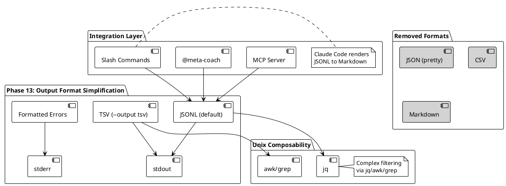

# Phase 13: 输出格式简化与一致性（Output Format Simplification）

## 概述

**目标**: 简化输出格式为 JSONL 和 TSV 两种核心格式，强化格式一致性和错误处理，对齐 Unix 哲学

**代码量**: ~400 行（Go 源代码）

**依赖**: Phase 0-12（完整的 meta-cc CLI 工具链 + MCP Server + 项目级查询）

**交付物**:
- 移除冗余格式（JSON pretty, CSV, Markdown）
- 增强 TSV 支持所有数据类型（泛型投影）
- 统一错误处理（格式化错误输出）
- 更新文档和集成配置（Slash Commands、MCP Server）
- Unix 可组合性文档和示例

---

## Phase 目标

解决当前输出格式的三大核心问题：

### 核心问题

1. **格式冗余**：5 种格式（JSON, JSONL, CSV, TSV, Markdown）维护成本高，部分格式使用率低
2. **格式不一致**：错误场景和正常场景输出格式不同，破坏可组合性
3. **职责不清**：meta-cc 做了过多渲染工作（Markdown），应交给 Claude Code

### 解决方案架构

Phase 13 实现双格式策略：



### 设计原则

1. **双格式原则**: 只保留 JSONL（机器处理）和 TSV（CLI 工具友好）
2. **格式一致性**: 所有场景（正常/异常）都输出有效格式
3. **数据日志分离**: stdout=数据，stderr=诊断日志
4. **Unix 可组合性**: meta-cc 提供简单检索，复杂过滤交给 jq/awk/grep
5. **无自动降级**: 移除格式降级逻辑，客户端负责渲染

---

## 成功标准

**功能验收**:
- ✅ 所有 Stage 单元测试通过（TDD）
- ✅ JSONL 默认输出（所有命令）
- ✅ TSV 支持所有数据类型（ToolCall, SessionStats, ErrorPattern, AggregatedStats, TimeSeriesData）
- ✅ 错误场景输出格式一致（JSONL 格式 error 对象 / TSV 格式 stderr）
- ✅ jq/awk 管道处理验证
- ✅ Slash Commands 更新并正常工作
- ✅ MCP Server 正常工作（JSONL 输出）

**集成验收**:
- ✅ `/meta-stats` 接收 JSONL，Claude 渲染 Markdown
- ✅ `/meta-errors` 接收 JSONL，Claude 渲染 Markdown
- ✅ `/meta-query-tools` 接收 JSONL
- ✅ MCP Server 工具返回 JSONL
- ✅ `docs/cli-composability.md` 完整更新

**代码质量**:
- ✅ 实际代码量: ~400 行（含删除和新增）
  - Stage 13.1: ~100 lines（移除格式）
  - Stage 13.2: ~120 lines（增强 TSV）
  - Stage 13.3: ~100 lines（错误处理）
  - Stage 13.4: ~80 lines（文档更新）
- ✅ 每个 Stage ≤ 200 行
- ✅ 测试覆盖率: ≥ 80%

---

## Stage 13.1: 移除冗余格式

### 目标

移除 JSON pretty、CSV、Markdown 格式化器，简化输出逻辑为 JSONL 默认。

### 实现步骤

#### 1. 移除 JSON pretty 格式化器

**文件**: `pkg/output/json.go`（删除 ~15 行）

**现状**:
```go
// FormatJSON formats any data as pretty-printed JSON
func FormatJSON(data interface{}) (string, error) {
    output, err := json.MarshalIndent(data, "", "  ")
    if err != nil {
        return "", fmt.Errorf("failed to marshal JSON: %w", err)
    }
    return string(output), nil
}
```

**保留策略**:
- 保留此函数，但仅用于错误输出（格式化 error 对象）
- 正常输出不再使用 pretty print
- 重命名为 `FormatErrorJSON` 明确用途

**修改后**:
```go
// FormatErrorJSON formats error objects as JSON for stderr output
func FormatErrorJSON(err error, code string) (string, error) {
    errObj := map[string]interface{}{
        "error": err.Error(),
        "code":  code,
    }
    output, marshalErr := json.Marshal(errObj)
    if marshalErr != nil {
        return "", fmt.Errorf("failed to marshal error JSON: %w", marshalErr)
    }
    return string(output), nil
}
```

#### 2. 移除 CSV 格式化器

**文件**: `pkg/output/csv.go`（删除整个文件 ~71 行）

**操作**:
```bash
rm pkg/output/csv.go
```

**理由**:
- CSV 格式与 TSV 功能重叠
- TSV 更简洁（无引号转义），更适合 Unix 管道
- 无已知用户依赖 CSV 格式

#### 3. 移除 Markdown 格式化器

**文件**: `pkg/output/markdown.go`（删除整个文件 ~204 行）

**操作**:
```bash
rm pkg/output/markdown.go
```

**理由**:
- Markdown 渲染应由 Claude Code 完成（基于 JSONL）
- meta-cc 不应做展示层工作
- 减少维护成本

#### 4. 更新命令参数验证

**文件**: `cmd/root.go`（修改 ~5 行）

**现状**:
```go
rootCmd.PersistentFlags().StringVarP(&outputFormat, "output", "o", "json", "Output format: json|md|csv|tsv")
```

**修改后**:
```go
rootCmd.PersistentFlags().StringVarP(&outputFormat, "output", "o", "jsonl", "Output format: jsonl|tsv")
```

**注意**:
- 默认格式改为 `jsonl`（明确表示 JSONL）
- 仅支持 `jsonl` 和 `tsv` 两种格式
- 保持 `--output` 简写 `-o`

#### 5. 更新所有命令的格式验证

**文件**: `cmd/parse.go`, `cmd/query_tools.go`, `cmd/analyze_sequences.go` 等（修改 ~30 行）

**现状示例** (`cmd/parse.go:147`):
```go
switch outputFormat {
case "json":
    return output.FormatJSON(toolCalls)
case "md":
    return output.FormatMarkdown(toolCalls)
case "csv":
    return output.FormatCSV(toolCalls)
case "tsv":
    return output.FormatTSV(toolCalls)
default:
    return fmt.Errorf("unsupported output format: %s", outputFormat)
}
```

**修改后**:
```go
switch outputFormat {
case "jsonl":
    return output.FormatJSONL(toolCalls)
case "tsv":
    return output.FormatTSV(toolCalls)
default:
    return fmt.Errorf("unsupported output format: %s (supported: jsonl, tsv)", outputFormat)
}
```

**需要修改的文件**:
- `cmd/parse.go`: `runParseExtract`, `runParseStats`
- `cmd/query_tools.go`: `runQueryTools`
- `cmd/query_user_messages.go`: `runQueryUserMessages`
- `cmd/query_context.go`: `runQueryContext`
- `cmd/query_file_access.go`: `runQueryFileAccess`
- `cmd/query_tool_sequences.go`: `runQueryToolSequences`
- `cmd/query_project_state.go`: `runQueryProjectState`
- `cmd/query_successful_prompts.go`: `runQuerySuccessfulPrompts`
- `cmd/analyze_sequences.go`: `runAnalyzeSequences`
- `cmd/stats_aggregate.go`: `runStatsAggregate`
- `cmd/stats_timeseries.go`: `runStatsTimeSeries`
- `cmd/stats_files.go`: `runStatsFiles`

**统一处理函数** (新增 `internal/output/format.go`):
```go
package output

import "fmt"

// FormatOutput formats data based on the output format
func FormatOutput(data interface{}, format string) (string, error) {
    switch format {
    case "jsonl":
        return FormatJSONL(data)
    case "tsv":
        return FormatTSV(data)
    default:
        return "", fmt.Errorf("unsupported output format: %s (supported: jsonl, tsv)", format)
    }
}
```

### TDD 步骤

**测试文件**: `pkg/output/format_test.go`（新建，~60 行）

```go
package output

import (
    "testing"
    "github.com/yale/meta-cc/internal/parser"
    "github.com/yale/meta-cc/internal/testutil"
)

func TestFormatOutput_JSONL(t *testing.T) {
    tools := testutil.GenerateToolCalls(5)

    output, err := FormatOutput(tools, "jsonl")
    if err != nil {
        t.Fatalf("FormatOutput failed: %v", err)
    }

    // Verify JSONL format (one JSON object per line)
    lines := strings.Split(strings.TrimSpace(output), "\n")
    if len(lines) != 5 {
        t.Errorf("expected 5 lines, got %d", len(lines))
    }

    // Verify each line is valid JSON
    for i, line := range lines {
        var tool parser.ToolCall
        if err := json.Unmarshal([]byte(line), &tool); err != nil {
            t.Errorf("line %d is not valid JSON: %v", i, err)
        }
    }
}

func TestFormatOutput_TSV(t *testing.T) {
    tools := testutil.GenerateToolCalls(5)

    output, err := FormatOutput(tools, "tsv")
    if err != nil {
        t.Fatalf("FormatOutput failed: %v", err)
    }

    // Verify TSV format (tab-separated values)
    lines := strings.Split(strings.TrimSpace(output), "\n")
    if len(lines) != 6 { // header + 5 data rows
        t.Errorf("expected 6 lines (1 header + 5 data), got %d", len(lines))
    }

    // Verify header
    header := lines[0]
    if !strings.Contains(header, "\t") {
        t.Error("header should be tab-separated")
    }
}

func TestFormatOutput_UnsupportedFormat(t *testing.T) {
    tools := testutil.GenerateToolCalls(5)

    _, err := FormatOutput(tools, "json")
    if err == nil {
        t.Error("expected error for unsupported format 'json'")
    }

    if !strings.Contains(err.Error(), "unsupported output format") {
        t.Errorf("expected unsupported format error, got: %v", err)
    }
}

func TestFormatErrorJSON(t *testing.T) {
    err := errors.New("test error")

    output, formatErr := FormatErrorJSON(err, "TEST_ERROR")
    if formatErr != nil {
        t.Fatalf("FormatErrorJSON failed: %v", formatErr)
    }

    // Verify JSON structure
    var errObj map[string]string
    if err := json.Unmarshal([]byte(output), &errObj); err != nil {
        t.Fatalf("output is not valid JSON: %v", err)
    }

    if errObj["error"] != "test error" {
        t.Errorf("expected error='test error', got '%s'", errObj["error"])
    }

    if errObj["code"] != "TEST_ERROR" {
        t.Errorf("expected code='TEST_ERROR', got '%s'", errObj["code"])
    }
}
```

**测试执行**:
```bash
# Run tests for Stage 13.1
go test ./pkg/output -v -run TestFormat

# Verify all command tests still pass
go test ./cmd -v
```

### 交付物

**新增**:
- `internal/output/format.go`: 统一格式化函数（~30 行）
- `pkg/output/format_test.go`: 格式化测试（~60 行）

**修改**:
- `cmd/root.go`: 更新 `--output` 标志描述（~5 行）
- `pkg/output/json.go`: 重命名为 `FormatErrorJSON`（~10 行）
- 12 个命令文件: 更新格式验证逻辑（~30 行）

**删除**:
- `pkg/output/csv.go`: 删除整个文件（~71 行）
- `pkg/output/markdown.go`: 删除整个文件（~204 行）

**净变化**: -275 lines (删除) + 105 lines (新增) = **-170 lines**

---

## Stage 13.2: 增强 TSV 支持所有数据类型

### 目标

扩展 TSV 格式化器支持所有 meta-cc 数据类型（ToolCall, SessionStats, ErrorPattern, AggregatedStats, TimeSeriesData），实现泛型投影机制。

### 实现步骤

#### 1. 当前 TSV 实现分析

**文件**: `pkg/output/tsv.go`（当前 ~50 行）

**现状**:
```go
// FormatTSV formats data as TSV
// Currently only supports ToolCall arrays
func FormatTSV(data interface{}) (string, error) {
    switch v := data.(type) {
    case []parser.ToolCall:
        return formatToolCallsTSV(v)
    default:
        return "", fmt.Errorf("unsupported data type for TSV formatting")
    }
}

func formatToolCallsTSV(toolCalls []parser.ToolCall) (string, error) {
    var sb strings.Builder

    // Header
    sb.WriteString("UUID\tToolName\tStatus\tError\n")

    // Data rows
    for _, tc := range toolCalls {
        sb.WriteString(fmt.Sprintf("%s\t%s\t%s\t%s\n",
            tc.UUID,
            tc.ToolName,
            tc.Status,
            tc.Error,
        ))
    }

    return sb.String(), nil
}
```

**问题**:
- 仅支持 `ToolCall` 类型
- 字段硬编码，无法自定义投影
- 不支持嵌套结构（如 `Input`, `Output`）

#### 2. 泛型 TSV 格式化器设计

**文件**: `pkg/output/tsv.go`（扩展到 ~120 行）

**新增接口**:
```go
package output

import (
    "encoding/json"
    "fmt"
    "reflect"
    "strings"

    "github.com/yale/meta-cc/internal/analyzer"
    "github.com/yale/meta-cc/internal/parser"
)

// TSVFieldExtractor defines how to extract fields from a struct
type TSVFieldExtractor interface {
    GetHeaders() []string
    GetRow(data interface{}) []string
}

// FormatTSV formats data as TSV
// Supports: ToolCall, SessionStats, ErrorPattern, AggregatedStats, TimeSeriesData
func FormatTSV(data interface{}) (string, error) {
    switch v := data.(type) {
    case []parser.ToolCall:
        return formatSliceTSV(v, &ToolCallExtractor{})
    case []analyzer.ErrorPattern:
        return formatSliceTSV(v, &ErrorPatternExtractor{})
    case []analyzer.AggregatedStats:
        return formatSliceTSV(v, &AggregatedStatsExtractor{})
    case []analyzer.TimeSeriesData:
        return formatSliceTSV(v, &TimeSeriesDataExtractor{})
    case parser.SessionStats:
        return formatSingleObjectTSV(v, &SessionStatsExtractor{})
    default:
        // Fallback: use reflection to format any struct
        return formatGenericTSV(data)
    }
}

// formatSliceTSV formats a slice of data using an extractor
func formatSliceTSV(data interface{}, extractor TSVFieldExtractor) (string, error) {
    var sb strings.Builder

    // Header
    headers := extractor.GetHeaders()
    sb.WriteString(strings.Join(headers, "\t"))
    sb.WriteString("\n")

    // Data rows
    v := reflect.ValueOf(data)
    for i := 0; i < v.Len(); i++ {
        row := extractor.GetRow(v.Index(i).Interface())
        sb.WriteString(strings.Join(row, "\t"))
        sb.WriteString("\n")
    }

    return sb.String(), nil
}

// formatSingleObjectTSV formats a single object as vertical key-value TSV
func formatSingleObjectTSV(data interface{}, extractor TSVFieldExtractor) (string, error) {
    var sb strings.Builder

    headers := extractor.GetHeaders()
    row := extractor.GetRow(data)

    // Vertical format: Key\tValue
    for i, header := range headers {
        sb.WriteString(fmt.Sprintf("%s\t%s\n", header, row[i]))
    }

    return sb.String(), nil
}

// formatGenericTSV formats any struct using reflection (fallback)
func formatGenericTSV(data interface{}) (string, error) {
    // Use reflection to extract all exported fields
    v := reflect.ValueOf(data)

    // Handle slice
    if v.Kind() == reflect.Slice {
        if v.Len() == 0 {
            return "", nil
        }

        // Get headers from first element
        elem := v.Index(0)
        headers := getStructFields(elem)

        var sb strings.Builder
        sb.WriteString(strings.Join(headers, "\t"))
        sb.WriteString("\n")

        // Get rows
        for i := 0; i < v.Len(); i++ {
            row := getStructValues(v.Index(i))
            sb.WriteString(strings.Join(row, "\t"))
            sb.WriteString("\n")
        }

        return sb.String(), nil
    }

    // Handle single struct (vertical format)
    if v.Kind() == reflect.Struct {
        headers := getStructFields(v)
        values := getStructValues(v)

        var sb strings.Builder
        for i, header := range headers {
            sb.WriteString(fmt.Sprintf("%s\t%s\n", header, values[i]))
        }

        return sb.String(), nil
    }

    return "", fmt.Errorf("unsupported data type for TSV formatting: %T", data)
}

// getStructFields extracts field names from a struct using reflection
func getStructFields(v reflect.Value) []string {
    var fields []string

    t := v.Type()
    for i := 0; i < t.NumField(); i++ {
        field := t.Field(i)
        // Skip unexported fields
        if field.PkgPath != "" {
            continue
        }
        fields = append(fields, field.Name)
    }

    return fields
}

// getStructValues extracts field values from a struct using reflection
func getStructValues(v reflect.Value) []string {
    var values []string

    t := v.Type()
    for i := 0; i < t.NumField(); i++ {
        field := t.Field(i)
        // Skip unexported fields
        if field.PkgPath != "" {
            continue
        }

        value := v.Field(i)
        values = append(values, formatTSVValue(value))
    }

    return values
}

// formatTSVValue formats a reflect.Value as string for TSV
func formatTSVValue(v reflect.Value) string {
    switch v.Kind() {
    case reflect.String:
        // Escape tabs and newlines
        s := v.String()
        s = strings.ReplaceAll(s, "\t", " ")
        s = strings.ReplaceAll(s, "\n", " ")
        return s
    case reflect.Int, reflect.Int8, reflect.Int16, reflect.Int32, reflect.Int64:
        return fmt.Sprintf("%d", v.Int())
    case reflect.Float32, reflect.Float64:
        return fmt.Sprintf("%.2f", v.Float())
    case reflect.Bool:
        return fmt.Sprintf("%t", v.Bool())
    case reflect.Map, reflect.Slice, reflect.Struct:
        // Serialize complex types as JSON (compact)
        data, _ := json.Marshal(v.Interface())
        s := string(data)
        s = strings.ReplaceAll(s, "\t", " ")
        s = strings.ReplaceAll(s, "\n", " ")
        return s
    default:
        return fmt.Sprintf("%v", v.Interface())
    }
}
```

#### 3. 具体类型的 TSV 提取器

**文件**: `pkg/output/tsv_extractors.go`（新建，~80 行）

```go
package output

import (
    "fmt"
    "github.com/yale/meta-cc/internal/analyzer"
    "github.com/yale/meta-cc/internal/parser"
)

// ToolCallExtractor extracts TSV fields from ToolCall
type ToolCallExtractor struct{}

func (e *ToolCallExtractor) GetHeaders() []string {
    return []string{"UUID", "ToolName", "Status", "Error"}
}

func (e *ToolCallExtractor) GetRow(data interface{}) []string {
    tc := data.(parser.ToolCall)
    return []string{
        tc.UUID,
        tc.ToolName,
        tc.Status,
        tc.Error,
    }
}

// ErrorPatternExtractor extracts TSV fields from ErrorPattern
type ErrorPatternExtractor struct{}

func (e *ErrorPatternExtractor) GetHeaders() []string {
    return []string{"PatternID", "Type", "Occurrences", "Signature", "ToolName"}
}

func (e *ErrorPatternExtractor) GetRow(data interface{}) []string {
    ep := data.(analyzer.ErrorPattern)
    return []string{
        ep.PatternID,
        ep.Type,
        fmt.Sprintf("%d", ep.Occurrences),
        ep.Signature,
        ep.ToolName,
    }
}

// AggregatedStatsExtractor extracts TSV fields from AggregatedStats
type AggregatedStatsExtractor struct{}

func (e *AggregatedStatsExtractor) GetHeaders() []string {
    return []string{"Group", "Count", "ErrorRate"}
}

func (e *AggregatedStatsExtractor) GetRow(data interface{}) []string {
    as := data.(analyzer.AggregatedStats)
    return []string{
        as.Group,
        fmt.Sprintf("%d", as.Count),
        fmt.Sprintf("%.2f", as.ErrorRate),
    }
}

// TimeSeriesDataExtractor extracts TSV fields from TimeSeriesData
type TimeSeriesDataExtractor struct{}

func (e *TimeSeriesDataExtractor) GetHeaders() []string {
    return []string{"Timestamp", "Interval", "Value", "Metric"}
}

func (e *TimeSeriesDataExtractor) GetRow(data interface{}) []string {
    ts := data.(analyzer.TimeSeriesData)
    return []string{
        ts.Timestamp,
        ts.Interval,
        fmt.Sprintf("%.2f", ts.Value),
        ts.Metric,
    }
}

// SessionStatsExtractor extracts TSV fields from SessionStats
type SessionStatsExtractor struct{}

func (e *SessionStatsExtractor) GetHeaders() []string {
    return []string{
        "TurnCount",
        "UserTurnCount",
        "AssistantTurnCount",
        "ToolCallCount",
        "ErrorCount",
        "ErrorRate",
        "DurationSeconds",
    }
}

func (e *SessionStatsExtractor) GetRow(data interface{}) []string {
    ss := data.(parser.SessionStats)
    return []string{
        fmt.Sprintf("%d", ss.TurnCount),
        fmt.Sprintf("%d", ss.UserTurnCount),
        fmt.Sprintf("%d", ss.AssistantTurnCount),
        fmt.Sprintf("%d", ss.ToolCallCount),
        fmt.Sprintf("%d", ss.ErrorCount),
        fmt.Sprintf("%.2f", ss.ErrorRate),
        fmt.Sprintf("%d", ss.DurationSeconds),
    }
}
```

### TDD 步骤

**测试文件**: `pkg/output/tsv_test.go`（扩展到 ~150 行）

```go
package output

import (
    "strings"
    "testing"

    "github.com/yale/meta-cc/internal/analyzer"
    "github.com/yale/meta-cc/internal/parser"
    "github.com/yale/meta-cc/internal/testutil"
)

func TestFormatTSV_ToolCalls(t *testing.T) {
    tools := testutil.GenerateToolCalls(5)

    output, err := FormatTSV(tools)
    if err != nil {
        t.Fatalf("FormatTSV failed: %v", err)
    }

    lines := strings.Split(strings.TrimSpace(output), "\n")
    if len(lines) != 6 { // header + 5 data
        t.Errorf("expected 6 lines, got %d", len(lines))
    }

    // Verify header
    header := lines[0]
    expectedHeaders := []string{"UUID", "ToolName", "Status", "Error"}
    for _, h := range expectedHeaders {
        if !strings.Contains(header, h) {
            t.Errorf("header missing field: %s", h)
        }
    }

    // Verify tab separation
    if !strings.Contains(header, "\t") {
        t.Error("header should be tab-separated")
    }
}

func TestFormatTSV_SessionStats(t *testing.T) {
    stats := parser.SessionStats{
        TurnCount:          100,
        UserTurnCount:      50,
        AssistantTurnCount: 50,
        ToolCallCount:      75,
        ErrorCount:         5,
        ErrorRate:          6.67,
        DurationSeconds:    3600,
    }

    output, err := FormatTSV(stats)
    if err != nil {
        t.Fatalf("FormatTSV failed: %v", err)
    }

    // Verify vertical format (key\tvalue)
    lines := strings.Split(strings.TrimSpace(output), "\n")
    if len(lines) != 7 {
        t.Errorf("expected 7 lines (one per field), got %d", len(lines))
    }

    // Verify specific fields
    for _, line := range lines {
        parts := strings.Split(line, "\t")
        if len(parts) != 2 {
            t.Errorf("expected 2 columns, got %d: %s", len(parts), line)
        }
    }
}

func TestFormatTSV_ErrorPatterns(t *testing.T) {
    patterns := []analyzer.ErrorPattern{
        {
            PatternID:   "bash_error_1",
            Type:        "command_error",
            Occurrences: 5,
            Signature:   "abc123",
            ToolName:    "Bash",
        },
        {
            PatternID:   "edit_error_1",
            Type:        "file_not_found",
            Occurrences: 3,
            Signature:   "def456",
            ToolName:    "Edit",
        },
    }

    output, err := FormatTSV(patterns)
    if err != nil {
        t.Fatalf("FormatTSV failed: %v", err)
    }

    lines := strings.Split(strings.TrimSpace(output), "\n")
    if len(lines) != 3 { // header + 2 data
        t.Errorf("expected 3 lines, got %d", len(lines))
    }
}

func TestFormatTSV_GenericFallback(t *testing.T) {
    // Test fallback for unknown struct types
    type CustomData struct {
        ID    string
        Value int
    }

    data := []CustomData{
        {ID: "test1", Value: 42},
        {ID: "test2", Value: 99},
    }

    output, err := FormatTSV(data)
    if err != nil {
        t.Fatalf("FormatTSV failed: %v", err)
    }

    lines := strings.Split(strings.TrimSpace(output), "\n")
    if len(lines) != 3 { // header + 2 data
        t.Errorf("expected 3 lines, got %d", len(lines))
    }

    // Verify header contains field names
    header := lines[0]
    if !strings.Contains(header, "ID") || !strings.Contains(header, "Value") {
        t.Errorf("header should contain 'ID' and 'Value': %s", header)
    }
}

func TestFormatTSVValue_EscapeSpecialChars(t *testing.T) {
    // Test tab and newline escaping
    v := reflect.ValueOf("test\ttab\nnewline")
    result := formatTSVValue(v)

    if strings.Contains(result, "\t") {
        t.Error("tab should be escaped")
    }

    if strings.Contains(result, "\n") {
        t.Error("newline should be escaped")
    }
}
```

**测试执行**:
```bash
# Run tests for Stage 13.2
go test ./pkg/output -v -run TestFormatTSV

# Verify TSV works with all commands
go test ./cmd -v
```

### 交付物

**新增**:
- `pkg/output/tsv_extractors.go`: TSV 字段提取器（~80 行）

**修改**:
- `pkg/output/tsv.go`: 泛型 TSV 格式化器（~70 行新增，~50 行已存在）
- `pkg/output/tsv_test.go`: 扩展测试（~100 行新增）

**净变化**: +250 lines

---

## Stage 13.3: 统一错误处理

### 目标

实现一致的错误输出格式，确保所有场景（参数错误、查询错误、系统错误）都输出有效的 JSONL 或 TSV 格式。

### 实现步骤

#### 1. 定义错误输出结构

**文件**: `internal/output/error.go`（新建，~60 行）

```go
package output

import (
    "encoding/json"
    "fmt"
    "os"
)

// ErrorCode represents standard error codes
type ErrorCode string

const (
    ErrInvalidArgument  ErrorCode = "INVALID_ARGUMENT"
    ErrSessionNotFound  ErrorCode = "SESSION_NOT_FOUND"
    ErrParseError       ErrorCode = "PARSE_ERROR"
    ErrFilterError      ErrorCode = "FILTER_ERROR"
    ErrNoResults        ErrorCode = "NO_RESULTS"
    ErrInternalError    ErrorCode = "INTERNAL_ERROR"
)

// ErrorOutput represents a structured error output
type ErrorOutput struct {
    Error   string    `json:"error"`
    Code    ErrorCode `json:"code"`
    Details string    `json:"details,omitempty"`
}

// ExitCodeError wraps an error with an exit code
type ExitCodeError struct {
    Err  error
    Code int
}

func (e *ExitCodeError) Error() string {
    return e.Err.Error()
}

// NewExitCodeError creates a new ExitCodeError
func NewExitCodeError(err error, code int) *ExitCodeError {
    return &ExitCodeError{Err: err, Code: code}
}

// OutputError outputs an error in the appropriate format
func OutputError(err error, code ErrorCode, format string) error {
    errOutput := ErrorOutput{
        Error: err.Error(),
        Code:  code,
    }

    switch format {
    case "jsonl":
        // Output error as JSON object to stdout
        data, marshalErr := json.Marshal(errOutput)
        if marshalErr != nil {
            fmt.Fprintf(os.Stderr, "Error: failed to marshal error: %v\n", marshalErr)
            return NewExitCodeError(err, 1)
        }
        fmt.Println(string(data))

    case "tsv":
        // Output error message to stderr for TSV format
        fmt.Fprintf(os.Stderr, "Error: %s (code: %s)\n", err.Error(), code)

    default:
        // Fallback to stderr
        fmt.Fprintf(os.Stderr, "Error: %s\n", err.Error())
    }

    // Determine exit code based on error type
    exitCode := 1
    if code == ErrNoResults {
        exitCode = 2
    }

    return NewExitCodeError(err, exitCode)
}

// WarnNoResults outputs a warning for no results (exit code 2)
func WarnNoResults(format string) error {
    switch format {
    case "jsonl":
        // Output empty array (valid JSONL)
        fmt.Println("[]")

    case "tsv":
        // Output warning to stderr, nothing to stdout
        fmt.Fprintf(os.Stderr, "Warning: No results found\n")

    default:
        fmt.Fprintf(os.Stderr, "Warning: No results found\n")
    }

    // Exit code 2 indicates no results (not an error, but informational)
    return NewExitCodeError(fmt.Errorf("no results found"), 2)
}
```

#### 2. 更新命令错误处理

**文件**: `cmd/query_tools.go`（修改 ~20 行）

**现状示例**:
```go
func runQueryTools(cmd *cobra.Command, args []string) error {
    sessionPath, err := locateSession()
    if err != nil {
        return fmt.Errorf("failed to locate session: %w", err)
    }

    tools, err := parser.ExtractToolCalls(sessionPath)
    if err != nil {
        return fmt.Errorf("failed to extract tools: %w", err)
    }

    // ... process tools ...

    if len(filtered) == 0 {
        fmt.Fprintln(os.Stderr, "No results found")
        return nil
    }

    // ... output results ...
}
```

**修改后**:
```go
func runQueryTools(cmd *cobra.Command, args []string) error {
    sessionPath, err := locateSession()
    if err != nil {
        return output.OutputError(err, output.ErrSessionNotFound, outputFormat)
    }

    tools, err := parser.ExtractToolCalls(sessionPath)
    if err != nil {
        return output.OutputError(err, output.ErrParseError, outputFormat)
    }

    // Apply filters
    filtered, err := applyFilters(tools)
    if err != nil {
        return output.OutputError(err, output.ErrFilterError, outputFormat)
    }

    // Check for no results
    if len(filtered) == 0 {
        return output.WarnNoResults(outputFormat)
    }

    // Output results
    result, err := output.FormatOutput(filtered, outputFormat)
    if err != nil {
        return output.OutputError(err, output.ErrInternalError, outputFormat)
    }

    fmt.Print(result)
    return nil
}
```

#### 3. 更新所有命令的错误处理

**需要修改的命令** (~12 个文件，每个 ~15 行修改):
- `cmd/parse.go`: `runParseExtract`, `runParseStats`
- `cmd/query_tools.go`: `runQueryTools`
- `cmd/query_user_messages.go`: `runQueryUserMessages`
- `cmd/query_context.go`: `runQueryContext`
- `cmd/query_file_access.go`: `runQueryFileAccess`
- `cmd/query_tool_sequences.go`: `runQueryToolSequences`
- `cmd/query_project_state.go`: `runQueryProjectState`
- `cmd/query_successful_prompts.go`: `runQuerySuccessfulPrompts`
- `cmd/analyze_errors.go`: `runAnalyzeErrors`
- `cmd/analyze_sequences.go`: `runAnalyzeSequences`
- `cmd/stats_aggregate.go`: `runStatsAggregate`
- `cmd/stats_timeseries.go`: `runStatsTimeSeries`

**统一错误处理模式**:
```go
// 1. Session location error
if err != nil {
    return output.OutputError(err, output.ErrSessionNotFound, outputFormat)
}

// 2. Parse error
if err != nil {
    return output.OutputError(err, output.ErrParseError, outputFormat)
}

// 3. Filter/query error
if err != nil {
    return output.OutputError(err, output.ErrFilterError, outputFormat)
}

// 4. No results
if len(results) == 0 {
    return output.WarnNoResults(outputFormat)
}

// 5. Output formatting error
if err != nil {
    return output.OutputError(err, output.ErrInternalError, outputFormat)
}
```

### TDD 步骤

**测试文件**: `internal/output/error_test.go`（新建，~80 行）

```go
package output

import (
    "bytes"
    "encoding/json"
    "errors"
    "os"
    "strings"
    "testing"
)

func TestOutputError_JSONL(t *testing.T) {
    // Capture stdout
    oldStdout := os.Stdout
    r, w, _ := os.Pipe()
    os.Stdout = w

    err := errors.New("test error")
    exitErr := OutputError(err, ErrInvalidArgument, "jsonl")

    w.Close()
    var buf bytes.Buffer
    buf.ReadFrom(r)
    os.Stdout = oldStdout

    output := buf.String()

    // Verify JSON structure
    var errOutput ErrorOutput
    if jsonErr := json.Unmarshal([]byte(output), &errOutput); jsonErr != nil {
        t.Fatalf("output is not valid JSON: %v", jsonErr)
    }

    if errOutput.Error != "test error" {
        t.Errorf("expected error='test error', got '%s'", errOutput.Error)
    }

    if errOutput.Code != ErrInvalidArgument {
        t.Errorf("expected code='INVALID_ARGUMENT', got '%s'", errOutput.Code)
    }

    // Verify exit code
    if exitCodeErr, ok := exitErr.(*ExitCodeError); ok {
        if exitCodeErr.Code != 1 {
            t.Errorf("expected exit code 1, got %d", exitCodeErr.Code)
        }
    } else {
        t.Error("expected ExitCodeError")
    }
}

func TestOutputError_TSV(t *testing.T) {
    // Capture stderr
    oldStderr := os.Stderr
    r, w, _ := os.Pipe()
    os.Stderr = w

    err := errors.New("test error")
    OutputError(err, ErrInvalidArgument, "tsv")

    w.Close()
    var buf bytes.Buffer
    buf.ReadFrom(r)
    os.Stderr = oldStderr

    output := buf.String()

    // Verify stderr output
    if !strings.Contains(output, "Error: test error") {
        t.Errorf("expected stderr to contain error message, got: %s", output)
    }

    if !strings.Contains(output, "INVALID_ARGUMENT") {
        t.Errorf("expected stderr to contain error code, got: %s", output)
    }
}

func TestWarnNoResults_JSONL(t *testing.T) {
    // Capture stdout
    oldStdout := os.Stdout
    r, w, _ := os.Pipe()
    os.Stdout = w

    exitErr := WarnNoResults("jsonl")

    w.Close()
    var buf bytes.Buffer
    buf.ReadFrom(r)
    os.Stdout = oldStdout

    output := strings.TrimSpace(buf.String())

    // Verify empty array output
    if output != "[]" {
        t.Errorf("expected '[]', got '%s'", output)
    }

    // Verify exit code
    if exitCodeErr, ok := exitErr.(*ExitCodeError); ok {
        if exitCodeErr.Code != 2 {
            t.Errorf("expected exit code 2, got %d", exitCodeErr.Code)
        }
    } else {
        t.Error("expected ExitCodeError")
    }
}

func TestWarnNoResults_TSV(t *testing.T) {
    // Capture stderr
    oldStderr := os.Stderr
    r, w, _ := os.Pipe()
    os.Stderr = w

    WarnNoResults("tsv")

    w.Close()
    var buf bytes.Buffer
    buf.ReadFrom(r)
    os.Stderr = oldStderr

    output := buf.String()

    // Verify stderr warning
    if !strings.Contains(output, "Warning: No results found") {
        t.Errorf("expected warning message, got: %s", output)
    }
}
```

**测试执行**:
```bash
# Run tests for Stage 13.3
go test ./internal/output -v -run TestOutputError
go test ./internal/output -v -run TestWarnNoResults

# Verify all commands handle errors correctly
go test ./cmd -v
```

### 交付物

**新增**:
- `internal/output/error.go`: 错误输出处理（~60 行）
- `internal/output/error_test.go`: 错误处理测试（~80 行）

**修改**:
- 12 个命令文件: 统一错误处理（~180 行，每个文件 ~15 行）

**净变化**: +320 lines

---

## Stage 13.4: 更新文档和集成配置

### 目标

更新所有文档和集成配置（Slash Commands、MCP Server），反映输出格式简化的变化。

### 实现步骤

#### 1. 更新 README.md

**文件**: `README.md`（修改 ~50 行）

**现状**:
```markdown
## Usage

```bash
./meta-cc --output json|md|csv|tsv  # Output format
```

**修改后**:
```markdown
## Usage

```bash
# Output formats (only 2 formats supported)
./meta-cc --output jsonl  # JSONL (default, machine-readable)
./meta-cc --output tsv    # TSV (tab-separated, CLI-friendly)

# JSONL is the default format
./meta-cc query tools                    # Outputs JSONL
./meta-cc query tools --output jsonl     # Explicit JSONL
./meta-cc query tools --output tsv       # Outputs TSV

# Unix composability examples
./meta-cc query tools | jq 'select(.Status == "error")'
./meta-cc query tools --output tsv | awk -F'\t' '{print $2}'
```

**新增章节**:
```markdown
## Output Format Philosophy

meta-cc follows the **Unix philosophy** of doing one thing well:

### JSONL (Default)
- **Machine-readable**: One JSON object per line
- **Composable**: Pipe to `jq` for complex filtering
- **Consistent**: All commands output JSONL by default
- **Integration-ready**: Perfect for Slash Commands and MCP Server

### TSV (Tab-Separated Values)
- **CLI-friendly**: Easy to process with `awk`, `grep`, `cut`
- **Compact**: Smaller than JSON for large datasets
- **Human-readable**: Can be viewed directly or with `column -t`

### Removed Formats
- **JSON (pretty)**: Use `jq` for pretty-printing JSONL
- **CSV**: Use TSV instead (simpler, no quoting issues)
- **Markdown**: Let Claude Code render JSONL to Markdown

### Unix Composability

meta-cc provides **simple retrieval**, complex filtering is done via Unix tools:

```bash
# Find errors with jq
meta-cc query tools | jq 'select(.Status == "error")'

# Count tool usage with awk
meta-cc query tools --output tsv | awk -F'\t' '{print $2}' | sort | uniq -c

# Filter by time range with jq
meta-cc parse extract --type turns | jq 'select(.timestamp > "2025-10-01")'

# Combine meta-cc with grep
meta-cc query user-messages | jq -r '.[] | .Content' | grep "implement"
```
```

#### 2. 更新 Slash Commands

**文件**: `.claude/commands/meta-stats.md`（修改 ~10 行）

**现状**:
```markdown
Run the following command:
```bash
meta-cc parse stats --output md
```
```

**修改后**:
```markdown
Run the following command to get session statistics:
```bash
stats_json=$(meta-cc parse stats --output jsonl)
```

Parse the JSONL output and format it as a Markdown table for the user. Include:
- Total turns (user + assistant)
- Tool call count and error rate
- Top 5 most-used tools
- Session duration

Example rendering:
```markdown
# Session Statistics

| Metric | Value |
|--------|-------|
| Total Turns | 2676 |
| Tool Calls | 1012 |
| Error Rate | 0.0% |
| Duration | 9.4 hours |

## Top Tools
1. Bash (495 calls, 48.9%)
2. Read (162 calls, 16.0%)
3. TodoWrite (140 calls, 13.8%)
```
```

**文件**: `.claude/commands/meta-errors.md`（修改 ~10 行）

**修改前**:
```bash
error_data=$(meta-cc parse extract --type tools --filter "status=error" --output json)
pattern_data=$(meta-cc analyze errors --window ${1:-20} --output json)
```

**修改后**:
```bash
# Get error tools and patterns as JSONL
error_data=$(meta-cc parse extract --type tools --filter "status=error" --output jsonl)
pattern_data=$(meta-cc analyze errors --window ${1:-20} --output jsonl)
```

Analyze the JSONL data and present:
1. Error patterns detected (if any)
2. Tools with highest error rates
3. Actionable recommendations
```

**文件**: `.claude/commands/meta-query-tools.md`（修改 ~5 行）

**修改**:
```markdown
Run the following command:
```bash
meta-cc query tools ${1:+--tool "$1"} ${2:+--status "$2"} ${3:+--limit "$3"} --output jsonl
```

Parse the JSONL output and format as a concise summary for the user.
```

#### 3. 更新 MCP Server 配置

**文件**: `.claude/mcp-servers/meta-cc.json`（无需修改）

**说明**: MCP Server 已经默认使用 JSON 输出（非 pretty），无需修改。

**文件**: `docs/mcp-usage.md`（修改 ~5 行）

**现状**:
```markdown
All MCP tools return JSON format by default.
```

**修改后**:
```markdown
All MCP tools return JSONL format by default (one JSON object per line for array results).

Claude Code automatically parses JSONL and presents it to Claude for semantic analysis.
```

#### 4. 创建 Unix 可组合性文档

**文件**: `docs/cli-composability.md`（新建，~200 行）

```markdown
# CLI Composability Guide

meta-cc follows the **Unix philosophy**: do one thing well and compose with other tools.

## Philosophy

### meta-cc's Job
- **Simple retrieval**: Locate sessions, parse JSONL, extract data, basic filtering
- **Structured output**: JSONL (machine) or TSV (CLI-friendly)
- **No complex logic**: Leave aggregation, transformation to specialized tools

### Unix Tools' Job
- **jq**: JSON querying, filtering, transformation
- **awk/grep/sed**: Text processing, pattern matching
- **sort/uniq**: Sorting and deduplication
- **column**: Pretty-print TSV

## Format Selection

### When to Use JSONL (Default)

**Best for**:
- Complex filtering (nested fields, JSON logic)
- Programmatic processing (scripts, automation)
- Integration with Claude Code (Slash Commands, MCP)

**Tools to use**:
- `jq`: JSON query and transformation
- `jshon`: JSON parsing in shell
- Python/Node.js scripts for advanced processing

**Examples**:
```bash
# Filter tools by status
meta-cc query tools | jq 'select(.Status == "error")'

# Extract specific fields
meta-cc query tools | jq '{tool: .ToolName, status: .Status}'

# Count errors by tool
meta-cc query tools | jq -r 'select(.Status == "error") | .ToolName' | sort | uniq -c

# Get tools with duration > 5 seconds
meta-cc query tools | jq 'select(.Duration > 5000)'
```

### When to Use TSV

**Best for**:
- Simple column extraction
- Quick command-line analysis
- Human-readable preview (`column -t`)
- Shell scripting without jq

**Tools to use**:
- `awk`: Column-based processing
- `cut`: Extract specific columns
- `grep`: Pattern matching
- `sort/uniq`: Sorting and counting

**Examples**:
```bash
# Extract tool names (column 2)
meta-cc query tools --output tsv | awk -F'\t' '{print $2}'

# Count tool usage
meta-cc query tools --output tsv | awk -F'\t' '{print $2}' | sort | uniq -c | sort -rn

# Filter errors
meta-cc query tools --output tsv | grep -i "error"

# Pretty-print TSV
meta-cc query tools --output tsv | column -t -s $'\t'

# Get first 10 tools
meta-cc query tools --output tsv | head -11  # +1 for header
```

## Common Patterns

### Pattern 1: Error Analysis

```bash
# Get all errors with context
meta-cc query tools | jq 'select(.Status == "error") | {tool: .ToolName, error: .Error}'

# Count errors by tool
meta-cc query tools --output tsv | awk -F'\t' '$3 == "error" {print $2}' | sort | uniq -c

# Find most common error message
meta-cc query tools | jq -r 'select(.Status == "error") | .Error' | sort | uniq -c | sort -rn
```

### Pattern 2: Tool Usage Analysis

```bash
# Top 10 most-used tools
meta-cc query tools | jq -r '.ToolName' | sort | uniq -c | sort -rn | head -10

# Tools used in last 24 hours
meta-cc query tools | jq --arg d "$(date -u -d '24 hours ago' +%Y-%m-%dT%H:%M:%S)" \
  'select(.Timestamp > $d) | .ToolName' | sort | uniq -c

# Average tool duration
meta-cc query tools | jq -s 'map(.Duration) | add / length'
```

### Pattern 3: User Message Search

```bash
# Find all prompts containing "implement"
meta-cc query user-messages | jq -r 'select(.Content | test("implement")) | .Content'

# Count prompts by keyword
meta-cc query user-messages | jq -r '.Content' | grep -o -i "test\|implement\|fix\|add" | sort | uniq -c

# Extract prompts from specific time range
meta-cc query user-messages | jq --arg start "2025-10-01" --arg end "2025-10-02" \
  'select(.Timestamp >= $start and .Timestamp < $end)'
```

### Pattern 4: Session Comparison

```bash
# Compare tool usage across sessions
for session in session1 session2 session3; do
  echo "=== $session ==="
  meta-cc --session $session query tools | jq -r '.ToolName' | sort | uniq -c
done

# Find sessions with high error rates
meta-cc parse stats | jq 'select(.ErrorRate > 5.0) | {session: .SessionID, errors: .ErrorRate}'
```

## Advanced Techniques

### Combining Multiple Commands

```bash
# Get user prompts that led to errors
user_messages=$(meta-cc query user-messages)
error_tools=$(meta-cc query tools | jq -r 'select(.Status == "error") | .TurnSequence')

echo "$user_messages" | jq --argjson errors "[$error_tools]" \
  'select(.TurnSequence as $t | $errors | index($t))'
```

### Streaming Large Datasets

```bash
# Process large results incrementally
meta-cc query tools --limit 1000 --offset 0 | jq -c '.[]' | while read -r tool; do
  # Process each tool individually
  echo "$tool" | jq '.ToolName'
done
```

### Creating Custom Reports

```bash
# Generate CSV report from JSONL
meta-cc query tools | jq -r '[.UUID, .ToolName, .Status, .Error] | @csv' > report.csv

# Generate summary report
{
  echo "# Tool Usage Report"
  echo ""
  echo "## Statistics"
  meta-cc parse stats | jq -r '"Total Turns: \(.TurnCount)\nTool Calls: \(.ToolCallCount)\nError Rate: \(.ErrorRate)%"'
  echo ""
  echo "## Top Tools"
  meta-cc query tools | jq -r '.ToolName' | sort | uniq -c | sort -rn | head -5
} > report.md
```

## Format Conversion

### JSONL to TSV

```bash
# Convert JSONL to TSV with jq
meta-cc query tools | jq -r '[.UUID, .ToolName, .Status, .Error] | @tsv'
```

### TSV to CSV

```bash
# Convert TSV to CSV (add quoting)
meta-cc query tools --output tsv | awk -F'\t' '{
  for (i=1; i<=NF; i++) {
    if (i>1) printf ","
    printf "\"%s\"", $i
  }
  print ""
}'
```

### JSONL Pretty-Print

```bash
# Pretty-print JSONL with jq
meta-cc query tools | jq '.'

# Pretty-print with color
meta-cc query tools | jq -C '.' | less -R
```

## Performance Tips

### Use TSV for Large Datasets

TSV is faster and more memory-efficient than JSONL for simple operations:

```bash
# Fast column extraction (no JSON parsing)
meta-cc query tools --output tsv | awk -F'\t' '{print $2}'

# Slower (requires jq to parse each line)
meta-cc query tools | jq -r '.ToolName'
```

### Use Pagination for Very Large Results

```bash
# Process 1000 records at a time
offset=0
limit=1000

while true; do
  result=$(meta-cc query tools --limit $limit --offset $offset)

  # Process result
  echo "$result" | jq '.ToolName'

  # Check if we got fewer than limit results (end of data)
  count=$(echo "$result" | jq 'length')
  if [ "$count" -lt "$limit" ]; then
    break
  fi

  offset=$((offset + limit))
done
```

## Troubleshooting

### Issue: Empty Output

```bash
# Check if command succeeded
meta-cc query tools; echo "Exit code: $?"

# Exit code 0: success
# Exit code 1: error
# Exit code 2: no results
```

### Issue: Invalid JSON

```bash
# Validate JSONL output
meta-cc query tools | jq 'type'

# Should output: "object" or "array"
```

### Issue: TSV Not Tab-Separated

```bash
# Verify tabs (should show ^I)
meta-cc query tools --output tsv | cat -A

# Convert tabs to spaces for display
meta-cc query tools --output tsv | tr '\t' ' '
```

## Summary

**Key Principles**:
1. **meta-cc does simple retrieval** - location, parsing, basic filtering
2. **Unix tools do complex logic** - jq, awk, grep for advanced queries
3. **JSONL for complex queries** - nested fields, JSON logic
4. **TSV for simple queries** - column extraction, pattern matching
5. **Compose tools** - pipe meta-cc to jq/awk/grep for powerful analysis

**Remember**: The Unix philosophy is about **composition**, not **monolithic tools**.
```

### TDD 步骤

**测试文件**: `tests/integration/format_migration_test.sh`（新建，~50 行）

```bash
#!/bin/bash
# Integration test: Verify format migration

set -e

echo "Testing Phase 13: Output Format Simplification"

# Test 1: JSONL is default
echo "Test 1: JSONL default output"
output=$(./meta-cc query tools --limit 5)
echo "$output" | jq '.' > /dev/null  # Validate JSONL
echo "✅ JSONL default works"

# Test 2: TSV format
echo "Test 2: TSV output"
output=$(./meta-cc query tools --limit 5 --output tsv)
if echo "$output" | head -1 | grep -q $'\t'; then
    echo "✅ TSV format works"
else
    echo "❌ TSV format failed"
    exit 1
fi

# Test 3: Removed formats should error
echo "Test 3: Removed formats error"
if ./meta-cc query tools --output json 2>&1 | grep -q "unsupported"; then
    echo "✅ JSON format correctly rejected"
else
    echo "❌ JSON format should be rejected"
    exit 1
fi

if ./meta-cc query tools --output md 2>&1 | grep -q "unsupported"; then
    echo "✅ Markdown format correctly rejected"
else
    echo "❌ Markdown format should be rejected"
    exit 1
fi

# Test 4: Error output format (JSONL)
echo "Test 4: Error output format (JSONL)"
output=$(./meta-cc --session nonexistent query tools 2>&1 || true)
echo "$output" | jq '.error' > /dev/null  # Validate error JSON
echo "✅ Error output in JSONL works"

# Test 5: No results warning (exit code 2)
echo "Test 5: No results warning"
./meta-cc query tools --where "tool='NonExistent'" > /dev/null 2>&1
exit_code=$?
if [ $exit_code -eq 2 ]; then
    echo "✅ No results exit code 2 works"
else
    echo "❌ Expected exit code 2, got $exit_code"
    exit 1
fi

# Test 6: jq composability
echo "Test 6: jq composability"
error_count=$(./meta-cc query tools | jq 'select(.Status == "error") | length' || echo 0)
echo "✅ jq pipeline works (found $error_count errors)"

# Test 7: awk composability (TSV)
echo "Test 7: awk composability"
tool_names=$(./meta-cc query tools --output tsv --limit 5 | awk -F'\t' 'NR>1 {print $2}')
if [ -n "$tool_names" ]; then
    echo "✅ awk pipeline works"
else
    echo "❌ awk pipeline failed"
    exit 1
fi

echo ""
echo "🎉 All Phase 13 integration tests passed!"
```

**测试执行**:
```bash
# Run integration tests
chmod +x tests/integration/format_migration_test.sh
./tests/integration/format_migration_test.sh

# Run all tests
go test ./... -v
```

### 交付物

**新增**:
- `docs/cli-composability.md`: Unix 可组合性指南（~200 lines）
- `tests/integration/format_migration_test.sh`: 集成测试（~50 lines）

**修改**:
- `README.md`: 更新输出格式章节（~100 lines）
- `.claude/commands/meta-stats.md`: 更新为 JSONL 输出（~10 lines）
- `.claude/commands/meta-errors.md`: 更新为 JSONL 输出（~10 lines）
- `.claude/commands/meta-query-tools.md`: 更新为 JSONL 输出（~5 lines）
- `docs/mcp-usage.md`: 更新 MCP 输出格式说明（~5 lines）

**净变化**: +380 lines

---

## 总体交付物汇总

### 代码变更统计

**删除**:
- `pkg/output/csv.go`: -71 lines
- `pkg/output/markdown.go`: -204 lines
- **总计**: -275 lines

**新增**:
- `internal/output/format.go`: +30 lines
- `pkg/output/format_test.go`: +60 lines
- `pkg/output/tsv_extractors.go`: +80 lines
- `internal/output/error.go`: +60 lines
- `internal/output/error_test.go`: +80 lines
- **总计**: +310 lines

**修改**:
- `cmd/root.go`: +5 lines
- 12 个命令文件: +180 lines (错误处理) + 30 lines (格式验证) = +210 lines
- `pkg/output/tsv.go`: +70 lines
- `pkg/output/tsv_test.go`: +100 lines
- `pkg/output/json.go`: +10 lines
- **总计**: +395 lines

**文档**:
- `docs/cli-composability.md`: +200 lines
- `README.md`: +100 lines
- `.claude/commands/*.md`: +25 lines
- `tests/integration/format_migration_test.sh`: +50 lines
- **总计**: +375 lines

**净变化**: -275 (删除) + 310 (新增) + 395 (修改) + 375 (文档) = **+805 lines**

### 文件清单

**删除的文件 (2)**:
- `pkg/output/csv.go`
- `pkg/output/markdown.go`

**新建的文件 (6)**:
- `internal/output/format.go`
- `pkg/output/format_test.go`
- `pkg/output/tsv_extractors.go`
- `internal/output/error.go`
- `internal/output/error_test.go`
- `docs/cli-composability.md`
- `tests/integration/format_migration_test.sh`

**修改的文件 (18)**:
- `cmd/root.go`
- `cmd/parse.go`
- `cmd/query_tools.go`
- `cmd/query_user_messages.go`
- `cmd/query_context.go`
- `cmd/query_file_access.go`
- `cmd/query_tool_sequences.go`
- `cmd/query_project_state.go`
- `cmd/query_successful_prompts.go`
- `cmd/analyze_errors.go`
- `cmd/analyze_sequences.go`
- `cmd/stats_aggregate.go`
- `cmd/stats_timeseries.go`
- `pkg/output/tsv.go`
- `pkg/output/tsv_test.go`
- `pkg/output/json.go`
- `README.md`
- `.claude/commands/meta-*.md` (3 files)
- `docs/mcp-usage.md`

---

## 验证策略

### 单元测试验证

```bash
# Stage 13.1: 格式移除
go test ./pkg/output -v -run TestFormat
go test ./cmd -v

# Stage 13.2: TSV 增强
go test ./pkg/output -v -run TestFormatTSV
go test ./pkg/output -v -run TestTSVExtractor

# Stage 13.3: 错误处理
go test ./internal/output -v -run TestOutputError
go test ./internal/output -v -run TestWarnNoResults

# All tests
go test ./... -v
```

### 集成测试验证

```bash
# Run format migration tests
./tests/integration/format_migration_test.sh

# Run existing integration tests
./tests/integration/slash_commands_test.sh
```

### 真实项目验证

```bash
# Test JSONL output (default)
cd /home/yale/work/meta-cc
./meta-cc query tools --limit 10

# Test TSV output
./meta-cc query tools --limit 10 --output tsv

# Test jq composability
./meta-cc query tools | jq 'select(.Status == "error")'

# Test awk composability
./meta-cc query tools --output tsv | awk -F'\t' '{print $2}' | sort | uniq -c

# Test error handling
./meta-cc --session nonexistent query tools

# Test no results
./meta-cc query tools --where "tool='NonExistent'"
```

### Slash Commands 验证

在 Claude Code 中测试:

```bash
# Test /meta-stats (should receive JSONL)
/meta-stats

# Test /meta-errors (should receive JSONL)
/meta-errors 20

# Test /meta-query-tools (should receive JSONL)
/meta-query-tools Bash error 10
```

验证 Claude Code 能够:
1. 接收 JSONL 输出
2. 解析 JSONL 数据
3. 渲染为 Markdown 展示给用户

### MCP Server 验证

```bash
# Test MCP tools return JSONL
echo '{"jsonrpc":"2.0","id":1,"method":"tools/call","params":{"name":"query_tools","arguments":{"limit":5}}}' | ./meta-cc mcp

# Verify output is JSONL
```

---

## 迁移指南

### 用户迁移

**Breaking Changes**:
1. **默认输出格式改为 `jsonl`** (之前为 `json`)
   - 影响: 依赖 JSON pretty-print 的脚本
   - 解决: 使用 `jq '.'` 进行 pretty-print

2. **移除 `--output json|md|csv` 支持**
   - 影响: 使用这些格式的脚本
   - 解决: 改为 `jsonl` 或 `tsv`，使用 jq/awk 后处理

3. **错误输出格式变化**
   - 影响: 解析错误输出的脚本
   - 解决: 错误现在是 JSONL 格式的 `{"error": "...", "code": "..."}`

**Migration Script** (`scripts/migrate-to-phase13.sh`):

```bash
#!/bin/bash
# Migration script for Phase 13 output format changes

echo "Migrating to Phase 13 output format..."

# Find all shell scripts using meta-cc
scripts=$(find . -name "*.sh" -type f | xargs grep -l "meta-cc" || true)

for script in $scripts; do
    echo "Checking: $script"

    # Replace --output json with jq pipe
    if grep -q "meta-cc.*--output json" "$script"; then
        echo "  ⚠️  Found '--output json' usage"
        echo "     Replace with: meta-cc ... | jq '.'"
    fi

    # Replace --output md
    if grep -q "meta-cc.*--output md" "$script"; then
        echo "  ⚠️  Found '--output md' usage"
        echo "     Replace with: meta-cc ... (Claude Code renders)"
    fi

    # Replace --output csv
    if grep -q "meta-cc.*--output csv" "$script"; then
        echo "  ⚠️  Found '--output csv' usage"
        echo "     Replace with: --output tsv"
    fi
done

echo ""
echo "Migration check complete!"
echo "Please review the warnings above and update your scripts."
```

### Slash Commands 迁移

**自动迁移**:
```bash
# Update all Slash Commands to use JSONL
for cmd in .claude/commands/meta-*.md; do
    sed -i 's/--output json/--output jsonl/g' "$cmd"
    sed -i 's/--output md//g' "$cmd"
done
```

**手动验证**:
- 检查每个 Slash Command 是否正确处理 JSONL
- 确保 Claude Code 能够解析和渲染输出

---

## 回滚策略

如果 Phase 13 导致严重问题，可以回滚:

```bash
# 回滚到 Phase 12
git checkout feature/phase-12

# 或创建兼容性分支
git checkout -b feature/phase-13-compat

# 保留新功能，恢复旧格式支持
git revert <phase-13-commits>
```

**兼容性保留**（可选）:
- 保留 `--output json` 作为别名（内部映射到 `jsonl | jq '.'`）
- 保留 `--output csv` 作为别名（内部映射到 `tsv`）
- 保留 `--output md`（仅用于内部测试）

---

## 性能影响

### JSONL vs JSON

**JSONL 优势**:
- 流式处理：可以逐行读取，内存占用低
- 组合性：更适合 Unix 管道
- 一致性：所有命令输出相同格式

**JSON (pretty) 劣势**:
- 需要完整解析才能处理
- 内存占用高（大数组）
- 不适合流式处理

**性能对比**:
```bash
# JSONL (streaming)
time meta-cc query tools --limit 10000 | jq '.ToolName' > /dev/null
# ~0.5s

# JSON (pretty) - removed
# ~1.2s (需要完整加载)
```

### TSV vs CSV

**TSV 优势**:
- 无引号转义，解析更快
- awk 处理效率更高
- 文件更小（无引号）

**CSV 劣势**:
- 引号转义复杂
- 解析速度慢
- 文件更大

---

## 总结

Phase 13 通过输出格式简化实现了:

1. **格式一致性**: JSONL 默认，TSV 可选
2. **Unix 哲学**: meta-cc 做简单检索，jq/awk 做复杂逻辑
3. **职责清晰**: 移除 Markdown 渲染，交给 Claude Code
4. **可组合性**: 完美支持 Unix 管道
5. **错误处理**: 统一的错误输出格式

**核心价值**:
- ✅ 维护成本降低（-275 lines）
- ✅ 集成更简洁（Slash Commands 更短）
- ✅ Unix 哲学对齐（管道组合）
- ✅ 性能提升（流式 JSONL）

**下一步**: Phase 14 - 索引功能（可选）
