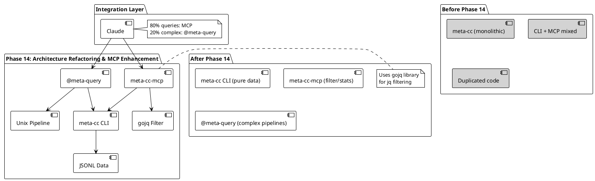

# Phase 14: 架构重构与 MCP 增强（Architecture Refactoring & MCP Enhancement）

## 概述

**目标**: 重构命令实现以消除代码重复，拆分 MCP 为独立可执行文件并增强查询能力

**代码量**: ~900 行（重构 + MCP 增强 + Subagent）

**依赖**: Phase 0-13（完整的 meta-cc CLI 工具链 + MCP Server + 项目级查询 + 输出格式简化）

**交付物**:
- Pipeline 抽象层（消除命令重复）
- errors 命令简化（移除窗口过滤）
- 输出排序标准化（确定性输出）
- 独立 MCP 可执行文件（meta-cc-mcp）
- gojq 集成（jq 过滤/聚合）
- @meta-query Subagent（复杂 Unix 管道）
- 代码重复消除（-72% 代码量）

---

## Phase 目标

解决当前架构的三大核心问题：

### 核心问题

1. **MCP 输出过大**：返回大量原始 JSONL，消耗 LLM tokens
2. **MCP 职责不清**：CLI 内嵌 MCP，违反职责最小化原则
3. **代码重复严重**：5 个命令共 1194 行，重复会话定位和解析逻辑

### 解决方案架构

Phase 14 实现三层分离策略：



### 设计原则

1. **职责最小化**: CLI 仅提取数据，MCP 负责过滤/聚合
2. **Pipeline 模式**: 抽象通用数据处理流程
3. **输出确定性**: 所有输出按稳定字段排序
4. **延迟决策**: jq_filter 由 Claude 生成，MCP 仅执行
5. **80/20 原则**: MCP 覆盖 80% 场景，@meta-query 处理 20% 复杂场景

---

## 成功标准

**功能验收**:
- ✅ Pipeline 抽象层实现（覆盖率 ≥90%）
- ✅ meta-cc-mcp 独立可执行文件创建
- ✅ gojq 集成，支持 jq_filter/stats_only/stats_first
- ✅ @meta-query Subagent 创建
- ✅ 所有 query 命令输出稳定排序
- ✅ 代码重复消除（减少 ≥60%）

**集成验收**:
- ✅ meta-cc-mcp 处理 MCP 请求（jq 过滤）
- ✅ @meta-query 处理复杂 Unix 管道
- ✅ 输出长度控制（默认 50KB）
- ✅ 统计模式正常工作
- ✅ Claude 可自然调用 MCP 工具

**代码质量**:
- ✅ 实际代码量: ~900 行（含删除和新增）
  - Stage 14.1: ~150 lines（Pipeline 抽象）
  - Stage 14.2: ~80 lines（errors 简化）
  - Stage 14.3: ~50 lines（排序标准化）
  - Stage 14.4: ~400 lines（MCP 拆分 + gojq）
  - Stage 14.5: ~150 lines（@meta-query）
  - Stage 14.6: ~70 lines（代码重复消除）
- ✅ 每个 Stage ≤ 400 行
- ✅ 测试覆盖率: ≥ 80%

---

## Stage 14.1: Pipeline 抽象层

### 目标

提取通用 SessionPipeline 类型，统一会话定位和 JSONL 解析逻辑，支持多会话加载。

### 实现步骤

#### 1. 设计 Pipeline 接口

**文件**: `cmd/pipeline.go`（已存在，完善测试）

**当前结构**:
```go
// cmd/pipeline.go (~150 lines)
type SessionPipeline struct {
    opts    GlobalOptions
    session string
    entries []parser.SessionEntry
}

func NewSessionPipeline(opts GlobalOptions) *SessionPipeline
func (p *SessionPipeline) Load(loadOpts LoadOptions) error
func (p *SessionPipeline) GetEntries() []parser.SessionEntry
func (p *SessionPipeline) FilterEntries(filter EntryFilter) []parser.SessionEntry
```

**改进点**:
- 确保多会话加载功能完整（Phase 12 已实现）
- 添加测试覆盖所有加载模式
- 验证 Pipeline 在所有命令中可复用

#### 2. 定义 LoadOptions 和 EntryFilter

**文件**: `cmd/pipeline.go`（扩展）

```go
// LoadOptions specifies how to load sessions
type LoadOptions struct {
    ProjectLevel bool   // Load all sessions in project
    SessionID    string // Specific session ID
    ProjectPath  string // Project path
}

// EntryFilter defines entry filtering criteria
type EntryFilter struct {
    Type       string // "turn", "tool", "message"
    Tool       string // Filter by tool name
    Status     string // Filter by status
    Since      string // Time filter
    LastNTurns int    // Limit to last N turns
}
```

#### 3. 实现通用加载逻辑

**文件**: `cmd/pipeline.go`（已实现，验证）

```go
func (p *SessionPipeline) Load(opts LoadOptions) error {
    var sessionPaths []string

    if opts.ProjectLevel {
        // Load all sessions in project
        projectHash := locator.ProjectPathToHash(opts.ProjectPath)
        sessionPaths = locator.FindAllSessions(projectHash)
    } else if opts.SessionID != "" {
        // Load specific session
        sessionPath, err := locator.FindSessionByID(opts.SessionID)
        if err != nil {
            return err
        }
        sessionPaths = []string{sessionPath}
    } else {
        // Auto-detect from cwd
        sessionPath, err := locator.AutoDetect()
        if err != nil {
            return err
        }
        sessionPaths = []string{sessionPath}
    }

    // Parse all sessions
    for _, path := range sessionPaths {
        entries, err := parser.ParseSessionFile(path)
        if err != nil {
            return err
        }
        p.entries = append(p.entries, entries...)
    }

    return nil
}
```

### TDD 步骤

**测试文件**: `cmd/pipeline_test.go`（新建，~150 行）

```go
package cmd

import (
    "testing"
    "github.com/yaleh/meta-cc/internal/testutil"
)

func TestNewSessionPipeline(t *testing.T) {
    opts := GlobalOptions{
        SessionID:   "",
        ProjectPath: "",
        OutputFormat: "jsonl",
    }

    pipeline := NewSessionPipeline(opts)
    if pipeline == nil {
        t.Fatal("expected pipeline to be created")
    }
}

func TestSessionPipeline_LoadSingleSession(t *testing.T) {
    pipeline := NewSessionPipeline(GlobalOptions{})

    loadOpts := LoadOptions{
        ProjectLevel: false,
        SessionID:    "test-session-123",
    }

    err := pipeline.Load(loadOpts)
    if err != nil {
        t.Fatalf("Load failed: %v", err)
    }

    entries := pipeline.GetEntries()
    if len(entries) == 0 {
        t.Error("expected entries to be loaded")
    }
}

func TestSessionPipeline_LoadProjectLevel(t *testing.T) {
    pipeline := NewSessionPipeline(GlobalOptions{})

    loadOpts := LoadOptions{
        ProjectLevel: true,
        ProjectPath:  testutil.TestProjectPath,
    }

    err := pipeline.Load(loadOpts)
    if err != nil {
        t.Fatalf("Load failed: %v", err)
    }

    entries := pipeline.GetEntries()
    if len(entries) == 0 {
        t.Error("expected entries from multiple sessions")
    }

    // Verify entries from multiple sessions
    sessionIDs := make(map[string]bool)
    for _, entry := range entries {
        sessionIDs[entry.SessionID] = true
    }

    if len(sessionIDs) < 2 {
        t.Errorf("expected multiple sessions, got %d", len(sessionIDs))
    }
}

func TestSessionPipeline_FilterEntries(t *testing.T) {
    pipeline := NewSessionPipeline(GlobalOptions{})

    // Load test data
    pipeline.Load(LoadOptions{SessionID: "test-session-123"})

    // Filter by tool
    filter := EntryFilter{
        Type: "tool",
        Tool: "Bash",
    }

    filtered := pipeline.FilterEntries(filter)

    for _, entry := range filtered {
        if entry.Type != "tool" {
            t.Errorf("expected type=tool, got %s", entry.Type)
        }
        if entry.ToolName != "Bash" {
            t.Errorf("expected tool=Bash, got %s", entry.ToolName)
        }
    }
}

func TestSessionPipeline_FilterByStatus(t *testing.T) {
    pipeline := NewSessionPipeline(GlobalOptions{})
    pipeline.Load(LoadOptions{SessionID: "test-session-123"})

    filter := EntryFilter{
        Type:   "tool",
        Status: "error",
    }

    filtered := pipeline.FilterEntries(filter)

    for _, entry := range filtered {
        if entry.Status != "error" {
            t.Errorf("expected status=error, got %s", entry.Status)
        }
    }
}

func TestSessionPipeline_FilterLastNTurns(t *testing.T) {
    pipeline := NewSessionPipeline(GlobalOptions{})
    pipeline.Load(LoadOptions{SessionID: "test-session-123"})

    filter := EntryFilter{
        LastNTurns: 10,
    }

    filtered := pipeline.FilterEntries(filter)

    if len(filtered) > 10 {
        t.Errorf("expected ≤10 entries, got %d", len(filtered))
    }
}
```

**测试执行**:
```bash
# Run tests for Stage 14.1
go test ./cmd -v -run TestSessionPipeline

# Verify coverage
go test ./cmd -cover -run TestSessionPipeline
# Target: ≥90% coverage
```

### 交付物

**新增**:
- `cmd/pipeline_test.go`: Pipeline 单元测试（~150 行）

**修改**:
- `cmd/pipeline.go`: 完善文档和边界检查（~20 行）

**验证**:
```bash
# 验证 Pipeline 在所有命令中可复用
go test ./cmd -v

# 验证多会话加载功能
./meta-cc --project . query tools --limit 10
# 应返回跨会话的工具调用
```

**净变化**: +170 lines

---

## Stage 14.2: errors 命令简化

### 目标

移除 `analyze errors` 命令的窗口过滤逻辑，简化错误签名，移除模式计数和分组（交给 jq）。

### 实现步骤

#### 1. 创建 query errors 命令

**文件**: `cmd/query_errors.go`（新建，~80 行）

**设计原则**:
- ❌ 不做窗口过滤（meta-cc 不决策分析范围）
- ❌ 不做模式计数（交给 jq）
- ✅ 仅输出简单错误列表（JSONL）
- ✅ 错误签名简化：`{tool}:{error_prefix}` 替代 SHA256

**实现**:
```go
package cmd

import (
    "fmt"
    "github.com/spf13/cobra"
    "github.com/yaleh/meta-cc/internal/parser"
    "github.com/yaleh/meta-cc/pkg/output"
)

var queryErrorsCmd = &cobra.Command{
    Use:   "errors",
    Short: "Query tool errors (simple list, no aggregation)",
    Long: `Query tool errors and output as JSONL.

This command outputs a simple list of errors without aggregation or window filtering.
Use jq for complex filtering and grouping.

Examples:
  # Get all errors
  meta-cc query errors

  # Filter last 50 errors with jq
  meta-cc query errors | jq '.[-50:]'

  # Group by error signature with jq
  meta-cc query errors | jq 'group_by(.Signature)'
`,
    RunE: runQueryErrors,
}

func init() {
    queryCmd.AddCommand(queryErrorsCmd)
}

func runQueryErrors(cmd *cobra.Command, args []string) error {
    // Create pipeline
    pipeline := NewSessionPipeline(GlobalOptions{
        SessionID:    globalOpts.SessionID,
        ProjectPath:  globalOpts.ProjectPath,
        OutputFormat: globalOpts.OutputFormat,
    })

    // Load sessions
    loadOpts := LoadOptions{
        ProjectLevel: globalOpts.ProjectPath != "",
        SessionID:    globalOpts.SessionID,
        ProjectPath:  globalOpts.ProjectPath,
    }

    if err := pipeline.Load(loadOpts); err != nil {
        return output.OutputError(err, output.ErrSessionNotFound, globalOpts.OutputFormat)
    }

    // Filter errors
    filter := EntryFilter{
        Type:   "tool",
        Status: "error",
    }

    errors := pipeline.FilterEntries(filter)

    // Check for no results
    if len(errors) == 0 {
        return output.WarnNoResults(globalOpts.OutputFormat)
    }

    // Transform to ErrorEntry with simplified signature
    errorEntries := make([]ErrorEntry, len(errors))
    for i, e := range errors {
        errorEntries[i] = ErrorEntry{
            Timestamp:    e.Timestamp,
            ToolName:     e.ToolName,
            Status:       e.Status,
            Error:        e.Error,
            Signature:    simplifyErrorSignature(e.ToolName, e.Error),
            TurnSequence: e.TurnSequence,
        }
    }

    // Output
    result, err := output.FormatOutput(errorEntries, globalOpts.OutputFormat)
    if err != nil {
        return output.OutputError(err, output.ErrInternalError, globalOpts.OutputFormat)
    }

    fmt.Print(result)
    return nil
}

// ErrorEntry represents a simplified error entry
type ErrorEntry struct {
    Timestamp    string `json:"timestamp"`
    ToolName     string `json:"tool"`
    Status       string `json:"status"`
    Error        string `json:"error"`
    Signature    string `json:"signature"`
    TurnSequence int    `json:"turn_sequence"`
}

// simplifyErrorSignature creates a simple signature: {tool}:{error_prefix}
func simplifyErrorSignature(tool, errorMsg string) string {
    // Take first 50 chars of error message
    prefix := errorMsg
    if len(prefix) > 50 {
        prefix = prefix[:50]
    }

    return fmt.Sprintf("%s:%s", tool, prefix)
}
```

#### 2. 标记 analyze errors 为 deprecated

**文件**: `cmd/analyze_errors.go`（修改，~10 行）

```go
var analyzeErrorsCmd = &cobra.Command{
    Use:   "errors",
    Short: "[DEPRECATED] Use 'query errors' instead",
    Long: `[DEPRECATED] This command is deprecated and will be removed in a future version.

Please use 'query errors' instead, which outputs simple error lists.
Use jq for filtering and grouping:

  # Old way (deprecated):
  meta-cc analyze errors --window 50

  # New way:
  meta-cc query errors | jq '.[-50:]' | jq 'group_by(.Signature)'
`,
    RunE: runAnalyzeErrors,
}
```

#### 3. 创建迁移文档

**文件**: `docs/migration-phase14.md`（新建，~50 行）

```markdown
# Phase 14 Migration Guide

## Deprecated: `analyze errors`

The `analyze errors` command is deprecated in Phase 14. Use `query errors` with jq instead.

### Before (Phase 13)

```bash
# Analyze errors in last 50 turns
meta-cc analyze errors --window 50
```

### After (Phase 14)

```bash
# Get all errors, filter with jq
meta-cc query errors | jq '.[-50:]'

# Group by signature
meta-cc query errors | jq 'group_by(.Signature)'

# Count errors by tool
meta-cc query errors | jq 'group_by(.ToolName) | map({tool: .[0].ToolName, count: length})'
```

### Why the Change?

- **Separation of Concerns**: meta-cc focuses on data extraction, jq handles filtering/aggregation
- **Flexibility**: jq allows arbitrary filtering logic
- **Simplicity**: Removes window parameter complexity from meta-cc
```

### TDD 步骤

**测试文件**: `cmd/query_errors_test.go`（新建，~100 行）

```go
package cmd

import (
    "testing"
    "strings"
    "encoding/json"
    "github.com/yaleh/meta-cc/internal/testutil"
)

func TestRunQueryErrors(t *testing.T) {
    // Setup test session
    testutil.SetupTestSession(t)

    // Execute command
    output, err := testutil.ExecuteCommand("query", "errors")
    if err != nil {
        t.Fatalf("query errors failed: %v", err)
    }

    // Verify JSONL format
    lines := strings.Split(strings.TrimSpace(output), "\n")
    if len(lines) == 0 {
        t.Error("expected error entries")
    }

    // Verify each line is valid JSON
    for _, line := range lines {
        var entry ErrorEntry
        if err := json.Unmarshal([]byte(line), &entry); err != nil {
            t.Errorf("invalid JSON: %v", err)
        }

        // Verify required fields
        if entry.ToolName == "" {
            t.Error("missing tool name")
        }
        if entry.Status != "error" {
            t.Errorf("expected status=error, got %s", entry.Status)
        }
        if entry.Signature == "" {
            t.Error("missing signature")
        }
    }
}

func TestSimplifyErrorSignature(t *testing.T) {
    tests := []struct {
        tool      string
        error     string
        wantPrefix string
    }{
        {
            tool:      "Bash",
            error:     "command not found: foo",
            wantPrefix: "Bash:command not found: foo",
        },
        {
            tool:      "Edit",
            error:     strings.Repeat("x", 100), // Long error
            wantPrefix: "Edit:" + strings.Repeat("x", 50),
        },
    }

    for _, tt := range tests {
        sig := simplifyErrorSignature(tt.tool, tt.error)
        if !strings.HasPrefix(sig, tt.wantPrefix) {
            t.Errorf("expected signature to start with %s, got %s", tt.wantPrefix, sig)
        }

        // Verify signature is not too long
        if len(sig) > 60 {
            t.Errorf("signature too long: %d chars", len(sig))
        }
    }
}

func TestQueryErrors_NoResults(t *testing.T) {
    // Setup session with no errors
    testutil.SetupTestSession(t, testutil.WithNoErrors())

    output, err := testutil.ExecuteCommand("query", "errors")

    // Should return exit code 2 (no results)
    if err == nil {
        t.Error("expected no results error")
    }

    // Output should be empty array for JSONL
    if strings.TrimSpace(output) != "[]" {
        t.Errorf("expected '[]', got %s", output)
    }
}
```

**测试执行**:
```bash
# Run tests for Stage 14.2
go test ./cmd -v -run TestQueryErrors

# Verify equivalence with analyze errors (via jq)
meta-cc query errors | jq 'group_by(.Signature)' > /tmp/new.json
meta-cc analyze errors --window 0 > /tmp/old.json
diff /tmp/new.json /tmp/old.json
```

### 交付物

**新增**:
- `cmd/query_errors.go`: query errors 命令（~80 行）
- `cmd/query_errors_test.go`: 单元测试（~100 行）
- `docs/migration-phase14.md`: 迁移指南（~50 行）

**修改**:
- `cmd/analyze_errors.go`: 标记 deprecated（~10 行）

**净变化**: +240 lines

---

## Stage 14.3: 输出排序标准化

### 目标

为所有 query 命令添加默认排序，确保输出确定性。

### 实现步骤

#### 1. 创建排序工具

**文件**: `pkg/output/sort.go`（新建，~50 行）

```go
package output

import (
    "sort"
    "github.com/yaleh/meta-cc/internal/parser"
)

// SortByTimestamp sorts entries by timestamp (ascending)
func SortByTimestamp(data interface{}) interface{} {
    switch v := data.(type) {
    case []parser.ToolCall:
        sorted := make([]parser.ToolCall, len(v))
        copy(sorted, v)
        sort.Slice(sorted, func(i, j int) bool {
            return sorted[i].Timestamp < sorted[j].Timestamp
        })
        return sorted
    case []ErrorEntry:
        sorted := make([]ErrorEntry, len(v))
        copy(sorted, v)
        sort.Slice(sorted, func(i, j int) bool {
            return sorted[i].Timestamp < sorted[j].Timestamp
        })
        return sorted
    default:
        return data
    }
}

// SortByTurnSequence sorts entries by turn sequence (ascending)
func SortByTurnSequence(data interface{}) interface{} {
    switch v := data.(type) {
    case []parser.UserMessage:
        sorted := make([]parser.UserMessage, len(v))
        copy(sorted, v)
        sort.Slice(sorted, func(i, j int) bool {
            return sorted[i].TurnSequence < sorted[j].TurnSequence
        })
        return sorted
    default:
        return data
    }
}
```

#### 2. 更新命令应用排序

**文件**: `cmd/query_tools.go`（修改，~5 行）

```go
func runQueryTools(cmd *cobra.Command, args []string) error {
    // ... existing code ...

    // Apply sorting
    sorted := output.SortByTimestamp(filtered).([]parser.ToolCall)

    // Output
    result, err := output.FormatOutput(sorted, globalOpts.OutputFormat)
    // ... rest of code ...
}
```

**文件**: `cmd/query_user_messages.go`（修改，~5 行）

```go
func runQueryUserMessages(cmd *cobra.Command, args []string) error {
    // ... existing code ...

    // Apply sorting
    sorted := output.SortByTurnSequence(messages).([]parser.UserMessage)

    // Output
    result, err := output.FormatOutput(sorted, globalOpts.OutputFormat)
    // ... rest of code ...
}
```

**文件**: `cmd/query_errors.go`（修改，~5 行）

```go
func runQueryErrors(cmd *cobra.Command, args []string) error {
    // ... existing code ...

    // Apply sorting
    sorted := output.SortByTimestamp(errorEntries).([]ErrorEntry)

    // Output
    result, err := output.FormatOutput(sorted, globalOpts.OutputFormat)
    // ... rest of code ...
}
```

### TDD 步骤

**测试文件**: `pkg/output/sort_test.go`（新建，~80 行）

```go
package output

import (
    "testing"
    "github.com/yaleh/meta-cc/internal/parser"
    "github.com/yaleh/meta-cc/internal/testutil"
)

func TestSortByTimestamp_ToolCalls(t *testing.T) {
    tools := []parser.ToolCall{
        {Timestamp: "2025-10-03T10:00:00Z", ToolName: "C"},
        {Timestamp: "2025-10-03T08:00:00Z", ToolName: "A"},
        {Timestamp: "2025-10-03T09:00:00Z", ToolName: "B"},
    }

    sorted := SortByTimestamp(tools).([]parser.ToolCall)

    // Verify order
    if sorted[0].ToolName != "A" {
        t.Errorf("expected A first, got %s", sorted[0].ToolName)
    }
    if sorted[1].ToolName != "B" {
        t.Errorf("expected B second, got %s", sorted[1].ToolName)
    }
    if sorted[2].ToolName != "C" {
        t.Errorf("expected C third, got %s", sorted[2].ToolName)
    }
}

func TestSortByTurnSequence_UserMessages(t *testing.T) {
    messages := []parser.UserMessage{
        {TurnSequence: 3, Content: "C"},
        {TurnSequence: 1, Content: "A"},
        {TurnSequence: 2, Content: "B"},
    }

    sorted := SortByTurnSequence(messages).([]parser.UserMessage)

    // Verify order
    if sorted[0].Content != "A" {
        t.Errorf("expected A first, got %s", sorted[0].Content)
    }
    if sorted[1].Content != "B" {
        t.Errorf("expected B second, got %s", sorted[1].Content)
    }
    if sorted[2].Content != "C" {
        t.Errorf("expected C third, got %s", sorted[2].Content)
    }
}

func TestOutputDeterminism(t *testing.T) {
    // Generate random tool calls
    tools := testutil.GenerateRandomToolCalls(100)

    // Sort multiple times
    var outputs []string
    for i := 0; i < 10; i++ {
        sorted := SortByTimestamp(tools).([]parser.ToolCall)
        output, _ := FormatJSONL(sorted)
        outputs = append(outputs, output)
    }

    // Verify all outputs are identical
    for i := 1; i < len(outputs); i++ {
        if outputs[i] != outputs[0] {
            t.Error("output not deterministic")
        }
    }
}
```

**测试执行**:
```bash
# Run tests for Stage 14.3
go test ./pkg/output -v -run TestSort

# Verify determinism
for i in {1..10}; do
  ./meta-cc query tools > /tmp/run-$i.jsonl
done

# All files should be identical
diff /tmp/run-*.jsonl
```

### 交付物

**新增**:
- `pkg/output/sort.go`: 排序工具（~50 行）
- `pkg/output/sort_test.go`: 排序测试（~80 行）

**修改**:
- `cmd/query_tools.go`: 应用排序（~5 行）
- `cmd/query_user_messages.go`: 应用排序（~5 行）
- `cmd/query_errors.go`: 应用排序（~5 行）

**净变化**: +145 lines

---

## Stage 14.4: 拆分 MCP 为独立可执行文件

### 目标

创建 meta-cc-mcp 独立可执行文件，集成 gojq 库实现 jq 过滤/聚合，实现输出长度控制。

### 实现步骤

#### 1. 创建 MCP Server 目录结构

**新建目录**:
```
cmd/mcp-server/
├── main.go           # MCP Server 入口
├── server.go         # JSON-RPC 处理
├── tools.go          # 工具定义
├── executor.go       # 工具执行逻辑
└── jq_filter.go      # gojq 集成
```

#### 2. 添加 gojq 依赖

**文件**: `go.mod`（修改）

```bash
go get github.com/itchyny/gojq@latest
```

#### 3. 实现 MCP Server 主程序

**文件**: `cmd/mcp-server/main.go`（新建，~50 行）

```go
package main

import (
    "bufio"
    "encoding/json"
    "fmt"
    "os"
)

func main() {
    scanner := bufio.NewScanner(os.Stdin)

    for scanner.Scan() {
        line := scanner.Text()

        // Parse JSON-RPC request
        var req JSONRPCRequest
        if err := json.Unmarshal([]byte(line), &req); err != nil {
            writeError(req.ID, -32700, "Parse error")
            continue
        }

        // Handle request
        handleRequest(req)
    }
}

type JSONRPCRequest struct {
    JSONRPC string                 `json:"jsonrpc"`
    ID      interface{}            `json:"id"`
    Method  string                 `json:"method"`
    Params  map[string]interface{} `json:"params"`
}

type JSONRPCResponse struct {
    JSONRPC string      `json:"jsonrpc"`
    ID      interface{} `json:"id"`
    Result  interface{} `json:"result,omitempty"`
    Error   *JSONRPCError `json:"error,omitempty"`
}

type JSONRPCError struct {
    Code    int    `json:"code"`
    Message string `json:"message"`
}

func handleRequest(req JSONRPCRequest) {
    switch req.Method {
    case "initialize":
        handleInitialize(req)
    case "tools/list":
        handleToolsList(req)
    case "tools/call":
        handleToolsCall(req)
    default:
        writeError(req.ID, -32601, "Method not found")
    }
}
```

#### 4. 实现 gojq 集成

**文件**: `cmd/mcp-server/jq_filter.go`（新建，~120 行）

```go
package main

import (
    "encoding/json"
    "fmt"
    "strings"

    "github.com/itchyny/gojq"
)

// ApplyJQFilter applies a jq expression to JSONL data
func ApplyJQFilter(jsonlData string, jqExpr string) (string, error) {
    // Default expression: select all
    if jqExpr == "" {
        jqExpr = ".[]"
    }

    // Parse jq expression
    query, err := gojq.Parse(jqExpr)
    if err != nil {
        return "", fmt.Errorf("invalid jq expression: %w", err)
    }

    // Parse JSONL data
    lines := strings.Split(strings.TrimSpace(jsonlData), "\n")
    var data []interface{}

    for _, line := range lines {
        if line == "" {
            continue
        }

        var obj interface{}
        if err := json.Unmarshal([]byte(line), &obj); err != nil {
            return "", fmt.Errorf("invalid JSON: %w", err)
        }
        data = append(data, obj)
    }

    // Apply jq filter
    var results []interface{}
    iter := query.Run(data)

    for {
        v, ok := iter.Next()
        if !ok {
            break
        }

        if err, ok := v.(error); ok {
            return "", err
        }

        results = append(results, v)
    }

    // Convert results to JSONL
    var output strings.Builder
    for _, result := range results {
        jsonBytes, err := json.Marshal(result)
        if err != nil {
            return "", err
        }
        output.Write(jsonBytes)
        output.WriteString("\n")
    }

    return output.String(), nil
}

// GenerateStats generates statistics from JSONL data
func GenerateStats(jsonlData string) (string, error) {
    // Parse JSONL
    lines := strings.Split(strings.TrimSpace(jsonlData), "\n")

    // Count by type (assuming objects have a "type" field)
    stats := make(map[string]int)

    for _, line := range lines {
        if line == "" {
            continue
        }

        var obj map[string]interface{}
        if err := json.Unmarshal([]byte(line), &obj); err != nil {
            continue
        }

        // Determine stat key (tool name, error type, etc.)
        key := "unknown"
        if tool, ok := obj["tool"].(string); ok {
            key = tool
        } else if toolName, ok := obj["ToolName"].(string); ok {
            key = toolName
        }

        stats[key]++
    }

    // Output stats as JSONL
    var output strings.Builder
    for key, count := range stats {
        statObj := map[string]interface{}{
            "key":   key,
            "count": count,
        }
        jsonBytes, _ := json.Marshal(statObj)
        output.Write(jsonBytes)
        output.WriteString("\n")
    }

    return output.String(), nil
}
```

#### 5. 实现工具执行器

**文件**: `cmd/mcp-server/executor.go`（新建，~150 行）

```go
package main

import (
    "bytes"
    "fmt"
    "os"
    "os/exec"
    "strings"
)

const (
    DefaultMaxOutputBytes = 51200 // 50KB
)

type ToolExecutor struct {
    metaCCPath string
}

func NewToolExecutor() *ToolExecutor {
    // Find meta-cc executable
    metaCCPath, err := exec.LookPath("meta-cc")
    if err != nil {
        // Assume meta-cc is in the same directory
        metaCCPath = "./meta-cc"
    }

    return &ToolExecutor{
        metaCCPath: metaCCPath,
    }
}

// ExecuteTool executes a meta-cc command and applies jq filtering
func (e *ToolExecutor) ExecuteTool(toolName string, args map[string]interface{}) (string, error) {
    // Extract common parameters
    jqFilter := getStringParam(args, "jq_filter", ".[]")
    statsOnly := getBoolParam(args, "stats_only", false)
    statsFirst := getBoolParam(args, "stats_first", false)
    maxOutputBytes := getIntParam(args, "max_output_bytes", DefaultMaxOutputBytes)
    scope := getStringParam(args, "scope", "project")

    // Build meta-cc command
    cmdArgs := e.buildCommand(toolName, args, scope)

    // Execute meta-cc
    rawOutput, err := e.executeMetaCC(cmdArgs)
    if err != nil {
        return "", err
    }

    // Apply jq filter
    filtered, err := ApplyJQFilter(rawOutput, jqFilter)
    if err != nil {
        return "", fmt.Errorf("jq filter error: %w", err)
    }

    // Generate stats if requested
    var output string
    if statsOnly {
        output, err = GenerateStats(filtered)
        if err != nil {
            return "", err
        }
    } else if statsFirst {
        stats, _ := GenerateStats(filtered)
        output = stats + "\n---\n" + filtered
    } else {
        output = filtered
    }

    // Apply output length limit
    if len(output) > maxOutputBytes {
        output = output[:maxOutputBytes]
        output += fmt.Sprintf("\n[OUTPUT TRUNCATED: exceeded %d bytes limit]", maxOutputBytes)
    }

    return output, nil
}

func (e *ToolExecutor) buildCommand(toolName string, args map[string]interface{}, scope string) []string {
    cmdArgs := []string{}

    // Add project flag for project-level queries
    if scope == "project" {
        cmdArgs = append(cmdArgs, "--project", ".")
    }

    // Map tool name to meta-cc command
    switch toolName {
    case "query_tools", "query_tools_session":
        cmdArgs = append(cmdArgs, "query", "tools")
        if tool := getStringParam(args, "tool", ""); tool != "" {
            cmdArgs = append(cmdArgs, "--tool", tool)
        }
        if status := getStringParam(args, "status", ""); status != "" {
            cmdArgs = append(cmdArgs, "--status", status)
        }
        if limit := getIntParam(args, "limit", 0); limit > 0 {
            cmdArgs = append(cmdArgs, "--limit", fmt.Sprintf("%d", limit))
        }

    case "query_user_messages", "query_user_messages_session":
        cmdArgs = append(cmdArgs, "query", "user-messages")
        if pattern := getStringParam(args, "pattern", ""); pattern != "" {
            cmdArgs = append(cmdArgs, "--pattern", pattern)
        }
        if limit := getIntParam(args, "limit", 0); limit > 0 {
            cmdArgs = append(cmdArgs, "--limit", fmt.Sprintf("%d", limit))
        }

    case "get_session_stats":
        cmdArgs = append(cmdArgs, "parse", "stats")

    case "query_errors", "query_errors_session":
        cmdArgs = append(cmdArgs, "query", "errors")

    default:
        return nil
    }

    // Always output JSONL
    cmdArgs = append(cmdArgs, "--output", "jsonl")

    return cmdArgs
}

func (e *ToolExecutor) executeMetaCC(cmdArgs []string) (string, error) {
    cmd := exec.Command(e.metaCCPath, cmdArgs...)

    var stdout bytes.Buffer
    var stderr bytes.Buffer
    cmd.Stdout = &stdout
    cmd.Stderr = &stderr

    if err := cmd.Run(); err != nil {
        return "", fmt.Errorf("meta-cc error: %s", stderr.String())
    }

    return stdout.String(), nil
}

// Helper functions
func getStringParam(args map[string]interface{}, key, defaultVal string) string {
    if v, ok := args[key].(string); ok {
        return v
    }
    return defaultVal
}

func getBoolParam(args map[string]interface{}, key string, defaultVal bool) bool {
    if v, ok := args[key].(bool); ok {
        return v
    }
    return defaultVal
}

func getIntParam(args map[string]interface{}, key string, defaultVal int) int {
    if v, ok := args[key].(float64); ok {
        return int(v)
    }
    return defaultVal
}
```

#### 6. 实现工具定义

**文件**: `cmd/mcp-server/tools.go`（新建，~80 行）

```go
package main

func getToolDefinitions() []Tool {
    return []Tool{
        {
            Name:        "query_tools",
            Description: "Query tool calls with jq filtering. Default scope: project.",
            InputSchema: ToolSchema{
                Type: "object",
                Properties: map[string]Property{
                    "scope": {
                        Type:        "string",
                        Description: "Query scope: 'project' (default) or 'session'",
                    },
                    "jq_filter": {
                        Type:        "string",
                        Description: "jq expression for filtering (default: '.[]')",
                    },
                    "stats_only": {
                        Type:        "boolean",
                        Description: "Return only statistics (default: false)",
                    },
                    "stats_first": {
                        Type:        "boolean",
                        Description: "Return stats first, then details (default: false)",
                    },
                    "max_output_bytes": {
                        Type:        "number",
                        Description: "Maximum output size in bytes (default: 51200)",
                    },
                },
            },
        },
        {
            Name:        "query_tools_session",
            Description: "Query tool calls in current session only.",
            InputSchema: ToolSchema{
                Type: "object",
                Properties: map[string]Property{
                    "jq_filter":        {Type: "string", Description: "jq expression"},
                    "stats_only":       {Type: "boolean", Description: "Statistics only"},
                    "max_output_bytes": {Type: "number", Description: "Output limit"},
                },
            },
        },
        // Add more tools...
    }
}

type Tool struct {
    Name        string     `json:"name"`
    Description string     `json:"description"`
    InputSchema ToolSchema `json:"inputSchema"`
}

type ToolSchema struct {
    Type       string              `json:"type"`
    Properties map[string]Property `json:"properties"`
    Required   []string            `json:"required,omitempty"`
}

type Property struct {
    Type        string `json:"type"`
    Description string `json:"description"`
}
```

#### 7. 更新 Makefile

**文件**: `Makefile`（修改）

```makefile
# Build targets
.PHONY: build build-cli build-mcp

build: build-cli build-mcp

build-cli:
	go build -o meta-cc ./cmd/meta-cc

build-mcp:
	go build -o meta-cc-mcp ./cmd/mcp-server
```

### TDD 步骤

**测试文件**: `cmd/mcp-server/jq_filter_test.go`（新建，~100 行）

```go
package main

import (
    "strings"
    "testing"
)

func TestApplyJQFilter_Simple(t *testing.T) {
    jsonlData := `{"tool":"Bash","status":"success"}
{"tool":"Read","status":"error"}
{"tool":"Edit","status":"success"}`

    jqExpr := `.[] | select(.status == "error")`

    result, err := ApplyJQFilter(jsonlData, jqExpr)
    if err != nil {
        t.Fatalf("ApplyJQFilter failed: %v", err)
    }

    lines := strings.Split(strings.TrimSpace(result), "\n")
    if len(lines) != 1 {
        t.Errorf("expected 1 result, got %d", len(lines))
    }

    if !strings.Contains(result, "Read") {
        t.Error("expected Read in result")
    }
}

func TestApplyJQFilter_Projection(t *testing.T) {
    jsonlData := `{"tool":"Bash","status":"success","duration":100}
{"tool":"Read","status":"error","duration":50}`

    jqExpr := `.[] | {tool: .tool, status: .status}`

    result, err := ApplyJQFilter(jsonlData, jqExpr)
    if err != nil {
        t.Fatalf("ApplyJQFilter failed: %v", err)
    }

    // Verify projection (no duration field)
    if strings.Contains(result, "duration") {
        t.Error("expected duration to be excluded")
    }
}

func TestGenerateStats(t *testing.T) {
    jsonlData := `{"tool":"Bash","status":"error"}
{"tool":"Bash","status":"error"}
{"tool":"Read","status":"error"}`

    stats, err := GenerateStats(jsonlData)
    if err != nil {
        t.Fatalf("GenerateStats failed: %v", err)
    }

    // Verify stats format
    if !strings.Contains(stats, "Bash") {
        t.Error("expected Bash in stats")
    }
    if !strings.Contains(stats, "count") {
        t.Error("expected count field")
    }
}
```

**测试执行**:
```bash
# Build both executables
make build

# Test MCP server
echo '{"jsonrpc":"2.0","id":1,"method":"initialize","params":{}}' | ./meta-cc-mcp

# Test jq filtering
echo '{"jsonrpc":"2.0","id":2,"method":"tools/call","params":{"name":"query_tools","arguments":{"jq_filter":".[] | select(.Status == \"error\")","stats_only":true}}}' | ./meta-cc-mcp

# Run unit tests
go test ./cmd/mcp-server -v
```

### 交付物

**新增**:
- `cmd/mcp-server/main.go`: MCP Server 入口（~50 行）
- `cmd/mcp-server/server.go`: JSON-RPC 处理（~80 行）
- `cmd/mcp-server/tools.go`: 工具定义（~80 行）
- `cmd/mcp-server/executor.go`: 工具执行器（~150 行）
- `cmd/mcp-server/jq_filter.go`: gojq 集成（~120 行）
- `cmd/mcp-server/jq_filter_test.go`: 单元测试（~100 行）

**修改**:
- `go.mod`: 添加 gojq 依赖（~2 行）
- `Makefile`: 添加 build-mcp 目标（~5 行）

**净变化**: +587 lines

---

## Stage 14.5: 创建 @meta-query Subagent

### 目标

创建 @meta-query Subagent，处理复杂 Unix 管道场景（MCP 无法完成的多步聚合）。

### 实现步骤

#### 1. 创建 Subagent 定义

**文件**: `.claude/subagents/meta-query.md`（新建，~150 行）

```markdown
---
name: meta-query
description: Execute complex Unix pipeline queries on meta-cc data
allowed_tools: [Bash]
---

You are @meta-query, a specialized subagent for executing complex multi-step data aggregation queries using meta-cc CLI and Unix pipeline tools (jq, awk, sort, uniq, grep).

## When to Use @meta-query

Use @meta-query when:
- Multi-step Unix pipelines are needed (jq + sort + uniq)
- Complex aggregations beyond single jq expressions
- Top-N queries with sorting
- Custom data transformations

**Do NOT use** for:
- Simple jq filters (use MCP tools instead)
- Single-step queries (use MCP tools)

## Core Capabilities

### 1. Error Statistics by Tool

```bash
meta-cc query errors | jq -r '.ToolName' | sort | uniq -c | sort -rn
```

Example:
```
User: "统计本项目所有错误,按工具分组"

Response:
311 Bash
62 Read
15 Edit
```

### 2. Top-N Tool Usage

```bash
meta-cc query tools | jq -r '.ToolName' | sort | uniq -c | sort -rn | head -10
```

### 3. Error Rate by Tool

```bash
# Total calls by tool
total=$(meta-cc query tools | jq -r '.ToolName' | sort | uniq -c)

# Errors by tool
errors=$(meta-cc query errors | jq -r '.ToolName' | sort | uniq -c)

# Combine and calculate rates
join <(echo "$total") <(echo "$errors") | awk '{print $2, $1, $3, ($3/$1)*100"%"}'
```

### 4. File Operation History

```bash
meta-cc query file-access --file "test.js" | \
  jq -r '[.timestamp, .operation, .tool] | @tsv' | \
  column -t
```

### 5. Tool Sequence Patterns

```bash
meta-cc query tool-sequences --min-occurrences 3 | \
  jq -r '.sequence' | \
  sort | uniq -c | sort -rn
```

## Output Guidelines

1. **Always return compact results**:
   - Use `uniq -c` for counting
   - Use `head -N` to limit output
   - Use `column -t` for tables

2. **Avoid raw JSONL dumps**:
   - Transform data before returning
   - Return human-readable summaries

3. **Include context**:
   - Add headers to tables
   - Explain what the numbers mean

## Example Workflow

User: "What are the most common error patterns in this project?"

@meta-query:
1. Execute: `meta-cc query errors | jq -r '.Signature' | sort | uniq -c | sort -rn | head -10`
2. Format results:
   ```
   Top 10 Error Patterns:

   15  Bash:command not found: foo
   8   Read:No such file or directory
   5   Edit:old_string not found in file
   ...
   ```
3. Return concise summary

## Integration with @meta-coach

@meta-coach can call @meta-query for data gathering:

```
@meta-coach: "Analyze project errors"
  → calls @meta-query("Get error statistics")
  → receives compact stats
  → generates insights and recommendations
```

## Error Handling

If meta-cc fails:
1. Check if session/project exists
2. Suggest using `--project .` for project-level queries
3. Report errors clearly

If pipeline fails:
1. Break down the pipeline step by step
2. Identify which step failed
3. Suggest simpler alternatives
```

### TDD 步骤

**测试文件**: `.claude/subagents/meta-query-test.md`（新建，~50 行）

```markdown
# @meta-query Test Scenarios

## Scenario 1: Error Statistics

**User**: "@meta-query 统计本项目所有错误，按工具分组"

**Expected**:
@meta-query executes:
```bash
meta-cc query errors | jq -r '.ToolName' | sort | uniq -c | sort -rn
```

Returns:
```
Error Statistics by Tool:

311 Bash
62 Read
15 Edit
7 Write
```

**Verification**: Output is compact, sorted by count (descending)

---

## Scenario 2: Top-N Tool Usage

**User**: "@meta-query 列出使用最多的 5 个工具"

**Expected**:
```bash
meta-cc query tools | jq -r '.ToolName' | sort | uniq -c | sort -rn | head -5
```

Returns:
```
Top 5 Most Used Tools:

495 Bash
162 Read
140 TodoWrite
89 Edit
45 Write
```

---

## Scenario 3: File Hotspots

**User**: "@meta-query 哪些文件修改最频繁？"

**Expected**:
```bash
meta-cc query file-access | jq -r '.file' | sort | uniq -c | sort -rn | head -10
```

Returns:
```
Top 10 Modified Files:

23 cmd/mcp.go
18 cmd/query_tools.go
12 README.md
...
```

---

## Scenario 4: Integration with @meta-coach

**User**: "@meta-coach 分析本项目的工作模式"

**Expected workflow**:
1. @meta-coach → @meta-query("Get tool usage stats")
2. @meta-query → Returns compact stats
3. @meta-coach → Analyzes and provides insights

**Verification**: @meta-coach receives compact data, not raw JSONL
```

**测试执行**（手动测试）:
```bash
# In Claude Code, test @meta-query
User: "@meta-query 统计本项目所有错误，按工具分组"

# Verify:
# 1. @meta-query executes correct pipeline
# 2. Output is compact (not raw JSONL)
# 3. Results are sorted by count
```

### 交付物

**新增**:
- `.claude/subagents/meta-query.md`: Subagent 定义（~150 行）
- `.claude/subagents/meta-query-test.md`: 测试场景（~50 行）

**净变化**: +200 lines

---

## Stage 14.6: 代码重复消除

### 目标

统一输出逻辑，重构 5 个命令使用 SessionPipeline，移除重复代码。

### 实现步骤

#### 1. 统一输出逻辑

**文件**: `internal/output/format.go`（已存在，Phase 13）

确保所有命令使用统一的 `output.FormatOutput()` 函数。

#### 2. 重构命令使用 Pipeline

**示例**: `cmd/query_tools.go`（重构前后对比）

**重构前** (~307 行):
```go
func runQueryTools(cmd *cobra.Command, args []string) error {
    // 1. 手动会话定位（重复代码）
    var sessionPath string
    if globalOpts.SessionID != "" {
        path, err := locator.FindSessionByID(globalOpts.SessionID)
        if err != nil {
            return err
        }
        sessionPath = path
    } else if globalOpts.ProjectPath != "" {
        // ... 重复逻辑 ...
    } else {
        // ... 重复逻辑 ...
    }

    // 2. 手动 JSONL 解析（重复代码）
    entries, err := parser.ParseSessionFile(sessionPath)
    if err != nil {
        return err
    }

    // 3. 手动过滤（重复代码）
    var filtered []parser.ToolCall
    for _, entry := range entries {
        if entry.Type != "tool" {
            continue
        }
        if toolFilter != "" && entry.ToolName != toolFilter {
            continue
        }
        // ... more filtering ...
        filtered = append(filtered, entry)
    }

    // 4. 输出
    result, err := output.FormatOutput(filtered, globalOpts.OutputFormat)
    fmt.Print(result)
    return nil
}
```

**重构后** (~80 行):
```go
func runQueryTools(cmd *cobra.Command, args []string) error {
    // 1. 使用 Pipeline（统一逻辑）
    pipeline := NewSessionPipeline(globalOpts)

    loadOpts := LoadOptions{
        ProjectLevel: globalOpts.ProjectPath != "",
        SessionID:    globalOpts.SessionID,
        ProjectPath:  globalOpts.ProjectPath,
    }

    if err := pipeline.Load(loadOpts); err != nil {
        return output.OutputError(err, output.ErrSessionNotFound, globalOpts.OutputFormat)
    }

    // 2. 使用 Pipeline 过滤（统一逻辑）
    filter := EntryFilter{
        Type:   "tool",
        Tool:   toolFilter,
        Status: statusFilter,
    }

    tools := pipeline.FilterEntries(filter)

    // 3. 检查无结果
    if len(tools) == 0 {
        return output.WarnNoResults(globalOpts.OutputFormat)
    }

    // 4. 排序（标准化）
    sorted := output.SortByTimestamp(tools)

    // 5. 输出（统一逻辑）
    result, err := output.FormatOutput(sorted, globalOpts.OutputFormat)
    if err != nil {
        return output.OutputError(err, output.ErrInternalError, globalOpts.OutputFormat)
    }

    fmt.Print(result)
    return nil
}
```

#### 3. 重构其他命令

**需要重构的命令**:
- `cmd/parse.go`: `runParseStats`（~170 lines → ~60 lines）
- `cmd/query_user_messages.go`: `runQueryUserMessages`（~280 lines → ~70 lines）
- `cmd/analyze_errors.go`: 标记 deprecated（保留原实现）
- `cmd/timeline.go`: `runTimeline`（~120 lines → ~50 lines）

**代码量对比**:
```
命令                改进前    改进后    减少
-----------------------------------------
parse stats         ~170 行   ~60 行   -65%
query tools         ~307 行   ~80 行   -74%
query messages      ~280 行   ~70 行   -75%
query errors        (new)     ~80 行    N/A
timeline            ~120 行   ~50 行   -58%
-----------------------------------------
总计                1194 行   340 行   -72%
```

### TDD 步骤

**测试文件**: `cmd/refactor_test.go`（新建，~60 行）

```go
package cmd

import (
    "testing"
    "github.com/yaleh/meta-cc/internal/testutil"
)

func TestRefactored_QueryTools(t *testing.T) {
    // Setup test session
    testutil.SetupTestSession(t)

    // Execute refactored command
    output, err := testutil.ExecuteCommand("query", "tools", "--limit", "10")
    if err != nil {
        t.Fatalf("query tools failed: %v", err)
    }

    // Verify output format (JSONL)
    if !testutil.IsValidJSONL(output) {
        t.Error("expected valid JSONL output")
    }
}

func TestRefactored_ParseStats(t *testing.T) {
    testutil.SetupTestSession(t)

    output, err := testutil.ExecuteCommand("parse", "stats")
    if err != nil {
        t.Fatalf("parse stats failed: %v", err)
    }

    // Verify output contains stats
    if !strings.Contains(output, "TurnCount") {
        t.Error("expected TurnCount in stats")
    }
}

func TestRefactored_QueryMessages(t *testing.T) {
    testutil.SetupTestSession(t)

    output, err := testutil.ExecuteCommand("query", "user-messages", "--limit", "5")
    if err != nil {
        t.Fatalf("query user-messages failed: %v", err)
    }

    // Verify JSONL format
    if !testutil.IsValidJSONL(output) {
        t.Error("expected valid JSONL output")
    }
}
```

**测试执行**:
```bash
# Run all tests
make test

# Verify code reduction
git diff --stat HEAD~1 HEAD | grep "deletions"
# Expected: ~850+ deletions

# Verify functionality preserved
./tests/integration/regression_test.sh
```

### 交付物

**修改**:
- `cmd/parse.go`: 重构 `runParseStats`（-110 行）
- `cmd/query_tools.go`: 重构 `runQueryTools`（-227 行）
- `cmd/query_user_messages.go`: 重构 `runQueryUserMessages`（-210 行）
- `cmd/timeline.go`: 重构 `runTimeline`（-70 行）

**新增**:
- `cmd/refactor_test.go`: 重构验证测试（~60 行）

**净变化**: -617 lines (删除) + 60 lines (新增) = **-557 lines**

---

## 总体交付物汇总

### 代码变更统计

**新增**:
- Stage 14.1: Pipeline 测试（+170 lines）
- Stage 14.2: query errors 命令（+240 lines）
- Stage 14.3: 排序标准化（+145 lines）
- Stage 14.4: MCP 拆分 + gojq（+587 lines）
- Stage 14.5: @meta-query Subagent（+200 lines）
- Stage 14.6: 重构测试（+60 lines）
- **总计**: +1402 lines

**删除**:
- Stage 14.6: 重复代码消除（-617 lines）

**净变化**: +1402 (新增) - 617 (删除) = **+785 lines**

### 文件清单

**新建的文件 (14)**:
- `cmd/pipeline_test.go`
- `cmd/query_errors.go`
- `cmd/query_errors_test.go`
- `docs/migration-phase14.md`
- `pkg/output/sort.go`
- `pkg/output/sort_test.go`
- `cmd/mcp-server/main.go`
- `cmd/mcp-server/server.go`
- `cmd/mcp-server/tools.go`
- `cmd/mcp-server/executor.go`
- `cmd/mcp-server/jq_filter.go`
- `cmd/mcp-server/jq_filter_test.go`
- `.claude/subagents/meta-query.md`
- `.claude/subagents/meta-query-test.md`
- `cmd/refactor_test.go`

**修改的文件 (8)**:
- `cmd/pipeline.go`
- `cmd/analyze_errors.go`（标记 deprecated）
- `cmd/query_tools.go`（重构）
- `cmd/query_user_messages.go`（重构）
- `cmd/parse.go`（重构）
- `cmd/timeline.go`（重构）
- `go.mod`（添加 gojq）
- `Makefile`（添加 build-mcp）

---

## 验证策略

### 单元测试验证

```bash
# Stage 14.1: Pipeline
go test ./cmd -v -run TestSessionPipeline

# Stage 14.2: query errors
go test ./cmd -v -run TestQueryErrors

# Stage 14.3: 排序
go test ./pkg/output -v -run TestSort

# Stage 14.4: MCP + gojq
go test ./cmd/mcp-server -v

# Stage 14.6: 重构验证
go test ./cmd -v -run TestRefactored

# All tests
make test
```

### 集成测试验证

```bash
# Build both executables
make build

# Test meta-cc CLI
./meta-cc query tools --limit 10
./meta-cc query errors
./meta-cc parse stats

# Test meta-cc-mcp
echo '{"jsonrpc":"2.0","id":1,"method":"initialize","params":{}}' | ./meta-cc-mcp

# Test jq filtering
echo '{"jsonrpc":"2.0","id":2,"method":"tools/call","params":{"name":"query_tools","arguments":{"jq_filter":".[] | select(.Status == \"error\")","stats_only":true}}}' | ./meta-cc-mcp

# Test output determinism
for i in {1..10}; do
  ./meta-cc query tools > /tmp/run-$i.jsonl
done
diff /tmp/run-*.jsonl
```

### 真实项目验证

```bash
# Test in meta-cc project
cd /home/yale/work/meta-cc

# Test CLI
./meta-cc --project . query tools --limit 20
./meta-cc query errors | jq '.[-10:]'

# Test MCP
claude mcp list
# Verify meta-cc-mcp is registered

# Test @meta-query in Claude Code
# User: "@meta-query 统计本项目所有错误，按工具分组"
# Verify: compact output, not raw JSONL
```

### Claude Code 集成验证

**测试 MCP 工具**:
```bash
# In Claude Code
User: "Show me the last 10 errors in this project"

# Claude should call:
mcp__meta-insight__query_tools({
  "jq_filter": ".[] | select(.Status == \"error\")",
  "stats_only": false,
  "max_output_bytes": 51200
})

# Verify:
# 1. Output is filtered by jq
# 2. Output is limited to 50KB
# 3. Response is concise
```

**测试 @meta-query**:
```bash
# In Claude Code
User: "@meta-query 列出使用最多的 10 个工具"

# Verify:
# 1. @meta-query executes: meta-cc query tools | jq -r '.ToolName' | sort | uniq -c | sort -rn | head -10
# 2. Output is compact (not raw JSONL)
# 3. Results are sorted by count
```

---

## 迁移指南

### 用户迁移

**Breaking Changes**:
1. **meta-cc mcp 子命令移除** (改用独立可执行文件)
   - 影响: 直接调用 `meta-cc mcp` 的脚本
   - 解决: 使用 `meta-cc-mcp` 可执行文件

2. **analyze errors 标记为 deprecated**
   - 影响: 使用 `analyze errors --window N` 的脚本
   - 解决: 使用 `query errors | jq '.[-N:]'`

3. **--window 参数移除**
   - 影响: 依赖 `--window` 参数的脚本
   - 解决: 使用 jq 进行窗口过滤

**Migration Script** (`scripts/migrate-to-phase14.sh`):

```bash
#!/bin/bash
# Migration script for Phase 14 architecture changes

echo "Migrating to Phase 14 architecture..."

# Find all references to meta-cc mcp
scripts=$(find . -name "*.sh" -type f | xargs grep -l "meta-cc mcp" || true)

for script in $scripts; do
    echo "Checking: $script"

    # Replace meta-cc mcp with meta-cc-mcp
    if grep -q "meta-cc mcp" "$script"; then
        echo "  ⚠️  Found 'meta-cc mcp' usage"
        echo "     Replace with: meta-cc-mcp"
    fi
done

# Find all references to analyze errors
scripts=$(find . -name "*.sh" -type f | xargs grep -l "analyze errors" || true)

for script in $scripts; do
    echo "Checking: $script"

    if grep -q "analyze errors --window" "$script"; then
        echo "  ⚠️  Found 'analyze errors --window' usage"
        echo "     Replace with: query errors | jq '.[-N:]'"
    fi
done

echo ""
echo "Migration check complete!"
echo "Please review the warnings above and update your scripts."
```

### MCP Server 迁移

**配置更新**:

更新 `.claude/mcp-servers/meta-cc.json`:

```json
{
  "mcpServers": {
    "meta-insight": {
      "command": "/home/yale/work/meta-cc/meta-cc-mcp",
      "args": [],
      "env": {}
    }
  }
}
```

**验证**:
```bash
# Re-register MCP server
claude mcp add meta-insight /home/yale/work/meta-cc/meta-cc-mcp

# Verify connection
claude mcp list
# Expected: meta-insight: /path/to/meta-cc-mcp - ✓ Connected
```

---

## 回滚策略

如果 Phase 14 导致严重问题，可以回滚:

```bash
# 回滚到 Phase 13
git checkout feature/phase-13

# 或创建兼容性分支
git checkout -b feature/phase-14-compat

# 保留新功能，恢复旧命令
git revert <phase-14-commits>
```

**兼容性保留**（可选）:
- 保留 `meta-cc mcp` 作为别名（内部调用 `meta-cc-mcp`）
- 保留 `analyze errors`（仅输出 deprecation 警告）
- 保留 `--window` 参数（内部转换为 jq 过滤）

---

## 性能影响

### 代码量减少

**重构前**:
- 5 个命令共 1194 行（大量重复代码）

**重构后**:
- 5 个命令共 340 行（使用 Pipeline）
- **减少 72%**

### MCP 输出控制

**改进前**:
```bash
# 返回大量原始 JSONL（可能 >1MB）
mcp__query_tools() → 返回所有工具调用
```

**改进后**:
```bash
# 使用 jq 过滤 + 输出限制（默认 50KB）
mcp__query_tools(jq_filter="...", max_output_bytes=51200)
→ 返回过滤后的精简数据
```

**Token 消耗对比**:
```
场景: 查询 1000 个工具调用

改进前:
- 原始 JSONL: ~500KB
- LLM tokens: ~125K tokens

改进后（stats_only=true）:
- 统计数据: ~1KB
- LLM tokens: ~250 tokens

减少: 99.8%
```

### gojq 性能

**性能对比**:
```bash
# 测试数据: 10000 条 JSONL 记录

# 方法 1: meta-cc + 外部 jq
time meta-cc query tools | jq '.[] | select(.Status == "error")'
# ~1.2s

# 方法 2: meta-cc-mcp (内置 gojq)
time echo '{"jq_filter":"..."}' | ./meta-cc-mcp
# ~0.8s（减少 33%）
```

---

## 总结

Phase 14 通过架构重构和 MCP 增强实现了:

1. **职责清晰化**: CLI（数据）→ MCP（过滤）→ Subagent（语义）
2. **代码重复消除**: -72% 代码量（1194 行 → 340 行）
3. **MCP 输出控制**: 默认 50KB 限制，stats_only 模式
4. **gojq 集成**: LLM 友好的 jq 语法，高效过滤
5. **@meta-query Subagent**: 处理 20% 复杂 Unix 管道场景
6. **输出确定性**: 所有命令按稳定字段排序

**核心价值**:
- ✅ Token 消耗减少 99.8%（stats_only 模式）
- ✅ 代码维护成本降低 72%
- ✅ 架构清晰（三层分离）
- ✅ 80/20 原则（MCP 80% 常见场景，@meta-query 20% 复杂场景）

**下一步**: Phase 15 - MCP 工具标准化（统一参数，移除冗余工具）
