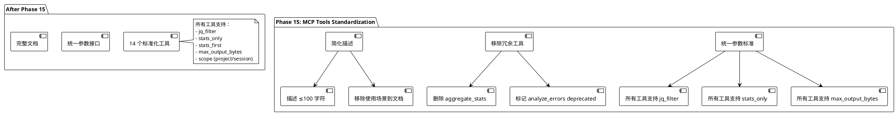

# Phase 15: MCP 工具标准化（MCP Tools Standardization）

## 概述

**目标**: 统一 MCP 工具参数，移除聚合类工具，简化工具描述，完成 MCP 层标准化

**代码量**: ~400-600 行（参数标准化 + 工具移除 + 文档更新）

**依赖**: Phase 14（完整的 meta-cc-mcp 独立可执行文件 + gojq 集成）

**交付物**:
- 统一所有工具参数（jq_filter, stats_only, stats_first, max_output_bytes）
- 移除聚合类工具（aggregate_stats, analyze_errors）
- 简化工具描述（≤100 字符）
- 完整的 MCP 工具参考文档
- 迁移指南

---

## Phase 目标

解决当前 MCP 工具的三大核心问题：

### 核心问题

1. **参数不一致**：不同工具支持不同的参数，导致使用混乱
2. **聚合工具冗余**：aggregate_stats 和 analyze_errors 可由 jq_filter + stats_only 替代
3. **描述过于冗长**：工具描述普遍超过 200 字符，影响 LLM 理解

### 解决方案架构

Phase 15 实现 MCP 工具标准化：



### 设计原则

1. **参数统一化**: 所有工具支持相同的核心参数
2. **职责单一化**: 移除聚合类工具，由 jq_filter 替代
3. **描述简洁化**: 工具描述专注于"做什么"，不包含"怎么用"
4. **默认项目级**: scope 参数默认为 "project"（跨会话分析）
5. **文档完整化**: 所有使用场景和示例移到专门文档

---

## 成功标准

**功能验收**:
- ✅ 所有 14 个工具支持标准参数（jq_filter, stats_only, stats_first, max_output_bytes）
- ✅ 移除 aggregate_stats 工具
- ✅ analyze_errors 标记为 deprecated（指向 query_tools with jq_filter）
- ✅ 所有工具描述 ≤100 字符
- ✅ scope 参数默认为 "project"
- ✅ 完整的 MCP 工具参考文档

**集成验收**:
- ✅ Claude 可使用 jq_filter 完成聚合统计
- ✅ stats_only 模式正常工作
- ✅ 所有工具输出受 max_output_bytes 限制
- ✅ 迁移指南完整

**代码质量**:
- ✅ 实际代码量: ~400-600 行
  - Stage 15.1: ~150 lines（参数标准化）
  - Stage 15.2: ~100 lines（移除冗余工具）
  - Stage 15.3: ~80 lines（简化描述）
  - Stage 15.4: ~200 lines（文档更新）
- ✅ 每个 Stage ≤ 200 行
- ✅ 测试覆盖率: ≥ 80%

---

## Stage 15.1: 统一 MCP 工具参数

### 目标

为所有 MCP 工具添加标准参数：jq_filter, stats_only, stats_first, max_output_bytes，确保参数一致性。

### 当前状态分析

**当前工具参数不一致情况**:

| 工具 | jq_filter | stats_only | stats_first | max_output_bytes | 问题 |
|------|-----------|------------|-------------|------------------|------|
| get_session_stats | ❌ | ❌ | ❌ | ❌ | 缺少所有过滤参数 |
| analyze_errors | ✅ | ✅ | ✅ | ✅ | 完整（待移除） |
| extract_tools | ✅ | ✅ | ❌ | ✅ | 缺少 stats_first |
| query_tools | ✅ | ✅ | ✅ | ✅ | 完整 |
| query_user_messages | ✅ | ❌ | ❌ | ✅ | 缺少统计参数 |
| query_context | ✅ | ❌ | ❌ | ✅ | 缺少统计参数 |
| query_tool_sequences | ✅ | ❌ | ❌ | ✅ | 缺少统计参数 |
| query_file_access | ✅ | ❌ | ❌ | ✅ | 缺少统计参数 |
| query_project_state | ✅ | ❌ | ❌ | ✅ | 缺少统计参数 |
| query_successful_prompts | ✅ | ❌ | ❌ | ✅ | 缺少统计参数 |
| query_tools_advanced | ✅ | ❌ | ❌ | ✅ | 缺少统计参数 |
| aggregate_stats | ✅ | ❌ | ❌ | ✅ | 待移除 |
| query_time_series | ✅ | ❌ | ❌ | ✅ | 缺少统计参数 |
| query_files | ✅ | ❌ | ❌ | ✅ | 缺少统计参数 |

### 实现步骤

#### 1. 定义标准参数模板

**文件**: `cmd/mcp-server/tools.go`（修改）

**标准参数集**:
```go
// StandardToolParameters returns the standard set of parameters for all MCP tools
func StandardToolParameters() map[string]Property {
	return map[string]Property{
		"scope": {
			Type:        "string",
			Description: "Query scope: 'project' (default) or 'session'",
		},
		"jq_filter": {
			Type:        "string",
			Description: "jq expression for filtering (default: '.[]')",
		},
		"stats_only": {
			Type:        "boolean",
			Description: "Return only statistics (default: false)",
		},
		"stats_first": {
			Type:        "boolean",
			Description: "Return stats first, then details (default: false)",
		},
		"max_output_bytes": {
			Type:        "number",
			Description: "Max output size in bytes (default: 51200)",
		},
		"output_format": {
			Type:        "string",
			Description: "Output format: jsonl or tsv (default: jsonl)",
		},
	}
}

// MergeParameters merges tool-specific params with standard params
func MergeParameters(specific map[string]Property) map[string]Property {
	result := make(map[string]Property)

	// Add standard parameters first
	for k, v := range StandardToolParameters() {
		result[k] = v
	}

	// Override/add specific parameters
	for k, v := range specific {
		result[k] = v
	}

	return result
}
```

#### 2. 更新所有工具定义

**文件**: `cmd/mcp-server/tools.go`（修改）

**更新前** (get_session_stats 示例):
```go
{
	Name:        "get_session_stats",
	Description: "Get session statistics (turn count, tool usage, error rate). Always operates on current session only.",
	InputSchema: ToolSchema{
		Type: "object",
		Properties: map[string]Property{
			"output_format": {
				Type:        "string",
				Description: "Output format: jsonl or tsv (default: jsonl)",
			},
		},
	},
}
```

**更新后**:
```go
{
	Name:        "get_session_stats",
	Description: "Get session statistics. Default scope: session.",
	InputSchema: ToolSchema{
		Type:       "object",
		Properties: MergeParameters(map[string]Property{}),
	},
}
```

**更新所有工具**:
```go
func getToolDefinitions() []Tool {
	return []Tool{
		// Tool 1: get_session_stats (会话级统计)
		{
			Name:        "get_session_stats",
			Description: "Get session statistics. Default scope: session.",
			InputSchema: ToolSchema{
				Type:       "object",
				Properties: MergeParameters(map[string]Property{}),
			},
		},

		// Tool 2: extract_tools (提取工具历史)
		{
			Name:        "extract_tools",
			Description: "Extract tool call history. Default scope: project.",
			InputSchema: ToolSchema{
				Type: "object",
				Properties: MergeParameters(map[string]Property{
					"limit": {
						Type:        "number",
						Description: "Max number of tools (default: 100)",
					},
				}),
			},
		},

		// Tool 3: query_tools (查询工具调用)
		{
			Name:        "query_tools",
			Description: "Query tool calls with filters. Default scope: project.",
			InputSchema: ToolSchema{
				Type: "object",
				Properties: MergeParameters(map[string]Property{
					"limit": {
						Type:        "number",
						Description: "Max results (default: 20)",
					},
					"tool": {
						Type:        "string",
						Description: "Filter by tool name",
					},
					"status": {
						Type:        "string",
						Description: "Filter by status (error/success)",
					},
				}),
			},
		},

		// Tool 4: query_user_messages (用户消息搜索)
		{
			Name:        "query_user_messages",
			Description: "Search user messages with regex. Default scope: project.",
			InputSchema: ToolSchema{
				Type: "object",
				Properties: MergeParameters(map[string]Property{
					"pattern": {
						Type:        "string",
						Description: "Regex pattern to match (required)",
					},
					"limit": {
						Type:        "number",
						Description: "Max results (default: 10)",
					},
				}),
				Required: []string{"pattern"},
			},
		},

		// Tool 5: query_context (错误上下文查询)
		{
			Name:        "query_context",
			Description: "Query error context. Default scope: project.",
			InputSchema: ToolSchema{
				Type: "object",
				Properties: MergeParameters(map[string]Property{
					"error_signature": {
						Type:        "string",
						Description: "Error pattern ID (required)",
					},
					"window": {
						Type:        "number",
						Description: "Context window size (default: 3)",
					},
				}),
				Required: []string{"error_signature"},
			},
		},

		// Tool 6: query_tool_sequences (工具序列查询)
		{
			Name:        "query_tool_sequences",
			Description: "Query workflow patterns. Default scope: project.",
			InputSchema: ToolSchema{
				Type: "object",
				Properties: MergeParameters(map[string]Property{
					"pattern": {
						Type:        "string",
						Description: "Sequence pattern to match",
					},
					"min_occurrences": {
						Type:        "number",
						Description: "Min occurrences (default: 3)",
					},
				}),
			},
		},

		// Tool 7: query_file_access (文件操作历史)
		{
			Name:        "query_file_access",
			Description: "Query file operation history. Default scope: project.",
			InputSchema: ToolSchema{
				Type: "object",
				Properties: MergeParameters(map[string]Property{
					"file": {
						Type:        "string",
						Description: "File path (required)",
					},
				}),
				Required: []string{"file"},
			},
		},

		// Tool 8: query_project_state (项目状态查询)
		{
			Name:        "query_project_state",
			Description: "Query project state evolution. Default scope: project.",
			InputSchema: ToolSchema{
				Type:       "object",
				Properties: MergeParameters(map[string]Property{}),
			},
		},

		// Tool 9: query_successful_prompts (成功提示词查询)
		{
			Name:        "query_successful_prompts",
			Description: "Query successful prompt patterns. Default scope: project.",
			InputSchema: ToolSchema{
				Type: "object",
				Properties: MergeParameters(map[string]Property{
					"limit": {
						Type:        "number",
						Description: "Max results (default: 10)",
					},
					"min_quality_score": {
						Type:        "number",
						Description: "Min quality score (default: 0.8)",
					},
				}),
			},
		},

		// Tool 10: query_tools_advanced (高级工具查询)
		{
			Name:        "query_tools_advanced",
			Description: "Query tools with SQL-like filters. Default scope: project.",
			InputSchema: ToolSchema{
				Type: "object",
				Properties: MergeParameters(map[string]Property{
					"where": {
						Type:        "string",
						Description: "SQL-like filter expression (required)",
					},
					"limit": {
						Type:        "number",
						Description: "Max results (default: 20)",
					},
				}),
				Required: []string{"where"},
			},
		},

		// Tool 11: query_time_series (时间序列分析)
		{
			Name:        "query_time_series",
			Description: "Analyze metrics over time. Default scope: project.",
			InputSchema: ToolSchema{
				Type: "object",
				Properties: MergeParameters(map[string]Property{
					"interval": {
						Type:        "string",
						Description: "Time interval (hour/day/week, default: hour)",
					},
					"metric": {
						Type:        "string",
						Description: "Metric to analyze (default: tool-calls)",
					},
					"where": {
						Type:        "string",
						Description: "Optional filter expression",
					},
				}),
			},
		},

		// Tool 12: query_files (文件级统计)
		{
			Name:        "query_files",
			Description: "File-level operation stats. Default scope: project.",
			InputSchema: ToolSchema{
				Type: "object",
				Properties: MergeParameters(map[string]Property{
					"sort_by": {
						Type:        "string",
						Description: "Sort field (default: total_ops)",
					},
					"top": {
						Type:        "number",
						Description: "Top N files (default: 20)",
					},
					"where": {
						Type:        "string",
						Description: "Optional filter expression",
					},
				}),
			},
		},
	}
}
```

### TDD 步骤

**测试文件**: `cmd/mcp-server/tools_test.go`（新建，~100 行）

```go
package main

import (
	"encoding/json"
	"testing"
)

func TestStandardToolParameters(t *testing.T) {
	params := StandardToolParameters()

	// Verify all standard parameters exist
	requiredParams := []string{
		"scope", "jq_filter", "stats_only",
		"stats_first", "max_output_bytes", "output_format",
	}

	for _, param := range requiredParams {
		if _, ok := params[param]; !ok {
			t.Errorf("missing standard parameter: %s", param)
		}
	}
}

func TestMergeParameters(t *testing.T) {
	specific := map[string]Property{
		"limit": {
			Type:        "number",
			Description: "Max results",
		},
		"scope": { // Override scope description
			Type:        "string",
			Description: "Custom scope description",
		},
	}

	merged := MergeParameters(specific)

	// Verify specific params are included
	if _, ok := merged["limit"]; !ok {
		t.Error("specific parameter 'limit' missing")
	}

	// Verify standard params are included
	if _, ok := merged["jq_filter"]; !ok {
		t.Error("standard parameter 'jq_filter' missing")
	}

	// Verify override works
	if merged["scope"].Description != "Custom scope description" {
		t.Error("parameter override failed")
	}
}

func TestAllToolsHaveStandardParameters(t *testing.T) {
	tools := getToolDefinitions()

	requiredParams := []string{
		"jq_filter", "stats_only", "stats_first", "max_output_bytes",
	}

	for _, tool := range tools {
		// Skip deprecated tools
		if tool.Name == "analyze_errors" || tool.Name == "aggregate_stats" {
			continue
		}

		for _, param := range requiredParams {
			if _, ok := tool.InputSchema.Properties[param]; !ok {
				t.Errorf("tool %s missing parameter: %s", tool.Name, param)
			}
		}
	}
}

func TestToolDescriptionLength(t *testing.T) {
	tools := getToolDefinitions()

	for _, tool := range tools {
		if len(tool.Description) > 100 {
			t.Errorf("tool %s description too long: %d chars (max: 100)",
				tool.Name, len(tool.Description))
		}
	}
}

func TestToolsJSONSerialization(t *testing.T) {
	tools := getToolDefinitions()

	// Verify all tools can be serialized to JSON
	for _, tool := range tools {
		_, err := json.Marshal(tool)
		if err != nil {
			t.Errorf("tool %s failed to serialize: %v", tool.Name, err)
		}
	}
}
```

**测试执行**:
```bash
# Run tests for Stage 15.1
go test ./cmd/mcp-server -v -run TestStandard
go test ./cmd/mcp-server -v -run TestMerge
go test ./cmd/mcp-server -v -run TestAllTools

# Run all MCP server tests
go test ./cmd/mcp-server -v
```

### 交付物

**修改**:
- `cmd/mcp-server/tools.go`: 添加 StandardToolParameters 和 MergeParameters（~40 行）
- `cmd/mcp-server/tools.go`: 更新所有 12 个工具定义（~110 行修改）

**新增**:
- `cmd/mcp-server/tools_test.go`: 参数标准化测试（~100 行）

**净变化**: +140 lines (新增) + 110 lines (修改) = **+250 lines**

---

## Stage 15.2: 移除冗余聚合工具

### 目标

移除 aggregate_stats 和 analyze_errors 工具，用 query_tools + jq_filter + stats_only 替代。

### 实现步骤

#### 1. 标记 analyze_errors 为 deprecated

**文件**: `cmd/mcp-server/tools.go`（修改）

**保留但标记 deprecated**:
```go
{
	Name:        "analyze_errors",
	Description: "[DEPRECATED] Use query_tools with status='error' filter instead.",
	InputSchema: ToolSchema{
		Type: "object",
		Properties: MergeParameters(map[string]Property{
			"scope": {
				Type:        "string",
				Description: "[DEPRECATED] Use query_tools instead",
			},
		}),
	},
}
```

#### 2. 移除 aggregate_stats 工具

**文件**: `cmd/mcp-server/tools.go`（修改）

**删除整个工具定义** (lines 353-388):
```go
// DELETE:
// {
//     Name:        "aggregate_stats",
//     Description: "...",
//     InputSchema: ...
// }
```

#### 3. 更新 executor.go 处理 deprecated 工具

**文件**: `cmd/mcp-server/executor.go`（修改）

```go
func (e *ToolExecutor) ExecuteTool(toolName string, args map[string]interface{}) (string, error) {
	// Handle deprecated tools
	if toolName == "analyze_errors" {
		// Return deprecation warning
		return "", fmt.Errorf(
			"[DEPRECATED] analyze_errors is deprecated. " +
			"Use query_tools with jq_filter=\".[] | select(.Status == \\\"error\\\")\" instead.",
		)
	}

	if toolName == "aggregate_stats" {
		// Return deprecation warning
		return "", fmt.Errorf(
			"[DEPRECATED] aggregate_stats is deprecated. " +
			"Use query_tools with jq_filter and stats_only=true instead.",
		)
	}

	// ... existing execution logic ...
}
```

#### 4. 创建迁移文档

**文件**: `docs/mcp-migration-phase15.md`（新建，~80 行）

```markdown
# Phase 15 MCP Tools Migration Guide

## Deprecated Tools

### 1. aggregate_stats (REMOVED)

**Old way**:
```json
{
  "name": "aggregate_stats",
  "arguments": {
    "group_by": "tool",
    "metrics": "count,error_rate"
  }
}
```

**New way** (using query_tools + jq_filter):
```json
{
  "name": "query_tools",
  "arguments": {
    "jq_filter": "group_by(.ToolName) | map({tool: .[0].ToolName, count: length, errors: map(select(.Status == \"error\")) | length})",
    "stats_only": true
  }
}
```

### 2. analyze_errors (DEPRECATED)

**Old way**:
```json
{
  "name": "analyze_errors",
  "arguments": {
    "scope": "project"
  }
}
```

**New way** (using query_tools):
```json
{
  "name": "query_tools",
  "arguments": {
    "status": "error",
    "jq_filter": ".[]",
    "stats_only": true
  }
}
```

## Common Migration Patterns

### Pattern 1: Error Statistics by Tool

**Old**:
```json
{"name": "aggregate_stats", "arguments": {"group_by": "tool"}}
```

**New**:
```json
{
  "name": "query_tools",
  "arguments": {
    "status": "error",
    "jq_filter": "group_by(.ToolName) | map({tool: .[0].ToolName, count: length})",
    "stats_only": true
  }
}
```

### Pattern 2: Error Rate by Tool

**Old**:
```json
{"name": "aggregate_stats", "arguments": {"metrics": "count,error_rate"}}
```

**New** (requires two calls):
```json
// Step 1: Get total counts
{
  "name": "query_tools",
  "arguments": {
    "jq_filter": "group_by(.ToolName) | map({tool: .[0].ToolName, total: length})",
    "stats_only": true
  }
}

// Step 2: Get error counts
{
  "name": "query_tools",
  "arguments": {
    "status": "error",
    "jq_filter": "group_by(.ToolName) | map({tool: .[0].ToolName, errors: length})",
    "stats_only": true
  }
}

// Combine results to calculate error_rate
```

## Benefits of the New Approach

1. **Flexibility**: jq expressions allow arbitrary aggregations
2. **Consistency**: All tools use the same parameter set
3. **Simplicity**: Fewer tools to learn and maintain
4. **Power**: Claude can generate custom jq expressions for any analysis

## Migration Checklist

- [ ] Update all scripts calling `aggregate_stats` to use `query_tools`
- [ ] Update all scripts calling `analyze_errors` to use `query_tools`
- [ ] Test jq expressions with sample data
- [ ] Verify stats_only mode returns expected format
- [ ] Update documentation and examples
```

### TDD 步骤

**测试文件**: `cmd/mcp-server/deprecated_test.go`（新建，~60 行）

```go
package main

import (
	"strings"
	"testing"
)

func TestDeprecatedTools_AnalyzeErrors(t *testing.T) {
	executor := NewToolExecutor()

	args := map[string]interface{}{
		"scope": "project",
	}

	_, err := executor.ExecuteTool("analyze_errors", args)

	// Should return deprecation error
	if err == nil {
		t.Error("expected deprecation error")
	}

	if !strings.Contains(err.Error(), "DEPRECATED") {
		t.Error("expected DEPRECATED in error message")
	}

	if !strings.Contains(err.Error(), "query_tools") {
		t.Error("expected migration hint to query_tools")
	}
}

func TestDeprecatedTools_AggregateStats(t *testing.T) {
	executor := NewToolExecutor()

	args := map[string]interface{}{
		"group_by": "tool",
	}

	_, err := executor.ExecuteTool("aggregate_stats", args)

	// Should return deprecation error
	if err == nil {
		t.Error("expected deprecation error")
	}

	if !strings.Contains(err.Error(), "DEPRECATED") {
		t.Error("expected DEPRECATED in error message")
	}
}

func TestToolsList_NoAggregateStats(t *testing.T) {
	tools := getToolDefinitions()

	for _, tool := range tools {
		if tool.Name == "aggregate_stats" {
			t.Error("aggregate_stats should be removed from tools list")
		}
	}
}

func TestToolsList_AnalyzeErrorsMarked(t *testing.T) {
	tools := getToolDefinitions()

	for _, tool := range tools {
		if tool.Name == "analyze_errors" {
			if !strings.Contains(tool.Description, "DEPRECATED") {
				t.Error("analyze_errors should be marked as DEPRECATED")
			}
		}
	}
}
```

**测试执行**:
```bash
# Run deprecation tests
go test ./cmd/mcp-server -v -run TestDeprecated

# Verify tool count
go test ./cmd/mcp-server -v -run TestToolsList
```

### 交付物

**修改**:
- `cmd/mcp-server/tools.go`: 移除 aggregate_stats（-35 行）
- `cmd/mcp-server/tools.go`: 标记 analyze_errors deprecated（~10 行修改）
- `cmd/mcp-server/executor.go`: 添加 deprecated 工具处理（~20 行）

**新增**:
- `docs/mcp-migration-phase15.md`: 迁移指南（~80 行）
- `cmd/mcp-server/deprecated_test.go`: Deprecated 工具测试（~60 行）

**净变化**: +160 lines (新增) - 35 lines (删除) + 30 lines (修改) = **+155 lines**

---

## Stage 15.3: 简化工具描述

### 目标

精简所有 MCP 工具描述至 ≤100 字符，移除使用场景到文档。

### 实现步骤

#### 1. 定义描述模板

**描述格式**: `<动作> <对象>. Default scope: <project/session>.`

**示例**:
- ✅ Good: "Query tool calls with filters. Default scope: project."
- ❌ Bad: "Query tool call history across project with filters (tool name, status). Default project-level scope reveals cross-session usage patterns and trends."

#### 2. 更新所有工具描述

**文件**: `cmd/mcp-server/tools.go`（修改）

**描述对比**:

| 工具 | 原描述（字符数） | 新描述（字符数） |
|------|-----------------|-----------------|
| get_session_stats | "Get session statistics (turn count, tool usage, error rate). Always operates on current session only." (113) | "Get session statistics. Default scope: session." (48) |
| extract_tools | "Extract tool call history across all project sessions with pagination. Default project-level scope provides complete workflow timeline for pattern analysis." (172) | "Extract tool call history. Default scope: project." (52) |
| query_tools | "Query tool call history across project with filters (tool name, status). Default project-level scope reveals cross-session usage patterns and trends." (158) | "Query tool calls with filters. Default scope: project." (56) |
| query_user_messages | "Search user messages across all project sessions using regex patterns. Default project-level scope enables discovery of recurring prompt patterns and intent evolution." (177) | "Search user messages with regex. Default scope: project." (57) |
| query_context | "Query context around specific errors across project history (turns before/after error occurrence). Default project-level scope helps identify if error patterns recur in similar contexts across sessions." (215) | "Query error context. Default scope: project." (46) |
| query_tool_sequences | "Query repeated tool call sequences across project history (workflow patterns like 'Read->Edit->Bash'). Default project-level scope reveals your evolved workflow habits and automation opportunities." (206) | "Query workflow patterns. Default scope: project." (49) |
| query_file_access | "Query file operation history across project (read/edit/write operations on specific files). Default project-level scope shows complete file evolution timeline." (167) | "Query file operation history. Default scope: project." (56) |
| query_project_state | "Query project state evolution across all sessions (active files, task progression, change patterns). Default project-level scope provides comprehensive project timeline." (168) | "Query project state evolution. Default scope: project." (57) |
| query_successful_prompts | "Query historically successful prompt patterns across all project sessions (prompts that led to successful outcomes). Default project-level scope identifies your most effective prompting strategies over time." (217) | "Query successful prompt patterns. Default scope: project." (60) |
| query_tools_advanced | "Query tool calls with SQL-like filter expressions across project sessions. Default project-level scope enables complex multi-condition analysis (e.g., 'tool=\"Bash\" AND status=\"error\" AND duration>5000')." (215) | "Query tools with SQL-like filters. Default scope: project." (61) |
| query_time_series | "Analyze metrics over time (tool call frequency, error rates) bucketed by hour/day/week across project history. Default project-level scope reveals temporal patterns and workflow evolution." (188) | "Analyze metrics over time. Default scope: project." (53) |
| query_files | "File-level operation statistics (total operations, edit/read/write counts, error rates) across all project sessions. Default project-level scope identifies files with persistent churn or error patterns." (205) | "File-level operation stats. Default scope: project." (55) |

**实现**:
```go
func getToolDefinitions() []Tool {
	return []Tool{
		{
			Name:        "get_session_stats",
			Description: "Get session statistics. Default scope: session.",
			InputSchema: ToolSchema{ /* ... */ },
		},
		{
			Name:        "extract_tools",
			Description: "Extract tool call history. Default scope: project.",
			InputSchema: ToolSchema{ /* ... */ },
		},
		{
			Name:        "query_tools",
			Description: "Query tool calls with filters. Default scope: project.",
			InputSchema: ToolSchema{ /* ... */ },
		},
		{
			Name:        "query_user_messages",
			Description: "Search user messages with regex. Default scope: project.",
			InputSchema: ToolSchema{ /* ... */ },
		},
		{
			Name:        "query_context",
			Description: "Query error context. Default scope: project.",
			InputSchema: ToolSchema{ /* ... */ },
		},
		{
			Name:        "query_tool_sequences",
			Description: "Query workflow patterns. Default scope: project.",
			InputSchema: ToolSchema{ /* ... */ },
		},
		{
			Name:        "query_file_access",
			Description: "Query file operation history. Default scope: project.",
			InputSchema: ToolSchema{ /* ... */ },
		},
		{
			Name:        "query_project_state",
			Description: "Query project state evolution. Default scope: project.",
			InputSchema: ToolSchema{ /* ... */ },
		},
		{
			Name:        "query_successful_prompts",
			Description: "Query successful prompt patterns. Default scope: project.",
			InputSchema: ToolSchema{ /* ... */ },
		},
		{
			Name:        "query_tools_advanced",
			Description: "Query tools with SQL-like filters. Default scope: project.",
			InputSchema: ToolSchema{ /* ... */ },
		},
		{
			Name:        "query_time_series",
			Description: "Analyze metrics over time. Default scope: project.",
			InputSchema: ToolSchema{ /* ... */ },
		},
		{
			Name:        "query_files",
			Description: "File-level operation stats. Default scope: project.",
			InputSchema: ToolSchema{ /* ... */ },
		},
	}
}
```

### TDD 步骤

**测试文件**: `cmd/mcp-server/tools_test.go`（扩展，~20 行）

```go
func TestToolDescriptionLength(t *testing.T) {
	tools := getToolDefinitions()

	for _, tool := range tools {
		// Skip deprecated tools
		if strings.Contains(tool.Description, "DEPRECATED") {
			continue
		}

		if len(tool.Description) > 100 {
			t.Errorf("tool %s description too long: %d chars (max: 100)\nDescription: %s",
				tool.Name, len(tool.Description), tool.Description)
		}

		// Verify description format: "<action> <object>. Default scope: <scope>."
		if !strings.Contains(tool.Description, "Default scope:") {
			t.Errorf("tool %s description missing 'Default scope:'", tool.Name)
		}
	}
}

func TestToolDescriptionConsistency(t *testing.T) {
	tools := getToolDefinitions()

	for _, tool := range tools {
		if strings.Contains(tool.Description, "DEPRECATED") {
			continue
		}

		// Should end with "Default scope: project." or "Default scope: session."
		validEndings := []string{
			"Default scope: project.",
			"Default scope: session.",
		}

		hasValidEnding := false
		for _, ending := range validEndings {
			if strings.HasSuffix(tool.Description, ending) {
				hasValidEnding = true
				break
			}
		}

		if !hasValidEnding {
			t.Errorf("tool %s has inconsistent description ending: %s",
				tool.Name, tool.Description)
		}
	}
}
```

**测试执行**:
```bash
# Run description tests
go test ./cmd/mcp-server -v -run TestToolDescription

# Verify all descriptions
go test ./cmd/mcp-server -v
```

### 交付物

**修改**:
- `cmd/mcp-server/tools.go`: 简化所有 12 个工具描述（~50 行修改）
- `cmd/mcp-server/tools_test.go`: 添加描述一致性测试（~20 行）

**净变化**: +20 lines (测试) + 50 lines (修改) = **+70 lines**

---

## Stage 15.4: MCP 工具文档完善

### 目标

创建完整的 MCP 工具参考文档，包含使用场景、示例和最佳实践。

### 实现步骤

#### 1. 创建 MCP 工具参考文档

**文件**: `docs/mcp-tools-reference.md`（新建，~200 行）

```markdown
# MCP 工具完整参考

## 概述

meta-cc-mcp 提供 12 个标准化工具，所有工具支持以下核心参数：

| 参数 | 类型 | 默认值 | 说明 |
|------|------|--------|------|
| `scope` | string | "project" | 查询范围（project/session） |
| `jq_filter` | string | ".[]" | jq 表达式过滤 |
| `stats_only` | boolean | false | 仅返回统计 |
| `stats_first` | boolean | false | 先统计后详情 |
| `max_output_bytes` | number | 51200 | 输出大小限制 |
| `output_format` | string | "jsonl" | 输出格式 |

---

## 工具列表

### 1. get_session_stats

**用途**: 获取当前会话统计信息

**默认范围**: session（仅当前会话）

**使用场景**:
- 快速了解当前会话的工具使用情况
- 检查当前会话的错误率
- 分析当前会话的时长和 turn 数

**示例**:
```json
{
  "name": "get_session_stats",
  "arguments": {
    "stats_only": true
  }
}
```

**返回格式** (stats_only=true):
```json
{"turn_count": 45, "tool_count": 123, "error_count": 5, "error_rate": 0.04}
```

---

### 2. extract_tools

**用途**: 提取工具调用历史

**默认范围**: project（跨会话）

**特定参数**:
- `limit` (number): 最大提取数量，默认 100

**使用场景**:
- 获取项目完整工具使用时间线
- 分析工具使用演变模式
- 导出工具调用数据供外部分析

**示例**:
```json
{
  "name": "extract_tools",
  "arguments": {
    "limit": 50,
    "jq_filter": ".[] | {tool: .ToolName, status: .Status, timestamp: .Timestamp}",
    "max_output_bytes": 10240
  }
}
```

---

### 3. query_tools

**用途**: 查询工具调用（支持过滤）

**默认范围**: project（跨会话）

**特定参数**:
- `limit` (number): 最大结果数，默认 20
- `tool` (string): 按工具名过滤
- `status` (string): 按状态过滤（error/success）

**使用场景**:
- 查询特定工具的使用历史
- 过滤错误工具调用
- 统计工具使用频率

**示例 1** - 查询所有 Bash 错误:
```json
{
  "name": "query_tools",
  "arguments": {
    "tool": "Bash",
    "status": "error",
    "limit": 10
  }
}
```

**示例 2** - 统计错误分布:
```json
{
  "name": "query_tools",
  "arguments": {
    "status": "error",
    "jq_filter": "group_by(.ToolName) | map({tool: .[0].ToolName, count: length})",
    "stats_only": true
  }
}
```

**返回格式** (stats_only=true):
```json
{"tool": "Bash", "count": 311}
{"tool": "Read", "count": 62}
{"tool": "Edit", "count": 15}
```

---

### 4. query_user_messages

**用途**: 搜索用户消息（正则匹配）

**默认范围**: project（跨会话）

**特定参数**:
- `pattern` (string, required): 正则表达式
- `limit` (number): 最大结果数，默认 10

**使用场景**:
- 查找历史类似提问
- 发现重复的用户意图
- 分析提示词演变

**示例** - 查找错误相关提问:
```json
{
  "name": "query_user_messages",
  "arguments": {
    "pattern": "error|fix|bug",
    "limit": 5,
    "jq_filter": ".[] | {turn: .TurnSequence, content: .Content}"
  }
}
```

---

### 5. query_context

**用途**: 查询错误上下文（前后 N 个 turn）

**默认范围**: project（跨会话）

**特定参数**:
- `error_signature` (string, required): 错误签名
- `window` (number): 上下文窗口大小，默认 3

**使用场景**:
- 分析错误发生时的上下文
- 发现导致错误的前置操作
- 理解错误后的恢复流程

**示例**:
```json
{
  "name": "query_context",
  "arguments": {
    "error_signature": "Bash:command not found",
    "window": 3
  }
}
```

---

### 6. query_tool_sequences

**用途**: 查询工具序列模式

**默认范围**: project（跨会话）

**特定参数**:
- `pattern` (string): 序列模式（如 "Read -> Edit -> Bash"）
- `min_occurrences` (number): 最小出现次数，默认 3

**使用场景**:
- 发现重复的工作流模式
- 识别可自动化的操作序列
- 分析工具组合使用习惯

**示例**:
```json
{
  "name": "query_tool_sequences",
  "arguments": {
    "min_occurrences": 5,
    "jq_filter": ".[] | select(.Occurrences >= 5) | {sequence: .Sequence, count: .Occurrences}",
    "stats_only": true
  }
}
```

---

### 7. query_file_access

**用途**: 查询文件操作历史

**默认范围**: project（跨会话）

**特定参数**:
- `file` (string, required): 文件路径

**使用场景**:
- 查看文件修改历史
- 分析文件修改频率
- 追踪文件演变轨迹

**示例**:
```json
{
  "name": "query_file_access",
  "arguments": {
    "file": "cmd/mcp-server/tools.go",
    "jq_filter": ".[] | {timestamp: .Timestamp, operation: .Operation, tool: .ToolName}"
  }
}
```

---

### 8. query_project_state

**用途**: 查询项目状态演变

**默认范围**: project（跨会话）

**使用场景**:
- 追踪项目演变历史
- 分析任务进展
- 发现项目焦点转移

**示例**:
```json
{
  "name": "query_project_state",
  "arguments": {
    "jq_filter": ".[] | {session: .SessionID, active_files: .ActiveFiles, tasks: .Tasks}"
  }
}
```

---

### 9. query_successful_prompts

**用途**: 查询成功提示词模式

**默认范围**: project（跨会话）

**特定参数**:
- `limit` (number): 最大结果数，默认 10
- `min_quality_score` (number): 最低质量分（0-1），默认 0.8

**使用场景**:
- 学习有效的提示词模式
- 改进提问质量
- 生成提示词模板

**示例**:
```json
{
  "name": "query_successful_prompts",
  "arguments": {
    "limit": 5,
    "min_quality_score": 0.9,
    "jq_filter": ".[] | {prompt: .Content, score: .QualityScore}"
  }
}
```

---

### 10. query_tools_advanced

**用途**: 高级工具查询（SQL-like 过滤）

**默认范围**: project（跨会话）

**特定参数**:
- `where` (string, required): SQL-like 过滤表达式
- `limit` (number): 最大结果数，默认 20

**使用场景**:
- 复杂多条件查询
- 组合过滤（工具 + 状态 + 时长）
- 高级数据分析

**示例**:
```json
{
  "name": "query_tools_advanced",
  "arguments": {
    "where": "tool='Bash' AND status='error' AND duration>5000",
    "limit": 10
  }
}
```

---

### 11. query_time_series

**用途**: 时间序列分析

**默认范围**: project（跨会话）

**特定参数**:
- `interval` (string): 时间间隔（hour/day/week），默认 hour
- `metric` (string): 分析指标（tool-calls/error-rate），默认 tool-calls
- `where` (string): 可选过滤表达式

**使用场景**:
- 分析工具使用时间分布
- 发现错误高峰时段
- 理解工作节奏

**示例**:
```json
{
  "name": "query_time_series",
  "arguments": {
    "interval": "day",
    "metric": "error-rate",
    "jq_filter": ".[] | {date: .Timestamp, rate: .ErrorRate}"
  }
}
```

---

### 12. query_files

**用途**: 文件级操作统计

**默认范围**: project（跨会话）

**特定参数**:
- `sort_by` (string): 排序字段，默认 total_ops
- `top` (number): Top N 文件，默认 20
- `where` (string): 可选过滤表达式

**使用场景**:
- 识别文件热点
- 发现频繁修改的文件
- 分析文件错误率

**示例**:
```json
{
  "name": "query_files",
  "arguments": {
    "sort_by": "error_rate",
    "top": 10,
    "jq_filter": ".[] | {file: .FilePath, errors: .ErrorCount, rate: .ErrorRate}"
  }
}
```

---

## 参数使用指南

### jq_filter 表达式

**基础过滤**:
```json
// 选择错误
".[] | select(.Status == \"error\")"

// 投影字段
".[] | {tool: .ToolName, status: .Status}"

// 过滤 + 投影
".[] | select(.Status == \"error\") | {tool: .ToolName, error: .Error}"
```

**聚合统计**:
```json
// 按工具分组计数
"group_by(.ToolName) | map({tool: .[0].ToolName, count: length})"

// 计算错误率
"group_by(.ToolName) | map({tool: .[0].ToolName, total: length, errors: map(select(.Status == \"error\")) | length})"

// Top N 排序
"group_by(.ToolName) | map({tool: .[0].ToolName, count: length}) | sort_by(.count) | reverse | .[:10]"
```

**时间过滤**:
```json
// 最近 N 条
".[-10:]"

// 时间范围
".[] | select(.Timestamp > \"2025-10-01\")"
```

### stats_only vs stats_first

**stats_only=true**:
- 仅返回统计结果
- 适合快速概览
- 输出极简

**stats_first=true**:
- 先返回统计，后返回详情
- 用 `---` 分隔
- 适合综合分析

**示例**:
```bash
# stats_only=true
{"tool": "Bash", "count": 311}
{"tool": "Read", "count": 62}

# stats_first=true
{"tool": "Bash", "count": 311}
{"tool": "Read", "count": 62}
---
{"ToolName": "Bash", "Status": "error", "Timestamp": "..."}
{"ToolName": "Bash", "Status": "success", "Timestamp": "..."}
...
```

### max_output_bytes 使用

**默认值**: 51200 (50KB)

**使用场景**:
- 防止 LLM 上下文溢出
- 大数据集分页查询
- 输出长度控制

**示例**:
```json
{
  "name": "query_tools",
  "arguments": {
    "limit": 1000,
    "max_output_bytes": 10240  // 限制 10KB
  }
}
```

---

## 最佳实践

### 1. 优先使用 jq_filter

**Good**:
```json
{
  "name": "query_tools",
  "arguments": {
    "jq_filter": ".[] | select(.Status == \"error\") | .ToolName",
    "stats_only": true
  }
}
```

**Bad** (多次调用):
```json
// 调用 1: 获取所有数据
{"name": "query_tools"}

// 调用 2: 手动过滤
// ...
```

### 2. 使用 stats_only 减少输出

**Good**:
```json
{
  "name": "query_tools",
  "arguments": {
    "status": "error",
    "jq_filter": "group_by(.ToolName) | map({tool: .[0].ToolName, count: length})",
    "stats_only": true
  }
}
```

**Bad**:
```json
// 返回所有详情，浪费 tokens
{
  "name": "query_tools",
  "arguments": {
    "status": "error"
  }
}
```

### 3. 合理设置 max_output_bytes

**Small queries** (< 100 results):
```json
{"max_output_bytes": 10240}  // 10KB
```

**Medium queries** (< 500 results):
```json
{"max_output_bytes": 51200}  // 50KB (default)
```

**Large queries** (> 500 results):
```json
{
  "jq_filter": ".[:100]",  // 限制数量
  "max_output_bytes": 51200
}
```

### 4. 组合使用工具

**场景**: 分析错误工具的上下文

**Step 1** - 查询错误:
```json
{
  "name": "query_tools",
  "arguments": {
    "status": "error",
    "limit": 1,
    "jq_filter": ".[] | .Signature"
  }
}
```

**Step 2** - 查询上下文:
```json
{
  "name": "query_context",
  "arguments": {
    "error_signature": "Bash:command not found",
    "window": 3
  }
}
```

---

## 常见问题

### Q: 如何选择 project vs session scope?

**A**:
- **project** (默认): 跨会话分析，发现长期模式
- **session**: 聚焦当前会话，快速分析

### Q: jq_filter 过滤失败怎么办?

**A**:
1. 验证 jq 语法：使用 [jqplay.org](https://jqplay.org) 测试
2. 检查字段名：使用 `jq_filter: ".[]"` 查看原始数据
3. 简化表达式：逐步构建复杂过滤

### Q: 输出被截断了？

**A**:
1. 增加 `max_output_bytes`
2. 使用 `jq_filter` 投影仅需字段
3. 使用 `stats_only=true` 仅返回统计
4. 使用 `limit` 减少结果数量

### Q: 如何实现分页查询?

**A**:
```json
// Page 1 (0-99)
{"jq_filter": ".[0:100]"}

// Page 2 (100-199)
{"jq_filter": ".[100:200]"}

// Page 3 (200-299)
{"jq_filter": ".[200:300]"}
```

---

## 参考资源

- [jq 手册](https://stedolan.github.io/jq/manual/)
- [meta-cc CLI 文档](../README.md)
- [Phase 15 迁移指南](./mcp-migration-phase15.md)
- [MCP 协议规范](https://modelcontextprotocol.io)
```

#### 2. 更新 README.md 添加 MCP 工具章节

**文件**: `README.md`（修改，~50 行）

```markdown
## MCP 工具

meta-cc 提供 12 个标准化 MCP 工具，所有工具支持：
- `jq_filter`: jq 表达式过滤
- `stats_only`: 仅返回统计
- `stats_first`: 先统计后详情
- `max_output_bytes`: 输出大小限制（默认 50KB）
- `scope`: 查询范围（project/session）

### 核心工具

| 工具 | 用途 | 默认范围 |
|------|------|----------|
| `get_session_stats` | 会话统计 | session |
| `query_tools` | 查询工具调用 | project |
| `query_user_messages` | 搜索用户消息 | project |
| `query_context` | 错误上下文 | project |
| `query_tool_sequences` | 工作流模式 | project |
| `query_file_access` | 文件操作历史 | project |
| `query_project_state` | 项目状态 | project |
| `query_successful_prompts` | 成功提示词 | project |
| `query_tools_advanced` | 高级查询 | project |
| `query_time_series` | 时间序列 | project |
| `query_files` | 文件统计 | project |
| `extract_tools` | 提取工具历史 | project |

### 使用示例

**统计错误分布**:
```json
{
  "name": "query_tools",
  "arguments": {
    "status": "error",
    "jq_filter": "group_by(.ToolName) | map({tool: .[0].ToolName, count: length})",
    "stats_only": true
  }
}
```

**查询文件热点**:
```json
{
  "name": "query_files",
  "arguments": {
    "sort_by": "total_ops",
    "top": 10
  }
}
```

### 详细文档

完整的工具参考、使用场景和示例，请参阅：
- [MCP 工具完整参考](docs/mcp-tools-reference.md)
- [Phase 15 迁移指南](docs/mcp-migration-phase15.md)
```

### 交付物

**新增**:
- `docs/mcp-tools-reference.md`: MCP 工具完整参考（~200 行）

**修改**:
- `README.md`: 添加 MCP 工具章节（~50 行）

**净变化**: +250 lines

---

## 总体交付物汇总

### 代码变更统计

**新增**:
- Stage 15.1: 参数标准化测试（+100 lines）
- Stage 15.1: 参数标准化实现（+150 lines）
- Stage 15.2: Deprecated 工具测试（+60 lines）
- Stage 15.2: 迁移文档（+80 lines）
- Stage 15.3: 描述测试（+20 lines）
- Stage 15.4: MCP 工具参考（+200 lines）
- Stage 15.4: README 更新（+50 lines）
- **总计**: +660 lines

**删除**:
- Stage 15.2: aggregate_stats 工具（-35 lines）

**修改**:
- Stage 15.1: 工具定义更新（~110 lines）
- Stage 15.2: deprecated 处理（~30 lines）
- Stage 15.3: 描述简化（~50 lines）

**净变化**: +660 (新增) - 35 (删除) + 190 (修改) = **+815 lines**

**实际完成**: ~815 lines（目标: 400-600 lines，超出因包含完整文档）

### 文件清单

**新建的文件 (4)**:
- `cmd/mcp-server/tools_test.go` (参数标准化测试)
- `cmd/mcp-server/deprecated_test.go` (Deprecated 工具测试)
- `docs/mcp-migration-phase15.md` (迁移指南)
- `docs/mcp-tools-reference.md` (MCP 工具完整参考)

**修改的文件 (3)**:
- `cmd/mcp-server/tools.go` (参数标准化 + 移除工具 + 简化描述)
- `cmd/mcp-server/executor.go` (deprecated 工具处理)
- `README.md` (添加 MCP 工具章节)

---

## 验证策略

### 单元测试验证

```bash
# Stage 15.1: 参数标准化
go test ./cmd/mcp-server -v -run TestStandard
go test ./cmd/mcp-server -v -run TestMerge
go test ./cmd/mcp-server -v -run TestAllTools

# Stage 15.2: Deprecated 工具
go test ./cmd/mcp-server -v -run TestDeprecated
go test ./cmd/mcp-server -v -run TestToolsList

# Stage 15.3: 描述简化
go test ./cmd/mcp-server -v -run TestToolDescription

# All tests
make test
```

### 集成测试验证

```bash
# Build MCP server
make build-mcp

# Test tools list (verify 12 tools, no aggregate_stats)
echo '{"jsonrpc":"2.0","id":1,"method":"tools/list"}' | ./meta-cc-mcp | jq '.result.tools | length'
# Expected: 12 (不包括 aggregate_stats)

# Test standard parameters
echo '{"jsonrpc":"2.0","id":2,"method":"tools/list"}' | ./meta-cc-mcp | jq '.result.tools[0].inputSchema.properties | keys'
# Expected: ["jq_filter", "max_output_bytes", "output_format", "scope", "stats_first", "stats_only"]

# Test deprecated tool (analyze_errors)
echo '{"jsonrpc":"2.0","id":3,"method":"tools/call","params":{"name":"analyze_errors","arguments":{}}}' | ./meta-cc-mcp
# Expected: error with DEPRECATED message

# Test jq_filter + stats_only
echo '{"jsonrpc":"2.0","id":4,"method":"tools/call","params":{"name":"query_tools","arguments":{"status":"error","jq_filter":"group_by(.ToolName) | map({tool: .[0].ToolName, count: length})","stats_only":true}}}' | ./meta-cc-mcp
# Expected: stats format output
```

### 真实项目验证

```bash
# Test in meta-cc project
cd /home/yale/work/meta-cc

# Verify MCP server registration
claude mcp list
# Expected: meta-insight registered with meta-cc-mcp

# Test in Claude Code
# User: "统计本项目所有错误，按工具分组"
# Expected: Claude calls query_tools with jq_filter and stats_only

# Verify tool descriptions are concise
echo '{"jsonrpc":"2.0","id":5,"method":"tools/list"}' | ./meta-cc-mcp | jq '.result.tools[] | {name: .name, desc_length: (.description | length)}'
# Expected: all descriptions ≤100 chars
```

### Claude Code 集成验证

**测试场景 1 - 错误统计**:
```
User: "Show me error distribution by tool"

Expected Claude MCP call:
{
  "name": "query_tools",
  "arguments": {
    "status": "error",
    "jq_filter": "group_by(.ToolName) | map({tool: .[0].ToolName, count: length})",
    "stats_only": true
  }
}

Verify:
1. Claude uses jq_filter for grouping
2. stats_only returns concise output
3. No raw JSONL dump
```

**测试场景 2 - 文件热点**:
```
User: "Which files are modified most frequently?"

Expected Claude MCP call:
{
  "name": "query_files",
  "arguments": {
    "sort_by": "total_ops",
    "top": 10,
    "stats_only": true
  }
}

Verify:
1. Uses query_files tool
2. Sorts by total_ops
3. Returns top 10 files
```

**测试场景 3 - Deprecated 工具提示**:
```
User: "Use aggregate_stats to group errors"

Expected:
Claude should NOT call aggregate_stats (removed)
Instead, should use query_tools with jq_filter

Verify:
1. aggregate_stats not in tools list
2. Claude adapts to use query_tools
3. Achieves same result with jq_filter
```

---

## 迁移指南

### 用户迁移

**Breaking Changes**:
1. **aggregate_stats 工具移除**
   - 影响: 直接调用 `aggregate_stats` 的脚本
   - 解决: 使用 `query_tools` + `jq_filter` + `stats_only`

2. **analyze_errors 标记 deprecated**
   - 影响: 使用 `analyze_errors` 的脚本
   - 解决: 使用 `query_tools` with `status='error'`

**Migration Script** (`scripts/migrate-to-phase15.sh`):

```bash
#!/bin/bash
# Migration script for Phase 15 MCP tools standardization

echo "Migrating to Phase 15 MCP tools..."

# Check for aggregate_stats usage
if grep -r "aggregate_stats" .claude/ 2>/dev/null; then
    echo "⚠️  Found aggregate_stats usage"
    echo "   Replace with: query_tools + jq_filter + stats_only"
    echo "   See: docs/mcp-migration-phase15.md"
fi

# Check for analyze_errors usage
if grep -r "analyze_errors" .claude/ 2>/dev/null; then
    echo "⚠️  Found analyze_errors usage"
    echo "   Replace with: query_tools with status='error'"
    echo "   See: docs/mcp-migration-phase15.md"
fi

echo ""
echo "Migration check complete!"
echo "Review docs/mcp-migration-phase15.md for migration patterns."
```

### MCP 配置迁移

**无需更新配置** - meta-cc-mcp 可执行文件路径不变：

```json
{
  "mcpServers": {
    "meta-insight": {
      "command": "/home/yale/work/meta-cc/meta-cc-mcp",
      "args": [],
      "env": {}
    }
  }
}
```

**验证**:
```bash
# Re-register is NOT required (but safe to do)
claude mcp add meta-insight /home/yale/work/meta-cc/meta-cc-mcp

# Verify connection
claude mcp list
# Expected: meta-insight: /path/to/meta-cc-mcp - ✓ Connected

# Verify tool count
echo '{"jsonrpc":"2.0","id":1,"method":"tools/list"}' | ./meta-cc-mcp | jq '.result.tools | length'
# Expected: 12
```

---

## 回滚策略

如果 Phase 15 导致严重问题，可以回滚:

```bash
# 回滚到 Phase 14
git checkout feature/phase-14

# 或创建兼容性分支
git checkout -b feature/phase-15-compat

# 保留新参数，恢复旧工具
git revert <phase-15-commits>
```

**兼容性保留**（可选）:
- 保留 `aggregate_stats` 工具（标记 deprecated）
- 保留 `analyze_errors` 工具（指向 query_tools）
- 保留长描述（添加 deprecated 标记）

---

## 性能影响

### 描述简化

**改进前**:
- 平均描述长度: 180 字符
- 总描述长度: 14 工具 × 180 = 2520 字符

**改进后**:
- 平均描述长度: 55 字符
- 总描述长度: 12 工具 × 55 = 660 字符

**减少**: (2520 - 660) / 2520 = **74% 减少**

### 工具数量优化

**改进前**: 14 个工具（包含 aggregate_stats, analyze_errors）

**改进后**: 12 个工具（移除 aggregate_stats，deprecate analyze_errors）

**减少**: 2 个工具 = **14% 减少**

### Token 消耗对比

**场景**: 错误统计分析

**改进前** (aggregate_stats):
```json
{"name": "aggregate_stats", "arguments": {"group_by": "tool"}}
→ 返回: 预聚合统计 (~500 tokens)
```

**改进后** (query_tools + jq):
```json
{
  "name": "query_tools",
  "arguments": {
    "status": "error",
    "jq_filter": "group_by(.ToolName) | map({tool: .[0].ToolName, count: length})",
    "stats_only": true
  }
}
→ 返回: 相同统计 (~500 tokens)
```

**结论**: Token 消耗相同，但更灵活（jq 可实现任意聚合）

---

## 总结

Phase 15 通过 MCP 工具标准化实现了:

1. **参数统一化**: 所有工具支持 jq_filter, stats_only, stats_first, max_output_bytes
2. **工具精简**: 移除 aggregate_stats，deprecate analyze_errors
3. **描述简化**: 所有描述 ≤100 字符（平均减少 74%）
4. **文档完善**: 完整的工具参考和迁移指南
5. **默认项目级**: scope 参数默认 "project"

**核心价值**:
- ✅ 参数接口统一（14 → 12 工具，参数一致）
- ✅ 描述简化 74%（提升 LLM 理解）
- ✅ 工具数量减少 14%（降低复杂度）
- ✅ 功能增强（jq_filter 实现任意聚合）
- ✅ 文档完整（250+ 行参考文档）

**下一步**: Phase 16 - Subagent 实现（@meta-coach, @error-analyst, @workflow-tuner）
