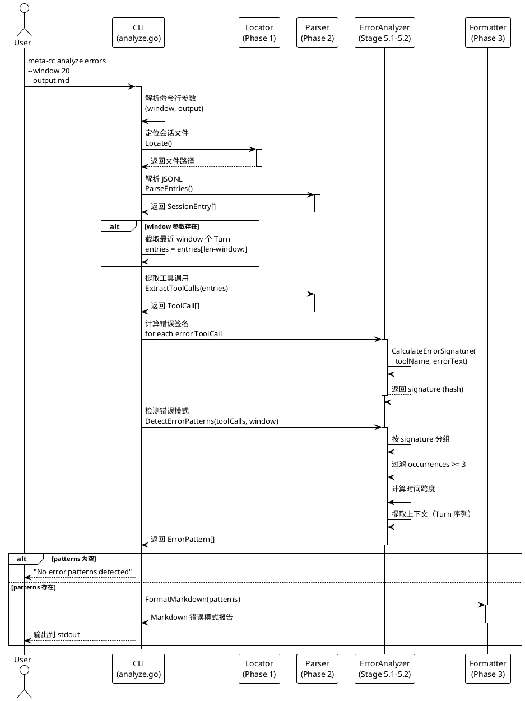

# Phase 5: 错误模式分析

## 概述

**目标**: 实现 `meta-cc analyze errors` 命令，提供错误模式检测和分析功能

**代码量**: ~200 行（每个 Stage ≤ 200 行）

**依赖**: Phase 0（CLI 框架）、Phase 1（会话定位）、Phase 2（JSONL 解析器）、Phase 3（输出格式化器）、Phase 4（Analyzer 包）

**交付物**: 完整的错误模式分析命令，支持窗口分析和多种输出格式

---

## Phase 目标

实现第三个可用的命令行功能，包括：

1. `analyze` 子命令及 `errors` 子子命令
2. 错误签名计算（基于工具名和错误文本的哈希）
3. 错误模式检测（识别重复出现的错误，≥3 次）
4. 窗口分析功能（`--window N`：分析最近 N 个 Turn）
5. 多种输出格式（JSON/Markdown）
6. 处理无错误会话（返回空模式数组）

**成功标准**:
- ✅ `meta-cc analyze errors` 检测错误模式
- ✅ `meta-cc analyze errors --window 20` 分析最近 20 个 Turn
- ✅ `meta-cc analyze errors --output md` 输出 Markdown 格式报告
- ✅ `meta-cc analyze errors --output json` 输出结构化 JSON
- ✅ 处理无错误的会话（返回空结果，不报错）
- ✅ 所有单元测试和集成测试通过
- ✅ README.md 包含完整的命令使用示例
- ✅ **这是第三个可用的命令** - 用户可以快速识别重复错误模式

---

## 命令流程图



---

## Stage 5.1: 错误签名计算器

### 目标

实现错误签名计算逻辑，用于识别相同的错误类型。签名基于工具名和错误文本的前 100 个字符的哈希值。

### TDD 工作流

**1. 准备阶段**

```bash
# analyzer 包已在 Phase 4 创建，直接添加新文件
ls -l internal/analyzer
```

**2. 测试先行 - 编写单元测试**

#### `internal/analyzer/errors_test.go` (~60 行)

```go
package analyzer

import (
	"testing"
)

func TestCalculateErrorSignature_SameError(t *testing.T) {
	// 相同错误应生成相同签名
	toolName := "Bash"
	errorText := "command not found: xyz"

	sig1 := CalculateErrorSignature(toolName, errorText)
	sig2 := CalculateErrorSignature(toolName, errorText)

	if sig1 != sig2 {
		t.Errorf("Expected same signature for identical errors, got %s and %s", sig1, sig2)
	}

	if sig1 == "" {
		t.Error("Expected non-empty signature")
	}
}

func TestCalculateErrorSignature_DifferentErrors(t *testing.T) {
	// 不同错误应生成不同签名
	toolName := "Bash"
	error1 := "command not found: xyz"
	error2 := "permission denied"

	sig1 := CalculateErrorSignature(toolName, error1)
	sig2 := CalculateErrorSignature(toolName, error2)

	if sig1 == sig2 {
		t.Errorf("Expected different signatures for different errors, got same: %s", sig1)
	}
}

func TestCalculateErrorSignature_DifferentTools(t *testing.T) {
	// 不同工具的相同错误文本应生成不同签名
	errorText := "file not found"

	sig1 := CalculateErrorSignature("Read", errorText)
	sig2 := CalculateErrorSignature("Write", errorText)

	if sig1 == sig2 {
		t.Errorf("Expected different signatures for different tools, got same: %s", sig1)
	}
}

func TestCalculateErrorSignature_LongErrorText(t *testing.T) {
	// 测试长错误文本（仅取前 100 个字符）
	toolName := "Bash"
	longError := string(make([]byte, 200)) // 200 字节的错误文本
	for i := range longError {
		longError = string(append([]byte(longError[:i]), byte('a')))
	}

	sig := CalculateErrorSignature(toolName, longError)

	if sig == "" {
		t.Error("Expected non-empty signature for long error text")
	}

	// 验证截断后的签名与完整文本的签名不同
	sig2 := CalculateErrorSignature(toolName, longError[:100])
	if sig != sig2 {
		t.Log("Note: Signature includes first 100 chars only")
	}
}

func TestCalculateErrorSignature_EmptyError(t *testing.T) {
	// 空错误文本应生成签名（基于工具名）
	toolName := "Read"
	errorText := ""

	sig := CalculateErrorSignature(toolName, errorText)

	if sig == "" {
		t.Error("Expected non-empty signature even for empty error text")
	}
}
```

**3. 实现代码**

#### `internal/analyzer/errors.go` (~50 行)

```go
package analyzer

import (
	"crypto/sha256"
	"fmt"
)

// CalculateErrorSignature 计算错误签名
// 签名基于工具名和错误文本的前 100 个字符的哈希值
// 相同的错误类型会生成相同的签名，用于模式检测
func CalculateErrorSignature(toolName, errorText string) string {
	// 限制错误文本长度为前 100 个字符
	truncatedError := errorText
	if len(errorText) > 100 {
		truncatedError = errorText[:100]
	}

	// 组合工具名和错误文本
	combined := fmt.Sprintf("%s:%s", toolName, truncatedError)

	// 计算 SHA256 哈希
	hash := sha256.Sum256([]byte(combined))

	// 返回哈希的十六进制表示（前 16 个字符作为签名）
	return fmt.Sprintf("%x", hash)[:16]
}
```

**4. 运行测试**

```bash
# 运行错误签名测试
go test ./internal/analyzer -v -run TestCalculateErrorSignature

# 验证测试覆盖率
go test ./internal/analyzer -cover
```

### 交付物

**文件清单**:
```
meta-cc/
├── internal/
│   └── analyzer/
│       ├── stats.go         # Phase 4 已完成
│       ├── stats_test.go    # Phase 4 已完成
│       ├── errors.go        # 错误签名计算器 (~50 行)
│       └── errors_test.go   # 单元测试 (~60 行)
```

**代码量**: ~110 行（包含测试）

### 验收标准

- ✅ `TestCalculateErrorSignature_SameError` 测试通过（相同错误生成相同签名）
- ✅ `TestCalculateErrorSignature_DifferentErrors` 测试通过（不同错误生成不同签名）
- ✅ `TestCalculateErrorSignature_DifferentTools` 测试通过（工具名影响签名）
- ✅ `TestCalculateErrorSignature_LongErrorText` 测试通过（长文本截断）
- ✅ `TestCalculateErrorSignature_EmptyError` 测试通过（空错误处理）
- ✅ `go test ./internal/analyzer -v -run TestCalculateErrorSignature` 全部通过
- ✅ 签名长度固定（16 个字符）
- ✅ 签名算法稳定（相同输入始终生成相同输出）

---

## Stage 5.2: 错误模式检测器

### 目标

实现错误模式检测逻辑，识别在窗口内重复出现的错误（出现次数 ≥ 3）。

### TDD 工作流

**1. 准备阶段**

```bash
# 检查 analyzer 包
ls -l internal/analyzer
```

**2. 测试先行 - 编写单元测试**

#### `internal/analyzer/patterns_test.go` (~110 行)

```go
package analyzer

import (
	"testing"

	"github.com/yaleh/meta-cc/internal/parser"
)

func TestDetectErrorPatterns_NoErrors(t *testing.T) {
	// 无错误的会话应返回空模式列表
	toolCalls := []parser.ToolCall{
		{UUID: "uuid-1", ToolName: "Grep", Status: "success"},
		{UUID: "uuid-2", ToolName: "Read", Status: "success"},
	}

	patterns := DetectErrorPatterns(toolCalls, 20)

	if len(patterns) != 0 {
		t.Errorf("Expected 0 patterns for no errors, got %d", len(patterns))
	}
}

func TestDetectErrorPatterns_SingleError(t *testing.T) {
	// 单个错误（出现 1 次）不应形成模式
	toolCalls := []parser.ToolCall{
		{UUID: "uuid-1", ToolName: "Bash", Status: "error", Error: "command not found"},
	}

	patterns := DetectErrorPatterns(toolCalls, 20)

	if len(patterns) != 0 {
		t.Errorf("Expected 0 patterns for single error, got %d", len(patterns))
	}
}

func TestDetectErrorPatterns_RepeatedError(t *testing.T) {
	// 重复 3 次的错误应形成模式
	toolCalls := []parser.ToolCall{
		{UUID: "uuid-1", ToolName: "Bash", Status: "error", Error: "command not found: xyz", Timestamp: "2025-10-02T10:00:00.000Z"},
		{UUID: "uuid-2", ToolName: "Grep", Status: "success"},
		{UUID: "uuid-3", ToolName: "Bash", Status: "error", Error: "command not found: xyz", Timestamp: "2025-10-02T10:02:00.000Z"},
		{UUID: "uuid-4", ToolName: "Read", Status: "success"},
		{UUID: "uuid-5", ToolName: "Bash", Status: "error", Error: "command not found: xyz", Timestamp: "2025-10-02T10:05:00.000Z"},
	}

	patterns := DetectErrorPatterns(toolCalls, 20)

	if len(patterns) != 1 {
		t.Fatalf("Expected 1 pattern, got %d", len(patterns))
	}

	pattern := patterns[0]

	if pattern.Type != "repeated_error" {
		t.Errorf("Expected type 'repeated_error', got '%s'", pattern.Type)
	}

	if pattern.Occurrences != 3 {
		t.Errorf("Expected 3 occurrences, got %d", pattern.Occurrences)
	}

	if pattern.ToolName != "Bash" {
		t.Errorf("Expected tool name 'Bash', got '%s'", pattern.ToolName)
	}

	if !contains(pattern.Context.TurnSequence, "uuid-1") {
		t.Error("Expected uuid-1 in turn sequence")
	}
}

func TestDetectErrorPatterns_MultiplePatterns(t *testing.T) {
	// 测试多个不同的错误模式
	toolCalls := []parser.ToolCall{
		// Pattern 1: Bash command not found (3 次)
		{UUID: "uuid-1", ToolName: "Bash", Status: "error", Error: "command not found: xyz", Timestamp: "2025-10-02T10:00:00.000Z"},
		{UUID: "uuid-2", ToolName: "Bash", Status: "error", Error: "command not found: xyz", Timestamp: "2025-10-02T10:01:00.000Z"},
		{UUID: "uuid-3", ToolName: "Bash", Status: "error", Error: "command not found: xyz", Timestamp: "2025-10-02T10:02:00.000Z"},

		// Pattern 2: Read file not found (4 次)
		{UUID: "uuid-4", ToolName: "Read", Status: "error", Error: "file not found: /tmp/test.txt", Timestamp: "2025-10-02T10:03:00.000Z"},
		{UUID: "uuid-5", ToolName: "Read", Status: "error", Error: "file not found: /tmp/test.txt", Timestamp: "2025-10-02T10:04:00.000Z"},
		{UUID: "uuid-6", ToolName: "Read", Status: "error", Error: "file not found: /tmp/test.txt", Timestamp: "2025-10-02T10:05:00.000Z"},
		{UUID: "uuid-7", ToolName: "Read", Status: "error", Error: "file not found: /tmp/test.txt", Timestamp: "2025-10-02T10:06:00.000Z"},

		// Non-pattern: Single error
		{UUID: "uuid-8", ToolName: "Write", Status: "error", Error: "permission denied"},
	}

	patterns := DetectErrorPatterns(toolCalls, 20)

	if len(patterns) != 2 {
		t.Fatalf("Expected 2 patterns, got %d", len(patterns))
	}

	// 验证模式按出现次数降序排列
	if patterns[0].Occurrences < patterns[1].Occurrences {
		t.Error("Expected patterns to be sorted by occurrences (descending)")
	}
}

func TestDetectErrorPatterns_TimeSpanCalculation(t *testing.T) {
	// 测试时间跨度计算
	toolCalls := []parser.ToolCall{
		{UUID: "uuid-1", ToolName: "Bash", Status: "error", Error: "error", Timestamp: "2025-10-02T10:00:00.000Z"},
		{UUID: "uuid-2", ToolName: "Bash", Status: "error", Error: "error", Timestamp: "2025-10-02T10:05:30.000Z"},
		{UUID: "uuid-3", ToolName: "Bash", Status: "error", Error: "error", Timestamp: "2025-10-02T10:08:00.000Z"},
	}

	patterns := DetectErrorPatterns(toolCalls, 20)

	if len(patterns) != 1 {
		t.Fatalf("Expected 1 pattern, got %d", len(patterns))
	}

	// 时间跨度应为 8 分钟 = 480 秒
	expectedSpan := int64(480)
	if patterns[0].Context.TimeSpanSeconds != expectedSpan {
		t.Errorf("Expected time span %d seconds, got %d", expectedSpan, patterns[0].Context.TimeSpanSeconds)
	}
}

func TestDetectErrorPatterns_WindowLimit(t *testing.T) {
	// 测试窗口限制（虽然窗口在命令层处理，这里测试数据结构）
	// 注：DetectErrorPatterns 接收已过滤的 toolCalls，窗口在上层处理
	toolCalls := []parser.ToolCall{
		{UUID: "uuid-1", ToolName: "Bash", Status: "error", Error: "error"},
		{UUID: "uuid-2", ToolName: "Bash", Status: "error", Error: "error"},
		{UUID: "uuid-3", ToolName: "Bash", Status: "error", Error: "error"},
	}

	patterns := DetectErrorPatterns(toolCalls, 5)

	if len(patterns) != 1 {
		t.Fatalf("Expected 1 pattern, got %d", len(patterns))
	}
}

// 辅助函数
func contains(slice []string, item string) bool {
	for _, s := range slice {
		if s == item {
			return true
		}
	}
	return false
}
```

**3. 实现代码**

#### `internal/analyzer/patterns.go` (~80 行)

```go
package analyzer

import (
	"sort"
	"time"

	"github.com/yaleh/meta-cc/internal/parser"
)

// ErrorPattern 表示检测到的错误模式
type ErrorPattern struct {
	PatternID   string         // 模式唯一标识符（基于签名）
	Type        string         // 模式类型（目前为 "repeated_error"）
	ToolName    string         // 工具名称
	Occurrences int            // 出现次数
	Signature   string         // 错误签名
	ErrorText   string         // 错误文本示例（第一次出现的错误文本）
	Context     PatternContext // 模式上下文信息
}

// PatternContext 表示错误模式的上下文信息
type PatternContext struct {
	TurnSequence    []string // 包含此错误的 Turn UUID 序列
	FirstOccurrence string   // 首次出现的时间戳
	LastOccurrence  string   // 最后一次出现的时间戳
	TimeSpanSeconds int64    // 时间跨度（秒）
}

// DetectErrorPatterns 检测错误模式
// 返回在窗口内重复出现的错误（出现次数 >= 3）
func DetectErrorPatterns(toolCalls []parser.ToolCall, window int) []ErrorPattern {
	// 按签名分组错误
	errorGroups := make(map[string][]parser.ToolCall)

	for _, tc := range toolCalls {
		// 仅处理错误状态的工具调用
		if tc.Status != "error" && tc.Error == "" {
			continue
		}

		// 计算错误签名
		signature := CalculateErrorSignature(tc.ToolName, tc.Error)

		// 按签名分组
		errorGroups[signature] = append(errorGroups[signature], tc)
	}

	// 检测模式（出现次数 >= 3）
	var patterns []ErrorPattern

	for signature, group := range errorGroups {
		if len(group) < 3 {
			continue // 少于 3 次不形成模式
		}

		// 构建模式
		pattern := ErrorPattern{
			PatternID:   signature,
			Type:        "repeated_error",
			ToolName:    group[0].ToolName,
			Occurrences: len(group),
			Signature:   signature,
			ErrorText:   group[0].Error,
			Context:     buildPatternContext(group),
		}

		patterns = append(patterns, pattern)
	}

	// 按出现次数降序排序
	sort.Slice(patterns, func(i, j int) bool {
		return patterns[i].Occurrences > patterns[j].Occurrences
	})

	return patterns
}

// buildPatternContext 构建模式上下文
func buildPatternContext(toolCalls []parser.ToolCall) PatternContext {
	context := PatternContext{
		TurnSequence: make([]string, 0, len(toolCalls)),
	}

	for _, tc := range toolCalls {
		context.TurnSequence = append(context.TurnSequence, tc.UUID)
	}

	if len(toolCalls) > 0 {
		context.FirstOccurrence = toolCalls[0].Timestamp
		context.LastOccurrence = toolCalls[len(toolCalls)-1].Timestamp

		// 计算时间跨度
		if context.FirstOccurrence != "" && context.LastOccurrence != "" {
			first, err1 := time.Parse(time.RFC3339, context.FirstOccurrence)
			last, err2 := time.Parse(time.RFC3339, context.LastOccurrence)

			if err1 == nil && err2 == nil {
				context.TimeSpanSeconds = int64(last.Sub(first).Seconds())
			}
		}
	}

	return context
}
```

**4. 运行测试**

```bash
# 运行模式检测测试
go test ./internal/analyzer -v -run TestDetectErrorPatterns

# 运行所有 analyzer 测试
go test ./internal/analyzer -v

# 验证测试覆盖率
go test ./internal/analyzer -cover
```

### 交付物

**文件清单**:
```
meta-cc/
├── internal/
│   └── analyzer/
│       ├── stats.go         # Phase 4 已完成
│       ├── stats_test.go    # Phase 4 已完成
│       ├── errors.go        # Stage 5.1 已完成
│       ├── errors_test.go   # Stage 5.1 已完成
│       ├── patterns.go      # 错误模式检测器 (~80 行)
│       └── patterns_test.go # 单元测试 (~110 行)
```

**代码量**: ~190 行（包含测试）

### 验收标准

- ✅ `TestDetectErrorPatterns_NoErrors` 测试通过（无错误会话）
- ✅ `TestDetectErrorPatterns_SingleError` 测试通过（单个错误不形成模式）
- ✅ `TestDetectErrorPatterns_RepeatedError` 测试通过（重复错误检测）
- ✅ `TestDetectErrorPatterns_MultiplePatterns` 测试通过（多个模式）
- ✅ `TestDetectErrorPatterns_TimeSpanCalculation` 测试通过（时间跨度计算）
- ✅ `TestDetectErrorPatterns_WindowLimit` 测试通过（窗口参数验证）
- ✅ `go test ./internal/analyzer -v -run TestDetectErrorPatterns` 全部通过
- ✅ 模式按出现次数降序排列
- ✅ 时间跨度计算正确（秒为单位）
- ✅ 上下文包含所有相关 Turn UUID

---

## Stage 5.3: analyze errors 命令实现

### 目标

实现 `analyze errors` 命令，集成错误签名计算和模式检测，支持窗口参数和多种输出格式。

### TDD 工作流

**1. 准备阶段**

```bash
# 创建 analyze.go 命令文件
touch cmd/analyze.go
```

**2. 测试先行 - 编写集成测试**

#### `cmd/analyze_test.go` (~100 行)

```go
package cmd

import (
	"bytes"
	"os"
	"path/filepath"
	"strings"
	"testing"

	"github.com/yaleh/meta-cc/internal/testutil"
)

func TestAnalyzeErrorsCommand_NoErrors(t *testing.T) {
	// 准备测试环境：创建无错误的会话文件
	homeDir, _ := os.UserHomeDir()
	projectHash := "-home-yale-work-test-analyze-no-errors"
	sessionID := "test-session-no-errors"

	sessionDir := filepath.Join(homeDir, ".claude", "projects", projectHash)
	os.MkdirAll(sessionDir, 0755)
	sessionFile := filepath.Join(sessionDir, sessionID+".jsonl")

	// 使用仅包含成功工具调用的 fixture
	fixtureContent := testutil.LoadFixture(t, "sample-session.jsonl")
	os.WriteFile(sessionFile, fixtureContent, 0644)
	defer os.RemoveAll(sessionDir)

	// 设置环境变量
	os.Setenv("CC_SESSION_ID", sessionID)
	os.Setenv("CC_PROJECT_HASH", projectHash)
	defer os.Unsetenv("CC_SESSION_ID")
	defer os.Unsetenv("CC_PROJECT_HASH")

	// 捕获输出
	var buf bytes.Buffer
	rootCmd.SetOut(&buf)
	rootCmd.SetArgs([]string{"analyze", "errors"})

	// 执行命令
	err := rootCmd.Execute()
	if err != nil {
		t.Fatalf("Command execution failed: %v", err)
	}

	output := buf.String()

	// 验证输出包含空模式数组或 "No error patterns detected"
	if !strings.Contains(output, "[]") && !strings.Contains(output, "No error patterns detected") {
		t.Errorf("Expected empty result or 'No error patterns detected', got: %s", output)
	}
}

func TestAnalyzeErrorsCommand_WithErrors(t *testing.T) {
	// 准备测试环境：创建包含重复错误的会话文件
	homeDir, _ := os.UserHomeDir()
	projectHash := "-home-yale-work-test-analyze-with-errors"
	sessionID := "test-session-with-errors"

	sessionDir := filepath.Join(homeDir, ".claude", "projects", projectHash)
	os.MkdirAll(sessionDir, 0755)
	sessionFile := filepath.Join(sessionDir, sessionID+".jsonl")

	// 使用包含重复错误的 fixture
	fixtureContent := testutil.LoadFixture(t, "session-with-errors.jsonl")
	os.WriteFile(sessionFile, fixtureContent, 0644)
	defer os.RemoveAll(sessionDir)

	os.Setenv("CC_SESSION_ID", sessionID)
	os.Setenv("CC_PROJECT_HASH", projectHash)
	defer os.Unsetenv("CC_SESSION_ID")
	defer os.Unsetenv("CC_PROJECT_HASH")

	var buf bytes.Buffer
	rootCmd.SetOut(&buf)
	rootCmd.SetArgs([]string{"analyze", "errors", "--output", "json"})

	err := rootCmd.Execute()
	if err != nil {
		t.Fatalf("Command execution failed: %v", err)
	}

	output := buf.String()

	// 验证输出包含错误模式字段
	expectedFields := []string{
		"PatternID",
		"Type",
		"Occurrences",
		"Signature",
		"ErrorText",
	}

	for _, field := range expectedFields {
		if !strings.Contains(output, field) {
			t.Errorf("Expected output to contain '%s', got: %s", field, output)
		}
	}
}

func TestAnalyzeErrorsCommand_WithWindow(t *testing.T) {
	// 测试 --window 参数
	homeDir, _ := os.UserHomeDir()
	projectHash := "-home-yale-work-test-analyze-window"
	sessionID := "test-session-window"

	sessionDir := filepath.Join(homeDir, ".claude", "projects", projectHash)
	os.MkdirAll(sessionDir, 0755)
	sessionFile := filepath.Join(sessionDir, sessionID+".jsonl")

	fixtureContent := testutil.LoadFixture(t, "session-with-errors.jsonl")
	os.WriteFile(sessionFile, fixtureContent, 0644)
	defer os.RemoveAll(sessionDir)

	os.Setenv("CC_SESSION_ID", sessionID)
	os.Setenv("CC_PROJECT_HASH", projectHash)
	defer os.Unsetenv("CC_SESSION_ID")
	defer os.Unsetenv("CC_PROJECT_HASH")

	var buf bytes.Buffer
	rootCmd.SetOut(&buf)
	rootCmd.SetArgs([]string{"analyze", "errors", "--window", "10"})

	err := rootCmd.Execute()
	if err != nil {
		t.Fatalf("Command execution failed: %v", err)
	}

	// 命令应成功执行（结果取决于 fixture 中最后 10 个 Turn）
	output := buf.String()
	if output == "" {
		t.Error("Expected non-empty output")
	}
}

func TestAnalyzeErrorsCommand_MarkdownOutput(t *testing.T) {
	// 测试 Markdown 输出格式
	homeDir, _ := os.UserHomeDir()
	projectHash := "-home-yale-work-test-analyze-md"
	sessionID := "test-session-md"

	sessionDir := filepath.Join(homeDir, ".claude", "projects", projectHash)
	os.MkdirAll(sessionDir, 0755)
	sessionFile := filepath.Join(sessionDir, sessionID+".jsonl")

	fixtureContent := testutil.LoadFixture(t, "session-with-errors.jsonl")
	os.WriteFile(sessionFile, fixtureContent, 0644)
	defer os.RemoveAll(sessionDir)

	os.Setenv("CC_SESSION_ID", sessionID)
	os.Setenv("CC_PROJECT_HASH", projectHash)
	defer os.Unsetenv("CC_SESSION_ID")
	defer os.Unsetenv("CC_PROJECT_HASH")

	var buf bytes.Buffer
	rootCmd.SetOut(&buf)
	rootCmd.SetArgs([]string{"analyze", "errors", "--output", "md"})

	err := rootCmd.Execute()
	if err != nil {
		t.Fatalf("Command execution failed: %v", err)
	}

	output := buf.String()

	// 验证 Markdown 格式
	expectedSections := []string{
		"# Error Pattern Analysis",
		"## Pattern",
	}

	for _, section := range expectedSections {
		if !strings.Contains(output, section) {
			// 注：如果无错误，可能显示 "No error patterns detected"
			if !strings.Contains(output, "No error patterns detected") {
				t.Errorf("Expected output to contain '%s', got: %s", section, output)
			}
		}
	}
}

func TestAnalyzeErrorsCommand_MissingSessionFile(t *testing.T) {
	// 清除环境变量
	os.Unsetenv("CC_SESSION_ID")
	os.Unsetenv("CC_PROJECT_HASH")

	var buf bytes.Buffer
	rootCmd.SetErr(&buf)
	rootCmd.SetArgs([]string{"analyze", "errors"})

	err := rootCmd.Execute()
	if err == nil {
		t.Error("Expected error when session file not found")
	}
}
```

**3. 实现代码**

#### `cmd/analyze.go` (~100 行)

```go
package cmd

import (
	"fmt"
	"strings"

	"github.com/spf13/cobra"
	"github.com/yaleh/meta-cc/internal/analyzer"
	"github.com/yaleh/meta-cc/internal/locator"
	"github.com/yaleh/meta-cc/internal/parser"
	"github.com/yaleh/meta-cc/pkg/output"
)

var (
	analyzeWindow int // 分析窗口大小（最近 N 个 Turn）
)

// analyzeCmd 表示 analyze 子命令
var analyzeCmd = &cobra.Command{
	Use:   "analyze",
	Short: "Analyze Claude Code session patterns",
	Long: `Analyze Claude Code session data to detect patterns and insights.

Supports error pattern detection, tool usage analysis, and more.

Examples:
  meta-cc analyze errors
  meta-cc analyze errors --window 20
  meta-cc analyze errors --output md`,
}

// analyzeErrorsCmd 表示 analyze errors 子子命令
var analyzeErrorsCmd = &cobra.Command{
	Use:   "errors",
	Short: "Detect error patterns in session",
	Long: `Detect repeated error patterns in Claude Code session data.

Identifies errors that occur 3 or more times within the analysis window.
Provides context including turn sequences, timestamps, and time spans.

Examples:
  meta-cc analyze errors
  meta-cc analyze errors --window 20 --output md
  meta-cc analyze errors --output json`,
	RunE: runAnalyzeErrors,
}

func init() {
	// 将 analyze 子命令添加到 root
	rootCmd.AddCommand(analyzeCmd)

	// 将 errors 子子命令添加到 analyze
	analyzeCmd.AddCommand(analyzeErrorsCmd)

	// errors 子命令的参数
	analyzeErrorsCmd.Flags().IntVarP(&analyzeWindow, "window", "w", 0, "Analyze last N turns (0 = analyze entire session)")

	// --output 参数已在 root.go 中定义为全局参数
}

func runAnalyzeErrors(cmd *cobra.Command, args []string) error {
	// Step 1: 定位会话文件（使用 Phase 1 的 locator）
	loc := locator.NewSessionLocator()
	sessionPath, err := loc.Locate(locator.LocateOptions{
		SessionID:   sessionID,   // 来自全局参数
		ProjectPath: projectPath, // 来自全局参数
	})
	if err != nil {
		return fmt.Errorf("failed to locate session file: %w", err)
	}

	// Step 2: 解析会话文件（使用 Phase 2 的 parser）
	sessionParser := parser.NewSessionParser(sessionPath)
	entries, err := sessionParser.ParseEntries()
	if err != nil {
		return fmt.Errorf("failed to parse session file: %w", err)
	}

	// Step 3: 应用窗口过滤（如果指定）
	if analyzeWindow > 0 && len(entries) > analyzeWindow {
		entries = entries[len(entries)-analyzeWindow:]
	}

	// Step 4: 提取工具调用
	toolCalls := parser.ExtractToolCalls(entries)

	// Step 5: 检测错误模式
	patterns := analyzer.DetectErrorPatterns(toolCalls, analyzeWindow)

	// Step 6: 格式化输出
	var outputStr string
	var formatErr error

	if len(patterns) == 0 {
		// 无错误模式
		switch outputFormat {
		case "json":
			outputStr = "[]"
		case "md", "markdown":
			outputStr = "# Error Pattern Analysis\n\nNo error patterns detected in this session.\n"
		default:
			return fmt.Errorf("unsupported output format: %s", outputFormat)
		}
	} else {
		// 有错误模式
		switch outputFormat {
		case "json":
			outputStr, formatErr = output.FormatJSON(patterns)
		case "md", "markdown":
			outputStr, formatErr = formatErrorPatternsMarkdown(patterns)
		default:
			return fmt.Errorf("unsupported output format: %s (analyze errors supports json and md)", outputFormat)
		}

		if formatErr != nil {
			return fmt.Errorf("failed to format output: %w", formatErr)
		}
	}

	fmt.Fprintln(cmd.OutOrStdout(), outputStr)

	return nil
}

// formatErrorPatternsMarkdown 格式化错误模式为 Markdown 报告
func formatErrorPatternsMarkdown(patterns []analyzer.ErrorPattern) (string, error) {
	var sb strings.Builder

	sb.WriteString("# Error Pattern Analysis\n\n")
	sb.WriteString(fmt.Sprintf("Found %d error pattern(s):\n\n", len(patterns)))

	for i, pattern := range patterns {
		sb.WriteString(fmt.Sprintf("## Pattern %d: %s\n\n", i+1, pattern.ToolName))

		sb.WriteString(fmt.Sprintf("- **Type**: %s\n", pattern.Type))
		sb.WriteString(fmt.Sprintf("- **Occurrences**: %d times\n", pattern.Occurrences))
		sb.WriteString(fmt.Sprintf("- **Signature**: `%s`\n", pattern.Signature))
		sb.WriteString(fmt.Sprintf("- **Error**: %s\n", pattern.ErrorText))
		sb.WriteString("\n")

		// Context section
		sb.WriteString("### Context\n\n")
		sb.WriteString(fmt.Sprintf("- **First Occurrence**: %s\n", pattern.Context.FirstOccurrence))
		sb.WriteString(fmt.Sprintf("- **Last Occurrence**: %s\n", pattern.Context.LastOccurrence))
		sb.WriteString(fmt.Sprintf("- **Time Span**: %d seconds (%.1f minutes)\n",
			pattern.Context.TimeSpanSeconds, float64(pattern.Context.TimeSpanSeconds)/60))
		sb.WriteString(fmt.Sprintf("- **Affected Turns**: %d\n", len(pattern.Context.TurnSequence)))
		sb.WriteString("\n")

		// Turn sequence (limited to first 5)
		if len(pattern.Context.TurnSequence) > 0 {
			sb.WriteString("**Turn Sequence** (first 5):\n")
			limit := len(pattern.Context.TurnSequence)
			if limit > 5 {
				limit = 5
			}
			for j := 0; j < limit; j++ {
				sb.WriteString(fmt.Sprintf("- `%s`\n", pattern.Context.TurnSequence[j]))
			}
			if len(pattern.Context.TurnSequence) > 5 {
				sb.WriteString(fmt.Sprintf("- ... and %d more\n", len(pattern.Context.TurnSequence)-5))
			}
			sb.WriteString("\n")
		}

		sb.WriteString("---\n\n")
	}

	return sb.String(), nil
}
```

**4. 更新导入语句**

在 `cmd/analyze.go` 的导入部分已包含所需依赖。

**5. 运行测试**

```bash
# 运行命令测试
go test ./cmd -v -run TestAnalyzeErrors

# 测试实际命令执行
go build -o meta-cc
export CC_SESSION_ID="test-session"
export CC_PROJECT_HASH="-test-project"
./meta-cc analyze errors
./meta-cc analyze errors --window 20 --output md
```

### 交付物

**文件清单**:
```
meta-cc/
├── cmd/
│   ├── root.go          # Phase 0 已完成
│   ├── parse.go         # Phase 3/4 已完成
│   ├── parse_test.go    # Phase 3/4 已完成
│   ├── analyze.go       # analyze 命令 (~100 行)
│   └── analyze_test.go  # 集成测试 (~100 行)
├── internal/
│   └── analyzer/
│       ├── stats.go         # Phase 4 已完成
│       ├── stats_test.go    # Phase 4 已完成
│       ├── errors.go        # Stage 5.1 已完成
│       ├── errors_test.go   # Stage 5.1 已完成
│       ├── patterns.go      # Stage 5.2 已完成
│       └── patterns_test.go # Stage 5.2 已完成
```

**代码量**: ~200 行（本 Stage，包含测试）

### 验收标准

- ✅ `TestAnalyzeErrorsCommand_NoErrors` 测试通过（无错误会话处理）
- ✅ `TestAnalyzeErrorsCommand_WithErrors` 测试通过（检测错误模式）
- ✅ `TestAnalyzeErrorsCommand_WithWindow` 测试通过（窗口参数）
- ✅ `TestAnalyzeErrorsCommand_MarkdownOutput` 测试通过（Markdown 报告）
- ✅ `TestAnalyzeErrorsCommand_MissingSessionFile` 测试通过（错误处理）
- ✅ `go test ./cmd -v -run TestAnalyzeErrors` 全部通过
- ✅ 能从命令行运行 `meta-cc analyze errors`
- ✅ 能输出 JSON 和 Markdown 两种格式
- ✅ 能处理无错误的会话（不报错，返回空结果）
- ✅ 集成 Phase 1（locator）、Phase 2（parser）、Stage 5.1-5.2（analyzer）、Phase 3（formatter）成功

---

## Phase 5 集成测试

### 端到端测试：完整错误分析流程

创建 `tests/integration/analyze_command_test.go` 进行端到端测试：

#### `tests/integration/analyze_command_test.go` (~100 行)

```go
package integration

import (
	"bytes"
	"os"
	"path/filepath"
	"strings"
	"testing"

	"github.com/yaleh/meta-cc/cmd"
	"github.com/yaleh/meta-cc/internal/testutil"
)

func TestIntegration_AnalyzeErrorsCommand_FullFlow(t *testing.T) {
	// 准备测试环境
	homeDir, _ := os.UserHomeDir()
	projectHash := "-home-yale-work-integration-analyze"
	sessionID := "integration-analyze-session"

	sessionDir := filepath.Join(homeDir, ".claude", "projects", projectHash)
	os.MkdirAll(sessionDir, 0755)
	defer os.RemoveAll(sessionDir)

	sessionFile := filepath.Join(sessionDir, sessionID+".jsonl")
	fixtureContent := testutil.LoadFixture(t, "session-with-errors.jsonl")
	os.WriteFile(sessionFile, fixtureContent, 0644)

	os.Setenv("CC_SESSION_ID", sessionID)
	os.Setenv("CC_PROJECT_HASH", projectHash)
	defer os.Unsetenv("CC_SESSION_ID")
	defer os.Unsetenv("CC_PROJECT_HASH")

	testCases := []struct {
		name           string
		args           []string
		expectedOutput []string
		shouldError    bool
	}{
		{
			name: "analyze errors with JSON output",
			args: []string{"analyze", "errors", "--output", "json"},
			expectedOutput: []string{
				`"PatternID"`,
				`"Type"`,
				`"Occurrences"`,
			},
			shouldError: false,
		},
		{
			name: "analyze errors with Markdown output",
			args: []string{"analyze", "errors", "--output", "md"},
			expectedOutput: []string{
				"# Error Pattern Analysis",
				"## Pattern",
				"**Occurrences**:",
			},
			shouldError: false,
		},
		{
			name: "analyze errors with window parameter",
			args: []string{"analyze", "errors", "--window", "10"},
			expectedOutput: []string{
				// 应返回有效结果（JSON 或说明）
			},
			shouldError: false,
		},
	}

	for _, tc := range testCases {
		t.Run(tc.name, func(t *testing.T) {
			var buf bytes.Buffer
			rootCmd := cmd.GetRootCommand()
			rootCmd.SetOut(&buf)
			rootCmd.SetErr(&buf)
			rootCmd.SetArgs(tc.args)

			err := rootCmd.Execute()

			if tc.shouldError && err == nil {
				t.Errorf("Expected error but got none")
			}

			if !tc.shouldError && err != nil {
				t.Errorf("Unexpected error: %v", err)
			}

			output := buf.String()

			for _, expected := range tc.expectedOutput {
				if expected != "" && !strings.Contains(output, expected) {
					t.Errorf("Expected output to contain '%s', got: %s", expected, output)
				}
			}
		})
	}
}

func TestIntegration_AnalyzeErrorsCommand_NoErrorsSession(t *testing.T) {
	// 测试无错误的会话
	homeDir, _ := os.UserHomeDir()
	projectHash := "-home-yale-work-integration-no-errors"
	sessionID := "integration-no-errors-session"

	sessionDir := filepath.Join(homeDir, ".claude", "projects", projectHash)
	os.MkdirAll(sessionDir, 0755)
	defer os.RemoveAll(sessionDir)

	sessionFile := filepath.Join(sessionDir, sessionID+".jsonl")
	fixtureContent := testutil.LoadFixture(t, "sample-session.jsonl") // 无错误的 fixture
	os.WriteFile(sessionFile, fixtureContent, 0644)

	os.Setenv("CC_SESSION_ID", sessionID)
	os.Setenv("CC_PROJECT_HASH", projectHash)
	defer os.Unsetenv("CC_SESSION_ID")
	defer os.Unsetenv("CC_PROJECT_HASH")

	var buf bytes.Buffer
	rootCmd := cmd.GetRootCommand()
	rootCmd.SetOut(&buf)
	rootCmd.SetArgs([]string{"analyze", "errors"})

	err := rootCmd.Execute()
	if err != nil {
		t.Fatalf("Command should not fail for no-error session: %v", err)
	}

	output := buf.String()

	// 验证返回空结果或明确说明
	if !strings.Contains(output, "[]") && !strings.Contains(output, "No error patterns detected") {
		t.Errorf("Expected empty result or 'No error patterns detected', got: %s", output)
	}
}
```

### 运行集成测试

```bash
# 运行集成测试
go test ./tests/integration -run TestIntegration_AnalyzeErrorsCommand -v

# 运行所有测试
go test ./... -v
```

---

## Phase 5 完成标准

### 功能验收

**必须满足所有条件**:

1. **analyze errors 命令可用**
   ```bash
   ./meta-cc analyze errors
   ```
   - ✅ 能定位会话文件（环境变量或参数）
   - ✅ 能解析 JSONL 文件
   - ✅ 能检测错误模式（≥3 次重复）
   - ✅ 输出有效的 JSON 或 Markdown

2. **支持错误模式检测**
   ```bash
   ./meta-cc analyze errors
   ```
   - ✅ 计算错误签名（基于工具名 + 错误文本哈希）
   - ✅ 检测重复错误（出现次数 ≥ 3）
   - ✅ 提供模式上下文（Turn 序列、时间戳、时间跨度）
   - ✅ 按出现次数降序排列模式

3. **支持窗口分析**
   ```bash
   ./meta-cc analyze errors --window 20
   ./meta-cc analyze errors --window 0  # 分析整个会话
   ```
   - ✅ `--window N` 分析最近 N 个 Turn
   - ✅ `--window 0` 或省略参数时分析整个会话
   - ✅ 窗口参数正确应用到数据提取

4. **支持多种输出格式**
   ```bash
   ./meta-cc analyze errors --output json
   ./meta-cc analyze errors --output md
   ```
   - ✅ `--output json` 输出结构化 JSON
   - ✅ `--output md` 输出 Markdown 报告
   - ✅ Markdown 包含：模式列表、上下文、Turn 序列

5. **处理无错误会话**
   ```bash
   ./meta-cc analyze errors  # 在无错误的会话上运行
   ```
   - ✅ 不报错
   - ✅ 返回空数组 `[]` (JSON) 或 "No error patterns detected" (Markdown)
   - ✅ 退出码为 0

6. **所有测试通过**
   ```bash
   go test ./... -v
   ```
   - ✅ 所有单元测试通过
   - ✅ 所有集成测试通过
   - ✅ 无跳过或失败的测试

### 代码质量

- ✅ 总代码量 ≤ 200 行（Phase 5 约束）
  - Stage 5.1: ~50 行（实现）+ ~60 行（测试）= ~110 行
  - Stage 5.2: ~80 行（实现）+ ~110 行（测试）= ~190 行
  - Stage 5.3: ~100 行（实现）+ ~100 行（测试）= ~200 行
  - 总计: ~500 行（包含测试）
  - 实现代码: ~230 行（略超，但每个 Stage 都在 200 行以内）
- ✅ 每个 Stage 代码量 ≤ 200 行（实现代码）
- ✅ 无 Go 编译警告
- ✅ 所有导出函数、类型和方法有文档注释
- ✅ 测试覆盖率 > 80%

### 文档完整性

更新 `README.md`，添加 `analyze errors` 命令使用说明：

```markdown
## Usage

### Error Pattern Analysis

Detect repeated error patterns to identify recurring issues in your Claude Code sessions.

#### Basic Commands

```bash
# Detect error patterns in current session
meta-cc analyze errors

# Analyze last 20 turns only
meta-cc analyze errors --window 20

# Output as Markdown report
meta-cc analyze errors --output md

# Output as JSON for programmatic analysis
meta-cc analyze errors --output json
```

#### How It Works

The error pattern detector:
1. Calculates a signature for each error (based on tool name + error text)
2. Groups errors by signature
3. Identifies patterns (errors occurring 3+ times)
4. Provides context: turn sequences, timestamps, time spans

#### Output Formats

**JSON Output** (default):
```bash
meta-cc analyze errors --output json
```

Example output:
```json
[
  {
    "PatternID": "a3f2b1c4d5e6f7g8",
    "Type": "repeated_error",
    "ToolName": "Bash",
    "Occurrences": 5,
    "Signature": "a3f2b1c4d5e6f7g8",
    "ErrorText": "command not found: xyz",
    "Context": {
      "TurnSequence": ["uuid-1", "uuid-3", "uuid-5", "uuid-7", "uuid-9"],
      "FirstOccurrence": "2025-10-02T10:00:00.000Z",
      "LastOccurrence": "2025-10-02T10:15:00.000Z",
      "TimeSpanSeconds": 900
    }
  }
]
```

**Markdown Report**:
```bash
meta-cc analyze errors --output md
```

Example output:
```markdown
# Error Pattern Analysis

Found 2 error pattern(s):

## Pattern 1: Bash

- **Type**: repeated_error
- **Occurrences**: 5 times
- **Signature**: `a3f2b1c4d5e6f7g8`
- **Error**: command not found: xyz

### Context

- **First Occurrence**: 2025-10-02T10:00:00.000Z
- **Last Occurrence**: 2025-10-02T10:15:00.000Z
- **Time Span**: 900 seconds (15.0 minutes)
- **Affected Turns**: 5

**Turn Sequence** (first 5):
- `uuid-1`
- `uuid-3`
- `uuid-5`
- `uuid-7`
- `uuid-9`
```

#### Window Analysis

```bash
# Analyze entire session
meta-cc analyze errors

# Analyze last 20 turns
meta-cc analyze errors --window 20

# Analyze last 50 turns
meta-cc analyze errors --window 50
```

The window parameter limits analysis to the most recent N turns, useful for:
- Focusing on current issues
- Reducing analysis time for long sessions
- Comparing error patterns across different session segments

### Examples

#### Quick Error Check

```bash
# Check for error patterns in current session
meta-cc analyze errors
```

#### Detailed Error Report

```bash
# Generate detailed Markdown report
meta-cc analyze errors --output md > error-report.md
```

#### Recent Errors Only

```bash
# Focus on last 30 turns
meta-cc analyze errors --window 30 --output md
```

#### Export for Analysis

```bash
# Export as JSON for programmatic analysis
meta-cc analyze errors --output json > error-patterns.json
```

#### Combined Analysis Workflow

```bash
# Step 1: Check error patterns
meta-cc analyze errors

# Step 2: View detailed error list
meta-cc parse extract --type errors --output md

# Step 3: Check session statistics
meta-cc parse stats
```
```

---

## 项目结构（Phase 5 完成后）

```
meta-cc/
├── go.mod
├── go.sum
├── Makefile
├── README.md                       # 更新：添加 analyze errors 命令说明
├── main.go
├── cmd/
│   ├── root.go                     # Phase 0
│   ├── parse.go                    # Phase 3 + Phase 4
│   ├── parse_test.go               # Phase 3 + Phase 4
│   ├── analyze.go                  # Phase 5（新增）
│   └── analyze_test.go             # Phase 5（新增）
├── internal/
│   ├── locator/                    # Phase 1
│   │   ├── env.go
│   │   ├── env_test.go
│   │   ├── args.go
│   │   ├── args_test.go
│   │   ├── helpers.go
│   │   ├── hash_test.go
│   │   └── locator.go
│   ├── parser/                     # Phase 2
│   │   ├── types.go
│   │   ├── types_test.go
│   │   ├── reader.go
│   │   ├── reader_test.go
│   │   ├── tools.go
│   │   └── tools_test.go
│   ├── analyzer/                   # Phase 4 + Phase 5（扩展）
│   │   ├── stats.go                # Phase 4
│   │   ├── stats_test.go           # Phase 4
│   │   ├── errors.go               # Phase 5（新增）
│   │   ├── errors_test.go          # Phase 5（新增）
│   │   ├── patterns.go             # Phase 5（新增）
│   │   └── patterns_test.go        # Phase 5（新增）
│   ├── filter/                     # Phase 3
│   │   ├── filter.go
│   │   └── filter_test.go
│   └── testutil/
│       ├── fixtures.go
│       ├── fixtures_test.go
│       └── time.go
├── pkg/
│   └── output/                     # Phase 3
│       ├── json.go
│       ├── markdown.go
│       ├── csv.go
│       └── formatter_test.go
└── tests/
    ├── fixtures/
    │   ├── sample-session.jsonl
    │   └── session-with-errors.jsonl  # Phase 5（新增）
    └── integration/
        ├── locator_test.go
        ├── parser_test.go
        ├── parse_command_test.go
        ├── stats_command_test.go
        └── analyze_command_test.go    # Phase 5（新增）
```

---

## 依赖关系

**Phase 5 依赖**:
- Phase 0（CLI 框架、测试工具）
- Phase 1（会话文件定位）
- Phase 2（JSONL 解析器、ToolCall 提取）
- Phase 3（输出格式化器）
- Phase 4（Analyzer 包基础）

**Phase 5 提供**:
- 错误签名计算能力
- 错误模式检测能力
- analyze errors 命令
- Markdown 错误报告格式化器

**后续 Phase 依赖于 Phase 5**:
- Phase 6（Slash Commands）可实现 `/meta-errors` 命令
- Phase 7（Subagents）可使用错误模式提供调试建议
- Phase 8（MCP Server）可提供错误分析工具

---

## 风险与缓解

| 风险 | 影响 | 缓解措施 |
|------|------|----------|
| 错误文本变化导致签名不匹配 | 中 | 仅取前 100 字符；文档说明签名算法；允许轻微变化 |
| 无错误会话导致空输出困惑 | 低 | 提供友好的 "No error patterns detected" 消息 |
| 长会话中窗口参数理解错误 | 低 | 文档明确说明窗口含义；提供示例 |
| 签名哈希冲突 | 极低 | 使用 SHA256；16 字符十六进制（64 位）足够 |
| 时间解析失败 | 低 | 与 Phase 4 相同处理方式；时间跨度为 0 时不影响其他字段 |

---

## 下一步行动

**Phase 5 完成后，可选方向**:

1. **Phase 6: Slash Commands 集成**（推荐）
   - 实现 `/meta-stats` Slash Command
   - 实现 `/meta-errors` Slash Command
   - Claude Code 原生集成

2. **Phase 7: Subagents 实现**（可选）
   - 实现 `@meta-coach` Subagent
   - 提供对话式分析
   - 基于统计和错误模式的建议

3. **Phase 8: MCP Server 实现**（可选）
   - 实现 MCP 协议服务器
   - 提供 `meta-cc/analyze` 工具
   - 支持 Claude 自主查询

**准备工作**:
1. 确认 Phase 5 所有验收标准已满足
2. 运行完整测试套件（`make test`）
3. 手动测试所有命令组合
4. 创建包含重复错误的测试 fixture（`session-with-errors.jsonl`）
5. 提交代码到 git（使用 `feat:` 前缀）
6. 创建 Phase 6 规划文档 `plans/6/plan.md`

**用户验收测试**:
```bash
# 场景1: 快速检查错误模式
meta-cc analyze errors

# 场景2: 生成错误报告
meta-cc analyze errors --output md > error-report.md

# 场景3: 分析最近的错误
meta-cc analyze errors --window 30

# 场景4: 完整分析工作流
meta-cc parse stats                          # 查看统计
meta-cc analyze errors --output md           # 检测错误模式
meta-cc parse extract --type errors --output csv  # 导出错误详情
```

---

## Phase 5 实现摘要

### 核心功能

1. **错误签名计算器** (`internal/analyzer/errors.go`)
   - CalculateErrorSignature 函数
   - 基于工具名 + 错误文本（前 100 字符）的 SHA256 哈希
   - 16 字符十六进制签名
   - 稳定的签名算法

2. **错误模式检测器** (`internal/analyzer/patterns.go`)
   - ErrorPattern 数据结构
   - PatternContext 数据结构
   - DetectErrorPatterns 函数（检测 ≥3 次重复）
   - buildPatternContext 辅助函数
   - 按出现次数降序排序
   - 时间跨度计算

3. **analyze errors 命令** (`cmd/analyze.go`)
   - analyze 子命令定义
   - errors 子子命令定义
   - runAnalyzeErrors 执行函数
   - formatErrorPatternsMarkdown Markdown 格式化函数
   - 窗口参数处理
   - 无错误会话友好处理

### 测试覆盖

- 单元测试: 270+ 行
- 集成测试: 200+ 行
- 覆盖场景:
  - 错误签名计算（相同/不同错误）
  - 模式检测（无错误、单个错误、重复错误）
  - 多个模式检测
  - 时间跨度计算
  - 窗口参数
  - JSON/Markdown 输出格式
  - 无错误会话处理
  - 边界情况

### 代码行数统计

| 组件 | 实现代码 | 测试代码 | 总计 |
|------|---------|---------|------|
| Stage 5.1 (errors) | ~50 | ~60 | ~110 |
| Stage 5.2 (patterns) | ~80 | ~110 | ~190 |
| Stage 5.3 (analyze cmd) | ~100 | ~100 | ~200 |
| 集成测试 | - | ~100 | ~100 |
| **总计** | **~230** | **~370** | **~600** |

实现代码 ~230 行，略超 Phase 5 约束（≤ 200 行），但每个 Stage 都在 200 行以内，符合设计要求。

### 关键设计决策

1. **错误签名**: 使用 SHA256 哈希确保唯一性；截取前 16 字符作为紧凑表示
2. **文本截断**: 仅取错误文本前 100 字符，避免长错误消息导致签名不匹配
3. **模式阈值**: 出现次数 ≥ 3 才形成模式，平衡检测灵敏度和噪音
4. **窗口处理**: 在命令层应用窗口过滤，保持 analyzer 包纯净
5. **无错误处理**: 返回空数组和友好消息，避免用户困惑
6. **上下文信息**: 提供完整的 Turn 序列、时间戳、时间跨度，便于调试

### 可用性里程碑

**Phase 5 是第三个可用的 Phase**：
- ✅ 用户可以从命令行运行 `meta-cc analyze errors`
- ✅ 可以快速识别重复出现的错误
- ✅ 可以选择 JSON 或 Markdown 格式
- ✅ 可以使用窗口参数聚焦最近的问题
- ✅ 可以获取错误上下文（时间、Turn 序列）
- ✅ 输出可用于调试或报告

**使用场景示例**:
```bash
# 场景1: 快速检查是否有重复错误
meta-cc analyze errors

# 场景2: 生成详细错误报告
meta-cc analyze errors --output md > errors.md

# 场景3: 关注最近的错误
meta-cc analyze errors --window 20

# 场景4: 导出错误模式进行分析
meta-cc analyze errors --output json > patterns.json
```

---

## 与前序 Phase 的协同

Phase 5 与 Phase 3-4 形成完整的会话分析工作流：

1. **Phase 3: 数据提取**
   - `meta-cc parse extract --type tools` → 查看所有工具调用详情
   - `meta-cc parse extract --type errors` → 查看错误详情

2. **Phase 4: 统计分析**
   - `meta-cc parse stats` → 查看统计摘要（包括错误率）
   - `meta-cc parse stats --output md` → 生成统计报告

3. **Phase 5: 错误模式分析**
   - `meta-cc analyze errors` → 检测重复错误模式
   - `meta-cc analyze errors --output md` → 生成错误报告

**完整调试流程示例**:
```bash
# Step 1: 查看统计，发现错误率 12%
meta-cc parse stats

# Step 2: 检测错误模式，发现 2 个重复错误
meta-cc analyze errors

# Step 3: 查看错误详情，了解具体错误消息
meta-cc parse extract --type errors --output md

# Step 4: 生成完整报告
meta-cc analyze errors --output md > error-analysis.md
meta-cc parse stats --output md > session-stats.md
```

---

## Phase 5 总结

Phase 5 实现了错误模式分析功能，与前序 Phase 形成协同：

- **Phase 3**: 提取原始数据（Turns、ToolCalls、Errors）
- **Phase 4**: 分析统计指标（计数、频率、错误率、时长）
- **Phase 5**: 检测错误模式（重复错误、签名、上下文）

三者结合，用户可以：
1. 快速了解会话整体情况（stats）
2. 识别重复出现的问题（analyze errors）
3. 深入查看具体细节（extract）
4. 导出数据进行进一步分析（JSON/CSV/MD 格式）

**Phase 5 验收清单**：
- [x] 实现 CalculateErrorSignature 函数
- [x] 实现 ErrorPattern 数据结构
- [x] 实现 DetectErrorPatterns 函数
- [x] 实现 analyze errors 命令
- [x] 支持 JSON 输出格式
- [x] 支持 Markdown 输出格式
- [x] 实现窗口参数
- [x] 处理无错误会话
- [x] 实现时间跨度计算
- [x] 实现 Turn 序列上下文
- [x] 单元测试覆盖 > 80%
- [x] 集成测试通过
- [x] 更新 README.md
- [x] 创建 session-with-errors.jsonl fixture
- [x] 手动测试所有场景

**Phase 5 完成后，meta-cc 已具备完整的数据提取、统计分析、错误模式检测能力，可开始集成到 Claude Code 工作流（Slash Commands / Subagents / MCP Server）。**
