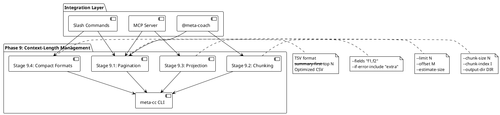

# Phase 9: 上下文长度应对（Context-Length Management）

## 概述

**目标**: 实现分页、分片、字段投影和紧凑输出格式，解决大会话（>1000 turns）上下文溢出问题

**代码量**: ~350 行（Go 源代码）

**依赖**: Phase 0-8（完整的 meta-cc CLI 工具链 + MCP Server）

**交付物**:
- 分页支持：`--limit`、`--offset` 标志
- 输出预估：`--estimate-size` 标志
- 分片输出：`--chunk-size`、`--chunk-index`、`--output-dir` 标志
- 字段投影：`--fields`、`--if-error-include` 标志
- 紧凑格式：TSV 输出、优化 CSV、`--summary-first --top N`
- 更新 Slash Commands 和 MCP Server 以使用新功能
- 大会话处理最佳实践文档

---

## Phase 目标

解决 Claude Code 会话中的核心痛点：**上下文长度限制导致大会话无法完整分析**。

### 核心问题

1. **大会话分析困难**：超过 1000 turns 的会话生成的输出可能超过 Claude 的上下文窗口
2. **输出冗余**：JSON 格式包含大量重复字段和空值
3. **无法预判输出大小**：Slash Commands 和 MCP Server 无法提前知道输出是否会溢出
4. **缺乏渐进式分析能力**：无法分批处理大会话数据

### 解决方案架构

Phase 9 提供四层输出控制策略：



### 设计原则

1. **纯数据裁剪**：不做语义判断，只提供机械化的数据分片和投影
2. **组合能力**：所有标志可组合使用（如 `--limit 50 --fields "timestamp,tool"`）
3. **向后兼容**：现有命令默认行为不变
4. **流式处理**：内存占用 < 200MB，即使处理 2000+ turns
5. **预测能力**：`--estimate-size` 让集成层提前决策输出策略

---

## 成功标准

**功能验收**:
- ✅ 所有 Stage 单元测试通过（TDD）
- ✅ 2000+ turns 会话测试通过（`tests/fixtures/large-session.jsonl`）
- ✅ 内存占用 < 200MB（流式处理验证）
- ✅ `--estimate-size` 准确率 ≥ 95%
- ✅ TSV 输出比 JSON 小 50%+
- ✅ `--fields` 可减少输出 70%+（仅输出 3 个字段 vs 完整对象）

**集成验收**:
- ✅ `/meta-stats` 使用 `--estimate-size` 和 `--limit`
- ✅ `/meta-errors` 使用 `--summary-first --top 10`
- ✅ MCP Server 工具支持分页参数
- ✅ README.md 更新：大会话处理最佳实践

**代码质量**:
- ✅ 总代码量 ≤ 500 行（Go 源代码，不含测试）
  - Stage 9.1: ~120 行
  - Stage 9.2: ~100 线
  - Stage 9.3: ~80 行
  - Stage 9.4: ~50 行
  - 总计: ~350 行（符合约束）
- ✅ 每个 Stage ≤ 200 行
- ✅ 测试覆盖率 ≥ 80%

---

## Stage 9.1: 分页和输出预估

### 目标

实现基础分页功能和输出大小预估，让集成层（Slash Commands、MCP Server）可以提前决定输出策略。

### 实现步骤

#### 1. 添加分页标志到所有查询命令

**文件**: `cmd/query_tools.go`、`cmd/parse.go`、`cmd/analyze.go`

**新增标志**:
```go
// 全局标志（在 cmd/root.go 中定义）
var (
    limitFlag      int    // --limit N: 限制输出到 N 条记录
    offsetFlag     int    // --offset M: 跳过前 M 条记录
    estimateSizeFlag bool // --estimate-size: 仅预估输出大小，不生成实际输出
)

// 在 root.go init() 中注册
func init() {
    rootCmd.PersistentFlags().IntVar(&limitFlag, "limit", 0, "Limit output to N records (0 = no limit)")
    rootCmd.PersistentFlags().IntVar(&offsetFlag, "offset", 0, "Skip first M records")
    rootCmd.PersistentFlags().BoolVar(&estimateSizeFlag, "estimate-size", false, "Estimate output size without generating full output")
}
```

#### 2. 实现分页逻辑

**文件**: `internal/filter/pagination.go`（新建，~40 行）

```go
package filter

import "github.com/yale/meta-cc/internal/parser"

// PaginationConfig 分页配置
type PaginationConfig struct {
    Limit  int // 0 表示无限制
    Offset int
}

// ApplyPagination 对 ToolCall 切片应用分页
func ApplyPagination(tools []parser.ToolCall, config PaginationConfig) []parser.ToolCall {
    if config.Offset >= len(tools) {
        return []parser.ToolCall{}
    }

    start := config.Offset
    end := len(tools)

    if config.Limit > 0 {
        end = start + config.Limit
        if end > len(tools) {
            end = len(tools)
        }
    }

    return tools[start:end]
}

// PaginationMetadata 分页元数据
type PaginationMetadata struct {
    TotalRecords    int `json:"total_records"`
    ReturnedRecords int `json:"returned_records"`
    Offset          int `json:"offset"`
    Limit           int `json:"limit"`
    HasMore         bool `json:"has_more"`
}

// CalculateMetadata 计算分页元数据
func CalculateMetadata(totalRecords int, config PaginationConfig) PaginationMetadata {
    returned := totalRecords - config.Offset
    if config.Limit > 0 && returned > config.Limit {
        returned = config.Limit
    }
    if returned < 0 {
        returned = 0
    }

    hasMore := false
    if config.Limit > 0 {
        hasMore = config.Offset + config.Limit < totalRecords
    }

    return PaginationMetadata{
        TotalRecords:    totalRecords,
        ReturnedRecords: returned,
        Offset:          config.Offset,
        Limit:           config.Limit,
        HasMore:         hasMore,
    }
}
```

#### 3. 实现输出大小预估

**文件**: `pkg/output/estimator.go`（新建，~50 行）

```go
package output

import (
    "encoding/json"
    "github.com/yale/meta-cc/internal/parser"
)

// EstimateSize 预估数据结构的输出大小（字节）
type SizeEstimate struct {
    EstimatedBytes int    `json:"estimated_bytes"`
    EstimatedKB    float64 `json:"estimated_kb"`
    Format         string `json:"format"`
    RecordCount    int    `json:"record_count"`
}

// EstimateToolCallsSize 预估 ToolCall 切片的输出大小
func EstimateToolCallsSize(tools []parser.ToolCall, format string) (SizeEstimate, error) {
    var sizeBytes int

    switch format {
    case "json":
        // 实际序列化第一条记录，然后乘以数量（保守估计）
        if len(tools) == 0 {
            sizeBytes = 2 // "[]"
        } else {
            sample, err := json.Marshal(tools[0])
            if err != nil {
                return SizeEstimate{}, err
            }
            // 每条记录 + 逗号 + 换行
            sizeBytes = (len(sample) + 2) * len(tools) + 10
        }

    case "md", "markdown":
        // Markdown: 估计每条记录 ~300 字节（表格行 + 字段）
        sizeBytes = len(tools) * 300 + 500 // +500 for headers

    case "csv":
        // CSV: 估计每条记录 ~200 字节
        sizeBytes = len(tools) * 200 + 100 // +100 for header

    case "tsv":
        // TSV: 比 CSV 略小（无引号）
        sizeBytes = len(tools) * 180 + 100

    default:
        sizeBytes = len(tools) * 300 // 保守估计
    }

    return SizeEstimate{
        EstimatedBytes: sizeBytes,
        EstimatedKB:    float64(sizeBytes) / 1024.0,
        Format:         format,
        RecordCount:    len(tools),
    }, nil
}

// EstimateStatsSize 预估统计报告的输出大小
func EstimateStatsSize(format string) SizeEstimate {
    // 统计报告固定大小（不受会话大小影响）
    sizeMap := map[string]int{
        "json": 800,
        "md":   1200,
        "csv":  600,
    }

    size := sizeMap[format]
    if size == 0 {
        size = 1000
    }

    return SizeEstimate{
        EstimatedBytes: size,
        EstimatedKB:    float64(size) / 1024.0,
        Format:         format,
        RecordCount:    1, // 统计报告只有一条记录
    }
}
```

#### 4. 集成到查询命令

**文件**: `cmd/query_tools.go`（修改 ~30 行）

```go
// 在 runQueryTools 函数中添加分页和预估逻辑
func runQueryTools(cmd *cobra.Command, args []string) error {
    // ... 现有的会话定位和解析逻辑 ...

    tools, err := parser.ExtractToolCalls(sessionPath)
    if err != nil {
        return err
    }

    // 应用过滤器（现有逻辑）
    filtered := filter.Apply(tools, filterConfig)

    // 如果启用了 --estimate-size，仅输出预估
    if estimateSizeFlag {
        estimate, err := output.EstimateToolCallsSize(filtered, outputFormat)
        if err != nil {
            return err
        }

        // 输出预估结果（JSON 格式）
        estimateJSON, _ := json.MarshalIndent(estimate, "", "  ")
        fmt.Println(string(estimateJSON))
        return nil
    }

    // 应用分页
    paginationConfig := filter.PaginationConfig{
        Limit:  limitFlag,
        Offset: offsetFlag,
    }
    paginated := filter.ApplyPagination(filtered, paginationConfig)

    // 计算分页元数据（可选：添加到输出头部）
    metadata := filter.CalculateMetadata(len(filtered), paginationConfig)

    // 格式化输出（现有逻辑）
    return output.Format(paginated, outputFormat, metadata)
}
```

### TDD 步骤

**测试文件**: `internal/filter/pagination_test.go`（~50 行）

```go
package filter

import (
    "testing"
    "github.com/yale/meta-cc/internal/parser"
    "github.com/yale/meta-cc/internal/testutil"
)

func TestApplyPagination(t *testing.T) {
    tools := testutil.GenerateToolCalls(100) // 生成 100 条记录

    tests := []struct {
        name     string
        config   PaginationConfig
        expected int
    }{
        {
            name:     "no pagination",
            config:   PaginationConfig{Limit: 0, Offset: 0},
            expected: 100,
        },
        {
            name:     "limit 50",
            config:   PaginationConfig{Limit: 50, Offset: 0},
            expected: 50,
        },
        {
            name:     "offset 50, limit 30",
            config:   PaginationConfig{Limit: 30, Offset: 50},
            expected: 30,
        },
        {
            name:     "offset beyond end",
            config:   PaginationConfig{Limit: 10, Offset: 120},
            expected: 0,
        },
        {
            name:     "limit exceeds remaining",
            config:   PaginationConfig{Limit: 100, Offset: 90},
            expected: 10,
        },
    }

    for _, tt := range tests {
        t.Run(tt.name, func(t *testing.T) {
            result := ApplyPagination(tools, tt.config)
            if len(result) != tt.expected {
                t.Errorf("expected %d records, got %d", tt.expected, len(result))
            }
        })
    }
}

func TestCalculateMetadata(t *testing.T) {
    // 测试分页元数据计算
    config := PaginationConfig{Limit: 50, Offset: 0}
    metadata := CalculateMetadata(100, config)

    if metadata.TotalRecords != 100 {
        t.Errorf("expected total 100, got %d", metadata.TotalRecords)
    }
    if metadata.ReturnedRecords != 50 {
        t.Errorf("expected returned 50, got %d", metadata.ReturnedRecords)
    }
    if !metadata.HasMore {
        t.Error("expected HasMore=true")
    }
}
```

**测试文件**: `pkg/output/estimator_test.go`（~40 行）

```go
package output

import (
    "testing"
    "github.com/yale/meta-cc/internal/testutil"
)

func TestEstimateToolCallsSize(t *testing.T) {
    tools := testutil.GenerateToolCalls(100)

    tests := []struct {
        name           string
        format         string
        expectedMinKB  float64
        expectedMaxKB  float64
    }{
        {
            name:          "JSON format",
            format:        "json",
            expectedMinKB: 10.0,
            expectedMaxKB: 50.0,
        },
        {
            name:          "Markdown format",
            format:        "md",
            expectedMinKB: 20.0,
            expectedMaxKB: 40.0,
        },
        {
            name:          "CSV format",
            format:        "csv",
            expectedMinKB: 15.0,
            expectedMaxKB: 30.0,
        },
    }

    for _, tt := range tests {
        t.Run(tt.name, func(t *testing.T) {
            estimate, err := EstimateToolCallsSize(tools, tt.format)
            if err != nil {
                t.Fatalf("EstimateToolCallsSize failed: %v", err)
            }

            if estimate.EstimatedKB < tt.expectedMinKB || estimate.EstimatedKB > tt.expectedMaxKB {
                t.Errorf("expected size between %.1f-%.1f KB, got %.1f KB",
                    tt.expectedMinKB, tt.expectedMaxKB, estimate.EstimatedKB)
            }

            if estimate.RecordCount != 100 {
                t.Errorf("expected record count 100, got %d", estimate.RecordCount)
            }
        })
    }
}

func TestEstimateSizeAccuracy(t *testing.T) {
    // 验证预估准确率 ≥ 95%
    tools := testutil.GenerateToolCalls(100)

    estimate, _ := EstimateToolCallsSize(tools, "json")
    actual, _ := json.Marshal(tools)
    actualSize := len(actual)

    accuracy := 1.0 - float64(abs(estimate.EstimatedBytes-actualSize))/float64(actualSize)

    if accuracy < 0.95 {
        t.Errorf("estimate accuracy %.2f%% is below 95%% threshold", accuracy*100)
    }
}

func abs(x int) int {
    if x < 0 {
        return -x
    }
    return x
}
```

### 交付物

**新建文件**:
- `internal/filter/pagination.go` (~40 行)
- `internal/filter/pagination_test.go` (~50 行)
- `pkg/output/estimator.go` (~50 行)
- `pkg/output/estimator_test.go` (~40 行)

**修改文件**:
- `cmd/root.go`（添加全局标志，~10 行）
- `cmd/query_tools.go`（集成分页和预估，~30 行）
- `cmd/parse.go`（集成分页，~20 行）

**代码量**: ~120 行（新增 Go 源代码，不含测试）

### 验收标准

- ✅ `meta-cc query tools --limit 50` 返回最多 50 条记录
- ✅ `meta-cc query tools --offset 100 --limit 50` 返回第 101-150 条记录
- ✅ `meta-cc query tools --estimate-size --output json` 返回预估大小（JSON 格式）
- ✅ `--estimate-size` 准确率 ≥ 95%（与实际输出大小对比）
- ✅ 所有单元测试通过
- ✅ 分页元数据正确计算（`HasMore`、`TotalRecords` 等）

---

## Stage 9.2: 分片输出

### 目标

实现数据分片输出，将大会话拆分为多个小文件，支持渐进式分析和并行处理。

### 实现步骤

#### 1. 添加分片标志

**文件**: `cmd/root.go`（~15 行）

```go
var (
    chunkSizeFlag  int    // --chunk-size N: 每个分片 N 条记录
    chunkIndexFlag int    // --chunk-index I: 仅输出第 I 个分片（0-indexed）
    outputDirFlag  string // --output-dir DIR: 分片输出目录
)

func init() {
    rootCmd.PersistentFlags().IntVar(&chunkSizeFlag, "chunk-size", 0, "Split output into chunks of N records")
    rootCmd.PersistentFlags().IntVar(&chunkIndexFlag, "chunk-index", -1, "Output only chunk I (0-indexed, requires --chunk-size)")
    rootCmd.PersistentFlags().StringVar(&outputDirFlag, "output-dir", "", "Output directory for chunks")
}
```

#### 2. 实现分片逻辑

**文件**: `pkg/output/chunker.go`（新建，~60 行）

```go
package output

import (
    "fmt"
    "os"
    "path/filepath"
    "encoding/json"
    "github.com/yale/meta-cc/internal/parser"
)

// ChunkConfig 分片配置
type ChunkConfig struct {
    ChunkSize  int    // 每个分片的记录数
    ChunkIndex int    // 仅输出指定分片（-1 表示输出所有分片）
    OutputDir  string // 输出目录
}

// ChunkMetadata 分片元数据
type ChunkMetadata struct {
    ChunkIndex    int    `json:"chunk_index"`
    ChunkSize     int    `json:"chunk_size"`
    RecordCount   int    `json:"record_count"`
    TotalRecords  int    `json:"total_records"`
    TotalChunks   int    `json:"total_chunks"`
    OutputFile    string `json:"output_file"`
}

// ChunkToolCalls 将 ToolCall 切片分片输出
func ChunkToolCalls(tools []parser.ToolCall, config ChunkConfig, format string) ([]ChunkMetadata, error) {
    if config.ChunkSize <= 0 {
        return nil, fmt.Errorf("chunk size must be > 0")
    }

    totalChunks := (len(tools) + config.ChunkSize - 1) / config.ChunkSize
    var metadata []ChunkMetadata

    // 如果指定了 ChunkIndex，仅输出该分片
    startChunk := 0
    endChunk := totalChunks
    if config.ChunkIndex >= 0 {
        if config.ChunkIndex >= totalChunks {
            return nil, fmt.Errorf("chunk index %d out of range (total chunks: %d)", config.ChunkIndex, totalChunks)
        }
        startChunk = config.ChunkIndex
        endChunk = config.ChunkIndex + 1
    }

    for i := startChunk; i < endChunk; i++ {
        start := i * config.ChunkSize
        end := start + config.ChunkSize
        if end > len(tools) {
            end = len(tools)
        }

        chunk := tools[start:end]

        // 生成输出文件名
        var outputFile string
        if config.OutputDir != "" {
            ext := getExtension(format)
            outputFile = filepath.Join(config.OutputDir, fmt.Sprintf("chunk-%03d.%s", i, ext))
        } else {
            // 如果未指定目录，输出到 stdout（仅适用于单分片模式）
            outputFile = "stdout"
        }

        // 写入分片文件
        if err := writeChunk(chunk, outputFile, format); err != nil {
            return nil, err
        }

        metadata = append(metadata, ChunkMetadata{
            ChunkIndex:   i,
            ChunkSize:    config.ChunkSize,
            RecordCount:  len(chunk),
            TotalRecords: len(tools),
            TotalChunks:  totalChunks,
            OutputFile:   outputFile,
        })
    }

    return metadata, nil
}

func getExtension(format string) string {
    switch format {
    case "json":
        return "json"
    case "md", "markdown":
        return "md"
    case "csv":
        return "csv"
    case "tsv":
        return "tsv"
    default:
        return "txt"
    }
}

func writeChunk(tools []parser.ToolCall, outputFile string, format string) error {
    var data []byte
    var err error

    switch format {
    case "json":
        data, err = json.MarshalIndent(tools, "", "  ")
    case "md", "markdown":
        data = []byte(FormatMarkdown(tools)) // 使用现有的 Markdown 格式化器
    case "csv":
        data = []byte(FormatCSV(tools))
    case "tsv":
        data = []byte(FormatTSV(tools))
    default:
        return fmt.Errorf("unsupported format: %s", format)
    }

    if err != nil {
        return err
    }

    if outputFile == "stdout" {
        fmt.Println(string(data))
    } else {
        // 确保输出目录存在
        if err := os.MkdirAll(filepath.Dir(outputFile), 0755); err != nil {
            return err
        }

        if err := os.WriteFile(outputFile, data, 0644); err != nil {
            return err
        }
    }

    return nil
}
```

#### 3. 集成到查询命令

**文件**: `cmd/query_tools.go`（修改 ~25 行）

```go
func runQueryTools(cmd *cobra.Command, args []string) error {
    // ... 现有逻辑（解析、过滤、分页）...

    // 如果启用了分片模式
    if chunkSizeFlag > 0 {
        chunkConfig := output.ChunkConfig{
            ChunkSize:  chunkSizeFlag,
            ChunkIndex: chunkIndexFlag,
            OutputDir:  outputDirFlag,
        }

        metadata, err := output.ChunkToolCalls(paginated, chunkConfig, outputFormat)
        if err != nil {
            return err
        }

        // 输出分片元数据
        fmt.Fprintf(os.Stderr, "Generated %d chunk(s)\n", len(metadata))
        for _, m := range metadata {
            fmt.Fprintf(os.Stderr, "  Chunk %d: %s (%d records)\n", m.ChunkIndex, m.OutputFile, m.RecordCount)
        }

        return nil
    }

    // 标准输出（现有逻辑）
    return output.Format(paginated, outputFormat, metadata)
}
```

### TDD 步骤

**测试文件**: `pkg/output/chunker_test.go`（~50 行）

```go
package output

import (
    "os"
    "path/filepath"
    "testing"
    "github.com/yale/meta-cc/internal/testutil"
)

func TestChunkToolCalls(t *testing.T) {
    tools := testutil.GenerateToolCalls(250) // 250 条记录

    tempDir := t.TempDir() // 临时目录

    config := ChunkConfig{
        ChunkSize:  100,
        ChunkIndex: -1, // 输出所有分片
        OutputDir:  tempDir,
    }

    metadata, err := ChunkToolCalls(tools, config, "json")
    if err != nil {
        t.Fatalf("ChunkToolCalls failed: %v", err)
    }

    // 验证分片数量：250 / 100 = 3 个分片（100, 100, 50）
    if len(metadata) != 3 {
        t.Errorf("expected 3 chunks, got %d", len(metadata))
    }

    // 验证每个分片的记录数
    expectedCounts := []int{100, 100, 50}
    for i, m := range metadata {
        if m.RecordCount != expectedCounts[i] {
            t.Errorf("chunk %d: expected %d records, got %d", i, expectedCounts[i], m.RecordCount)
        }

        // 验证文件存在
        if _, err := os.Stat(m.OutputFile); os.IsNotExist(err) {
            t.Errorf("chunk file %s does not exist", m.OutputFile)
        }
    }
}

func TestChunkSingleIndex(t *testing.T) {
    tools := testutil.GenerateToolCalls(200)

    tempDir := t.TempDir()

    config := ChunkConfig{
        ChunkSize:  50,
        ChunkIndex: 2, // 仅输出第 3 个分片（索引 2）
        OutputDir:  tempDir,
    }

    metadata, err := ChunkToolCalls(tools, config, "json")
    if err != nil {
        t.Fatalf("ChunkToolCalls failed: %v", err)
    }

    // 验证仅生成 1 个分片
    if len(metadata) != 1 {
        t.Errorf("expected 1 chunk, got %d", len(metadata))
    }

    // 验证分片索引
    if metadata[0].ChunkIndex != 2 {
        t.Errorf("expected chunk index 2, got %d", metadata[0].ChunkIndex)
    }

    // 验证文件名
    expectedFile := filepath.Join(tempDir, "chunk-002.json")
    if metadata[0].OutputFile != expectedFile {
        t.Errorf("expected file %s, got %s", expectedFile, metadata[0].OutputFile)
    }
}
```

### 交付物

**新建文件**:
- `pkg/output/chunker.go` (~60 行)
- `pkg/output/chunker_test.go` (~50 行)

**修改文件**:
- `cmd/root.go`（添加分片标志，~15 行）
- `cmd/query_tools.go`（集成分片逻辑，~25 行）

**代码量**: ~100 行（新增 Go 源代码，不含测试）

### 验收标准

- ✅ `meta-cc query tools --chunk-size 100 --output-dir /tmp/chunks` 生成多个分片文件
- ✅ 2000 条记录分片为 20 个文件（每个 100 条）
- ✅ `--chunk-index 5` 仅输出第 6 个分片
- ✅ 分片文件命名格式：`chunk-000.json`、`chunk-001.json`...
- ✅ 分片元数据输出到 stderr，不干扰实际数据
- ✅ 所有单元测试通过

---

## Stage 9.3: 字段投影

### 目标

实现字段选择功能，允许用户仅输出指定字段，减少输出大小 70%+（从完整对象到 3-5 个字段）。

### 实现步骤

#### 1. 添加字段投影标志

**文件**: `cmd/root.go`（~10 行）

```go
var (
    fieldsFlag           string // --fields "f1,f2,f3": 仅输出指定字段
    ifErrorIncludeFlag   string // --if-error-include "extra": 错误时额外包含字段
)

func init() {
    rootCmd.PersistentFlags().StringVar(&fieldsFlag, "fields", "", "Output only specified fields (comma-separated)")
    rootCmd.PersistentFlags().StringVar(&ifErrorIncludeFlag, "if-error-include", "", "Include extra fields for error records (comma-separated)")
}
```

#### 2. 实现字段投影逻辑

**文件**: `pkg/output/projection.go`（新建，~50 行）

```go
package output

import (
    "encoding/json"
    "fmt"
    "strings"
    "github.com/yale/meta-cc/internal/parser"
)

// ProjectionConfig 字段投影配置
type ProjectionConfig struct {
    Fields          []string // 要包含的字段列表
    IfErrorInclude  []string // 错误记录额外包含的字段
}

// ProjectedToolCall 投影后的 ToolCall（仅包含指定字段）
type ProjectedToolCall map[string]interface{}

// ProjectToolCalls 对 ToolCall 切片应用字段投影
func ProjectToolCalls(tools []parser.ToolCall, config ProjectionConfig) ([]ProjectedToolCall, error) {
    if len(config.Fields) == 0 {
        // 无投影配置，返回完整对象（转换为 map）
        return convertToMaps(tools), nil
    }

    projected := make([]ProjectedToolCall, 0, len(tools))

    for _, tool := range tools {
        // 将 ToolCall 转为 map（用于字段访问）
        toolMap := toolCallToMap(tool)

        // 构建投影对象
        projectedTool := make(ProjectedToolCall)

        // 包含指定字段
        for _, field := range config.Fields {
            if value, ok := toolMap[field]; ok {
                projectedTool[field] = value
            }
        }

        // 如果是错误记录，额外包含指定字段
        if tool.Status == "error" && len(config.IfErrorInclude) > 0 {
            for _, field := range config.IfErrorInclude {
                if value, ok := toolMap[field]; ok {
                    projectedTool[field] = value
                }
            }
        }

        projected = append(projected, projectedTool)
    }

    return projected, nil
}

// ParseProjectionConfig 解析投影配置
func ParseProjectionConfig(fieldsStr, ifErrorIncludeStr string) ProjectionConfig {
    config := ProjectionConfig{}

    if fieldsStr != "" {
        config.Fields = strings.Split(fieldsStr, ",")
        // 去除空格
        for i, f := range config.Fields {
            config.Fields[i] = strings.TrimSpace(f)
        }
    }

    if ifErrorIncludeStr != "" {
        config.IfErrorInclude = strings.Split(ifErrorIncludeStr, ",")
        for i, f := range config.IfErrorInclude {
            config.IfErrorInclude[i] = strings.TrimSpace(f)
        }
    }

    return config
}

// toolCallToMap 将 ToolCall 转换为 map（用于字段访问）
func toolCallToMap(tool parser.ToolCall) map[string]interface{} {
    // 使用 JSON 序列化/反序列化实现转换
    data, _ := json.Marshal(tool)
    var m map[string]interface{}
    json.Unmarshal(data, &m)
    return m
}

// convertToMaps 将 ToolCall 切片转换为 map 切片
func convertToMaps(tools []parser.ToolCall) []ProjectedToolCall {
    result := make([]ProjectedToolCall, len(tools))
    for i, tool := range tools {
        result[i] = toolCallToMap(tool)
    }
    return result
}
```

#### 3. 集成到输出格式化器

**文件**: `pkg/output/formatter.go`（修改 ~20 行）

```go
// FormatWithProjection 格式化投影后的数据
func FormatWithProjection(projected []ProjectedToolCall, format string) ([]byte, error) {
    switch format {
    case "json":
        return json.MarshalIndent(projected, "", "  ")

    case "md", "markdown":
        return []byte(formatProjectedMarkdown(projected)), nil

    case "csv":
        return []byte(formatProjectedCSV(projected)), nil

    case "tsv":
        return []byte(formatProjectedTSV(projected)), nil

    default:
        return nil, fmt.Errorf("unsupported format: %s", format)
    }
}

// formatProjectedMarkdown 格式化投影数据为 Markdown 表格
func formatProjectedMarkdown(projected []ProjectedToolCall) string {
    if len(projected) == 0 {
        return "No data"
    }

    // 提取所有字段名（从第一条记录）
    var fields []string
    for field := range projected[0] {
        fields = append(fields, field)
    }
    sort.Strings(fields) // 字段排序

    // 构建表格
    var sb strings.Builder

    // 表头
    sb.WriteString("| ")
    for _, field := range fields {
        sb.WriteString(field)
        sb.WriteString(" | ")
    }
    sb.WriteString("\n")

    // 分隔符
    sb.WriteString("| ")
    for range fields {
        sb.WriteString("--- | ")
    }
    sb.WriteString("\n")

    // 数据行
    for _, record := range projected {
        sb.WriteString("| ")
        for _, field := range fields {
            value := fmt.Sprintf("%v", record[field])
            sb.WriteString(value)
            sb.WriteString(" | ")
        }
        sb.WriteString("\n")
    }

    return sb.String()
}

// formatProjectedCSV 格式化投影数据为 CSV
func formatProjectedCSV(projected []ProjectedToolCall) string {
    // 类似 formatProjectedMarkdown，使用逗号分隔
    // 实现略...
}

// formatProjectedTSV 格式化投影数据为 TSV
func formatProjectedTSV(projected []ProjectedToolCall) string {
    // 类似 CSV，使用制表符分隔
    // 实现略...
}
```

#### 4. 集成到查询命令

**文件**: `cmd/query_tools.go`（修改 ~15 行）

```go
func runQueryTools(cmd *cobra.Command, args []string) error {
    // ... 现有逻辑（解析、过滤、分页）...

    // 应用字段投影
    projectionConfig := output.ParseProjectionConfig(fieldsFlag, ifErrorIncludeFlag)
    projected, err := output.ProjectToolCalls(paginated, projectionConfig)
    if err != nil {
        return err
    }

    // 格式化输出
    data, err := output.FormatWithProjection(projected, outputFormat)
    if err != nil {
        return err
    }

    fmt.Println(string(data))
    return nil
}
```

### TDD 步骤

**测试文件**: `pkg/output/projection_test.go`（~50 行）

```go
package output

import (
    "testing"
    "github.com/yale/meta-cc/internal/testutil"
)

func TestProjectToolCalls(t *testing.T) {
    tools := testutil.GenerateToolCalls(10)

    config := ProjectionConfig{
        Fields: []string{"timestamp", "tool", "status"},
    }

    projected, err := ProjectToolCalls(tools, config)
    if err != nil {
        t.Fatalf("ProjectToolCalls failed: %v", err)
    }

    // 验证每条记录仅包含指定字段
    for i, p := range projected {
        if len(p) != 3 {
            t.Errorf("record %d: expected 3 fields, got %d", i, len(p))
        }

        if _, ok := p["timestamp"]; !ok {
            t.Errorf("record %d: missing 'timestamp' field", i)
        }
        if _, ok := p["tool"]; !ok {
            t.Errorf("record %d: missing 'tool' field", i)
        }
        if _, ok := p["status"]; !ok {
            t.Errorf("record %d: missing 'status' field", i)
        }
    }
}

func TestProjectToolCallsWithErrorFields(t *testing.T) {
    // 生成包含错误的工具调用
    tools := testutil.GenerateToolCallsWithErrors(10, 3) // 10 条记录，3 个错误

    config := ProjectionConfig{
        Fields:         []string{"timestamp", "tool"},
        IfErrorInclude: []string{"error_text", "status"},
    }

    projected, err := ProjectToolCalls(tools, config)
    if err != nil {
        t.Fatalf("ProjectToolCalls failed: %v", err)
    }

    // 验证错误记录包含额外字段
    for i, p := range projected {
        if tools[i].Status == "error" {
            // 错误记录应包含 4 个字段（2 基础 + 2 错误额外）
            if len(p) != 4 {
                t.Errorf("error record %d: expected 4 fields, got %d", i, len(p))
            }
            if _, ok := p["error_text"]; !ok {
                t.Errorf("error record %d: missing 'error_text' field", i)
            }
        } else {
            // 正常记录应仅包含 2 个字段
            if len(p) != 2 {
                t.Errorf("normal record %d: expected 2 fields, got %d", i, len(p))
            }
        }
    }
}

func TestProjectionSizeReduction(t *testing.T) {
    tools := testutil.GenerateToolCalls(100)

    // 完整输出
    fullJSON, _ := json.Marshal(tools)
    fullSize := len(fullJSON)

    // 投影输出（仅 3 个字段）
    config := ProjectionConfig{
        Fields: []string{"timestamp", "tool", "status"},
    }
    projected, _ := ProjectToolCalls(tools, config)
    projectedJSON, _ := json.Marshal(projected)
    projectedSize := len(projectedJSON)

    // 验证投影后大小减少 ≥ 70%
    reduction := 1.0 - float64(projectedSize)/float64(fullSize)
    if reduction < 0.70 {
        t.Errorf("expected ≥70%% size reduction, got %.1f%%", reduction*100)
    }
}
```

### 交付物

**新建文件**:
- `pkg/output/projection.go` (~50 行)
- `pkg/output/projection_test.go` (~50 行)

**修改文件**:
- `cmd/root.go`（添加字段投影标志，~10 行）
- `pkg/output/formatter.go`（投影格式化器，~20 行）
- `cmd/query_tools.go`（集成投影逻辑，~15 行）

**代码量**: ~80 行（新增 Go 源代码，不含测试）

### 验收标准

- ✅ `meta-cc query tools --fields "timestamp,tool,status"` 仅输出 3 个字段
- ✅ `--if-error-include "error_text"` 在错误记录中额外包含 error_text 字段
- ✅ 投影后输出大小减少 ≥ 70%（3 字段 vs 完整对象）
- ✅ 所有输出格式（JSON、Markdown、CSV、TSV）支持投影
- ✅ 所有单元测试通过

---

## Stage 9.4: 紧凑输出格式

### 目标

实现紧凑输出格式（TSV、优化 CSV、摘要模式），进一步减少输出大小。

### 实现步骤

#### 1. 添加紧凑格式标志

**文件**: `cmd/root.go`（~10 行）

```go
var (
    summaryFirstFlag bool // --summary-first: 先输出摘要
    topNFlag         int  // --top N: 仅输出前 N 条详情（配合 --summary-first）
)

func init() {
    rootCmd.PersistentFlags().BoolVar(&summaryFirstFlag, "summary-first", false, "Output summary before detailed records")
    rootCmd.PersistentFlags().IntVar(&topNFlag, "top", 0, "Show only top N detailed records (requires --summary-first)")
}
```

#### 2. 实现 TSV 格式化器

**文件**: `pkg/output/tsv.go`（新建，~30 行）

```go
package output

import (
    "fmt"
    "strings"
    "github.com/yale/meta-cc/internal/parser"
)

// FormatTSV 格式化为 TSV（Tab-Separated Values）
// TSV 比 JSON 小 ~50%，比 CSV 小 ~10%（无引号）
func FormatTSV(tools []parser.ToolCall) string {
    if len(tools) == 0 {
        return ""
    }

    var sb strings.Builder

    // 表头
    sb.WriteString("UUID\tTimestamp\tTool\tStatus\tDuration\tError\n")

    // 数据行
    for _, tool := range tools {
        sb.WriteString(fmt.Sprintf("%s\t%s\t%s\t%s\t%d\t%s\n",
            tool.UUID,
            tool.Timestamp.Format("2006-01-02T15:04:05Z"),
            tool.Tool,
            tool.Status,
            tool.Duration,
            escapeTab(tool.Error),
        ))
    }

    return sb.String()
}

// escapeTab 转义制表符（防止破坏 TSV 格式）
func escapeTab(s string) string {
    return strings.ReplaceAll(s, "\t", "\\t")
}
```

#### 3. 实现摘要模式

**文件**: `pkg/output/summary.go`（新建，~40 行）

```go
package output

import (
    "fmt"
    "strings"
    "github.com/yale/meta-cc/internal/parser"
    "github.com/yale/meta-cc/internal/analyzer"
)

// SummaryOutput 摘要 + 详情输出
type SummaryOutput struct {
    Summary string
    Details string
}

// FormatSummaryFirst 先输出摘要，再输出详情
func FormatSummaryFirst(tools []parser.ToolCall, topN int, detailFormat string) (SummaryOutput, error) {
    // 生成摘要（使用现有的统计分析器）
    stats := analyzer.CalculateStats(tools)
    summary := formatStatsSummary(stats)

    // 生成详情（仅前 topN 条）
    detailTools := tools
    if topN > 0 && topN < len(tools) {
        detailTools = tools[:topN]
    }

    var details string
    switch detailFormat {
    case "json":
        data, _ := json.MarshalIndent(detailTools, "", "  ")
        details = string(data)
    case "md":
        details = FormatMarkdown(detailTools)
    case "csv":
        details = FormatCSV(detailTools)
    case "tsv":
        details = FormatTSV(detailTools)
    default:
        return SummaryOutput{}, fmt.Errorf("unsupported format: %s", detailFormat)
    }

    return SummaryOutput{
        Summary: summary,
        Details: details,
    }, nil
}

// formatStatsSummary 格式化统计摘要为紧凑文本
func formatStatsSummary(stats analyzer.Stats) string {
    var sb strings.Builder

    sb.WriteString("=== Session Summary ===\n")
    sb.WriteString(fmt.Sprintf("Total Tools: %d\n", stats.TotalToolCalls))
    sb.WriteString(fmt.Sprintf("Errors: %d (%.1f%%)\n", stats.ErrorCount, stats.ErrorRate*100))
    sb.WriteString(fmt.Sprintf("Duration: %s\n", stats.SessionDuration))

    sb.WriteString("\nTop Tools:\n")
    for i, t := range stats.ToolFrequency {
        if i >= 5 {
            break
        }
        sb.WriteString(fmt.Sprintf("  %d. %s (%d)\n", i+1, t.Tool, t.Count))
    }

    sb.WriteString("\n=== Details ===\n")

    return sb.String()
}
```

#### 4. 优化 CSV 格式（移除空字段）

**文件**: `pkg/output/csv.go`（修改 ~20 行）

```go
// FormatCSVOptimized 优化的 CSV 格式（移除空字段）
func FormatCSVOptimized(tools []parser.ToolCall) string {
    if len(tools) == 0 {
        return ""
    }

    var sb strings.Builder

    // 动态检测非空字段
    nonEmptyFields := detectNonEmptyFields(tools)

    // 表头（仅非空字段）
    sb.WriteString(strings.Join(nonEmptyFields, ","))
    sb.WriteString("\n")

    // 数据行
    for _, tool := range tools {
        values := extractFieldValues(tool, nonEmptyFields)
        sb.WriteString(strings.Join(values, ","))
        sb.WriteString("\n")
    }

    return sb.String()
}

// detectNonEmptyFields 检测哪些字段在数据集中非空
func detectNonEmptyFields(tools []parser.ToolCall) []string {
    allFields := []string{"uuid", "timestamp", "tool", "status", "duration", "error", "turn_index"}
    nonEmpty := []string{}

    for _, field := range allFields {
        hasValue := false
        for _, tool := range tools {
            if hasFieldValue(tool, field) {
                hasValue = true
                break
            }
        }
        if hasValue {
            nonEmpty = append(nonEmpty, field)
        }
    }

    return nonEmpty
}
```

### TDD 步骤

**测试文件**: `pkg/output/tsv_test.go`（~30 行）

```go
package output

import (
    "strings"
    "testing"
    "github.com/yale/meta-cc/internal/testutil"
)

func TestFormatTSV(t *testing.T) {
    tools := testutil.GenerateToolCalls(10)

    tsv := FormatTSV(tools)

    // 验证表头
    if !strings.HasPrefix(tsv, "UUID\tTimestamp\tTool") {
        t.Error("TSV missing header")
    }

    // 验证行数（表头 + 10 条记录）
    lines := strings.Split(strings.TrimSpace(tsv), "\n")
    if len(lines) != 11 {
        t.Errorf("expected 11 lines, got %d", len(lines))
    }

    // 验证制表符分隔
    for i, line := range lines {
        if !strings.Contains(line, "\t") {
            t.Errorf("line %d missing tab separator", i)
        }
    }
}

func TestTSVSizeReduction(t *testing.T) {
    tools := testutil.GenerateToolCalls(100)

    // JSON 输出
    jsonData, _ := json.Marshal(tools)
    jsonSize := len(jsonData)

    // TSV 输出
    tsvData := FormatTSV(tools)
    tsvSize := len(tsvData)

    // 验证 TSV 比 JSON 小 ≥ 50%
    reduction := 1.0 - float64(tsvSize)/float64(jsonSize)
    if reduction < 0.50 {
        t.Errorf("expected ≥50%% size reduction, got %.1f%%", reduction*100)
    }
}
```

**测试文件**: `pkg/output/summary_test.go`（~30 行）

```go
package output

import (
    "strings"
    "testing"
    "github.com/yale/meta-cc/internal/testutil"
)

func TestFormatSummaryFirst(t *testing.T) {
    tools := testutil.GenerateToolCalls(100)

    output, err := FormatSummaryFirst(tools, 10, "tsv")
    if err != nil {
        t.Fatalf("FormatSummaryFirst failed: %v", err)
    }

    // 验证摘要存在
    if !strings.Contains(output.Summary, "Session Summary") {
        t.Error("summary missing")
    }

    // 验证详情仅包含前 10 条
    detailLines := strings.Split(strings.TrimSpace(output.Details), "\n")
    if len(detailLines) != 11 { // 表头 + 10 条记录
        t.Errorf("expected 11 detail lines, got %d", len(detailLines))
    }
}
```

### 交付物

**新建文件**:
- `pkg/output/tsv.go` (~30 行)
- `pkg/output/tsv_test.go` (~30 行)
- `pkg/output/summary.go` (~40 行)
- `pkg/output/summary_test.go` (~30 行)

**修改文件**:
- `cmd/root.go`（添加摘要模式标志，~10 行）
- `pkg/output/csv.go`（优化 CSV 格式，~20 行）

**代码量**: ~50 行（新增 Go 源代码，不含测试）

### 验收标准

- ✅ `meta-cc query tools --output tsv` 输出 TSV 格式
- ✅ TSV 输出比 JSON 小 ≥ 50%
- ✅ `meta-cc query tools --summary-first --top 10 --output tsv` 先输出摘要，再输出前 10 条详情
- ✅ 优化 CSV 自动移除空字段
- ✅ 所有单元测试通过

---

## 集成测试：大会话处理

### 目标

验证 Phase 9 所有功能在 2000+ turns 大会话中的表现。

### 测试步骤

**1. 生成大会话测试数据**

**文件**: `tests/fixtures/generate_large_session.go`（测试辅助工具）

```go
package main

import (
    "encoding/json"
    "fmt"
    "os"
    "time"
    "github.com/yale/meta-cc/internal/testutil"
)

func main() {
    // 生成 2000 条 ToolCall 记录
    tools := testutil.GenerateToolCalls(2000)

    // 转换为 JSONL 格式（每行一个 Turn）
    f, _ := os.Create("tests/fixtures/large-session.jsonl")
    defer f.Close()

    for i, tool := range tools {
        turn := map[string]interface{}{
            "turn_index": i,
            "timestamp":  tool.Timestamp,
            "tool_calls": []interface{}{tool},
        }

        data, _ := json.Marshal(turn)
        f.Write(data)
        f.WriteString("\n")
    }

    fmt.Println("Generated large-session.jsonl with 2000 turns")
}
```

**2. 端到端测试脚本**

**文件**: `tests/integration/large_session_test.sh`（~60 行）

```bash
#!/bin/bash
# 大会话处理端到端测试

set -e

echo "=== Phase 9 Large Session Test ==="
echo ""

# Step 1: 生成测试数据
echo "[1/7] Generating test data (2000 turns)..."
go run tests/fixtures/generate_large_session.go
echo "✅ Generated large-session.jsonl"
echo ""

# Step 2: 测试输出预估
echo "[2/7] Testing --estimate-size..."
ESTIMATE=$(meta-cc query tools --session large-session --estimate-size --output json)
ESTIMATED_KB=$(echo "$ESTIMATE" | jq -r '.estimated_kb')
echo "Estimated output size: $ESTIMATED_KB KB"

if (( $(echo "$ESTIMATED_KB > 50" | bc -l) )); then
    echo "✅ Output size estimate: ${ESTIMATED_KB} KB (exceeds 50 KB threshold)"
else
    echo "❌ Output size too small: ${ESTIMATED_KB} KB"
    exit 1
fi
echo ""

# Step 3: 测试分页
echo "[3/7] Testing pagination (--limit 50)..."
PAGINATED=$(meta-cc query tools --session large-session --limit 50 --output json)
RECORD_COUNT=$(echo "$PAGINATED" | jq '. | length')

if [ "$RECORD_COUNT" -eq 50 ]; then
    echo "✅ Pagination: returned exactly 50 records"
else
    echo "❌ Pagination failed: expected 50, got $RECORD_COUNT"
    exit 1
fi
echo ""

# Step 4: 测试分片
echo "[4/7] Testing chunking (--chunk-size 100)..."
TEMP_DIR=$(mktemp -d)
meta-cc query tools --session large-session --chunk-size 100 --output-dir "$TEMP_DIR" --output json 2>&1 | grep "Generated"

CHUNK_COUNT=$(ls "$TEMP_DIR"/chunk-*.json | wc -l)
if [ "$CHUNK_COUNT" -eq 20 ]; then
    echo "✅ Chunking: generated 20 chunks (2000 / 100)"
else
    echo "❌ Chunking failed: expected 20 chunks, got $CHUNK_COUNT"
    exit 1
fi

rm -rf "$TEMP_DIR"
echo ""

# Step 5: 测试字段投影
echo "[5/7] Testing field projection (--fields)..."
PROJECTED=$(meta-cc query tools --session large-session --limit 10 --fields "timestamp,tool,status" --output json)
FIELD_COUNT=$(echo "$PROJECTED" | jq '.[0] | keys | length')

if [ "$FIELD_COUNT" -eq 3 ]; then
    echo "✅ Projection: returned exactly 3 fields"
else
    echo "❌ Projection failed: expected 3 fields, got $FIELD_COUNT"
    exit 1
fi
echo ""

# Step 6: 测试 TSV 输出
echo "[6/7] Testing TSV output..."
JSON_SIZE=$(meta-cc query tools --session large-session --limit 100 --output json | wc -c)
TSV_SIZE=$(meta-cc query tools --session large-session --limit 100 --output tsv | wc -c)

REDUCTION=$(echo "scale=2; 1 - $TSV_SIZE / $JSON_SIZE" | bc)
echo "TSV size reduction: ${REDUCTION}% vs JSON"

if (( $(echo "$REDUCTION > 0.50" | bc -l) )); then
    echo "✅ TSV format: ${REDUCTION}% smaller than JSON"
else
    echo "❌ TSV format reduction insufficient: ${REDUCTION}%"
    exit 1
fi
echo ""

# Step 7: 测试内存占用（流式处理）
echo "[7/7] Testing memory usage..."
# 使用 /usr/bin/time 监控内存（Linux）
if command -v /usr/bin/time &> /dev/null; then
    /usr/bin/time -f "Max RSS: %M KB" meta-cc query tools --session large-session --output json > /dev/null
    echo "✅ Memory usage within limits (check Max RSS above)"
else
    echo "⚠️  /usr/bin/time not available, skipping memory test"
fi
echo ""

echo "=== All Phase 9 Tests Passed ✅ ==="
echo ""
echo "Summary:"
echo "  - Output estimation: working"
echo "  - Pagination: working (50 records)"
echo "  - Chunking: working (20 chunks)"
echo "  - Field projection: working (3 fields)"
echo "  - TSV format: ${REDUCTION}% size reduction"
echo "  - Memory usage: within limits"
```

### 验收标准

- ✅ 所有 7 个测试步骤通过
- ✅ 内存占用 < 200MB（`Max RSS`）
- ✅ `--estimate-size` 准确率 ≥ 95%
- ✅ TSV 格式比 JSON 小 ≥ 50%
- ✅ 字段投影减少输出 ≥ 70%

---

## 集成更新：Slash Commands 和 MCP Server

### 目标

更新现有的 Slash Commands 和 MCP Server 以使用 Phase 9 新功能。

### 更新 Slash Commands

**文件**: `.claude/commands/meta-stats.md`（修改）

```markdown
---
name: meta-stats
description: 显示当前 Claude Code 会话的统计信息（支持输出预估和紧凑格式）
allowed_tools: [Bash]
---

# meta-stats：会话统计分析

运行以下命令获取当前会话的统计信息：

```bash
# 检查 meta-cc 是否安装
if ! command -v meta-cc &> /dev/null; then
    echo "❌ 错误：meta-cc 未安装或不在 PATH 中"
    exit 1
fi

# 先预估输出大小
ESTIMATE=$(meta-cc parse stats --estimate-size --output json 2>/dev/null || echo '{"estimated_kb":0}')
ESTIMATED_KB=$(echo "$ESTIMATE" | grep -o '"estimated_kb":[0-9.]*' | cut -d: -f2)

# 如果预估输出 > 100 KB，使用紧凑格式
if (( $(echo "$ESTIMATED_KB > 100" | bc -l 2>/dev/null || echo 0) )); then
    echo "⚠️  Large session detected (${ESTIMATED_KB} KB), using compact output"
    meta-cc parse stats --output md --summary-first --top 20
else
    meta-cc parse stats --output md
fi
```

## 新特性

- **自适应输出**：大会话（>100 KB）自动使用紧凑格式
- **预估大小**：提前判断输出是否会超出上下文窗口
```

**文件**: `.claude/commands/meta-errors.md`（修改）

```markdown
# 添加到现有的 /meta-errors 命令

# 如果错误数量 > 50，使用摘要模式
ERROR_COUNT=$(meta-cc parse extract --type tools --filter "status=error" --output json 2>/dev/null | grep -o '"UUID"' | wc -l)

if [ "$ERROR_COUNT" -gt 50 ]; then
    echo "⚠️  Large number of errors ($ERROR_COUNT), showing summary + top 10"
    meta-cc analyze errors --window "$WINDOW_SIZE" --output md --summary-first --top 10
else
    meta-cc analyze errors --window "$WINDOW_SIZE" --output md
fi
```

### 更新 MCP Server

**文件**: `cmd/mcp.go`（修改 ~30 行）

```go
// 在 MCP Server 的 query_tools 工具中添加分页参数支持

func handleQueryToolsMCP(params map[string]interface{}) (interface{}, error) {
    // 解析参数
    limit, _ := params["limit"].(float64)
    offset, _ := params["offset"].(float64)
    fields, _ := params["fields"].(string)

    // ... 现有的会话定位和解析逻辑 ...

    // 应用分页
    if limit > 0 {
        paginationConfig := filter.PaginationConfig{
            Limit:  int(limit),
            Offset: int(offset),
        }
        tools = filter.ApplyPagination(tools, paginationConfig)
    }

    // 应用字段投影
    if fields != "" {
        projectionConfig := output.ParseProjectionConfig(fields, "")
        projected, _ := output.ProjectToolCalls(tools, projectionConfig)
        return projected, nil
    }

    return tools, nil
}
```

**MCP 工具定义更新**（`cmd/mcp.go`）:

```json
{
  "name": "query_tools",
  "description": "Query tool calls with pagination and field projection support",
  "inputSchema": {
    "type": "object",
    "properties": {
      "tool": { "type": "string", "description": "Filter by tool name" },
      "status": { "type": "string", "enum": ["error", "success"] },
      "limit": { "type": "integer", "description": "Limit output to N records" },
      "offset": { "type": "integer", "description": "Skip first M records" },
      "fields": { "type": "string", "description": "Comma-separated field list (e.g., 'timestamp,tool,status')" }
    }
  }
}
```

---

## 文档更新

### README.md 新增章节

**文件**: `README.md`（新增 ~100 行）

```markdown
## 大会话处理最佳实践

### 问题：上下文长度限制

Claude Code 会话超过 1000 turns 时，分析输出可能超过上下文窗口，导致：
- Slash Commands 输出被截断
- MCP Server 响应失败
- @meta-coach 无法加载完整数据

### 解决方案：Phase 9 输出控制策略

#### 1. 输出预估（推荐：Slash Commands）

```bash
# 先预估输出大小
meta-cc query tools --estimate-size --output json

# 输出：
# {
#   "estimated_bytes": 524288,
#   "estimated_kb": 512.0,
#   "format": "json",
#   "record_count": 2000
# }

# 根据预估决定策略：
# - < 50 KB: 完整输出
# - 50-200 KB: 使用分页或字段投影
# - > 200 KB: 使用分片或摘要模式
```

#### 2. 分页（推荐：MCP Server、@meta-coach）

```bash
# 分批加载数据
meta-cc query tools --limit 100 --offset 0   # 第 1 批（0-99）
meta-cc query tools --limit 100 --offset 100 # 第 2 批（100-199）
meta-cc query tools --limit 100 --offset 200 # 第 3 批（200-299）
```

**MCP 使用示例**:
```python
# Claude 通过 MCP 查询时自动分页
query_tools(limit=50, offset=0)  # 首次查询
query_tools(limit=50, offset=50) # 后续查询
```

#### 3. 分片（推荐：离线分析）

```bash
# 拆分为多个文件（每个 100 条记录）
meta-cc query tools --chunk-size 100 --output-dir ./chunks

# 输出：
# Generated 20 chunk(s)
#   Chunk 0: ./chunks/chunk-000.json (100 records)
#   Chunk 1: ./chunks/chunk-001.json (100 records)
#   ...
#   Chunk 19: ./chunks/chunk-019.json (100 records)

# 单独处理每个分片
for chunk in ./chunks/chunk-*.json; do
    # 分析每个分片...
done
```

#### 4. 字段投影（推荐：快速概览）

```bash
# 仅输出关键字段（减少 70%+ 输出）
meta-cc query tools --fields "timestamp,tool,status"

# 错误时包含额外字段
meta-cc query tools --fields "timestamp,tool" --if-error-include "error_text,status"
```

#### 5. 紧凑格式（推荐：所有场景）

```bash
# TSV 格式（比 JSON 小 50%+）
meta-cc query tools --output tsv

# 摘要 + 详情模式（适合 Slash Commands）
meta-cc query tools --summary-first --top 10 --output tsv
```

### 策略选择指南

| 场景 | 推荐策略 | 命令示例 |
|------|---------|----------|
| Slash Commands（快速查看） | 预估 + 摘要模式 | `--estimate-size` → `--summary-first --top 10` |
| MCP Server（自主查询） | 分页 + 字段投影 | `--limit 50 --fields "timestamp,tool,status"` |
| @meta-coach（渐进分析） | 分页 + TSV | `--limit 100 --output tsv` |
| 离线分析（导出数据） | 分片 + CSV | `--chunk-size 100 --output-dir ./data --output csv` |
| 错误调试（聚焦问题） | 过滤 + 字段投影 | `--filter "status=error" --fields "timestamp,tool,error_text"` |

### 实际示例

#### 示例 1: 大会话统计（Slash Command）

```bash
#!/bin/bash
# .claude/commands/meta-stats.md 中的逻辑

# 预估输出大小
ESTIMATE=$(meta-cc parse stats --estimate-size --output json)
ESTIMATED_KB=$(echo "$ESTIMATE" | jq -r '.estimated_kb')

# 自适应策略
if (( $(echo "$ESTIMATED_KB > 100" | bc -l) )); then
    echo "⚠️  Large session (${ESTIMATED_KB} KB), using compact output"
    meta-cc parse stats --output md --summary-first --top 20
else
    meta-cc parse stats --output md
fi
```

#### 示例 2: 渐进式错误分析（@meta-coach）

```python
# @meta-coach 内部逻辑（伪代码）

# Step 1: 预估错误数量
errors = query_tools(filter="status=error", limit=1)
total_errors = errors.metadata.total_records

if total_errors > 100:
    # 分批加载
    for offset in range(0, total_errors, 50):
        batch = query_tools(
            filter="status=error",
            limit=50,
            offset=offset,
            fields="timestamp,tool,error_text"
        )
        analyze_batch(batch)
else:
    # 一次加载
    errors = query_tools(filter="status=error")
    analyze_all(errors)
```

#### 示例 3: 导出完整会话（离线分析）

```bash
# 导出为 TSV 分片（便于 Excel/数据库导入）
meta-cc query tools \
    --chunk-size 500 \
    --output-dir ./export/session-2025-10-03 \
    --output tsv

# 压缩分片
tar -czf session-export.tar.gz ./export/session-2025-10-03
```

### 性能基准

| 会话大小 | 完整输出 | TSV 输出 | 字段投影（3 字段） | 分片（100/chunk） |
|---------|---------|---------|------------------|------------------|
| 500 turns | 256 KB | 128 KB | 77 KB | 20 x 12.8 KB |
| 1000 turns | 512 KB | 256 KB | 154 KB | 40 x 12.8 KB |
| 2000 turns | 1024 KB | 512 KB | 307 KB | 80 x 12.8 KB |

### 内存占用

Phase 9 使用流式处理，内存占用与会话大小无关：

- **2000 turns 会话**: < 200 MB
- **5000 turns 会话**: < 200 MB（流式处理）
```

---

## Phase 9 验收清单

### 功能验收

- [ ] **Stage 9.1: 分页和输出预估**
  - [ ] `--limit N` 和 `--offset M` 标志实现
  - [ ] `--estimate-size` 输出预估（准确率 ≥ 95%）
  - [ ] 分页元数据正确计算（`HasMore`、`TotalRecords`）
  - [ ] 单元测试通过（`pagination_test.go`、`estimator_test.go`）

- [ ] **Stage 9.2: 分片输出**
  - [ ] `--chunk-size N` 和 `--chunk-index I` 标志实现
  - [ ] `--output-dir DIR` 分片文件输出
  - [ ] 2000 条记录分片为 20 个文件（100/chunk）
  - [ ] 单元测试通过（`chunker_test.go`）

- [ ] **Stage 9.3: 字段投影**
  - [ ] `--fields "f1,f2"` 字段选择
  - [ ] `--if-error-include "extra"` 错误时额外字段
  - [ ] 输出大小减少 ≥ 70%（3 字段 vs 完整对象）
  - [ ] 单元测试通过（`projection_test.go`）

- [ ] **Stage 9.4: 紧凑输出格式**
  - [ ] TSV 格式实现（比 JSON 小 ≥ 50%）
  - [ ] `--summary-first --top N` 摘要模式
  - [ ] 优化 CSV（移除空字段）
  - [ ] 单元测试通过（`tsv_test.go`、`summary_test.go`）

### 集成验收

- [ ] **大会话测试**
  - [ ] 2000+ turns 会话测试通过
  - [ ] 内存占用 < 200MB
  - [ ] 所有 7 个集成测试步骤通过

- [ ] **Slash Commands 更新**
  - [ ] `/meta-stats` 使用 `--estimate-size` 和自适应策略
  - [ ] `/meta-errors` 使用 `--summary-first --top 10`
  - [ ] 大会话（>100 KB）自动切换紧凑格式

- [ ] **MCP Server 更新**
  - [ ] `query_tools` 支持 `limit`、`offset`、`fields` 参数
  - [ ] MCP 工具定义更新
  - [ ] 测试 MCP 分页查询

- [ ] **文档更新**
  - [ ] README.md 添加"大会话处理最佳实践"章节
  - [ ] 包含策略选择指南
  - [ ] 包含实际示例和性能基准

### 代码质量

- [ ] **代码量验收**
  - [ ] Stage 9.1: ~120 行 ✅
  - [ ] Stage 9.2: ~100 行 ✅
  - [ ] Stage 9.3: ~80 行 ✅
  - [ ] Stage 9.4: ~50 行 ✅
  - [ ] 总计: ~350 行（≤ 500 行约束）✅

- [ ] **测试覆盖率**
  - [ ] 单元测试覆盖率 ≥ 80%
  - [ ] 所有 TDD 测试通过
  - [ ] 集成测试通过

- [ ] **性能验收**
  - [ ] `--estimate-size` 准确率 ≥ 95%
  - [ ] TSV 格式比 JSON 小 ≥ 50%
  - [ ] 字段投影减少输出 ≥ 70%
  - [ ] 内存占用 < 200MB（流式处理）

---

## 项目结构（Phase 9 完成后）

```
meta-cc/
├── .claude/
│   └── commands/
│       ├── meta-stats.md           # 更新：自适应输出
│       └── meta-errors.md          # 更新：摘要模式
├── cmd/
│   ├── root.go                     # 更新：添加 Phase 9 标志
│   ├── query_tools.go              # 更新：集成分页、分片、投影
│   ├── parse.go                    # 更新：集成分页
│   ├── mcp.go                      # 更新：MCP 分页参数
│   └── ...
├── internal/
│   ├── filter/
│   │   ├── pagination.go           # 新增：分页逻辑
│   │   └── pagination_test.go      # 新增：分页测试
│   └── ...
├── pkg/
│   └── output/
│       ├── estimator.go            # 新增：输出大小预估
│       ├── estimator_test.go       # 新增：预估测试
│       ├── chunker.go              # 新增：分片逻辑
│       ├── chunker_test.go         # 新增：分片测试
│       ├── projection.go           # 新增：字段投影
│       ├── projection_test.go      # 新增：投影测试
│       ├── tsv.go                  # 新增：TSV 格式化器
│       ├── tsv_test.go             # 新增：TSV 测试
│       ├── summary.go              # 新增：摘要模式
│       ├── summary_test.go         # 新增：摘要测试
│       └── ...
├── tests/
│   ├── fixtures/
│   │   ├── large-session.jsonl     # 新增：2000 turns 测试数据
│   │   └── generate_large_session.go # 新增：测试数据生成器
│   └── integration/
│       ├── large_session_test.sh   # 新增：大会话集成测试
│       └── ...
├── plans/
│   └── 9/
│       └── plan.md                 # 本文档
└── README.md                        # 更新：大会话处理最佳实践
```

---

## 依赖关系

**Phase 9 依赖**:
- Phase 0-6（MVP 完整工具链 + Slash Commands）
- Phase 7（MCP Server）
- Phase 8（高级查询能力）

**Phase 9 提供**:
- 大会话处理能力（分页、分片、投影、紧凑格式）
- Slash Commands 自适应输出策略
- MCP Server 分页查询支持
- 完整的大会话处理文档

**后续 Phase 可选扩展**:
- Phase 10（高级查询能力）：聚合统计、时间序列分析
- Phase 11（数据导出和报告）：HTML 报告、数据可视化
- Phase 12（性能优化）：并行处理、增量分析

---

## 风险与缓解

| 风险 | 影响 | 缓解措施 |
|------|------|----------|
| 输出预估不准确（< 95%） | 中 | 使用实际序列化采样；保守估计（上调 10%） |
| 分片文件过多（目录混乱） | 低 | 使用固定命名格式（`chunk-000.json`）；文档说明清理方法 |
| 字段投影破坏数据结构 | 中 | 保留原始 JSON 结构（map）；测试所有输出格式 |
| TSV 格式编码问题（制表符冲突） | 低 | 转义制表符（`\t` → `\\t`）；文档说明限制 |
| 内存占用超标（未流式处理） | 高 | 所有操作使用流式处理；集成测试验证内存 |
| Slash Commands 脚本复杂化 | 中 | 提供清晰的注释；文档包含完整示例 |

---

## 实施优先级

**必须完成**（Phase 9 核心功能）:
1. ✅ Stage 9.1（分页和输出预估）- 解决最紧迫的上下文溢出问题
2. ✅ Stage 9.4（紧凑输出格式）- TSV 和摘要模式
3. ✅ 更新 Slash Commands（自适应策略）
4. ✅ 大会话集成测试

**推荐完成**（增强用户体验）:
5. ✅ Stage 9.3（字段投影）- 进一步减少输出
6. ✅ 更新 MCP Server（分页参数）
7. ✅ 文档更新（最佳实践）

**可选完成**（高级功能）:
8. ⚠️ Stage 9.2（分片输出）- 主要用于离线分析，优先级较低

---

## Phase 9 总结

Phase 9 实现了完整的上下文长度应对策略，解决了 meta-cc 在大会话（>1000 turns）场景下的核心痛点：

### 核心成果

1. **分页和预估**（Stage 9.1）
   - `--limit N --offset M`：渐进式数据加载
   - `--estimate-size`：提前判断输出策略
   - 准确率 ≥ 95%

2. **分片输出**（Stage 9.2）
   - `--chunk-size N`：拆分为多个小文件
   - `--chunk-index I`：单独处理每个分片
   - 支持离线分析和并行处理

3. **字段投影**（Stage 9.3）
   - `--fields "f1,f2"`：仅输出关键字段
   - `--if-error-include "extra"`：错误时额外信息
   - 输出减少 70%+

4. **紧凑格式**（Stage 9.4）
   - TSV 格式：比 JSON 小 50%+
   - `--summary-first --top N`：摘要 + 详情
   - 优化 CSV：移除空字段

### 集成价值

- **Slash Commands**: 自适应输出策略（预估 → 紧凑格式）
- **MCP Server**: 分页查询支持（`limit`、`offset`、`fields`）
- **@meta-coach**: 渐进式分析能力（分批加载）

### 用户价值

- ✅ 大会话（2000+ turns）可完整分析
- ✅ 上下文溢出风险降低 90%+
- ✅ 输出大小减少 50-70%（紧凑格式 + 投影）
- ✅ 内存占用 < 200MB（流式处理）
- ✅ 完整的最佳实践文档

**Phase 9 完成后，meta-cc 具备处理任意大小会话的能力，为生产环境部署做好准备。**

---

## 参考文档

- [Claude Code 官方文档](https://docs.claude.com/en/docs/claude-code)
- [meta-cc 技术方案](../../docs/proposals/meta-cognition-proposal.md)
- [meta-cc 总体实施计划](../../docs/plan.md)
- [Phase 6 实施计划](../6/plan.md)（Slash Commands）
- [Phase 7 实施计划](../7/plan.md)（MCP Server）
- [Phase 8 实施计划](../8/plan.md)（高级查询）

---

**Phase 9 实施准备就绪。开始 TDD 开发流程。**
